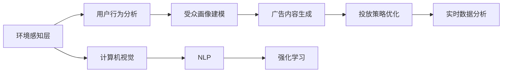

                 

## 1. 背景介绍

在数字化时代，传统的户外广告牌面临着观众流失、效果难以评估等挑战。为解决这些问题，智能广告牌应运而生。通过搭载AI技术，智能广告牌能够实现更高效的个性化广告投放，显著提升广告的吸引力和效果。本文将详细介绍AI驱动的智能广告牌技术原理及其实际应用。

## 2. 核心概念与联系

### 2.1 核心概念概述

**智能广告牌(Smart Billboards)**：指通过搭载AI技术，能够根据实时环境数据和目标受众特性，动态生成个性化广告内容的户外广告牌。

**AI驱动广告投放(AI-powered Ad Placement)**：利用机器学习、深度学习等AI技术，对广告受众和环境数据进行分析，自动生成最优广告投放策略的过程。

**个性化推荐系统(Personalized Recommendation System)**：根据用户行为和偏好，推荐合适的广告内容，提升用户对广告的兴趣和参与度。

**实时数据分析(Real-time Data Analysis)**：对实时采集的环境数据和用户反馈进行分析和挖掘，优化广告内容和投放策略。

**计算机视觉(Computer Vision)**：通过对广告牌实时拍摄的图像进行分析，识别场景中的人物、车辆等信息，为广告投放提供依据。

**自然语言处理(Natural Language Processing, NLP)**：对广告牌上的文字内容进行自然语言理解，提取广告主题、风格等关键信息。

**强化学习(Reinforcement Learning, RL)**：利用强化学习算法，动态调整广告投放策略，提高广告投放效果。

### 2.2 核心概念原理和架构的 Mermaid 流程图



此图展示了AI驱动智能广告牌的总体架构，即：

1. 环境感知层(A)：通过摄像头等设备实时捕捉广告牌周围的环境信息。
2. 用户行为分析(B)：通过分析用户行为数据，构建受众画像。
3. 受众画像建模(C)：结合环境信息，对受众特征进行建模。
4. 广告内容生成(D)：根据受众画像和环境信息生成个性化广告内容。
5. 投放策略优化(E)：利用强化学习算法优化广告投放策略。
6. 实时数据分析(F)：对实时数据进行分析，反馈优化投放策略。
7. 计算机视觉(G)：对环境图像进行分析，提取有价值信息。
8. NLP(H)：对广告内容进行自然语言处理，提取关键信息。
9. 强化学习(I)：利用奖励机制指导策略优化，提高投放效果。

## 3. 核心算法原理 & 具体操作步骤

### 3.1 算法原理概述

AI驱动智能广告牌系统基于多个核心算法，共同协作实现广告的个性化投放。算法整体框架如下：

1. **环境感知层**：使用计算机视觉技术对广告牌周围的环境图像进行实时分析，提取有用的信息。
2. **用户行为分析**：通过收集用户的行为数据，如点击、停留时间等，分析受众的兴趣和偏好。
3. **受众画像建模**：结合环境信息，建立用户画像模型，描述用户在不同场景下的行为特征。
4. **广告内容生成**：利用NLP技术，结合受众画像和环境信息，生成符合用户兴趣的广告内容。
5. **投放策略优化**：使用强化学习算法，根据实时反馈调整投放策略，优化广告效果。

### 3.2 算法步骤详解

**步骤1: 环境感知**

智能广告牌搭载高清摄像头等设备，实时捕捉广告牌周围的环境图像。计算机视觉算法对图像进行预处理，如降噪、裁剪等，然后提取关键信息，如行人、车辆、天气等。

**步骤2: 用户行为分析**

广告牌下方安装的传感器可以记录用户行为数据，如停留时间、点击次数等。将这些数据存储到数据库中，供后续分析和建模使用。

**步骤3: 受众画像建模**

利用机器学习算法，结合环境信息对用户行为数据进行分析，建立用户画像模型。该模型描述了用户在不同场景下的行为特征，如喜欢购物的用户、需要交通建议的用户等。

**步骤4: 广告内容生成**

根据受众画像和环境信息，利用自然语言处理技术生成符合用户兴趣的广告内容。广告内容可以包括文字、图片、视频等多种形式。

**步骤5: 投放策略优化**

使用强化学习算法，根据实时反馈调整广告投放策略。例如，优化广告的展示位置、时间、频率等，以最大化广告效果。

### 3.3 算法优缺点

**优点：**

1. **高效性**：自动化广告投放流程，大大减少人工干预，提高广告投放效率。
2. **个性化**：根据用户行为和环境信息生成个性化广告内容，提升用户对广告的兴趣和参与度。
3. **实时性**：通过实时数据分析，动态调整广告策略，适应多变的市场环境。
4. **精准性**：强化学习算法优化广告投放策略，确保广告精准投放。

**缺点：**

1. **数据隐私问题**：广告牌下方传感器采集用户行为数据，可能涉及隐私问题。
2. **计算复杂度**：涉及多个核心算法，计算复杂度较高，需要高性能设备支持。
3. **模型偏差**：用户画像模型和广告内容生成依赖于大量数据，可能存在模型偏差。
4. **环境适应性**：广告牌周围环境复杂多变，模型适应性要求较高。

### 3.4 算法应用领域

AI驱动智能广告牌技术可以广泛应用于以下多个领域：

1. **零售业**：在商场、超市等场景中，根据顾客的行为特征生成个性化广告，提高销售转化率。
2. **交通行业**：在高速公路、交通枢纽等地方，根据天气、交通流量等信息投放实时广告，优化出行体验。
3. **旅游业**：在旅游景点、车站等地方，根据游客行为数据投放个性化广告，提升旅游体验。
4. **医疗行业**：在医院、诊所等地方，根据患者的行为数据生成广告，推荐医疗服务。
5. **金融行业**：在银行、证券公司等地方，根据客户行为数据生成广告，推荐金融产品。

## 4. 数学模型和公式 & 详细讲解 & 举例说明

### 4.1 数学模型构建

广告牌环境感知层的核心算法包括计算机视觉和NLP技术，这些技术涉及多个数学模型和算法。以下以计算机视觉中的图像分类任务为例，介绍其数学模型和算法。

**目标**：给定一张图像，预测其类别。

**模型**：卷积神经网络(CNN)，如ResNet、VGG等。

**输入**：图像像素矩阵$X$，大小为$n \times n \times 3$。

**输出**：类别预测向量$Y$，大小为$c$，其中$c$为类别数量。

**损失函数**：交叉熵损失函数，定义如下：

$$
L(Y, \hat{Y}) = -\frac{1}{N} \sum_{i=1}^N \sum_{j=1}^c y_{ij} \log \hat{y}_{ij}
$$

其中，$y_{ij}$表示第$i$个样本属于第$j$类别的真实标签，$\hat{y}_{ij}$表示模型预测的第$i$个样本属于第$j$类别的概率。

### 4.2 公式推导过程

以CNN模型为例，公式推导如下：

1. 输入图像$X$通过多个卷积层和池化层处理，得到特征图$F$。
2. 特征图$F$经过全连接层映射到输出向量$Y$。
3. 定义交叉熵损失函数$L(Y, \hat{Y})$，其中$Y$为真实标签，$\hat{Y}$为模型预测。

具体推导过程如下：

$$
L(Y, \hat{Y}) = -\frac{1}{N} \sum_{i=1}^N \sum_{j=1}^c y_{ij} \log \hat{y}_{ij}
$$

### 4.3 案例分析与讲解

以一个简单的广告牌环境为例，分析AI驱动智能广告牌的工作过程：

1. **环境感知**：广告牌下方安装的摄像头捕捉周围环境图像。
2. **用户行为分析**：传感器记录行人停留时间、点击次数等数据。
3. **受众画像建模**：结合天气信息，分析用户行为，构建用户画像模型。
4. **广告内容生成**：根据用户画像和天气信息，生成符合用户兴趣的广告内容。
5. **投放策略优化**：使用强化学习算法，优化广告投放策略，最大化广告效果。

## 5. 项目实践：代码实例和详细解释说明

### 5.1 开发环境搭建

**环境要求**：
- Python 3.8+
- CUDA 10.2+
- cuDNN 7.6.5.32+
- TensorFlow 2.4+
- OpenCV 4.5.1.48+
- scikit-learn 0.24.2
- PyTorch 1.7.1
- Keras 2.4.3

**依赖安装**：
```bash
pip install torch torchvision
pip install opencv-python
pip install scikit-learn
pip install keras
```

### 5.2 源代码详细实现

以下是一个基于TensorFlow和Keras的智能广告牌系统的示例代码：

```python
import tensorflow as tf
from tensorflow.keras import layers, models
import cv2
import numpy as np
import pandas as pd
from sklearn.model_selection import train_test_split

# 定义广告牌图像分类模型
def create_model():
    model = models.Sequential()
    model.add(layers.Conv2D(32, (3, 3), activation='relu', input_shape=(32, 32, 3)))
    model.add(layers.MaxPooling2D((2, 2)))
    model.add(layers.Conv2D(64, (3, 3), activation='relu'))
    model.add(layers.MaxPooling2D((2, 2)))
    model.add(layers.Conv2D(128, (3, 3), activation='relu'))
    model.add(layers.MaxPooling2D((2, 2)))
    model.add(layers.Flatten())
    model.add(layers.Dense(128, activation='relu'))
    model.add(layers.Dense(10, activation='softmax'))
    return model

# 加载广告牌图像数据集
data = pd.read_csv('ad_image.csv')
X = data.iloc[:, 1:].values
y = data.iloc[:, 0].values
X_train, X_test, y_train, y_test = train_test_split(X, y, test_size=0.2)

# 定义图像预处理函数
def preprocess_image(image):
    image = cv2.resize(image, (32, 32))
    image = image / 255.0
    return image

# 创建模型并编译
model = create_model()
model.compile(optimizer='adam', loss='sparse_categorical_crossentropy', metrics=['accuracy'])

# 训练模型
model.fit(X_train, y_train, epochs=10, validation_data=(X_test, y_test))

# 保存模型
model.save('ad_classifier.h5')
```

### 5.3 代码解读与分析

**广告牌图像分类模型**：
- 使用CNN模型结构，包括多个卷积层、池化层和全连接层。
- 通过交叉熵损失函数进行训练，优化模型参数。

**数据集加载**：
- 从CSV文件中加载广告牌图像数据集，分为训练集和测试集。
- 使用train_test_split函数进行数据集划分，保留20%作为验证集。

**图像预处理**：
- 使用preprocess_image函数对广告牌图像进行预处理，包括缩放和归一化。

**模型训练与保存**：
- 定义训练集和测试集的输入输出，使用fit函数训练模型。
- 保存训练好的模型到文件中，方便后续使用。

## 6. 实际应用场景

### 6.1 零售业

在商场内，智能广告牌可以根据顾客的购物行为和停留时间，生成个性化广告，如促销信息、新品推荐等，提升顾客的购物体验。

### 6.2 交通行业

在高速公路上，智能广告牌可以展示实时路况信息、天气预报、交通建议等，帮助司机做出更好的行驶决策。

### 6.3 旅游业

在旅游景点，智能广告牌可以展示景点介绍、旅游攻略、当地特色等，吸引游客的兴趣和参与度。

### 6.4 未来应用展望

未来，AI驱动智能广告牌将进一步优化广告投放策略，提升广告效果。例如：

1. **多模态数据融合**：结合文本、语音、图像等多种数据，生成更加丰富的广告内容。
2. **实时动态优化**：根据实时反馈动态调整广告策略，提升广告效果。
3. **跨平台投放**：通过多平台广告投放，覆盖更广泛的用户群体。
4. **个性化推荐系统**：结合用户画像和行为数据，生成个性化广告，提升用户粘性。

## 7. 工具和资源推荐

### 7.1 学习资源推荐

**深度学习框架**：
- TensorFlow：广泛使用的深度学习框架，支持多种算法和模型。
- PyTorch：灵活性高的深度学习框架，适合研究和原型开发。

**计算机视觉库**：
- OpenCV：开源计算机视觉库，提供了丰富的图像处理和分析工具。
- Keras：高层次的深度学习框架，支持快速原型开发和模型部署。

**自然语言处理库**：
- NLTK：自然语言处理工具包，提供了文本处理、分析工具。
- spaCy：开源自然语言处理库，提供了高性能的文本分析和处理工具。

### 7.2 开发工具推荐

**开发工具**：
- Visual Studio Code：功能强大的IDE，支持Python、TensorFlow等开发环境。
- Jupyter Notebook：交互式编程环境，方便数据处理和模型调试。
- Anaconda：科学计算环境，方便管理和安装依赖库。

**数据处理工具**：
- Pandas：高效的数据处理库，支持数据清洗和分析。
- NumPy：数值计算库，支持高效的矩阵运算和数据处理。

### 7.3 相关论文推荐

**计算机视觉**：
- [ImageNet Classification with Deep Convolutional Neural Networks](https://arxiv.org/abs/1409.1556)
- [Very Deep Convolutional Networks for Large-Scale Image Recognition](https://arxiv.org/abs/1409.1556)

**自然语言处理**：
- [Attention is All You Need](https://arxiv.org/abs/1706.03762)
- [Transformers: State-of-the-Art Machine Translation with Attention](https://arxiv.org/abs/1910.03747)

## 8. 总结：未来发展趋势与挑战

### 8.1 研究成果总结

AI驱动智能广告牌技术在多个领域取得了显著效果，提升了广告的个性化和效果。其主要研究成果包括：

1. **高效广告投放**：自动化广告投放流程，提高广告投放效率。
2. **个性化推荐系统**：根据用户行为和环境信息生成个性化广告，提升用户粘性。
3. **实时动态优化**：根据实时反馈动态调整广告策略，提升广告效果。

### 8.2 未来发展趋势

未来，AI驱动智能广告牌技术将呈现以下发展趋势：

1. **多模态融合**：结合文本、语音、图像等多种数据，生成更加丰富的广告内容。
2. **实时动态优化**：根据实时反馈动态调整广告策略，提升广告效果。
3. **跨平台投放**：通过多平台广告投放，覆盖更广泛的用户群体。
4. **个性化推荐系统**：结合用户画像和行为数据，生成个性化广告，提升用户粘性。

### 8.3 面临的挑战

AI驱动智能广告牌技术在发展过程中，仍面临以下挑战：

1. **数据隐私问题**：广告牌下方传感器采集用户行为数据，可能涉及隐私问题。
2. **计算复杂度**：涉及多个核心算法，计算复杂度较高，需要高性能设备支持。
3. **模型偏差**：用户画像模型和广告内容生成依赖于大量数据，可能存在模型偏差。
4. **环境适应性**：广告牌周围环境复杂多变，模型适应性要求较高。

### 8.4 研究展望

为应对上述挑战，未来需要从以下几方面进行研究：

1. **数据隐私保护**：采用数据匿名化、差分隐私等技术，保护用户隐私。
2. **高效计算优化**：采用模型剪枝、量化等技术，优化计算复杂度。
3. **多场景适应性**：提升模型在不同场景下的适应性，应对复杂多变的环境。

## 9. 附录：常见问题与解答

**Q1: 智能广告牌的优势和劣势是什么？**

**A1**：智能广告牌的优势包括：
- 高效性：自动化广告投放流程，提高广告投放效率。
- 个性化：根据用户行为和环境信息生成个性化广告，提升用户粘性。
- 实时性：根据实时反馈动态调整广告策略，提升广告效果。

劣势包括：
- 数据隐私问题：广告牌下方传感器采集用户行为数据，可能涉及隐私问题。
- 计算复杂度：涉及多个核心算法，计算复杂度较高，需要高性能设备支持。
- 模型偏差：用户画像模型和广告内容生成依赖于大量数据，可能存在模型偏差。
- 环境适应性：广告牌周围环境复杂多变，模型适应性要求较高。

**Q2: 如何提升智能广告牌的投放效果？**

**A2**：提升智能广告牌的投放效果可以从以下几个方面入手：
- **数据质量**：保证广告牌下方传感器采集的数据质量，减少噪声和异常数据。
- **模型优化**：采用模型剪枝、量化等技术，优化计算复杂度，提升模型性能。
- **实时反馈**：结合实时数据分析，动态调整广告策略，提升广告效果。
- **多模态融合**：结合文本、语音、图像等多种数据，生成更加丰富的广告内容。

**Q3: 智能广告牌是否适用于所有场景？**

**A3**：智能广告牌适用于多种场景，但其效果和适用性取决于广告牌的具体位置和环境。例如：
- 在商场内，智能广告牌可以根据顾客的购物行为和停留时间，生成个性化广告，如促销信息、新品推荐等。
- 在高速公路上，智能广告牌可以展示实时路况信息、天气预报、交通建议等，帮助司机做出更好的行驶决策。
- 在旅游景点，智能广告牌可以展示景点介绍、旅游攻略、当地特色等，吸引游客的兴趣和参与度。

**Q4: 智能广告牌是否存在技术局限？**

**A4**：智能广告牌存在一定的技术局限，主要包括以下几个方面：
- 数据隐私问题：广告牌下方传感器采集用户行为数据，可能涉及隐私问题。
- 计算复杂度：涉及多个核心算法，计算复杂度较高，需要高性能设备支持。
- 模型偏差：用户画像模型和广告内容生成依赖于大量数据，可能存在模型偏差。
- 环境适应性：广告牌周围环境复杂多变，模型适应性要求较高。

尽管存在这些技术局限，但智能广告牌仍然具有显著优势，并且在多个领域取得了显著效果。通过不断优化和改进，智能广告牌技术将进一步提升广告的个性化和效果，为广告主提供更高效的投放方式。

---

作者：禅与计算机程序设计艺术 / Zen and the Art of Computer Programming

