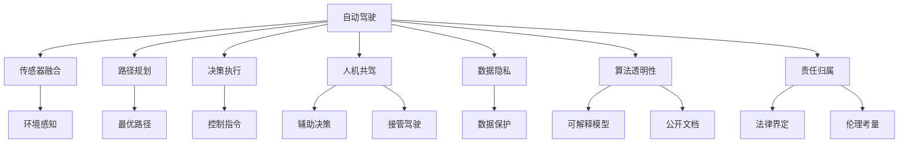

                 

# AI驱动的自动驾驶:技术与伦理的平衡

## 1. 背景介绍

### 1.1 问题由来
随着人工智能技术的飞速发展，自动驾驶领域也取得了显著的进步。自动驾驶技术旨在通过AI系统来模拟人类驾驶行为，实现车辆的自主导航和交通控制。然而，自动驾驶技术的发展也引发了一系列伦理和社会问题，例如数据隐私、算法透明性、责任归属等。这些问题不仅仅是技术挑战，更关乎公共安全、公平性和道德伦理，需要技术开发者、法律专家和公众共同思考和讨论。

### 1.2 问题核心关键点
自动驾驶技术的核心在于构建一个可以自主感知环境、决策规划和执行的AI系统。该系统需要融合传感器数据、地图信息和高性能计算，才能在复杂多变的交通场景中保持高效率和安全性。然而，技术发展的同时，必须考虑到伦理和社会影响，确保自动驾驶系统不仅高效，而且公平、透明和可控。

本文将从自动驾驶技术的核心算法原理出发，探讨如何在技术进步与伦理挑战之间找到平衡点，旨在为未来的自动驾驶系统构建提供更多思考和建议。

## 2. 核心概念与联系

### 2.1 核心概念概述

为更好地理解自动驾驶技术的伦理与技术平衡，本节将介绍几个密切相关的核心概念：

- 自动驾驶（Autonomous Driving, AD）：利用人工智能技术，使车辆能够在无人工直接控制的情况下，完成行驶、停车、导航等驾驶任务。

- 传感器融合（Sensor Fusion）：通过整合摄像头、雷达、激光雷达等多种传感器数据，获取全面、准确的环境感知信息，支撑自动驾驶决策。

- 路径规划（Path Planning）：利用高精度地图和实时交通数据，规划最优的行驶路径，确保车辆在复杂交通环境中安全行驶。

- 决策执行（Decision Execution）：基于感知和路径规划的结果，实时调整车辆的控制指令，如加速、刹车、转向等，确保车辆按照最优路径行驶。

- 人机共驾（Human-Machine Collaboration, HMC）：在人机交互界面中，智能辅助驾驶员做出决策，或在紧急情况下接管驾驶，保障人车安全和舒适性。

- 数据隐私（Data Privacy）：在自动驾驶系统中，收集、存储和处理大量个人驾驶数据，如何保护这些数据的隐私和安全成为一大挑战。

- 算法透明性（Algorithm Transparency）：自动驾驶系统的决策过程往往是黑盒模型，如何提高决策过程的可解释性，让公众理解和信任系统，是当前的重要研究方向。

- 责任归属（Liability Assignment）：在自动驾驶事故中，如何界定车辆、系统、开发者和制造商的责任，是一个复杂的法律和伦理问题。

这些核心概念之间的逻辑关系可以通过以下Mermaid流程图来展示：



这个流程图展示了这个核心概念之间的联系：

1. 自动驾驶系统通过传感器融合获取环境信息，通过路径规划和决策执行进行行驶决策和控制。
2. 人机共驾通过辅助决策和接管驾驶机制，保障驾驶安全。
3. 数据隐私保护涉及数据的收集、存储和处理，保障用户隐私。
4. 算法透明性通过可解释模型和公开文档，提高系统决策的透明度。
5. 责任归属通过法律界定和伦理考量，解决事故责任问题。

这些概念共同构成了自动驾驶系统的技术框架，同时也为伦理和社会问题提供了思考的切入点。

## 3. 核心算法原理 & 具体操作步骤
### 3.1 算法原理概述

自动驾驶的核心算法包括环境感知、路径规划和决策执行三大部分。下面将详细介绍这三个部分的算法原理和具体操作步骤。

### 3.2 算法步骤详解

#### 3.2.1 环境感知算法

环境感知算法是自动驾驶系统的第一步，通过整合摄像头、雷达、激光雷达等多种传感器数据，构建车辆周围环境的模型。

**步骤一：传感器数据采集**
- 安装并配置摄像头、雷达、激光雷达等传感器，确保数据采集的精度和稳定性。
- 通过数据同步技术，将各传感器数据统一到时间戳和空间坐标系中。

**步骤二：多源数据融合**
- 使用卡尔曼滤波、粒子滤波等融合算法，将来自不同传感器的数据进行组合，消除冗余和噪声，生成全面的环境感知信息。
- 使用深度学习模型（如卷积神经网络CNN）对感知数据进行处理，提取特征，生成车辆周围环境的语义地图。

**步骤三：物体检测与跟踪**
- 使用目标检测算法（如YOLO、Faster R-CNN）在感知数据中识别出道路、车辆、行人等物体。
- 使用跟踪算法（如卡尔曼滤波、DeepSORT）对识别出的物体进行连续跟踪，确保其状态的稳定性和准确性。

#### 3.2.2 路径规划算法

路径规划算法是在环境感知的基础上，规划最优的行驶路径，确保车辆在复杂交通环境中安全行驶。

**步骤一：高精度地图构建**
- 收集道路、交通标志、车道线等高精度地图数据，生成全局地图和局部地图。
- 使用深度学习模型（如CNN、RNN）对地图数据进行处理，提取特征，生成语义地图。

**步骤二：路径规划算法选择**
- 根据车辆类型和任务需求，选择合适的路径规划算法（如A*、D*、RRT）。
- 利用实时传感器数据和动态地图信息，动态调整路径规划，确保车辆在变化环境中保持最优路径。

**步骤三：路径平滑与优化**
- 使用曲线拟合、平滑算法（如三次样条插值、贝塞尔曲线）对路径进行平滑处理，减少行驶抖动。
- 使用优化算法（如遗传算法、粒子群算法）对路径进行优化，提高行驶效率。

#### 3.2.3 决策执行算法

决策执行算法是在路径规划的基础上，实时调整车辆的控制指令，如加速、刹车、转向等，确保车辆按照最优路径行驶。

**步骤一：控制指令生成**
- 根据当前路径规划结果和车辆状态信息，生成控制指令（如加速、刹车、转向）。
- 使用PID控制器等动态控制系统理论，对控制指令进行优化，确保车辆平稳行驶。

**步骤二：实时监控与调整**
- 使用实时传感器数据和动态环境信息，持续监控车辆状态和周围环境，调整控制指令。
- 使用自适应巡航控制（ACC）、车道保持控制（LKA）等辅助驾驶系统，提高驾驶舒适性和安全性。

### 3.3 算法优缺点

自动驾驶算法的优点在于：

1. 提高道路安全性：自动驾驶系统能够减少因人为失误引起的交通事故，提高道路安全。
2. 提高交通效率：自动驾驶系统能够优化车辆行驶路径，减少拥堵，提高交通效率。
3. 提高舒适度：自动驾驶系统能够减少驾驶员的驾驶疲劳，提高驾驶舒适度。

自动驾驶算法的缺点在于：

1. 技术复杂度高：自动驾驶系统涉及多种传感器数据融合、路径规划、决策执行等技术，技术复杂度高。
2. 成本高：自动驾驶系统的开发和部署成本较高，需要高性能计算平台和传感器设备。
3. 数据隐私问题：自动驾驶系统需要收集大量个人驾驶数据，如何保护数据隐私成为一大挑战。
4. 算法透明性问题：自动驾驶系统的决策过程往往是黑盒模型，如何提高决策过程的可解释性，让公众理解和信任系统，是当前的重要研究方向。
5. 责任归属问题：在自动驾驶事故中，如何界定车辆、系统、开发者和制造商的责任，是一个复杂的法律和伦理问题。

### 3.4 算法应用领域

自动驾驶技术的应用领域非常广泛，涵盖了从城市道路到高速公路，从商用车辆到家用汽车，从物流配送到城市公交等众多场景。具体应用包括：

1. 智能交通管理：自动驾驶系统能够在交通管理中心进行智能调度，提高交通管理的效率和安全性。
2. 智能物流配送：自动驾驶车辆能够全天候、无间断地进行货物配送，提高物流效率。
3. 智能城市公交：自动驾驶公交系统能够提高公交运行效率，减少交通拥堵。
4. 无人驾驶出租车：自动驾驶出租车能够提供便捷的出行服务，提升出行体验。
5. 智能辅助驾驶：在现有车辆上搭载自动驾驶辅助系统，提高驾驶安全性和舒适性。

## 4. 数学模型和公式 & 详细讲解  
### 4.1 数学模型构建

自动驾驶系统涉及多种数学模型，以下是几个核心的数学模型及其构建方式：

- **环境感知模型**：使用CNN模型对感知数据进行处理，提取特征，生成语义地图。
- **路径规划模型**：使用A*算法进行最优路径搜索，生成全局路径规划结果。
- **决策执行模型**：使用PID控制器生成控制指令，动态调整车辆状态。

### 4.2 公式推导过程

#### 4.2.1 环境感知模型的推导

以CNN模型为例，假设输入为传感器数据 $x$，输出为语义地图 $y$。CNN模型的基本结构包括卷积层、池化层、全连接层等。

$$
y = \sigma(\text{Conv}(\text{Relu}(\text{Conv}(x) + b_1) + b_2) + c)
$$

其中，$\sigma$ 为激活函数，$\text{Conv}$ 为卷积操作，$\text{Relu}$ 为ReLU激活函数，$b_1$ 和 $b_2$ 为卷积核偏置，$c$ 为全连接层输出。

#### 4.2.2 路径规划模型的推导

以A*算法为例，假设起点为 $S$，终点为 $T$，$n$ 为节点数量，$g(n)$ 为起点到节点 $n$ 的距离，$h(n)$ 为节点 $n$ 到终点的估计距离。

A*算法的核心公式为：

$$
f(n) = g(n) + h(n)
$$

其中，$f(n)$ 为节点 $n$ 的代价函数，$g(n)$ 为启发式函数，$h(n)$ 为节点 $n$ 的估计代价。A*算法通过最小化 $f(n)$ 搜索最优路径。

#### 4.2.3 决策执行模型的推导

以PID控制器为例，假设车辆速度为 $v$，期望速度为 $v_{\text{ref}}$，误差为 $e$。PID控制器的基本结构包括比例项、积分项、微分项等。

$$
u = K_p e + K_i \int e dt + K_d \frac{de}{dt}
$$

其中，$u$ 为控制指令，$K_p$ 为比例系数，$K_i$ 为积分系数，$K_d$ 为微分系数，$e$ 为速度误差。

### 4.3 案例分析与讲解

以特斯拉的自动驾驶系统为例，展示其在环境感知、路径规划和决策执行方面的具体实现：

**环境感知**

特斯拉的自动驾驶系统通过集成多个传感器，包括摄像头、雷达、激光雷达等，实现全面的环境感知。系统使用多个深度学习模型进行感知数据处理，包括语义分割、目标检测等任务。系统还使用卡尔曼滤波算法对多源数据进行融合，生成全面的环境感知信息。

**路径规划**

特斯拉的自动驾驶系统使用A*算法进行路径规划，结合实时交通数据和动态地图信息，动态调整路径规划。系统使用三次样条插值算法对路径进行平滑处理，确保车辆行驶的平稳性。

**决策执行**

特斯拉的自动驾驶系统使用PID控制器生成控制指令，实时调整车辆的速度和方向。系统使用自适应巡航控制（ACC）和车道保持控制（LKA）等辅助驾驶系统，提高驾驶舒适性和安全性。

## 5. 项目实践：代码实例和详细解释说明
### 5.1 开发环境搭建

在进行自动驾驶系统开发前，我们需要准备好开发环境。以下是使用Python进行PyTorch开发的环境配置流程：

1. 安装Anaconda：从官网下载并安装Anaconda，用于创建独立的Python环境。

2. 创建并激活虚拟环境：
```bash
conda create -n pytorch-env python=3.8 
conda activate pytorch-env
```

3. 安装PyTorch：根据CUDA版本，从官网获取对应的安装命令。例如：
```bash
conda install pytorch torchvision torchaudio cudatoolkit=11.1 -c pytorch -c conda-forge
```

4. 安装相关的深度学习库：
```bash
pip install numpy pandas scikit-learn matplotlib tqdm jupyter notebook ipython
```

5. 安装相关的自动驾驶库：
```bash
pip install pyrosa robotpy simpy pyviz
```

完成上述步骤后，即可在`pytorch-env`环境中开始自动驾驶系统开发。

### 5.2 源代码详细实现

以下是使用PyTorch和OpenCV实现自动驾驶环境感知的代码实现：

```python
import cv2
import numpy as np
import torch

# 加载CNN模型
model = torch.load('path/to/model.pth')

# 加载摄像头数据
cap = cv2.VideoCapture(0)
while True:
    ret, frame = cap.read()
    # 将摄像头数据转换为Tensor格式
    frame_tensor = torch.from_numpy(frame).permute(2, 0, 1).float() / 255.0
    # 使用CNN模型进行感知数据处理
    with torch.no_grad():
        output = model(frame_tensor)
    # 可视化感知结果
    cv2.imshow('Frame', output.cpu().numpy() * 255)
    if cv2.waitKey(1) & 0xFF == ord('q'):
        break

cap.release()
cv2.destroyAllWindows()
```

### 5.3 代码解读与分析

以上代码展示了如何加载预训练的CNN模型，对摄像头数据进行感知处理，并可视化处理结果。代码的核心步骤如下：

1. 加载预训练的CNN模型。
2. 通过OpenCV库实时获取摄像头数据，并将其转换为Tensor格式。
3. 使用CNN模型对感知数据进行处理，输出语义地图。
4. 将处理结果可视化，并在摄像头数据上进行实时显示。

代码中还需要注意以下几点：

- 在处理摄像头数据时，需要进行数据预处理，如尺寸调整、归一化等。
- 使用PyTorch的无梯度模式（`with torch.no_grad()`）进行推理，以提高处理速度。
- 在可视化处理结果时，需要将输出数据转换回OpenCV可用的格式，并实时显示在摄像头上。

## 6. 实际应用场景
### 6.1 智能交通管理

智能交通管理是自动驾驶技术的重要应用场景之一。通过自动驾驶系统，可以实现交通流量优化、交通信号灯控制等，提高交通管理的效率和安全性。

在实际应用中，智能交通管理系统可以采用多种传感器和数据源，包括摄像头、雷达、激光雷达、GPS等，构建全局的交通感知网络。系统通过实时感知交通流量、车辆位置等信息，动态调整交通信号灯和车道，优化交通流动，减少拥堵。

### 6.2 智能物流配送

智能物流配送是自动驾驶技术的重要应用场景之一。自动驾驶车辆能够在全天候、无间断地进行货物配送，提高物流效率，降低配送成本。

在实际应用中，智能物流配送系统可以采用多种传感器和数据源，包括GPS、雷达、激光雷达、摄像头等，构建全局的物流感知网络。系统通过实时感知交通状况、车辆位置等信息，动态规划配送路线，优化配送效率。

### 6.3 智能城市公交

智能城市公交是自动驾驶技术的重要应用场景之一。自动驾驶公交车能够在城市道路上安全、高效地运行，提高公交运行效率，减少交通拥堵。

在实际应用中，智能城市公交系统可以采用多种传感器和数据源，包括GPS、雷达、激光雷达、摄像头等，构建全局的公交感知网络。系统通过实时感知公交位置、车辆状态等信息，动态调整公交路线，优化公交运行效率。

### 6.4 无人驾驶出租车

无人驾驶出租车是自动驾驶技术的重要应用场景之一。自动驾驶出租车能够提供便捷的出行服务，提高出行体验，降低出行成本。

在实际应用中，无人驾驶出租车系统可以采用多种传感器和数据源，包括GPS、雷达、激光雷达、摄像头等，构建全局的出租车感知网络。系统通过实时感知车辆位置、路况等信息，动态调整行驶路线，优化出租车运行效率。

## 7. 工具和资源推荐
### 7.1 学习资源推荐

为了帮助开发者系统掌握自动驾驶技术，以下是一些优质的学习资源：

1. Udacity《自动驾驶纳米学位》课程：由特斯拉和Udacity联合开发，涵盖了自动驾驶的核心技术和应用。
2. Stanford《自动驾驶系统》课程：斯坦福大学开设的自动驾驶课程，介绍了自动驾驶的原理、算法和实践。
3. 《Hands-On Autonomous Vehicle Development》书籍：介绍了自动驾驶车辆的设计、开发和部署，提供了丰富的代码示例和案例分析。
4. ROS（Robot Operating System）：开源机器人操作系统，提供了丰富的自动驾驶组件和工具，方便开发者进行开发和实验。
5. CARLA模拟器：自动驾驶车辆模拟器，能够模拟复杂的交通环境和车辆行为，帮助开发者进行测试和验证。

通过对这些资源的学习实践，相信你一定能够快速掌握自动驾驶技术的精髓，并用于解决实际的自动驾驶问题。

### 7.2 开发工具推荐

高效的开发离不开优秀的工具支持。以下是几款用于自动驾驶系统开发的常用工具：

1. PyTorch：基于Python的开源深度学习框架，灵活动态的计算图，适合快速迭代研究。大部分自动驾驶系统都基于PyTorch实现。
2. ROS：开源机器人操作系统，提供了丰富的自动驾驶组件和工具，方便开发者进行开发和实验。
3. Gazebo：仿真环境模拟器，能够模拟复杂的交通环境和车辆行为，帮助开发者进行测试和验证。
4. Pylane：基于PyTorch的自动驾驶库，提供了深度学习模型、传感器融合、路径规划等组件，方便开发者快速构建自动驾驶系统。
5. Carla simulator：自动驾驶车辆模拟器，能够模拟复杂的交通环境和车辆行为，帮助开发者进行测试和验证。

合理利用这些工具，可以显著提升自动驾驶系统开发的效率，加快创新迭代的步伐。

### 7.3 相关论文推荐

自动驾驶技术的发展源于学界的持续研究。以下是几篇奠基性的相关论文，推荐阅读：

1. "End-to-End Training for Self-Driving Cars"（2016）：提出了一种端到端的自动驾驶系统，能够在模拟环境和实际道路中实现稳定行驶。
2. "Carnegie Mellon University — Mobile Robots Group"（2008）：介绍了CMU自动驾驶研究小组的最新进展，涵盖了传感器融合、路径规划、决策执行等核心技术。
3. "Long Short-Term Memory"（1997）：提出了LSTM模型，为深度学习在时序数据处理中的应用奠定了基础，被广泛应用于自动驾驶系统的路径规划和决策执行。
4. "DNN for Vehicle Control by Example"（2014）：提出了基于深度神经网络的车辆控制方法，通过模仿驾驶示例实现自动驾驶。
5. "AlphaGo"（2016）：谷歌DeepMind研发的围棋AI，通过强化学习实现了人类顶尖水平的表现，为自动驾驶系统的决策执行提供了新的思路。

这些论文代表了大自动驾驶技术的发展脉络。通过学习这些前沿成果，可以帮助研究者把握学科前进方向，激发更多的创新灵感。

## 8. 总结：未来发展趋势与挑战
### 8.1 总结

本文对自动驾驶技术的核心算法原理进行了全面系统的介绍。首先阐述了自动驾驶技术的研究背景和意义，明确了技术进步在提升道路安全、交通效率和驾驶舒适性方面的独特价值。其次，从环境感知、路径规划和决策执行三大部分，详细讲解了自动驾驶算法的数学原理和具体操作步骤。最后，本文还广泛探讨了自动驾驶技术在智能交通管理、智能物流配送、智能城市公交等诸多领域的应用前景，展示了自动驾驶技术的广阔应用空间。

通过本文的系统梳理，可以看到，自动驾驶技术正逐步走向成熟，其核心算法已经在多个实际应用中得到验证。未来，伴随技术进步和数据积累，自动驾驶系统将更加智能、安全和可靠，为人类社会的数字化转型带来深远影响。

### 8.2 未来发展趋势

展望未来，自动驾驶技术将呈现以下几个发展趋势：

1. 多模态融合：未来的自动驾驶系统将融合多种传感器数据（如摄像头、雷达、激光雷达、GPS等），提高环境感知的全面性和准确性。
2. 实时数据处理：未来的自动驾驶系统将具备实时处理大量传感器数据的能力，能够动态调整行驶策略，应对复杂的交通环境。
3. 联邦学习：未来的自动驾驶系统将采用联邦学习技术，将数据分布式存储在云端和边缘设备中，提升系统安全性和隐私保护。
4. 人工智能辅助驾驶：未来的自动驾驶系统将融合人工智能技术，提高系统决策的智能性和准确性，增强人机协同能力。
5. 伦理和社会问题解决：未来的自动驾驶系统将更加注重伦理和社会问题，通过透明性、公平性和责任归属等手段，保障系统的高效和可靠运行。

以上趋势凸显了自动驾驶技术的广阔前景。这些方向的探索发展，必将进一步提升自动驾驶系统的性能和应用范围，为人类社会的数字化转型带来深远影响。

### 8.3 面临的挑战

尽管自动驾驶技术已经取得了显著进展，但在迈向更加智能化、普适化应用的过程中，仍面临诸多挑战：

1. 数据隐私问题：自动驾驶系统需要收集大量个人驾驶数据，如何保护数据隐私成为一大挑战。
2. 算法透明性问题：自动驾驶系统的决策过程往往是黑盒模型，如何提高决策过程的可解释性，让公众理解和信任系统，是当前的重要研究方向。
3. 责任归属问题：在自动驾驶事故中，如何界定车辆、系统、开发者和制造商的责任，是一个复杂的法律和伦理问题。
4. 技术复杂度高：自动驾驶系统涉及多种传感器数据融合、路径规划、决策执行等技术，技术复杂度高。
5. 环境适应性问题：自动驾驶系统在复杂多变的交通环境中，如何保持高效率和安全性，是当前的重要研究方向。

这些挑战需要技术开发者、法律专家和公众共同思考和解决，才能实现自动驾驶技术的广泛应用和普及。

### 8.4 研究展望

面对自动驾驶技术面临的种种挑战，未来的研究需要在以下几个方面寻求新的突破：

1. 探索无监督和半监督学习范式：摆脱对大规模标注数据的依赖，利用自监督学习、主动学习等无监督和半监督范式，最大限度利用非结构化数据，实现更加灵活高效的自动驾驶系统。
2. 开发更加参数高效的自动驾驶算法：开发更加参数高效的自动驾驶算法，在固定大部分预训练参数的同时，只更新极少量的任务相关参数，减少计算资源消耗。
3. 融合因果推断和强化学习技术：引入因果推断和强化学习思想，增强自动驾驶系统建立稳定因果关系的能力，学习更加普适、鲁棒的语言表征，从而提升系统泛化性和抗干扰能力。
4. 引入外部知识库和专家知识：将符号化的先验知识，如知识图谱、逻辑规则等，与神经网络模型进行巧妙融合，引导自动驾驶过程学习更准确、合理的驾驶策略。
5. 探索多模态融合和联邦学习技术：融合多种传感器数据和联邦学习技术，提升系统感知能力和数据处理能力，提高系统安全性和隐私保护。

这些研究方向的探索，必将引领自动驾驶技术迈向更高的台阶，为构建安全、可靠、可解释、可控的智能系统铺平道路。面向未来，自动驾驶技术还需要与其他人工智能技术进行更深入的融合，如知识表示、因果推理、强化学习等，多路径协同发力，共同推动自动驾驶系统的进步。只有勇于创新、敢于突破，才能不断拓展自动驾驶技术的边界，让智能技术更好地造福人类社会。

## 9. 附录：常见问题与解答
### 9.1 常见问题与解答

**Q1: 自动驾驶技术是否会完全取代人类驾驶？**

A: 自动驾驶技术的目标是通过智能化和自动化，提高道路安全性和交通效率，而不是完全取代人类驾驶。在某些特定场景下，人类驾驶员仍然需要发挥关键作用，例如复杂的城市交通环境、紧急情况等。因此，自动驾驶技术应该作为人类驾驶的有力补充，而非替代。

**Q2: 自动驾驶技术的安全性如何保障？**

A: 自动驾驶技术的安全性保障需要从多个层面进行考虑。首先，需要采用多种传感器和数据源，构建全局的感知网络，提高环境感知的全面性和准确性。其次，需要引入深度学习和强化学习技术，提高决策过程的智能性和可靠性。最后，需要引入联邦学习和加密技术，保护数据隐私和系统安全。

**Q3: 自动驾驶技术在应对复杂交通环境时，如何保证高效率和安全性？**

A: 自动驾驶技术在应对复杂交通环境时，需要综合考虑多种因素，包括实时数据处理、路径规划、决策执行等。首先，需要采用实时数据处理技术，动态调整行驶策略，应对复杂的交通环境。其次，需要引入联邦学习技术，将数据分布式存储在云端和边缘设备中，提升系统安全性和隐私保护。最后，需要引入因果推断和强化学习技术，增强系统决策的智能性和可靠性。

**Q4: 自动驾驶技术在实际应用中，如何处理数据隐私问题？**

A: 自动驾驶技术在实际应用中，需要处理大量的个人驾驶数据。为了保护数据隐私，可以采用联邦学习和差分隐私等技术，将数据分布式存储和处理，保护数据隐私。同时，需要引入数据匿名化和加密技术，对数据进行预处理，确保数据安全性。

**Q5: 自动驾驶技术在实际应用中，如何处理算法透明性问题？**

A: 自动驾驶技术在实际应用中，需要处理决策过程的透明性问题。为了提高决策过程的可解释性，可以引入可解释模型和决策树等技术，对决策过程进行可视化，让公众理解和信任系统。同时，需要引入公开文档和透明性评估指标，确保系统的透明性。

总之，自动驾驶技术的发展需要技术开发者、法律专家和公众共同思考和解决，才能实现技术的广泛应用和普及。只有不断探索和突破，才能实现技术的全面发展，为人类社会的数字化转型带来深远影响。

---

作者：禅与计算机程序设计艺术 / Zen and the Art of Computer Programming

