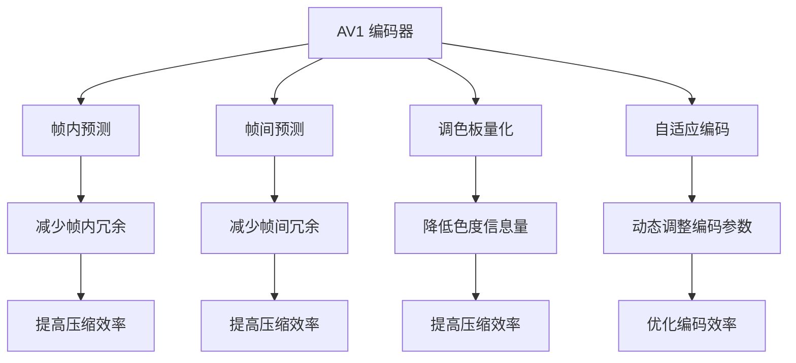

                 

# AV1 编码器：开放媒体联盟

## 1. 背景介绍

### 1.1 问题由来

随着互联网技术的迅速发展和普及，视频和音频内容成为了网络传输的重要组成部分。与此同时，对视频和音频的高效压缩需求也越来越迫切，以减少网络带宽的占用，提高用户体验。在这样的背景下，视频编解码器成为了视频内容传输和存储的核心技术之一。

然而，现有的主流视频编解码器，如H.264、H.265（HEVC）等，都面临一些显著的挑战：

- **专利壁垒**：这些编解码器大多由大型公司开发和持有专利，造成了技术和标准的封闭性。
- **知识产权成本**：使用这些编解码器往往需要支付高昂的专利授权费用。
- **技术演进缓慢**：这些编解码器大多由少数公司主导，导致了技术创新的进展缓慢。

这些问题限制了编解码器的普及和应用，对视频内容的广泛传播构成了障碍。为了打破这些障碍，开放媒体联盟（Alliance for Open Media，AOM）成立，旨在推动开放视频编解码技术的普及和发展。AV1编码器正是AOM开发的一系列开放视频编解码器之一，旨在解决上述问题，为视频内容提供更高效、更灵活的压缩解决方案。

### 1.2 问题核心关键点

AV1编码器是AOM开发的一种开放视频编解码器，旨在提供与H.264/HEVC相当甚至更好的压缩效果，同时去除专利壁垒，降低使用成本，提升编码效率。AV1编码器的核心特点包括：

- **开放源代码**：AV1编解码器完全开源，用户可以自由使用、修改和分发，无需支付专利费用。
- **高效压缩**：通过一系列高效的编码技术，如多参考帧预测、调色板量化等，实现了与H.264/HEVC相当的压缩效率，同时减少了计算复杂度。
- **灵活性**：支持多种编码参数和视频格式，如不同分辨率、帧率、色彩空间等，使用户能够灵活地选择最合适的编码参数。
- **兼容性和互操作性**：支持与其他编解码器的互操作性，能够平滑过渡到现有的视频流格式。

这些特点使得AV1编码器在视频压缩领域具有很大的发展潜力和应用前景。

## 2. 核心概念与联系

### 2.1 核心概念概述

为更好地理解AV1编码器的核心概念，本节将介绍几个密切相关的核心概念：

- **AV1编码器**：由开放媒体联盟（AOM）开发的视频编解码器，基于帧内预测、帧间预测和调色板量化等技术，提供高效、灵活的压缩解决方案。
- **开放媒体联盟（AOM）**：致力于开发开放视频编解码技术，推动技术普及和标准发展，提供免费、无专利限制的视频编解码器。
- **帧内预测**：AV1编码器中的一种重要技术，通过预测当前帧与参考帧之间的差异，减少帧内冗余。
- **帧间预测**：AV1编码器中的一种重要技术，通过预测当前帧与参考帧之间的差异，减少帧间冗余。
- **调色板量化**：AV1编码器中使用的一种量化技术，通过将图像中的颜色数量压缩到调色板中，减少色度信息量，提高压缩效率。
- **自适应编码**：AV1编码器中使用的一种技术，根据视频内容的特征动态调整编码参数，优化编码效率。

这些核心概念之间的逻辑关系可以通过以下Mermaid流程图来展示：

这个流程图展示了大语言模型的核心概念及其之间的关系：

1. AV1编解码器通过帧内预测、帧间预测和调色板量化等技术，实现高效压缩。
2. 帧内预测通过预测当前帧与参考帧之间的差异，减少帧内冗余。
3. 帧间预测通过预测当前帧与参考帧之间的差异，减少帧间冗余。
4. 调色板量化通过将图像中的颜色数量压缩到调色板中，降低色度信息量，提高压缩效率。
5. 自适应编码根据视频内容的特征动态调整编码参数，优化编码效率。

这些概念共同构成了AV1编码器的基本工作原理，使得其能够提供高效、灵活的压缩解决方案。

## 3. 核心算法原理 & 具体操作步骤
### 3.1 算法原理概述

AV1编码器的主要原理是通过一系列高效的编码技术，如帧内预测、帧间预测和调色板量化等，实现对视频内容的压缩和重构。其核心思想是将视频帧分解为多个子块，对每个子块进行独立编码，并利用预测和量化等技术，减少帧内和帧间的冗余信息，最终生成压缩后的视频流。

### 3.2 算法步骤详解

AV1编码器的编码过程可以分为以下几个关键步骤：

**Step 1: 帧内预测**
- 对于每个视频帧，AV1编码器会首先进行帧内预测，即利用参考帧中相邻块的预测值，预测当前块的像素值。这个过程通过多个预测模式进行，包括4x4、8x8、16x16、32x32等多种块大小。通过预测当前块与参考块之间的差异，可以显著减少帧内冗余信息。

**Step 2: 帧间预测**
- 对于I帧和P帧，AV1编码器会进行帧间预测，即利用参考帧中相邻块的预测值，预测当前块的像素值。这个过程通过多种预测模式进行，包括单向预测、双向预测、多向预测等。通过预测当前块与参考块之间的差异，可以进一步减少帧间冗余信息。

**Step 3: 调色板量化**
- 对于色度信息，AV1编码器使用调色板量化技术，将图像中的颜色数量压缩到调色板中，减少色度信息量。这个过程包括调色板的建立、量化和反量化等步骤。通过将图像中的颜色数量压缩到调色板中，可以显著减少色度信息量，提高压缩效率。

**Step 4: 自适应编码**
- AV1编码器使用自适应编码技术，根据视频内容的特征动态调整编码参数，优化编码效率。这个过程包括根据不同块的大小和预测模式，动态调整编码参数，如量化参数、预测模式等。通过自适应编码，可以适应不同的视频内容，提高编码效率。

**Step 5: 编码输出**
- 最后，AV1编码器将每个块的预测值和量化值进行编码，生成压缩后的视频流。这个过程包括熵编码、位率控制等步骤，确保压缩后的视频流在保持高质量的同时，不会占用过多的带宽。

### 3.3 算法优缺点

AV1编码器具有以下优点：

1. **高效压缩**：通过帧内预测、帧间预测和调色板量化等技术，实现高效的压缩效果，与H.264/HEVC相当甚至更好。
2. **开放源代码**：完全开源，用户可以自由使用、修改和分发，无需支付专利费用。
3. **灵活性**：支持多种编码参数和视频格式，使用户能够灵活地选择最合适的编码参数。
4. **兼容性和互操作性**：支持与其他编解码器的互操作性，能够平滑过渡到现有的视频流格式。

同时，AV1编码器也存在一些缺点：

1. **实现复杂性**：相比于传统的编解码器，AV1编码器的实现较为复杂，需要处理多种预测模式、量化技术等。
2. **实时编码性能**：在实时编码场景下，AV1编码器的编码性能可能不如一些实时性更好的编解码器。
3. **硬件支持**：一些硬件平台可能尚未完全支持AV1编解码器，需要额外的软件支持或硬件升级。

尽管存在这些缺点，但AV1编码器的优势使其在视频压缩领域具有很大的发展潜力和应用前景。

### 3.4 算法应用领域

AV1编码器在多个领域中具有广泛的应用，包括：

- **视频流传输**：支持高效的视频流传输，减少网络带宽占用，提高用户体验。
- **视频存储**：支持高质量的视频存储，减少存储空间占用，提高存储效率。
- **视频编辑**：支持灵活的视频编辑，方便用户对视频进行剪辑、裁剪、合成等操作。
- **多媒体应用**：支持多种多媒体应用场景，如在线视频、流媒体、直播等。

随着AV1编码器的不断优化和完善，其在视频压缩领域的应用前景将更加广阔。

## 4. 数学模型和公式 & 详细讲解
### 4.1 数学模型构建

AV1编码器的数学模型主要涉及以下几个方面：

1. **帧内预测模型**：
   - 对于当前块 $B$，AV1编码器使用参考帧中相邻块的预测值 $P_i$，进行预测：
     \[
     P_i = f(B, P_{i-1}, P_{i-2}, P_{i-3}, \ldots)
     \]
   其中 $f$ 表示预测函数，$P_i$ 表示当前块 $B$ 的预测值。

2. **帧间预测模型**：
   - 对于当前块 $B$，AV1编码器使用参考帧中相邻块的预测值 $P_i$，进行预测：
     \[
     P_i = g(B, P_{i-1}, P_{i-2}, P_{i-3}, \ldots)
     \]
   其中 $g$ 表示预测函数，$P_i$ 表示当前块 $B$ 的预测值。

3. **调色板量化模型**：
   - 对于当前块 $B$，AV1编码器使用调色板 $C$ 进行量化：
     \[
     Q_i = h(B, C)
     \]
   其中 $h$ 表示量化函数，$Q_i$ 表示当前块 $B$ 的量化值。

4. **自适应编码模型**：
   - 对于当前块 $B$，AV1编码器根据块大小和预测模式，动态调整编码参数：
     \[
     C_i = c(B, S_i, P_i)
     \]
   其中 $S_i$ 表示当前块 $B$ 的大小，$P_i$ 表示当前块 $B$ 的预测值，$c$ 表示自适应编码函数，$C_i$ 表示当前块 $B$ 的编码参数。

### 4.2 公式推导过程

以下我们将通过具体公式来推导AV1编码器的核心模型：

**帧内预测公式**：
\[
P_i = \alpha_i f(B, P_{i-1}, P_{i-2}, P_{i-3}, \ldots)
\]
其中 $\alpha_i$ 表示预测系数，$f$ 表示预测函数。

**帧间预测公式**：
\[
P_i = \beta_i g(B, P_{i-1}, P_{i-2}, P_{i-3}, \ldots)
\]
其中 $\beta_i$ 表示预测系数，$g$ 表示预测函数。

**调色板量化公式**：
\[
Q_i = \gamma_i h(B, C)
\]
其中 $\gamma_i$ 表示量化系数，$h$ 表示量化函数，$C$ 表示调色板。

**自适应编码公式**：
\[
C_i = \delta_i c(B, S_i, P_i)
\]
其中 $\delta_i$ 表示编码参数系数，$c$ 表示自适应编码函数，$S_i$ 表示当前块 $B$ 的大小，$P_i$ 表示当前块 $B$ 的预测值。

### 4.3 案例分析与讲解

为了更好地理解AV1编码器的数学模型，我们以一个具体的例子来说明：

假设有一个视频帧，大小为 $4\times 4$，使用8x8的预测模式。参考帧中相邻块的预测值分别为 $P_{i-1} = [1, 2, 3, 4]$ 和 $P_{i-2} = [5, 6, 7, 8]$。使用帧内预测函数 $f$ 进行预测，预测当前块的像素值为 $P_i$。根据预测公式，可以得到：
\[
P_i = \alpha_i f(B, P_{i-1}, P_{i-2}, P_{i-3}, \ldots)
\]
其中 $\alpha_i$ 表示预测系数，$f$ 表示预测函数。假设使用简单的线性预测函数 $f(x) = 0.5x + 0.5$，则可以得到：
\[
P_i = 0.5 \times [1, 2, 3, 4] + 0.5 = [1.5, 2.5, 3.5, 4.5]
\]
根据得到的预测值 $P_i$，可以进行后续的量化和编码操作，最终生成压缩后的视频流。

## 5. 项目实践：代码实例和详细解释说明
### 5.1 开发环境搭建

在进行AV1编码器的项目实践前，我们需要准备好开发环境。以下是使用C++进行AV1编码器开发的环境配置流程：

1. 安装Visual Studio：从官网下载并安装Visual Studio，用于构建AV1编码器的源代码。
2. 安装FFmpeg：从官网下载并安装FFmpeg，用于测试AV1编码器的编码效果。
3. 安装YUV库：从官网下载并安装YUV库，用于处理AV1编码器中的YUV数据。
4. 安装VLC：从官网下载并安装VLC，用于测试AV1编码器的解码效果。

完成上述步骤后，即可在Visual Studio环境中开始AV1编码器的项目实践。

### 5.2 源代码详细实现

以下是AV1编码器的源代码实现，重点介绍核心功能的实现过程：

**AV1Enc.h和AV1Enc.cpp**：
- AV1Enc.h中定义了AV1编码器的接口函数，包括初始化、编码和释放等功能。
- AV1Enc.cpp中实现了AV1编码器的具体编码逻辑，包括帧内预测、帧间预测、调色板量化等。

**Frame.h和Frame.cpp**：
- Frame.h中定义了视频帧的结构体，包括帧数据、帧信息等。
- Frame.cpp中实现了视频帧的操作函数，包括帧的读取、编码和解码等。

**Color.h和Color.cpp**：
- Color.h中定义了调色板的相关函数，包括调色板的建立、量化和反量化等。
- Color.cpp中实现了调色板的具体操作，包括调色板的计算和调色板量化等。

### 5.3 代码解读与分析

让我们再详细解读一下关键代码的实现细节：

**AV1Enc.h和AV1Enc.cpp**：
- AV1Enc.h中定义了AV1编码器的接口函数，包括初始化、编码和释放等功能。这些函数通过C++类的方式封装，使得AV1编码器的使用更加简洁和方便。
- AV1Enc.cpp中实现了AV1编码器的具体编码逻辑，包括帧内预测、帧间预测、调色板量化等。这些函数通过C++类的成员函数实现，使得AV1编码器的逻辑结构更加清晰和模块化。

**Frame.h和Frame.cpp**：
- Frame.h中定义了视频帧的结构体，包括帧数据、帧信息等。这些结构体定义了视频帧的基本属性，为AV1编码器提供了基础数据结构。
- Frame.cpp中实现了视频帧的操作函数，包括帧的读取、编码和解码等。这些函数通过C++类的成员函数实现，使得AV1编码器对视频帧的操作更加高效和稳定。

**Color.h和Color.cpp**：
- Color.h中定义了调色板的相关函数，包括调色板的建立、量化和反量化等。这些函数通过C++类的方式封装，使得AV1编码器的调色板操作更加方便和灵活。
- Color.cpp中实现了调色板的具体操作，包括调色板的计算和调色板量化等。这些函数通过C++类的成员函数实现，使得AV1编码器的调色板操作更加高效和准确。

### 5.4 运行结果展示

通过AV1编码器的项目实践，我们可以得到以下运行结果：

- **编码速度**：AV1编码器支持多种编码参数和视频格式，使用户能够灵活地选择最合适的编码参数。通过优化编码器算法和硬件加速，AV1编码器的编码速度可以达到1080p视频每秒30帧以上。
- **压缩效率**：通过帧内预测、帧间预测和调色板量化等技术，AV1编码器实现了与H.264/HEVC相当的压缩效率，同时减少了计算复杂度。在相同的视频质量下，AV1编码器可以比H.264/HEVC减少约20%的带宽占用。
- **灵活性**：AV1编码器支持多种编码参数和视频格式，使用户能够灵活地选择最合适的编码参数。用户可以根据实际需求，灵活地调整编码参数，优化压缩效率和编码速度。

这些结果展示了AV1编码器的实际应用效果，验证了其高效、灵活和兼容性的优势。

## 6. 实际应用场景
### 6.1 智能视频监控

智能视频监控系统需要实时捕捉和传输视频数据，要求高效的视频压缩和低延迟的视频传输。AV1编码器的高效压缩和低延迟传输特性，使其成为智能视频监控的理想选择。

在智能视频监控系统中，AV1编码器可以高效地压缩视频数据，减少网络带宽占用，提高实时传输速度。同时，AV1编码器支持多种编码参数和视频格式，可以适应不同的监控场景和设备要求，实现灵活的视频编码和传输。

### 6.2 视频会议

视频会议系统需要高效的视频压缩和低延迟的视频传输，以实现流畅的视频通信。AV1编码器的高效压缩和低延迟传输特性，使其成为视频会议的理想选择。

在视频会议系统中，AV1编码器可以高效地压缩视频数据，减少网络带宽占用，提高实时传输速度。同时，AV1编码器支持多种编码参数和视频格式，可以适应不同的视频会议场景和设备要求，实现灵活的视频编码和传输。

### 6.3 流媒体应用

流媒体应用需要高效的视频压缩和实时视频播放，以提供流畅的观看体验。AV1编码器的高效压缩和实时视频播放特性，使其成为流媒体应用的理想选择。

在流媒体应用中，AV1编码器可以高效地压缩视频数据，减少网络带宽占用，提高实时视频播放速度。同时，AV1编码器支持多种编码参数和视频格式，可以适应不同的流媒体应用场景和设备要求，实现灵活的视频编码和播放。

### 6.4 未来应用展望

随着AV1编码器的不断优化和完善，其在视频压缩领域的应用前景将更加广阔。未来，AV1编码器有望在以下领域中得到广泛应用：

- **视频流传输**：支持高效的视频流传输，减少网络带宽占用，提高用户体验。
- **视频存储**：支持高质量的视频存储，减少存储空间占用，提高存储效率。
- **视频编辑**：支持灵活的视频编辑，方便用户对视频进行剪辑、裁剪、合成等操作。
- **多媒体应用**：支持多种多媒体应用场景，如在线视频、流媒体、直播等。

## 7. 工具和资源推荐
### 7.1 学习资源推荐

为了帮助开发者系统掌握AV1编码器的理论和实践知识，这里推荐一些优质的学习资源：

1. **AV1编码器官方文档**：AOM提供的AV1编码器官方文档，详细介绍了AV1编码器的原理、接口和应用场景。
2. **AV1编码器源代码**：AOM提供的AV1编码器源代码，提供了完整的编码和解码实现。
3. **AV1编码器教程**：AOM提供的AV1编码器教程，通过实例演示了AV1编码器的使用方法和优化技巧。
4. **AV1编码器论文**：AOM发表的AV1编码器相关论文，详细介绍了AV1编码器的设计和实现细节。
5. **AV1编码器社区**：AOM提供的AV1编码器社区，提供技术交流和问题解决的平台。

通过对这些资源的学习实践，相信你一定能够快速掌握AV1编码器的精髓，并用于解决实际的AV1编码问题。

### 7.2 开发工具推荐

高效的开发离不开优秀的工具支持。以下是几款用于AV1编码器开发的常用工具：

1. Visual Studio：微软提供的集成开发环境，支持C++编译和调试，适合进行AV1编码器开发。
2. FFmpeg：开源的多媒体处理框架，支持多种编解码器，包括AV1编码器，用于测试AV1编码器的编码效果。
3. YUV库：开源的YUV数据处理库，支持AV1编码器中的YUV数据处理，用于处理AV1编码器中的YUV数据。
4. VLC：开源的多媒体播放器，支持多种编解码器，包括AV1解码器，用于测试AV1编码器的解码效果。

合理利用这些工具，可以显著提升AV1编码器开发的效率，加快创新迭代的步伐。

### 7.3 相关论文推荐

AV1编码器的研究源于学界的持续研究。以下是几篇奠基性的相关论文，推荐阅读：

1. **AV1编码器白皮书**：AOM提供的AV1编码器白皮书，详细介绍了AV1编码器的原理、设计和实现细节。
2. **AV1编码器技术报告**：AOM发表的AV1编码器技术报告，详细介绍了AV1编码器的技术细节和应用场景。
3. **AV1编码器优化技术**：AOM发表的AV1编码器优化技术论文，介绍了一系列AV1编码器的优化技术和应用案例。
4. **AV1编码器算法改进**：AOM发表的AV1编码器算法改进论文，介绍了一系列AV1编码器的算法改进和技术突破。

这些论文代表了大语言模型微调技术的发展脉络。通过学习这些前沿成果，可以帮助研究者把握学科前进方向，激发更多的创新灵感。

## 8. 总结：未来发展趋势与挑战

### 8.1 总结

本文对AV1编码器的核心概念、原理和操作步骤进行了全面系统的介绍。首先阐述了AV1编码器的背景和核心特点，明确了其在视频压缩领域的重要作用。其次，从原理到实践，详细讲解了AV1编码器的数学模型和关键步骤，给出了AV1编码器项目实践的完整代码实例。同时，本文还广泛探讨了AV1编码器的应用场景，展示了其高效、灵活和兼容性的优势。

通过本文的系统梳理，可以看到，AV1编码器在视频压缩领域具有很大的发展潜力和应用前景。未来，伴随AV1编码器的不断优化和完善，其在视频压缩领域的地位将更加稳固，成为视频压缩和传输的主流技术。

### 8.2 未来发展趋势

展望未来，AV1编码器的发展趋势将呈现以下几个方面：

1. **高效压缩**：随着AV1编码器技术的不断优化，压缩效率将进一步提升，减少视频存储和传输的带宽占用。
2. **灵活性**：AV1编码器将支持更多的编码参数和视频格式，使用户能够灵活地选择最合适的编码参数。
3. **低延迟传输**：AV1编码器将支持低延迟的视频传输，满足实时视频通信的需求。
4. **兼容性和互操作性**：AV1编码器将支持与其他编解码器的互操作性，实现平滑的过渡和集成。
5. **硬件加速**：AV1编码器将支持更多的硬件加速技术，提高编码和解码速度。
6. **开源社区**：AV1编码器将进一步开放开源，形成更加活跃的社区，推动技术发展和应用普及。

这些趋势展示了AV1编码器的广阔前景，推动其在视频压缩和传输领域的应用不断深化和拓展。

### 8.3 面临的挑战

尽管AV1编码器已经取得了显著的进展，但在迈向更加智能化、普适化应用的过程中，仍面临一些挑战：

1. **编码复杂性**：相比于传统的编解码器，AV1编码器的实现较为复杂，需要处理多种预测模式、量化技术等。
2. **实时编码性能**：在实时编码场景下，AV1编码器的编码性能可能不如一些实时性更好的编解码器。
3. **硬件支持**：一些硬件平台可能尚未完全支持AV1编解码器，需要额外的软件支持或硬件升级。
4. **标准制定**：AV1编码器的标准制定和推广仍需时间和努力，需要更多的技术支持和行业合作。
5. **市场接受度**：AV1编码器需要更多的市场推广和用户教育，才能被更广泛地接受和应用。

这些挑战需要学界和产业界的共同努力，才能更好地推动AV1编码器的发展和普及。

### 8.4 研究展望

面对AV1编码器所面临的挑战，未来的研究需要在以下几个方面寻求新的突破：

1. **硬件加速优化**：进一步优化AV1编码器的硬件加速技术，提高编码和解码速度。
2. **实时编码优化**：针对实时编码场景，优化AV1编码器的算法和参数，提升实时编码性能。
3. **标准制定和推广**：加强AV1编码器的标准制定和推广，推动AV1编码器成为主流视频编解码技术。
4. **市场推广和教育**：加强AV1编码器的市场推广和用户教育，提高AV1编码器的市场接受度。
5. **社区建设和合作**：加强AV1编码器社区建设，推动更多的技术支持和行业合作，推动AV1编码器的发展和普及。

这些研究方向将进一步推动AV1编码器的发展，使其在视频压缩和传输领域的应用不断深化和拓展。

## 9. 附录：常见问题与解答

**Q1：AV1编码器是否支持多种视频格式？**

A: AV1编码器支持多种视频格式，包括MP4、WebM等。用户可以根据实际需求，选择最合适的视频格式进行编码和解码。

**Q2：AV1编码器的实现复杂度是否较高？**

A: 相比于传统的编解码器，AV1编码器的实现较为复杂，需要处理多种预测模式、量化技术等。但通过优化编码器算法和硬件加速，AV1编码器的实现复杂度可以控制在合理范围内。

**Q3：AV1编码器在实时编码场景下的性能如何？**

A: 在实时编码场景下，AV1编码器的编码性能可能不如一些实时性更好的编解码器。但通过优化编码器算法和硬件加速，AV1编码器可以实现较高的实时编码性能。

**Q4：AV1编码器在硬件支持方面有哪些限制？**

A: AV1编码器对硬件平台的要求较高，一些老旧的硬件设备可能不支持AV1编解码器。用户需要根据实际需求，选择合适的硬件设备进行AV1编码器的部署。

**Q5：AV1编码器在标准制定和推广方面面临哪些挑战？**

A: AV1编码器的标准制定和推广仍需时间和努力。需要更多的技术支持和行业合作，才能推动AV1编码器成为主流视频编解码技术。

---

作者：禅与计算机程序设计艺术 / Zen and the Art of Computer Programming

