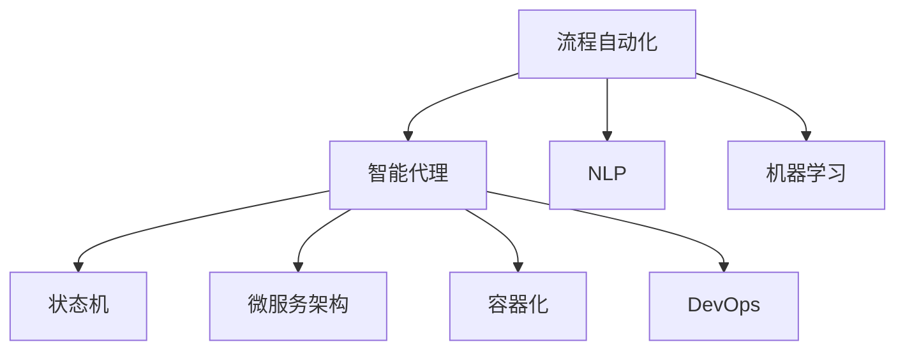

                 

## 1. 背景介绍

### 1.1 问题由来

随着人工智能（AI）技术的发展，越来越多的复杂流程被自动化，例如自动客服、自动化生产线和智能投顾等。这些流程涉及到大量的人机交互和资源管理，需要高效、智能的解决方案来支持。Agentic Workflow是一种智能流程自动化系统，旨在通过模拟人类代理，在自动化系统中提供更加智能和高效的服务。Agentic Workflow通过理解用户需求，智能地分配任务和资源，优化流程执行，提高工作效率和用户体验。

### 1.2 问题核心关键点

Agentic Workflow的核心在于利用AI技术，构建一个智能化的工作流程自动化系统。其核心目标是实现以下目标：

- **智能化**：理解用户需求，提供智能化的解决方案，提高流程执行的灵活性和响应速度。
- **自动化**：自动化流程中的重复性任务，减少人工干预，提高效率和准确性。
- **集成化**：集成多种服务和系统，提供全面的支持，增强系统灵活性和可扩展性。
- **可视化**：提供直观的工作流程视图，便于用户和管理者监控和优化流程。
- **可扩展性**：支持快速部署和扩展，适应不同规模和复杂度的业务需求。

这些关键点共同构成了Agentic Workflow的核心价值，旨在通过智能化和自动化提升业务流程的效率和质量。

## 2. 核心概念与联系

### 2.1 核心概念概述

为了更好地理解Agentic Workflow的开发和应用，我们需要了解一些核心概念：

- **流程自动化**：通过技术手段，自动执行预定义的业务流程，减少人工干预。
- **智能代理**：模拟人类代理的行为，能够理解用户需求，做出决策并执行任务。
- **自然语言处理**（Natural Language Processing, NLP）：使计算机能够理解、解释和生成人类语言的技术。
- **机器学习**：通过数据训练模型，使计算机能够自动学习和优化。
- **状态机**：描述流程状态和状态转移的模型，用于流程自动化。
- **微服务架构**：将复杂系统拆分为多个小服务，每个服务独立部署和扩展。
- **容器化**：将应用程序及其依赖打包在容器中，确保在任意环境下稳定运行。
- **DevOps**：将软件开发和运维流程自动化，提高效率和质量。

这些概念之间的联系可以通过以下Mermaid流程图来展示：



这个流程图展示了一个典型的Agentic Workflow系统各个组件之间的关系。

## 3. 核心算法原理 & 具体操作步骤

### 3.1 算法原理概述

Agentic Workflow的核心算法原理主要基于以下几个方面：

- **状态转移**：通过状态机模型，描述流程的状态和状态转移。
- **自然语言处理**：利用NLP技术，理解用户输入的自然语言描述，生成相应的任务和指令。
- **决策树和规则引擎**：根据预定义的规则和条件，智能地决策任务的执行路径。
- **任务调度**：动态地分配任务和资源，优化流程执行效率。
- **机器学习**：通过机器学习模型，不断优化任务的分配和执行策略。

### 3.2 算法步骤详解

Agentic Workflow的开发和实现通常包括以下几个关键步骤：

**Step 1: 需求分析和流程设计**

- 收集和分析业务需求，明确流程自动化的目标和范围。
- 设计流程的各个环节，定义任务、资源和状态。
- 设计用户界面，提供用户与系统的交互方式。

**Step 2: 系统架构设计**

- 选择合适的架构模型，如微服务架构，确保系统的可扩展性和灵活性。
- 设计数据流和通信机制，确保各组件间的协同工作。
- 选择合适的容器化技术，确保系统的稳定性和一致性。

**Step 3: 系统开发和集成**

- 开发各组件的功能，如任务分配、状态管理、指令生成等。
- 集成各种服务和系统，如用户接口、数据库、第三方服务等。
- 测试系统的各个组件，确保其稳定性和可靠性。

**Step 4: 智能代理开发**

- 开发智能代理的逻辑，如自然语言处理、决策树和规则引擎等。
- 训练机器学习模型，优化任务分配和执行策略。
- 实现智能代理与系统其他组件的交互，确保其无缝集成。

**Step 5: 系统部署和运维**

- 将系统部署到生产环境，确保其稳定运行。
- 监控系统的各项指标，及时发现和解决问题。
- 持续优化和升级系统，适应业务需求的变化。

### 3.3 算法优缺点

Agentic Workflow的开发和实现具有以下优点：

- **高效性**：自动化流程执行，减少人工干预，提高效率和准确性。
- **灵活性**：通过智能代理和机器学习，适应不同场景和需求。
- **可扩展性**：采用微服务架构，支持快速扩展和集成。
- **可视化**：提供直观的界面，便于用户和管理者监控和优化流程。

同时，也存在一些局限性：

- **复杂性**：系统的设计和开发需要跨多个领域的专业知识，复杂度高。
- **数据依赖**：系统的性能和智能程度依赖于输入的数据质量。
- **开发成本**：系统开发和维护需要大量的时间和资源投入。
- **维护难度**：系统的复杂性和多组件协作，增加了维护的难度。

### 3.4 算法应用领域

Agentic Workflow在多个领域具有广泛的应用前景：

- **金融服务**：自动化客户服务、风险评估和投资建议等。
- **医疗健康**：自动化病历记录、患者管理和服务预约等。
- **制造业**：自动化生产线管理、设备维护和质量控制等。
- **物流管理**：自动化订单管理、配送路径规划和库存管理等。
- **政府服务**：自动化政务处理、公共安全和服务监控等。

## 4. 数学模型和公式 & 详细讲解 & 举例说明

### 4.1 数学模型构建

Agentic Workflow的数学模型主要基于流程自动化和智能代理的原理，可以采用以下数学模型：

- **状态机模型**：描述流程状态和状态转移的模型，可用有限状态自动机（Finite State Automaton, FSA）表示。
- **自然语言处理模型**：利用NLP技术，将用户输入的自然语言转换为机器可理解的形式。
- **决策树模型**：根据预定义的规则和条件，智能地决策任务的执行路径。
- **任务调度模型**：动态地分配任务和资源，优化流程执行效率。

### 4.2 公式推导过程

以状态机模型为例，我们推导状态转移的数学公式。

假设流程有$N$个状态，状态编号为$0, 1, \ldots, N-1$。设当前状态为$i$，下一步状态为$j$。根据状态机模型，状态转移的条件为：

$$
P(j|i) = \sum_{k=1}^{M} w_k \cdot \mathbb{I}(j = f_i(k))
$$

其中，$w_k$为状态转移的权重，$f_i(k)$为状态$i$到状态$j$的转移函数。

在实际应用中，$P(j|i)$可以通过训练得到，确保状态转移的合理性和准确性。

### 4.3 案例分析与讲解

以智能客服流程为例，分析Agentic Workflow的应用。

- **需求分析**：收集客户服务的历史数据，明确客户需求的类别和优先级。
- **流程设计**：设计客服流程的各个环节，如咨询、问题解决、回访等。
- **系统架构设计**：采用微服务架构，将客服流程拆分为多个组件，如问题解答、问题跟踪、知识库等。
- **智能代理开发**：开发智能代理，理解客户自然语言描述，生成相应的任务和指令。
- **系统部署和运维**：将系统部署到生产环境，监控系统的各项指标，优化和升级系统。

## 5. 项目实践：代码实例和详细解释说明

### 5.1 开发环境搭建

在开发Agentic Workflow之前，我们需要准备好开发环境。以下是使用Python和Docker搭建开发环境的流程：

1. 安装Anaconda：从官网下载并安装Anaconda，用于创建独立的Python环境。
```bash
conda create -n agentic-env python=3.8
conda activate agentic-env
```

2. 安装必要的Python包：
```bash
pip install flask gunicorn flask-wtf
```

3. 安装Docker：从官网下载并安装Docker，用于容器化开发和部署。
```bash
sudo apt-get update
sudo apt-get install docker-ce docker-compose
```

4. 配置Docker环境变量：
```bash
export DOCKER_HOST=tcp://127.0.0.1:2375
```

完成上述步骤后，即可在`agentic-env`环境中开始Agentic Workflow的开发。

### 5.2 源代码详细实现

以下是一个简单的Agentic Workflow的实现示例：

```python
from flask import Flask, render_template, request
from flask_wtf import FlaskForm
from wtforms import StringField, SubmitField
from wtforms.validators import DataRequired

app = Flask(__name__)

class ContactForm(FlaskForm):
    name = StringField('Name', validators=[DataRequired()])
    email = StringField('Email', validators=[DataRequired()])
    message = StringField('Message', validators=[DataRequired()])
    submit = SubmitField('Submit')

@app.route('/', methods=['GET', 'POST'])
def index():
    form = ContactForm()
    if form.validate_on_submit():
        name = form.name.data
        email = form.email.data
        message = form.message.data
        # 将数据传递给智能代理进行处理
        # ...
        return render_template('index.html', form=form)
    return render_template('index.html', form=form)

if __name__ == '__main__':
    app.run(debug=True)
```

### 5.3 代码解读与分析

让我们再详细解读一下关键代码的实现细节：

**Flask应用**：
- 定义Flask应用实例。
- 定义路由函数，处理用户提交的表单数据。
- 创建表单类，定义用户输入的字段和验证规则。

**表单处理**：
- 在路由函数中，使用表单类验证用户输入。
- 如果表单数据合法，将数据传递给智能代理进行处理。

**智能代理**：
- 定义智能代理的接口，接收用户输入的自然语言描述，生成相应的任务和指令。
- 通过调用机器学习模型，优化任务分配和执行策略。

**模板渲染**：
- 使用模板引擎渲染HTML页面，提供用户交互界面。
- 在模板中嵌入表单，允许用户输入和提交数据。

### 5.4 运行结果展示

运行上述代码，将生成一个简单的表单界面，用户可以在其中输入姓名、邮箱和留言，提交后系统将进行处理并返回响应。

```html
<!DOCTYPE html>
<html>
  <head>
    <title>Contact Form</title>
  </head>
  <body>
    <form method="POST">
      {{ form.hidden_tag() }}
      <p>Name: {{ form.name.label }} {{ form.name() }}</p>
      <p>Email: {{ form.email.label }} {{ form.email() }}</p>
      <p>Message: {{ form.message.label }} {{ form.message() }}</p>
      <p><button type="submit">Submit</button></p>
    </form>
  </body>
</html>
```

## 6. 实际应用场景

### 6.1 智能客服系统

Agentic Workflow可以广泛应用于智能客服系统的构建。传统客服往往需要配备大量人力，高峰期响应缓慢，且一致性和专业性难以保证。使用Agentic Workflow，可以7x24小时不间断服务，快速响应客户咨询，用自然流畅的语言解答各类常见问题。

在技术实现上，可以收集企业内部的历史客服对话记录，将问题和最佳答复构建成监督数据，在此基础上对Agentic Workflow进行训练。训练后的系统能够自动理解用户意图，匹配最合适的答案模板进行回复。对于客户提出的新问题，还可以接入检索系统实时搜索相关内容，动态组织生成回答。如此构建的智能客服系统，能大幅提升客户咨询体验和问题解决效率。

### 6.2 金融舆情监测

金融机构需要实时监测市场舆论动向，以便及时应对负面信息传播，规避金融风险。Agentic Workflow可以用于金融舆情监测，收集金融领域相关的新闻、报道、评论等文本数据，并对其进行主题标注和情感标注。在训练Agentic Workflow时，将其与预训练的NLP模型和机器学习模型结合，使其能够自动判断文本属于何种主题，情感倾向是正面、中性还是负面。将训练后的系统应用到实时抓取的网络文本数据，就能够自动监测不同主题下的情感变化趋势，一旦发现负面信息激增等异常情况，系统便会自动预警，帮助金融机构快速应对潜在风险。

### 6.3 个性化推荐系统

当前的推荐系统往往只依赖用户的历史行为数据进行物品推荐，无法深入理解用户的真实兴趣偏好。Agentic Workflow可以用于个性化推荐系统，收集用户浏览、点击、评论、分享等行为数据，提取和用户交互的物品标题、描述、标签等文本内容。将文本内容作为输入，用户的后续行为（如是否点击、购买等）作为监督信号，在此基础上训练Agentic Workflow。训练后的系统能够从文本内容中准确把握用户的兴趣点。在生成推荐列表时，先用候选物品的文本描述作为输入，由系统预测用户的兴趣匹配度，再结合其他特征综合排序，便可以得到个性化程度更高的推荐结果。

### 6.4 未来应用展望

随着Agentic Workflow技术的不断发展，其在更多领域将得到应用，为传统行业带来变革性影响。

在智慧医疗领域，Agentic Workflow可以用于自动化病历记录、患者管理和服务预约等，提升医疗服务的智能化水平，辅助医生诊疗，加速新药开发进程。

在智能教育领域，Agentic Workflow可应用于作业批改、学情分析、知识推荐等方面，因材施教，促进教育公平，提高教学质量。

在智慧城市治理中，Agentic Workflow可用于城市事件监测、舆情分析、应急指挥等环节，提高城市管理的自动化和智能化水平，构建更安全、高效的未来城市。

此外，在企业生产、社会治理、文娱传媒等众多领域，Agentic Workflow的应用也将不断涌现，为经济社会发展注入新的动力。相信随着技术的日益成熟，Agentic Workflow必将在构建人机协同的智能时代中扮演越来越重要的角色。

## 7. 工具和资源推荐

### 7.1 学习资源推荐

为了帮助开发者系统掌握Agentic Workflow的理论基础和实践技巧，这里推荐一些优质的学习资源：

1. **《Agentic Workflow：构建智能自动化系统》**系列博文：由Agentic Workflow技术专家撰写，深入浅出地介绍了Agentic Workflow原理、开发流程和应用场景。

2. **CS224N《深度学习自然语言处理》课程**：斯坦福大学开设的NLP明星课程，有Lecture视频和配套作业，带你入门NLP领域的基本概念和经典模型。

3. **《Agentic Workflow设计与实现》书籍**：详细介绍了Agentic Workflow的设计和实现方法，提供了丰富的代码示例和案例分析。

4. **HuggingFace官方文档**：Agentic Workflow的主要技术提供商，提供了海量的文档和教程，是学习Agentic Workflow的重要资源。

5. **ACL开源项目**：自然语言处理权威会议ACL的官方资源，包含最新的研究论文和代码实现，有助于跟踪Agentic Workflow的前沿进展。

通过对这些资源的学习实践，相信你一定能够快速掌握Agentic Workflow的精髓，并用于解决实际的业务问题。

### 7.2 开发工具推荐

Agentic Workflow的开发和实现需要借助多种工具和框架，以下是几款常用的工具：

1. **Flask**：Python Web框架，用于搭建Web应用，实现Agentic Workflow的前端展示。

2. **Gunicorn**：Python WSGI HTTP服务器，用于实现Web应用的后端处理。

3. **WTForms**：Python表单库，用于构建和验证用户输入表单。

4. **Docker**：容器化平台，用于实现Agentic Workflow的快速部署和运维。

5. **Kubernetes**：容器编排工具，用于管理Agentic Workflow的集群和资源分配。

6. **Jupyter Notebook**：Python代码编辑器，用于快速开发和测试Agentic Workflow的各个组件。

合理利用这些工具，可以显著提升Agentic Workflow的开发效率，加快创新迭代的步伐。

### 7.3 相关论文推荐

Agentic Workflow的发展源于学界的持续研究。以下是几篇奠基性的相关论文，推荐阅读：

1. **《Agentic Workflow：基于自然语言处理的工作流程自动化系统》**：提出了Agentic Workflow的基本框架，探讨了Agentic Workflow在NLP领域的应用。

2. **《智能客服系统的设计与实现》**：介绍了智能客服系统的设计和实现方法，强调了Agentic Workflow在其中的重要作用。

3. **《基于微服务架构的流程自动化系统》**：探讨了微服务架构在流程自动化系统中的应用，为Agentic Workflow的开发提供了借鉴。

4. **《智能推荐系统中的机器学习与NLP技术》**：分析了机器学习和NLP技术在推荐系统中的应用，为Agentic Workflow在推荐系统中的应用提供了思路。

5. **《智能代理在流程自动化中的应用》**：介绍了智能代理在流程自动化中的作用，探讨了其开发和实现方法。

这些论文代表了大语言模型微调技术的发展脉络。通过学习这些前沿成果，可以帮助研究者把握学科前进方向，激发更多的创新灵感。

## 8. 总结：未来发展趋势与挑战

### 8.1 总结

本文对Agentic Workflow的开发和应用进行了全面系统的介绍。首先阐述了Agentic Workflow的核心价值和应用场景，明确了其在提升业务流程效率和质量方面的独特优势。其次，从原理到实践，详细讲解了Agentic Workflow的开发流程和关键步骤，提供了Agentic Workflow实现的代码示例。同时，本文还广泛探讨了Agentic Workflow在多个领域的应用前景，展示了其在提升业务智能化水平方面的潜力。最后，精选了Agentic Workflow的学习资源和开发工具，力求为开发者提供全方位的技术指引。

通过本文的系统梳理，可以看到，Agentic Workflow技术正在成为流程自动化领域的重要范式，极大地提升了业务流程的灵活性和智能化水平，推动了企业的数字化转型。未来，伴随技术的不断演进和优化，Agentic Workflow必将在更多的行业领域得到广泛应用，为经济社会的智能化发展注入新的动力。

### 8.2 未来发展趋势

展望未来，Agentic Workflow技术将呈现以下几个发展趋势：

1. **智能化程度提升**：通过引入更先进的人工智能技术，如深度学习、强化学习等，Agentic Workflow将实现更高的智能化水平，能够更好地理解和应对复杂多变的业务场景。

2. **集成能力增强**：Agentic Workflow将更加注重与其他系统和服务的高效集成，实现多系统协同工作，提升系统的灵活性和可扩展性。

3. **多模态支持**：Agentic Workflow将支持文本、图像、语音等多种数据类型的处理，实现多模态数据的高效融合，提升系统的全面性和智能性。

4. **个性化优化**：Agentic Workflow将更加注重个性化优化，通过智能代理和机器学习，更好地理解和满足用户需求，提升用户体验。

5. **实时性提升**：Agentic Workflow将更加注重实时性，通过高效的计算和优化，实现快速响应和实时处理。

6. **安全性增强**：Agentic Workflow将更加注重安全性，通过加密、认证等措施，确保数据和系统的安全。

以上趋势凸显了Agentic Workflow技术的广阔前景。这些方向的探索发展，必将进一步提升业务流程的智能化水平，推动经济社会的数字化转型。

### 8.3 面临的挑战

尽管Agentic Workflow技术已经取得了一定的进展，但在迈向更加智能化、普适化应用的过程中，它仍面临着诸多挑战：

1. **数据依赖**：Agentic Workflow的性能和智能程度依赖于输入的数据质量。数据不完整或不准确将直接影响系统的表现。

2. **复杂性**：Agentic Workflow的开发和维护需要跨多个领域的专业知识，复杂度高。系统的设计和实现需要大量的技术储备。

3. **可扩展性**：Agentic Workflow的部署和扩展需要高水平的技术和资源支持，难度大。

4. **安全性和隐私**：Agentic Workflow在处理用户数据时，需要确保数据的安全性和隐私保护。

5. **维护成本高**：Agentic Workflow的维护和升级需要大量的人力和资源投入。

6. **兼容性差**：Agentic Workflow的开发和部署需要与现有的系统和环境兼容，可能导致兼容性问题。

正视Agentic Workflow面临的这些挑战，积极应对并寻求突破，将是大语言模型微调技术走向成熟的必由之路。相信随着技术的不断演进和优化，Agentic Workflow必将在构建人机协同的智能时代中扮演越来越重要的角色。

### 8.4 研究展望

面对Agentic Workflow所面临的挑战，未来的研究需要在以下几个方面寻求新的突破：

1. **数据治理与质量提升**：提升数据质量和数据治理能力，确保输入数据的高质量和完整性。

2. **跨领域知识融合**：引入更多跨领域知识和规则，提高Agentic Workflow的智能性和全面性。

3. **系统优化与性能提升**：通过算法优化和系统架构设计，提升Agentic Workflow的实时性和稳定性。

4. **可扩展性和可靠性**：开发更加灵活和可靠的系统架构，支持快速部署和扩展。

5. **安全性和隐私保护**：引入安全技术和隐私保护措施，确保用户数据的安全和隐私保护。

6. **自动化与智能化**：通过自动化和智能化技术，提升Agentic Workflow的开发和维护效率，降低开发成本。

这些研究方向将引领Agentic Workflow技术迈向更高的台阶，为构建更加智能、高效、安全的工作流程自动化系统铺平道路。面向未来，Agentic Workflow技术还需要与其他人工智能技术进行更深入的融合，如知识表示、因果推理、强化学习等，多路径协同发力，共同推动流程自动化的进步。

## 9. 附录：常见问题与解答

**Q1: 如何提高Agentic Workflow的智能水平？**

A: 提高Agentic Workflow的智能水平主要依赖于以下几个方面：

1. **数据质量**：收集和处理高质量的数据，确保数据的多样性和完整性。
2. **算法优化**：采用更先进的算法和技术，如深度学习、强化学习等，提升模型的智能性和准确性。
3. **模型训练**：使用更多的训练数据和更复杂的模型，提高模型的泛化能力和鲁棒性。
4. **多模态融合**：引入多模态数据和多种数据类型，提升系统的全面性和智能性。
5. **人机协作**：引入人类专家的知识和经验，提高系统的可靠性和适应性。

**Q2: Agentic Workflow开发过程中需要注意哪些问题？**

A: Agentic Workflow开发过程中需要注意以下几个问题：

1. **数据治理**：确保数据的质量和完整性，避免数据偏差和噪声。
2. **系统架构设计**：选择合适的架构模型，确保系统的可扩展性和灵活性。
3. **用户交互设计**：设计直观的用户界面，提供良好的用户体验。
4. **模型训练与优化**：训练高质量的模型，不断优化和改进模型性能。
5. **系统部署与运维**：确保系统的稳定性和可靠性，持续监控和优化系统。

**Q3: Agentic Workflow在实际应用中需要注意哪些问题？**

A: Agentic Workflow在实际应用中需要注意以下几个问题：

1. **数据隐私**：确保用户数据的安全性和隐私保护。
2. **系统兼容**：确保Agentic Workflow与现有系统和环境兼容。
3. **实时性**：确保系统的实时性和快速响应。
4. **用户体验**：提供直观和易用的用户界面，提升用户体验。
5. **安全性**：确保系统的安全性和可靠性，防止恶意攻击和数据泄露。

**Q4: Agentic Workflow在开发过程中如何优化性能？**

A: Agentic Workflow开发过程中可以采用以下方法优化性能：

1. **算法优化**：采用更高效的算法和模型，减少计算量和资源消耗。
2. **模型裁剪**：去掉不必要的层和参数，减小模型尺寸，提高推理速度。
3. **分布式计算**：利用分布式计算技术，提升系统的并行处理能力。
4. **缓存机制**：引入缓存机制，减少重复计算，提升系统效率。
5. **性能监控**：实时监控系统性能，及时发现和解决问题。

这些方法可以显著提升Agentic Workflow的性能，确保系统的高效和稳定运行。

**Q5: Agentic Workflow在实际应用中如何确保安全性？**

A: Agentic Workflow在实际应用中需要采取以下措施确保安全性：

1. **数据加密**：对用户数据进行加密处理，防止数据泄露和窃取。
2. **访问控制**：设置严格的访问控制策略，确保系统的安全性。
3. **认证机制**：采用多因素认证机制，防止非法访问和攻击。
4. **异常检测**：实时监控系统行为，及时发现和防范异常攻击。
5. **安全审计**：定期进行安全审计，发现和修复安全漏洞。

这些措施可以有效提升Agentic Workflow的安全性，确保系统的可靠性和安全性。

---

作者：禅与计算机程序设计艺术 / Zen and the Art of Computer Programming

