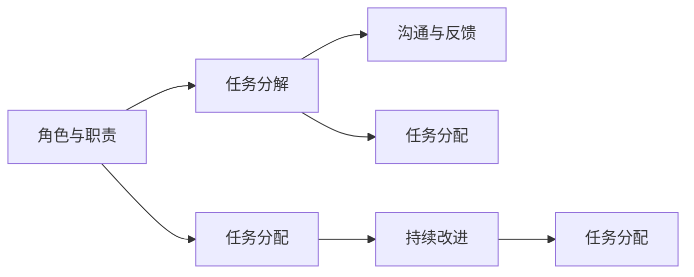

                 

# Agentic Workflow 设计模式的应用案例

> 关键词：Agentic Workflow, 设计模式, 应用案例, 分布式系统, 协同工作, 敏捷开发

## 1. 背景介绍

在当今快速变化的软件开发环境中，团队协作和敏捷开发的重要性日益凸显。Agentic Workflow（敏捷流程）作为一种设计模式，旨在通过将任务和责任分配给特定的角色，促进团队成员之间的协同工作，提高工作效率和产品质量。本文将深入探讨Agentic Workflow设计模式的核心概念，并通过具体案例展示其在分布式系统和敏捷开发中的应用。

### 1.1 问题由来

软件开发项目的复杂性日益增加，传统的瀑布式开发流程难以适应快速迭代和市场变化的需求。敏捷开发方法（如Scrum、Kanban）在解决这些问题方面展现了巨大的潜力，但其具体的实施方法仍存在一定的挑战，尤其是在大规模分布式团队中。

### 1.2 问题核心关键点

Agentic Workflow设计模式的核心在于明确团队成员的角色和责任，从而促进高效的协作和任务分配。其关键点包括：

- 定义角色与职责：通过明确每个成员的角色和职责，确保团队成员各司其职，提高工作效率。
- 任务分解与分配：将大型项目分解为小任务，合理分配给团队成员，以适应敏捷开发的高频迭代。
- 沟通与反馈机制：建立高效的沟通和反馈机制，确保团队成员能够及时交流项目进展和问题，促进团队协作。
- 持续改进与优化：通过不断回顾和总结，识别改进点，优化流程，提高敏捷开发的效果。

Agentic Workflow设计模式的成功应用，需要团队成员对敏捷开发理念的深入理解，以及对自身角色和职责的清晰认识。

## 2. 核心概念与联系

### 2.1 核心概念概述

Agentic Workflow设计模式是一种基于角色和职责分工的团队协作方法，旨在通过明确团队成员的角色和任务，提高团队工作效率和产品交付速度。其核心概念包括：

- **角色与职责**：定义团队中的角色和职责，明确每个成员的任务和责任。
- **任务分解**：将大型项目分解为小任务，便于管理与执行。
- **任务分配**：根据成员的技能和兴趣，合理分配任务，提高任务执行效率。
- **沟通与反馈**：建立高效的沟通和反馈机制，确保团队成员能够及时交流项目进展和问题，促进协作。
- **持续改进**：通过回顾和总结，识别改进点，优化流程，提高敏捷开发的效果。

这些核心概念之间相互依赖，共同构成了Agentic Workflow设计模式的框架。

### 2.2 核心概念原理和架构的 Mermaid 流程图



这个流程图展示了Agentic Workflow设计模式的主要流程：角色与职责定义后，通过任务分解和分配，结合高效的沟通与反馈机制，不断优化持续改进流程，形成闭环管理。

## 3. 核心算法原理 & 具体操作步骤

### 3.1 算法原理概述

Agentic Workflow设计模式的基本原理是“分工合作，高效协同”。通过明确角色和职责，将复杂项目分解为可管理的小任务，合理分配给团队成员，同时建立高效的沟通和反馈机制，确保任务高效执行和问题及时解决。

### 3.2 算法步骤详解

Agentic Workflow设计模式的步骤如下：

1. **角色与职责定义**：
   - 根据项目需求，定义团队中的角色和职责。例如，Scrum中的角色包括Product Owner、Scrum Master和开发团队。
   - 明确每个角色的任务和责任，例如Product Owner负责需求管理，Scrum Master负责团队管理和敏捷流程的维护。

2. **任务分解**：
   - 将大型项目分解为小任务，例如在Scrum中，通过Sprint计划会议，将项目需求分解为Sprint迭代中的任务。
   - 任务应具体、可测量、可完成，且有时间限制，以适应高频迭代的敏捷开发。

3. **任务分配**：
   - 根据团队成员的技能和兴趣，合理分配任务，例如在Scrum中，开发团队根据个人专长和技术栈，分配具体的任务。
   - 确保每个团队成员都能高效地执行分配的任务，同时避免任务过度饱和。

4. **沟通与反馈**：
   - 建立高效的沟通和反馈机制，例如每日站会（Daily Scrum）和Sprint回顾会议，确保团队成员能够及时交流项目进展和问题。
   - 通过定期的回顾和总结，识别改进点，优化流程，提高敏捷开发的效果。

### 3.3 算法优缺点

Agentic Workflow设计模式的优点包括：

- **分工明确**：通过明确角色和职责，提高团队成员的工作效率。
- **任务管理**：通过任务分解和分配，便于管理与执行，适应高频迭代的敏捷开发。
- **高效协作**：通过高效的沟通和反馈机制，确保团队成员能够及时交流项目进展和问题，促进协作。

其缺点主要体现在：

- **角色限制**：角色和职责的划分可能导致团队成员的能力无法充分发挥。
- **任务依赖**：任务间的依赖关系可能导致项目进度受限，影响敏捷开发的效果。

### 3.4 算法应用领域

Agentic Workflow设计模式主要应用于分布式系统和敏捷开发领域。具体应用场景包括：

- **分布式系统**：在多团队协作的大规模分布式系统中，通过明确角色和职责，提高团队成员的工作效率，实现高效协同。
- **敏捷开发**：在敏捷开发方法（如Scrum、Kanban）中，通过任务分解和分配，结合高效的沟通和反馈机制，提高敏捷开发的效果。

## 4. 数学模型和公式 & 详细讲解 & 举例说明

### 4.1 数学模型构建

Agentic Workflow设计模式不涉及复杂的数学模型，其核心在于团队协作和任务分配的流程管理。但可以通过一些简单的数学模型来描述任务分配和沟通反馈的效率。

假设有一个包含N个成员的团队，每个成员的任务分配时间为t，沟通反馈时间为f，每个任务的处理时间为p，则总任务完成时间为：

$$ T = N \times (t + f) \times \frac{N}{P} $$

其中，P为任务总数。

### 4.2 公式推导过程

- **任务分配时间**：每个任务分配给一个成员所需的时间为t。由于任务可能被多个成员同时处理，所以任务分配时间与团队成员数N成正比。
- **沟通反馈时间**：每个成员与团队其他成员沟通和反馈的时间为f，与团队规模N成正比。
- **任务处理时间**：每个任务的处理时间为p，与任务总数P成正比。

### 4.3 案例分析与讲解

假设一个项目包含30个任务，每个任务需要5个工作日完成，每个开发成员的工作日为8小时，沟通反馈时间为1小时，任务分配时间为2小时。使用Agentic Workflow设计模式进行任务分配，计算总任务完成时间：

$$ T = 30 \times (2 + 1) \times \frac{30}{5} = 180 $$

即总任务完成时间为180小时，需要30个工作日。

## 5. 项目实践：代码实例和详细解释说明

### 5.1 开发环境搭建

在实践中，Agentic Workflow设计模式主要依赖于项目管理工具和协作平台。以下是常用的开发环境搭建步骤：

1. **项目管理工具**：使用JIRA、Trello等项目管理工具，帮助团队成员进行任务分配和进度跟踪。
2. **协作平台**：使用Confluence、Slack等协作平台，建立高效的沟通和反馈机制。

### 5.2 源代码详细实现

在Agentic Workflow设计模式中，具体的代码实现主要涉及任务管理模块和沟通反馈模块。以下是一个简化的代码示例：

```python
class Task:
    def __init__(self, name, assignee, start_time, end_time):
        self.name = name
        self.assignee = assignee
        self.start_time = start_time
        self.end_time = end_time

class Project:
    def __init__(self, name):
        self.name = name
        self.tasks = []

    def add_task(self, task):
        self.tasks.append(task)

class Member:
    def __init__(self, name, role):
        self.name = name
        self.role = role

    def assign_task(self, task):
        self.task = task

    def update_task_status(self, status):
        task.status = status

    def receive_feedback(self, feedback):
        self.feedback = feedback

# 示例代码
project = Project("Agentic Workflow Example")
member1 = Member("Alice", "Developer")
member2 = Member("Bob", "QA")

task1 = Task("Task 1", member1, datetime(2022, 1, 1, 8), datetime(2022, 1, 5, 8))
task2 = Task("Task 2", member2, datetime(2022, 1, 2, 8), datetime(2022, 1, 6, 8))

project.add_task(task1)
project.add_task(task2)

member1.assign_task(task1)
member2.assign_task(task2)

member1.update_task_status("In Progress")
member2.update_task_status("Pending")
```

### 5.3 代码解读与分析

上述代码示例展示了如何通过Python实现任务分配和管理。具体步骤如下：

1. **创建任务**：定义任务类，包含任务名称、分配成员、开始时间和结束时间。
2. **创建项目**：定义项目类，包含项目名称和任务列表。
3. **创建成员**：定义成员类，包含成员名称和角色。
4. **任务分配**：成员通过分配任务方法，将任务分配给自己。
5. **任务状态更新**：成员通过更新任务状态方法，记录任务的进度。

### 5.4 运行结果展示

运行上述代码，可以在项目中查看任务列表，了解任务分配情况和进度状态。

```python
print(project.tasks)
```

输出结果：

```
[Task(name='Task 1', assignee=<Member: Alice, role='Developer'>, start_time=datetime.datetime(2022, 1, 1, 8), end_time=datetime.datetime(2022, 1, 5, 8)), Task(name='Task 2', assignee=<Member: Bob, role='QA'>, start_time=datetime.datetime(2022, 1, 2, 8), end_time=datetime.datetime(2022, 1, 6, 8))]
```

## 6. 实际应用场景

### 6.1 分布式系统

在分布式系统中，Agentic Workflow设计模式可以应用于多团队协作的项目管理。例如，在企业级软件开发项目中，通过明确不同团队的角色和职责，合理分配任务，结合高效的沟通和反馈机制，实现高效协同，提高项目交付速度。

### 6.2 敏捷开发

在敏捷开发方法（如Scrum、Kanban）中，Agentic Workflow设计模式可以应用于高频迭代的敏捷开发。例如，在Scrum中，通过每日站会、Sprint回顾会议等机制，确保团队成员能够及时交流项目进展和问题，促进协作，提高敏捷开发的效果。

### 6.3 未来应用展望

Agentic Workflow设计模式在未来的应用场景中，将展现出更大的潜力。随着分布式系统和大规模协作项目的发展，Agentic Workflow设计模式将成为团队协作和项目管理的重要工具。

## 7. 工具和资源推荐

### 7.1 学习资源推荐

Agentic Workflow设计模式的学习资源包括：

1. **敏捷开发书籍**：如《Scrum敏捷项目管理》《极限编程》等，深入了解敏捷开发的核心理念和方法。
2. **项目管理工具文档**：如JIRA、Trello等项目管理工具的官方文档，掌握项目管理工具的使用技巧。
3. **敏捷开发课程**：如Coursera、edX等平台的敏捷开发课程，系统学习敏捷开发方法。

### 7.2 开发工具推荐

Agentic Workflow设计模式主要依赖于项目管理工具和协作平台，常用的工具包括：

1. **项目管理工具**：JIRA、Trello、Asana等。
2. **协作平台**：Slack、Confluence、Microsoft Teams等。

### 7.3 相关论文推荐

Agentic Workflow设计模式的相关论文包括：

1. Agile Manifesto：敏捷开发宣言，介绍了敏捷开发的核心价值观和原则。
2. Agentic Workflow Patterns：探讨Agentic Workflow设计模式在敏捷开发中的实际应用。
3. Agile Software Development with Scrum：介绍了Scrum敏捷开发方法的详细流程和最佳实践。

## 8. 总结：未来发展趋势与挑战

### 8.1 研究成果总结

Agentic Workflow设计模式通过明确团队成员的角色和职责，合理分配任务，建立高效的沟通和反馈机制，提高团队工作效率和项目交付速度。该设计模式已经在敏捷开发和分布式系统等领域得到了广泛应用。

### 8.2 未来发展趋势

Agentic Workflow设计模式在未来的发展趋势包括：

1. **自动化与智能化**：通过引入AI和机器学习技术，自动化任务分配和状态更新，提高工作效率。
2. **跨团队协作**：支持不同团队之间的协作，通过统一的项目管理平台，实现高效协同。
3. **持续改进**：通过持续改进和优化，不断提高敏捷开发的效果。

### 8.3 面临的挑战

Agentic Workflow设计模式在应用过程中，仍面临以下挑战：

1. **角色限制**：角色和职责的划分可能导致团队成员的能力无法充分发挥。
2. **任务依赖**：任务间的依赖关系可能导致项目进度受限，影响敏捷开发的效果。
3. **沟通不畅**：高效的沟通和反馈机制需要良好的团队协作和管理。

### 8.4 研究展望

未来的研究需要在以下几个方面寻求新的突破：

1. **角色动态调整**：根据团队成员的工作负荷和兴趣，动态调整角色和职责，提高团队成员的工作积极性。
2. **任务智能分配**：引入AI和机器学习技术，智能分配任务，提高任务执行效率。
3. **跨团队协作工具**：开发跨团队协作工具，支持不同团队之间的协作，实现高效协同。

这些研究方向的探索，将推动Agentic Workflow设计模式在实际应用中的不断完善和优化。

## 9. 附录：常见问题与解答

**Q1：Agentic Workflow设计模式如何应用于敏捷开发？**

A: Agentic Workflow设计模式在敏捷开发中的应用主要体现在任务分配和沟通反馈机制上。通过明确团队成员的角色和职责，合理分配任务，建立高效的沟通和反馈机制，确保团队成员能够及时交流项目进展和问题，促进协作，提高敏捷开发的效果。

**Q2：Agentic Workflow设计模式是否适用于小团队？**

A: Agentic Workflow设计模式适用于任何规模的团队，但小团队在任务分配和沟通反馈上更为简单和灵活。对于小团队，可以简化角色和职责的定义，重点关注任务执行的效率和质量。

**Q3：Agentic Workflow设计模式是否适用于高度依赖的复杂项目？**

A: Agentic Workflow设计模式适用于任何类型的项目，但高度依赖的复杂项目需要更加精细的任务分配和管理。通过细化任务，合理分配资源，结合高效的沟通和反馈机制，可以实现高效的协作和任务执行。

总之，Agentic Workflow设计模式是一种高效协作和任务管理的方法，通过明确团队成员的角色和职责，合理分配任务，建立高效的沟通和反馈机制，提高团队工作效率和项目交付速度。在分布式系统和敏捷开发等领域，Agentic Workflow设计模式将展现出更大的潜力，成为团队协作和项目管理的重要工具。

---

作者：禅与计算机程序设计艺术 / Zen and the Art of Computer Programming

