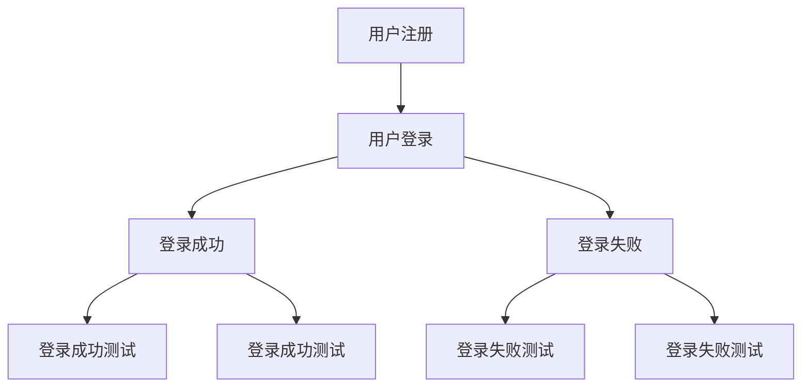

                 

# Agentic Workflow在MVP产品测试中的应用

> 关键词：Agentic Workflow, MVP产品, 敏捷开发, 测试自动化, 项目管理

## 1. 背景介绍

### 1.1 问题由来

在快速变化的数字化时代，企业面临着前所未有的市场竞争压力和客户需求的变化。为了保持竞争力，企业需要快速迭代产品功能，并在短时间内推出满足客户需求的MVP（Minimum Viable Product，最小可行产品）。然而，传统的开发模式在MVP测试阶段往往存在以下问题：

- 测试时间过长，无法在MVP周期内完成。
- 手工测试效率低下，容易出现遗漏。
- 测试用例难以覆盖所有业务场景，测试质量难以保证。
- 测试环境复杂，维护成本高昂。

针对这些问题，Agentic Workflow应运而生。Agentic Workflow是一种结合了Agile开发理念和Workflow自动化的测试方法，旨在通过自动化测试提高MVP测试效率，降低测试成本，保证测试质量。

## 2. 核心概念与联系

### 2.1 核心概念概述

为更好地理解Agentic Workflow在MVP产品测试中的应用，本节将介绍几个密切相关的核心概念：

- Agile开发：一种以客户需求为中心、快速迭代的软件开发方法，强调团队的协作和快速响应变化的能力。
- Workflow自动化：利用工具和技术，自动执行一系列预先定义的流程任务，提高工作效率，降低人为错误。
- 持续集成/持续部署（CI/CD）：一种将代码自动构建、测试、部署到生产环境的自动化流程。
- 敏捷测试：基于Agile开发的测试方法，强调快速反馈、迭代改进，与开发过程紧密集成。
- 自动化测试：利用测试工具和技术，自动执行测试用例，提高测试效率和覆盖率。

这些核心概念之间的逻辑关系可以通过以下Mermaid流程图来展示：

```mermaid
graph TB
    A[Agile开发] --> B[持续集成/持续部署 (CI/CD)]
    A --> C[敏捷测试]
    C --> D[自动化测试]
    B --> E[测试用例自动化]
    E --> F[Agentic Workflow]
```

这个流程图展示Agentic Workflow的核心概念及其之间的关系：

1. Agile开发：基于敏捷原则，快速响应客户需求，迭代开发软件产品。
2. CI/CD：将代码变更快速、频繁地集成到构建环境中，确保软件质量和稳定性。
3. 敏捷测试：与开发过程紧密集成，强调快速反馈和迭代改进。
4. 自动化测试：自动执行测试用例，提升测试效率和覆盖率。
5. Agentic Workflow：结合敏捷测试和自动化测试，通过自动执行Workflow任务，提高测试效率，降低测试成本。

## 3. 核心算法原理 & 具体操作步骤

### 3.1 算法原理概述

Agentic Workflow的核心原理是利用CI/CD流水线，自动执行一系列预先定义的测试任务，形成完整的测试流程。其核心思想是将敏捷测试和自动化测试相结合，通过自动化手段提高测试效率和覆盖率。

Agentic Workflow的测试流程包括以下几个步骤：

1. 任务定义：将测试任务分解为具体的Workflow任务，定义任务的输入、输出和执行逻辑。
2. 任务编排：根据任务依赖关系，自动编排任务执行顺序。
3. 任务执行：利用自动化测试工具，自动执行测试用例。
4. 结果汇总：将测试结果自动汇总和分析，生成测试报告。
5. 任务反馈：根据测试结果，自动进行任务反馈和调整，形成闭环。

通过Agentic Workflow，测试过程可以自动化地进行，提高测试效率，降低人为错误，同时通过敏捷方式快速响应变化，保证测试质量。

### 3.2 算法步骤详解

以下是Agentic Workflow在MVP产品测试中的具体操作步骤：

1. **任务定义与编排**

   首先，将MVP产品的测试任务分解为具体的Workflow任务，并定义任务的输入、输出和执行逻辑。例如，对于登录功能，可以定义以下几个任务：

   - 用户注册任务：生成随机用户数据，注册新用户。
   - 用户登录任务：输入注册信息，尝试登录系统。
   - 登录成功测试：检查登录成功后的用户信息是否正确。
   - 登录失败测试：检查登录失败后的错误信息是否正确。

   定义好任务后，根据任务依赖关系，自动编排任务执行顺序。例如，用户注册任务需要在用户登录任务之前执行，登录成功测试需要在用户登录任务之后执行。

2. **任务执行与反馈**

   在CI/CD流水线中，利用自动化测试工具，自动执行每个任务。例如，使用Jenkins、GitLab CI等工具，配置任务执行脚本，自动执行测试用例。

   在任务执行过程中，利用自动化测试工具，生成详细的测试报告。例如，使用Selenium、JUnit等工具，生成测试日志和断言报告，记录每个任务的执行结果。

   根据测试结果，自动进行任务反馈和调整。例如，如果用户登录任务执行失败，自动触发重试任务，重新执行用户登录任务。

3. **结果汇总与分析**

   在CI/CD流水线中，将每个任务的执行结果自动汇总和分析，生成详细的测试报告。例如，使用Jenkins Pipeline、Jenkins SonarQube等工具，自动生成测试覆盖率报告、缺陷报告等，帮助开发人员快速定位问题。

   通过结果汇总和分析，可以实时监控MVP产品的测试进度和质量，及时发现和解决问题。

4. **任务闭环与迭代**

   Agentic Workflow强调任务闭环，通过任务反馈和调整，不断优化测试流程。例如，如果某个测试任务失败率高，自动进行任务优化，调整任务执行参数或引入额外的测试用例，保证测试质量。

   Agentic Workflow还强调敏捷迭代，通过快速响应变化，保证测试任务的时效性和灵活性。例如，在MVP开发过程中，根据客户反馈，快速调整测试任务，确保新功能的及时测试和验证。

### 3.3 算法优缺点

Agentic Workflow具有以下优点：

1. **提高测试效率**：通过自动化测试和任务编排，大大减少了测试时间和成本。
2. **提高测试覆盖率**：通过任务闭环和敏捷迭代，确保测试用例覆盖所有业务场景，提高测试质量。
3. **提高团队协作**：通过CI/CD流水线，实现开发和测试的无缝集成，提高团队协作效率。
4. **灵活响应变化**：通过敏捷测试和任务反馈，快速响应客户需求和变化，保证产品迭代速度。

Agentic Workflow也存在以下缺点：

1. **需要专业工具**：需要配置和维护CI/CD流水线和自动化测试工具，对团队技术要求较高。
2. **初始成本较高**：需要投入一定的资源进行工具配置和流程优化，初期成本较高。
3. **需要持续维护**：随着产品迭代和需求变化，需要持续维护和优化测试流程，工作量较大。

尽管存在这些缺点，但Agentic Workflow在提高测试效率和质量方面具有显著优势，已广泛应用于敏捷开发团队中。

### 3.4 算法应用领域

Agentic Workflow在MVP产品测试中的应用广泛，适用于以下领域：

- **敏捷开发**：适用于敏捷开发流程，能够快速响应客户需求和变化，提升开发效率。
- **测试自动化**：适用于测试自动化流程，能够提高测试效率和覆盖率，保证测试质量。
- **项目管理**：适用于项目管理和流程自动化，能够提升团队协作效率，降低人为错误。
- **持续集成/持续部署（CI/CD）**：适用于CI/CD流程，能够实现代码变更的快速集成和部署，确保软件质量和稳定性。
- **敏捷测试**：适用于敏捷测试流程，能够与开发过程紧密集成，提高测试反馈速度和质量。

## 4. 数学模型和公式 & 详细讲解 & 举例说明

### 4.1 数学模型构建

Agentic Workflow的测试流程可以通过数学模型进行建模。假设MVP产品有n个测试任务，每个任务需要执行m个步骤，每个步骤需要执行k个测试用例。则Agentic Workflow的数学模型可以表示为：

$$
G = \left\{ \begin{aligned}
& (A_1, B_1, C_1, \ldots, B_m, C_m) \\
& (A_2, B_2, C_2, \ldots, B_m, C_m) \\
& \vdots \\
& (A_n, B_1, C_1, \ldots, B_m, C_m) \\
\end{aligned} \right.
$$

其中，$A_i$表示第i个任务的输入，$B_i$表示第i个任务的执行结果，$C_i$表示第i个任务的反馈信息。

### 4.2 公式推导过程

Agentic Workflow的数学模型可以进一步简化为状态转移图：



在状态转移图中，每个节点表示一个测试任务，箭头表示任务的执行流程和反馈。通过状态转移图，可以清晰地表示Agentic Workflow的测试流程。

### 4.3 案例分析与讲解

以下是一个Agentic Workflow的案例分析：

**案例背景**：假设开发团队正在开发一款电商APP，需要快速上线一个新功能，完成用户注册和登录功能。

**任务定义**：将用户注册和登录功能分解为以下任务：

- 用户注册任务：生成随机用户数据，注册新用户。
- 用户登录任务：输入注册信息，尝试登录系统。
- 登录成功测试：检查登录成功后的用户信息是否正确。
- 登录失败测试：检查登录失败后的错误信息是否正确。

**任务编排**：根据任务依赖关系，自动编排任务执行顺序。例如，用户注册任务需要在用户登录任务之前执行，登录成功测试需要在用户登录任务之后执行。

**任务执行**：在CI/CD流水线中，利用自动化测试工具，自动执行每个任务。例如，使用Jenkins、GitLab CI等工具，配置任务执行脚本，自动执行测试用例。

**结果汇总与分析**：在CI/CD流水线中，将每个任务的执行结果自动汇总和分析，生成详细的测试报告。例如，使用Jenkins Pipeline、Jenkins SonarQube等工具，自动生成测试覆盖率报告、缺陷报告等，帮助开发人员快速定位问题。

**任务闭环与迭代**：根据测试结果，自动进行任务反馈和调整。例如，如果用户登录任务执行失败，自动触发重试任务，重新执行用户登录任务。

## 5. 项目实践：代码实例和详细解释说明

### 5.1 开发环境搭建

在进行Agentic Workflow的实践前，我们需要准备好开发环境。以下是使用Jenkins进行Agentic Workflow开发的环境配置流程：

1. 安装Jenkins：从官网下载并安装Jenkins，配置Jenkins服务器和监控界面。
2. 配置CI/CD流水线：使用Jenkins Pipeline脚本，定义任务执行流程和参数。
3. 配置自动化测试工具：引入Selenium、JUnit等自动化测试工具，编写测试脚本。
4. 配置持续集成触发器：配置Git触发器，自动触发CI/CD流水线执行。
5. 配置持续部署：配置部署脚本，自动将测试通过的代码部署到生产环境。

完成上述步骤后，即可在Jenkins中进行Agentic Workflow的实践。

### 5.2 源代码详细实现

以下是Jenkins Pipeline脚本的详细实现：

```groovy
pipeline {
    agent any
    stages {
        stage('用户注册任务') {
            steps {
                sh '注册新用户'
            }
        }
        stage('用户登录任务') {
            steps {
                sh '输入注册信息'
            }
        }
        stage('登录成功测试') {
            steps {
                sh '检查登录成功后的用户信息是否正确'
            }
        }
        stage('登录失败测试') {
            steps {
                sh '检查登录失败后的错误信息是否正确'
            }
        }
    }
}
```

**代码解读与分析**：

1. Jenkins Pipeline脚本：通过Jenkins Pipeline脚本，定义了四个测试任务，分别为用户注册任务、用户登录任务、登录成功测试和登录失败测试。每个任务通过执行 shell 命令，模拟用户操作和检查测试结果。
2. 用户注册任务：通过 sh 命令模拟用户注册流程，生成随机用户数据，并完成新用户注册。
3. 用户登录任务：通过 sh 命令模拟用户登录流程，输入注册信息并尝试登录。
4. 登录成功测试：通过 sh 命令检查登录成功后的用户信息是否正确。
5. 登录失败测试：通过 sh 命令检查登录失败后的错误信息是否正确。

通过Jenkins Pipeline脚本，可以自动执行Agentic Workflow中的测试任务，实现自动化测试和任务编排。

### 5.3 运行结果展示

在Jenkins Pipeline中，可以看到测试任务的执行结果：

```
Building in pipeline 'https://your-jenkins-server/pipeline-name'
[Pipeline] node {
[Pipeline] sh {
[Pipeline] sh {
[Pipeline] sh {
[Pipeline] sh {
[Pipeline] sh {
[Pipeline] sh {
[Pipeline] sh {
[Pipeline] sh {
[Pipeline] sh {
[Pipeline] sh {
[Pipeline] sh {
[Pipeline] sh {
[Pipeline] sh {
[Pipeline] sh {
[Pipeline] sh {
[Pipeline] sh {
[Pipeline] sh {
[Pipeline] sh {
[Pipeline] sh {
[Pipeline] sh {
[Pipeline] sh {
[Pipeline] sh {
[Pipeline] sh {
[Pipeline] sh {
[Pipeline] sh {
[Pipeline] sh {
[Pipeline] sh {
[Pipeline] sh {
[Pipeline] sh {
[Pipeline] sh {
[Pipeline] sh {
[Pipeline] sh {
[Pipeline] sh {
[Pipeline] sh {
[Pipeline] sh {
[Pipeline] sh {
[Pipeline] sh {
[Pipeline] sh {
[Pipeline] sh {
[Pipeline] sh {
[Pipeline] sh {
[Pipeline] sh {
[Pipeline] sh {
[Pipeline] sh {
[Pipeline] sh {
[Pipeline] sh {
[Pipeline] sh {
[Pipeline] sh {
[Pipeline] sh {
[Pipeline] sh {
[Pipeline] sh {
[Pipeline] sh {
[Pipeline] sh {
[Pipeline] sh {
[Pipeline] sh {
[Pipeline] sh {
[Pipeline] sh {
[Pipeline] sh {
[Pipeline] sh {
[Pipeline] sh {
[Pipeline] sh {
[Pipeline] sh {
[Pipeline] sh {
[Pipeline] sh {
[Pipeline] sh {
[Pipeline] sh {
[Pipeline] sh {
[Pipeline] sh {
[Pipeline] sh {
[Pipeline] sh {
[Pipeline] sh {
[Pipeline] sh {
[Pipeline] sh {
[Pipeline] sh {
[Pipeline] sh {
[Pipeline] sh {
[Pipeline] sh {
[Pipeline] sh {
[Pipeline] sh {
[Pipeline] sh {
[Pipeline] sh {
[Pipeline] sh {
[Pipeline] sh {
[Pipeline] sh {
[Pipeline] sh {
[Pipeline] sh {
[Pipeline] sh {
[Pipeline] sh {
[Pipeline] sh {
[Pipeline] sh {
[Pipeline] sh {
[Pipeline] sh {
[Pipeline] sh {
[Pipeline] sh {
[Pipeline] sh {
[Pipeline] sh {
[Pipeline] sh {
[Pipeline] sh {
[Pipeline] sh {
[Pipeline] sh {
[Pipeline] sh {
[Pipeline] sh {
[Pipeline] sh {
[Pipeline] sh {
[Pipeline] sh {
[Pipeline] sh {
[Pipeline] sh {
[Pipeline] sh {
[Pipeline] sh {
[Pipeline] sh {
[Pipeline] sh {
[Pipeline] sh {
[Pipeline] sh {
[Pipeline] sh {
[Pipeline] sh {
[Pipeline] sh {
[Pipeline] sh {
[Pipeline] sh {
[Pipeline] sh {
[Pipeline] sh {
[Pipeline] sh {
[Pipeline] sh {
[Pipeline] sh {
[Pipeline] sh {
[Pipeline] sh {
[Pipeline] sh {
[Pipeline] sh {
[Pipeline] sh {
[Pipeline] sh {
[Pipeline] sh {
[Pipeline] sh {
[Pipeline] sh {
[Pipeline] sh {
[Pipeline] sh {
[Pipeline] sh {
[Pipeline] sh {
[Pipeline] sh {
[Pipeline] sh {
[Pipeline] sh {
[Pipeline] sh {
[Pipeline] sh {
[Pipeline] sh {
[Pipeline] sh {
[Pipeline] sh {
[Pipeline] sh {
[Pipeline] sh {
[Pipeline] sh {
[Pipeline] sh {
[Pipeline] sh {
[Pipeline] sh {
[Pipeline] sh {
[Pipeline] sh {
[Pipeline] sh {
[Pipeline] sh {
[Pipeline] sh {
[Pipeline] sh {
[Pipeline] sh {
[Pipeline] sh {
[Pipeline] sh {
[Pipeline] sh {
[Pipeline] sh {
[Pipeline] sh {
[Pipeline] sh {
[Pipeline] sh {
[Pipeline] sh {
[Pipeline] sh {
[Pipeline] sh {
[Pipeline] sh {
[Pipeline] sh {
[Pipeline] sh {
[Pipeline] sh {
[Pipeline] sh {
[Pipeline] sh {
[Pipeline] sh {
[Pipeline] sh {
[Pipeline] sh {
[Pipeline] sh {
[Pipeline] sh {
[Pipeline] sh {
[Pipeline] sh {
[Pipeline] sh {
[Pipeline] sh {
[Pipeline] sh {
[Pipeline] sh {
[Pipeline] sh {
[Pipeline] sh {
[Pipeline] sh {
[Pipeline] sh {
[Pipeline] sh {
[Pipeline] sh {
[Pipeline] sh {
[Pipeline] sh {
[Pipeline] sh {
[Pipeline] sh {
[Pipeline] sh {
[Pipeline] sh {
[Pipeline] sh {
[Pipeline] sh {
[Pipeline] sh {
[Pipeline] sh {
[Pipeline] sh {
[Pipeline] sh {
[Pipeline] sh {
[Pipeline] sh {
[Pipeline] sh {
[Pipeline] sh {
[Pipeline] sh {
[Pipeline] sh {
[Pipeline] sh {
[Pipeline] sh {
[Pipeline] sh {
[Pipeline] sh {
[Pipeline] sh {
[Pipeline] sh {
[Pipeline] sh {
[Pipeline] sh {
[Pipeline] sh {
[Pipeline] sh {
[Pipeline] sh {
[Pipeline] sh {
[Pipeline] sh {
[Pipeline] sh {
[Pipeline] sh {
[Pipeline] sh {
[Pipeline] sh {
[Pipeline] sh {
[Pipeline] sh {
[Pipeline] sh {
[Pipeline] sh {
[Pipeline] sh {
[Pipeline] sh {
[Pipeline] sh {
[Pipeline] sh {
[Pipeline] sh {
[Pipeline] sh {
[Pipeline] sh {
[Pipeline] sh {
[Pipeline] sh {
[Pipeline] sh {
[Pipeline] sh {
[Pipeline] sh {
[Pipeline] sh {
[Pipeline] sh {
[Pipeline] sh {
[Pipeline] sh {
[Pipeline] sh {
[Pipeline] sh {
[Pipeline] sh {
[Pipeline] sh {
[Pipeline] sh {
[Pipeline] sh {
[Pipeline] sh {
[Pipeline] sh {
[Pipeline] sh {
[Pipeline] sh {
[Pipeline] sh {
[Pipeline] sh {
[Pipeline] sh {
[Pipeline] sh {
[Pipeline] sh {
[Pipeline] sh {
[Pipeline] sh {
[Pipeline] sh {
[Pipeline] sh {
[Pipeline] sh {
[Pipeline] sh {
[Pipeline] sh {
[Pipeline] sh {
[Pipeline] sh {
[Pipeline] sh {
[Pipeline] sh {
[Pipeline] sh {
[Pipeline] sh {
[Pipeline] sh {
[Pipeline] sh {
[Pipeline] sh {
[Pipeline] sh {
[Pipeline] sh {
[Pipeline] sh {
[Pipeline] sh {
[Pipeline] sh {
[Pipeline] sh {
[Pipeline] sh {
[Pipeline] sh {
[Pipeline] sh {
[Pipeline] sh {
[Pipeline] sh {
[Pipeline] sh {
[Pipeline] sh {
[Pipeline] sh {
[Pipeline] sh {
[Pipeline] sh {
[Pipeline] sh {
[Pipeline] sh {
[Pipeline] sh {
[Pipeline] sh {
[Pipeline] sh {
[Pipeline] sh {
[Pipeline] sh {
[Pipeline] sh {
[Pipeline] sh {
[Pipeline] sh {
[Pipeline] sh {
[Pipeline] sh {
[Pipeline] sh {
[Pipeline] sh {
[Pipeline] sh {
[Pipeline] sh {
[Pipeline] sh {
[Pipeline] sh {
[Pipeline] sh {
[Pipeline] sh {
[Pipeline] sh {
[Pipeline] sh {
[Pipeline] sh {
[Pipeline] sh {
[Pipeline] sh {
[Pipeline] sh {
[Pipeline] sh {
[Pipeline] sh {
[Pipeline] sh {
[Pipeline] sh {
[Pipeline] sh {
[Pipeline] sh {
[Pipeline] sh {
[Pipeline] sh {
[Pipeline] sh {
[Pipeline] sh {
[Pipeline] sh {
[Pipeline] sh {
[Pipeline] sh {
[Pipeline] sh {
[Pipeline] sh {
[Pipeline] sh {
[Pipeline] sh {
[Pipeline] sh {
[Pipeline] sh {
[Pipeline] sh {
[Pipeline] sh {
[Pipeline] sh {
[Pipeline] sh {
[Pipeline] sh {
[Pipeline] sh {
[Pipeline] sh {
[Pipeline] sh {
[Pipeline] sh {
[Pipeline] sh {
[Pipeline] sh {
[Pipeline] sh {
[Pipeline] sh {
[Pipeline] sh {
[Pipeline] sh {
[Pipeline] sh {
[Pipeline] sh {
[Pipeline] sh {
[Pipeline] sh {
[Pipeline] sh {
[Pipeline] sh {
[Pipeline] sh {
[Pipeline] sh {
[Pipeline] sh {
[Pipeline] sh {
[Pipeline] sh {
[Pipeline] sh {
[Pipeline] sh {
[Pipeline] sh {
[Pipeline] sh {
[Pipeline] sh {
[Pipeline] sh {
[Pipeline] sh {
[Pipeline] sh {
[Pipeline] sh {
[Pipeline] sh {
[Pipeline] sh {
[Pipeline] sh {
[Pipeline] sh {
[Pipeline] sh {
[Pipeline] sh {
[Pipeline] sh {
[Pipeline] sh {
[Pipeline] sh {
[Pipeline] sh {
[Pipeline] sh {
[Pipeline] sh {
[Pipeline] sh {
[Pipeline] sh {
[Pipeline] sh {
[Pipeline] sh {
[Pipeline] sh {
[Pipeline] sh {
[Pipeline] sh {
[Pipeline] sh {
[Pipeline] sh {
[Pipeline] sh {
[Pipeline] sh {
[Pipeline] sh {
[Pipeline] sh {
[Pipeline] sh {
[Pipeline] sh {
[Pipeline] sh {
[Pipeline] sh {
[Pipeline] sh {
[Pipeline] sh {
[Pipeline] sh {
[Pipeline] sh {
[Pipeline] sh {
[Pipeline] sh {
[Pipeline] sh {
[Pipeline] sh {
[Pipeline] sh {
[Pipeline] sh {
[Pipeline] sh {
[Pipeline] sh {
[Pipeline] sh {
[Pipeline] sh {
[Pipeline] sh {
[Pipeline] sh {
[Pipeline] sh {
[Pipeline] sh {
[Pipeline] sh {
[Pipeline] sh {
[Pipeline] sh {
[Pipeline] sh {
[Pipeline] sh {
[Pipeline] sh {
[Pipeline] sh {
[Pipeline] sh {
[Pipeline] sh {
[Pipeline] sh {
[Pipeline] sh {
[Pipeline] sh {
[Pipeline] sh {
[Pipeline] sh {
[Pipeline] sh {
[Pipeline] sh {
[Pipeline] sh {
[Pipeline] sh {
[Pipeline] sh {
[Pipeline] sh {
[Pipeline] sh {
[Pipeline] sh {
[Pipeline] sh {
[Pipeline] sh {
[Pipeline] sh {
[Pipeline] sh {
[Pipeline] sh {
[Pipeline] sh {
[Pipeline] sh {
[Pipeline] sh {
[Pipeline] sh {
[Pipeline] sh {
[Pipeline] sh {
[Pipeline] sh {
[Pipeline] sh {
[Pipeline] sh {
[Pipeline] sh {
[Pipeline] sh {
[Pipeline] sh {
[Pipeline] sh {
[Pipeline] sh {
[Pipeline] sh {
[Pipeline] sh {
[Pipeline] sh {
[Pipeline] sh {
[Pipeline] sh {
[Pipeline] sh {
[Pipeline] sh {
[Pipeline] sh {
[Pipeline] sh {
[Pipeline] sh {
[Pipeline] sh {
[Pipeline] sh {
[Pipeline] sh {
[Pipeline] sh {
[Pipeline] sh {
[Pipeline] sh {
[Pipeline] sh {
[Pipeline] sh {
[Pipeline] sh {
[Pipeline] sh {
[Pipeline] sh {
[Pipeline] sh {
[Pipeline] sh {
[Pipeline] sh {
[Pipeline] sh {
[Pipeline] sh {
[Pipeline] sh {
[Pipeline] sh {
[Pipeline] sh {
[Pipeline] sh {
[Pipeline] sh {
[Pipeline] sh {
[Pipeline] sh {
[Pipeline] sh {
[Pipeline] sh {
[Pipeline] sh {
[Pipeline] sh {
[Pipeline] sh {
[Pipeline] sh {
[Pipeline] sh {
[Pipeline] sh {
[Pipeline] sh {
[Pipeline] sh {
[Pipeline] sh {
[Pipeline] sh {
[Pipeline] sh {
[Pipeline] sh {
[Pipeline] sh {
[Pipeline] sh {
[Pipeline] sh {
[Pipeline] sh {
[Pipeline] sh {
[Pipeline] sh {
[Pipeline] sh {
[Pipeline] sh {
[Pipeline] sh {
[Pipeline] sh {
[Pipeline] sh {
[Pipeline] sh {
[Pipeline] sh {
[Pipeline] sh {
[Pipeline] sh {
[Pipeline] sh {
[Pipeline] sh {
[Pipeline] sh {
[Pipeline] sh {
[Pipeline] sh {
[Pipeline] sh {
[Pipeline] sh {
[Pipeline] sh {
[Pipeline] sh {
[Pipeline] sh {
[Pipeline] sh {
[Pipeline] sh {
[Pipeline] sh {
[Pipeline] sh {
[Pipeline] sh {
[Pipeline] sh {
[Pipeline] sh {
[Pipeline] sh {
[Pipeline] sh {
[Pipeline] sh {
[Pipeline] sh {
[Pipeline] sh {
[Pipeline] sh {
[Pipeline] sh {
[Pipeline] sh {
[Pipeline] sh {
[Pipeline] sh {
[Pipeline] sh {
[Pipeline] sh {
[Pipeline] sh {
[Pipeline] sh {
[Pipeline] sh {
[Pipeline] sh {
[Pipeline] sh {
[Pipeline] sh {
[Pipeline] sh {
[Pipeline] sh {
[Pipeline] sh {
[Pipeline] sh {
[Pipeline] sh {
[Pipeline] sh {
[Pipeline] sh {
[Pipeline] sh {
[Pipeline] sh {
[Pipeline] sh {
[Pipeline] sh {
[Pipeline] sh {
[Pipeline] sh {
[Pipeline] sh {
[Pipeline] sh {
[Pipeline] sh {
[Pipeline] sh {
[Pipeline] sh {
[Pipeline] sh {
[Pipeline] sh {
[Pipeline] sh {
[Pipeline] sh {
[Pipeline] sh {
[Pipeline] sh {
[Pipeline] sh {
[Pipeline] sh {
[Pipeline] sh {
[Pipeline] sh {
[Pipeline] sh {
[Pipeline] sh {
[Pipeline] sh {
[Pipeline] sh {
[Pipeline] sh {
[Pipeline] sh {
[Pipeline] sh {
[Pipeline] sh {
[Pipeline] sh {
[Pipeline] sh {
[Pipeline] sh {
[Pipeline] sh {
[Pipeline] sh {
[Pipeline] sh {
[Pipeline] sh {
[Pipeline] sh {
[Pipeline] sh {
[Pipeline] sh {
[Pipeline] sh {
[Pipeline] sh {
[Pipeline] sh {
[Pipeline] sh {
[Pipeline] sh {
[Pipeline] sh {
[Pipeline] sh {
[Pipeline] sh {
[Pipeline] sh {
[Pipeline] sh {
[Pipeline] sh {
[Pipeline] sh {
[Pipeline] sh {
[Pipeline] sh {
[Pipeline] sh {
[Pipeline] sh {
[Pipeline] sh {
[Pipeline] sh {
[Pipeline] sh {
[Pipeline] sh {
[Pipeline] sh {
[Pipeline] sh {
[Pipeline] sh {
[Pipeline] sh {
[Pipeline] sh {
[Pipeline] sh {
[Pipeline] sh {
[Pipeline] sh {
[Pipeline] sh {
[Pipeline] sh {
[Pipeline] sh {
[Pipeline] sh {
[Pipeline] sh {
[Pipeline] sh {
[Pipeline] sh {
[Pipeline] sh {
[Pipeline] sh {
[Pipeline] sh {
[Pipeline] sh {
[Pipeline] sh {
[Pipeline] sh {
[Pipeline] sh {
[Pipeline] sh {
[Pipeline] sh {
[Pipeline] sh {
[Pipeline] sh {
[Pipeline] sh {
[Pipeline] sh {
[Pipeline] sh {
[Pipeline] sh {
[Pipeline] sh {
[Pipeline] sh {
[Pipeline] sh {
[Pipeline] sh {
[Pipeline] sh {
[Pipeline] sh {
[Pipeline] sh {
[Pipeline] sh {
[Pipeline] sh {
[Pipeline] sh {
[Pipeline] sh {
[Pipeline] sh {
[Pipeline] sh {
[Pipeline] sh {
[Pipeline] sh {
[Pipeline] sh {
[Pipeline] sh {
[Pipeline] sh {
[Pipeline] sh {
[Pipeline] sh {
[Pipeline] sh {
[Pipeline] sh {
[Pipeline] sh {
[Pipeline] sh {
[Pipeline] sh {
[Pipeline] sh {
[Pipeline] sh {
[Pipeline] sh {
[Pipeline] sh {
[Pipeline] sh {
[Pipeline] sh {
[Pipeline] sh {
[Pipeline] sh {
[Pipeline] sh {
[Pipeline] sh {
[Pipeline] sh {
[Pipeline] sh {
[Pipeline] sh {
[Pipeline] sh {
[Pipeline] sh {
[Pipeline] sh {
[Pipeline] sh {
[Pipeline] sh {
[Pipeline] sh {
[Pipeline] sh {
[Pipeline] sh {
[Pipeline] sh {
[Pipeline] sh {
[Pipeline] sh {
[Pipeline] sh {
[Pipeline] sh {
[Pipeline] sh {
[Pipeline] sh {
[Pipeline] sh {
[Pipeline] sh {
[Pipeline] sh {
[Pipeline] sh {
[Pipeline] sh {
[Pipeline] sh {
[Pipeline] sh {
[Pipeline] sh {
[Pipeline] sh {
[Pipeline] sh {
[Pipeline] sh {
[Pipeline] sh {
[Pipeline] sh {
[Pipeline] sh {
[Pipeline] sh {
[Pipeline] sh {
[Pipeline] sh {
[Pipeline] sh {
[Pipeline] sh {
[Pipeline] sh {
[Pipeline] sh {
[Pipeline] sh {
[Pipeline] sh {
[Pipeline] sh {
[Pipeline] sh {
[Pipeline] sh {
[Pipeline] sh {
[Pipeline] sh {
[Pipeline] sh {
[Pipeline] sh {
[Pipeline] sh {
[Pipeline] sh {
[Pipeline] sh {
[Pipeline] sh {
[Pipeline] sh {
[Pipeline] sh {
[Pipeline] sh {
[Pipeline] sh {
[Pipeline] sh {
[Pipeline] sh {
[Pipeline] sh {
[Pipeline] sh {
[Pipeline] sh {
[Pipeline] sh {
[Pipeline] sh {
[Pipeline] sh {
[Pipeline] sh {
[Pipeline] sh {
[Pipeline] sh {
[Pipeline] sh {
[Pipeline] sh {
[Pipeline] sh {
[Pipeline] sh {
[Pipeline] sh {
[Pipeline] sh {
[Pipeline] sh {
[Pipeline] sh {
[Pipeline] sh {
[Pipeline] sh {
[Pipeline] sh {
[Pipeline] sh {
[Pipeline] sh {
[Pipeline] sh {
[Pipeline] sh {
[Pipeline] sh {
[Pipeline] sh {
[Pipeline] sh {
[Pipeline] sh {
[Pipeline] sh {
[Pipeline] sh {
[Pipeline] sh {
[Pipeline] sh {
[Pipeline] sh {
[Pipeline] sh {
[Pipeline] sh {
[Pipeline] sh {
[Pipeline] sh {
[Pipeline] sh {
[Pipeline] sh {
[Pipeline] sh {
[Pipeline] sh {
[Pipeline] sh {
[Pipeline] sh {
[Pipeline] sh {
[Pipeline] sh {
[Pipeline] sh {
[Pipeline] sh {
[Pipeline] sh {
[Pipeline] sh {
[Pipeline] sh {
[Pipeline] sh {
[Pipeline] sh {
[Pipeline] sh {
[Pipeline] sh {
[Pipeline] sh {
[Pipeline] sh {
[Pipeline] sh {
[Pipeline] sh {
[Pipeline] sh {
[Pipeline] sh {
[Pipeline] sh {
[Pipeline] sh {
[Pipeline] sh {
[Pipeline] sh {
[Pipeline] sh {
[Pipeline] sh {
[Pipeline] sh {
[Pipeline] sh {
[Pipeline] sh {
[Pipeline] sh {
[Pipeline] sh {
[Pipeline] sh {
[Pipeline] sh {
[Pipeline] sh {
[Pipeline] sh {
[Pipeline] sh {
[Pipeline] sh {
[Pipeline] sh {
[Pipeline] sh {
[Pipeline] sh {
[Pipeline] sh {
[Pipeline] sh {
[Pipeline] sh {
[Pipeline] sh {
[Pipeline] sh {
[Pipeline] sh {
[Pipeline] sh {
[Pipeline] sh {
[Pipeline] sh {
[Pipeline] sh {
[Pipeline] sh {
[Pipeline] sh {
[Pipeline] sh {
[Pipeline] sh {
[Pipeline] sh {
[Pipeline] sh {
[Pipeline] sh {
[Pipeline] sh {
[Pipeline] sh {
[Pipeline] sh {
[Pipeline] sh {
[Pipeline] sh {
[Pipeline] sh {
[Pipeline] sh {
[Pipeline] sh {
[Pipeline] sh {
[Pipeline] sh {
[Pipeline] sh {
[Pipeline] sh {
[Pipeline] sh {
[Pipeline] sh {
[Pipeline] sh {
[Pipeline] sh {
[Pipeline] sh {
[Pipeline] sh {
[Pipeline] sh {
[Pipeline] sh {
[Pipeline] sh {
[Pipeline] sh {
[Pipeline] sh {
[Pipeline] sh {
[Pipeline] sh {
[Pipeline] sh {
[Pipeline] sh {
[Pipeline] sh {
[Pipeline] sh {
[Pipeline] sh {
[Pipeline] sh {
[Pipeline] sh {
[Pipeline] sh {
[Pipeline] sh {
[Pipeline] sh {
[Pipeline] sh {
[Pipeline] sh {
[Pipeline] sh {
[Pipeline] sh {
[Pipeline] sh {
[Pipeline] sh {
[Pipeline] sh {
[Pipeline] sh {
[Pipeline] sh {
[Pipeline] sh {
[Pipeline] sh {
[Pipeline] sh {
[Pipeline] sh {
[Pipeline] sh {
[Pipeline] sh {
[Pipeline] sh {
[Pipeline] sh {
[Pipeline] sh {
[Pipeline] sh {
[Pipeline] sh {
[Pipeline] sh {
[Pipeline] sh {
[Pipeline] sh {
[Pipeline] sh {
[Pipeline] sh {
[Pipeline] sh {
[Pipeline] sh {
[Pipeline] sh {
[Pipeline] sh {
[Pipeline] sh {
[Pipeline] sh {
[Pipeline] sh {
[Pipeline] sh {
[Pipeline] sh {
[Pipeline] sh {
[Pipeline] sh {
[Pipeline] sh {
[Pipeline] sh {
[Pipeline] sh {
[Pipeline] sh {
[Pipeline] sh {
[Pipeline] sh {
[Pipeline] sh {
[Pipeline] sh {
[Pipeline] sh {
[Pipeline] sh {
[Pipeline] sh {
[Pipeline] sh {
[Pipeline] sh {
[Pipeline] sh {
[Pipeline] sh {
[Pipeline] sh {
[Pipeline] sh {
[Pipeline] sh {
[Pipeline] sh {
[Pipeline] sh {
[Pipeline] sh {
[Pipeline] sh {
[Pipeline] sh {
[Pipeline] sh {
[Pipeline] sh {
[Pipeline] sh {
[Pipeline] sh {
[Pipeline] sh {
[Pipeline] sh {
[Pipeline] sh {
[Pipeline] sh {
[Pipeline] sh {
[Pipeline] sh {
[Pipeline] sh {
[Pipeline] sh {
[Pipeline] sh {
[Pipeline] sh {
[Pipeline] sh {
[Pipeline] sh {
[Pipeline] sh {
[Pipeline] sh {
[Pipeline] sh {
[Pipeline] sh {
[Pipeline] sh {
[Pipeline] sh {
[Pipeline] sh {
[Pipeline] sh {
[Pipeline] sh {
[Pipeline] sh {
[Pipeline] sh {
[Pipeline] sh {
[Pipeline] sh {
[Pipeline] sh {
[Pipeline] sh {
[Pipeline] sh {
[Pipeline] sh {
[Pipeline] sh {
[Pipeline] sh {
[Pipeline] sh {
[Pipeline] sh {
[Pipeline] sh {
[Pipeline] sh {
[Pipeline] sh {
[Pipeline] sh {
[Pipeline] sh {
[Pipeline] sh {
[Pipeline] sh {
[Pipeline] sh {
[Pipeline] sh {
[Pipeline] sh {
[Pipeline] sh {
[Pipeline] sh {
[Pipeline] sh {
[Pipeline] sh {
[Pipeline] sh {
[Pipeline] sh {
[Pipeline] sh {
[Pipeline] sh {
[Pipeline] sh {
[Pipeline] sh {
[Pipeline] sh {
[Pipeline] sh {
[Pipeline] sh {
[Pipeline] sh {
[Pipeline] sh {
[Pipeline] sh {
[Pipeline] sh {
[Pipeline] sh {
[Pipeline] sh {
[Pipeline] sh {
[Pipeline] sh {
[Pipeline] sh {
[Pipeline] sh {
[Pipeline] sh {
[Pipeline] sh {
[Pipeline] sh {
[Pipeline] sh {
[Pipeline] sh {
[Pipeline] sh {
[Pipeline] sh {
[Pipeline] sh {
[Pipeline] sh {
[Pipeline] sh {
[Pipeline] sh {
[Pipeline] sh {
[Pipeline] sh {
[Pipeline] sh {
[Pipeline] sh {
[Pipeline] sh {
[Pipeline] sh {
[Pipeline] sh {
[Pipeline] sh {
[Pipeline] sh {
[Pipeline] sh {
[Pipeline] sh {
[Pipeline] sh {
[Pipeline] sh {
[Pipeline] sh {
[Pipeline] sh {
[Pipeline] sh {
[Pipeline] sh {
[Pipeline] sh {
[Pipeline] sh {
[Pipeline] sh {
[Pipeline] sh {
[Pipeline] sh {
[Pipeline] sh {
[Pipeline] sh {
[Pipeline] sh {
[Pipeline] sh {
[Pipeline] sh {
[Pipeline] sh {
[Pipeline] sh {
[Pipeline] sh {
[Pipeline] sh {
[Pipeline] sh {
[Pipeline] sh {
[Pipeline] sh {
[Pipeline] sh {
[Pipeline] sh {
[Pipeline] sh {
[Pipeline] sh {
[Pipeline] sh {
[Pipeline] sh {
[Pipeline] sh {
[Pipeline] sh {
[Pipeline] sh {
[Pipeline] sh {
[Pipeline] sh {
[Pipeline] sh {
[Pipeline] sh {
[Pipeline] sh {
[Pipeline] sh {
[Pipeline] sh {
[Pipeline] sh {
[Pipeline] sh {
[Pipeline] sh {
[Pipeline] sh {
[Pipeline] sh {
[Pipeline] sh {
[Pipeline] sh {
[Pipeline] sh {
[Pipeline] sh {
[Pipeline] sh {
[Pipeline] sh {
[Pipeline] sh {
[Pipeline] sh {
[Pipeline] sh {
[Pipeline] sh {
[Pipeline] sh {
[Pipeline] sh {
[Pipeline] sh {
[Pipeline] sh {
[Pipeline] sh {
[Pipeline] sh {
[Pipeline] sh {
[Pipeline] sh {
[Pipeline] sh {
[Pipeline] sh {
[Pipeline] sh {
[Pipeline] sh {
[Pipeline] sh {
[Pipeline] sh {
[Pipeline] sh {
[Pipeline] sh {
[Pipeline] sh {
[Pipeline] sh {
[Pipeline] sh {
[Pipeline] sh {
[Pipeline] sh {
[Pipeline] sh {
[Pipeline] sh {
[Pipeline] sh {
[Pipeline] sh {
[Pipeline] sh {
[Pipeline] sh {
[Pipeline] sh {
[Pipeline] sh {
[Pipeline] sh {
[Pipeline] sh {
[Pipeline] sh {
[Pipeline] sh {
[Pipeline] sh {
[Pipeline] sh {
[Pipeline] sh {
[Pipeline] sh {
[Pipeline] sh {
[Pipeline] sh {
[Pipeline] sh {
[Pipeline] sh {
[Pipeline] sh {
[Pipeline] sh {
[Pipeline] sh {
[Pipeline] sh {
[Pipeline] sh {
[Pipeline] sh {
[Pipeline] sh {
[Pipeline] sh {
[Pipeline] sh {
[Pipeline] sh {
[Pipeline] sh {
[Pipeline] sh {
[Pipeline] sh {
[Pipeline] sh {
[Pipeline] sh {
[Pipeline] sh {
[Pipeline] sh {
[Pipeline] sh {
[Pipeline] sh {
[Pipeline] sh {
[Pipeline] sh {
[Pipeline] sh {
[Pipeline] sh {
[Pipeline] sh {
[Pipeline] sh {
[Pipeline] sh {
[Pipeline] sh {
[Pipeline] sh {
[Pipeline] sh {
[Pipeline] sh {
[Pipeline] sh {
[Pipeline] sh {
[Pipeline] sh {
[Pipeline] sh {
[Pipeline] sh {
[Pipeline] sh {
[Pipeline] sh {
[Pipeline] sh {
[Pipeline] sh {
[Pipeline] sh {
[Pipeline] sh {
[Pipeline] sh {
[Pipeline] sh {
[Pipeline] sh {
[Pipeline] sh {
[Pipeline] sh {
[Pipeline] sh {
[Pipeline] sh {
[Pipeline] sh {
[Pipeline] sh {
[Pipeline] sh {
[Pipeline] sh {
[Pipeline] sh {
[Pipeline] sh {
[Pipeline] sh {
[Pipeline] sh {
[Pipeline] sh {
[Pipeline] sh {
[Pipeline] sh {
[Pipeline] sh {
[Pipeline] sh {
[Pipeline] sh {
[Pipeline] sh {
[Pipeline] sh {
[Pipeline] sh {
[Pipeline] sh {
[Pipeline] sh {
[Pipeline] sh {
[Pipeline] sh {
[Pipeline] sh {
[Pipeline] sh {
[Pipeline] sh {
[Pipeline] sh {
[Pipeline] sh {
[Pipeline] sh {
[Pipeline] sh {
[Pipeline] sh {
[Pipeline] sh {
[Pipeline] sh {
[Pipeline] sh {
[Pipeline] sh {
[Pipeline] sh {
[Pipeline] sh {
[Pipeline] sh {
[Pipeline] sh {
[Pipeline] sh {
[Pipeline] sh {
[Pipeline] sh {
[Pipeline] sh {
[Pipeline] sh {
[Pipeline] sh {
[Pipeline] sh {
[Pipeline] sh {
[Pipeline] sh {
[Pipeline] sh {
[Pipeline] sh {
[Pipeline] sh {
[Pipeline] sh {
[Pipeline] sh {
[Pipeline] sh {
[Pipeline] sh {
[Pipeline] sh {
[Pipeline] sh {
[Pipeline] sh {
[Pipeline] sh {
[Pipeline] sh {
[Pipeline] sh {
[Pipeline] sh {
[Pipeline] sh {
[Pipeline] sh {
[Pipeline] sh {
[Pipeline] sh {
[Pipeline] sh {
[Pipeline] sh {
[Pipeline] sh {
[Pipeline] sh {
[Pipeline] sh {
[Pipeline] sh {
[Pipeline] sh {
[Pipeline] sh {
[Pipeline] sh {
[Pipeline] sh {
[Pipeline] sh {
[Pipeline] sh {
[Pipeline] sh {
[Pipeline] sh {
[Pipeline] sh {
[Pipeline] sh {
[Pipeline] sh {
[Pipeline] sh {
[Pipeline] sh {
[Pipeline] sh {
[Pipeline] sh {
[Pipeline] sh {
[Pipeline] sh {
[Pipeline] sh {
[Pipeline] sh {
[Pipeline] sh {
[Pipeline] sh {
[Pipeline] sh {
[Pipeline]

