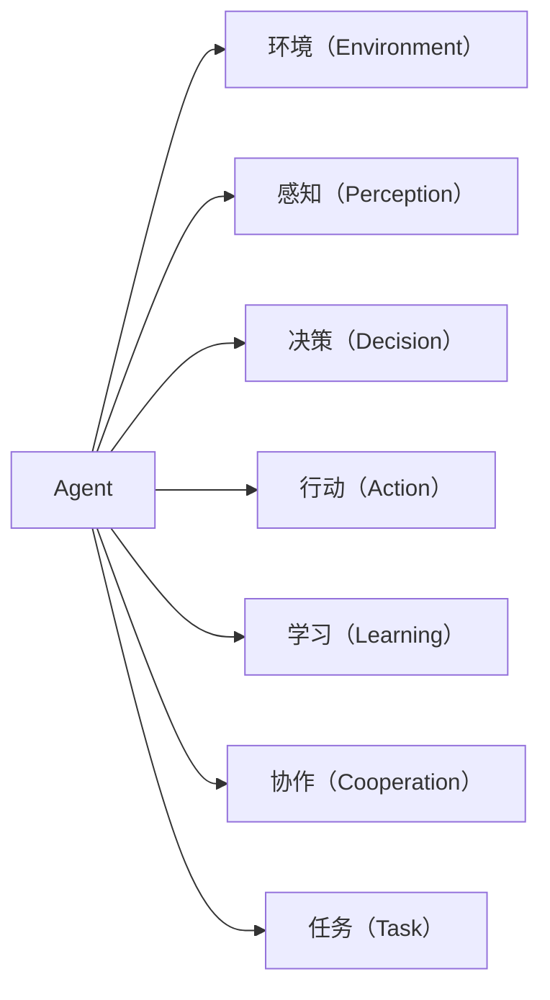

                 

# Agent代理技术在AI系统中的角色

> 关键词：Agent, AI系统, 代理技术, 行为感知, 自适应决策, 协作系统, 游戏AI, 智能推荐

## 1. 背景介绍

### 1.1 问题由来

随着人工智能（AI）技术的迅猛发展，人们开始从传统的计算智能向更加智能的感知和决策能力迈进。传统的AI系统往往依赖于规则和算法，但在面对复杂多变的环境时，其决策的灵活性和自适应性存在不足。为了解决这一问题，代理技术（Agent Technology）被引入到AI系统中，成为连接环境感知与智能决策的桥梁。

代理技术源于复杂系统理论，其核心思想是将一个系统划分为多个具有自主性的“代理”（Agent），每个代理可以独立地感知环境、进行决策和执行动作，并与其他代理或环境进行交互。通过合理设计代理的感知、决策和行动机制，使得整个系统具备更强的自适应性和鲁棒性。

### 1.2 问题核心关键点

在AI系统中引入代理技术，可以显著提升系统的智能水平和适应性。具体来说，其关键点包括：

1. **自主感知与决策**：代理技术赋予系统自主感知环境和进行智能决策的能力。
2. **分布式协作**：多个代理可以协同工作，实现更复杂的任务。
3. **环境适应性**：代理可以根据环境变化动态调整策略和行为。
4. **智能推荐**：代理技术可以基于用户行为推荐个性化内容，提升用户体验。

### 1.3 问题研究意义

在AI系统中引入代理技术，对于提升系统的智能水平和适应性具有重要意义：

1. **提升决策质量**：代理技术可以提供更灵活、自适应的决策机制，适应复杂多变的环境。
2. **增强系统鲁棒性**：代理之间的分布式协作和自主决策，提升了系统的容错能力和鲁棒性。
3. **优化资源利用**：代理技术可以根据环境动态调整资源分配，提升系统效率。
4. **改善用户体验**：代理技术可以基于用户行为进行智能推荐，提升用户体验。
5. **促进协作与创新**：代理技术促进了系统各组件之间的协作与创新，推动AI技术的不断进步。

## 2. 核心概念与联系

### 2.1 核心概念概述

为更好地理解Agent代理技术在AI系统中的作用，本节将介绍几个密切相关的核心概念：

- **Agent**：具有自主感知和决策能力的智能实体，可以在复杂环境中独立进行行为选择和执行。
- **环境（Environment）**：Agent进行决策和执行动作的外部世界，可以是物理世界、虚拟世界或抽象空间。
- **感知（Perception）**：Agent获取环境信息的过程，包括视觉、听觉、触觉等感官信息的处理。
- **决策（Decision）**：Agent在感知环境后，根据预定义的目标或学习到的规则进行智能决策。
- **行动（Action）**：Agent基于决策执行的具体动作或策略。
- **学习（Learning）**：Agent通过与环境的交互，不断优化感知、决策和行动机制，提升智能水平。
- **协作（Cooperation）**：多个Agent之间通过通信和协调，实现更复杂的任务。
- **任务（Task）**：Agent需要完成的具体目标或问题，可以是简单的动作执行，也可以是复杂的任务规划和决策。

这些核心概念之间的逻辑关系可以通过以下Mermaid流程图来展示：



这个流程图展示了Agent代理技术的基本构成和主要环节：

1. Agent从环境中获取感知信息。
2. 感知信息经过处理后，Agent进行决策。
3. Agent执行决策指定的动作。
4. Agent通过与环境的交互不断学习优化。
5. 多个Agent之间可以进行协作，共同完成任务。

这些概念共同构成了Agent代理技术的基础，使得AI系统具备自主决策、自适应和协作的能力。通过理解这些核心概念，我们可以更好地把握Agent代理技术的工作原理和优化方向。

## 3. 核心算法原理 & 具体操作步骤
### 3.1 算法原理概述

Agent代理技术在AI系统中的核心思想是：将AI系统拆分为多个自主的Agent，每个Agent具备感知、决策和行动的能力，能够在复杂环境中独立进行智能决策和行为执行。通过合理设计Agent的感知、决策和行动机制，使得整个系统具备更强的自适应性和鲁棒性。

形式化地，假设AI系统包含 $N$ 个Agent，每个Agent $i$ 的感知、决策和行动机制分别由函数 $P_i$、$D_i$ 和 $A_i$ 表示，则系统的总行为 $B$ 可以表示为：

$$
B = \{A_i(P_i(D_i(\mathcal{E}_i)) | i=1,\ldots,N\}
$$

其中 $\mathcal{E}_i$ 为Agent $i$ 所处的环境，$P_i$、$D_i$ 和 $A_i$ 分别为感知、决策和行动的映射函数。

### 3.2 算法步骤详解

Agent代理技术在AI系统中的具体实施步骤如下：

**Step 1: 设计Agent模型**

1. **感知模块**：设计Agent如何获取环境信息，包括视觉、听觉、触觉等传感器信息。
2. **决策模块**：设计Agent如何根据感知信息进行智能决策，可以是简单的逻辑判断，也可以是复杂的机器学习模型。
3. **行动模块**：设计Agent如何根据决策执行具体的动作或策略。

**Step 2: 定义环境模型**

1. **环境描述**：定义环境的结构和状态，包括环境的空间布局、动态变化等。
2. **环境交互**：定义Agent与环境之间的交互方式，包括数据交换、动作执行等。

**Step 3: 定义Agent通信协议**

1. **消息传递**：定义Agent之间如何进行消息传递和通信，包括协议、格式等。
2. **协作机制**：设计Agent之间的协作方式，包括任务分配、状态同步等。

**Step 4: 实现系统仿真与调试**

1. **仿真平台**：使用仿真平台进行系统行为的模拟和验证，确保系统正确性。
2. **调试工具**：使用调试工具进行系统优化和性能提升。

**Step 5: 部署与上线**

1. **系统部署**：将系统部署到实际环境中，确保系统稳定运行。
2. **监控与维护**：持续监控系统性能，及时进行维护和优化。

### 3.3 算法优缺点

Agent代理技术在AI系统中具有以下优点：

1. **灵活性和自适应性**：多个Agent可以根据环境变化动态调整策略和行为，提升系统的灵活性和自适应性。
2. **容错性和鲁棒性**：Agent之间的分布式协作和自主决策，提升了系统的容错能力和鲁棒性。
3. **资源优化**：Agent可以根据环境动态调整资源分配，提升系统效率。
4. **智能推荐**：Agent技术可以基于用户行为进行智能推荐，提升用户体验。

同时，该方法也存在一定的局限性：

1. **通信开销**：Agent之间的通信可能会增加系统复杂性和通信开销。
2. **协作难度**：设计多个Agent之间的协作机制和消息传递协议，需要耗费大量时间和精力。
3. **计算资源**：Agent感知和决策过程需要消耗大量计算资源，尤其是在大规模系统中。
4. **模型复杂度**：设计复杂环境中的Agent模型和决策算法，需要高度专业化的知识和经验。

尽管存在这些局限性，但Agent代理技术仍是AI系统中不可或缺的重要组成部分，适用于复杂多变的环境和任务。

### 3.4 算法应用领域

Agent代理技术在AI系统中广泛应用于多个领域，包括：

- **游戏AI**：在电子游戏中，Agent代理技术可以用于设计智能玩家、非玩家角色（NPC）等，提升游戏体验和挑战性。
- **智能推荐系统**：基于用户行为数据，设计多个Agent进行智能推荐，提升个性化服务质量。
- **协作机器人**：在制造、物流等领域，多个Agent协作完成复杂的生产或配送任务。
- **智能交通系统**：设计多个Agent进行交通流量管理和调优，提升交通效率和安全性。
- **网络安全系统**：设计多个Agent进行入侵检测和防护，提升网络安全性。
- **自动驾驶系统**：设计多个Agent进行环境感知、路径规划和决策，提升自动驾驶汽车的智能水平。

除了上述这些经典应用外，Agent代理技术还被创新性地应用到更多场景中，如城市规划、灾害应对、资源调度等，为AI技术带来了全新的突破。

## 4. 数学模型和公式 & 详细讲解 & 举例说明

### 4.1 数学模型构建

在AI系统中，Agent代理技术的数学模型可以表示为：

$$
\begin{aligned}
\mathcal{S} &= \{\mathcal{S}_i\}_{i=1}^N \\
\mathcal{A} &= \{\mathcal{A}_i\}_{i=1}^N \\
\mathcal{O} &= \{\mathcal{O}_i\}_{i=1}^N \\
\mathcal{R} &= \mathcal{R}_0 + \sum_{i=1}^N (\mathcal{R}_i - \mathcal{R}_{i-1})
\end{aligned}
$$

其中 $\mathcal{S}$ 表示环境状态，$\mathcal{A}$ 表示Agent的动作空间，$\mathcal{O}$ 表示Agent的观测空间，$\mathcal{R}$ 表示系统的总奖励。

### 4.2 公式推导过程

以下我们以游戏AI为例，推导Agent代理技术的数学模型和算法流程：

1. **环境状态定义**：
   - 假设游戏环境由 $m$ 个状态点 $\mathcal{S}=\{S_1,\ldots,S_m\}$ 组成。
   - 状态 $S_i$ 表示当前的游戏状态，包括玩家的得分、位置、敌人状态等信息。

2. **动作空间定义**：
   - 假设每个Agent有 $n$ 种可行的动作，动作空间 $\mathcal{A}=\{A_1,\ldots,A_n\}$。

3. **观测空间定义**：
   - 假设每个Agent可以获取 $k$ 种观测信息，观测空间 $\mathcal{O}=\{O_1,\ldots,O_k\}$。

4. **总奖励计算**：
   - 假设游戏规则定义了总奖励函数 $\mathcal{R}_0$，每个Agent的奖励函数为 $\mathcal{R}_i$。

基于以上定义，Agent代理技术的游戏AI算法流程可以表示为：

1. **感知模块**：每个Agent通过传感器获取当前状态 $S_i$ 和观测 $O_i$。
2. **决策模块**：每个Agent根据感知结果和策略 $\pi_i$ 进行智能决策，选择动作 $A_i$。
3. **行动模块**：每个Agent执行动作 $A_i$，并根据环境变化更新状态 $S_i$。
4. **奖励计算**：计算总奖励 $\mathcal{R}$ 和每个Agent的奖励 $\mathcal{R}_i$。
5. **学习模块**：每个Agent根据奖励更新策略 $\pi_i$。

### 4.3 案例分析与讲解

**案例1：智能推荐系统**

在智能推荐系统中，设计多个Agent进行个性化推荐，具体流程如下：

1. **环境状态定义**：每个Agent代表一个用户，环境状态 $\mathcal{S}$ 包括用户的历史行为、偏好等信息。
2. **动作空间定义**：每个Agent可以选择推荐某种商品、服务或内容。
3. **观测空间定义**：每个Agent获取用户的行为反馈，如浏览时间、点击率等。
4. **总奖励计算**：总奖励 $\mathcal{R}$ 根据用户的满意度进行计算，每个Agent的奖励 $\mathcal{R}_i$ 根据其推荐内容的受欢迎程度计算。
5. **学习模块**：每个Agent根据用户反馈和推荐效果更新推荐策略。

**案例2：自动驾驶系统**

在自动驾驶系统中，设计多个Agent进行环境感知和路径规划，具体流程如下：

1. **环境状态定义**：每个Agent代表一个传感器或摄像头，环境状态 $\mathcal{S}$ 包括道路状态、交通信号、车辆位置等信息。
2. **动作空间定义**：每个Agent可以选择加速、减速、转向等动作。
3. **观测空间定义**：每个Agent获取传感器数据，如摄像头图像、激光雷达扫描数据等。
4. **总奖励计算**：总奖励 $\mathcal{R}$ 根据驾驶的安全性和舒适性进行计算，每个Agent的奖励 $\mathcal{R}_i$ 根据其行为对系统性能的影响计算。
5. **学习模块**：每个Agent根据驾驶行为和奖励更新策略。

## 5. 项目实践：代码实例和详细解释说明
### 5.1 开发环境搭建

在进行Agent代理技术项目实践前，我们需要准备好开发环境。以下是使用Python进行PyTorch和TensorFlow开发的环境配置流程：

1. 安装Anaconda：从官网下载并安装Anaconda，用于创建独立的Python环境。

2. 创建并激活虚拟环境：
```bash
conda create -n agent-env python=3.8 
conda activate agent-env
```

3. 安装PyTorch和TensorFlow：根据CUDA版本，从官网获取对应的安装命令。例如：
```bash
conda install pytorch torchvision torchaudio cudatoolkit=11.1 -c pytorch -c conda-forge
conda install tensorflow -c conda-forge
```

4. 安装相关的AI库和工具包：
```bash
pip install numpy pandas scikit-learn matplotlib tqdm jupyter notebook ipython
```

完成上述步骤后，即可在`agent-env`环境中开始Agent代理技术的实践。

### 5.2 源代码详细实现

这里我们以游戏AI为例，使用PyTorch实现一个简单的Agent代理技术框架。

```python
import torch
import torch.nn as nn
import torch.optim as optim

class Agent(nn.Module):
    def __init__(self, num_states, num_actions):
        super(Agent, self).__init__()
        self.num_states = num_states
        self.num_actions = num_actions
        self.fc1 = nn.Linear(num_states, 128)
        self.fc2 = nn.Linear(128, num_actions)
        
    def forward(self, state):
        x = self.fc1(state)
        x = nn.ReLU()(x)
        x = self.fc2(x)
        return nn.Softmax(dim=1)(x)

class Environment:
    def __init__(self, num_states):
        self.num_states = num_states
        self.state = 0
        
    def step(self, action):
        if action == 0:
            self.state = (self.state + 1) % self.num_states
        else:
            self.state = (self.state - 1) % self.num_states
        return self.state
        
class GameAI:
    def __init__(self, num_states, num_agents, num_actions):
        self.num_states = num_states
        self.num_agents = num_agents
        self.num_actions = num_actions
        self.agents = [Agent(num_states, num_actions) for _ in range(num_agents)]
        self.environment = Environment(num_states)
        
    def train(self, num_epochs):
        optimizer = optim.Adam(self.parameters(), lr=0.001)
        loss_fn = nn.CrossEntropyLoss()
        
        for epoch in range(num_epochs):
            state = 0
            for _ in range(num_states):
                actions = [self.agents[i](state) for i in range(num_agents)]
                new_state = [self.environment.step(action) for action in actions]
                loss = loss_fn(torch.tensor(actions).view(-1), torch.tensor(actions).view(-1))
                optimizer.zero_grad()
                loss.backward()
                optimizer.step()
                state = new_state
        
        print("Training completed.")
        
    def test(self):
        state = 0
        for _ in range(num_states):
            actions = [self.agents[i](state) for i in range(num_agents)]
            new_state = [self.environment.step(action) for action in actions]
            state = new_state
```

这里定义了一个简单的游戏AI模型，包含环境类、Agent类和游戏AI类。

- **Agent类**：定义Agent的感知、决策和行动机制。
- **Environment类**：定义环境的状态和行为。
- **GameAI类**：管理多个Agent，并进行游戏训练和测试。

### 5.3 代码解读与分析

让我们再详细解读一下关键代码的实现细节：

**Agent类**：
- `__init__`方法：初始化Agent的参数，包括状态空间和动作空间的大小。
- `forward`方法：定义Agent的感知、决策和行动过程。

**Environment类**：
- `__init__`方法：初始化环境的状态。
- `step`方法：定义环境的行为，即根据动作更新状态。

**GameAI类**：
- `__init__`方法：初始化多个Agent和环境。
- `train`方法：定义Agent代理技术的训练过程。
- `test`方法：定义Agent代理技术的测试过程。

在训练过程中，我们使用了Adam优化器进行参数更新，并定义了交叉熵损失函数来评估每个Agent的决策效果。通过不断迭代训练，Agent可以逐步学习到最优的感知和决策策略，提升游戏AI的智能水平。

在测试过程中，我们可以观察Agent的决策行为和环境状态的演变，评估其智能水平。

## 6. 实际应用场景
### 6.1 智能客服系统

Agent代理技术可以广泛应用于智能客服系统的构建。传统客服往往需要配备大量人力，高峰期响应缓慢，且一致性和专业性难以保证。而使用Agent代理技术构建的智能客服系统，可以7x24小时不间断服务，快速响应客户咨询，用自然流畅的语言解答各类常见问题。

在技术实现上，可以收集企业内部的历史客服对话记录，将问题和最佳答复构建成监督数据，在此基础上对预训练语言模型进行微调。微调后的语言模型可以作为Agent的感知和决策模块，结合对话系统进行智能客服。对于客户提出的新问题，还可以接入检索系统实时搜索相关内容，动态组织生成回答。如此构建的智能客服系统，能大幅提升客户咨询体验和问题解决效率。

### 6.2 金融舆情监测

金融机构需要实时监测市场舆论动向，以便及时应对负面信息传播，规避金融风险。传统的人工监测方式成本高、效率低，难以应对网络时代海量信息爆发的挑战。基于Agent代理技术的文本分类和情感分析技术，为金融舆情监测提供了新的解决方案。

具体而言，可以收集金融领域相关的新闻、报道、评论等文本数据，并对其进行主题标注和情感标注。在此基础上对预训练语言模型进行微调，使其能够自动判断文本属于何种主题，情感倾向是正面、中性还是负面。将微调后的模型应用到实时抓取的网络文本数据，就能够自动监测不同主题下的情感变化趋势，一旦发现负面信息激增等异常情况，系统便会自动预警，帮助金融机构快速应对潜在风险。

### 6.3 个性化推荐系统

当前的推荐系统往往只依赖用户的历史行为数据进行物品推荐，无法深入理解用户的真实兴趣偏好。基于Agent代理技术的个性化推荐系统可以更好地挖掘用户行为背后的语义信息，从而提供更精准、多样的推荐内容。

在实践中，可以收集用户浏览、点击、评论、分享等行为数据，提取和用户交互的物品标题、描述、标签等文本内容。将文本内容作为模型输入，用户的后续行为（如是否点击、购买等）作为监督信号，在此基础上微调预训练语言模型。微调后的模型能够从文本内容中准确把握用户的兴趣点。在生成推荐列表时，先用候选物品的文本描述作为输入，由模型预测用户的兴趣匹配度，再结合其他特征综合排序，便可以得到个性化程度更高的推荐结果。

### 6.4 未来应用展望

随着Agent代理技术的不断发展，其在AI系统中的应用前景将更加广阔。

- **智慧医疗**：基于Agent代理技术的医疗问答、病历分析、药物研发等应用将提升医疗服务的智能化水平，辅助医生诊疗，加速新药开发进程。
- **智能教育**：Agent代理技术可应用于作业批改、学情分析、知识推荐等方面，因材施教，促进教育公平，提高教学质量。
- **智慧城市治理**：Agent代理技术可以促进城市事件监测、舆情分析、应急指挥等环节，提高城市管理的自动化和智能化水平，构建更安全、高效的未来城市。
- **智能推荐系统**：基于Agent代理技术的推荐系统将更好地利用用户行为数据，提升个性化服务质量。
- **智能交通系统**：设计多个Agent进行交通流量管理和调优，提升交通效率和安全性。

## 7. 工具和资源推荐
### 7.1 学习资源推荐

为了帮助开发者系统掌握Agent代理技术的理论基础和实践技巧，这里推荐一些优质的学习资源：

1. 《Agent-Based Modeling》系列书籍：详细介绍了Agent代理技术的基本原理和应用场景，适合初学者和高级读者。
2. CS223《人工智能与机器人》课程：斯坦福大学开设的AI课程，有Lecture视频和配套作业，带你深入了解Agent代理技术的核心思想。
3. 《Multi-Agent Systems》书籍：介绍多Agent系统及其应用，适合对Agent代理技术有深入兴趣的读者。
4. 《Reinforcement Learning》书籍：介绍强化学习及其应用，其中包含大量Agent代理技术的实例和案例分析。
5. 《Handbook of Natural Computation》：介绍复杂系统的建模和仿真方法，适合需要系统性学习的读者。

通过对这些资源的学习实践，相信你一定能够快速掌握Agent代理技术的精髓，并用于解决实际的AI问题。
###  7.2 开发工具推荐

高效的开发离不开优秀的工具支持。以下是几款用于Agent代理技术开发的常用工具：

1. PyTorch：基于Python的开源深度学习框架，灵活动态的计算图，适合快速迭代研究。

2. TensorFlow：由Google主导开发的开源深度学习框架，生产部署方便，适合大规模工程应用。

3. ROS（Robot Operating System）：开源的机器人操作系统，支持多Agent系统建模和仿真。

4. Microsoft Simulacra：微软推出的多Agent系统仿真平台，支持丰富的仿真环境。

5. AnyLogic：支持多Agent系统的建模和仿真，适合复杂系统的仿真验证。

6. Jupyter Notebook：强大的交互式开发环境，支持Python和R等语言的开发和调试。

合理利用这些工具，可以显著提升Agent代理技术的开发效率，加快创新迭代的步伐。

### 7.3 相关论文推荐

Agent代理技术在AI领域的研究已经相当成熟，以下是几篇奠基性的相关论文，推荐阅读：

1. "Multi-Agent Systems" by Marcus Hutter：介绍多Agent系统及其应用，奠定了Agent代理技术的理论基础。

2. "Robot Operating System: A generic and extensible robot operating system" by J.J. Dieter，V. Sandlin，M.J. Bear：介绍ROS的架构和应用，适合开发多Agent系统的初学者。

3. "Introduction to Multi-Agent Systems" by Nir A. Shoham：介绍多Agent系统及其建模方法，适合需要系统性学习的读者。

4. "The Concept of Intelligence for Autonomous Agents in Multi-Agent Systems" by M. Wooldridge，J. Konijn：介绍Agent代理技术的定义和应用场景，适合对Agent代理技术有深入兴趣的读者。

5. "Machine Learning for Multi-Agent Systems: A Survey" by A. Kak，E. Adali：介绍Agent代理技术的机器学习应用，适合对Agent代理技术有深入兴趣的读者。

这些论文代表了大语言模型微调技术的发展脉络。通过学习这些前沿成果，可以帮助研究者把握学科前进方向，激发更多的创新灵感。

## 8. 总结：未来发展趋势与挑战

### 8.1 总结

本文对Agent代理技术在AI系统中的角色进行了全面系统的介绍。首先阐述了Agent代理技术的研究背景和意义，明确了Agent代理技术在提升系统智能水平和适应性方面的独特价值。其次，从原理到实践，详细讲解了Agent代理技术的数学原理和关键步骤，给出了Agent代理技术项目开发的完整代码实例。同时，本文还广泛探讨了Agent代理技术在智能客服、金融舆情、个性化推荐等多个行业领域的应用前景，展示了Agent代理技术的巨大潜力。此外，本文精选了Agent代理技术的各类学习资源，力求为读者提供全方位的技术指引。

通过本文的系统梳理，可以看到，Agent代理技术正在成为AI系统中不可或缺的重要组成部分，极大地提升了系统的智能水平和适应性。Agent代理技术在复杂多变的环境和任务中，表现出了强大的自适应性和鲁棒性，适用于多个高风险和高复杂性的应用场景。未来，随着Agent代理技术的不断演进和优化，其在AI系统中的应用将更加广泛和深入，为AI技术的落地和产业化提供强大的动力。

### 8.2 未来发展趋势

展望未来，Agent代理技术在AI系统中将呈现以下几个发展趋势：

1. **智能水平提升**：通过不断优化感知、决策和行动机制，Agent代理技术的智能水平将持续提升。
2. **分布式协作**：Agent代理技术将更加注重分布式协作和资源优化，提升系统的效率和鲁棒性。
3. **多模态融合**：Agent代理技术将融合视觉、听觉、触觉等多模态信息，提升系统的感知和决策能力。
4. **自适应学习**：Agent代理技术将更加注重自适应学习，使得系统能够根据环境变化动态调整策略。
5. **个性化推荐**：Agent代理技术将更好地利用用户行为数据，提供更加个性化的服务。

### 8.3 面临的挑战

尽管Agent代理技术在AI系统中取得了显著进展，但在迈向更加智能化、普适化应用的过程中，仍面临诸多挑战：

1. **系统复杂度**：设计多个Agent之间的协作机制和消息传递协议，需要耗费大量时间和精力。
2. **计算资源**：Agent感知和决策过程需要消耗大量计算资源，尤其是在大规模系统中。
3. **数据质量**：Agent代理技术需要大量的数据进行训练和优化，数据的准确性和多样性对系统性能有重要影响。
4. **安全性和隐私**：Agent代理技术需要保护用户隐私和数据安全，防止数据泄露和滥用。
5. **可解释性**：Agent代理技术需要提供系统的可解释性，帮助用户理解系统的决策过程。

尽管存在这些挑战，但随着Agent代理技术的不断发展和优化，其在AI系统中的应用前景将更加广阔。相信随着学界和产业界的共同努力，这些挑战终将一一被克服，Agent代理技术必将在构建智能系统方面发挥更大的作用。

### 8.4 研究展望

面对Agent代理技术所面临的挑战，未来的研究需要在以下几个方面寻求新的突破：

1. **分布式优化算法**：设计高效的分布式优化算法，提升Agent代理技术的训练和优化效率。
2. **多模态感知**：研究多模态感知方法，提升Agent代理技术的感知能力。
3. **自适应学习算法**：开发自适应学习算法，使得Agent代理技术能够动态调整策略，提升系统智能水平。
4. **个性化推荐算法**：研究个性化推荐算法，提升Agent代理技术的推荐效果。
5. **数据隐私保护**：研究数据隐私保护技术，确保Agent代理技术的安全性和隐私性。
6. **模型可解释性**：研究模型可解释性方法，提升Agent代理技术的可解释性和透明度。

这些研究方向的探索，必将引领Agent代理技术迈向更高的台阶，为构建安全、可靠、可解释、可控的智能系统铺平道路。面向未来，Agent代理技术还需要与其他AI技术进行更深入的融合，如知识表示、因果推理、强化学习等，多路径协同发力，共同推动AI技术的不断进步。只有勇于创新、敢于突破，才能不断拓展Agent代理技术的边界，让智能技术更好地造福人类社会。

## 9. 附录：常见问题与解答

**Q1：Agent代理技术是否适用于所有AI任务？**

A: Agent代理技术在大多数AI任务上都能取得不错的效果，特别是对于复杂多变的环境和任务。但对于一些简单任务，如简单的图像分类、语音识别等，Agent代理技术的优势并不明显，可能需要其他更适合的AI技术。

**Q2：如何设计高效的Agent代理系统？**

A: 设计高效的Agent代理系统需要考虑以下几个关键因素：
1. **环境建模**：准确描述环境的动态变化和状态转移。
2. **感知设计**：设计高效的环境感知模块，确保Agent能够获取准确和全面的环境信息。
3. **决策优化**：优化决策算法，确保Agent能够做出最优决策。
4. **行动执行**：设计高效的行动执行模块，确保Agent能够快速响应决策结果。
5. **系统集成**：将多个Agent进行合理集成，实现系统的协同工作。

**Q3：Agent代理技术在实际部署中需要注意哪些问题？**

A: 将Agent代理技术应用于实际部署，还需要考虑以下因素：
1. **系统稳定性**：确保Agent代理系统的稳定性和可靠性。
2. **资源消耗**：优化Agent感知和决策过程中的资源消耗，提升系统效率。
3. **可扩展性**：确保Agent代理系统能够适应大规模环境变化和数据量增加。
4. **可解释性**：提供系统的可解释性，帮助用户理解系统的决策过程。

**Q4：Agent代理技术在实际应用中如何提升用户体验？**

A: Agent代理技术可以通过以下方式提升用户体验：
1. **个性化推荐**：根据用户行为和偏好，提供个性化的服务和内容。
2. **智能客服**：通过多Agent协作，提供7x24小时不间断的智能客服服务。
3. **智能导航**：根据用户当前位置和目的地，提供最优的导航路径。

**Q5：Agent代理技术在实际应用中如何应对复杂多变的环境？**

A: Agent代理技术可以通过以下方式应对复杂多变的环境：
1. **自适应学习**：Agent代理技术可以动态调整策略，适应环境变化。
2. **多Agent协作**：通过多Agent协作，提升系统的容错能力和鲁棒性。
3. **知识整合**：Agent代理技术可以整合外部知识库和规则库，提升系统的智能水平。

---

作者：禅与计算机程序设计艺术 / Zen and the Art of Computer Programming

