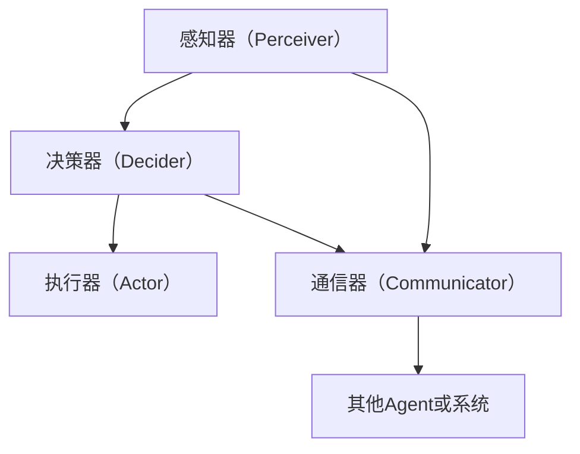

                 

## 1. 背景介绍

### 1.1 问题由来
在现代软件开发中，分布式系统变得越来越普遍，每个系统都包含众多服务、组件和子系统，这给系统开发和维护带来了巨大的挑战。传统的单体应用架构已经不再适用，分布式系统需要由多个独立的组件或服务来组成。在这样的背景下，Agent（代理）的概念应运而生，成为现代软件架构的重要组成部分。

Agent是一种软件组件，通常运行在特定的环境下，可以处理特定的事件或任务，并能与其他Agent或系统进行通信。Agent在分布式系统中扮演着至关重要的角色，能够提供自动化的任务处理、故障恢复、安全保护等重要功能，大幅提高系统的健壮性和可维护性。

### 1.2 问题核心关键点
- **核心概念**：Agent是一种能够感知环境、自治执行任务的智能软件实体。
- **核心能力**：自治性、适应性、响应性、移动性、社会性。
- **关键技术**：通信机制、任务调度、状态管理、知识表示与推理、任务分发与负载均衡。

### 1.3 问题研究意义
- **提升系统健壮性**：Agent能够在系统出现故障时自动恢复，减少系统宕机和停机时间。
- **提高系统可维护性**：通过Agent自动处理日常任务和故障，减轻人工维护的负担。
- **增强系统安全性**：Agent能够实时监控系统状态，及时发现并拦截潜在的安全威胁。
- **实现系统优化**：Agent能够根据环境变化动态调整自身行为，优化系统性能。
- **推动技术创新**：Agent概念的应用为软件工程带来了新的研究方向和应用场景，促进了相关技术的发展。

## 2. 核心概念与联系

### 2.1 核心概念概述

Agent代理是一种具有一定智能性的软件实体，能够在分布式系统中独立运行，并具备一定的感知能力、任务执行能力和自主决策能力。Agent的核心特性包括自治性、适应性、响应性、移动性和社会性，这些特性使得Agent在复杂系统中能够发挥重要的作用。

- **自治性（Autonomy）**：Agent能够独立运行，无需外部控制，具备自我管理能力。
- **适应性（Adaptability）**：Agent能够根据环境变化动态调整自身行为，适应不同的应用场景。
- **响应性（Reactivity）**：Agent能够对环境变化做出快速响应，及时处理任务和异常。
- **移动性（Mobility）**：Agent能够在不同环境中移动，寻找最优的任务执行路径。
- **社会性（Sociality）**：Agent能够与其他Agent或系统进行通信，协调任务执行，实现任务并行处理。

### 2.2 核心概念原理和架构的 Mermaid 流程图



该流程图展示了Agent的基本结构和功能模块：

1. **感知器（Perceiver）**：用于感知环境状态，获取外部信息。
2. **决策器（Decider）**：根据感知到的信息，决策如何执行任务。
3. **执行器（Actor）**：执行决策器下达的命令，完成任务。
4. **通信器（Communicator）**：用于与其他Agent或系统进行通信，协调任务执行。
5. **其他Agent或系统（Other Agents/System）**：作为Agent的环境或协作对象。

### 2.3 核心概念之间的关系

Agent代理通过感知器获取环境信息，决策器根据感知到的信息进行任务决策，执行器执行决策器下达的任务，通信器与其他Agent或系统进行通信协调，从而实现系统中的任务自动处理和优化。

## 3. 核心算法原理 & 具体操作步骤

### 3.1 算法原理概述

Agent代理的核心算法主要包括以下几个关键步骤：

1. **环境感知**：Agent通过传感器、接口等手段感知环境状态，获取所需的信息。
2. **任务决策**：Agent根据感知到的信息，使用决策算法（如规则引擎、启发式搜索、机器学习等）进行任务决策。
3. **任务执行**：Agent根据决策结果，执行相应的任务，完成具体的工作。
4. **通信与协调**：Agent与其他Agent或系统进行通信，协调任务执行，优化资源利用。
5. **反馈与调整**：Agent根据任务执行结果，反馈信息到决策器，调整下一步决策。

### 3.2 算法步骤详解

**Step 1: 环境感知**
- 定义感知器接口，用于获取环境状态信息。
- 编写环境感知模块，根据不同的环境类型，选择合适的感知方式，如传感器、API接口等。
- 编写数据处理模块，对感知到的数据进行预处理，提取有用信息。

**Step 2: 任务决策**
- 定义决策器接口，用于进行任务决策。
- 编写决策算法模块，根据感知到的环境信息，选择合适的决策策略，如规则引擎、启发式搜索、机器学习等。
- 编写决策执行模块，根据决策结果，生成任务执行指令。

**Step 3: 任务执行**
- 定义执行器接口，用于执行具体任务。
- 编写任务执行模块，根据决策器下达的指令，执行相应的任务。
- 编写任务监控模块，监控任务执行状态，及时处理异常情况。

**Step 4: 通信与协调**
- 定义通信器接口，用于与其他Agent或系统进行通信。
- 编写通信协议模块，根据通信需求，选择合适的通信协议（如REST、gRPC、MQTT等）。
- 编写协调器模块，协调不同Agent之间的任务执行，实现任务并行处理。

**Step 5: 反馈与调整**
- 定义反馈接口，用于接收任务执行结果。
- 编写反馈处理模块，根据任务执行结果，更新感知器、决策器和执行器，优化任务执行过程。
- 编写参数调整模块，根据反馈信息，调整模型参数和决策算法，提升任务执行效果。

### 3.3 算法优缺点

**优点**：
- **自治性**：Agent能够独立运行，无需外部干预，提高系统健壮性和可维护性。
- **响应性**：Agent能够实时感知环境变化，快速响应任务需求，提高系统响应速度。
- **灵活性**：Agent能够根据环境变化动态调整自身行为，适应不同的应用场景。
- **协作性**：Agent能够与其他Agent或系统进行通信协调，实现任务并行处理，提高系统效率。

**缺点**：
- **复杂性**：Agent代理的设计和实现较为复杂，需要考虑多方面的因素，如通信协议、任务调度、状态管理等。
- **资源消耗**：Agent代理的运行需要一定的计算资源和通信带宽，可能会增加系统负担。
- **安全性**：Agent代理在网络环境下运行，容易受到网络攻击和数据泄露等威胁。

### 3.4 算法应用领域

Agent代理广泛应用于各种分布式系统中，包括：

1. **物联网（IoT）**：IoT设备可以通过Agent代理进行联网、监测和控制，实现智能家居、智慧城市等功能。
2. **企业信息系统**：企业系统中的各类应用模块可以通过Agent代理实现自动化任务处理、故障恢复和安全保护等功能。
3. **金融交易系统**：Agent代理可以在金融交易系统中进行实时监控、异常检测和风险控制，保障交易安全。
4. **医疗系统**：Agent代理可以在医疗系统中进行患者监护、医疗资源调度和电子病历管理等任务。
5. **网络安全**：Agent代理可以实时监控网络流量，检测并拦截恶意攻击和病毒，保障网络安全。
6. **智能制造**：Agent代理可以在智能制造系统中进行设备监控、故障诊断和调度优化等任务，提高生产效率。

## 4. 数学模型和公式 & 详细讲解 & 举例说明

### 4.1 数学模型构建

Agent代理的数学模型主要包括以下几个部分：

1. **环境感知模型**：描述Agent感知环境的方式，通常使用传感器数据、接口调用等。
2. **任务决策模型**：描述Agent进行任务决策的方式，通常使用规则引擎、启发式搜索、机器学习等算法。
3. **任务执行模型**：描述Agent执行任务的方式，通常使用具体的工作流程和代码实现。
4. **通信与协调模型**：描述Agent与其他Agent或系统进行通信协调的方式，通常使用通信协议和协调算法。
5. **反馈与调整模型**：描述Agent根据任务执行结果进行反馈调整的方式，通常使用反馈机制和参数优化算法。

### 4.2 公式推导过程

以一个简单的规则引擎为例，其基本流程如下：

1. **输入状态**：Agent感知器获取环境状态 $s$。
2. **规则匹配**：Agent决策器根据规则库 $\mathcal{R}$ 匹配规则，找到满足规则 $r$ 的状态转换 $s'=s[r]$。
3. **输出状态**：Agent执行器执行 $s'$，输出结果 $o$。
4. **通信与协调**：Agent通信器与其他Agent或系统进行通信，协调任务执行。
5. **反馈与调整**：Agent根据输出结果 $o$ 进行反馈调整，更新感知器、决策器和执行器。

### 4.3 案例分析与讲解

假设在一个智能家居系统中，Agent代理用于控制照明设备。其核心流程如下：

1. **环境感知**：Agent通过传感器获取室内光线强度和用户行为数据。
2. **任务决策**：Agent根据当前光线强度和用户行为数据，使用规则引擎匹配相应的灯光调节规则。
3. **任务执行**：Agent执行灯光调节规则，调整灯光亮度和颜色。
4. **通信与协调**：Agent与其他Agent或系统（如安防系统、智能音箱）进行通信协调，实现智能家居的协同控制。
5. **反馈与调整**：Agent根据用户反馈和环境变化，调整灯光调节规则，优化灯光效果。

## 5. 项目实践：代码实例和详细解释说明

### 5.1 开发环境搭建

在进行Agent代理项目开发前，需要先准备好开发环境。以下是使用Python进行开发的环境配置流程：

1. 安装Anaconda：从官网下载并安装Anaconda，用于创建独立的Python环境。
2. 创建并激活虚拟环境：
```bash
conda create -n agent-env python=3.8 
conda activate agent-env
```

3. 安装Python包：
```bash
pip install flask requests
```

4. 安装通信协议库：
```bash
pip install flask-restful gunicorn
```

5. 安装数据处理库：
```bash
pip install pandas numpy
```

完成上述步骤后，即可在`agent-env`环境中开始Agent代理项目开发。

### 5.2 源代码详细实现

下面以一个简单的智能家居Agent为例，给出Python代码实现。

```python
from flask import Flask, request
import pandas as pd
import numpy as np

app = Flask(__name__)

# 定义环境感知器，用于获取室内光线强度和用户行为数据
def get_environment_state():
    # 假设从传感器获取光线强度和用户行为数据
    light_level = 150
    user_behavior = 'watching_tv'
    return light_level, user_behavior

# 定义任务决策器，使用规则引擎进行任务决策
def make_decision(light_level, user_behavior):
    if user_behavior == 'watching_tv':
        if light_level < 100:
            return 'turn_on_lights'
    elif user_behavior == 'sleeping':
        if light_level > 50:
            return 'turn_off_lights'
    else:
        return 'do_nothing'

# 定义任务执行器，调整灯光亮度和颜色
def execute_action(action):
    if action == 'turn_on_lights':
        print('Turn on lights')
    elif action == 'turn_off_lights':
        print('Turn off lights')
    else:
        print('No action')

# 定义通信器，与安防系统和其他Agent进行通信
def communicate_with_security_system():
    print('Communicate with security system')

# 定义反馈与调整器，根据用户反馈和环境变化调整灯光调节规则
def adjust_action(action, feedback):
    if feedback == 'satisfied':
        if action == 'turn_on_lights':
            print('Decrease light level')
        elif action == 'turn_off_lights':
            print('Increase light level')
    else:
        print('No adjustment')

@app.route('/action', methods=['POST'])
def action_endpoint():
    data = request.get_json()
    light_level, user_behavior = get_environment_state()
    action = make_decision(light_level, user_behavior)
    execute_action(action)
    communicate_with_security_system()
    adjust_action(action, feedback=data['feedback'])
    return 'Action executed'

if __name__ == '__main__':
    app.run(host='0.0.0.0', port=5000)
```

### 5.3 代码解读与分析

让我们再详细解读一下关键代码的实现细节：

**环境感知器**：
- `get_environment_state`方法：获取室内光线强度和用户行为数据。

**任务决策器**：
- `make_decision`方法：根据当前光线强度和用户行为数据，使用规则引擎进行任务决策。

**任务执行器**：
- `execute_action`方法：调整灯光亮度和颜色。

**通信器**：
- `communicate_with_security_system`方法：与其他Agent或系统进行通信协调。

**反馈与调整器**：
- `adjust_action`方法：根据用户反馈和环境变化，调整灯光调节规则。

**Flask应用**：
- 定义了一个简单的REST API端点`action_endpoint`，接收用户行为数据，并根据决策器、执行器和反馈器的结果，生成并执行相应的灯光调节动作。

**运行结果展示**：
- 在运行环境中，可以使用`curl`或其他HTTP客户端向`http://localhost:5000/action`端点发送POST请求，测试Agent代理的功能。

## 6. 实际应用场景

### 6.1 智能家居系统

Agent代理可以在智能家居系统中发挥重要作用，通过感知家庭环境，自动调整灯光、温度等设备状态，提升用户的生活体验。

**具体实现**：
- Agent通过传感器感知室内光线强度和温度，根据用户行为（如观看电视、睡觉等）进行任务决策，自动调整灯光和空调状态。
- Agent与其他设备（如智能音箱、安防系统）进行通信协调，实现设备间的协同控制。
- Agent根据用户反馈和环境变化，动态调整灯光调节规则，优化灯光效果。

### 6.2 企业信息系统

Agent代理可以在企业信息系统中部署，实现自动化任务处理、故障恢复和安全保护等功能。

**具体实现**：
- Agent通过API接口获取系统状态信息，使用规则引擎进行任务决策，自动执行监控、备份、报警等任务。
- Agent与其他系统（如数据库、日志系统）进行通信协调，实现任务并行处理。
- Agent根据任务执行结果，动态调整系统配置和任务执行策略，优化系统性能。

### 6.3 网络安全系统

Agent代理可以在网络安全系统中运行，实时监控网络流量，检测并拦截恶意攻击和病毒。

**具体实现**：
- Agent通过网络接口获取流量数据，使用机器学习算法进行异常检测，识别恶意流量。
- Agent与其他安全设备（如防火墙、入侵检测系统）进行通信协调，及时拦截恶意流量。
- Agent根据攻击特征，动态调整检测规则和防御策略，提升系统安全性。

## 7. 工具和资源推荐

### 7.1 学习资源推荐

为了帮助开发者系统掌握Agent代理的理论基础和实践技巧，这里推荐一些优质的学习资源：

1. **《Agent-based Modeling and Simulation》书籍**：全面介绍Agent代理建模和仿真的基本概念和应用场景，适合初学者系统学习。
2. **Coursera《Agent-Based Modeling》课程**：由MIT教授讲授的在线课程，涵盖Agent代理建模的基本原理和实践技巧，适合进阶学习。
3. **IEEE Xplore《Agent-based Systems》期刊**：涵盖Agent代理系统的研究进展和应用案例，适合深入研究和论文阅读。
4. **NSF《Agent-Based Social Science》项目**：涵盖Agent代理在社会科学中的应用案例，适合理解Agent代理的社会属性。
5. **CSDN《Agent技术入门》系列博文**：由行业专家撰写，详细介绍Agent代理的基本原理和应用场景，适合技术实践。

通过对这些资源的学习实践，相信你一定能够快速掌握Agent代理的精髓，并用于解决实际的系统问题。

### 7.2 开发工具推荐

Agent代理的开发需要依赖多种工具和技术，以下是几款常用的开发工具：

1. **Python**：Agent代理项目的主流开发语言，简单易用，生态丰富。
2. **Flask**：轻量级的Web框架，适合开发REST API接口。
3. **gRPC**：高性能的通信协议，适合Agent之间的通信协调。
4. **TensorFlow**：强大的机器学习框架，适合Agent进行智能决策和异常检测。
5. **RapidMiner**：数据处理和分析工具，适合Agent进行数据预处理和特征提取。

合理利用这些工具，可以显著提升Agent代理的开发效率，加快创新迭代的步伐。

### 7.3 相关论文推荐

Agent代理的研究源于学界的持续探索，以下是几篇奠基性的相关论文，推荐阅读：

1. **《The Foundation of Distributed Agents》论文**：提出Agent代理的基本概念和设计原则，奠定Agent代理的理论基础。
2. **《A Survey of Multi-Agent Systems》论文**：全面综述了Agent代理系统的研究进展和应用场景，适合理解Agent代理的全局视角。
3. **《Decentralized Multi-Agent Systems》论文**：介绍Agent代理在分布式系统中的应用案例，适合深入研究和应用。
4. **《Economic Principles for Multi-Agent Systems》论文**：引入经济学原理，优化Agent代理的行为决策，适合理解Agent代理的经济学属性。
5. **《Multi-Agent Systems in Operations Management》论文**：应用Agent代理优化运营管理，适合理解Agent代理在实际业务中的应用。

这些论文代表了大Agent代理的研究进展，通过学习这些前沿成果，可以帮助研究者把握学科前进方向，激发更多的创新灵感。

## 8. 总结：未来发展趋势与挑战

### 8.1 总结

本文对Agent代理的实现与应用进行了全面系统的介绍。首先阐述了Agent代理的基本概念、核心能力和关键技术，明确了Agent代理在现代软件架构中的重要作用。其次，从原理到实践，详细讲解了Agent代理的数学模型和操作步骤，给出了Agent代理项目开发的完整代码实例。同时，本文还广泛探讨了Agent代理在智能家居、企业信息系统、网络安全等领域的实际应用前景，展示了Agent代理的广泛应用价值。最后，本文精选了Agent代理的学习资源、开发工具和相关论文，力求为读者提供全方位的技术指引。

通过本文的系统梳理，可以看到，Agent代理作为一种重要的软件架构模式，在分布式系统中发挥着越来越重要的作用。Agent代理的设计和实现需要考虑多方面的因素，包括感知器、决策器、执行器、通信器和反馈器等关键模块，但只要合理设计和优化，Agent代理就能够大大提升系统的健壮性、可维护性和安全性。

### 8.2 未来发展趋势

展望未来，Agent代理技术将呈现以下几个发展趋势：

1. **多Agent协同**：未来Agent代理将更加注重多Agent之间的协同工作，实现任务并行处理，提升系统效率。
2. **自适应学习**：Agent代理将能够自适应学习和优化，根据环境变化动态调整自身行为，实现更高的自治性和适应性。
3. **跨域通信**：Agent代理将支持跨域通信，能够在不同的网络环境中运行，实现更广泛的分布式应用。
4. **知识共享**：Agent代理将支持知识共享和协同推理，实现跨Agent的知识整合和应用。
5. **混合智能**：Agent代理将结合符号推理、深度学习等不同智能形式，提升任务的综合处理能力。
6. **伦理安全**：Agent代理将考虑伦理和安全因素，确保决策和行为的合理性和安全性。

这些趋势凸显了Agent代理技术的广阔前景，将为分布式系统带来更高的灵活性、可靠性和智能化水平。

### 8.3 面临的挑战

尽管Agent代理技术已经取得了瞩目成就，但在迈向更加智能化、普适化应用的过程中，它仍面临着诸多挑战：

1. **复杂性增加**：Agent代理的设计和实现较为复杂，需要考虑多方面的因素，如通信协议、任务调度、状态管理等。
2. **资源消耗**：Agent代理的运行需要一定的计算资源和通信带宽，可能会增加系统负担。
3. **安全性问题**：Agent代理在网络环境下运行，容易受到网络攻击和数据泄露等威胁。
4. **可解释性不足**：Agent代理的行为决策较为复杂，难以解释其内部工作机制和决策逻辑。
5. **知识表示与推理**：Agent代理需要高效地进行知识表示和推理，以实现高效的决策和任务执行。

### 8.4 研究展望

面对Agent代理面临的挑战，未来的研究需要在以下几个方面寻求新的突破：

1. **简化设计和实现**：开发更加简单易用的Agent代理框架和工具，降低开发门槛，促进Agent代理的广泛应用。
2. **优化资源使用**：优化Agent代理的计算资源和通信带宽使用，提高系统的效率和可扩展性。
3. **增强安全性**：研究Agent代理的安全防护机制，提高系统的安全性和可靠性。
4. **提升可解释性**：引入可解释性技术，提高Agent代理的行为决策的可解释性，增强系统的透明度和可信度。
5. **扩展知识表示与推理**：引入符号推理、语义网络等技术，提高Agent代理的知识表示和推理能力，增强系统的智能化水平。

这些研究方向的探索，必将引领Agent代理技术迈向更高的台阶，为分布式系统的开发和应用带来新的突破。只有不断优化Agent代理的设计和实现，才能真正实现其广泛应用，为分布式系统的智能化和自动化做出更大的贡献。

## 9. 附录：常见问题与解答

**Q1: Agent代理和微服务有什么区别？**

A: Agent代理和微服务都是现代分布式系统的重要组成部分，但它们的区别在于设计和实现的方式：
- **微服务**：微服务是一种以服务为单位的设计模式，每个服务都是一个独立的组件，负责特定的功能。微服务通过服务之间的调用和编排实现系统功能的组合。
- **Agent代理**：Agent代理是一种具有一定智能性的软件实体，能够在分布式系统中独立运行，并具备一定的感知能力、任务执行能力和自主决策能力。Agent代理通过感知器、决策器、执行器、通信器和反馈器等模块，实现任务的自动处理和优化。

**Q2: Agent代理如何保证任务并行处理的正确性？**

A: Agent代理通过通信协议和协调算法，保证任务并行处理的正确性：
- **通信协议**：Agent代理使用通信协议（如REST、gRPC、MQTT等）进行通信协调，确保不同Agent之间的信息同步和数据一致性。
- **协调算法**：Agent代理使用协调算法（如分布式锁、基于消息队列的协调等），实现任务并行处理的管理和调度，避免冲突和重复执行。

**Q3: Agent代理和IoT设备有什么关系？**

A: Agent代理和IoT设备有紧密的联系：
- **IoT设备**：IoT设备可以通过Agent代理进行联网、监测和控制，实现智能家居、智慧城市等功能。
- **Agent代理**：Agent代理在IoT系统中扮演着重要的角色，能够感知环境状态，进行任务决策和执行，优化系统性能。

**Q4: Agent代理和人工智能有哪些联系？**

A: Agent代理和人工智能有密切的联系：
- **人工智能**：Agent代理借鉴了人工智能的技术和思想，如感知、决策、执行等。
- **AI赋能Agent代理**：Agent代理结合人工智能技术，如机器学习、深度学习等，提升自身的智能水平和决策能力，实现更高效的任务处理和系统优化。

**Q5: Agent代理和机器学习有什么区别？**

A: Agent代理和机器学习有区别也有联系：
- **机器学习**：机器学习是一种基于数据驱动的智能技术，通过训练模型进行预测和决策。
- **Agent代理**：Agent代理是一种具有一定智能性的软件实体，能够在分布式系统中独立运行，并具备一定的感知能力、任务执行能力和自主决策能力。Agent代理结合机器学习技术，可以实现更智能化的任务处理和系统优化。

通过以上问题的解答，相信你能够更好地理解Agent代理的概念和应用，掌握其设计和实现的关键技术。在未来的学习和实践中，你可以进一步探索Agent代理在更多领域的应用，为构建高效、智能、安全的分布式系统做出更大的贡献。

---

作者：禅与计算机程序设计艺术 / Zen and the Art of Computer Programming

