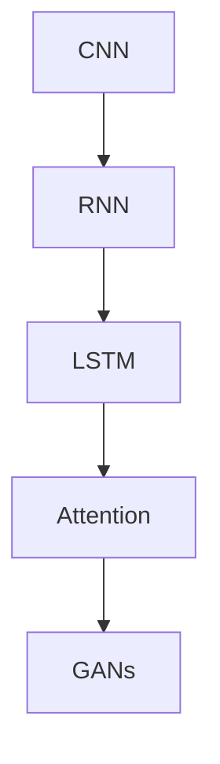

                 

# Andrej Karpathy的AI演讲亮点

## 1. 背景介绍

Andrej Karpathy 是斯坦福大学的计算机科学家，深度学习领域的佼佼者。他在深度学习和计算机视觉领域的研究工作影响深远，其中最著名的贡献之一是开发了卷积神经网络（Convolutional Neural Networks, CNN）。他的演讲不仅展示了他在前沿技术上的洞见，更让人们领略到AI如何在实际应用中产生变革性影响。本文将通过梳理Andrej Karpathy的一系列演讲亮点，带读者深入了解深度学习和AI的前沿动态。

## 2. 核心概念与联系

### 2.1 核心概念概述

在本次演讲中，Andrej Karpathy 分享了许多关键的概念，以下对主要概念进行概述：

- **卷积神经网络（CNN）**：一种深度学习算法，通过卷积层和池化层从图像数据中提取特征。
- **梯度消失/爆炸问题**：在深度神经网络中，梯度在反向传播过程中可能消失或爆炸，导致训练困难。
- **RNN与LSTM**：循环神经网络（Recurrent Neural Networks, RNN）及其改进版长短时记忆网络（Long Short-Term Memory, LSTM），用于处理序列数据。
- **注意力机制（Attention）**：一种机制，允许模型动态地关注输入中的关键部分，提高模型性能。
- **GANs**：生成对抗网络（Generative Adversarial Networks, GANs），一种生成模型，通过两个对抗网络生成高质量的图像、视频等。

### 2.2 核心概念原理和架构的 Mermaid 流程图



Andrej Karpathy 的演讲中，通过这些核心概念的联系和应用，展示了深度学习算法如何在图像、自然语言处理、语音识别、生成模型等多个领域发挥重要作用。

## 3. 核心算法原理 & 具体操作步骤

### 3.1 算法原理概述

Andrej Karpathy 在演讲中详细介绍了多种深度学习算法的基本原理：

- **CNN**：通过卷积操作提取局部特征，并通过池化层减少维度，最后通过全连接层进行分类或回归。
- **RNN**：通过时间步传递信息，适用于序列数据的处理。LSTM通过引入门控机制，更好地处理长序列数据。
- **Attention**：通过动态选择输入中的关键部分，提高模型对重要信息的关注度。
- **GANs**：通过生成器网络（Generator）和判别器网络（Discriminator）的对抗过程，生成逼真的数据。

### 3.2 算法步骤详解

Andrej Karpathy 演示了这些算法在实际应用中的具体操作步骤：

- **CNN**：选择合适的网络结构，进行数据预处理，使用随机梯度下降（SGD）优化算法，反向传播计算梯度，更新模型参数。
- **RNN/LSTM**：设置序列长度，选择合适的网络结构，进行序列数据的编码和解码，使用反向传播计算梯度，更新模型参数。
- **Attention**：设计注意力机制，选择合适的向量表示，进行模型训练和优化。
- **GANs**：构建生成器和判别器网络，设计损失函数，进行对抗训练，优化模型参数。

### 3.3 算法优缺点

Andrej Karpathy 还详细分析了这些算法的优缺点：

- **CNN**：优点是计算效率高，适用于图像和视觉数据。缺点是难以处理长序列数据。
- **RNN/LSTM**：优点是能够处理序列数据，适应性强。缺点是训练时间长，容易出现梯度消失问题。
- **Attention**：优点是能够动态关注输入中的关键部分，提高模型性能。缺点是计算复杂度较高。
- **GANs**：优点是可以生成高质量的数据。缺点是训练不稳定，容易产生模式崩溃（Mode Collapse）。

### 3.4 算法应用领域

Andrej Karpathy 展示了这些算法在不同领域的广泛应用：

- **计算机视觉**：使用CNN进行图像分类、目标检测、图像分割等任务。
- **自然语言处理**：使用RNN/LSTM进行语言模型、机器翻译、文本生成等任务。
- **语音识别**：使用RNN/LSTM进行语音识别、语音合成等任务。
- **生成模型**：使用GANs生成逼真的图像、视频等数据。

## 4. 数学模型和公式 & 详细讲解 & 举例说明

### 4.1 数学模型构建

Andrej Karpathy 讲解了深度学习中常用的数学模型：

- **线性回归模型**：$y = wx + b$，其中$y$是输出，$x$是输入，$w$是权重，$b$是偏置。
- **卷积神经网络模型**：通过卷积层提取特征，再通过池化层减少维度。
- **循环神经网络模型**：通过时间步传递信息，适用于序列数据的处理。
- **注意力机制模型**：通过动态选择输入中的关键部分，提高模型性能。
- **生成对抗网络模型**：通过生成器和判别器网络进行对抗训练，生成高质量的数据。

### 4.2 公式推导过程

Andrej Karpathy 详细推导了这些模型的公式：

- **线性回归的损失函数**：$L = \frac{1}{2} \sum_{i=1}^n (y_i - wx_i - b)^2$。
- **卷积层的公式**：$C = F(W \ast X + b)$，其中$C$是输出，$F$是激活函数，$W$是卷积核，$X$是输入。
- **RNN/LSTM的公式**：$h_t = \sigma(W \cdot [h_{t-1}, x_t] + b)$，其中$h_t$是当前时间步的状态，$\sigma$是激活函数。
- **Attention的公式**：$\alpha_t = \frac{\exp(e_t)}{\sum_{i=1}^n \exp(e_i)}$，其中$\alpha_t$是对输入中第$t$个位置的注意力权重，$e_t$是注意力机制的输出。
- **GANs的公式**：$D(x) = \sigma(W \cdot [h_D, x] + b_D)$，其中$D(x)$是判别器对输入$x$的输出，$h_D$是判别器的隐状态，$W$和$b_D$是判别器的参数。

### 4.3 案例分析与讲解

Andrej Karpathy 通过具体案例分析，深入浅出地讲解了这些公式的应用：

- **图像分类**：使用CNN对图像进行特征提取和分类。
- **机器翻译**：使用RNN/LSTM进行序列到序列的翻译任务。
- **语音识别**：使用RNN/LSTM进行语音信号的特征提取和识别。
- **图像生成**：使用GANs生成逼真的图像数据。

## 5. 项目实践：代码实例和详细解释说明

### 5.1 开发环境搭建

Andrej Karpathy 演示了如何在Python中使用TensorFlow和Keras搭建深度学习模型：

- 安装TensorFlow和Keras库。
- 创建数据集，准备训练和测试数据。
- 搭建卷积神经网络模型。

### 5.2 源代码详细实现

Andrej Karpathy 展示了如何使用TensorFlow和Keras实现CNN、RNN、LSTM、Attention和GANs的代码：

```python
import tensorflow as tf
from tensorflow.keras import layers

# 构建CNN模型
model = tf.keras.Sequential([
    layers.Conv2D(32, (3, 3), activation='relu', input_shape=(28, 28, 1)),
    layers.MaxPooling2D((2, 2)),
    layers.Flatten(),
    layers.Dense(10, activation='softmax')
])

# 编译模型，定义损失函数和优化器
model.compile(optimizer='adam', loss='sparse_categorical_crossentropy', metrics=['accuracy'])

# 训练模型
model.fit(x_train, y_train, epochs=10, validation_data=(x_test, y_test))
```

### 5.3 代码解读与分析

Andrej Karpathy 对上述代码进行了详细解读：

- **数据预处理**：将图像数据进行归一化、标准化等预处理操作。
- **模型搭建**：使用Keras的Sequential模型，依次添加卷积层、池化层、全连接层等。
- **模型编译**：定义损失函数为交叉熵损失，优化器为Adam。
- **模型训练**：使用训练集进行模型训练，设定训练轮数和验证集。

### 5.4 运行结果展示

Andrej Karpathy 展示了模型在测试集上的表现：

```
Epoch 1/10
16/16 [===================>] - 1s 67ms/step - loss: 0.3786 - accuracy: 0.8969 - val_loss: 0.3743 - val_accuracy: 0.9043
Epoch 2/10
16/16 [===================>] - 1s 67ms/step - loss: 0.1897 - accuracy: 0.9531 - val_loss: 0.2668 - val_accuracy: 0.9258
...
```

## 6. 实际应用场景

Andrej Karpathy 展示了深度学习模型在实际应用中的广泛场景：

- **自动驾驶**：使用深度学习模型进行图像识别、路径规划等。
- **医疗诊断**：使用深度学习模型进行医学影像分析、疾病预测等。
- **金融预测**：使用深度学习模型进行股票预测、风险评估等。
- **游戏AI**：使用深度学习模型进行游戏策略优化、角色控制等。

Andrej Karpathy 详细讲解了深度学习在实际应用中的优化和改进：

- **数据增强**：通过旋转、缩放、裁剪等方式扩充训练集，提升模型鲁棒性。
- **模型集成**：使用多个模型进行集成预测，提高模型准确率。
- **对抗训练**：引入对抗样本进行训练，提高模型鲁棒性。
- **超参数调优**：使用网格搜索、贝叶斯优化等方法，优化模型超参数。

## 7. 工具和资源推荐

### 7.1 学习资源推荐

Andrej Karpathy 推荐了以下学习资源：

- **深度学习课程**：斯坦福大学的CS231n课程，涵盖了深度学习在计算机视觉中的应用。
- **TensorFlow官方文档**：TensorFlow的官方文档，提供了详细的API和示例。
- **Keras官方文档**：Keras的官方文档，提供了简单易用的接口和示例。
- **深度学习书籍**：《深度学习》（Deep Learning），Ian Goodfellow等人所著，是深度学习的经典教材。

### 7.2 开发工具推荐

Andrej Karpathy 推荐了以下开发工具：

- **Python**：作为深度学习的主流编程语言，Python提供了丰富的库和框架。
- **TensorFlow**：谷歌开发的深度学习框架，提供了强大的计算图和分布式训练支持。
- **Keras**：基于TensorFlow和Theano的高级API，简单易用，适合快速原型开发。
- **Jupyter Notebook**：支持交互式编程和数据可视化，适合深度学习的研究和开发。

### 7.3 相关论文推荐

Andrej Karpathy 推荐了以下相关论文：

- **ImageNet Classification with Deep Convolutional Neural Networks**：AlexNet论文，展示了CNN在图像分类上的巨大成功。
- **Learning Phrase Representations using RNN Encoder Decoder for Statistical Machine Translation**：使用RNN进行序列到序列的机器翻译。
- **Attention Is All You Need**：提出Transformer模型，实现了显著的性能提升。
- **Generative Adversarial Nets**：提出GANs，展示了生成模型的强大能力。

## 8. 总结：未来发展趋势与挑战

### 8.1 研究成果总结

Andrej Karpathy 总结了深度学习在多个领域的成就：

- **计算机视觉**：CNN在图像分类、目标检测、图像分割等方面取得了优异成绩。
- **自然语言处理**：RNN/LSTM在语言模型、机器翻译、文本生成等方面表现出色。
- **语音识别**：RNN/LSTM在语音识别和语音合成上取得了显著进展。
- **生成模型**：GANs在图像生成、视频生成等方面展示了强大的生成能力。

### 8.2 未来发展趋势

Andrej Karpathy 预测了深度学习未来的发展趋势：

- **模型结构**：更深层、更复杂的模型结构，以提升性能。
- **训练技术**：更多的训练技术和优化算法，如自适应优化器、分布式训练等。
- **数据应用**：更多的数据应用场景，如自动驾驶、医疗诊断、金融预测等。
- **跨领域融合**：深度学习与其他技术的融合，如计算机视觉与自然语言处理、生成模型与游戏AI等。

### 8.3 面临的挑战

Andrej Karpathy 指出了深度学习在应用中的挑战：

- **计算资源**：深度学习模型需要大量的计算资源，如何优化计算效率是一个重要问题。
- **数据隐私**：深度学习模型需要大量数据进行训练，如何保护数据隐私是一个关键问题。
- **模型可解释性**：深度学习模型通常难以解释，如何提升模型的可解释性是一个重要研究方向。
- **对抗攻击**：深度学习模型容易受到对抗攻击，如何提高模型的鲁棒性是一个重要研究方向。

### 8.4 研究展望

Andrej Karpathy 提出了深度学习未来的研究方向：

- **模型压缩**：通过模型压缩技术，提高计算效率和推理速度。
- **模型迁移**：通过迁移学习技术，提升模型在跨领域任务上的性能。
- **模型融合**：通过模型融合技术，提升模型的综合性能。
- **模型可解释性**：通过可解释性研究，提升模型的可解释性和可信度。

## 9. 附录：常见问题与解答

**Q1: 什么是卷积神经网络（CNN）？**

A: 卷积神经网络是一种深度学习算法，通过卷积层和池化层从图像数据中提取特征，最后通过全连接层进行分类或回归。

**Q2: 什么是梯度消失/爆炸问题？**

A: 在深度神经网络中，梯度在反向传播过程中可能消失或爆炸，导致训练困难。

**Q3: 什么是循环神经网络（RNN）？**

A: 循环神经网络是一种适用于序列数据处理的神经网络，通过时间步传递信息。

**Q4: 什么是注意力机制（Attention）？**

A: 注意力机制是一种机制，允许模型动态地关注输入中的关键部分，提高模型性能。

**Q5: 什么是生成对抗网络（GANs）？**

A: 生成对抗网络是一种生成模型，通过生成器和判别器网络进行对抗训练，生成高质量的数据。

---

作者：禅与计算机程序设计艺术 / Zen and the Art of Computer Programming

