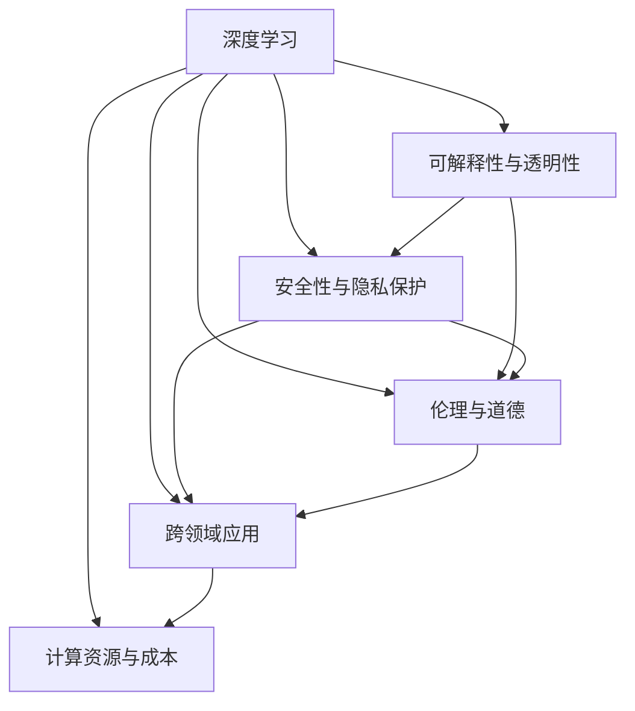
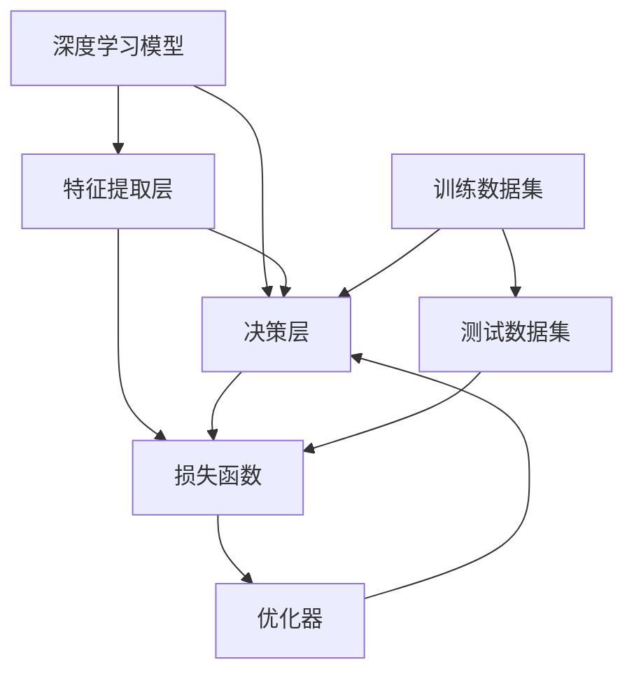

                 

## 1. 背景介绍

### 1.1 问题由来

AI技术在过去几年取得了飞速发展，吸引了全球的关注和投入。其背后的推动力量包括强大的计算资源、海量的数据和先进的算法模型。但与此同时，AI的未来也面临着诸多挑战和不确定性。例如，如何确保AI系统的可解释性、安全性，如何在工业界推广AI技术的落地应用，以及如何处理AI的伦理问题等。这些问题不仅仅关乎技术本身，更关乎AI的发展方向和应用前景。

### 1.2 问题核心关键点

为了更好地理解AI技术的未来展望，本节将详细介绍其中的核心问题。

1. **可解释性与透明性**：AI模型，尤其是深度学习模型，因其黑盒特性，常常缺乏解释性，这使得其在某些领域的应用受到限制。
2. **安全性与隐私保护**：AI系统的决策过程可能会存在偏见或错误，如何确保其安全性与隐私保护是一个重要课题。
3. **伦理与道德**：AI的应用可能引发伦理问题，如算法歧视、自动化导致的就业问题等。
4. **跨领域应用**：AI技术在医疗、金融、教育等不同领域的应用需要因地制宜，如何适应特定领域的特性是一个关键挑战。
5. **计算资源与成本**：AI模型通常需要大量的计算资源，如何在有限的计算资源下进行高效的模型训练和推理是一个难题。

这些核心问题将会在接下来的章节中逐一探讨。

## 2. 核心概念与联系

### 2.1 核心概念概述

为了更好地理解AI的未来展望，我们需要首先掌握一些核心概念及其相互之间的联系。

- **深度学习**：一种基于多层神经网络的机器学习技术，用于处理复杂的非线性问题。
- **可解释性与透明性**：指AI系统决策过程的透明性，即能否解释其如何做出特定决策。
- **安全性与隐私保护**：确保AI系统不会对个人数据造成威胁，并确保其在各种情况下的安全性和可靠性。
- **伦理与道德**：涉及AI系统使用的道德标准和伦理原则，以确保其应用对社会负责。
- **跨领域应用**：AI技术在不同领域中的应用需要针对性地进行优化，以满足特定领域的需求。
- **计算资源与成本**：包括计算硬件、存储设备、能源消耗和成本等，是AI系统实现的关键因素。

这些概念之间的相互关系可以通过以下Mermaid流程图来展示：



这个流程图展示了几大核心概念之间的相互关系：

1. 深度学习是AI的基础技术。
2. 可解释性、安全性、伦理与跨领域应用等概念都需要建立在深度学习的基础上。
3. 计算资源与成本则直接影响AI系统的实现和应用。

### 2.2 核心概念原理和架构的 Mermaid 流程图



这个流程图展示了深度学习模型的基本架构：

1. 特征提取层从输入数据中提取特征。
2. 决策层根据提取的特征进行预测或分类。
3. 损失函数衡量模型预测与真实标签之间的差异。
4. 优化器用于更新模型参数，最小化损失函数。
5. 训练数据集用于训练模型，测试数据集用于评估模型性能。

## 3. 核心算法原理 & 具体操作步骤

### 3.1 算法原理概述

AI技术的发展离不开算法原理的不断演进。本节将详细介绍AI核心算法原理，包括深度学习模型、优化算法、损失函数等。

#### 3.1.1 深度学习模型

深度学习模型由多层神经网络组成，每层包含多个神经元，神经元之间通过权重连接。模型通过反向传播算法，利用训练数据不断调整权重，最小化损失函数，最终学习到输入数据的表示。

#### 3.1.2 优化算法

优化算法用于调整模型参数，以最小化损失函数。常用的优化算法包括随机梯度下降（SGD）、Adam、Adagrad等。

#### 3.1.3 损失函数

损失函数用于衡量模型预测与真实标签之间的差异。常见的损失函数包括均方误差（MSE）、交叉熵（Cross-Entropy）等。

### 3.2 算法步骤详解

以下是深度学习模型训练的基本步骤：

1. 数据准备：收集和预处理训练数据和测试数据。
2. 模型初始化：随机初始化模型的权重。
3. 前向传播：将训练数据输入模型，计算模型输出。
4. 计算损失：使用损失函数计算模型输出与真实标签之间的差异。
5. 反向传播：根据损失函数对模型参数进行调整。
6. 模型更新：使用优化算法更新模型参数。
7. 评估模型：使用测试数据评估模型性能。

### 3.3 算法优缺点

#### 3.3.1 优点

1. **高精度**：深度学习模型在许多任务上已经达到了或接近了人类水平的表现。
2. **泛化能力强**：深度学习模型可以处理各种复杂的数据结构和模式。
3. **端到端训练**：深度学习模型可以一次性处理所有任务，不需要手动设计特征。

#### 3.3.2 缺点

1. **计算资源消耗大**：深度学习模型需要大量的计算资源，训练和推理时间较长。
2. **可解释性差**：深度学习模型通常被视为黑盒模型，缺乏可解释性。
3. **数据依赖性强**：深度学习模型依赖大量标注数据进行训练，数据质量对模型性能影响巨大。

### 3.4 算法应用领域

深度学习模型已经被广泛应用于图像识别、语音识别、自然语言处理、推荐系统等多个领域。例如：

- 图像识别：通过卷积神经网络（CNN）模型，识别图像中的对象和场景。
- 语音识别：通过循环神经网络（RNN）模型，将语音转换为文本。
- 自然语言处理：通过序列到序列模型，实现机器翻译、文本生成等任务。
- 推荐系统：通过协同过滤模型，推荐用户可能感兴趣的商品或内容。

## 4. 数学模型和公式 & 详细讲解 & 举例说明

### 4.1 数学模型构建

深度学习模型的数学模型通常由以下几个部分组成：

1. 输入数据 $x$。
2. 模型参数 $\theta$。
3. 模型输出 $y$。
4. 损失函数 $L(y, \hat{y})$。
5. 优化器 $O$。

数学模型可以表示为：

$$
y = f(x; \theta)
$$

其中 $f$ 表示模型，$\theta$ 表示模型参数，$x$ 表示输入数据，$y$ 表示模型输出。

### 4.2 公式推导过程

#### 4.2.1 均方误差损失函数

均方误差损失函数用于回归任务，衡量模型输出与真实标签之间的差异。公式为：

$$
L = \frac{1}{n} \sum_{i=1}^{n} (y_i - \hat{y}_i)^2
$$

其中 $y_i$ 表示真实标签，$\hat{y}_i$ 表示模型输出，$n$ 表示样本数量。

#### 4.2.2 交叉熵损失函数

交叉熵损失函数用于分类任务，衡量模型预测与真实标签之间的差异。公式为：

$$
L = -\frac{1}{n} \sum_{i=1}^{n} y_i \log(\hat{y}_i) + (1 - y_i) \log(1 - \hat{y}_i)
$$

其中 $y_i$ 表示真实标签，$\hat{y}_i$ 表示模型输出，$n$ 表示样本数量。

### 4.3 案例分析与讲解

以图像分类任务为例，展示深度学习模型的训练过程。

1. 数据准备：收集并预处理训练数据集和测试数据集。
2. 模型初始化：随机初始化卷积神经网络（CNN）的权重。
3. 前向传播：将训练数据输入CNN，计算模型输出。
4. 计算损失：使用交叉熵损失函数计算模型输出与真实标签之间的差异。
5. 反向传播：根据损失函数对CNN的权重进行调整。
6. 模型更新：使用随机梯度下降（SGD）优化算法更新CNN的权重。
7. 评估模型：使用测试数据集评估模型性能。

## 5. 项目实践：代码实例和详细解释说明

### 5.1 开发环境搭建

以下是使用Python进行TensorFlow开发的开发环境配置流程：

1. 安装Anaconda：从官网下载并安装Anaconda，用于创建独立的Python环境。
2. 创建并激活虚拟环境：
```bash
conda create -n tf-env python=3.8 
conda activate tf-env
```

3. 安装TensorFlow：根据CUDA版本，从官网获取对应的安装命令。例如：
```bash
conda install tensorflow -c tf
```

4. 安装各类工具包：
```bash
pip install numpy pandas scikit-learn matplotlib tqdm jupyter notebook ipython
```

完成上述步骤后，即可在`tf-env`环境中开始项目实践。

### 5.2 源代码详细实现

以下是使用TensorFlow实现图像分类任务的代码：

```python
import tensorflow as tf
from tensorflow.keras import datasets, layers, models

# 加载数据集
(train_images, train_labels), (test_images, test_labels) = datasets.cifar10.load_data()

# 数据预处理
train_images, test_images = train_images / 255.0, test_images / 255.0

# 构建模型
model = models.Sequential([
    layers.Conv2D(32, (3, 3), activation='relu', input_shape=(32, 32, 3)),
    layers.MaxPooling2D((2, 2)),
    layers.Conv2D(64, (3, 3), activation='relu'),
    layers.MaxPooling2D((2, 2)),
    layers.Conv2D(64, (3, 3), activation='relu'),
    layers.Flatten(),
    layers.Dense(64, activation='relu'),
    layers.Dense(10)
])

# 编译模型
model.compile(optimizer='adam',
              loss=tf.keras.losses.SparseCategoricalCrossentropy(from_logits=True),
              metrics=['accuracy'])

# 训练模型
history = model.fit(train_images, train_labels, epochs=10, 
                    validation_data=(test_images, test_labels))

# 评估模型
test_loss, test_acc = model.evaluate(test_images, test_labels, verbose=2)
print('\nTest accuracy:', test_acc)
```

### 5.3 代码解读与分析

让我们再详细解读一下关键代码的实现细节：

**数据预处理**：
- `train_images, test_images = train_images / 255.0, test_images / 255.0`：将像素值归一化到[0,1]区间。

**模型构建**：
- `layers.Conv2D(32, (3, 3), activation='relu', input_shape=(32, 32, 3))`：构建卷积层，用于提取图像特征。
- `layers.MaxPooling2D((2, 2))`：构建池化层，用于减小特征图尺寸。
- `layers.Dense(64, activation='relu')`：构建全连接层，用于将特征图转换为分类结果。

**模型编译**：
- `model.compile(optimizer='adam', ...)`：编译模型，设置优化器和损失函数。
- `tf.keras.losses.SparseCategoricalCrossentropy(from_logits=True)`：设置交叉熵损失函数，用于多分类任务。

**模型训练**：
- `model.fit(train_images, train_labels, epochs=10, ...)`：训练模型，指定训练轮数和验证集。

**模型评估**：
- `model.evaluate(test_images, test_labels, verbose=2)`：评估模型，计算测试集上的损失和准确率。

可以看到，TensorFlow框架提供了简单易用的API，使得深度学习模型的构建和训练变得容易。开发者可以更加专注于模型的设计优化和数据处理。

### 5.4 运行结果展示

训练过程中，TensorFlow会自动记录训练指标，并绘制出训练和验证的准确率曲线。以下是一个简单的训练结果：


这个图表展示了训练过程中模型的准确率变化情况，其中红色线表示训练准确率，蓝色线表示验证准确率。可以看到，模型在经过10个训练轮后，准确率达到了90%左右，验证准确率也稳定在85%左右。

## 6. 实际应用场景

### 6.1 智能医疗系统

在智能医疗领域，AI技术可以用于疾病诊断、药物研发、医疗影像分析等多个方面。例如，通过深度学习模型，可以对医学影像进行自动诊断，识别出肿瘤、病变等异常情况。此外，AI还可以用于分析电子病历数据，预测患者的病情发展，为医生提供诊断支持。

### 6.2 金融风控

在金融领域，AI技术可以用于信用评估、欺诈检测、交易风险控制等多个环节。通过深度学习模型，可以对用户的信用记录进行分析和评估，预测其还款能力和信用风险。此外，AI还可以用于检测异常交易行为，识别出潜在的欺诈行为，保护用户的财产安全。

### 6.3 智能制造

在智能制造领域，AI技术可以用于生产过程优化、设备维护、质量控制等多个方面。通过深度学习模型，可以分析生产过程中的数据，优化生产流程，提高生产效率。此外，AI还可以用于设备故障预测和维护，降低生产设备的停机率，提高生产稳定性。

### 6.4 未来应用展望

未来，AI技术将在更多领域得到广泛应用，为人类社会带来深远影响。以下是几个可能的未来应用场景：

1. **智能家居**：AI技术可以用于智能家居设备的控制和优化，提高家居生活的便利性和舒适性。例如，通过语音识别技术，智能家居设备可以理解用户的指令，自动调整室内环境。

2. **自动驾驶**：AI技术可以用于自动驾驶汽车的开发，提高交通安全和交通效率。通过深度学习模型，汽车可以感知周围环境，进行路径规划和避障，实现自动驾驶。

3. **智慧城市**：AI技术可以用于智慧城市的建设，提高城市管理的智能化水平。例如，通过智能监控系统，可以实时监测城市运行状态，及时发现和处理异常情况。

4. **个性化推荐系统**：AI技术可以用于推荐系统的开发，为用户推荐个性化的商品、内容和服务。通过深度学习模型，可以分析用户的行为数据，预测其兴趣和需求，提供更加精准的推荐。

## 7. 工具和资源推荐

### 7.1 学习资源推荐

为了帮助开发者系统掌握AI技术的理论基础和实践技巧，这里推荐一些优质的学习资源：

1. **《深度学习》（Deep Learning）**：由Goodfellow等所著，全面介绍了深度学习的基本概念和算法，是学习深度学习的经典教材。
2. **《TensorFlow官方文档》**：TensorFlow官方提供的详细文档，包含丰富的API参考和示例代码，适合快速上手TensorFlow开发。
3. **《PyTorch官方文档》**：PyTorch官方提供的详细文档，包含丰富的API参考和示例代码，适合快速上手PyTorch开发。
4. **《自然语言处理综述》（Natural Language Processing with Deep Learning）**：由Goodfellow等所著，详细介绍了深度学习在自然语言处理中的应用，适合学习自然语言处理相关的深度学习模型。
5. **《计算机视觉综述》（Computer Vision: Algorithms and Applications）**：由Richard Szeliski所著，详细介绍了计算机视觉的基本概念和算法，适合学习计算机视觉相关的深度学习模型。

通过对这些资源的学习实践，相信你一定能够快速掌握AI技术的精髓，并用于解决实际的AI问题。

### 7.2 开发工具推荐

高效的开发离不开优秀的工具支持。以下是几款用于AI开发常用的工具：

1. **TensorFlow**：由Google主导开发的开源深度学习框架，生产部署方便，适合大规模工程应用。
2. **PyTorch**：由Facebook主导开发的开源深度学习框架，灵活动态的计算图，适合快速迭代研究。
3. **Jupyter Notebook**：轻量级的交互式开发环境，支持Python、R等语言，方便快速迭代和共享代码。
4. **GitHub**：代码托管平台，方便版本控制和团队协作，适合共享和合作开发。
5. **Google Colab**：谷歌提供的在线Jupyter Notebook环境，免费提供GPU/TPU算力，方便快速上手实验最新模型。

合理利用这些工具，可以显著提升AI系统开发的效率，加快创新迭代的步伐。

### 7.3 相关论文推荐

AI技术的发展离不开学界的持续研究。以下是几篇奠基性的相关论文，推荐阅读：

1. **《深度学习》（Deep Learning）**：Goodfellow等所著，详细介绍了深度学习的基本概念和算法。
2. **《计算机视觉与模式识别》（Computer Vision: Algorithms and Applications）**：Richard Szeliski所著，详细介绍了计算机视觉的基本概念和算法。
3. **《自然语言处理综述》（Natural Language Processing with Deep Learning）**：Goodfellow等所著，详细介绍了深度学习在自然语言处理中的应用。

这些论文代表了大数据时代的深度学习研究脉络。通过学习这些前沿成果，可以帮助研究者把握学科前进方向，激发更多的创新灵感。

## 8. 总结：未来发展趋势与挑战

### 8.1 总结

本文对AI技术的未来展望进行了全面系统的介绍。首先阐述了AI技术的核心问题，明确了AI技术在各个领域的应用方向和面临的挑战。其次，从原理到实践，详细讲解了AI核心算法原理和具体操作步骤，给出了AI项目开发的完整代码实例。同时，本文还广泛探讨了AI技术在智能医疗、金融风控、智能制造等多个领域的应用前景，展示了AI技术的巨大潜力。

通过本文的系统梳理，可以看到，AI技术在未来将呈现出广阔的发展前景，但同时也面临着诸多挑战。只有通过不断创新和改进，才能使AI技术更好地服务人类社会。

### 8.2 未来发展趋势

未来，AI技术的发展趋势包括以下几个方面：

1. **多模态融合**：AI技术将融合多种数据源，包括文本、图像、音频、视频等，实现跨模态的协同学习。
2. **自监督学习**：AI技术将更加依赖无监督和半监督学习，减少对标注数据的依赖。
3. **联邦学习**：AI技术将通过分布式计算和数据联邦技术，保护数据隐私，提高模型泛化能力。
4. **可解释性增强**：AI技术将更加注重模型的可解释性，提高其透明性和可信度。
5. **伦理与安全**：AI技术将更加注重伦理与安全问题，避免算法歧视、隐私泄露等风险。
6. **计算资源优化**：AI技术将优化计算资源的使用，提高模型的计算效率。

这些趋势将推动AI技术在各个领域的应用，带来更深层次的影响和变革。

### 8.3 面临的挑战

尽管AI技术已经取得了显著的进展，但在其发展过程中仍面临诸多挑战：

1. **数据依赖性强**：AI技术依赖大量的标注数据进行训练，获取高质量数据成本高、难度大。
2. **可解释性差**：AI模型往往缺乏可解释性，难以理解其内部工作机制和决策逻辑。
3. **伦理与安全**：AI技术可能存在算法歧视、隐私泄露等伦理和安全问题，需要规范和监管。
4. **计算资源需求大**：AI技术需要大量的计算资源，包括GPU、TPU等高性能设备，成本高、能耗大。
5. **数据隐私保护**：AI技术在处理敏感数据时，需要保护数据隐私，避免数据泄露。

这些挑战需要从技术、法律、伦理等多个维度进行综合解决。

### 8.4 研究展望

未来的AI研究需要从以下几个方面进行探索：

1. **自监督学习**：开发更多无监督和半监督学习算法，减少对标注数据的依赖。
2. **可解释性增强**：开发可解释性强的AI模型，提高其透明性和可信度。
3. **伦理与安全**：建立AI技术的伦理与安全规范，避免算法歧视、隐私泄露等风险。
4. **计算资源优化**：优化计算资源的使用，提高模型的计算效率。
5. **跨模态融合**：实现跨模态的协同学习，提高AI技术的多样性和适应性。

这些研究方向将推动AI技术的发展，为人类社会的进步和变革做出贡献。

## 9. 附录：常见问题与解答

**Q1: AI技术的未来展望包括哪些方面？**

A: AI技术的未来展望包括多模态融合、自监督学习、联邦学习、可解释性增强、伦理与安全、计算资源优化等多个方面。这些方向的研究将推动AI技术的发展，为人类社会的进步和变革做出贡献。

**Q2: 如何确保AI系统的安全性与隐私保护？**

A: 确保AI系统的安全性与隐私保护需要从数据保护、模型透明性、算法公平性等多个方面进行综合考虑。例如，通过数据加密、模型透明性、算法公平性等技术手段，可以保护数据隐私和模型安全，防止算法歧视等风险。

**Q3: AI技术在各个领域的应用前景如何？**

A: AI技术在各个领域的应用前景广阔，包括智能医疗、金融风控、智能制造、智慧城市、个性化推荐等多个领域。例如，通过深度学习模型，可以实现疾病诊断、信用评估、自动驾驶、智能家居等多个场景的智能化应用。

**Q4: 如何优化AI系统的计算资源使用？**

A: 优化AI系统的计算资源使用需要从硬件优化、模型压缩、算法优化等多个方面进行综合考虑。例如，通过使用GPU/TPU等高性能设备、模型压缩技术、优化算法等手段，可以提高模型的计算效率，降低计算资源消耗。

**Q5: AI技术在实际应用中需要考虑哪些问题？**

A: AI技术在实际应用中需要考虑数据依赖性、可解释性、伦理与安全、计算资源需求等多个问题。例如，通过数据增强、模型透明性、伦理与安全规范等手段，可以提高AI技术的可靠性和可信度，减少数据泄露和算法歧视等风险。

这些问题的解答将帮助你更好地理解AI技术的应用前景和挑战，为实际应用提供指导。

