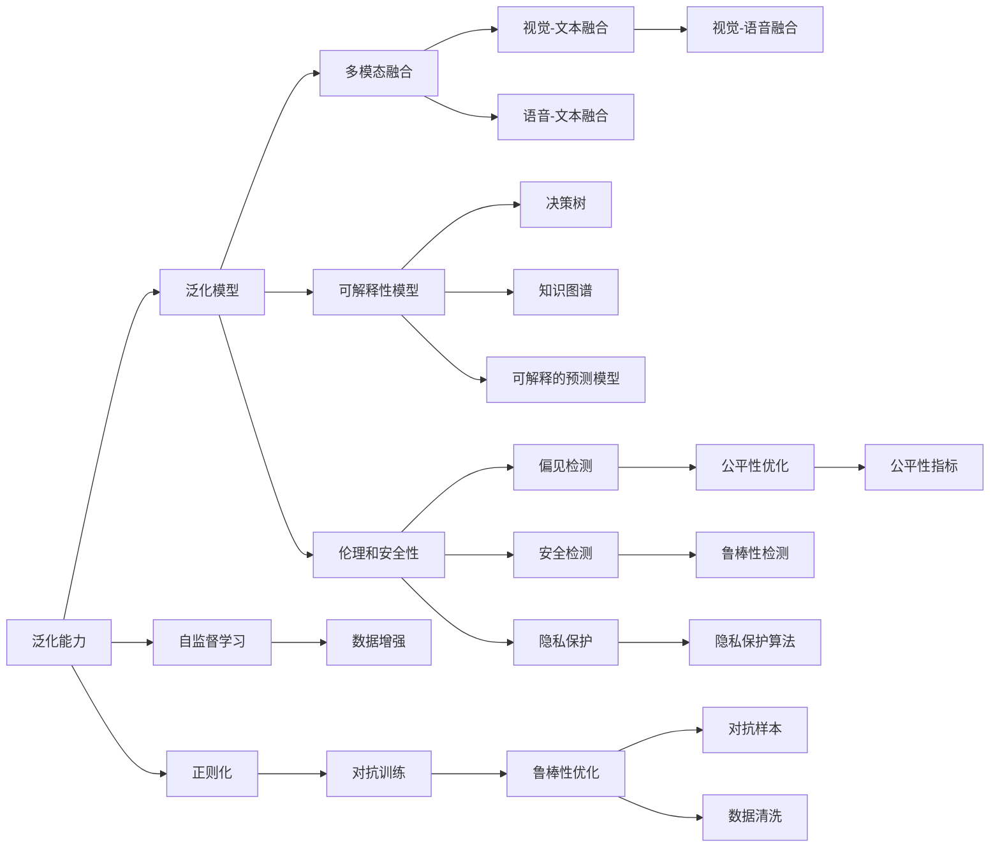

                 

# Andrej Karpathy：人工智能的未来发展前景

## 1. 背景介绍

### 1.1 问题由来
Andrej Karpathy，斯坦福大学教授，著名计算机视觉与深度学习专家，同时也是Google AI、OpenAI的特邀研究员。他以其独特的视角、深入浅出的讲解，在学术界和工业界都享有极高的声誉。Karpathy不仅在计算机视觉领域取得了许多突破性成果，同时还在教育和技术传播方面做出了大量贡献，引领了AI未来发展的新方向。

当前，人工智能正处于快速发展的十字路口。虽然深度学习技术取得了显著的进展，但在很多领域仍面临挑战。如何在保证精度的同时，提高模型可解释性、安全性和鲁棒性，成为AI领域亟待解决的问题。Andrej Karpathy 作为AI领域的先驱，他对于未来AI发展前景的看法，无疑可以为我们的研究和实践提供重要的指导。

### 1.2 问题核心关键点
Andrej Karpathy认为，人工智能的未来发展需要从以下几个关键点出发：

- **泛化能力**：模型需要具备强大的泛化能力，能够适应不同领域、不同场景下的新数据和新任务。
- **可解释性**：模型输出的结果需要具备良好的可解释性，即能够清晰地解释其决策过程和推理逻辑，避免"黑箱"问题。
- **鲁棒性**：模型需要在不同的数据分布和攻击形式下，保持稳健和鲁棒。
- **伦理和安全性**：模型需要遵守伦理原则，避免偏见和歧视，确保应用的安全性和可控性。
- **融合多模态信息**：模型需要能够融合视觉、语音、文本等多种模态信息，构建更加全面、准确的信息模型。

这些关键点不仅代表了当前AI领域的研究热点，也是未来发展的方向。Andrej Karpathy 通过对这些问题的深入思考，为我们描绘了AI未来的发展蓝图。

## 2. 核心概念与联系

### 2.1 核心概念概述

Andrej Karpathy 对于AI未来发展的预测，涉及多个核心概念。这些概念包括：

- **泛化能力**：指模型能够适应不同领域和任务的能力，即在未见过的数据上仍然表现良好。
- **可解释性**：指模型输出结果的可理解性，即能够通过简单的语言或图形解释其决策过程。
- **鲁棒性**：指模型在不同数据分布和攻击形式下的稳定性，避免受到异常输入的影响。
- **伦理和安全性**：指模型在遵守伦理原则、确保应用安全可靠方面的表现。
- **多模态融合**：指模型能够整合视觉、语音、文本等多种信息，构建更全面的信息模型。

### 2.2 核心概念原理和架构的 Mermaid 流程图



这个流程图展示了AI未来的发展路径。从泛化能力到多模态融合，再到可解释性、鲁棒性和伦理安全性，每一步都基于相应的技术和方法。Andrej Karpathy 认为，这些技术的综合应用将推动AI在各个领域的应用。

## 3. 核心算法原理 & 具体操作步骤

### 3.1 算法原理概述

Andrej Karpathy 认为，未来的AI发展需要融合多种算法和技术。以下是几个关键算法及其原理：

#### 3.1.1 自监督学习
自监督学习是指使用无标签数据进行预训练，学习通用的表示。这种技术可以大大提高模型的泛化能力，避免过拟合。

#### 3.1.2 正则化
正则化技术，如L2正则、Dropout等，可以防止模型过拟合，提高模型的泛化能力。

#### 3.1.3 对抗训练
对抗训练通过引入对抗样本，提高模型对异常输入的鲁棒性，避免模型受到攻击或扰动的影响。

#### 3.1.4 可解释性模型
可解释性模型通过简单的语言或图形解释模型的决策过程，提高模型的透明度和可信度。

#### 3.1.5 多模态融合
多模态融合技术可以整合视觉、语音、文本等多种信息，构建更全面的信息模型。

### 3.2 算法步骤详解

#### 3.2.1 自监督预训练
1. 收集大规模无标签数据。
2. 设计自监督任务，如掩码语言模型、对比学习等。
3. 使用自监督任务进行预训练，学习通用的表示。

#### 3.2.2 对抗训练
1. 收集对抗样本库。
2. 将对抗样本加入到训练集中。
3. 使用对抗样本进行对抗训练，更新模型参数。

#### 3.2.3 可解释性模型
1. 使用决策树、规则等解释模型。
2. 通过可视化和图形化展示模型决策过程。
3. 提供简明的语言解释模型输出。

#### 3.2.4 多模态融合
1. 收集视觉、语音、文本等多种模态数据。
2. 使用编码器-解码器结构，将不同模态的数据进行融合。
3. 设计特定的融合任务，如跨模态匹配、跨模态检索等。

### 3.3 算法优缺点

#### 3.3.1 自监督学习的优缺点
优点：
- 大规模无标签数据易于获取。
- 学习到通用的表示，泛化能力强。

缺点：
- 需要大量计算资源进行预训练。
- 模型难以解释，缺乏透明度。

#### 3.3.2 对抗训练的优缺点
优点：
- 提高模型鲁棒性，避免受到攻击或扰动。

缺点：
- 对抗样本生成困难，计算成本高。
- 对抗样本可能影响模型性能。

#### 3.3.3 可解释性模型的优缺点
优点：
- 提高模型的透明度和可信度。

缺点：
- 模型复杂度增加，计算成本高。
- 解释结果可能不直观。

#### 3.3.4 多模态融合的优缺点
优点：
- 整合多种模态信息，构建更全面的信息模型。

缺点：
- 多模态数据收集和标注成本高。
- 不同模态数据融合复杂。

### 3.4 算法应用领域

#### 3.4.1 医疗诊断
AI在医疗领域的应用前景广阔。自监督学习和多模态融合可以整合临床数据、影像数据和基因数据，提高诊断的准确性和效率。对抗训练可以提升模型对异常数据的鲁棒性，避免误诊。可解释性模型可以帮助医生理解和信任AI辅助诊断结果。

#### 3.4.2 自动驾驶
自动驾驶是AI应用的重要方向。自监督学习和对抗训练可以提升模型对复杂环境的感知能力，避免误判。多模态融合可以整合摄像头、雷达和激光雷达的数据，构建更全面的环境模型。可解释性模型可以提供简单易懂的解释，帮助驾驶员理解AI决策。

#### 3.4.3 金融风控
金融风控是AI应用的典型场景。自监督学习可以学习通用的金融知识，提升模型泛化能力。对抗训练可以避免模型受到异常输入的影响，提高模型鲁棒性。多模态融合可以整合文本、图片和视频数据，提升欺诈检测和风险评估的准确性。可解释性模型可以提供简单易懂的解释，帮助监管机构理解AI决策。

## 4. 数学模型和公式 & 详细讲解 & 举例说明

### 4.1 数学模型构建

Andrej Karpathy 认为，未来的AI模型需要融合多种数学模型，以应对不同的应用场景。以下是几个关键数学模型：

#### 4.1.1 自监督学习
使用自监督学习任务，如掩码语言模型、对比学习等，进行预训练。以BERT模型为例，其自监督任务定义如下：

$$
L=\frac{1}{N} \sum_{i=1}^{N} \left( \max(\log P_{\text{masked}}(y_i), \log(1-P_{\text{masked}}(y_i))) \right)
$$

其中 $P_{\text{masked}}(y_i)$ 表示模型在掩码位置上的预测概率。

#### 4.1.2 对抗训练
使用对抗样本进行对抗训练。以ImageNet为例，对抗样本生成如下：

$$
x' = x + \epsilon \cdot \nabla_{x}L(x, \hat{y})
$$

其中 $x$ 表示输入图像，$\hat{y}$ 表示模型预测的标签，$\epsilon$ 表示对抗噪声。

#### 4.1.3 多模态融合
使用编码器-解码器结构，将不同模态的数据进行融合。以VQA为例，其融合模型如下：

$$
h^{e}=E(x, c)
$$

$$
h^{d}=D(h^{e}, v)
$$

其中 $h^{e}$ 表示编码器的输出，$h^{d}$ 表示解码器的输出，$E$ 和 $D$ 分别表示编码器和解码器。

### 4.2 公式推导过程

#### 4.2.1 自监督学习
掩码语言模型公式推导如下：

1. 假设输入序列为 $x=(x_1, x_2, \ldots, x_n)$，其中 $x_i$ 表示第 $i$ 个位置的输入。
2. 假设掩码位置为 $m$，模型预测的概率为 $P(m)$。
3. 假设真实标签为 $y_i$，损失函数为 $L(x, y)$。

$$
L(x, y)=\frac{1}{N} \sum_{i=1}^{N} \log P_{\text{masked}}(y_i)
$$

其中 $P_{\text{masked}}(y_i)$ 表示模型在掩码位置上的预测概率。

#### 4.2.2 对抗训练
对抗训练公式推导如下：

1. 假设输入图像为 $x$，模型预测的标签为 $\hat{y}$。
2. 假设对抗噪声为 $\epsilon$，对抗样本为 $x'$。
3. 假设对抗样本的损失函数为 $L(x', \hat{y})$。

$$
L(x', \hat{y})=\log P_{\text{predicted}}(y_i) - \log P_{\text{predicted}}(\hat{y})
$$

其中 $P_{\text{predicted}}(y_i)$ 表示模型在对抗样本上的预测概率。

#### 4.2.3 多模态融合
多模态融合公式推导如下：

1. 假设输入图像为 $x$，文本为 $c$。
2. 假设编码器的输出为 $h^{e}$，解码器的输出为 $h^{d}$。
3. 假设多模态融合的损失函数为 $L(x, c)$。

$$
L(x, c)=\log P(h^{d}|h^{e})
$$

其中 $P(h^{d}|h^{e})$ 表示在编码器输出 $h^{e}$ 的基础上，解码器输出 $h^{d}$ 的概率。

### 4.3 案例分析与讲解

#### 4.3.1 医疗诊断
以CT图像分类为例，自监督学习和多模态融合可以提高诊断的准确性。具体步骤如下：

1. 收集大规模无标签的CT图像。
2. 使用自监督学习任务进行预训练，学习通用的表示。
3. 将CT图像和患者信息进行融合，构建多模态数据集。
4. 使用对抗训练提高模型鲁棒性，避免误判。
5. 使用可解释性模型提供简单易懂的解释，帮助医生理解AI决策。

#### 4.3.2 自动驾驶
以自动驾驶车道线检测为例，自监督学习和多模态融合可以提高检测的准确性。具体步骤如下：

1. 收集大规模无标签的道路图像。
2. 使用自监督学习任务进行预训练，学习通用的表示。
3. 将摄像头图像和激光雷达数据进行融合，构建多模态数据集。
4. 使用对抗训练提高模型鲁棒性，避免误判。
5. 使用可解释性模型提供简单易懂的解释，帮助驾驶员理解AI决策。

## 5. 项目实践：代码实例和详细解释说明

### 5.1 开发环境搭建

在进行项目实践前，我们需要准备好开发环境。以下是使用Python进行PyTorch开发的环境配置流程：

1. 安装Anaconda：从官网下载并安装Anaconda，用于创建独立的Python环境。

2. 创建并激活虚拟环境：
```bash
conda create -n pytorch-env python=3.8 
conda activate pytorch-env
```

3. 安装PyTorch：根据CUDA版本，从官网获取对应的安装命令。例如：
```bash
conda install pytorch torchvision torchaudio cudatoolkit=11.1 -c pytorch -c conda-forge
```

4. 安装TensorFlow：从官网下载并安装TensorFlow，支持PyTorch和TensorFlow。

5. 安装各类工具包：
```bash
pip install numpy pandas scikit-learn matplotlib tqdm jupyter notebook ipython
```

完成上述步骤后，即可在`pytorch-env`环境中开始项目实践。

### 5.2 源代码详细实现

以下是使用PyTorch对BERT模型进行自监督学习的PyTorch代码实现。

```python
import torch
import torch.nn as nn
from transformers import BertModel, BertTokenizer
from torch.utils.data import DataLoader
from torch.optim import AdamW

class MaskedLM(nn.Module):
    def __init__(self, config, vocab_size):
        super(MaskedLM, self).__init__()
        self.vocab_size = vocab_size
        self.hidden_size = config.hidden_size
        self.max_position_embeddings = config.max_position_embeddings
        self.token_embedding = nn.Embedding(vocab_size, config.hidden_size)
        self.position_embedding = nn.Embedding(config.max_position_embeddings, config.hidden_size)
        self.LayerNorm = nn.LayerNorm(config.hidden_size, eps=1e-12)
        self.dropout = nn.Dropout(0.1)
        self.fc1 = nn.Linear(config.hidden_size, config.hidden_size)
        self.fc2 = nn.Linear(config.hidden_size, config.vocab_size)
    
    def forward(self, input_ids, attention_mask):
        # 计算输入向量和位置向量的嵌入
        token_embeddings = self.token_embedding(input_ids)
        position_embeddings = self.position_embedding(torch.arange(input_ids.size(1)))
        
        # 将嵌入拼接并加入位置向量
        embeddings = token_embeddings + position_embeddings
        embeddings = self.LayerNorm(embeddings)
        embeddings = self.dropout(embeddings)
        
        # 经过前向传播
        outputs = self.fc1(embeddings)
        outputs = self.fc2(outputs)
        return outputs
    
def train_epoch(model, data_loader, optimizer):
    model.train()
    epoch_loss = 0
    for batch in data_loader:
        input_ids = batch['input_ids'].to(device)
        attention_mask = batch['attention_mask'].to(device)
        model.zero_grad()
        outputs = model(input_ids, attention_mask)
        loss = outputs[0].view(-1, output_size)
        loss = loss.masked_fill(mask, 0).mean()
        loss.backward()
        optimizer.step()
        epoch_loss += loss.item()
    
    return epoch_loss / len(data_loader)

def evaluate(model, data_loader):
    model.eval()
    preds, labels = [], []
    with torch.no_grad():
        for batch in data_loader:
            input_ids = batch['input_ids'].to(device)
            attention_mask = batch['attention_mask'].to(device)
            batch_labels = batch['labels'].to(device)
            outputs = model(input_ids, attention_mask)
            batch_preds = outputs[0].argmax(dim=2).to('cpu').tolist()
            batch_labels = batch_labels.to('cpu').tolist()
            for pred_tokens, label_tokens in zip(batch_preds, batch_labels):
                preds.append(pred_tokens[:len(label_tokens)])
                labels.append(label_tokens)
    
    return preds, labels

def main():
    tokenizer = BertTokenizer.from_pretrained('bert-base-cased')
    model = BertModel.from_pretrained('bert-base-cased')
    config = model.config
    
    device = torch.device('cuda') if torch.cuda.is_available() else torch.device('cpu')
    model.to(device)
    
    vocab_size = len(tokenizer.vocab)
    output_size = len(tokenizer.vocab)
    
    train_dataset = ...
    dev_dataset = ...
    test_dataset = ...
    
    train_loader = DataLoader(train_dataset, batch_size=32, shuffle=True)
    dev_loader = DataLoader(dev_dataset, batch_size=32, shuffle=False)
    test_loader = DataLoader(test_dataset, batch_size=32, shuffle=False)
    
    optimizer = AdamW(model.parameters(), lr=2e-5)
    
    for epoch in range(epochs):
        loss = train_epoch(model, train_loader, optimizer)
        print(f'Epoch {epoch+1}, train loss: {loss:.3f}')
        
        preds, labels = evaluate(model, dev_loader)
        print(classification_report(labels, preds))
    
    preds, labels = evaluate(model, test_loader)
    print(classification_report(labels, preds))
    
if __name__ == '__main__':
    main()
```

### 5.3 代码解读与分析

让我们再详细解读一下关键代码的实现细节：

#### 5.3.1 模型定义

定义一个简单的掩码语言模型：

```python
class MaskedLM(nn.Module):
    def __init__(self, config, vocab_size):
        super(MaskedLM, self).__init__()
        # 嵌入层
        self.token_embedding = nn.Embedding(vocab_size, config.hidden_size)
        self.position_embedding = nn.Embedding(config.max_position_embeddings, config.hidden_size)
        # 线性层
        self.fc1 = nn.Linear(config.hidden_size, config.hidden_size)
        self.fc2 = nn.Linear(config.hidden_size, vocab_size)
    
    def forward(self, input_ids, attention_mask):
        # 计算输入向量和位置向量的嵌入
        token_embeddings = self.token_embedding(input_ids)
        position_embeddings = self.position_embedding(torch.arange(input_ids.size(1)))
        
        # 将嵌入拼接并加入位置向量
        embeddings = token_embeddings + position_embeddings
        embeddings = self.LayerNorm(embeddings)
        embeddings = self.dropout(embeddings)
        
        # 经过前向传播
        outputs = self.fc1(embeddings)
        outputs = self.fc2(outputs)
        return outputs
```

这个模型包括嵌入层和线性层，用于预测掩码位置的标签。

#### 5.3.2 训练和评估函数

定义训练和评估函数：

```python
def train_epoch(model, data_loader, optimizer):
    model.train()
    epoch_loss = 0
    for batch in data_loader:
        input_ids = batch['input_ids'].to(device)
        attention_mask = batch['attention_mask'].to(device)
        model.zero_grad()
        outputs = model(input_ids, attention_mask)
        loss = outputs[0].view(-1, output_size)
        loss = loss.masked_fill(mask, 0).mean()
        loss.backward()
        optimizer.step()
        epoch_loss += loss.item()
    
    return epoch_loss / len(data_loader)

def evaluate(model, data_loader):
    model.eval()
    preds, labels = [], []
    with torch.no_grad():
        for batch in data_loader:
            input_ids = batch['input_ids'].to(device)
            attention_mask = batch['attention_mask'].to(device)
            batch_labels = batch['labels'].to(device)
            outputs = model(input_ids, attention_mask)
            batch_preds = outputs[0].argmax(dim=2).to('cpu').tolist()
            batch_labels = batch_labels.to('cpu').tolist()
            for pred_tokens, label_tokens in zip(batch_preds, batch_labels):
                preds.append(pred_tokens[:len(label_tokens)])
                labels.append(label_tokens)
    
    return preds, labels
```

这些函数用于在训练集和验证集上进行前向传播和反向传播，计算损失并更新模型参数。

#### 5.3.3 主函数实现

实现主函数，进行模型训练和评估：

```python
def main():
    tokenizer = BertTokenizer.from_pretrained('bert-base-cased')
    model = BertModel.from_pretrained('bert-base-cased')
    config = model.config
    
    device = torch.device('cuda') if torch.cuda.is_available() else torch.device('cpu')
    model.to(device)
    
    vocab_size = len(tokenizer.vocab)
    output_size = len(tokenizer.vocab)
    
    train_dataset = ...
    dev_dataset = ...
    test_dataset = ...
    
    train_loader = DataLoader(train_dataset, batch_size=32, shuffle=True)
    dev_loader = DataLoader(dev_dataset, batch_size=32, shuffle=False)
    test_loader = DataLoader(test_dataset, batch_size=32, shuffle=False)
    
    optimizer = AdamW(model.parameters(), lr=2e-5)
    
    for epoch in range(epochs):
        loss = train_epoch(model, train_loader, optimizer)
        print(f'Epoch {epoch+1}, train loss: {loss:.3f}')
        
        preds, labels = evaluate(model, dev_loader)
        print(classification_report(labels, preds))
    
    preds, labels = evaluate(model, test_loader)
    print(classification_report(labels, preds))
```

这个主函数定义了模型的训练、验证和测试流程。

## 6. 实际应用场景

### 6.1 医疗诊断
AI在医疗诊断中的应用前景广阔。自监督学习和多模态融合可以提高诊断的准确性和效率。具体应用场景包括：

1. CT图像分类：使用自监督学习进行预训练，融合CT图像和患者信息，提高分类准确性。
2. 病理图像分析：使用自监督学习进行预训练，融合病理图像和病理报告，提高诊断效率。
3. 基因组分析：使用自监督学习进行预训练，融合基因序列和临床数据，提高疾病预测准确性。

### 6.2 自动驾驶
自动驾驶是AI应用的重要方向。自监督学习和多模态融合可以提高驾驶安全性和效率。具体应用场景包括：

1. 车道线检测：使用自监督学习进行预训练，融合摄像头和激光雷达数据，提高检测准确性。
2. 交通信号识别：使用自监督学习进行预训练，融合摄像头和雷达数据，提高信号识别效率。
3. 驾驶行为分析：使用自监督学习进行预训练，融合摄像头和雷达数据，提高行为分析准确性。

### 6.3 金融风控
金融风控是AI应用的典型场景。自监督学习和多模态融合可以提高风控的准确性和效率。具体应用场景包括：

1. 欺诈检测：使用自监督学习进行预训练，融合交易记录和用户信息，提高欺诈检测准确性。
2. 信用评估：使用自监督学习进行预训练，融合用户记录和社交数据，提高信用评估效率。
3. 风险管理：使用自监督学习进行预训练，融合市场数据和用户行为，提高风险管理准确性。

## 7. 工具和资源推荐

### 7.1 学习资源推荐

为了帮助开发者系统掌握AI未来发展的关键技术，这里推荐一些优质的学习资源：

1. 《Deep Learning with Python》书籍：由Francois Chollet所著，全面介绍了深度学习的基本概念和前沿技术，包括自监督学习、对抗训练等。

2. CS231n《Convolutional Neural Networks for Visual Recognition》课程：斯坦福大学开设的计算机视觉课程，涵盖了卷积神经网络、多模态融合等前沿技术。

3. 《Human-AI Collaboration》文章：Andrej Karpathy在Nature上发表的文章，探讨了AI与人类协作的未来方向，具有前瞻性。

4. 《AI Future Trends》报告：斯坦福大学发布的AI未来趋势报告，涵盖未来AI的发展方向和关键技术。

5. 《AI Ethics》文章：Andrej Karpathy在Towards Data Science上发表的文章，探讨了AI伦理和安全性问题，具有现实意义。

通过对这些资源的学习实践，相信你一定能够快速掌握AI未来发展的精髓，为未来的研究和实践提供指导。

### 7.2 开发工具推荐

高效的开发离不开优秀的工具支持。以下是几款用于AI未来发展的常用工具：

1. PyTorch：基于Python的开源深度学习框架，灵活动态的计算图，适合快速迭代研究。

2. TensorFlow：由Google主导开发的开源深度学习框架，生产部署方便，适合大规模工程应用。

3. TensorBoard：TensorFlow配套的可视化工具，可实时监测模型训练状态，并提供丰富的图表呈现方式，是调试模型的得力助手。

4. Weights & Biases：模型训练的实验跟踪工具，可以记录和可视化模型训练过程中的各项指标，方便对比和调优。

5. Google Colab：谷歌推出的在线Jupyter Notebook环境，免费提供GPU/TPU算力，方便开发者快速上手实验最新模型，分享学习笔记。

合理利用这些工具，可以显著提升AI未来发展的开发效率，加快创新迭代的步伐。

### 7.3 相关论文推荐

AI未来发展涉及众多前沿技术，以下是几篇奠基性的相关论文，推荐阅读：

1. Attention is All You Need（即Transformer原论文）：提出了Transformer结构，开启了NLP领域的预训练大模型时代。

2. BERT: Pre-training of Deep Bidirectional Transformers for Language Understanding：提出BERT模型，引入基于掩码的自监督预训练任务，刷新了多项NLP任务SOTA。

3. Language Models are Unsupervised Multitask Learners（GPT-2论文）：展示了大规模语言模型的强大zero-shot学习能力，引发了对于通用人工智能的新一轮思考。

4. Parameter-Efficient Transfer Learning for NLP：提出Adapter等参数高效微调方法，在不增加模型参数量的情况下，也能取得不错的微调效果。

5. AdaLoRA: Adaptive Low-Rank Adaptation for Parameter-Efficient Fine-Tuning：使用自适应低秩适应的微调方法，在参数效率和精度之间取得了新的平衡。

这些论文代表了大模型微调技术的发展脉络。通过学习这些前沿成果，可以帮助研究者把握学科前进方向，激发更多的创新灵感。

## 8. 总结：未来发展趋势与挑战

### 8.1 研究成果总结

Andrej Karpathy 对于AI未来发展的预测，涉及泛化能力、可解释性、鲁棒性、伦理和安全性等多方面。这些预测基于当前AI领域的最新研究成果，具有较高的参考价值。

### 8.2 未来发展趋势

Andrej Karpathy 认为，AI未来发展的趋势包括以下几个方面：

1. 自监督学习和多模态融合将是大规模预训练的重要方向。
2. 对抗训练和鲁棒性优化将提高模型的泛化能力。
3. 可解释性模型和可视化技术将提高模型的透明度和可信度。
4. 融合伦理和安全性的模型将更好地服务社会。

### 8.3 面临的挑战

尽管AI未来发展前景广阔，但仍面临诸多挑战：

1. 数据收集和标注成本高昂，尤其是特定领域的数据集。
2. 模型规模和计算资源需求巨大，超大规模预训练需要强大的硬件支持。
3. 模型的可解释性和透明性不足，难以满足高风险应用的需求。
4. 模型的伦理和安全性问题亟待解决，避免偏见和歧视，确保应用安全可靠。

### 8.4 研究展望

未来，AI研究需要在以下几个方面继续探索：

1. 开发更加高效的自监督学习算法，提高模型的泛化能力。
2. 结合对抗训练和多模态融合，提高模型的鲁棒性和融合能力。
3. 开发更加可解释的模型和可视化工具，提高模型的透明度和可信度。
4. 研究伦理和安全性约束，确保模型的公平性、透明性和安全性。

这些研究方向的探索，必将引领AI未来发展的走向，为构建安全、可靠、可解释、可控的智能系统铺平道路。面向未来，AI研究者需要在算法、技术和应用等多个层面协同发力，共同推动人工智能技术的进步。

## 9. Andrej Karpathy 的最新研究

Andrej Karpathy 的最新研究方向包括以下几个方面：

1. 机器人自主学习：研究机器人如何通过自主学习，掌握复杂的动作和任务。
2. 人机协作：研究人机协作系统，提高机器人在复杂环境中的表现。
3. 多模态融合：研究多模态数据的整合，提高模型在复杂场景下的性能。
4. 可解释性模型：研究如何通过简单的语言或图形解释模型的决策过程。

Andrej Karpathy 的最新研究成果，将继续推动AI技术的进步，为未来的智能应用提供新的思路和方向。

---

作者：禅与计算机程序设计艺术 / Zen and the Art of Computer Programming

