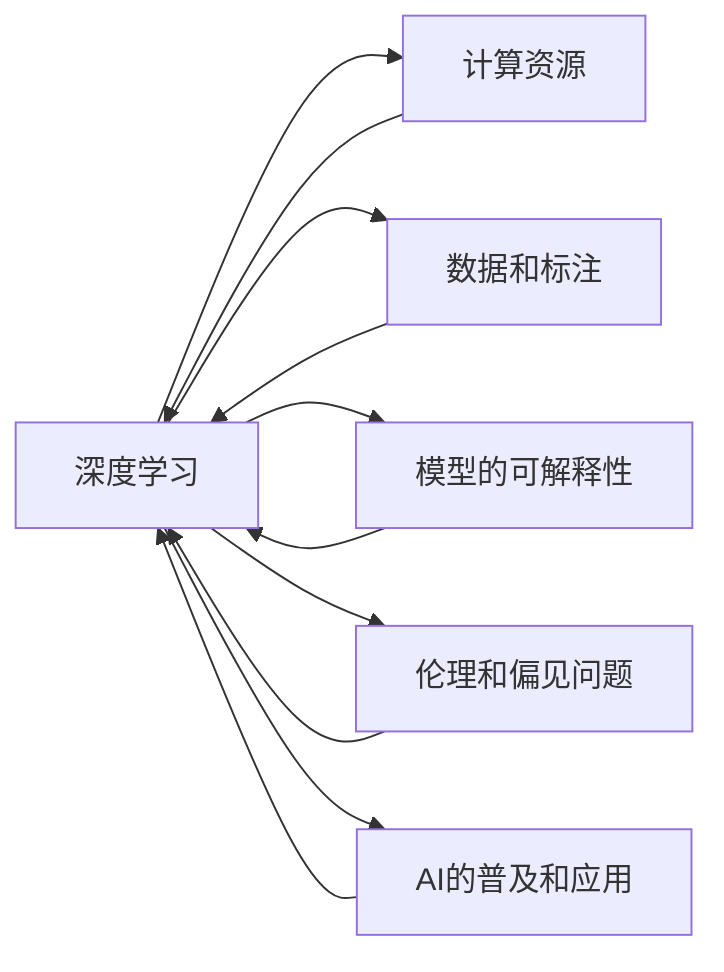

                 

## 1. 背景介绍

Andrej Karpathy，作为计算机视觉和深度学习领域的领军人物，对AI未来发展有着深刻见解。他在多次公开演讲和论文中，提出了许多关于人工智能未来的挑战和机遇。

### 1.1 引言

近年来，AI领域迎来了飞速发展，尤其是深度学习和神经网络技术的进步，使得AI在图像识别、自然语言处理、自动驾驶等多个领域取得了突破性的进展。然而，随着技术的不断深入，AI发展也面临着一系列新的挑战和未知问题。在这篇博客文章中，我们将深入探讨Andrej Karpathy关于AI未来发展的主要观点，并分析这些观点对未来的潜在影响。

### 1.2 主要议题

1. **计算资源的瓶颈**
2. **数据和标注的短缺**
3. **模型的可解释性**
4. **伦理和偏见问题**
5. **AI的普及和应用**

## 2. 核心概念与联系

### 2.1 核心概念概述

为了更好地理解Andrej Karpathy的观点，我们需要先对一些关键概念进行澄清：

- **深度学习**：一种基于神经网络的学习方法，通过多层次的特征提取和抽象，实现对数据的复杂处理。
- **计算资源**：指进行深度学习模型训练和推理所需的计算能力和硬件资源，包括GPU、TPU等高性能设备。
- **数据和标注**：深度学习模型需要大量的数据和对应的标签来进行训练，而这些数据和标签的获取往往需要高成本和复杂的工作流程。
- **模型的可解释性**：指深度学习模型的决策过程和输出结果是否易于理解和解释，这对于许多应用场景（如医疗、金融）至关重要。
- **伦理和偏见问题**：指在AI模型训练和应用中可能出现的伦理和偏见问题，如数据偏差、模型歧视等。
- **AI的普及和应用**：指AI技术如何从学术研究走向实际应用，以及如何在大规模产业中实现价值的最大化。

这些概念之间相互作用，共同构成了AI发展的复杂体系。

### 2.2 Mermaid流程图

下面是一个简化的Mermaid流程图，展示了Andrej Karpathy所讨论的核心概念之间的联系：



## 3. 核心算法原理 & 具体操作步骤

### 3.1 算法原理概述

Andrej Karpathy强调了计算资源在深度学习中的应用瓶颈。他指出，尽管深度学习模型在许多任务上取得了优秀的表现，但训练这些模型所需的计算资源（如GPU、TPU）仍然是一个巨大的挑战。此外，数据和标注的获取也成为制约模型性能提升的重要因素。模型可解释性问题则是目前AI领域面临的另一大挑战，特别是在需要高透明度的医疗、金融等领域。

### 3.2 算法步骤详解

以下是基于Andrej Karpathy观点的AI发展挑战的具体操作步骤：

1. **选择合适的计算资源**：确定训练深度学习模型的计算平台，如GPU、TPU等。
2. **获取和预处理数据**：收集和标注训练数据，并进行数据增强、归一化等预处理操作。
3. **模型设计和训练**：设计合适的神经网络架构，并在计算资源上训练模型。
4. **模型评估和调优**：通过验证集评估模型性能，并进行超参数调整。
5. **部署和应用**：将训练好的模型部署到实际应用中，并根据反馈进行优化。

### 3.3 算法优缺点

#### 优点

- **强大的表达能力**：深度学习模型能够处理复杂的非线性关系，适用于各种类型的AI任务。
- **自适应学习能力**：深度学习模型能够通过不断调整参数来适应新的数据和任务。
- **广泛的应用领域**：深度学习技术已经成功应用于图像识别、自然语言处理、自动驾驶等多个领域。

#### 缺点

- **计算资源需求高**：深度学习模型训练和推理需要大量的计算资源，增加了开发和部署的成本。
- **数据和标注成本高**：数据和标注的获取需要高成本和高复杂度，特别是对于大规模数据集。
- **模型可解释性差**：深度学习模型通常被视为“黑箱”，难以解释其内部决策过程。
- **伦理和偏见问题**：模型可能学习到数据中的偏见和歧视，导致不公平的输出结果。

### 3.4 算法应用领域

深度学习技术在计算机视觉、自然语言处理、语音识别等领域得到了广泛应用。以下是几个典型的应用场景：

- **图像识别**：如图像分类、目标检测、人脸识别等。
- **自然语言处理**：如文本分类、机器翻译、情感分析等。
- **自动驾驶**：如图像识别、车道保持、路径规划等。

## 4. 数学模型和公式 & 详细讲解 & 举例说明

### 4.1 数学模型构建

在深度学习中，通常使用神经网络模型来处理输入数据，并输出相应的结果。以卷积神经网络（CNN）为例，其数学模型可以表示为：

$$
y = W*x + b
$$

其中，$W$ 是卷积核，$x$ 是输入数据，$b$ 是偏置项，$y$ 是输出结果。

### 4.2 公式推导过程

以CNN为例，其前向传播过程可以表示为：

$$
x^{[l+1]} = h(x^{[l]}, W^{[l+1]}, b^{[l+1]})
$$

其中，$x^{[l]}$ 是第 $l$ 层的输入，$x^{[l+1]}$ 是第 $l+1$ 层的输出，$h$ 是激活函数，$W^{[l+1]}$ 和 $b^{[l+1]}$ 是第 $l+1$ 层的参数。

### 4.3 案例分析与讲解

以图像分类任务为例，CNN模型通过多个卷积层和池化层提取图像特征，并最终通过全连接层进行分类。具体步骤如下：

1. **输入数据准备**：将图像数据转换为张量形式。
2. **卷积层提取特征**：通过多个卷积核提取图像特征。
3. **池化层降维**：通过最大池化或平均池化层降维，减小特征图的大小。
4. **全连接层分类**：将池化后的特征图通过全连接层进行分类，输出类别概率。

## 5. 项目实践：代码实例和详细解释说明

### 5.1 开发环境搭建

在开始项目实践之前，我们需要先搭建好开发环境。以下是基于Python和PyTorch的开发环境搭建步骤：

1. 安装Anaconda：从官网下载并安装Anaconda，用于创建独立的Python环境。
2. 创建并激活虚拟环境：
```bash
conda create -n pytorch-env python=3.8 
conda activate pytorch-env
```

3. 安装PyTorch：根据CUDA版本，从官网获取对应的安装命令。例如：
```bash
conda install pytorch torchvision torchaudio cudatoolkit=11.1 -c pytorch -c conda-forge
```

4. 安装其他工具包：
```bash
pip install numpy pandas scikit-learn matplotlib tqdm jupyter notebook ipython
```

### 5.2 源代码详细实现

以下是一个简单的图像分类任务的PyTorch代码实现：

```python
import torch
import torch.nn as nn
import torch.optim as optim
from torchvision import datasets, transforms
from torch.utils.data import DataLoader

class CNN(nn.Module):
    def __init__(self):
        super(CNN, self).__init__()
        self.conv1 = nn.Conv2d(3, 32, 3, padding=1)
        self.conv2 = nn.Conv2d(32, 64, 3, padding=1)
        self.pool = nn.MaxPool2d(2, 2)
        self.fc1 = nn.Linear(64 * 28 * 28, 128)
        self.fc2 = nn.Linear(128, 10)
        
    def forward(self, x):
        x = nn.functional.relu(self.conv1(x))
        x = nn.functional.relu(self.conv2(x))
        x = self.pool(x)
        x = x.view(-1, 64 * 28 * 28)
        x = nn.functional.relu(self.fc1(x))
        x = self.fc2(x)
        return x

# 加载MNIST数据集
train_dataset = datasets.MNIST(root='./data', train=True, download=True, transform=transforms.ToTensor())
test_dataset = datasets.MNIST(root='./data', train=False, download=True, transform=transforms.ToTensor())

# 数据加载器
train_loader = DataLoader(train_dataset, batch_size=64, shuffle=True)
test_loader = DataLoader(test_dataset, batch_size=64)

# 初始化模型和优化器
model = CNN()
criterion = nn.CrossEntropyLoss()
optimizer = optim.Adam(model.parameters(), lr=0.001)

# 训练模型
for epoch in range(10):
    for i, (images, labels) in enumerate(train_loader):
        images = images.view(-1, 28, 28, 3)
        outputs = model(images)
        loss = criterion(outputs, labels)
        optimizer.zero_grad()
        loss.backward()
        optimizer.step()
        
        if (i+1) % 100 == 0:
            print('Epoch [{}/{}], Step [{}/{}], Loss: {:.4f}'
                  .format(epoch+1, 10, i+1, len(train_loader), loss.item()))
```

### 5.3 代码解读与分析

以下是代码的主要部分及解释：

- `CNN`类：定义了一个简单的卷积神经网络模型，包括两个卷积层、两个池化层和两个全连接层。
- `forward`方法：定义了模型的前向传播过程。
- `train_loader`和`test_loader`：使用`DataLoader`加载训练集和测试集数据。
- `criterion`：定义了交叉熵损失函数。
- `optimizer`：定义了Adam优化器。
- 训练循环：在每个epoch内，对训练数据进行迭代训练，并输出损失值。

## 6. 实际应用场景

### 6.1 智能驾驶

智能驾驶是AI技术的典型应用场景之一。Andrej Karpathy指出，AI在自动驾驶领域的应用面临着巨大的计算资源和数据标注需求。

通过收集大量的实时交通数据，并在高性能计算平台上训练和优化深度学习模型，AI可以在复杂的交通环境中实现自动驾驶。然而，这些模型需要在测试环境中进行大量试验和验证，以确保其稳定性和安全性。

### 6.2 医疗诊断

在医疗领域，AI技术也被广泛应用。通过深度学习模型分析医学影像和病历数据，AI可以帮助医生进行疾病诊断和治疗方案推荐。然而，由于医疗数据的隐私和敏感性，AI模型的训练和部署需要严格的伦理审查和安全措施。

Andrej Karpathy强调，在医疗领域应用AI时，需要特别注意模型的可解释性和透明性，确保医生和患者能够理解和信任模型的输出结果。

### 6.3 金融风险管理

金融行业也对AI技术有着巨大的需求。通过深度学习模型分析金融市场数据，AI可以预测市场趋势和风险，辅助投资决策。

然而，金融数据具有高噪声和不确定性，AI模型需要经过严格的模型验证和风险评估，以确保其预测的准确性和可靠性。

## 7. 工具和资源推荐

### 7.1 学习资源推荐

为了帮助开发者深入理解Andrej Karpathy的观点，以下是一些推荐的资源：

- **Andrej Karpathy的博客**：他的博客涵盖了深度学习、计算机视觉和自动驾驶等多个领域的最新研究成果。
- **Deep Learning Specialization**：由Andrej Karpathy教授的深度学习课程，涵盖了深度学习的基础理论和实践技巧。
- **PyTorch官方文档**：PyTorch的官方文档详细介绍了PyTorch的使用方法和最佳实践。
- **TensorFlow官方文档**：TensorFlow的官方文档提供了丰富的教程和示例代码，适合深度学习初学者和高级开发者。

### 7.2 开发工具推荐

以下是一些常用的AI开发工具：

- **PyTorch**：基于Python的深度学习框架，提供了丰富的张量操作和神经网络模块。
- **TensorFlow**：由Google开发的深度学习框架，支持分布式计算和模型优化。
- **Keras**：高层深度学习API，简单易用，适合快速原型开发。
- **Jupyter Notebook**：开源的交互式笔记本，支持Python、R等多种编程语言。

### 7.3 相关论文推荐

以下是几篇关于Andrej Karpathy的研究论文：

- **"Deep Learning for Self-Driving Cars"**：介绍了AI在自动驾驶中的应用，包括感知、决策和控制等方面的技术。
- **"Computing a Trillion Image Crops on One GPU in 100ms"**：展示了GPU在深度学习模型训练中的高效计算能力。
- **"Understanding the Difficulties of Training Deep Neural Networks"**：探讨了深度学习模型训练中的计算资源和数据瓶颈问题。

## 8. 总结：未来发展趋势与挑战

### 8.1 研究成果总结

Andrej Karpathy在AI领域的贡献涵盖了多个重要方面，包括深度学习、计算机视觉和自动驾驶等。他的研究成果不仅推动了AI技术的进步，也为未来的AI发展指明了方向。

### 8.2 未来发展趋势

未来的AI发展将面临以下几个趋势：

- **计算资源的多样化**：除了传统的GPU和TPU，边缘计算和量子计算等新兴技术将为AI提供新的计算能力。
- **数据和标注的自动化**：通过无监督学习和数据增强技术，减少对标注数据的需求，提升模型训练效率。
- **模型的可解释性**：通过可解释性技术，如LIME、SHAP等，提升模型的透明性和可解释性。
- **伦理和偏见的重视**：在AI模型训练和应用中，需要注重伦理和偏见问题，确保公平性和安全性。
- **AI的普及和应用**：AI技术将逐渐从学术研究走向实际应用，带来更多社会和经济价值。

### 8.3 面临的挑战

尽管AI技术取得了显著进展，但未来仍面临以下挑战：

- **计算资源的需求**：深度学习模型训练和推理需要大量的计算资源，成本较高。
- **数据和标注的短缺**：高质量的标注数据获取难度大，需要高成本和复杂的工作流程。
- **模型的可解释性**：深度学习模型通常被视为“黑箱”，难以解释其内部决策过程。
- **伦理和偏见问题**：AI模型可能学习到数据中的偏见和歧视，导致不公平的输出结果。

### 8.4 研究展望

未来的AI研究需要在以下几个方面进行深入探索：

- **数据增强技术**：通过数据增强和合成数据生成技术，减少对标注数据的需求。
- **模型压缩和优化**：通过模型压缩和量化技术，降低计算资源需求，提升模型推理速度。
- **可解释性技术**：开发更多可解释性技术，提升模型的透明性和可解释性。
- **伦理和偏见分析**：在AI模型训练和应用中，注重伦理和偏见问题，确保公平性和安全性。

## 9. 附录：常见问题与解答

### Q1: AI的发展瓶颈是什么？

A: AI的发展瓶颈主要包括以下几个方面：
- **计算资源需求高**：深度学习模型训练和推理需要大量的计算资源，增加了开发和部署的成本。
- **数据和标注成本高**：数据和标注的获取需要高成本和高复杂度，特别是对于大规模数据集。
- **模型可解释性差**：深度学习模型通常被视为“黑箱”，难以解释其内部决策过程。
- **伦理和偏见问题**：模型可能学习到数据中的偏见和歧视，导致不公平的输出结果。

### Q2: 如何提高AI模型的可解释性？

A: 提高AI模型的可解释性可以从以下几个方面进行：
- **LIME和SHAP**：使用这些技术来生成局部可解释性模型，解释模型的决策过程。
- **特征重要性分析**：通过特征重要性分析，了解模型在不同特征上的依赖关系。
- **模型可视化**：使用可视化工具，如TensorBoard、Tableau等，展示模型的训练和推理过程。

### Q3: 如何减少AI模型的数据和标注需求？

A: 减少AI模型的数据和标注需求可以从以下几个方面进行：
- **无监督学习**：通过无监督学习，利用非结构化数据进行模型训练。
- **数据增强**：通过数据增强技术，生成更多的训练数据。
- **合成数据生成**：通过合成数据生成技术，生成更多的模拟数据。

### Q4: 如何在AI模型中避免伦理和偏见问题？

A: 在AI模型中避免伦理和偏见问题可以从以下几个方面进行：
- **数据清洗**：对数据进行清洗，去除偏见和噪声数据。
- **模型监督**：在模型训练过程中，使用公平性约束来指导模型学习。
- **人工审核**：对模型的输出结果进行人工审核，确保其符合伦理和公平性要求。

## 总结

Andrej Karpathy关于AI未来发展的观点和思考，为我们揭示了AI技术在多个领域的潜力和挑战。通过理解和掌握这些关键概念和算法，我们能够更好地应对AI发展的未来趋势，推动AI技术的不断进步。

