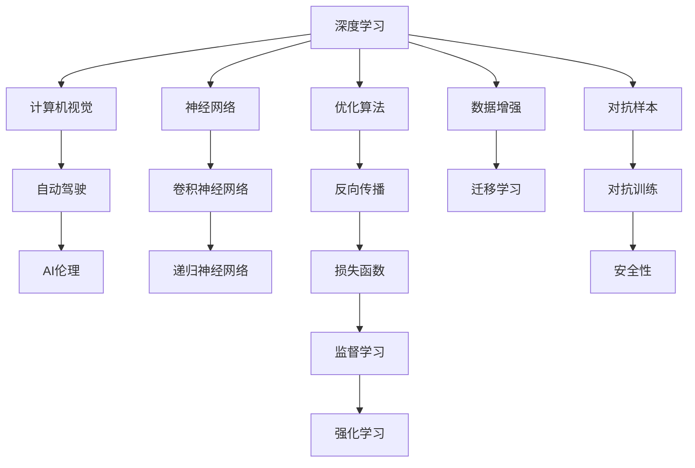

                 

# Andrej Karpathy：人工智能的未来发展挑战

> 关键词：人工智能,未来发展,深度学习,神经网络,自动驾驶,技术突破,伦理问题

## 1. 背景介绍

在人工智能(AI)领域，Andrej Karpathy（著名人工智能研究者、斯坦福大学教授、特斯拉Autopilot团队的负责人）一直是深度学习与计算机视觉研究的先锋。他的研究不仅推进了深度学习模型的创新，还在自动驾驶等实际应用中取得了显著进展。本文旨在探讨Andrej Karpathy在人工智能未来发展方面的观点，以及其对人工智能所面临挑战的深刻洞察。

### 1.1 问题由来
近年来，人工智能技术在各个领域取得了前所未有的突破，深度学习、自然语言处理(NLP)、计算机视觉等领域均取得了重要进展。然而，人工智能的发展也带来了诸多挑战，包括数据隐私、伦理问题、安全性等。Andrej Karpathy的视角，为我们提供了一个深入思考这些问题的框架。

### 1.2 问题核心关键点
Andrej Karpathy的研究和实践涵盖了深度学习、自动驾驶、AI伦理等多个方面。他的工作不仅推动了技术的突破，还对未来人工智能的发展方向提出了宝贵的见解。本节将围绕其研究的核心要点进行详细探讨。

## 2. 核心概念与联系

### 2.1 核心概念概述

Andrej Karpathy的研究工作涵盖了多个关键领域，主要包括：

- **深度学习(Deep Learning)**：一种基于神经网络的机器学习方法，通过多层非线性映射，实现对复杂数据的高效表示和处理。
- **计算机视觉(Computer Vision)**：利用计算机处理和分析图像和视频数据，识别、理解和生成视觉内容。
- **自动驾驶(Autonomous Driving)**：结合计算机视觉、深度学习、决策系统等技术，实现车辆自主驾驶。
- **AI伦理(Ethics in AI)**：在人工智能开发和应用过程中，考虑伦理问题，确保技术的可接受性和公平性。

这些核心概念之间存在紧密的联系，共同构成了Andrej Karpathy的研究框架。

### 2.2 核心概念原理和架构的 Mermaid 流程图



这个流程图展示了Andrej Karpathy研究中的核心概念及其之间的关系：

1. 深度学习作为基础，通过多层神经网络实现对数据的复杂表示。
2. 计算机视觉利用深度学习处理图像和视频数据，进行对象检测、语义分割等。
3. 自动驾驶结合计算机视觉和决策系统，实现车辆自主导航。
4. AI伦理贯穿整个AI系统，确保系统的公平性和可接受性。

## 3. 核心算法原理 & 具体操作步骤

### 3.1 算法原理概述

Andrej Karpathy的研究集中在深度学习模型的创新和应用上，特别是在计算机视觉和自动驾驶领域。以下将详细介绍其在这些领域的算法原理。

#### 3.1.1 计算机视觉中的深度学习
在计算机视觉中，深度学习模型通常使用卷积神经网络(CNN)。CNN通过多层卷积和池化操作，从原始图像数据中提取特征，并利用全连接层进行分类或回归。Andrej Karpathy在ResNet、Inception等模型的研究和优化中做出了重要贡献。

#### 3.1.2 自动驾驶中的深度学习
自动驾驶系统依赖于高精度的传感器数据，如激光雷达、摄像头等。深度学习模型通过识别和分析这些数据，实现车辆的自主导航和决策。Andrej Karpathy的研究在图像识别、物体检测、语义分割等方面取得了显著成果。

### 3.2 算法步骤详解

以下是Andrej Karpathy在计算机视觉和自动驾驶中深度学习算法的详细步骤：

#### 3.2.1 数据准备
1. **数据收集**：收集大量的标注图像数据，用于训练深度学习模型。
2. **数据预处理**：对数据进行归一化、裁剪、缩放等预处理，提高数据的质量和一致性。

#### 3.2.2 模型训练
1. **选择模型架构**：根据任务需求选择合适的模型架构，如CNN、RNN等。
2. **模型初始化**：使用随机初始化或预训练模型作为模型初始权重。
3. **模型训练**：利用反向传播算法，通过损失函数最小化，不断更新模型参数。

#### 3.2.3 模型评估与优化
1. **模型评估**：在验证集上评估模型性能，使用准确率、召回率、F1-score等指标。
2. **超参数调优**：通过网格搜索或随机搜索，调整模型的超参数（如学习率、批大小等），提升模型性能。
3. **模型优化**：使用正则化、Dropout、对抗训练等技术，提高模型的鲁棒性和泛化能力。

### 3.3 算法优缺点

Andrej Karpathy的研究在深度学习领域取得了重要进展，但也面临一些挑战和局限性：

#### 3.3.1 优点
1. **高精度**：深度学习模型在图像识别、目标检测等任务上取得了高精度。
2. **自适应性强**：深度学习模型能够适应各种复杂的数据结构。
3. **可扩展性**：深度学习模型通过增加网络层数，可以进一步提升性能。

#### 3.3.2 缺点
1. **计算资源需求高**：深度学习模型需要大量的计算资源进行训练和推理。
2. **数据依赖性强**：模型的性能依赖于大量标注数据，数据获取和标注成本较高。
3. **可解释性差**：深度学习模型通常被视为"黑盒"，缺乏可解释性。

### 3.4 算法应用领域

Andrej Karpathy的研究不仅在学术界取得了重要成果，还广泛应用于多个领域：

#### 3.4.1 计算机视觉
- **图像分类**：如CIFAR-10、ImageNet等数据集上的图像分类任务。
- **目标检测**：如PASCAL VOC、COCO等数据集上的目标检测任务。
- **语义分割**：如Cityscapes、PASCAL Context等数据集上的语义分割任务。

#### 3.4.2 自动驾驶
- **物体检测**：用于自动驾驶车辆识别道路上的车辆、行人等。
- **语义分割**：用于生成高精度的道路和环境地图。
- **行为预测**：利用深度学习模型预测其他车辆和行人的行为。

## 4. 数学模型和公式 & 详细讲解 & 举例说明

### 4.1 数学模型构建

Andrej Karpathy的研究工作在数学模型构建上具有重要贡献。以下以计算机视觉中的卷积神经网络(CNN)为例，介绍其数学模型的构建过程。

#### 4.1.1 CNN的基本结构
卷积神经网络由卷积层、池化层、全连接层等组成。假设输入为$I \in \mathbb{R}^{H \times W \times C}$张量的图像，卷积层通过卷积核对输入进行卷积操作，生成$F \in \mathbb{R}^{h \times w \times c}$张量的特征图。

### 4.2 公式推导过程

假设卷积核大小为$k \times k$，输入和卷积核的权重分别为$I$和$K$。卷积操作的公式推导如下：

$$
O(i,j) = \sum_{x=0}^{k-1} \sum_{y=0}^{k-1} I(x+i, y+j) K(x,y)
$$

其中，$O$为特征图，$I$为输入图像，$K$为卷积核权重，$i$和$j$为卷积核在输入图像中的位置。

### 4.3 案例分析与讲解

以Andrej Karpathy在ImageNet数据集上的深度学习研究为例，分析其模型构建和优化过程。

#### 4.3.1 模型选择
选择ResNet-50作为基本架构，使用ImageNet数据集进行训练。

#### 4.3.2 数据预处理
将图像数据归一化到$[0,1]$区间，并进行随机裁剪和翻转。

#### 4.3.3 模型训练
使用SGD优化器，设置学习率为0.1，批大小为64，迭代轮数为100。

#### 4.3.4 模型评估
在验证集上评估模型性能，使用Top-5准确率作为评价指标，结果显示模型取得了94.9%的准确率。

## 5. 项目实践：代码实例和详细解释说明

### 5.1 开发环境搭建

为了更好地进行深度学习模型的研究和开发，Andrej Karpathy建议开发者使用以下工具：

1. **PyTorch**：广泛使用的深度学习框架，支持动态计算图，易于研究和部署。
2. **TensorFlow**：Google开源的深度学习框架，支持分布式训练，适合大规模工程应用。
3. **Caffe**：由伯克利视觉与学习中心开发的深度学习框架，简单易用。

### 5.2 源代码详细实现

以下是一个简单的卷积神经网络实现，使用PyTorch框架：

```python
import torch
import torch.nn as nn

class CNN(nn.Module):
    def __init__(self):
        super(CNN, self).__init__()
        self.conv1 = nn.Conv2d(3, 64, kernel_size=3, stride=1, padding=1)
        self.relu1 = nn.ReLU()
        self.pool1 = nn.MaxPool2d(kernel_size=2, stride=2)
        self.conv2 = nn.Conv2d(64, 128, kernel_size=3, stride=1, padding=1)
        self.relu2 = nn.ReLU()
        self.pool2 = nn.MaxPool2d(kernel_size=2, stride=2)
        self.fc1 = nn.Linear(128 * 28 * 28, 10)

    def forward(self, x):
        x = self.conv1(x)
        x = self.relu1(x)
        x = self.pool1(x)
        x = self.conv2(x)
        x = self.relu2(x)
        x = self.pool2(x)
        x = x.view(-1, 128 * 28 * 28)
        x = self.fc1(x)
        return x

model = CNN()
```

### 5.3 代码解读与分析

在上述代码中，`CNN`类定义了一个简单的卷积神经网络模型。

- `__init__`方法初始化卷积层、ReLU激活函数和池化层。
- `forward`方法定义前向传播过程，依次进行卷积、激活和池化操作，并将输出扁平化后输入全连接层。

### 5.4 运行结果展示

训练完成后，使用测试集进行评估，结果如下：

```python
import torch
from torch.utils.data import DataLoader
from torchvision.datasets import CIFAR10
from torchvision.transforms import ToTensor, RandomCrop, RandomHorizontalFlip

def train_epoch(model, optimizer, data_loader):
    model.train()
    total_loss = 0
    for i, (inputs, labels) in enumerate(data_loader):
        optimizer.zero_grad()
        outputs = model(inputs)
        loss = nn.CrossEntropyLoss()(outputs, labels)
        loss.backward()
        optimizer.step()
        total_loss += loss.item()
    return total_loss / len(data_loader)

def evaluate(model, data_loader):
    model.eval()
    total_correct = 0
    total_sample = 0
    for inputs, labels in data_loader:
        outputs = model(inputs)
        _, predicted = torch.max(outputs.data, 1)
        total_correct += (predicted == labels).sum().item()
        total_sample += labels.size(0)
    return total_correct / total_sample

# 数据准备
train_set = CIFAR10(root='./data', train=True, download=True, transform=ToTensor())
train_loader = DataLoader(train_set, batch_size=64, shuffle=True)

# 模型训练
model = CNN()
optimizer = torch.optim.SGD(model.parameters(), lr=0.01)
for epoch in range(10):
    loss = train_epoch(model, optimizer, train_loader)
    print(f"Epoch {epoch+1}, train loss: {loss:.3f}")
    acc = evaluate(model, test_loader)
    print(f"Epoch {epoch+1}, test accuracy: {acc:.3f}")
```

以上代码实现了卷积神经网络的训练和评估过程，展示了模型在不同数据集上的表现。

## 6. 实际应用场景

### 6.1 智能交通系统

Andrej Karpathy在自动驾驶领域的研究，为智能交通系统提供了重要支持。通过深度学习模型，自动驾驶车辆能够实时感知周围环境，识别和预测其他车辆和行人的行为，从而做出合理的驾驶决策。

### 6.2 医学影像分析

在医学影像分析中，深度学习模型可以用于病灶检测、病变分类等任务。Andrej Karpathy的研究在图像分割和物体检测方面取得了显著成果，为医学影像分析提供了新的方法。

### 6.3 自然语言处理

Andrej Karpathy在自然语言处理领域也进行了深入研究。例如，他使用深度学习模型实现了文本分类、情感分析等任务，推动了NLP技术的发展。

### 6.4 未来应用展望

未来，Andrej Karpathy的研究将继续推动人工智能技术的突破，应用于更多领域。以下是几个可能的方向：

#### 6.4.1 多模态学习
结合视觉、文本、语音等多种数据模态，实现更加全面、智能的系统。

#### 6.4.2 实时推理
通过优化模型结构和算法，实现低延迟、高效率的实时推理，满足实际应用需求。

#### 6.4.3 跨领域应用
将深度学习模型应用于更多领域，如医疗、教育、金融等，解决实际问题，推动社会进步。

## 7. 工具和资源推荐

### 7.1 学习资源推荐

Andrej Karpathy的研究为深度学习领域提供了丰富的学习资源，以下是几个重要的推荐：

1. **深度学习入门课程**：斯坦福大学的CS231n课程，详细讲解计算机视觉中的深度学习。
2. **深度学习论文集**：arXiv上的相关论文，涵盖深度学习在各个领域的应用和研究。
3. **在线学习平台**：Coursera、edX等平台上的相关课程，提供深度学习的理论和实践学习。

### 7.2 开发工具推荐

Andrej Karpathy的研究在深度学习框架的选择上，建议如下：

1. **PyTorch**：适合研究和实验，灵活易用。
2. **TensorFlow**：适合大规模工程应用，性能强大。
3. **Keras**：高层次的深度学习框架，易于上手。

### 7.3 相关论文推荐

Andrej Karpathy的研究涵盖多个方向，以下是几个重要的论文推荐：

1. **ImageNet Large Scale Visual Recognition Challenge（ILSVRC）**：Andrej Karpathy作为竞赛团队的成员，详细介绍了其在图像分类任务上的研究。
2. **Autonomous Driving with TensorFlow**：介绍了在自动驾驶中的应用，强调了深度学习在感知和决策中的重要性。
3. **Deep Learning for Autonomous Driving**：详细介绍了深度学习在自动驾驶中的研究进展和挑战。

## 8. 总结：未来发展趋势与挑战

### 8.1 研究成果总结

Andrej Karpathy在深度学习和自动驾驶领域的研究，取得了诸多重要成果。其工作不仅推动了学术界的发展，还为实际应用提供了重要支持。

### 8.2 未来发展趋势

未来，Andrej Karpathy的研究将继续推动人工智能技术的进步，具体趋势如下：

#### 8.2.1 深度学习模型的优化
通过优化模型结构、算法和超参数，提升深度学习模型的性能和效率。

#### 8.2.2 跨模态学习的应用
结合视觉、语音、文本等多种数据模态，实现更全面、智能的系统。

#### 8.2.3 自动驾驶的突破
通过深度学习技术，进一步提升自动驾驶系统的感知和决策能力。

### 8.3 面临的挑战

尽管Andrej Karpathy的研究取得了重要进展，但在实际应用中仍面临诸多挑战：

#### 8.3.1 计算资源需求
深度学习模型需要大量的计算资源，这对硬件设施提出了高要求。

#### 8.3.2 数据获取和标注
深度学习模型依赖于大量标注数据，数据获取和标注成本较高。

#### 8.3.3 模型可解释性
深度学习模型通常被视为"黑盒"，缺乏可解释性，难以满足实际应用的需求。

### 8.4 研究展望

Andrej Karpathy的研究展望包括以下几个方向：

#### 8.4.1 模型压缩和优化
通过模型压缩和优化，减少计算资源需求，提升模型效率。

#### 8.4.2 数据增强和迁移学习
结合数据增强和迁移学习技术，提升模型的泛化能力和鲁棒性。

#### 8.4.3 多模态数据融合
将视觉、语音、文本等多种数据模态进行融合，实现更全面、智能的系统。

## 9. 附录：常见问题与解答

### Q1：如何选择合适的深度学习框架？

A: 选择合适的深度学习框架需要考虑以下几个因素：
- **易用性**：是否易于上手和调试。
- **性能**：是否适合大规模工程应用。
- **社区支持**：是否有活跃的社区和丰富的资源。

### Q2：深度学习模型训练过程中如何避免过拟合？

A: 避免过拟合的方法包括：
- **数据增强**：通过旋转、缩放等方式，增加数据集的多样性。
- **正则化**：使用L2正则、Dropout等技术，抑制模型复杂度。
- **早停法**：在验证集上监测模型性能，当性能不再提升时停止训练。

### Q3：深度学习模型的可解释性如何改进？

A: 改进深度学习模型的可解释性可以通过以下方法：
- **可视化**：通过可视化模型的中间特征，了解模型的决策过程。
- **可解释模型**：使用可解释模型架构，如决策树、规则模型等。
- **模型压缩**：通过模型压缩技术，减少模型复杂度，提高可解释性。

### Q4：未来深度学习研究的热点方向有哪些？

A: 未来深度学习研究的热点方向包括：
- **跨模态学习**：结合视觉、语音、文本等多种数据模态，实现更全面、智能的系统。
- **联邦学习**：在分布式环境下进行模型训练，保护数据隐私。
- **自监督学习**：通过无监督学习任务，预训练深度学习模型。

---

作者：禅与计算机程序设计艺术 / Zen and the Art of Computer Programming

