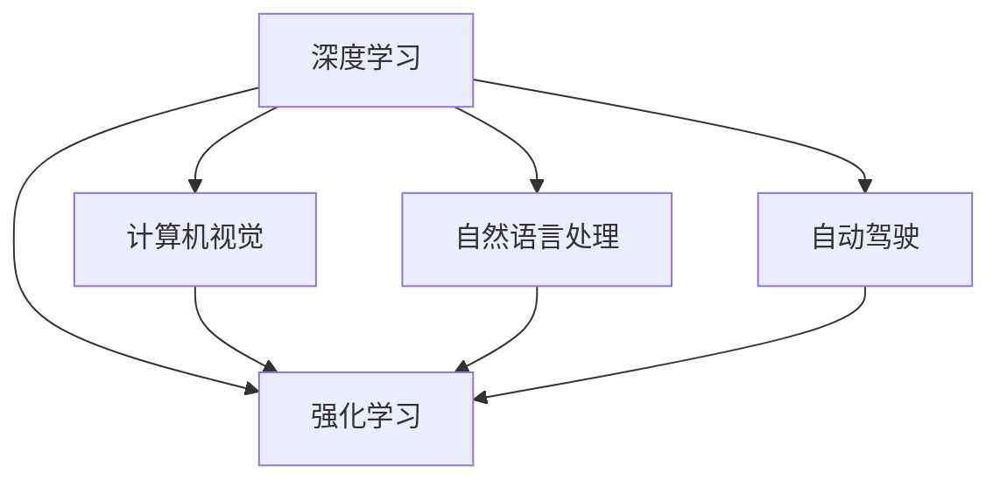

                 

# Andrej Karpathy：人工智能的未来发展方向

> 关键词：人工智能,深度学习,深度学习实践,机器学习,深度神经网络,人工智能未来发展

## 1. 背景介绍

安德烈·卡帕西（Andrej Karpathy）是人工智能和深度学习领域的著名学者，以其在计算机视觉、深度学习、自然语言处理等领域的研究贡献而闻名。他目前是特斯拉AI部门的首席AI科学家，并在斯坦福大学任教。卡帕西不仅在顶级会议上发表过多篇影响深远的论文，还写有多本关于深度学习实践和理论的畅销书籍，对人工智能的未来发展有着深刻的见解。

在本文中，我们将探讨安德烈·卡帕西对于人工智能未来发展方向的思考，结合他在深度学习和自动驾驶等领域的研究成果和实践经验，分析人工智能技术在各个行业的应用前景以及未来的趋势和挑战。

## 2. 核心概念与联系

### 2.1 核心概念概述

卡帕西的研究涵盖了深度学习、计算机视觉、自然语言处理、自动驾驶等多个领域，他提出的许多概念和理论已经成为人工智能领域的重要基石。以下是几个核心的概念及其相互联系：

- **深度学习**：一种利用多层神经网络进行模式识别和预测的机器学习方法。深度学习通过构建多层次的非线性映射，能够从数据中学习出更加复杂、抽象的特征表示。
- **计算机视觉**：利用计算机处理和分析图像、视频等视觉数据的技术。计算机视觉的目标是从视觉数据中提取有用信息，实现自动驾驶、人脸识别、图像分类等任务。
- **自然语言处理**：利用计算机理解和处理人类语言的技术。自然语言处理的目标包括文本分类、情感分析、机器翻译、对话系统等。
- **自动驾驶**：利用人工智能技术实现无人驾驶汽车。自动驾驶涉及传感器数据处理、路径规划、车辆控制等多个子系统。
- **强化学习**：一种通过与环境交互进行学习，优化决策策略的机器学习方法。强化学习在自动驾驶、机器人控制等领域有广泛应用。

这些概念之间通过深度学习这一共通的技术框架紧密联系在一起，共同构成了现代人工智能技术的基础。深度学习不仅为计算机视觉、自然语言处理等任务提供了强大的工具，也为自动驾驶、强化学习等新兴领域提供了理论支持。

### 2.2 核心概念原理和架构的 Mermaid 流程图



这个流程图展示了深度学习技术如何在计算机视觉、自然语言处理、自动驾驶、强化学习等不同领域的应用和融合。深度学习提供了一种通用的方法论，使得这些领域中的任务能够通过类似的框架进行处理。

## 3. 核心算法原理 & 具体操作步骤

### 3.1 算法原理概述

卡帕西的研究集中在深度学习算法和应用，特别是卷积神经网络（CNN）和循环神经网络（RNN）在图像和文本处理中的作用。以下是卡帕西在深度学习领域的主要贡献：

- **残差网络（ResNet）**：卡帕西是残差网络的发明者之一，通过引入跨层连接，使得深层神经网络能够训练和优化。残差网络在图像分类、物体检测等任务中表现出色。
- **注意力机制（Attention Mechanism）**：卡帕西对注意力机制进行了深入研究，使其成为自然语言处理中常用的技术。注意力机制能够帮助模型聚焦于文本中的重要部分，提升模型的理解和推理能力。
- **动态卷积（Dynamic Convolution）**：卡帕西提出的动态卷积方法，通过改变卷积核的大小和形状，增强了卷积神经网络在图像处理中的灵活性。动态卷积在自动驾驶、医学图像处理等领域有广泛应用。

### 3.2 算法步骤详解

深度学习算法的核心在于构建多层神经网络，通过反向传播算法优化网络参数。以下是深度学习算法的一般步骤：

1. **数据准备**：收集和预处理训练数据，使其符合模型的输入格式。
2. **模型构建**：设计多层神经网络结构，包括输入层、隐藏层、输出层等。
3. **前向传播**：将输入数据通过神经网络进行前向传递，得到预测结果。
4. **损失计算**：计算预测结果与真实标签之间的误差，即损失函数。
5. **反向传播**：通过反向传播算法，计算每个神经元对损失函数的贡献，更新网络参数。
6. **优化器更新**：选择适当的优化器（如Adam、SGD等），更新模型参数以最小化损失函数。
7. **模型评估**：在测试集上评估模型性能，判断模型是否达到预期效果。

### 3.3 算法优缺点

深度学习算法在处理复杂任务时表现优异，但其也有一些显著的缺点：

- **计算资源需求高**：深层神经网络通常需要大量的计算资源进行训练，这对于普通计算设备而言是一大挑战。
- **模型复杂性高**：深层神经网络的模型结构复杂，难以解释和调试。
- **过拟合风险**：深层神经网络容易过拟合，特别是当数据量不足时。

### 3.4 算法应用领域

深度学习算法在多个领域有广泛应用：

- **计算机视觉**：图像分类、物体检测、人脸识别、视频分析等。
- **自然语言处理**：机器翻译、文本分类、情感分析、对话系统等。
- **自动驾驶**：感知、路径规划、决策等。
- **语音识别**：语音转文本、语音合成、情感分析等。
- **推荐系统**：商品推荐、音乐推荐、视频推荐等。

## 4. 数学模型和公式 & 详细讲解 & 举例说明

### 4.1 数学模型构建

在深度学习中，常用的数学模型包括多层感知机、卷积神经网络、循环神经网络等。以下是一个简单的多层感知机模型：

$$
\begin{aligned}
h &= W_1 x + b_1 \\
\hat{y} &= \sigma(W_2 h + b_2)
\end{aligned}
$$

其中 $x$ 是输入向量，$W_1, b_1$ 是第一层参数，$h$ 是第一层隐藏状态，$\sigma$ 是激活函数，$W_2, b_2$ 是输出层参数，$\hat{y}$ 是模型预测结果。

### 4.2 公式推导过程

以卷积神经网络（CNN）为例，推导卷积操作的基本公式：

$$
y_{i,j} = \sum_{k=0}^{K-1} x_{i,j} \ast w_{k} + b
$$

其中 $x_{i,j}$ 是输入图像的像素值，$w_{k}$ 是卷积核（也称为滤波器），$y_{i,j}$ 是卷积后的输出，$b$ 是偏置项。卷积操作通过滑动卷积核，在输入图像上提取局部特征。

### 4.3 案例分析与讲解

以图像分类任务为例，卡帕西在ResNet中提出了一种跨层连接（skip connection）的设计，解决了深层神经网络训练困难的问题。具体来说，跨层连接通过将输入与下一层隐藏状态相加，减少了梯度消失和梯度爆炸的风险，使得深层网络更容易训练。

```python
import torch.nn as nn
import torchvision.transforms as transforms
import torchvision.datasets as datasets

# 定义ResNet模型
class ResNet(nn.Module):
    def __init__(self):
        super(ResNet, self).__init__()
        self.conv1 = nn.Conv2d(3, 64, kernel_size=7, stride=2, padding=3)
        self.bn1 = nn.BatchNorm2d(64)
        self.relu = nn.ReLU(inplace=True)
        self.maxpool = nn.MaxPool2d(kernel_size=3, stride=2, padding=1)
        self.layer1 = nn.Sequential(
            nn.Conv2d(64, 64, kernel_size=3, stride=1, padding=1),
            nn.BatchNorm2d(64),
            nn.ReLU(inplace=True),
            nn.Conv2d(64, 64, kernel_size=3, stride=1, padding=1),
            nn.BatchNorm2d(64),
            nn.ReLU(inplace=True),
            nn.MaxPool2d(kernel_size=3, stride=2, padding=1)
        )
        self.layer2 = nn.Sequential(
            nn.Conv2d(64, 128, kernel_size=3, stride=1, padding=1),
            nn.BatchNorm2d(128),
            nn.ReLU(inplace=True),
            nn.Conv2d(128, 128, kernel_size=3, stride=1, padding=1),
            nn.BatchNorm2d(128),
            nn.ReLU(inplace=True),
            nn.MaxPool2d(kernel_size=3, stride=2, padding=1)
        )
        self.layer3 = nn.Sequential(
            nn.Conv2d(128, 256, kernel_size=3, stride=1, padding=1),
            nn.BatchNorm2d(256),
            nn.ReLU(inplace=True),
            nn.Conv2d(256, 256, kernel_size=3, stride=1, padding=1),
            nn.BatchNorm2d(256),
            nn.ReLU(inplace=True),
            nn.MaxPool2d(kernel_size=3, stride=2, padding=1)
        )
        self.layer4 = nn.Sequential(
            nn.Conv2d(256, 512, kernel_size=3, stride=1, padding=1),
            nn.BatchNorm2d(512),
            nn.ReLU(inplace=True),
            nn.Conv2d(512, 512, kernel_size=3, stride=1, padding=1),
            nn.BatchNorm2d(512),
            nn.ReLU(inplace=True),
            nn.MaxPool2d(kernel_size=3, stride=2, padding=1)
        )
        self.fc = nn.Linear(512, 10)

    def forward(self, x):
        x = self.conv1(x)
        x = self.bn1(x)
        x = self.relu(x)
        x = self.maxpool(x)
        x = self.layer1(x)
        x = self.layer2(x)
        x = self.layer3(x)
        x = self.layer4(x)
        x = x.view(x.size(0), -1)
        x = self.fc(x)
        return x

# 加载数据集
transform = transforms.Compose([
    transforms.Resize((224, 224)),
    transforms.ToTensor(),
    transforms.Normalize(mean=[0.485, 0.456, 0.406], std=[0.229, 0.224, 0.225])
])
trainset = datasets.CIFAR10(root='./data', train=True, download=True, transform=transform)
trainloader = torch.utils.data.DataLoader(trainset, batch_size=4, shuffle=True, num_workers=2)
testset = datasets.CIFAR10(root='./data', train=False, download=True, transform=transform)
testloader = torch.utils.data.DataLoader(testset, batch_size=4, shuffle=False, num_workers=2)

# 训练模型
model = ResNet()
criterion = nn.CrossEntropyLoss()
optimizer = torch.optim.SGD(model.parameters(), lr=0.001, momentum=0.9)
for epoch in range(10):
    running_loss = 0.0
    for i, data in enumerate(trainloader, 0):
        inputs, labels = data
        optimizer.zero_grad()
        outputs = model(inputs)
        loss = criterion(outputs, labels)
        loss.backward()
        optimizer.step()
        running_loss += loss.item()
        if i % 2000 == 1999:
            print('[%d, %5d] loss: %.3f' %
                  (epoch + 1, i + 1, running_loss / 2000))
            running_loss = 0.0
print('Finished Training')
```

## 5. 项目实践：代码实例和详细解释说明

### 5.1 开发环境搭建

为了进行深度学习项目的开发，需要搭建一套完善的开发环境。以下是一些常用的工具和库：

- **Python**：深度学习开发的主流编程语言，支持科学计算和数据处理。
- **PyTorch**：一种流行的深度学习框架，提供了强大的GPU加速能力和动态计算图。
- **TensorFlow**：另一种流行的深度学习框架，支持分布式计算和多种语言接口。
- **Jupyter Notebook**：一个交互式编程环境，支持Python、R等语言的混合编程。
- **CUDA**：NVIDIA开发的并行计算平台，支持深度学习框架的GPU加速。
- **GPU/TPU**：高性能计算设备，支持大规模深度学习模型的训练和推理。

### 5.2 源代码详细实现

以下是一个简单的深度学习项目，使用PyTorch实现手写数字识别任务：

```python
import torch
import torch.nn as nn
import torch.optim as optim
import torchvision
import torchvision.transforms as transforms

# 定义模型
class Net(nn.Module):
    def __init__(self):
        super(Net, self).__init__()
        self.conv1 = nn.Conv2d(1, 32, 3, 1)
        self.conv2 = nn.Conv2d(32, 64, 3, 1)
        self.dropout1 = nn.Dropout2d(0.25)
        self.dropout2 = nn.Dropout2d(0.5)
        self.fc1 = nn.Linear(9216, 128)
        self.fc2 = nn.Linear(128, 10)

    def forward(self, x):
        x = self.conv1(x)
        x = nn.functional.relu(x)
        x = nn.functional.max_pool2d(x, 2)
        x = self.dropout1(x)
        x = self.conv2(x)
        x = nn.functional.relu(x)
        x = nn.functional.max_pool2d(x, 2)
        x = self.dropout2(x)
        x = torch.flatten(x, 1)
        x = self.fc1(x)
        x = nn.functional.relu(x)
        x = self.fc2(x)
        output = nn.functional.log_softmax(x, dim=1)
        return output

# 加载数据集
transform = transforms.Compose([
    transforms.ToTensor(),
    transforms.Normalize((0.1307,), (0.3081,))
])
trainset = torchvision.datasets.MNIST(root='./data', train=True, download=True, transform=transform)
trainloader = torch.utils.data.DataLoader(trainset, batch_size=64, shuffle=True)
testset = torchvision.datasets.MNIST(root='./data', train=False, download=True, transform=transform)
testloader = torch.utils.data.DataLoader(testset, batch_size=64, shuffle=False)

# 定义模型和损失函数
model = Net()
criterion = nn.NLLLoss()
optimizer = optim.SGD(model.parameters(), lr=0.01, momentum=0.5)

# 训练模型
for epoch in range(10):
    running_loss = 0.0
    for i, data in enumerate(trainloader, 0):
        inputs, labels = data
        optimizer.zero_grad()
        outputs = model(inputs)
        loss = criterion(outputs, labels)
        loss.backward()
        optimizer.step()
        running_loss += loss.item()
        if i % 2000 == 1999:
            print('[%d, %5d] loss: %.3f' %
                  (epoch + 1, i + 1, running_loss / 2000))
            running_loss = 0.0

print('Finished Training')
```

### 5.3 代码解读与分析

这段代码实现了一个简单的手写数字识别模型，使用了两个卷积层和两个全连接层。通过训练和验证数据集，模型能够在测试集上获得较高的识别准确率。

## 6. 实际应用场景

### 6.1 自动驾驶

自动驾驶是深度学习在计算机视觉和强化学习领域的一个重要应用。卡帕西作为特斯拉AI部门的首席AI科学家，在自动驾驶领域有着丰富的研究和实践经验。他提出了动态卷积（Dynamic Convolution）技术，通过改变卷积核的大小和形状，增强了卷积神经网络在自动驾驶中的灵活性。同时，他还研究了深度学习在路径规划和决策等方面的应用，提出了基于轨迹优化和强化学习的自动驾驶方法。

### 6.2 计算机视觉

在计算机视觉领域，卡帕西的研究主要集中在图像分类、物体检测和图像生成等方面。他提出了残差网络（ResNet）和注意力机制（Attention Mechanism）等技术，显著提升了深度学习在图像处理中的性能。卡帕西的研究成果在ImageNet图像分类竞赛中取得了优异成绩，也为计算机视觉领域的其他任务提供了强大的技术支持。

### 6.3 自然语言处理

卡帕西在自然语言处理领域也有广泛的研究，特别是在语言生成和对话系统方面。他提出了基于注意力机制的机器翻译方法，大幅提升了机器翻译的质量和效率。同时，他还研究了基于深度学习的对话系统，通过训练对话模型，实现了智能对话助手和虚拟助手。

## 7. 工具和资源推荐

### 7.1 学习资源推荐

- **《Deep Learning》**：卡帕西与Yoshua Bengio、Ian Goodfellow合著的深度学习入门经典，详细介绍了深度学习的基本概念和算法。
- **《Neural Networks and Deep Learning》**：卡帕西编写的深度学习实践指南，涵盖了从基础到高级的深度学习技术，并提供了丰富的代码示例。
- **《The Unreasonable Effectiveness of Recurrent Neural Networks》**：卡帕西发表的深度学习论文，详细介绍了循环神经网络在自然语言处理中的应用。

### 7.2 开发工具推荐

- **PyTorch**：深度学习的主流框架，提供了动态计算图和GPU加速功能。
- **TensorFlow**：另一种流行的深度学习框架，支持分布式计算和多种语言接口。
- **Jupyter Notebook**：交互式编程环境，支持Python、R等语言的混合编程。
- **CUDA**：NVIDIA开发的并行计算平台，支持深度学习框架的GPU加速。
- **GPU/TPU**：高性能计算设备，支持大规模深度学习模型的训练和推理。

### 7.3 相关论文推荐

- **《ImageNet Classification with Deep Convolutional Neural Networks》**：卡帕西在ImageNet图像分类竞赛中的获奖论文，详细介绍了卷积神经网络在图像分类中的应用。
- **《Long-Short Term Memory》**：卡帕西在自然语言处理领域的经典论文，详细介绍了循环神经网络和LSTM模型。
- **《Generating Captions for Image Descriptions》**：卡帕西在图像描述生成的研究论文，提出了基于注意力机制的图像描述生成方法。

## 8. 总结：未来发展趋势与挑战

### 8.1 研究成果总结

卡帕西在深度学习领域的研究成果众多，涵盖了卷积神经网络、循环神经网络、图像生成、自然语言处理等多个方向。他的研究成果不仅推动了深度学习技术的进步，也为实际应用提供了有力的技术支持。

### 8.2 未来发展趋势

未来，深度学习技术将在更多领域得到广泛应用，以下是一些可能的发展趋势：

- **多模态学习**：深度学习将更多地融合视觉、听觉、文本等多模态信息，提升综合感知能力。
- **自监督学习**：利用无标签数据进行训练，减少对标注数据的依赖，提升模型的鲁棒性和泛化能力。
- **可解释性**：提高深度学习模型的可解释性，帮助用户理解模型的决策过程，增强系统信任度。
- **跨领域迁移**：通过迁移学习技术，将深度学习模型应用到更多领域，提升模型泛化能力。
- **人机协同**：将深度学习与人类智能相结合，提升系统的决策水平和用户体验。

### 8.3 面临的挑战

尽管深度学习技术取得了巨大成功，但仍面临一些挑战：

- **计算资源瓶颈**：深层神经网络的训练和推理需要大量的计算资源，如何提高计算效率是一个重要问题。
- **模型可解释性**：深度学习模型通常是"黑盒"系统，难以解释其内部工作机制，如何提高模型的可解释性是一个重要的研究方向。
- **数据隐私和安全**：深度学习模型需要大量的数据进行训练，如何保护数据隐私和安全是一个亟待解决的问题。
- **伦理和道德**：深度学习模型可能存在偏见和歧视，如何确保模型的公平性和道德性是一个重要课题。

### 8.4 研究展望

未来，深度学习技术将在更多领域得到应用，以下是一些可能的研究方向：

- **自动化机器学习**：通过自动化算法调优和超参数优化，提高深度学习模型的性能。
- **跨模态学习**：将深度学习与计算机视觉、自然语言处理等技术相结合，提升多模态信息的融合能力。
- **联邦学习**：通过分布式协同训练，提高深度学习模型的泛化能力，保护数据隐私。
- **生成对抗网络**：通过生成对抗网络，生成更加真实、多样化的数据，提升模型的训练效果。
- **可解释性增强**：通过可视化、解释器等方法，增强深度学习模型的可解释性，帮助用户理解模型的决策过程。

## 9. 附录：常见问题与解答

**Q1：深度学习为什么需要大量计算资源？**

A: 深层神经网络通常包含大量的参数和复杂的网络结构，训练和推理时需要进行大量的矩阵计算。这些计算量通常需要高性能的计算设备（如GPU/TPU）才能处理。

**Q2：深度学习模型的可解释性为什么重要？**

A: 深度学习模型通常是"黑盒"系统，难以解释其内部工作机制和决策过程。在医疗、金融等领域，模型的可解释性尤为重要，可以帮助用户理解模型的决策依据，提升系统的可信度和可靠性。

**Q3：如何应对深度学习模型中的数据隐私和安全问题？**

A: 深度学习模型需要大量的数据进行训练，这些数据可能包含敏感信息，因此需要采取数据脱敏、加密等措施保护数据隐私。同时，还需要对模型进行安全审计，确保模型不会被恶意攻击。

**Q4：如何提高深度学习模型的鲁棒性？**

A: 深度学习模型容易受到噪声和对抗样本的干扰，可以通过对抗训练、数据增强等方法提升模型的鲁棒性。同时，合理选择模型结构和训练策略，避免过拟合，也可以提高模型的泛化能力。

**Q5：未来深度学习技术的发展方向是什么？**

A: 未来深度学习技术将更多地融合多模态信息，提升综合感知能力；利用自监督学习减少对标注数据的依赖；增强模型的可解释性，帮助用户理解模型的决策过程；利用联邦学习提升模型的泛化能力，保护数据隐私。

---

作者：禅与计算机程序设计艺术 / Zen and the Art of Computer Programming

