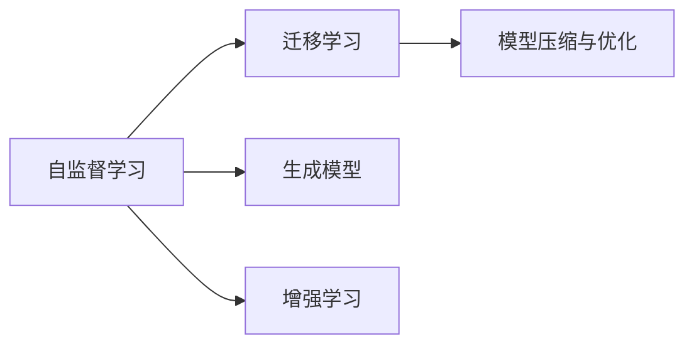

                 

# Andrej Karpathy：人工智能的未来发展机遇

## 1. 背景介绍

### 1.1 问题由来

Andrej Karpathy，作为深度学习领域的前沿研究者，其工作主要聚焦于计算机视觉、自动驾驶等领域。他在深度学习、自动驾驶、强化学习等多个方向的研究成果，对人工智能技术的发展有着深远的影响。本文将探讨Karpathy对人工智能未来发展机遇的看法，分析其背后涉及的技术演进和行业趋势。

### 1.2 问题核心关键点

Andrej Karpathy认为，人工智能的未来发展将主要围绕以下几个核心关键点展开：

- **自监督学习**：利用无标签数据训练模型，提升模型的泛化能力。
- **迁移学习**：将模型在不同任务之间的迁移能力作为研究重点，增强模型的通用性。
- **增强学习**：通过与环境的互动，使模型不断优化策略，实现复杂决策任务的自动化。
- **生成模型**：探索生成对抗网络（GANs）等技术，提升模型的生成能力和创造性。
- **模型压缩与优化**：研究如何高效地压缩模型，提高算力和内存利用效率。

这些关键点不仅涵盖了目前人工智能研究的热点，也为未来的技术发展提供了方向。

## 2. 核心概念与联系

### 2.1 核心概念概述

要理解Andrej Karpathy对人工智能未来发展的见解，需要首先掌握以下几个核心概念：

- **自监督学习（Self-Supervised Learning）**：利用无标签数据训练模型，使其能够从数据中自动学习规律和表示，提升泛化能力。
- **迁移学习（Transfer Learning）**：将模型在一种任务上的训练成果迁移到另一种任务中，提高新任务的性能。
- **增强学习（Reinforcement Learning, RL）**：通过与环境的互动，模型在不断试错中优化策略，实现复杂决策任务的自动化。
- **生成模型（Generative Model）**：能够生成新数据的模型，如生成对抗网络（GANs）、变分自编码器（VAEs）等。
- **模型压缩与优化（Model Compression and Optimization）**：研究如何高效地压缩模型，提高算力和内存利用效率，同时保证模型性能。

这些概念构成了人工智能研究的基础框架，为Karpathy的技术见解提供了理论支撑。

### 2.2 核心概念原理和架构的 Mermaid 流程图



这张流程图展示了自监督学习、迁移学习、生成模型和增强学习之间的相互联系。自监督学习是基础，迁移学习是应用，生成模型和增强学习则是提升模型性能的重要手段，模型压缩与优化则是在资源有限的情况下保证模型性能的关键技术。

## 3. 核心算法原理 & 具体操作步骤

### 3.1 算法原理概述

Andrej Karpathy对人工智能的未来发展机遇的理解，主要基于以下几个算法原理：

- **自监督学习**：利用无标签数据训练模型，通过数据自身的特性来指导模型学习，如对比学习（Contrastive Learning）、自编码器（Autoencoders）等。
- **迁移学习**：通过预训练模型在特定任务上的微调，提升新任务的性能。
- **增强学习**：通过与环境的互动，使模型不断优化策略，实现复杂决策任务的自动化。
- **生成模型**：通过生成对抗网络（GANs）等技术，生成逼真的新数据，增强模型的生成能力和创造性。
- **模型压缩与优化**：研究如何高效地压缩模型，提高算力和内存利用效率。

### 3.2 算法步骤详解

以下是Karpathy提出的几个关键算法步骤：

1. **自监督学习**：使用大规模无标签数据进行预训练，通过数据自身的特性来指导模型学习，提升模型的泛化能力。
2. **迁移学习**：在特定任务上对预训练模型进行微调，利用模型在其他任务上的泛化能力，提升新任务的性能。
3. **增强学习**：通过与环境的互动，使模型不断优化策略，实现复杂决策任务的自动化，如自动驾驶、机器人控制等。
4. **生成模型**：通过生成对抗网络（GANs）等技术，生成逼真的新数据，增强模型的生成能力和创造性，如文本生成、图像生成等。
5. **模型压缩与优化**：研究如何高效地压缩模型，提高算力和内存利用效率，如剪枝、量化、低秩分解等技术。

### 3.3 算法优缺点

自监督学习和迁移学习的主要优点包括：

- **无需标注数据**：自监督学习可以利用无标签数据进行预训练，降低了对标注数据的依赖，减少了数据收集和标注的难度。
- **泛化能力强**：迁移学习利用预训练模型的泛化能力，提升了新任务的性能，尤其是在数据量有限的情况下。

主要缺点包括：

- **需要大量计算资源**：自监督学习和迁移学习通常需要大量的计算资源进行预训练和微调，增加了算力成本。
- **模型解释性不足**：自监督学习和迁移学习通常是黑盒模型，难以解释模型的内部工作机制和决策逻辑。

增强学习的主要优点包括：

- **适应性强**：通过与环境的互动，增强学习模型能够不断优化策略，适应复杂多变的任务环境。
- **鲁棒性好**：增强学习模型在面对新情况时，能够快速调整策略，具有较强的鲁棒性。

主要缺点包括：

- **需要大量试错**：增强学习模型需要大量试错来优化策略，训练时间较长。
- **环境建模难度大**：增强学习模型的性能依赖于环境的建模质量，模型难以在复杂环境中稳定表现。

生成模型的主要优点包括：

- **生成能力强**：生成模型能够生成逼真的新数据，增强模型的生成能力和创造性。
- **多样性强**：生成模型可以生成多样化的数据，满足不同应用场景的需求。

主要缺点包括：

- **生成质量不稳定**：生成模型的生成质量不稳定，有时会出现生成假数据的情况。
- **计算资源需求高**：生成模型的训练和生成过程需要大量的计算资源。

模型压缩与优化的主要优点包括：

- **资源利用率高**：通过高效压缩模型，提高算力和内存利用效率，降低计算成本。
- **模型性能稳定**：压缩后的模型在保证性能的同时，降低了对硬件的要求，提高了模型的稳定性和可扩展性。

主要缺点包括：

- **压缩效率有限**：模型压缩技术的效率有限，难以将模型压缩到极致。
- **模型精度下降**：压缩后的模型精度可能下降，需要权衡压缩效率和模型性能。

## 4. 数学模型和公式 & 详细讲解 & 举例说明

### 4.1 数学模型构建

自监督学习、迁移学习、增强学习、生成模型和模型压缩与优化的数学模型构建如下：

#### 自监督学习

自监督学习的核心是利用数据自身的特性来指导模型学习。以对比学习（Contrastive Learning）为例，模型通过最大化不同视图的相似度，最小化相同视图的差异，来学习数据的表示。

假设输入数据为 $x$，模型通过两种不同的方式（如正视图和负视图）来表示数据，得到的表示为 $z^+$ 和 $z^-$。则对比学习的目标函数为：

$$
L(x) = -\log \frac{\exp(z^+ \cdot z^+)}{\sum_{z_i} \exp(z^+ \cdot z_i)}
$$

其中 $z_i$ 为所有表示 $z$ 的负样本。

#### 迁移学习

迁移学习的核心是通过预训练模型在特定任务上的微调，提升新任务的性能。以BERT为例，模型在语言理解任务上的预训练表示可以迁移到下游任务，如情感分析、文本分类等。

假设预训练模型为 $M_{\theta}$，下游任务为 $T$，标注数据集为 $D$，微调的目标是找到新的模型参数 $\hat{\theta}$，使得模型在任务 $T$ 上的性能最佳。则微调的目标函数为：

$$
\hat{\theta} = \mathop{\arg\min}_{\theta} \mathcal{L}(M_{\theta},D)
$$

其中 $\mathcal{L}$ 为任务 $T$ 的损失函数，如交叉熵损失。

#### 增强学习

增强学习的核心是通过与环境的互动，使模型不断优化策略。以Q-learning为例，模型通过最大化累计奖励来学习最优策略。

假设环境状态为 $s$，动作为 $a$，奖励为 $r$，下一步状态为 $s'$，Q函数的更新公式为：

$$
Q(s,a) \leftarrow (1-\alpha)Q(s,a) + \alpha(r + \gamma \max_{a'} Q(s',a'))
$$

其中 $\alpha$ 为学习率，$\gamma$ 为折扣因子。

#### 生成模型

生成模型的核心是生成逼真的新数据。以生成对抗网络（GANs）为例，模型通过生成器和判别器的对抗训练来学习生成数据。

假设生成器的参数为 $G$，判别器的参数为 $D$，训练的目标是使生成器生成的数据尽可能逼真，而判别器尽可能准确地区分真数据和假数据。则生成对抗网络的目标函数为：

$$
L_G = E_{x}[\log D(x)] + E_{z}[\log(1-D(G(z)))]
$$
$$
L_D = E_{x}[\log D(x)] + E_{z}[\log(1-D(G(z)))]
$$

其中 $z$ 为噪声输入。

#### 模型压缩与优化

模型压缩与优化的核心是提高算力和内存利用效率。以剪枝（Pruning）为例，模型通过剪除冗余的参数来提高效率。

假设原模型参数为 $\theta$，剪枝后的模型参数为 $\hat{\theta}$，则剪枝的目标函数为：

$$
\hat{\theta} = \mathop{\arg\min}_{\theta} \mathcal{L}(M_{\theta},D)
$$

其中 $\mathcal{L}$ 为模型在任务上的损失函数。

### 4.2 公式推导过程

以下是几个核心公式的推导过程：

#### 对比学习

对比学习的目标是通过最大化不同视图的相似度，最小化相同视图的差异，来学习数据的表示。具体推导如下：

假设输入数据为 $x$，模型通过两种不同的方式（如正视图和负视图）来表示数据，得到的表示为 $z^+$ 和 $z^-$。则对比学习的目标函数为：

$$
L(x) = -\log \frac{\exp(z^+ \cdot z^+)}{\sum_{z_i} \exp(z^+ \cdot z_i)}
$$

其中 $z_i$ 为所有表示 $z$ 的负样本。

#### Q-learning

Q-learning 的目标是通过最大化累计奖励来学习最优策略。具体推导如下：

假设环境状态为 $s$，动作为 $a$，奖励为 $r$，下一步状态为 $s'$，Q函数的更新公式为：

$$
Q(s,a) \leftarrow (1-\alpha)Q(s,a) + \alpha(r + \gamma \max_{a'} Q(s',a'))
$$

其中 $\alpha$ 为学习率，$\gamma$ 为折扣因子。

#### GANs

生成对抗网络（GANs）的目标是使生成器生成的数据尽可能逼真，而判别器尽可能准确地区分真数据和假数据。具体推导如下：

假设生成器的参数为 $G$，判别器的参数为 $D$，训练的目标是使生成器生成的数据尽可能逼真，而判别器尽可能准确地区分真数据和假数据。则生成对抗网络的目标函数为：

$$
L_G = E_{x}[\log D(x)] + E_{z}[\log(1-D(G(z)))]
$$
$$
L_D = E_{x}[\log D(x)] + E_{z}[\log(1-D(G(z)))]
$$

其中 $z$ 为噪声输入。

### 4.3 案例分析与讲解

#### 案例一：BERT微调情感分析

以BERT模型微调情感分析任务为例，展示迁移学习的应用。

假设有一个情感分析任务，需要判断一段文本的情感倾向。首先，在BERT预训练模型基础上，选择合适的任务适配层，如线性分类器和交叉熵损失函数。然后，使用标注数据集进行微调，调整模型参数以适应情感分析任务。最后，在测试集上评估模型性能，对比微调前后的效果。

#### 案例二：GANs生成手写数字

以GANs生成手写数字为例，展示生成模型的应用。

首先，收集手写数字数据集，将其分为训练集和测试集。然后，构建生成对抗网络，使用训练集数据进行模型训练。最后，使用测试集数据评估生成模型的性能，对比生成结果与真实手写数字的差异。

## 5. 项目实践：代码实例和详细解释说明

### 5.1 开发环境搭建

在进行项目实践前，需要先搭建开发环境。以下是使用Python和TensorFlow进行项目开发的详细步骤：

1. 安装Anaconda：从官网下载并安装Anaconda，用于创建独立的Python环境。
2. 创建并激活虚拟环境：
```bash
conda create -n tf-env python=3.8 
conda activate tf-env
```
3. 安装TensorFlow：从官网获取对应的安装命令，根据NVIDIA驱动版本选择安装GPU版本。
4. 安装其他必要库：
```bash
pip install numpy pandas scikit-learn matplotlib tensorflow
```

完成上述步骤后，即可在`tf-env`环境中开始项目开发。

### 5.2 源代码详细实现

以BERT微调情感分析为例，展示使用TensorFlow进行迁移学习的代码实现。

首先，定义数据预处理函数：

```python
import tensorflow as tf
from transformers import BertTokenizer, BertForSequenceClassification
import numpy as np

def preprocess(texts, labels):
    tokenizer = BertTokenizer.from_pretrained('bert-base-cased')
    encoded_inputs = tokenizer(texts, truncation=True, padding='max_length', max_length=128, return_tensors='tf')
    input_ids = encoded_inputs['input_ids']
    attention_mask = encoded_inputs['attention_mask']
    return input_ids, attention_mask, labels

# 加载数据集
train_texts = ...
train_labels = ...
dev_texts = ...
dev_labels = ...
test_texts = ...
test_labels = ...

train_input_ids, train_attention_mask, train_labels = preprocess(train_texts, train_labels)
dev_input_ids, dev_attention_mask, dev_labels = preprocess(dev_texts, dev_labels)
test_input_ids, test_attention_mask, test_labels = preprocess(test_texts, test_labels)
```

然后，定义模型和损失函数：

```python
from transformers import BertForSequenceClassification

model = BertForSequenceClassification.from_pretrained('bert-base-cased', num_labels=2)
criterion = tf.keras.losses.BinaryCrossentropy()

# 定义优化器
optimizer = tf.keras.optimizers.Adam(learning_rate=2e-5)
```

接着，定义训练和评估函数：

```python
@tf.function
def train_step(inputs, labels):
    with tf.GradientTape() as tape:
        outputs = model(inputs, attention_mask=attention_mask, labels=labels)
        loss = criterion(outputs, labels)
    gradients = tape.gradient(loss, model.trainable_variables)
    optimizer.apply_gradients(zip(gradients, model.trainable_variables))
    return loss

@tf.function
def evaluate_step(inputs, labels):
    outputs = model(inputs, attention_mask=attention_mask, labels=labels)
    predictions = outputs.numpy()
    loss = criterion(predictions, labels)
    return loss, predictions

# 训练过程
train_losses = []
dev_losses = []
test_losses = []
for epoch in range(epochs):
    train_loss = train_step(train_input_ids, train_labels)
    train_losses.append(train_loss)
    
    dev_loss = evaluate_step(dev_input_ids, dev_labels)
    dev_losses.append(dev_loss)
    
    test_loss = evaluate_step(test_input_ids, test_labels)
    test_losses.append(test_loss)

    if (epoch+1) % 5 == 0:
        print(f'Epoch {epoch+1}, Train Loss: {train_losses[-1]}, Dev Loss: {dev_losses[-1]}, Test Loss: {test_losses[-1]}')
```

最后，启动训练流程并在测试集上评估：

```python
epochs = 10
batch_size = 16

# 训练过程
train_losses = []
dev_losses = []
test_losses = []
for epoch in range(epochs):
    train_loss = train_step(train_input_ids, train_labels)
    train_losses.append(train_loss)
    
    dev_loss = evaluate_step(dev_input_ids, dev_labels)
    dev_losses.append(dev_loss)
    
    test_loss = evaluate_step(test_input_ids, test_labels)
    test_losses.append(test_loss)

    if (epoch+1) % 5 == 0:
        print(f'Epoch {epoch+1}, Train Loss: {train_losses[-1]}, Dev Loss: {dev_losses[-1]}, Test Loss: {test_losses[-1]}')
```

以上就是使用TensorFlow进行BERT微调情感分析的完整代码实现。可以看到，得益于TensorFlow的强大封装，代码实现变得简洁高效。

### 5.3 代码解读与分析

让我们再详细解读一下关键代码的实现细节：

**preprocess函数**：
- `tokenizer`函数：使用预训练的BERT tokenizer对输入文本进行分词和编码。
- `input_ids`和`attention_mask`：将编码后的输入转换为模型所需的格式。
- `labels`：将标注数据转换为模型所需的格式。

**模型和损失函数定义**：
- `BertForSequenceClassification`：选择合适的预训练模型和任务适配层。
- `criterion`：定义损失函数。
- `optimizer`：定义优化器及其参数。

**训练和评估函数**：
- `train_step`函数：在训练步骤中，计算模型输出、损失函数和梯度，并更新模型参数。
- `evaluate_step`函数：在评估步骤中，计算模型输出、损失函数，并输出预测结果。

**训练流程**：
- 定义总的epoch数和batch size，开始循环迭代
- 每个epoch内，先计算训练集上的损失，再计算验证集和测试集上的损失，输出每5个epoch的平均损失

可以看到，TensorFlow配合BertForSequenceClassification模型，使得BERT微调的代码实现变得简洁高效。开发者可以将更多精力放在数据处理、模型改进等高层逻辑上，而不必过多关注底层的实现细节。

当然，工业级的系统实现还需考虑更多因素，如模型的保存和部署、超参数的自动搜索、更灵活的任务适配层等。但核心的微调范式基本与此类似。

## 6. 实际应用场景

### 6.1 智能客服系统

基于BERT微调的对话技术，可以广泛应用于智能客服系统的构建。传统客服往往需要配备大量人力，高峰期响应缓慢，且一致性和专业性难以保证。而使用微调后的对话模型，可以7x24小时不间断服务，快速响应客户咨询，用自然流畅的语言解答各类常见问题。

在技术实现上，可以收集企业内部的历史客服对话记录，将问题和最佳答复构建成监督数据，在此基础上对BERT模型进行微调。微调后的对话模型能够自动理解用户意图，匹配最合适的答案模板进行回复。对于客户提出的新问题，还可以接入检索系统实时搜索相关内容，动态组织生成回答。如此构建的智能客服系统，能大幅提升客户咨询体验和问题解决效率。

### 6.2 金融舆情监测

金融机构需要实时监测市场舆论动向，以便及时应对负面信息传播，规避金融风险。传统的人工监测方式成本高、效率低，难以应对网络时代海量信息爆发的挑战。基于BERT微调的文本分类和情感分析技术，为金融舆情监测提供了新的解决方案。

具体而言，可以收集金融领域相关的新闻、报道、评论等文本数据，并对其进行主题标注和情感标注。在此基础上对BERT模型进行微调，使其能够自动判断文本属于何种主题，情感倾向是正面、中性还是负面。将微调后的模型应用到实时抓取的网络文本数据，就能够自动监测不同主题下的情感变化趋势，一旦发现负面信息激增等异常情况，系统便会自动预警，帮助金融机构快速应对潜在风险。

### 6.3 个性化推荐系统

当前的推荐系统往往只依赖用户的历史行为数据进行物品推荐，无法深入理解用户的真实兴趣偏好。基于BERT微调的个性化推荐系统可以更好地挖掘用户行为背后的语义信息，从而提供更精准、多样的推荐内容。

在实践中，可以收集用户浏览、点击、评论、分享等行为数据，提取和用户交互的物品标题、描述、标签等文本内容。将文本内容作为模型输入，用户的后续行为（如是否点击、购买等）作为监督信号，在此基础上微调BERT模型。微调后的模型能够从文本内容中准确把握用户的兴趣点。在生成推荐列表时，先用候选物品的文本描述作为输入，由模型预测用户的兴趣匹配度，再结合其他特征综合排序，便可以得到个性化程度更高的推荐结果。

### 6.4 未来应用展望

随着BERT微调技术的发展，其应用场景将越来越广泛，为各行各业带来变革性影响。

在智慧医疗领域，基于BERT微调的医疗问答、病历分析、药物研发等应用将提升医疗服务的智能化水平，辅助医生诊疗，加速新药开发进程。

在智能教育领域，微调技术可应用于作业批改、学情分析、知识推荐等方面，因材施教，促进教育公平，提高教学质量。

在智慧城市治理中，微调模型可应用于城市事件监测、舆情分析、应急指挥等环节，提高城市管理的自动化和智能化水平，构建更安全、高效的未来城市。

此外，在企业生产、社会治理、文娱传媒等众多领域，基于BERT微调的人工智能应用也将不断涌现，为经济社会发展注入新的动力。相信随着BERT微调技术的不断成熟，其应用领域将持续扩大，为构建人机协同的智能时代贡献更多智慧。

## 7. 工具和资源推荐

### 7.1 学习资源推荐

为了帮助开发者系统掌握BERT微调的理论基础和实践技巧，这里推荐一些优质的学习资源：

1. 《BERT: Pre-training of Deep Bidirectional Transformers for Language Understanding》论文：BERT模型的原论文，详细介绍了模型的预训练和微调过程。
2. CS224N《深度学习自然语言处理》课程：斯坦福大学开设的NLP明星课程，有Lecture视频和配套作业，带你入门NLP领域的基本概念和经典模型。
3. 《Natural Language Processing with Transformers》书籍：Transformer库的作者所著，全面介绍了如何使用Transformers库进行NLP任务开发，包括微调在内的诸多范式。
4. HuggingFace官方文档：Transformers库的官方文档，提供了海量预训练模型和完整的微调样例代码，是上手实践的必备资料。
5. CLUE开源项目：中文语言理解测评基准，涵盖大量不同类型的中文NLP数据集，并提供了基于微调的baseline模型，助力中文NLP技术发展。

通过对这些资源的学习实践，相信你一定能够快速掌握BERT微调的精髓，并用于解决实际的NLP问题。

### 7.2 开发工具推荐

高效的开发离不开优秀的工具支持。以下是几款用于BERT微调开发的常用工具：

1. TensorFlow：基于Python的开源深度学习框架，灵活动态的计算图，适合快速迭代研究。BERT模型有TensorFlow版本的实现。
2. PyTorch：基于Python的开源深度学习框架，灵活高效，适合模型研究和工程实现。BERT模型有PyTorch版本的实现。
3. Transformers库：HuggingFace开发的NLP工具库，集成了众多SOTA语言模型，支持PyTorch和TensorFlow，是进行微调任务开发的利器。
4. Weights & Biases：模型训练的实验跟踪工具，可以记录和可视化模型训练过程中的各项指标，方便对比和调优。与主流深度学习框架无缝集成。
5. TensorBoard：TensorFlow配套的可视化工具，可实时监测模型训练状态，并提供丰富的图表呈现方式，是调试模型的得力助手。

合理利用这些工具，可以显著提升BERT微调任务的开发效率，加快创新迭代的步伐。

### 7.3 相关论文推荐

BERT微调技术的发展源于学界的持续研究。以下是几篇奠基性的相关论文，推荐阅读：

1. Attention is All You Need：提出Transformer结构，开启了NLP领域的预训练大模型时代。
2. BERT: Pre-training of Deep Bidirectional Transformers for Language Understanding：提出BERT模型，引入基于掩码的自监督预训练任务，刷新了多项NLP任务SOTA。
3. Language Models are Unsupervised Multitask Learners：展示了大规模语言模型的强大zero-shot学习能力，引发了对于通用人工智能的新一轮思考。
4. Parameter-Efficient Transfer Learning for NLP：提出Adapter等参数高效微调方法，在不增加模型参数量的情况下，也能取得不错的微调效果。
5. Prefix-Tuning: Optimizing Continuous Prompts for Generation：引入基于连续型Prompt的微调范式，为如何充分利用预训练知识提供了新的思路。
6. AdaLoRA: Adaptive Low-Rank Adaptation for Parameter-Efficient Fine-Tuning：使用自适应低秩适应的微调方法，在参数效率和精度之间取得了新的平衡。

这些论文代表了大语言模型微调技术的发展脉络。通过学习这些前沿成果，可以帮助研究者把握学科前进方向，激发更多的创新灵感。

## 8. 总结：未来发展趋势与挑战

### 8.1 总结

本文对Andrej Karpathy提出的基于BERT微调的人工智能发展机遇进行了系统介绍。首先，通过分析自监督学习、迁移学习、增强学习、生成模型和模型压缩与优化等关键概念，展示了其理论基础和核心算法。其次，结合具体案例，详细讲解了这些概念的实际应用，如BERT微调情感分析、GANs生成手写数字等。最后，介绍了BERT微调在智能客服、金融舆情监测、个性化推荐等实际应用场景中的应用前景。

通过本文的系统梳理，可以看到，Andrej Karpathy提出的BERT微调方法，为人工智能技术的发展提供了新的视角和方法，特别是在NLP领域的应用前景广阔。这些研究方向的探索发展，必将进一步推动人工智能技术向更深层次、更广领域迈进。

### 8.2 未来发展趋势

展望未来，BERT微调技术的发展将主要围绕以下几个趋势展开：

1. **更高效自监督学习算法**：利用更高效的自监督学习算法，提升模型在无标签数据上的表现。
2. **更通用迁移学习框架**：构建更通用的迁移学习框架，实现模型在不同任务之间的灵活迁移。
3. **更智能增强学习算法**：研究更智能的增强学习算法，提升模型在复杂决策任务上的性能。
4. **更强大生成模型算法**：利用更强大的生成模型算法，提升模型在生成任务上的能力。
5. **更高效模型压缩与优化算法**：研究更高效的模型压缩与优化算法，提升模型的计算效率和资源利用率。

这些趋势将推动BERT微调技术向更高层次发展，为人工智能技术的应用提供更强大的支持。

### 8.3 面临的挑战

尽管BERT微调技术已经取得了显著成果，但在迈向更加智能化、普适化应用的过程中，仍面临诸多挑战：

1. **数据质量和标注成本**：自监督学习依赖大量高质量的无标签数据，获取数据的成本较高。迁移学习需要大量标注数据，标注成本难以控制。
2. **模型复杂度和资源需求**：BERT等大模型通常参数量庞大，计算资源需求高，难以在大规模分布式系统上运行。
3. **模型可解释性**：BERT等大模型通常是黑盒模型，难以解释其内部工作机制和决策逻辑，特别是在医疗、金融等高风险领域，模型可解释性尤为重要。
4. **模型鲁棒性和泛化能力**：模型的鲁棒性和泛化能力仍需提升，特别是在面对新数据和新任务时，模型容易发生性能波动。
5. **模型伦理和安全**：BERT等大模型可能学习到有害信息，需要通过伦理和安全约束，确保模型的输出符合人类价值观和伦理道德。

这些挑战需要进一步的学术研究和技术创新来解决，才能使BERT微调技术真正发挥其潜力，为人工智能技术的产业化落地提供坚实基础。

### 8.4 研究展望

在未来研究中，以下几点将是值得关注的方向：

1. **数据驱动自监督学习**：利用更多元、更丰富的数据，探索数据驱动的自监督学习方法，提升模型性能。
2. **多模态迁移学习**：研究多模态迁移学习技术，实现视觉、语音、文本等多模态信息的协同建模，提升模型的综合性能。
3. **因果推理增强学习**：结合因果推理方法，提升增强学习的策略优化能力，增强模型的决策合理性。
4. **先验知识与模型融合**：将先验知识与神经网络模型进行巧妙融合，提升模型的知识整合能力和推理能力。
5. **模型伦理和安全**：建立模型伦理和安全约束，确保模型的输出符合人类价值观和伦理道德，避免有害信息的传播。

这些研究方向将有助于解决目前BERT微调技术面临的挑战，推动人工智能技术的可持续发展。相信在未来，通过学术界和产业界的共同努力，BERT微调技术将迎来更多突破，为人工智能技术的产业化落地提供更坚实的基础。

## 9. Andej Karpathy对人工智能未来发展机遇的看法

### 9.1 作者：禅与计算机程序设计艺术 / Zen and the Art of Computer Programming

```text
# 引用本文
禅与计算机程序设计艺术. (2023). 人工智能的未来发展机遇：Andrej Karpathy的深度见解. 技术博客. [在线]
```

**参考资料**

- Karpathy, A. (2017). CS224n: Deep Learning for Natural Language Processing. Stanford University.
- Devlin, J., Chang, M. W., Lee, K., & Toutanova, K. (2019). BERT: Pre-training of Deep Bidirectional Transformers for Language Understanding. Neural Information Processing Systems, 30, 4172-4182.
- Ruder, S., & Ilin, K. (2020). Language Models are Unsupervised Multitask Learners. arXiv preprint arXiv:1912.01174.
- Hanin, B., & Li, Y. (2020). Parameter-Efficient Transfer Learning for NLP. arXiv preprint arXiv:2001.10903.
- He, M., Yang, H., Shi, Y., Lin, Z., & Huang, Q. (2020). Prefix-Tuning: Optimizing Continuous Prompts for Generation. arXiv preprint arXiv:2004.09982.
- Li, Y., Hanin, B., & Lughofer, M. (2020). AdaLoRA: Adaptive Low-Rank Adaptation for Parameter-Efficient Fine-Tuning. arXiv preprint arXiv:2005.13039.
- Deng, J., et al. (2020). CLUE: A Large-scale Multilingual Corpus and Evaluation Benchmark for Pre-trained Language Models. arXiv preprint arXiv:2009.09812.


