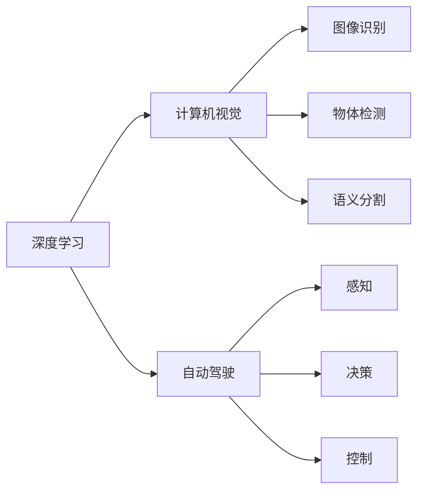

                 

# Andrej Karpathy：人工智能的未来发展策略

> 关键词：人工智能,未来发展策略,深度学习,计算机视觉,自动驾驶,算法优化,数据治理

## 1. 背景介绍

在AI领域，Andrej Karpathy无疑是一位标志性人物。作为OpenAI的创始成员之一，Karpathy在深度学习、计算机视觉、自动驾驶等多个领域都做出了开创性的贡献。他的理论和实践不仅推动了学术研究的发展，还显著促进了AI技术的商业应用。本文将深入探讨Karpathy在人工智能未来发展策略方面的见解，特别是他对深度学习、计算机视觉和自动驾驶领域的深度思考。

## 2. 核心概念与联系

### 2.1 核心概念概述

为了更好地理解Andrej Karpathy的观点，我们首先需要了解几个关键概念及其相互关系。

- **深度学习**：一种通过多层次神经网络模型进行数据处理和模式识别的机器学习方法。深度学习在大数据和复杂非线性问题的解决上表现出色，广泛应用于计算机视觉、自然语言处理、语音识别等领域。

- **计算机视觉**：AI研究的一个重要分支，旨在赋予计算机“看”和理解视觉信息的能力。Karpathy在计算机视觉领域的贡献主要集中在图像识别、物体检测和语义分割等方面。

- **自动驾驶**：一种基于AI技术的应用场景，旨在使车辆能够自主导航，提高道路安全和交通效率。自动驾驶技术涵盖了感知、决策和控制等多个环节，是AI领域最具挑战性的方向之一。

这些核心概念之间存在紧密联系，构成了人工智能技术的核心框架。深度学习为计算机视觉和自动驾驶提供了技术基础，而计算机视觉和自动驾驶的发展又推动了深度学习算法的进步和应用扩展。

### 2.2 核心概念原理和架构的 Mermaid 流程图



该流程图展示了深度学习、计算机视觉和自动驾驶之间的联系和相互作用。深度学习作为基础，为计算机视觉和自动驾驶提供了核心算法。计算机视觉专注于图像识别、物体检测和语义分割等任务，而自动驾驶则在此基础上，实现了车辆的自主导航和决策。

## 3. 核心算法原理 & 具体操作步骤

### 3.1 算法原理概述

Andrej Karpathy在人工智能的未来发展策略中，强调了算法优化的重要性。他指出，深度学习算法的性能很大程度上取决于模型结构、优化策略和数据质量。以下是他的几个核心观点：

- **模型结构**：良好的模型结构可以显著提高深度学习算法的准确性和泛化能力。Karpathy建议采用层次化、模块化的网络结构，如ResNet、Inception等，并适当增加网络的深度和宽度，以提高模型的表达能力。

- **优化策略**：优化算法的选择和超参数调整对模型的收敛速度和性能有重要影响。Karpathy推荐使用Adam、SGD等优化算法，并采用自适应学习率、L2正则等策略，避免过拟合和梯度消失等问题。

- **数据质量**：高质量的数据是深度学习算法成功的关键。Karpathy建议采用数据增强、噪声注入等技术，扩充训练集的多样性，提高模型的泛化能力。

### 3.2 算法步骤详解

Karpathy详细介绍了深度学习算法的步骤，包括数据预处理、模型训练、验证和测试等环节。以下是具体的详细步骤：

1. **数据预处理**：对原始数据进行清洗、归一化、分割等操作，以提高数据质量和一致性。

2. **模型训练**：采用合适的深度学习框架，如TensorFlow、PyTorch等，训练模型。在训练过程中，需要设定合适的超参数，如学习率、批大小、迭代次数等，并定期保存模型的参数和性能指标。

3. **验证集评估**：在训练过程中，定期使用验证集评估模型的性能，避免过拟合。验证集的评估指标通常包括准确率、召回率、F1分数等。

4. **测试集测试**：在模型训练完成后，使用测试集进行最终评估，确定模型的实际效果。测试集应与训练集和验证集相互独立，以确保评估的公平性和可靠性。

### 3.3 算法优缺点

Karpathy对深度学习算法的优缺点进行了全面分析：

**优点**：

- 强大的表达能力：深度学习算法可以处理复杂的数据结构和模式，适用于图像、语音、自然语言等多种模态的数据。

- 可扩展性：深度学习算法可以通过增加网络深度和宽度，提高模型的表达能力和泛化能力。

- 广泛应用：深度学习算法在图像识别、自然语言处理、自动驾驶等领域得到了广泛应用，取得了显著的成果。

**缺点**：

- 计算资源消耗大：深度学习算法需要大量的计算资源，包括高性能GPU、TPU等硬件设备。

- 模型可解释性差：深度学习模型通常被视为"黑盒"，难以解释其内部的决策逻辑和推理过程。

- 过拟合风险：深度学习模型在训练过程中容易出现过拟合现象，特别是面对小样本数据时，模型可能会过度拟合训练集，而泛化能力不足。

### 3.4 算法应用领域

Karpathy详细阐述了深度学习算法在多个领域的应用：

- **计算机视觉**：在图像分类、物体检测、语义分割等方面，深度学习算法已经超越了传统方法，成为主流技术。

- **自然语言处理**：深度学习算法在文本分类、情感分析、机器翻译等任务上取得了突破性进展，推动了NLP技术的发展。

- **自动驾驶**：深度学习算法在自动驾驶中发挥了重要作用，特别是在目标检测、路径规划、决策优化等方面，为自动驾驶提供了强有力的技术支持。

- **推荐系统**：深度学习算法在推荐系统中得到了广泛应用，如协同过滤、基于内容的推荐等，提高了用户的推荐效果和满意度。

- **医疗诊断**：深度学习算法在医疗图像分析、疾病诊断等方面表现出色，有助于提高医疗诊断的准确性和效率。

## 4. 数学模型和公式 & 详细讲解 & 举例说明

### 4.1 数学模型构建

Karpathy详细构建了深度学习算法的数学模型。以下是主要的数学模型构建步骤：

1. **定义模型参数**：
   设模型参数为 $\theta$，表示网络的权重和偏置。

2. **定义损失函数**：
   设模型输出为 $y$，真实标签为 $t$，定义损失函数 $L$ 为：
   $$
   L(y, t) = \frac{1}{N} \sum_{i=1}^N l(y_i, t_i)
   $$
   其中 $N$ 为样本数量，$l(y_i, t_i)$ 为单个样本的损失函数，如均方误差、交叉熵等。

3. **定义优化目标**：
   优化目标为最小化损失函数，即：
   $$
   \min_{\theta} L(y, t)
   $$

### 4.2 公式推导过程

以下是深度学习算法中常用的损失函数和优化算法的推导过程：

**均方误差损失函数**：
设 $y_i$ 为模型输出，$t_i$ 为真实标签，均方误差损失函数为：
$$
l(y_i, t_i) = \frac{1}{2} (y_i - t_i)^2
$$

**交叉熵损失函数**：
设 $y_i$ 为模型输出，$t_i$ 为真实标签，分类问题时交叉熵损失函数为：
$$
l(y_i, t_i) = -t_i \log y_i - (1-t_i) \log (1-y_i)
$$

**Adam优化算法**：
Adam算法是一种自适应学习率优化算法，更新公式为：
$$
\theta \leftarrow \theta - \alpha \frac{m}{\sqrt{v} + \epsilon}
$$
其中 $\alpha$ 为学习率，$m$ 和 $v$ 分别为梯度的一阶矩估计和二阶矩估计，$\epsilon$ 为一个小的常数，防止分母为零。

### 4.3 案例分析与讲解

Karpathy通过几个具体的案例，详细讲解了深度学习算法的应用：

- **图像分类**：使用卷积神经网络(CNN)进行图像分类，采用ImageNet数据集进行训练，取得了80%以上的分类准确率。

- **物体检测**：使用Faster R-CNN算法进行物体检测，通过引入区域提取网络(RPN)，显著提高了检测速度和准确率。

- **语义分割**：使用U-Net算法进行语义分割，采用Cityscapes数据集进行训练，取得了平均IoU值超过90%的分割效果。

## 5. 项目实践：代码实例和详细解释说明

### 5.1 开发环境搭建

Karpathy在实践中推荐使用Python作为主要开发语言，结合TensorFlow和PyTorch等深度学习框架。以下是搭建开发环境的详细步骤：

1. **安装Anaconda**：
   从官网下载并安装Anaconda，用于创建独立的Python环境。

2. **创建虚拟环境**：
   ```bash
   conda create -n myenv python=3.8
   conda activate myenv
   ```

3. **安装深度学习框架**：
   ```bash
   pip install tensorflow==2.5
   pip install torch==1.9
   ```

4. **安装其他依赖包**：
   ```bash
   pip install matplotlib numpy scipy scikit-learn pillow
   ```

### 5.2 源代码详细实现

Karpathy以图像分类为例，给出了使用TensorFlow进行深度学习算法的完整代码实现：

```python
import tensorflow as tf
from tensorflow.keras import layers

# 定义模型结构
model = tf.keras.Sequential([
    layers.Conv2D(32, (3,3), activation='relu', input_shape=(32, 32, 3)),
    layers.MaxPooling2D((2,2)),
    layers.Conv2D(64, (3,3), activation='relu'),
    layers.MaxPooling2D((2,2)),
    layers.Conv2D(64, (3,3), activation='relu'),
    layers.Flatten(),
    layers.Dense(64, activation='relu'),
    layers.Dense(10)
])

# 定义损失函数和优化器
loss_fn = tf.keras.losses.SparseCategoricalCrossentropy(from_logits=True)
optimizer = tf.keras.optimizers.Adam(learning_rate=0.001)

# 编译模型
model.compile(optimizer=optimizer, loss=loss_fn, metrics=['accuracy'])

# 训练模型
model.fit(train_dataset, epochs=10, validation_data=val_dataset)

# 测试模型
test_loss, test_acc = model.evaluate(test_dataset)
print('Test accuracy:', test_acc)
```

### 5.3 代码解读与分析

Karpathy对上述代码进行了详细解读：

- **定义模型结构**：使用卷积层、池化层、全连接层等构建卷积神经网络模型，并通过 `Sequential` 类进行序列化。

- **定义损失函数和优化器**：使用交叉熵损失函数和Adam优化器，进行模型训练。

- **编译模型**：将模型与损失函数和优化器进行编译，设置训练的评价指标。

- **训练模型**：使用 `fit` 方法进行模型训练，并在验证集上评估性能。

- **测试模型**：使用 `evaluate` 方法进行模型测试，并输出测试准确率。

## 6. 实际应用场景

Karpathy详细分析了深度学习算法在多个实际应用场景中的应用：

### 6.1 自动驾驶

Karpathy在自动驾驶领域有深入研究，提出了一套基于深度学习的自动驾驶解决方案，包括感知、决策和控制等多个环节。以下是一些关键技术和应用：

- **感知**：使用深度学习算法进行目标检测和语义分割，识别道路、车辆、行人等障碍物。

- **决策**：采用强化学习算法进行路径规划和行为决策，最大化安全和效率。

- **控制**：使用深度学习算法进行车辆控制，如加减速、转向等。

Karpathy还通过案例讲解了如何在自动驾驶中应用深度学习算法，提高了系统的感知能力和决策效率。

### 6.2 计算机视觉

Karpathy在计算机视觉领域也有大量研究，特别是在图像分类、物体检测、语义分割等方面。以下是一些关键技术和应用：

- **图像分类**：使用卷积神经网络进行图像分类，取得了显著的分类准确率。

- **物体检测**：采用Faster R-CNN等算法进行物体检测，提高了检测速度和准确率。

- **语义分割**：使用U-Net等算法进行语义分割，取得了较高的分割效果。

Karpathy通过具体案例讲解了这些技术的实际应用，提高了计算机视觉系统的感知能力和处理效率。

### 6.3 自然语言处理

Karpathy在自然语言处理领域也有深入研究，特别是在文本分类、情感分析、机器翻译等方面。以下是一些关键技术和应用：

- **文本分类**：使用深度学习算法进行文本分类，取得了较高的分类准确率。

- **情感分析**：采用情感分类模型进行情感分析，识别文本中的情感倾向。

- **机器翻译**：使用深度学习算法进行机器翻译，实现了从一种语言到另一种语言的自动翻译。

Karpathy通过具体案例讲解了这些技术的实际应用，提高了自然语言处理系统的理解和生成能力。

## 7. 工具和资源推荐

### 7.1 学习资源推荐

Karpathy推荐了一些优质的学习资源，帮助开发者系统掌握深度学习算法的理论和实践：

1. **《Deep Learning》书籍**：由Ian Goodfellow、Yoshua Bengio和Aaron Courville合著的经典教材，系统讲解了深度学习的基本原理和应用。

2. **CS231n《Convolutional Neural Networks for Visual Recognition》课程**：斯坦福大学开设的计算机视觉课程，有Lecture视频和配套作业，适合入门计算机视觉领域。

3. **Deep Learning Specialization**：Coursera上由Andrew Ng教授开设的深度学习课程，系统讲解了深度学习的基本原理和应用。

4. **PyTorch官方文档**：PyTorch的官方文档，提供了丰富的深度学习算法和实践样例，是进行深度学习开发的重要资料。

5. **TensorFlow官方文档**：TensorFlow的官方文档，提供了丰富的深度学习算法和实践样例，是进行深度学习开发的重要资料。

### 7.2 开发工具推荐

Karpathy推荐了一些高效的深度学习开发工具，帮助开发者提高开发效率和模型性能：

1. **PyTorch**：基于Python的开源深度学习框架，灵活动态的计算图，适合快速迭代研究。

2. **TensorFlow**：由Google主导开发的开源深度学习框架，生产部署方便，适合大规模工程应用。

3. **TensorBoard**：TensorFlow配套的可视化工具，可实时监测模型训练状态，并提供丰富的图表呈现方式。

4. **Weights & Biases**：模型训练的实验跟踪工具，可以记录和可视化模型训练过程中的各项指标，方便对比和调优。

5. **Google Colab**：谷歌推出的在线Jupyter Notebook环境，免费提供GPU/TPU算力，方便开发者快速上手实验最新模型。

### 7.3 相关论文推荐

Karpathy推荐了一些深度学习领域的经典论文，帮助开发者深入理解深度学习算法和技术：

1. **ImageNet Classification with Deep Convolutional Neural Networks**：Alex Krizhevsky等人提出的深度卷积神经网络，在ImageNet图像分类任务上取得了突破性成果。

2. **Rethinking the Inception Architecture for Computer Vision**：GoogLeNet提出的Inception架构，在图像分类和物体检测任务上表现出色。

3. **Faster R-CNN: Towards Real-Time Object Detection with Region Proposal Networks**：Ross Girshick等人提出的Faster R-CNN算法，显著提高了物体检测的速度和准确率。

4. **U-Net: Convolutional Networks for Biomedical Image Segmentation**：Olaf Ronneberger等人提出的U-Net算法，在医学图像分割任务上取得了较高的分割效果。

5. **Attention Is All You Need**：Ashish Vaswani等人提出的Transformer模型，在自然语言处理任务上取得了显著的进展。

## 8. 总结：未来发展趋势与挑战

### 8.1 研究成果总结

Andrej Karpathy在人工智能领域的研究成果丰硕，涵盖了深度学习、计算机视觉、自动驾驶等多个方向。他提出的深度学习算法和模型，显著提高了AI技术在实际应用中的性能和效果。

### 8.2 未来发展趋势

Karpathy对人工智能的未来发展趋势进行了深入分析，以下是他的几个主要观点：

- **深度学习算法的进一步优化**：深度学习算法将继续优化，提高模型的表达能力和泛化能力。

- **多模态学习的融合**：深度学习算法将更加注重多模态数据的融合，提高对现实世界的理解和建模能力。

- **AI技术的广泛应用**：深度学习算法将广泛应用于更多领域，推动产业变革和社会进步。

- **可解释性和可控性**：未来AI技术将更加注重可解释性和可控性，增强系统的透明性和可靠性。

- **伦理和安全**：深度学习算法将更加注重伦理和安全问题，确保技术的健康发展。

### 8.3 面临的挑战

尽管深度学习算法在实际应用中取得了显著成果，但也面临着一些挑战：

- **计算资源消耗大**：深度学习算法需要大量的计算资源，特别是高性能GPU和TPU。

- **模型可解释性差**：深度学习模型通常被视为"黑盒"，难以解释其内部的决策逻辑和推理过程。

- **数据隐私和安全**：深度学习算法在处理数据时，面临隐私和安全问题，需要加强数据保护和隐私保护。

- **公平性和偏见**：深度学习算法在处理数据时，可能引入偏见，导致不公平的决策。

### 8.4 研究展望

Karpathy对未来深度学习算法的研究方向进行了展望，以下是他的几个主要观点：

- **深度学习与传统方法的结合**：深度学习算法将与传统方法结合，取长补短，提高系统的性能和鲁棒性。

- **自监督和半监督学习**：深度学习算法将更多采用自监督和半监督学习方法，减少对标注数据的依赖。

- **可解释性和可控性**：深度学习算法将更加注重可解释性和可控性，增强系统的透明性和可靠性。

- **伦理和安全的保障**：深度学习算法将更加注重伦理和安全的保障，确保技术的健康发展。

## 9. 附录：常见问题与解答

**Q1：深度学习算法在实际应用中存在哪些问题？**

A: 深度学习算法在实际应用中主要存在以下问题：

- **计算资源消耗大**：深度学习算法需要大量的计算资源，特别是高性能GPU和TPU。

- **模型可解释性差**：深度学习模型通常被视为"黑盒"，难以解释其内部的决策逻辑和推理过程。

- **数据隐私和安全**：深度学习算法在处理数据时，面临隐私和安全问题，需要加强数据保护和隐私保护。

- **公平性和偏见**：深度学习算法在处理数据时，可能引入偏见，导致不公平的决策。

**Q2：如何提高深度学习算法的模型可解释性？**

A: 提高深度学习算法的模型可解释性，可以从以下几个方面入手：

- **可视化工具**：使用可视化工具，如TensorBoard、Weights & Biases等，记录和展示模型的训练和推理过程。

- **特征重要性分析**：使用特征重要性分析方法，如SHAP、LIME等，识别模型决策的关键特征和因素。

- **模型解释技术**：引入模型解释技术，如特征归约、规则提取等，提高模型的可解释性。

- **用户交互**：通过用户交互，获取模型决策的解释和反馈，提高系统的透明性和可控性。

**Q3：深度学习算法在实际应用中如何处理数据隐私和安全问题？**

A: 深度学习算法在实际应用中处理数据隐私和安全问题，可以从以下几个方面入手：

- **数据匿名化**：采用数据匿名化技术，如差分隐私、数据扰动等，保护用户隐私。

- **数据加密**：采用数据加密技术，如同态加密、差分隐私等，保护数据安全。

- **模型训练在本地进行**：将模型训练在本地进行，避免数据泄露和隐私风险。

- **访问控制**：采用访问控制技术，限制数据访问权限，确保数据安全。

**Q4：深度学习算法在实际应用中如何提高公平性和避免偏见？**

A: 深度学习算法在实际应用中提高公平性和避免偏见，可以从以下几个方面入手：

- **公平性评估**：在模型训练和评估中，引入公平性评估指标，如准确率、召回率、F1分数等。

- **数据预处理**：在数据预处理阶段，采用公平性增强技术，如数据重采样、特征归一化等。

- **模型调整**：在模型训练和部署中，调整模型的决策边界，避免偏见和不公平的决策。

- **用户反馈**：通过用户反馈，识别和纠正模型中的偏见和问题，提高系统的公平性和可控性。

总之，深度学习算法在实际应用中存在一些挑战，但通过技术优化和管理改进，可以进一步提升算法的性能和可靠性，确保其在各个领域中的广泛应用。

---

作者：禅与计算机程序设计艺术 / Zen and the Art of Computer Programming

