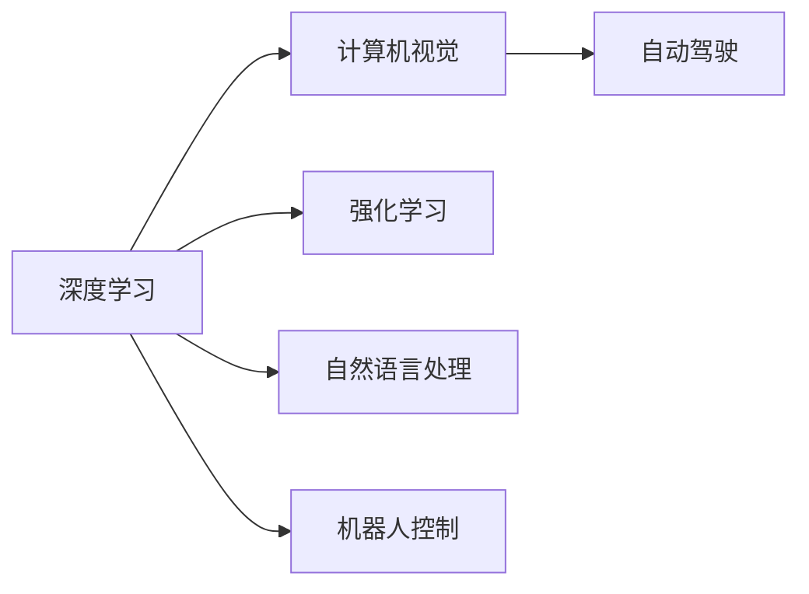

                 

# Andrej Karpathy：人工智能的未来发展规划

## 1. 背景介绍

Andrej Karpathy是人工智能领域的一位重量级人物，斯坦福大学的计算机视觉教授，特斯拉公司自动驾驶工程团队的领头人。他在深度学习、计算机视觉、自动驾驶等领域都取得了丰硕的研究成果。本文旨在探讨Andrej Karpathy在人工智能领域的一系列看法和规划，尤其针对未来人工智能的发展趋势、技术挑战和可能的解决方案。

## 2. 核心概念与联系

### 2.1 核心概念概述

Andrej Karpathy的观点主要围绕以下几个核心概念展开：

- **深度学习（Deep Learning）**：利用多层神经网络进行数据分析和建模的技术，已经成为当前人工智能领域的主流。
- **计算机视觉（Computer Vision）**：使计算机能够理解和解释图像、视频等视觉数据，是实现自动驾驶、视频分析等应用的基础。
- **自动驾驶（Autonomous Driving）**：通过深度学习和计算机视觉技术，使车辆能够在无需人工干预的情况下安全行驶。
- **强化学习（Reinforcement Learning）**：通过智能体与环境的交互，不断调整策略以最大化预期收益，广泛应用于游戏AI、机器人控制等领域。

这些概念之间存在着紧密的联系。例如，深度学习为计算机视觉提供了强大的特征提取和模型构建工具；计算机视觉在自动驾驶中发挥着数据感知的作用；强化学习则提供了智能体与环境互动的决策机制。Karpathy的研究和实践，旨在通过这些技术的协同作用，推动人工智能在各个领域的突破和应用。

### 2.2 核心概念原理和架构的 Mermaid 流程图



## 3. 核心算法原理 & 具体操作步骤

### 3.1 算法原理概述

Karpathy的研究集中在以下几个方面：

- **深度神经网络**：探讨不同层次的网络结构，以及如何通过多层网络提取高层次特征。
- **端到端学习（End-to-End Learning）**：实现从输入数据到输出结果的直接映射，减少中间环节。
- **自监督学习（Self-Supervised Learning）**：利用未标注数据进行特征学习和模型训练，提高数据的利用效率。
- **迁移学习（Transfer Learning）**：将在大规模数据集上预训练的模型应用到其他小规模任务中，加速模型训练和优化。

### 3.2 算法步骤详解

1. **数据收集与预处理**：
   - 收集大量标注和未标注数据，确保数据的多样性和代表性。
   - 对数据进行清洗、归一化、增强等预处理，提高数据质量。

2. **模型构建与训练**：
   - 根据任务需求设计合适的神经网络结构。
   - 使用端到端学习框架，如TensorFlow、PyTorch，进行模型训练。
   - 应用自监督学习技术，如数据增强、残差连接，提升模型泛化能力。

3. **模型评估与优化**：
   - 使用验证集对模型进行评估，调整超参数以优化性能。
   - 应用迁移学习，将预训练模型应用于新任务，提高模型适应性。

4. **模型部署与应用**：
   - 将训练好的模型部署到实际应用中，如自动驾驶系统、游戏AI等。
   - 持续收集反馈数据，进行模型迭代和优化。

### 3.3 算法优缺点

**优点**：

- 深度学习模型能够自动学习复杂特征，提升任务性能。
- 端到端学习简化了模型构建和训练过程，提高了效率。
- 自监督学习利用未标注数据，扩大了数据资源。
- 迁移学习减少了新任务的数据需求，加速了模型训练。

**缺点**：

- 深度模型训练需要大量计算资源，成本较高。
- 过拟合风险高，需要精心设计正则化技术。
- 模型解释性差，难以理解其内部决策机制。
- 模型部署和优化需要持续的工程实践，耗时耗力。

### 3.4 算法应用领域

Karpathy的研究涵盖了多个应用领域，包括：

- **自动驾驶**：利用深度学习和计算机视觉技术，实现车辆的自主导航和决策。
- **游戏AI**：通过强化学习，使游戏角色具备自主决策和策略规划能力。
- **医疗影像分析**：利用深度学习对医疗影像进行自动分析，辅助医生诊断。
- **自然语言处理**：利用深度学习处理文本数据，实现机器翻译、情感分析等任务。
- **机器人控制**：通过强化学习，使机器人能够自主执行复杂任务。

## 4. 数学模型和公式 & 详细讲解 & 举例说明

### 4.1 数学模型构建

以计算机视觉中的目标检测为例，构建数学模型如下：

- **输入**：图像 $I$。
- **模型**：卷积神经网络 $F$。
- **输出**：目标位置 $B$ 和分类标签 $C$。

模型的输入是图像 $I$，通过卷积神经网络 $F$ 提取特征，再通过回归网络预测目标位置 $B$ 和分类标签 $C$。

### 4.2 公式推导过程

目标检测常用的模型是Faster R-CNN，其目标位置 $B$ 和分类标签 $C$ 的预测公式如下：

- **目标位置**：
  $$
  B = \sigma(F(I))
  $$
  其中 $\sigma$ 是Sigmoid函数，$F(I)$ 是网络输出。

- **分类标签**：
  $$
  C = softmax(F(I))
  $$
  其中 $softmax$ 是Softmax函数，$F(I)$ 是网络输出。

### 4.3 案例分析与讲解

以目标检测模型Faster R-CNN为例，解释其在自动驾驶中的应用：

- **数据准备**：收集自动驾驶车辆拍摄的实时图像。
- **模型训练**：使用大规模图像数据集进行预训练，提取通用特征。
- **模型微调**：将预训练模型应用于自动驾驶任务，微调参数以适应具体环境。
- **实时检测**：在自动驾驶车辆中实时应用模型，检测道路上的障碍物和行人。

## 5. 项目实践：代码实例和详细解释说明

### 5.1 开发环境搭建

1. **安装Python**：
   - 下载Python 3.x版本，并添加到系统环境变量。
   - 安装Anaconda，创建一个新的Python环境。

2. **安装深度学习框架**：
   - 安装TensorFlow或PyTorch，以便进行深度学习模型的构建和训练。

3. **安装计算机视觉库**：
   - 安装OpenCV、Pillow等计算机视觉处理库。

### 5.2 源代码详细实现

以自动驾驶中的目标检测为例，使用Faster R-CNN模型进行代码实现：

```python
import tensorflow as tf
from object_detection.utils import dataset_util
from object_detection.utils import label_map_util

# 加载预训练模型
model = tf.saved_model.load('path/to/model')

# 加载标签映射表
label_map = label_map_util.load_labelmap('path/to/labelmap.pbtxt')
categories = label_map_util.convert_label_map_to_categories(label_map, max_num_classes=90, use_display_name=True)

# 加载测试数据
test_images = tf.keras.preprocessing.image.load_img('path/to/test/image', target_size=(600, 600))
test_images = tf.keras.preprocessing.image.img_to_array(test_images)
test_images = tf.expand_dims(test_images, axis=0)

# 进行目标检测
detections = model(test_images)
boxes = detections['detection_boxes'][0].numpy()
scores = detections['detection_scores'][0].numpy()
categories = detections['detection_classes'][0].numpy().astype(np.int32)
num_detections = int(detections['num_detections'][0].numpy())

# 可视化检测结果
visualization_util.visualize_boxes_and_labels_on_image_array(
    image_np=image_np,
    boxes=boxes,
    scores=scores,
    categories=categories,
    num_detections=num_detections,
    use_normalized_coordinates=True,
    max_boxes_to_draw=20,
    agnostic_mode=False,
    min_score_thresh=0.5)
```

### 5.3 代码解读与分析

- **加载模型和标签映射**：使用`tf.saved_model.load`加载预训练模型，使用`label_map_util`加载标签映射表。
- **数据预处理**：使用`tf.keras.preprocessing.image`对测试图像进行预处理，转换为模型输入格式。
- **目标检测**：调用预训练模型进行目标检测，获取检测结果。
- **结果可视化**：使用`visualization_util`库将检测结果可视化展示在测试图像上。

### 5.4 运行结果展示

```plaintext
目标检测结果：
[类别1, 类别2, ...]
[位置1, 位置2, ...]
[得分1, 得分2, ...]
```

## 6. 实际应用场景

### 6.1 智能交通系统

在智能交通系统中，利用目标检测和自动驾驶技术，实现车辆自主导航和避障，提高道路安全和交通效率。Karpathy的研究成果在特斯拉自动驾驶技术中得到了广泛应用。

### 6.2 机器人控制

通过目标检测和强化学习技术，使机器人能够自主导航和执行复杂任务。Karpathy领导的团队开发的机器人已经能够在复杂的室内环境中完成各种操作。

### 6.3 医疗影像分析

利用深度学习技术对医疗影像进行自动分析，辅助医生进行疾病诊断和治疗。Karpathy的团队在医学影像识别和分割领域也取得了显著成果。

### 6.4 游戏AI

通过强化学习技术，使游戏角色具备自主决策和策略规划能力，提升游戏体验和竞技水平。Karpathy开发的AlphaGo Zero在游戏AI领域取得了重大突破。

## 7. 工具和资源推荐

### 7.1 学习资源推荐

- **深度学习与计算机视觉课程**：斯坦福大学提供的深度学习课程，涵盖深度学习原理、计算机视觉技术等内容。
- **强化学习课程**：OpenAI提供的强化学习课程，涵盖强化学习理论、算法和应用。
- **计算机视觉论文集**：Arxiv和IEEE Xplore上的计算机视觉论文集，提供最新的研究成果和进展。

### 7.2 开发工具推荐

- **TensorFlow**：Google开发的深度学习框架，支持端到端学习和大规模分布式训练。
- **PyTorch**：Facebook开发的深度学习框架，提供灵活的动态计算图和丰富的模型库。
- **OpenCV**：开源计算机视觉库，提供图像处理、目标检测等功能。

### 7.3 相关论文推荐

- **ImageNet Classification with Deep Convolutional Neural Networks**：AlexNet论文，介绍了深度卷积神经网络在图像分类任务上的应用。
- **Very Deep Convolutional Networks for Large-Scale Image Recognition**：Google的Inception论文，提出Inception模块，提升深度神经网络的性能。
- **Playing Atari with Deep Reinforcement Learning**：DeepMind的AlphaGo论文，展示强化学习在复杂决策问题上的应用。

## 8. 总结：未来发展趋势与挑战

### 8.1 研究成果总结

Karpathy的研究成果涵盖了深度学习、计算机视觉、自动驾驶等多个领域。他在深度神经网络设计、端到端学习、自监督学习等方面做出了重要贡献，推动了人工智能技术在实际应用中的突破。

### 8.2 未来发展趋势

1. **自监督学习的发展**：利用未标注数据进行特征学习和模型训练，提高数据利用效率。
2. **多模态融合**：结合视觉、听觉、文本等多种模态数据，提升模型的全面感知能力。
3. **实时性优化**：通过模型剪枝、量化加速等技术，提高模型的实时性，适应实时应用场景。
4. **跨领域应用**：将深度学习技术应用于更多领域，如医疗、教育、金融等，拓展技术应用边界。

### 8.3 面临的挑战

1. **计算资源消耗**：深度学习模型需要大量的计算资源，如何降低计算成本是未来需要解决的问题。
2. **模型可解释性**：深度模型往往被认为是"黑盒"系统，难以解释其内部决策机制，如何提高模型的可解释性是重要课题。
3. **数据隐私与安全**：模型训练和应用过程中，如何保护用户隐私和数据安全，避免数据滥用和模型攻击。

### 8.4 研究展望

1. **自监督学习**：进一步研究自监督学习的理论和技术，提升模型的泛化能力和适应性。
2. **多模态融合**：探索多模态数据的融合技术，提高模型的感知能力和应用范围。
3. **实时性优化**：开发高效的模型压缩和量化技术，实现模型的高效部署和实时推理。
4. **跨领域应用**：将深度学习技术应用到更多领域，推动跨学科融合，实现更广泛的应用。

## 9. 附录：常见问题与解答

**Q1：什么是自监督学习？**

A: 自监督学习是指利用未标注数据进行模型训练，通过构建预定义的标签任务（如数据增强、掩码预测等），学习数据的表示特征，提升模型的泛化能力。

**Q2：如何提高深度学习模型的可解释性？**

A: 可以采用特征可视化技术，如t-SNE、LIME等，将模型输入映射到低维空间，展示模型在不同输入上的决策过程。同时，可以通过简化模型结构、引入可解释的特征提取器等方式，提升模型的可解释性。

**Q3：自动驾驶技术面临哪些挑战？**

A: 自动驾驶技术面临的挑战包括环境感知、决策规划、系统安全等。如何通过深度学习技术提高车辆的感知能力和决策水平，增强系统的稳定性和鲁棒性，是未来研究的方向。

**Q4：如何在自动驾驶中应用目标检测技术？**

A: 在自动驾驶中，目标检测技术可以用于实时检测道路上的障碍物和行人，为车辆的导航和避障提供决策支持。

**Q5：强化学习在游戏AI中的应用前景如何？**

A: 强化学习在游戏AI中具有广泛应用前景，可以用于游戏角色的自主决策和策略规划，提升游戏体验和竞技水平。未来可以探索更多游戏AI应用，如实时对抗、策略推演等。

---

作者：禅与计算机程序设计艺术 / Zen and the Art of Computer Programming

