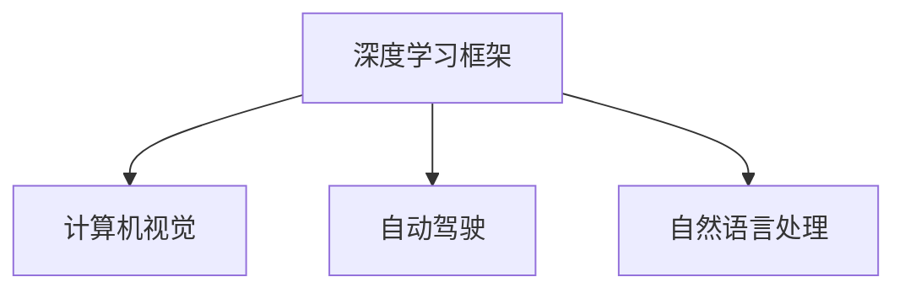

                 

# Andrej Karpathy：人工智能的未来发展规划

> 关键词：人工智能(AI)、深度学习、机器学习、深度学习框架、计算机视觉、自然语言处理、自动驾驶、算法研究、创新实验室、教育科技

## 1. 背景介绍

### 1.1 问题由来
Andrej Karpathy是当今人工智能领域的重要领军人物之一，曾在斯坦福大学获得博士学位，现担任特斯拉AI与自主驾驶部门的首席科学家。他的研究横跨计算机视觉、自然语言处理、自动驾驶等多个领域，成果丰硕，发表了诸多高质量的论文，并在开源社区贡献了多个深度学习框架。Karpathy的研究工作不仅在学术界具有重大影响力，也广泛应用于特斯拉等实际应用中，为人类生产生活方式带来了巨大变革。

### 1.2 问题核心关键点
Karpathy的研究涵盖了多个热点技术方向，本文将聚焦于他在深度学习框架、计算机视觉和自动驾驶等领域的规划和展望，探讨其对未来AI技术的推进和未来发展的思考。

## 2. 核心概念与联系

### 2.1 核心概念概述

为了更好地理解Andrej Karpathy的研究方向和未来规划，本节将介绍几个与他的工作密切相关的核心概念：

- 深度学习框架：用于实现深度神经网络算法的开源软件库，提供高效的模型构建、训练和推理功能。
- 计算机视觉：研究如何使计算机通过算法从视觉信息中提取有用特征和信息的技术。
- 自动驾驶：利用计算机视觉、深度学习等技术，使车辆能够自主感知和理解周围环境，实现无人驾驶。
- 自然语言处理：使计算机能够理解、处理和生成自然语言的技术，广泛应用于智能问答、文本生成等领域。

这些核心概念之间的逻辑关系可以通过以下Mermaid流程图来展示：



这个流程图展示了几大关键技术方向之间的关系：

1. 深度学习框架是实现上述各种技术的基础工具。
2. 计算机视觉和自然语言处理是深度学习框架在图像和语言处理领域的典型应用。
3. 自动驾驶将深度学习和计算机视觉技术有机结合，实现了车辆自主导航。

这些概念共同构成了Karpathy的研究工作框架，推动他在多个领域不断取得突破。

## 3. 核心算法原理 & 具体操作步骤
### 3.1 算法原理概述

Andrej Karpathy的研究重点之一是深度学习框架的设计和优化，特别关注如何使框架在功能丰富、易用性高和性能优化的基础上，成为科研和工业界的首选工具。其核心思想是通过算法创新和架构优化，提升深度学习模型的训练和推理效率，推动AI技术的普及和应用。

Karpathy认为，深度学习框架应具备以下几个关键特性：

1. **模块化设计**：组件应可以独立添加或替换，以支持不同的模型结构和算法。
2. **高效内存管理**：使用零拷贝机制和静态计算图优化，减少内存占用和拷贝开销。
3. **自动微分化**：利用动态计算图机制，自动计算梯度和优化过程。
4. **高性能编译器**：编译器应能高效利用底层硬件资源，提升模型训练和推理速度。

### 3.2 算法步骤详解

深度学习框架的开发通常遵循以下步骤：

**Step 1: 组件设计和实现**
- 根据需求设计数据流图和逻辑结构，确保模块化设计。
- 实现各个组件的核心算法，如矩阵乘法、卷积、池化等。
- 使用C++等高性能语言实现底层核心运算。

**Step 2: 用户接口和工具**
- 设计直观易用的API，提供模型构建、训练、推理、可视化等功能。
- 开发调试工具，如TensorBoard，支持模型性能分析、超参数调优等。
- 提供可视化工具，如ONNX，方便将深度学习模型转换为其他格式。

**Step 3: 优化和性能评估**
- 使用自动微分化技术，生成高效的计算图。
- 实现GPU/TPU等硬件加速器优化，提升计算效率。
- 进行基准测试和性能评估，确保框架在多种场景下性能稳定。

**Step 4: 社区和生态建设**
- 创建开源项目，收集开发者贡献，迭代更新框架。
- 发布论文、博客等资料，推广框架的使用。
- 支持生态系统建设，如集成第三方库、API等。

### 3.3 算法优缺点

深度学习框架的优势包括：
1. **功能全面**：支持各种深度学习模型和算法，提供丰富的功能模块。
2. **易用性高**：简洁的API设计，使得科研人员可以快速上手，工业界可以快速部署。
3. **性能优异**：高效的内存管理和自动微分化技术，优化模型训练和推理过程。
4. **社区活跃**：开源社区广泛，开发者众多，持续推进框架的迭代更新。

但框架也有以下缺点：
1. **开发复杂**：需要丰富的计算机科学知识和工程经验，开发周期较长。
2. **依赖性强**：需要高性能硬件支持，如GPU/TPU，对环境配置要求高。
3. **更新频繁**：需要不断调整API和功能，开发者需持续跟进。
4. **性能瓶颈**：框架本身的设计优化也有限，性能仍有提升空间。

尽管存在这些缺点，但深度学习框架对推动AI技术的普及和应用起到了巨大作用，已成为AI研究的重要基础。

### 3.4 算法应用领域

深度学习框架已在多个领域得到广泛应用，包括：

- **计算机视觉**：用于图像分类、目标检测、图像分割等任务。如OpenCV、TensorFlow等。
- **自然语言处理**：用于文本分类、语言模型、机器翻译等任务。如PyTorch、HuggingFace等。
- **自动驾驶**：用于图像识别、路径规划、自动驾驶等任务。如TensorFlow、PyTorch等。
- **推荐系统**：用于个性化推荐、广告投放等任务。如TensorFlow、PyTorch等。
- **医疗影像**：用于医学影像分析、诊断等任务。如TensorFlow、Keras等。

这些框架的广泛应用，不仅推动了AI技术的发展，也为各行业的智能化转型提供了有力支持。

## 4. 数学模型和公式 & 详细讲解 & 举例说明

### 4.1 数学模型构建

深度学习框架通常基于神经网络模型进行构建，以下是常用的数学模型示例：

- 全连接神经网络：$$f(x)=Wx+b$$，其中 $W$ 为权重矩阵，$b$ 为偏置项。
- 卷积神经网络：$$f(x)=\sum_k w_k * x_k + b$$，其中 $w_k$ 为卷积核，$x_k$ 为卷积特征图。
- 循环神经网络：$$f(x)=\sum_i a_i * x_i + b$$，其中 $a_i$ 为循环连接的权重矩阵。

### 4.2 公式推导过程

以卷积神经网络为例，推导其前向传播和反向传播公式：

前向传播：
$$f(x)=\sum_k w_k * x_k + b$$

反向传播：
$$\frac{\partial L}{\partial W}=\sum_i \frac{\partial L}{\partial y_i} * x_i, \quad \frac{\partial L}{\partial b}=\sum_i \frac{\partial L}{\partial y_i}$$

其中 $L$ 为损失函数，$y_i$ 为第 $i$ 层的输出。

### 4.3 案例分析与讲解

以图像分类任务为例，使用卷积神经网络进行模型构建和训练：

- 输入数据 $x$ 经过卷积层、池化层等多层处理，输出特征图 $y$。
- 特征图 $y$ 通过全连接层，经过softmax激活函数，得到预测概率分布。
- 损失函数使用交叉熵，与真实标签 $t$ 进行对比。
- 通过反向传播算法，计算参数梯度，更新权重和偏置。

```python
import torch
import torch.nn as nn
import torchvision.transforms as transforms
from torch.utils.data import DataLoader
from torchvision.datasets import CIFAR10

class ConvNet(nn.Module):
    def __init__(self):
        super(ConvNet, self).__init__()
        self.conv1 = nn.Conv2d(3, 32, kernel_size=3, padding=1)
        self.pool = nn.MaxPool2d(kernel_size=2, stride=2)
        self.fc1 = nn.Linear(32*8*8, 256)
        self.fc2 = nn.Linear(256, 10)
    
    def forward(self, x):
        x = self.conv1(x)
        x = self.pool(x)
        x = x.view(x.size(0), -1)
        x = self.fc1(x)
        x = torch.relu(x)
        x = self.fc2(x)
        return x

# 加载数据集
transform = transforms.Compose([
    transforms.ToTensor(),
    transforms.Normalize((0.5, 0.5, 0.5), (0.5, 0.5, 0.5))
])
trainset = CIFAR10(root='data', train=True, download=True, transform=transform)
trainloader = DataLoader(trainset, batch_size=64, shuffle=True)

# 构建模型
model = ConvNet()
criterion = nn.CrossEntropyLoss()
optimizer = torch.optim.SGD(model.parameters(), lr=0.01)

# 训练模型
for epoch in range(10):
    running_loss = 0.0
    for i, data in enumerate(trainloader, 0):
        inputs, labels = data
        optimizer.zero_grad()
        outputs = model(inputs)
        loss = criterion(outputs, labels)
        loss.backward()
        optimizer.step()
        running_loss += loss.item()
        if i % 2000 == 1999:
            print('[%d, %5d] loss: %.3f' % (epoch + 1, i + 1, running_loss / 2000))
            running_loss = 0.0
```

通过以上代码，可以看到如何使用深度学习框架TensorFlow或PyTorch构建卷积神经网络，并进行图像分类任务的训练。

## 5. 项目实践：代码实例和详细解释说明
### 5.1 开发环境搭建

在使用深度学习框架进行项目开发时，需要搭建相应的开发环境。以下是使用PyTorch进行计算机视觉项目开发的配置流程：

1. 安装Anaconda：从官网下载并安装Anaconda，用于创建独立的Python环境。

2. 创建并激活虚拟环境：
```bash
conda create -n cv-env python=3.8 
conda activate cv-env
```

3. 安装PyTorch：根据CUDA版本，从官网获取对应的安装命令。例如：
```bash
conda install pytorch torchvision torchaudio cudatoolkit=11.1 -c pytorch -c conda-forge
```

4. 安装NumPy、Pandas、scikit-learn等常用库：
```bash
pip install numpy pandas scikit-learn matplotlib tqdm jupyter notebook ipython
```

完成上述步骤后，即可在`cv-env`环境中开始计算机视觉项目的开发。

### 5.2 源代码详细实现

我们以图像分类任务为例，给出使用PyTorch进行卷积神经网络模型构建和训练的完整代码实现。

```python
import torch
import torch.nn as nn
import torchvision.transforms as transforms
from torch.utils.data import DataLoader
from torchvision.datasets import CIFAR10

class ConvNet(nn.Module):
    def __init__(self):
        super(ConvNet, self).__init__()
        self.conv1 = nn.Conv2d(3, 32, kernel_size=3, padding=1)
        self.pool = nn.MaxPool2d(kernel_size=2, stride=2)
        self.fc1 = nn.Linear(32*8*8, 256)
        self.fc2 = nn.Linear(256, 10)
    
    def forward(self, x):
        x = self.conv1(x)
        x = self.pool(x)
        x = x.view(x.size(0), -1)
        x = self.fc1(x)
        x = torch.relu(x)
        x = self.fc2(x)
        return x

# 加载数据集
transform = transforms.Compose([
    transforms.ToTensor(),
    transforms.Normalize((0.5, 0.5, 0.5), (0.5, 0.5, 0.5))
])
trainset = CIFAR10(root='data', train=True, download=True, transform=transform)
trainloader = DataLoader(trainset, batch_size=64, shuffle=True)

# 构建模型
model = ConvNet()
criterion = nn.CrossEntropyLoss()
optimizer = torch.optim.SGD(model.parameters(), lr=0.01)

# 训练模型
for epoch in range(10):
    running_loss = 0.0
    for i, data in enumerate(trainloader, 0):
        inputs, labels = data
        optimizer.zero_grad()
        outputs = model(inputs)
        loss = criterion(outputs, labels)
        loss.backward()
        optimizer.step()
        running_loss += loss.item()
        if i % 2000 == 1999:
            print('[%d, %5d] loss: %.3f' % (epoch + 1, i + 1, running_loss / 2000))
            running_loss = 0.0
```

以上代码展示了如何使用PyTorch构建卷积神经网络，进行图像分类任务的训练。

### 5.3 代码解读与分析

让我们再详细解读一下关键代码的实现细节：

**ConvNet类**：
- `__init__`方法：初始化卷积层、池化层和全连接层。
- `forward`方法：定义前向传播过程。

**数据处理**：
- `transform`：定义数据增强和归一化操作，增强模型泛化能力。
- `CIFAR10`：加载CIFAR-10数据集，并进行预处理。

**模型训练**：
- `DataLoader`：将数据集划分为小批次进行迭代训练。
- `SGD`优化器：使用随机梯度下降法进行参数优化。
- `CrossEntropyLoss`：使用交叉熵损失函数进行模型评估。

通过以上代码，我们可以看到PyTorch框架的简洁和高效，可以快速构建、训练和评估深度学习模型。

## 6. 实际应用场景
### 6.1 智能图像识别

计算机视觉技术在图像识别领域有广泛应用。智能图像识别系统可以应用于安全监控、质量检测、自动驾驶等多个场景，提升效率和准确性。

例如，在自动驾驶中，车辆通过摄像头和雷达捕捉道路信息，使用卷积神经网络进行图像识别和目标检测，从而实现车辆定位、避障等功能。智能图像识别还可以应用于无人商店的客户行为识别、工业生产中的质量检测等领域，显著提高生产效率和产品合格率。

### 6.2 视频分析

视频分析是计算机视觉的另一个重要应用方向，主要涉及视频内容理解、行为识别、情感分析等。智能视频分析系统可以广泛应用于智能安防、智慧教育、娱乐分析等领域。

例如，在智慧教育中，通过摄像头实时捕捉学生课堂表现，使用卷积神经网络进行视频内容分析，判断学生注意力集中度、情绪状态等，从而及时调整教学策略，提升教学效果。智能视频分析还可以用于安防监控、社交媒体情感分析等场景，带来更智能、高效的服务体验。

### 6.3 自动驾驶

自动驾驶技术将计算机视觉与深度学习有机结合，通过摄像头、雷达、激光雷达等传感器获取车辆周围环境信息，使用卷积神经网络进行图像识别和目标检测，实现车辆自主导航。特斯拉、百度等公司已经在自动驾驶领域取得显著进展，未来有望实现更广泛的应用。

例如，在自动驾驶中，摄像头捕捉道路交通标志、车辆、行人等信息，使用卷积神经网络进行目标检测和分类，从而实现车辆的路径规划和行为控制。自动驾驶技术不仅能够提高道路交通安全性，还能解决城市交通拥堵问题，带来更便捷的出行方式。

### 6.4 未来应用展望

计算机视觉技术在未来的发展方向包括：

1. **多模态融合**：将视觉、语音、文本等多种模态信息融合，提升智能系统的感知能力。
2. **自监督学习**：利用无标签数据进行自监督学习，提升模型的泛化能力。
3. **实时计算**：提升模型推理速度，实现实时视频分析和处理。
4. **小样本学习**：利用数据增强和迁移学习等技术，在少量标注数据下取得理想效果。
5. **跨模态推理**：通过跨模态融合，提升模型在视觉、文本、语音等多个模态下的一致性和准确性。

这些方向的发展将进一步提升计算机视觉技术的应用水平，推动AI技术的深度应用。

## 7. 工具和资源推荐
### 7.1 学习资源推荐

为了帮助开发者系统掌握深度学习框架和计算机视觉技术，这里推荐一些优质的学习资源：

1. 《深度学习》系列书籍：Ian Goodfellow、Yoshua Bengio、Aaron Courville合著，全面介绍了深度学习的基本概念和算法。
2. CS231n《卷积神经网络》课程：斯坦福大学开设的计算机视觉明星课程，有Lecture视频和配套作业，适合深入学习。
3. 《动手学深度学习》书籍：由李沐等人合著，全面介绍了深度学习框架的实现原理和应用实践。
4. Kaggle数据集：提供大量的机器学习和计算机视觉数据集，方便开发者进行实践和实验。
5. HuggingFace官方文档：提供了丰富的预训练模型和微调样例代码，是学习深度学习框架的重要资料。

通过对这些资源的学习实践，相信你一定能够快速掌握深度学习框架和计算机视觉技术的精髓，并用于解决实际的NLP问题。

### 7.2 开发工具推荐

高效的开发离不开优秀的工具支持。以下是几款用于深度学习框架和计算机视觉开发的常用工具：

1. PyTorch：基于Python的开源深度学习框架，灵活动态的计算图，适合快速迭代研究。
2. TensorFlow：由Google主导开发的开源深度学习框架，生产部署方便，适合大规模工程应用。
3. Keras：高层API，使用简洁，易于上手，支持多种深度学习框架。
4. OpenCV：开源计算机视觉库，提供丰富的图像处理和计算机视觉算法。
5. Matplotlib：Python绘图库，方便进行模型性能分析和可视化。
6. Jupyter Notebook：交互式笔记本，方便进行代码调试和数据可视化。

合理利用这些工具，可以显著提升深度学习框架和计算机视觉开发的速度和效率，加快创新迭代的步伐。

### 7.3 相关论文推荐

深度学习框架和计算机视觉技术的发展源于学界的持续研究。以下是几篇奠基性的相关论文，推荐阅读：

1. Convolutional Neural Networks for Visual Recognition（2012年）：提出了卷积神经网络（CNN）模型，开启了计算机视觉领域的预训练大模型时代。
2. ImageNet Classification with Deep Convolutional Neural Networks（2012年）：提出AlexNet模型，使用大规模数据集ImageNet进行预训练，取得了显著效果。
3. Deep Residual Learning for Image Recognition（2015年）：提出ResNet模型，解决了深度神经网络训练中的梯度消失问题，提升了模型深度和性能。
4. Faster R-CNN: Towards Real-Time Object Detection with Region Proposal Networks（2015年）：提出Faster R-CNN模型，提升了目标检测和图像分割的精度和速度。
5. Mask R-CNN（2017年）：在Faster R-CNN基础上增加了语义分割功能，进一步提升了计算机视觉任务的效果。

这些论文代表了大模型微调技术的发展脉络。通过学习这些前沿成果，可以帮助研究者把握学科前进方向，激发更多的创新灵感。

## 8. 总结：未来发展趋势与挑战
### 8.1 研究成果总结

Andrej Karpathy在深度学习框架、计算机视觉和自动驾驶等领域的研究成果丰硕，为AI技术的发展做出了重要贡献。他的工作不仅推动了学术界的研究进展，还在实际应用中取得了显著成效，特别是在自动驾驶和智能监控等场景中的应用，极大地提升了用户体验和安全性。

### 8.2 未来发展趋势

展望未来，深度学习框架和计算机视觉技术的发展趋势包括：

1. **全栈化设计**：深度学习框架将逐步实现全栈化，涵盖数据处理、模型构建、训练、推理等全流程，提升用户体验。
2. **端到端优化**：提升从数据到输出的整体效率，减少冗余和浪费，实现高效能的AI系统。
3. **多模态融合**：将视觉、语音、文本等多种模态信息融合，提升智能系统的感知能力。
4. **实时计算**：提升模型推理速度，实现实时视频分析和处理。
5. **自监督学习**：利用无标签数据进行自监督学习，提升模型的泛化能力。
6. **跨模态推理**：通过跨模态融合，提升模型在视觉、文本、语音等多个模态下的一致性和准确性。

这些趋势将推动深度学习框架和计算机视觉技术的不断进步，带来更多智能化应用。

### 8.3 面临的挑战

尽管深度学习框架和计算机视觉技术取得了显著进展，但仍面临诸多挑战：

1. **数据获取难度大**：高质量的标注数据获取成本高、周期长，制约了模型的训练和优化。
2. **计算资源需求高**：深度学习模型通常需要高性能硬件支持，如GPU/TPU，对环境配置要求高。
3. **模型复杂度高**：大规模深度学习模型的训练和推理过程复杂，需要丰富的计算资源和优化技巧。
4. **模型可解释性不足**：深度学习模型往往是"黑盒"系统，难以解释其内部工作机制和决策逻辑。
5. **安全性问题**：深度学习模型可能学习到有害信息和偏见，带来安全风险。

这些挑战需要我们在算法、硬件、工具等方面进行深入研究，才能进一步推动深度学习框架和计算机视觉技术的成熟和普及。

### 8.4 研究展望

面对深度学习框架和计算机视觉技术所面临的挑战，未来的研究需要在以下几个方面寻求新的突破：

1. **多模态融合**：将视觉、语音、文本等多种模态信息融合，提升智能系统的感知能力。
2. **自监督学习**：利用无标签数据进行自监督学习，提升模型的泛化能力。
3. **实时计算**：提升模型推理速度，实现实时视频分析和处理。
4. **小样本学习**：利用数据增强和迁移学习等技术，在少量标注数据下取得理想效果。
5. **跨模态推理**：通过跨模态融合，提升模型在视觉、文本、语音等多个模态下的一致性和准确性。

这些研究方向的探索，必将引领深度学习框架和计算机视觉技术迈向更高的台阶，为构建安全、可靠、可解释、可控的智能系统铺平道路。面向未来，深度学习框架和计算机视觉技术还需要与其他AI技术进行更深入的融合，如知识表示、因果推理、强化学习等，多路径协同发力，共同推动人工智能技术的发展。只有勇于创新、敢于突破，才能不断拓展AI技术的边界，让智能技术更好地造福人类社会。

## 9. 附录：常见问题与解答

**Q1：深度学习框架是如何进行模型构建和训练的？**

A: 深度学习框架通过构建计算图，定义模型的前向传播和反向传播过程。用户使用API构建模型，定义损失函数，设置优化器，将数据输入模型进行训练。在训练过程中，框架自动计算梯度，更新模型参数，最终得到训练好的模型。

**Q2：如何使用深度学习框架进行图像分类任务的训练？**

A: 使用深度学习框架进行图像分类任务的训练，通常需要以下步骤：
1. 加载数据集并进行预处理。
2. 构建模型，定义网络结构。
3. 定义损失函数和优化器。
4. 迭代训练模型，调整超参数，确保模型泛化能力。

**Q3：深度学习框架在实际应用中需要注意哪些问题？**

A: 深度学习框架在实际应用中需要注意以下问题：
1. 硬件资源需求高，需要高性能计算资源支持。
2. 数据质量对模型效果影响大，需要确保数据标注准确。
3. 模型复杂度高，需要优化算法和硬件配置。
4. 模型可解释性不足，需要开发可解释性工具。
5. 安全性问题，需要建立模型监控和干预机制。

这些问题的解决需要多方面的努力，包括算法优化、硬件支持、数据处理等。

**Q4：深度学习框架的未来发展方向有哪些？**

A: 深度学习框架的未来发展方向包括：
1. 全栈化设计，涵盖数据处理、模型构建、训练、推理等全流程。
2. 端到端优化，提升从数据到输出的整体效率。
3. 多模态融合，提升智能系统的感知能力。
4. 实时计算，提升模型推理速度，实现实时视频分析和处理。
5. 自监督学习，利用无标签数据进行自监督学习，提升模型的泛化能力。
6. 跨模态推理，通过跨模态融合，提升模型在视觉、文本、语音等多个模态下的一致性和准确性。

这些方向的发展将推动深度学习框架不断进步，带来更多智能化应用。

---

作者：禅与计算机程序设计艺术 / Zen and the Art of Computer Programming

