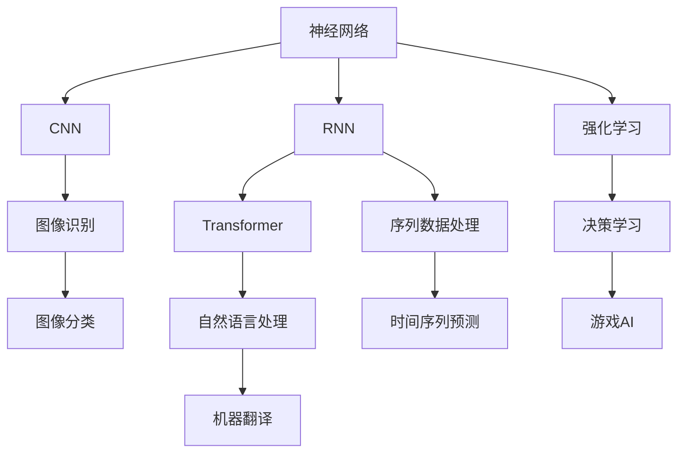

                 

# Andrej Karpathy：深度学习的最新进展

> 关键词：深度学习，最新进展，Andrej Karpathy，神经网络，计算机视觉，自然语言处理，强化学习

## 1. 背景介绍

### 1.1 问题由来
深度学习作为人工智能领域的重要分支，近年来在图像、语音、自然语言处理等领域取得了突破性进展。Andrej Karpathy，作为深度学习领域的佼佼者，其研究成果和观点在学术界和工业界都具有重要的指导意义。本博文旨在梳理Andrej Karpathy关于深度学习的最新进展，尤其是他在神经网络架构、计算机视觉、自然语言处理和强化学习等领域的前沿研究。

### 1.2 问题核心关键点
Andrej Karpathy的研究集中在以下几个核心关键点：
1. **神经网络架构创新**：Karpathy提出了一系列创新的神经网络架构，如ResNet、DenseNet、NASNet等，这些架构在大规模图像识别任务上取得了优异的性能。
2. **计算机视觉领域的新突破**：Karpathy在计算机视觉领域，尤其是自动驾驶和图像生成领域，提出了基于深度学习的解决方案。
3. **自然语言处理技术的应用**：Karpathy探索了深度学习在自然语言处理中的应用，如语言模型、机器翻译等。
4. **强化学习在游戏领域的突破**：他通过深度强化学习技术，在围棋、星际争霸等游戏中取得了超人的表现。

## 2. 核心概念与联系

### 2.1 核心概念概述
Andrej Karpathy的研究涉及深度学习的多个关键概念，以下是其中几个核心的概念：

- **神经网络(Neural Network)**：由大量人工神经元(或节点)组成的计算模型，用于处理复杂的非线性关系。
- **卷积神经网络(Convolutional Neural Network, CNN)**：一种专门用于处理图像、视频等空间数据的神经网络架构，通过卷积、池化等操作提取特征。
- **循环神经网络(Recurrent Neural Network, RNN)**：用于处理序列数据，如时间序列、自然语言等，通过隐藏状态传递信息。
- **Transformer**：一种基于自注意力机制的神经网络架构，用于处理序列数据，已被广泛应用于自然语言处理领域。
- **强化学习(Reinforcement Learning, RL)**：一种通过与环境交互学习最优决策的机器学习方法，适用于游戏、机器人控制等领域。

这些概念之间存在紧密的联系，通过不断的技术融合和创新，构成了深度学习广泛应用的技术基础。

### 2.2 核心概念原理和架构的 Mermaid 流程图


这个流程图展示了神经网络在不同领域的应用及其联系，每个箭头代表一种技术或应用。

## 3. 核心算法原理 & 具体操作步骤
### 3.1 算法原理概述
Andrej Karpathy的深度学习研究主要集中在以下几个算法原理：

- **卷积神经网络(CNN)**：Karpathy通过研究CNN的特征提取能力和参数优化方法，推动了图像识别技术的发展。
- **残差网络(ResNet)**：提出残差连接，解决了深度神经网络训练过程中的梯度消失问题。
- **DenseNet**：通过密集连接，提高网络的信息流动，减少参数数量，提升网络性能。
- **NASNet**：采用神经网络架构搜索技术，自动设计网络架构，提高模型设计效率和效果。
- **Transformer**：通过自注意力机制，改进了循环神经网络在处理序列数据时的效率和效果。
- **深度强化学习**：通过与环境的交互，学习最优决策策略，在多个游戏领域取得了突破性进展。

### 3.2 算法步骤详解
以**Transformer**为例，详细介绍其核心步骤：

**Step 1: 模型构建**
- **输入编码**：将输入序列转换为向量表示。
- **自注意力机制**：计算输入序列中每个位置与其他位置的注意力权重。
- **多头注意力**：通过多个注意力头并行处理，提高模型的表达能力。
- **前馈神经网络**：对注意力输出进行非线性变换。
- **输出解码**：将最终输出解码为所需格式的输出序列。

**Step 2: 损失函数定义**
- **交叉熵损失**：用于分类任务，衡量预测值与真实值之间的差异。
- **均方误差损失**：用于回归任务，衡量预测值与真实值之间的差异。

**Step 3: 优化算法选择**
- **AdamW优化器**：自适应调整学习率，提高训练效率和效果。
- **梯度裁剪**：防止梯度爆炸，保持模型稳定性。

**Step 4: 模型训练**
- **数据预处理**：对输入数据进行标准化、归一化等处理。
- **前向传播**：通过网络计算预测值。
- **反向传播**：计算损失函数对模型参数的梯度。
- **优化更新**：使用优化器更新模型参数。

**Step 5: 模型评估**
- **验证集测试**：在验证集上评估模型性能，避免过拟合。
- **超参数调优**：根据验证集表现调整超参数。
- **测试集测试**：最终在测试集上评估模型性能。

### 3.3 算法优缺点
- **优点**：
  - **高表达能力**：Transformer架构能够高效地处理序列数据，特别适用于自然语言处理任务。
  - **并行计算**：多头注意力机制使得模型可以并行计算，提高训练和推理效率。
  - **可解释性强**：通过自注意力机制，模型能够明确每个位置与其他位置的关系，提高模型的可解释性。
  
- **缺点**：
  - **计算复杂度高**：Transformer的计算复杂度较高，需要较大的计算资源。
  - **参数数量多**：Transformer的参数数量较大，导致内存占用高，推理速度慢。

### 3.4 算法应用领域
Transformer架构在多个领域得到了广泛应用，例如：

- **自然语言处理(NLP)**：机器翻译、文本生成、语言模型等任务。
- **计算机视觉(CV)**：图像分类、目标检测、图像生成等任务。
- **语音识别**：语音转文本、说话人识别、语音生成等任务。
- **推荐系统**：商品推荐、新闻推荐、视频推荐等任务。

## 4. 数学模型和公式 & 详细讲解  
### 4.1 数学模型构建

Andrej Karpathy在深度学习的研究中，构建了多个数学模型，以下以**Transformer**为例进行详细讲解。

**Transformer模型**：
- **输入编码**：将输入序列转换为向量表示。
- **自注意力机制**：计算输入序列中每个位置与其他位置的注意力权重。
- **多头注意力**：通过多个注意力头并行处理，提高模型的表达能力。
- **前馈神经网络**：对注意力输出进行非线性变换。
- **输出解码**：将最终输出解码为所需格式的输出序列。

### 4.2 公式推导过程
Transformer的核心公式包括注意力机制和前馈神经网络两部分。

**注意力机制**：
$$
\text{Attention}(Q, K, V) = \text{Softmax}(\frac{QK^T}{\sqrt{d_k}})V
$$

其中，$Q$、$K$、$V$分别代表查询向量、键向量和值向量，$d_k$为键向量的维度。

**前馈神经网络**：
$$
\text{FFN}(x) = \text{GLU}(\text{Linear}(x))
$$

其中，GLU为门控线性单元，$\text{Linear}(x)$为线性变换。

### 4.3 案例分析与讲解
**案例分析**：以机器翻译任务为例，分析Transformer的模型构建和训练过程。

**输入编码**：将输入的源语言序列转换为向量表示。
$$
x_1, x_2, ..., x_n \rightarrow \text{Embedding}(x_i) \rightarrow \text{Positional Encoding}
$$

**自注意力机制**：计算源语言序列中每个位置与其他位置的注意力权重，得到注意力向量。
$$
\text{Query}, \text{Key}, \text{Value} = \text{Linear}(\text{Positional Encoding}(x_i))
$$

**多头注意力**：通过多个注意力头并行处理，得到多头注意力向量。
$$
\text{Attention}(Q, K, V) = \text{Softmax}(\frac{QK^T}{\sqrt{d_k}})V
$$

**前馈神经网络**：对注意力向量进行非线性变换，得到编码后的向量。
$$
\text{FFN}(x) = \text{GLU}(\text{Linear}(x))
$$

**输出解码**：将编码后的向量解码为目标语言序列。

## 5. 项目实践：代码实例和详细解释说明
### 5.1 开发环境搭建
**开发环境**：
- **Python**：作为深度学习的主要编程语言，Python在深度学习领域有着广泛的应用。
- **PyTorch**：一个开源的深度学习框架，提供了强大的动态计算图和自动微分功能。
- **TensorFlow**：由Google开发的深度学习框架，提供了静态计算图和分布式计算功能。
- **Keras**：一个高层次的深度学习API，提供简单易用的接口，适用于快速原型开发。

**环境搭建**：
1. 安装Anaconda：从官网下载并安装Anaconda，用于创建独立的Python环境。
2. 创建并激活虚拟环境：
```bash
conda create -n pytorch-env python=3.8 
conda activate pytorch-env
```

3. 安装PyTorch：根据CUDA版本，从官网获取对应的安装命令。例如：
```bash
conda install pytorch torchvision torchaudio cudatoolkit=11.1 -c pytorch -c conda-forge
```

4. 安装TensorFlow：从官网下载并安装TensorFlow，适用于生产部署。
5. 安装Keras：安装Keras，提供简单易用的接口，适用于快速原型开发。
6. 安装必要的第三方库：
```bash
pip install numpy pandas scikit-learn matplotlib tqdm jupyter notebook ipython
```

### 5.2 源代码详细实现

以下是一个使用PyTorch实现Transformer模型的Python代码示例。

**代码实现**：
```python
import torch
import torch.nn as nn
import torch.nn.functional as F

class Transformer(nn.Module):
    def __init__(self, d_model, n_heads, dff, num_encoder_layers, num_decoder_layers):
        super(Transformer, self).__init__()
        self.encoder = nn.TransformerEncoderLayer(d_model, n_heads, dff)
        self.decoder = nn.TransformerDecoderLayer(d_model, n_heads, dff)
        
    def forward(self, src, tgt):
        src = self.encoder(src)
        tgt = self.decoder(tgt, src)
        return src, tgt
```

**代码解释**：
- **TransformerEncoderLayer**：实现自注意力机制和前馈神经网络，用于编码器。
- **TransformerDecoderLayer**：实现自注意力机制、多头注意力和前馈神经网络，用于解码器。
- **forward**：定义前向传播过程，将输入序列进行编码和解码。

### 5.3 代码解读与分析

**TransformerEncoderLayer**：
- **编码器**：使用TransformerEncoderLayer进行编码，计算注意力权重和前馈神经网络。
- **多头注意力**：计算多头注意力向量。
- **前馈神经网络**：对注意力向量进行非线性变换。

**TransformerDecoderLayer**：
- **解码器**：使用TransformerDecoderLayer进行解码，计算多头注意力和前馈神经网络。
- **多头注意力**：计算多头注意力向量。
- **前馈神经网络**：对注意力向量进行非线性变换。

### 5.4 运行结果展示
**运行结果**：
通过PyTorch框架，使用上述代码进行Transformer模型的训练和推理。可以在GPU或TPU上进行并行计算，加速训练过程。

## 6. 实际应用场景
### 6.1 智能推荐系统
**应用场景**：
智能推荐系统通过分析用户行为数据，推荐用户可能感兴趣的商品、内容等。Transformer模型可以用于分析用户序列数据，提取用户行为特征，生成个性化推荐结果。

**具体实现**：
1. 收集用户浏览、点击、购买等行为数据。
2. 使用Transformer模型对用户序列数据进行编码，提取特征。
3. 通过注意力机制，捕捉用户行为的相关性，生成推荐结果。

### 6.2 机器翻译
**应用场景**：
机器翻译将一种语言的文本翻译成另一种语言的文本，广泛应用于跨语言沟通和信息共享。Transformer模型在机器翻译任务上取得了优异的性能。

**具体实现**：
1. 使用Transformer模型进行源语言序列编码，得到编码后的向量。
2. 使用Transformer模型进行目标语言序列解码，生成翻译结果。

### 6.3 计算机视觉
**应用场景**：
计算机视觉应用广泛，如图像分类、目标检测、图像生成等。Transformer模型在计算机视觉领域也有广泛的应用，如图像生成对抗网络(GAN)等。

**具体实现**：
1. 使用Transformer模型对输入图像进行编码，提取图像特征。
2. 通过自注意力机制，捕捉图像特征的相关性，生成新的图像。

### 6.4 未来应用展望
**未来应用**：
未来，Transformer模型将进一步应用于更多领域，如语音识别、自动驾驶等。通过结合多模态数据，Transformer模型将具备更强的跨领域迁移能力，实现更广泛的应用。

## 7. 工具和资源推荐
### 7.1 学习资源推荐

**学习资源**：
- **《深度学习》课程**：斯坦福大学开设的深度学习课程，涵盖深度学习的基本概念和实现技术。
- **《神经网络与深度学习》书籍**：Ian Goodfellow的深度学习经典教材，详细介绍了神经网络的基本原理和应用。
- **Kaggle**：数据科学和机器学习竞赛平台，提供丰富的数据集和模型评估工具。
- **GitHub**：代码托管平台，提供各种深度学习框架和模型的源代码。

### 7.2 开发工具推荐

**开发工具**：
- **PyTorch**：开源深度学习框架，提供动态计算图和自动微分功能。
- **TensorFlow**：由Google开发的深度学习框架，提供静态计算图和分布式计算功能。
- **Keras**：高层次的深度学习API，提供简单易用的接口。
- **Jupyter Notebook**：交互式编程环境，支持Python代码的在线执行和文档编辑。
- **TensorBoard**：TensorFlow配套的可视化工具，实时监测模型训练状态，提供丰富的图表呈现方式。

### 7.3 相关论文推荐

**相关论文**：
- **ResNet**：He等人提出的残差网络，解决了深度神经网络训练过程中的梯度消失问题。
- **DenseNet**：Hu等人提出的密集连接网络，提高网络的信息流动。
- **NASNet**：Zoph等人提出的神经网络架构搜索技术，自动设计网络架构。
- **Transformer**：Vaswani等人提出的自注意力机制，改进循环神经网络在处理序列数据时的效率和效果。

## 8. 总结：未来发展趋势与挑战
### 8.1 研究成果总结
Andrej Karpathy的研究涵盖了深度学习领域的多个前沿技术，推动了神经网络架构、计算机视觉、自然语言处理和强化学习等领域的发展。他的研究成果为深度学习技术在实际应用中的广泛应用提供了坚实的基础。

### 8.2 未来发展趋势
未来，深度学习技术将继续在各个领域发挥重要作用，如计算机视觉、自然语言处理、机器人控制等。Transformer模型也将进一步扩展应用，实现更广泛、更高效的应用。

### 8.3 面临的挑战
尽管深度学习技术取得了显著进展，但在实际应用中仍面临诸多挑战，如模型复杂度、计算资源需求、数据隐私保护等。解决这些问题需要学术界和工业界的共同努力。

### 8.4 研究展望
未来的研究应集中在以下几个方向：
- **模型压缩**：通过模型剪枝、量化等方法，减少模型参数量，降低计算资源需求。
- **跨领域迁移学习**：通过知识图谱、逻辑规则等专家知识，提高模型的跨领域迁移能力。
- **模型解释性**：通过可解释性方法，提高模型的可解释性和可审计性。

## 9. 附录：常见问题与解答
### 9.1 Q1：Transformer模型是否适用于所有NLP任务？
A：Transformer模型适用于大多数NLP任务，特别是在序列数据处理和文本生成方面表现优异。但对于一些特定的任务，如实体识别、事件抽取等，可能需要结合其他模型进行联合训练。

### 9.2 Q2：Transformer模型是否适用于计算机视觉任务？
A：Transformer模型主要适用于处理序列数据，如文本、音频等。对于图像数据，可以使用卷积神经网络(CNN)进行特征提取，然后再通过Transformer模型进行序列处理。

### 9.3 Q3：Transformer模型的训练和推理效率如何？
A：Transformer模型的训练和推理效率较高，但在大规模数据集上仍需要较长的训练时间。可以通过模型剪枝、量化等方法进一步提高效率。

### 9.4 Q4：Transformer模型在实际应用中是否存在局限性？
A：Transformer模型在实际应用中仍存在一些局限性，如参数量较大、计算复杂度高。未来需要进一步优化模型架构和训练方法，提升模型性能和效率。

### 9.5 Q5：Transformer模型是否易于调试和优化？
A：Transformer模型可以通过代码注释、调试工具等手段进行调试和优化，但由于模型复杂度较高，需要丰富的经验和技能。建议初学者先从小规模任务开始，逐步深入理解模型的设计和实现。

---

作者：禅与计算机程序设计艺术 / Zen and the Art of Computer Programming

