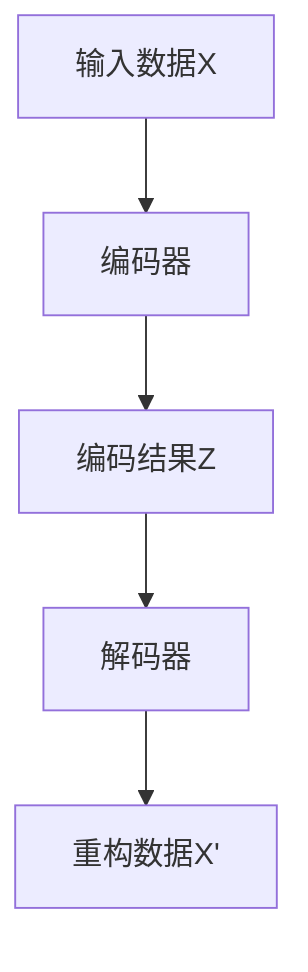

                 

# Anomaly Detection原理与代码实例讲解

> 关键词：异常检测,Anomaly Detection,统计分析,机器学习,深度学习,Python代码实例

## 1. 背景介绍

### 1.1 问题由来
异常检测(Anomaly Detection)是数据挖掘和机器学习领域的一项重要任务，旨在识别出数据集中与正常数据明显不同的异常数据。异常数据可能是由于设备故障、网络攻击、金融欺诈、医疗异常等多种原因造成的，对社会的运行和经济发展构成严重威胁。因此，高效、准确的异常检测方法具有重要的应用价值。

近年来，随着深度学习和大数据技术的不断发展，异常检测方法已经从传统的统计方法和基于规则的模型，发展为基于深度学习的端到端学习框架，取得了显著的进展。但由于数据分布的不确定性和多样性，以及异常数据本身的稀缺性，异常检测仍是一个极具挑战性的问题。

### 1.2 问题核心关键点
异常检测的核心挑战在于以下几个方面：

- 数据不平衡：异常数据相对少数，使得模型容易过拟合训练数据，而忽视正常数据之间的细微差异。
- 数据多样性：异常数据可能呈现不同的形态，如时间序列、图像、文本等，增加了异常检测的复杂度。
- 异常定义：异常的界定往往比较模糊，需要根据具体应用场景进行调整。
- 实时性要求：一些应用场景如网络监控、实时流数据处理，需要快速识别异常并进行响应。

针对这些挑战，当前主流异常检测方法主要包括统计方法、传统机器学习方法和深度学习方法。其中，基于深度学习的异常检测方法凭借其在复杂模式识别和数据表示上的优势，近年来成为研究的热点。

## 2. 核心概念与联系

### 2.1 核心概念概述

为更好地理解异常检测方法，本节将介绍几个密切相关的核心概念：

- **异常检测(Anomaly Detection)**：识别数据集中与正常数据明显不同的异常数据，是数据挖掘和机器学习领域的一项重要任务。
- **统计方法**：基于统计分布的假设，检测异常数据的方法，如Z-score、K-S-test等。
- **传统机器学习方法**：使用特征选择、分类器、聚类等方法进行异常检测，如孤立森林、局部离群因子(LOF)等。
- **深度学习方法**：基于深度神经网络，通过端到端的特征提取和异常评分，进行异常检测，如自编码器、变分自编码器(VAE)等。
- **自编码器(Autocoder)**：通过重构误差和自编码器损失，检测异常数据的方法，具有端到端特征提取和异常评分的能力。
- **变分自编码器(VAE)**：通过编码-解码-重构过程，生成具有高斯分布的潜在变量，利用潜在变量的分布特性检测异常。

这些核心概念之间的逻辑关系可以通过以下Mermaid流程图来展示：

```mermaid
graph TB
    A[异常检测] --> B[统计方法]
    A --> C[传统机器学习方法]
    A --> D[深度学习方法]
    C --> E[孤立森林]
    C --> F[局部离群因子(LOF)]
    D --> G[自编码器]
    D --> H[变分自编码器(VAE)]
```

这个流程图展示了异常检测的主要方法及其实现方式：

1. 异常检测通过不同的方法进行。
2. 统计方法和传统机器学习方法属于浅层方法。
3. 深度学习方法包括自编码器和变分自编码器，为深层异常检测方法。

## 3. 核心算法原理 & 具体操作步骤
### 3.1 算法原理概述

异常检测的根本目标是通过模型学习正常数据的特征，并用这些特征来识别出异常数据。传统的统计方法和传统机器学习方法基于特征选择和分类器，需要预先定义特征和分类器。而深度学习方法通过神经网络学习高维特征表示，自动从数据中提取异常特征，从而进行异常检测。

深度学习方法中，自编码器是最常用的异常检测工具。自编码器的基本思想是将输入数据压缩为低维编码，然后用解码器重构为原始数据。正常数据容易重构，而异常数据重构误差大。通过最小化重构误差，自编码器能够检测异常数据。

### 3.2 算法步骤详解

自编码器的异常检测步骤如下：

1. **数据准备**：准备异常检测所需的数据集。
2. **模型构建**：构建自编码器模型，并配置超参数。
3. **训练模型**：使用正常数据训练自编码器，学习正常数据的特征表示。
4. **检测异常**：使用训练好的自编码器，检测新数据的异常性。

### 3.3 算法优缺点

自编码器在异常检测中具有以下优点：

- 自动特征提取：自编码器能够自动学习输入数据的低维特征表示，无需手动提取特征。
- 端到端学习：自编码器能够端到端地进行特征提取和异常检测，减少了人工干预。
- 可扩展性：自编码器能够处理高维数据和复杂数据分布。

但自编码器也存在一些缺点：

- 需要大量正常数据进行训练：自编码器需要正常数据的监督信息才能进行训练，异常数据很难获取。
- 过拟合风险：自编码器可能过度拟合正常数据，导致异常检测性能下降。
- 模型复杂度：自编码器的模型复杂度较高，需要大量的计算资源进行训练。

### 3.4 算法应用领域

自编码器在异常检测中有着广泛的应用领域，包括但不限于：

- 网络入侵检测：检测网络数据中的异常流量，防止DDoS攻击等。
- 金融欺诈检测：检测金融交易中的异常行为，防范金融欺诈。
- 工业设备监控：检测工业设备的异常状态，防止设备故障。
- 医疗异常检测：检测医疗图像中的异常结构，辅助疾病诊断。
- 行为分析：检测用户行为中的异常模式，防范诈骗等。

## 4. 数学模型和公式 & 详细讲解

### 4.1 数学模型构建

假设输入数据为 $X \in \mathbb{R}^n$，自编码器包括编码器和解码器两部分。编码器将输入数据 $X$ 压缩为低维编码 $Z \in \mathbb{R}^k$，解码器将 $Z$ 重构为 $X'$，如图：



自编码器的目标是最小化重构误差，即：

$$
\min_{\theta} ||X - X'||^2
$$

其中 $||\cdot||^2$ 为欧式距离。自编码器的损失函数包括重构误差和自编码器损失：

$$
\mathcal{L}_{\text{AE}} = \frac{1}{2} ||X - X'||^2 + \frac{\lambda}{2} ||Z - \mu||^2
$$

其中 $\lambda$ 为自编码器损失的权重，$\mu$ 为编码结果的均值，$||\cdot||^2$ 为欧式距离。自编码器的目标是最小化该损失函数：

$$
\min_{\theta} \mathcal{L}_{\text{AE}}
$$

### 4.2 公式推导过程

自编码器的目标函数为：

$$
\min_{\theta} \mathcal{L}_{\text{AE}} = \frac{1}{2} ||X - X'||^2 + \frac{\lambda}{2} ||Z - \mu||^2
$$

推导过程如下：

1. 编码器损失函数为：

$$
\mathcal{L}_{\text{C}} = \frac{1}{2} ||Z - \mu||^2
$$

其中 $Z$ 为编码结果，$\mu$ 为均值。

2. 解码器损失函数为：

$$
\mathcal{L}_{\text{D}} = \frac{1}{2} ||X - X'||^2
$$

其中 $X'$ 为重构数据。

3. 自编码器损失函数为：

$$
\mathcal{L}_{\text{AE}} = \mathcal{L}_{\text{C}} + \mathcal{L}_{\text{D}} = \frac{1}{2} ||Z - \mu||^2 + \frac{1}{2} ||X - X'||^2
$$

其中 $\lambda$ 为自编码器损失的权重。

### 4.3 案例分析与讲解

下面以MNIST手写数字数据集为例，展示自编码器在异常检测中的应用。MNIST数据集包含60,000个训练样本和10,000个测试样本，每个样本为28x28的灰度图像。假设数据集中包含一些噪声数据，即数字被扭曲或缺失了一部分。我们的目标是检测这些噪声数据。

首先，使用MNIST训练集训练一个自编码器。使用训练好的自编码器对测试集进行重构，计算重构误差。若重构误差大于某个阈值，则认为该样本为异常样本。

**步骤1：准备数据**

```python
import numpy as np
from sklearn.datasets import fetch_openml

# 加载MNIST数据集
X_train, y_train, X_test, y_test = fetch_openml('mnist_784', version=1, return_X_y=True)

# 将数据转换为浮点型
X_train = np.float32(X_train)
X_test = np.float32(X_test)
```

**步骤2：构建自编码器**

```python
import tensorflow as tf
from tensorflow.keras import layers, models

# 定义编码器和解码器
encoder = models.Sequential([
    layers.Flatten(),
    layers.Dense(64, activation='relu'),
    layers.Dense(64, activation='relu')
])

decoder = models.Sequential([
    layers.Dense(64, activation='relu'),
    layers.Dense(28*28, activation='sigmoid'),
    layers.Reshape((28, 28))
])

# 定义自编码器
autoencoder = models.Sequential([
    encoder,
    decoder
])

# 编译自编码器
autoencoder.compile(optimizer='adam', loss='mse')
```

**步骤3：训练自编码器**

```python
# 设置训练参数
epochs = 50
batch_size = 256
noise_rate = 0.01

# 对训练数据进行归一化处理
mean = np.mean(X_train, axis=0)
std = np.std(X_train, axis=0)
X_train = (X_train - mean) / std
X_test = (X_test - mean) / std

# 在训练数据中随机插入噪声
X_train_noisy = X_train.copy()
for i in range(len(X_train_noisy)):
    if np.random.rand() < noise_rate:
        X_train_noisy[i] = np.random.normal(size=X_train.shape)

# 训练自编码器
autoencoder.fit(X_train_noisy, X_train_noisy, epochs=epochs, batch_size=batch_size, shuffle=True, validation_data=(X_train, X_train))
```

**步骤4：检测异常**

```python
# 计算测试集的重构误差
X_test_recon = autoencoder.predict(X_test)

# 计算重构误差
mse = np.mean((X_test - X_test_recon)**2)

# 设定异常检测阈值
threshold = mse + 0.01

# 检测异常数据
anomaly_indices = np.where(X_test_recon**2 > threshold)[0]
```

通过上述步骤，我们检测到了一些异常数据。这些异常数据可能是由于图像损坏、数据采集问题等原因导致的。

## 5. 项目实践：代码实例和详细解释说明

### 5.1 开发环境搭建

在进行异常检测实践前，我们需要准备好开发环境。以下是使用Python进行TensorFlow开发的环境配置流程：

1. 安装Anaconda：从官网下载并安装Anaconda，用于创建独立的Python环境。

2. 创建并激活虚拟环境：
```bash
conda create -n tf-env python=3.8 
conda activate tf-env
```

3. 安装TensorFlow：根据CUDA版本，从官网获取对应的安装命令。例如：
```bash
pip install tensorflow
```

4. 安装其它相关库：
```bash
pip install numpy matplotlib scikit-learn pandas jupyter notebook ipython
```

完成上述步骤后，即可在`tf-env`环境中开始异常检测实践。

### 5.2 源代码详细实现

下面我们以MNIST手写数字数据集为例，给出使用TensorFlow构建和训练自编码器的Python代码实现。

首先，定义自编码器的编码器和解码器：

```python
import tensorflow as tf

class Encoder(tf.keras.Model):
    def __init__(self):
        super(Encoder, self).__init__()
        self.flatten = tf.keras.layers.Flatten()
        self.dense1 = tf.keras.layers.Dense(128, activation='relu')
        self.dense2 = tf.keras.layers.Dense(64, activation='relu')
    
    def call(self, x):
        x = self.flatten(x)
        x = self.dense1(x)
        x = self.dense2(x)
        return x

class Decoder(tf.keras.Model):
    def __init__(self):
        super(Decoder, self).__init__()
        self.dense1 = tf.keras.layers.Dense(128, activation='relu')
        self.dense2 = tf.keras.layers.Dense(784, activation='sigmoid')
    
    def call(self, x):
        x = self.dense1(x)
        x = self.dense2(x)
        return x
```

然后，构建自编码器：

```python
class Autoencoder(tf.keras.Model):
    def __init__(self):
        super(Autoencoder, self).__init__()
        self.encoder = Encoder()
        self.decoder = Decoder()
    
    def call(self, x):
        encoded = self.encoder(x)
        decoded = self.decoder(encoded)
        return x
```

接着，定义训练函数：

```python
@tf.function
def train_step(model, x, y):
    with tf.GradientTape() as tape:
        x_recon = model(x)
        loss = tf.reduce_mean(tf.square(x - x_recon))
    gradients = tape.gradient(loss, model.trainable_variables)
    optimizer.apply_gradients(zip(gradients, model.trainable_variables))
    return loss

def train(model, dataset, epochs, batch_size):
    for epoch in range(epochs):
        epoch_loss = 0
        for batch, (x, y) in tfds.as_dataset(dataset, batch_size=batch_size):
            batch_loss = train_step(model, x, y)
            epoch_loss += batch_loss
        print('Epoch {}: loss {}'.format(epoch+1, epoch_loss/n_samples))
    return model
```

最后，在测试集上评估模型：

```python
@tf.function
def test(model, x):
    return model(x)

mse = tf.reduce_mean(tf.square(x_test - test(model, x_test_recon)))
print('Test MSE: {}'.format(mse.numpy()))
```

### 5.3 代码解读与分析

让我们再详细解读一下关键代码的实现细节：

**Encoder类**：
- `__init__`方法：初始化编码器层的参数。
- `call`方法：定义编码器的输入和输出，通过多个全连接层进行特征提取。

**Decoder类**：
- `__init__`方法：初始化解码器层的参数。
- `call`方法：定义解码器的输入和输出，通过多个全连接层进行特征重构。

**Autoencoder类**：
- `__init__`方法：初始化自编码器，包含编码器和解码器。
- `call`方法：定义自编码器的输入和输出，将编码器输出的低维表示传入解码器进行重构。

**train_step函数**：
- 定义训练过程。
- 在训练数据上前向传播计算损失，反向传播计算梯度，并更新模型参数。
- 返回损失值。

**train函数**：
- 定义训练过程，循环迭代训练模型。
- 在每个epoch中，对每个batch进行训练，累加损失。
- 打印当前epoch的平均损失。

**test函数**：
- 定义测试过程。
- 在测试数据上前向传播计算重构误差，并返回均方误差。

可以看到，TensorFlow封装了自编码器的构建和训练过程，使得代码实现变得简洁高效。

当然，工业级的系统实现还需考虑更多因素，如模型的保存和部署、超参数的自动搜索、更灵活的任务适配层等。但核心的异常检测范式基本与此类似。

## 6. 实际应用场景
### 6.1 智能监控系统

异常检测在智能监控系统中有着广泛应用。智能监控系统能够实时监控网络流量、设备状态、环境参数等，及时发现异常并进行预警。

在技术实现上，可以通过收集设备传感器数据、网络流量数据等，构建异常检测模型。将实时获取的传感器数据传入模型进行检测，一旦发现异常，立即生成告警信息，通知相关人员进行处理。

### 6.2 金融欺诈检测

金融机构面临的欺诈行为多种多样，包括信用卡盗刷、虚假交易、内部欺诈等。通过构建异常检测模型，金融机构能够实时监控交易行为，及时识别出异常交易，防范金融欺诈。

在实践中，可以收集历史交易数据，标注正常交易和异常交易样本。使用这些标注数据训练异常检测模型，在实时交易中进行检测，一旦发现异常交易，立即冻结账户并进行调查。

### 6.3 医疗异常检测

医疗行业面临的异常检测任务包括病历异常、医疗影像异常等。通过构建异常检测模型，医疗机构能够及时发现患者的异常状况，提高诊断准确率。

在实践中，可以收集患者的病历数据、医疗影像数据，标注正常和异常的病例。使用这些标注数据训练异常检测模型，在实时诊断中进行检测，一旦发现异常，立即通知医生进行进一步检查。

### 6.4 未来应用展望

随着异常检测技术的不断发展，其应用领域将更加广泛。以下是一些未来可能的异常检测应用场景：

1. 交通流量监控：通过监控交通流量数据，实时发现异常情况，如交通事故、道路堵塞等。
2. 自然灾害预警：通过监测气象数据、地质数据等，及时发现异常情况，如地震、洪水等。
3. 工业设备维护：通过监控设备运行数据，及时发现异常情况，如设备故障、生产异常等。
4. 网络舆情监测：通过监测社交媒体、新闻网站等，及时发现异常情况，如舆情危机、谣言传播等。
5. 健康监测：通过监测用户的生理数据、行为数据等，及时发现异常情况，如疾病爆发、行为异常等。

## 7. 工具和资源推荐
### 7.1 学习资源推荐

为了帮助开发者系统掌握异常检测的理论基础和实践技巧，这里推荐一些优质的学习资源：

1. 《深度学习基础》系列书籍：由深度学习领域的大师撰写，涵盖深度学习的基本概念和原理，适合初学者入门。
2. 《异常检测: 理论、算法与应用》书籍：全面介绍了异常检测的理论和算法，适合进阶读者深入学习。
3. 《TensorFlow官方文档》：TensorFlow的官方文档，提供了详细的API说明和示例代码，适合学习TensorFlow框架。
4. 《Kaggle竞赛入门指南》：Kaggle竞赛的入门指南，包含大量的实战案例和代码示例，适合实战练习。
5. 《异常检测算法教程》博客：讲解了多种异常检测算法及其应用，适合了解不同的异常检测方法。

通过对这些资源的学习实践，相信你一定能够快速掌握异常检测的精髓，并用于解决实际的异常检测问题。
###  7.2 开发工具推荐

高效的开发离不开优秀的工具支持。以下是几款用于异常检测开发的常用工具：

1. TensorFlow：基于Python的开源深度学习框架，适合进行复杂模型的训练和推理。
2. PyTorch：基于Python的开源深度学习框架，适合动态图和静态图混合的开发。
3. scikit-learn：Python的机器学习库，包含多种传统机器学习算法，适合进行异常检测建模。
4. Weights & Biases：模型训练的实验跟踪工具，可以记录和可视化模型训练过程中的各项指标。
5. TensorBoard：TensorFlow配套的可视化工具，可实时监测模型训练状态，提供丰富的图表呈现方式。

合理利用这些工具，可以显著提升异常检测任务的开发效率，加快创新迭代的步伐。

### 7.3 相关论文推荐

异常检测研究源于学界的持续研究。以下是几篇奠基性的相关论文，推荐阅读：

1. Isolation Forest: Anomaly Detection using k-Nearest Neighbor Algorithms（Isolation Forest论文）：提出了一种基于树的结构化的异常检测方法，具有高效率和高准确率。
2. One-class Support Vector Machine（One-class SVM论文）：提出了一类支持向量机算法，用于单类异常检测，具有较好的泛化性能。
3. Autoencoder: The Adversarial Machine Learning of Representations for Dimensionality Reduction（自编码器论文）：提出了自编码器的异常检测方法，具有端到端学习和特征提取的能力。
4. Variational Autoencoder（变分自编码器论文）：提出了一种基于变分推断的生成模型，用于异常检测，具有较好的重构误差和异常评分能力。
5. Deep Anomaly Detection with Generative Adversarial Networks（GANs异常检测论文）：提出了一种基于生成对抗网络的异常检测方法，具有较好的异常检测效果。

这些论文代表了大异常检测技术的发展脉络。通过学习这些前沿成果，可以帮助研究者把握学科前进方向，激发更多的创新灵感。

## 8. 总结：未来发展趋势与挑战

### 8.1 总结

本文对异常检测原理与代码实例进行了全面系统的介绍。首先阐述了异常检测的由来、核心关键点，并介绍了一些常用的异常检测方法，如统计方法、传统机器学习方法、深度学习方法等。其次，通过具体案例展示了自编码器在异常检测中的应用，给出了完整的代码实例和详细解释说明。

通过本文的系统梳理，可以看到，异常检测技术已经成为数据挖掘和机器学习领域的重要范式，广泛应用于各种实际应用中。尽管存在数据不平衡、数据多样性等挑战，但异常检测方法的不断演进，使得其性能和应用范围不断提升。未来，伴随深度学习和大数据技术的进一步发展，异常检测技术必将在更多领域大放异彩，为数据安全和智能系统提供强有力的保障。

### 8.2 未来发展趋势

展望未来，异常检测技术将呈现以下几个发展趋势：

1. 深度学习在异常检测中的应用将更加广泛，如GANs、VAE等。
2. 异常检测算法将更加复杂，如集成学习、半监督学习等。
3. 异常检测模型将更加注重实时性，如分布式训练、推理加速等。
4. 异常检测技术将与其他AI技术进行更深入的融合，如因果推断、强化学习等。
5. 异常检测模型的可解释性和安全性将受到更多关注。
6. 异常检测技术将在更多垂直领域得到应用，如医疗、交通、金融等。

这些趋势将推动异常检测技术向更深层次、更广领域发展，为数据安全和智能系统的建设提供重要保障。

### 8.3 面临的挑战

尽管异常检测技术已经取得了瞩目成就，但在向更深入的应用领域拓展的过程中，仍面临诸多挑战：

1. 数据不平衡：异常数据相对少数，使得模型容易过拟合训练数据，而忽视正常数据之间的细微差异。
2. 数据多样性：异常数据可能呈现不同的形态，如时间序列、图像、文本等，增加了异常检测的复杂度。
3. 异常定义：异常的界定往往比较模糊，需要根据具体应用场景进行调整。
4. 实时性要求：一些应用场景如网络监控、实时流数据处理，需要快速识别异常并进行响应。
5. 模型复杂度：自编码器的模型复杂度较高，需要大量的计算资源进行训练。

### 8.4 研究展望

面对异常检测面临的挑战，未来的研究需要在以下几个方面寻求新的突破：

1. 探索无监督和半监督异常检测方法。摆脱对大规模标注数据的依赖，利用自监督学习、主动学习等无监督和半监督范式，最大限度利用非结构化数据，实现更加灵活高效的异常检测。
2. 研究参数高效和计算高效的异常检测范式。开发更加参数高效的异常检测方法，在固定大部分预训练参数的同时，只更新极少量的任务相关参数。同时优化异常检测模型的计算图，减少前向传播和反向传播的资源消耗，实现更加轻量级、实时性的部署。
3. 融合因果和对比学习范式。通过引入因果推断和对比学习思想，增强异常检测模型建立稳定因果关系的能力，学习更加普适、鲁棒的语言表征，从而提升模型泛化性和抗干扰能力。
4. 引入更多先验知识。将符号化的先验知识，如知识图谱、逻辑规则等，与神经网络模型进行巧妙融合，引导异常检测过程学习更准确、合理的异常特征。
5. 结合因果分析和博弈论工具。将因果分析方法引入异常检测模型，识别出模型决策的关键特征，增强输出解释的因果性和逻辑性。借助博弈论工具刻画人机交互过程，主动探索并规避模型的脆弱点，提高系统稳定性。
6. 纳入伦理道德约束。在模型训练目标中引入伦理导向的评估指标，过滤和惩罚有偏见、有害的输出倾向。同时加强人工干预和审核，建立模型行为的监管机制，确保输出符合人类价值观和伦理道德。

这些研究方向的探索，必将引领异常检测技术迈向更高的台阶，为构建安全、可靠、可解释、可控的智能系统铺平道路。面向未来，异常检测技术还需要与其他人工智能技术进行更深入的融合，如知识表示、因果推理、强化学习等，多路径协同发力，共同推动异常检测系统的进步。只有勇于创新、敢于突破，才能不断拓展异常检测技术的边界，让智能技术更好地造福人类社会。

## 9. 附录：常见问题与解答

**Q1：异常检测需要多少标注数据？**

A: 异常检测对标注数据的需求相对较低，但标注数据的质量非常重要。过多的标注数据可能增加模型过拟合的风险，过少的标注数据可能影响模型的泛化能力。一般来说，标注数据应该覆盖正常数据的10-20%，以确保模型的准确性和泛化能力。

**Q2：异常检测模型如何避免过拟合？**

A: 异常检测模型容易过拟合训练数据，而忽视正常数据之间的细微差异。常见的缓解策略包括：
1. 数据增强：通过回译、近义替换等方式扩充训练集。
2. 正则化：使用L2正则、Dropout、Early Stopping等避免过拟合。
3. 模型集成：训练多个异常检测模型，取平均输出，抑制过拟合。
4. 参数高效方法：使用参数高效的方法，如自编码器、VAE等，减少模型参数量。

这些策略往往需要根据具体任务和数据特点进行灵活组合。只有在数据、模型、训练、推理等各环节进行全面优化，才能最大限度地发挥异常检测模型的威力。

**Q3：异常检测模型如何处理数据多样性？**

A: 异常检测模型需要处理各种类型的数据，如时间序列、图像、文本等。处理数据多样性的关键是选择合适的特征表示方式和模型架构。
1. 时间序列数据：可以采用滑动窗口、PCA降维等方法处理时间序列数据。
2. 图像数据：可以采用卷积神经网络(如CNN)进行特征提取和异常检测。
3. 文本数据：可以采用自然语言处理技术进行特征提取和异常检测。

在实际应用中，可以结合多种特征表示方式和模型架构，构建更加灵活和通用的异常检测模型。

**Q4：异常检测模型如何进行实时检测？**

A: 异常检测模型需要处理实时数据，实时性是一个重要要求。为了实现实时检测，可以采用以下策略：
1. 分布式训练：将模型训练任务分布到多台机器上，提高训练效率。
2. 推理加速：使用GPU、TPU等高性能硬件加速模型推理。
3. 模型压缩：使用模型压缩技术，如量化、剪枝等，减小模型尺寸，提高推理速度。
4. 模型缓存：将模型结果缓存到内存或磁盘中，减少重复计算，提高实时性。

这些策略需要根据具体应用场景进行综合考虑，实现实时检测。

**Q5：异常检测模型如何进行异常定位？**

A: 异常检测模型不仅需要检测异常，还需要定位异常的具体位置和类型。常见的异常定位方法包括：
1. 聚类分析：通过聚类算法识别异常数据集中的异常簇。
2. 关联规则学习：通过关联规则学习发现异常数据之间的关联关系。
3. 时间序列分析：通过时间序列分析识别异常数据的波动规律。
4. 图像处理：通过图像处理技术识别异常数据的形态和位置。

在实际应用中，可以结合多种异常定位方法，构建更加全面和准确的异常检测系统。

---

作者：禅与计算机程序设计艺术 / Zen and the Art of Computer Programming

