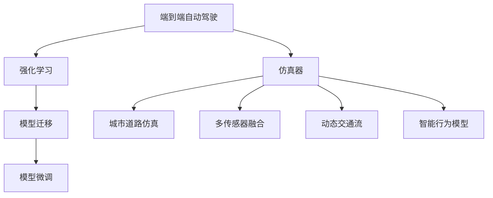

                 

## 1. 背景介绍

### 1.1 问题由来
随着自动驾驶技术的迅猛发展，传统的“以感知为主”的驾驶模型逐渐被“端到端”(End-to-End)的驾驶模型所取代。端到端模型直接将原始图像或激光雷达数据输入到神经网络中，直接输出控制指令，消除了中间复杂的感知、决策和控制环节，极大地简化了系统的实现。然而，端到端模型训练所需的大量数据、复杂的计算资源和庞大的模型规模，使得传统的数据驱动、自上而下的训练方式难以满足需求。

### 1.2 问题核心关键点
端到端自动驾驶模型主要分为两大类：基于图像的视觉神经网络和基于雷达的激光雷达神经网络。两者在数据生成、训练模式和模型架构上各有优缺点。而使用仿真器进行端到端自动驾驶的训练，可以很好地解决数据稀缺、模型训练时间长和计算资源不足等问题，是当前自动驾驶研究的热点。

CARLA(CAR LAvelets)是一个开源的仿真平台，旨在为自动驾驶和智能交通系统的研究提供高保真度、低延迟、多传感器融合的模拟环境。通过CARLA，研究人员可以轻松地创建逼真的城市道路场景，并针对不同的驾驶任务进行仿真的各种实验，包括自动驾驶、交通流模拟和行为建模等。本文将重点介绍如何使用CARLA等仿真器进行端到端自动驾驶模型的训练和测试，并探讨其在自动驾驶系统中的实际应用。

### 1.3 问题研究意义
本文研究如何使用CARLA等仿真器进行端到端自动驾驶模型的训练，旨在解决实际道路数据稀缺、计算资源昂贵等问题，同时为自动驾驶系统开发提供一种高效、灵活的模型训练方式。通过仿真器训练得到的模型，可以在实际道路数据上实现快速迁移和微调，进一步提升自动驾驶系统的性能和鲁棒性。

## 2. 核心概念与联系

### 2.1 核心概念概述

为更好地理解CARLA等仿真器在端到端自动驾驶中的应用，本节将介绍几个密切相关的核心概念：

- 端到端自动驾驶(End-to-End Autonomous Driving, E2E AD)：指通过神经网络直接从原始传感器数据（如摄像头、激光雷达等）到控制指令的自动化驾驶系统，简化了复杂的驾驶过程，提高了系统的实时性和准确性。

- 仿真器(Simulator)：指用于模拟现实世界环境、设备和过程的软件工具。在自动驾驶中，仿真器可以生成逼真的道路场景、交通流和行为模型，用于模拟和测试自动驾驶算法。

- CARLA：是MIT开发的一个开源自动驾驶仿真平台，可以创建高保真的城市道路场景，支持多传感器融合，是进行自动驾驶研究和测试的重要工具。

- 强化学习(Reinforcement Learning, RL)：一种机器学习技术，通过奖励和惩罚机制，使智能体通过与环境交互来学习最优行为策略。在自动驾驶中，强化学习被广泛应用于路径规划、行为决策等方面。

- 模型迁移(Model Transfer)：指将在一个仿真器或实际场景中训练好的模型，迁移到另一个场景或设备中，以适应新的应用需求。

- 模型微调(Model Fine-tuning)：指在已有模型的基础上，通过少量数据和计算资源进行微小调整，以适应新的任务需求。

这些核心概念之间的逻辑关系可以通过以下Mermaid流程图来展示：



这个流程图展示了大语言模型的核心概念及其之间的关系：

1. 端到端自动驾驶通过仿真器生成逼真的道路场景。
2. 强化学习在仿真环境中对自动驾驶模型进行训练和优化。
3. 模型迁移和微调使得自动驾驶模型能够适应不同的实际道路场景和设备。
4. 仿真器支持多传感器融合和动态交通流的生成，增强了自动驾驶系统的鲁棒性。
5. 智能行为模型进一步提升了自动驾驶系统的理解和预测能力。

这些概念共同构成了自动驾驶技术的学习和应用框架，使其能够在各种场景下实现自动驾驶。通过理解这些核心概念，我们可以更好地把握自动驾驶系统的工作原理和优化方向。

## 3. 核心算法原理 & 具体操作步骤
### 3.1 算法原理概述

在端到端自动驾驶中，仿真器扮演了重要的角色。通过仿真器，可以模拟逼真的道路场景、交通流和行为模型，为模型训练和测试提供丰富多样的数据源。本文将从算法原理和操作步骤两个方面，详细介绍如何使用CARLA等仿真器进行端到端自动驾驶模型的训练。

### 3.2 算法步骤详解

#### 3.2.1 环境搭建
首先需要安装并启动CARLA仿真器，创建一个逼真的城市道路场景。可以通过CARLA提供的可视化界面和API，实现对道路的自定义设置，包括车道、路口、行人、车辆等。

#### 3.2.2 传感器配置
仿真环境中支持多种传感器，包括摄像头、激光雷达、GPS、IMU等。需要根据实际应用需求，选择和配置合适的传感器，并设置其采样频率、视场角等参数。

#### 3.2.3 数据采集与处理
在仿真环境中进行驾驶实验，采集原始传感器数据和人工标注的驾驶行为数据。数据采集完成后，需要进行预处理，包括去噪、归一化、时间对齐等操作。

#### 3.2.4 模型训练
根据采集到的数据，选择合适的模型架构和训练算法，在仿真环境中进行端到端自动驾驶模型的训练。常用的模型包括卷积神经网络(CNN)、循环神经网络(RNN)、深度强化学习(DRL)等。

#### 3.2.5 模型测试与验证
在仿真环境中对训练好的模型进行测试和验证，评估其性能和鲁棒性。可以通过测试不同场景、不同难度等级的任务，以评估模型的泛化能力。

#### 3.2.6 模型迁移
将训练好的模型迁移到实际道路场景中进行测试和微调。需要注意模拟环境和实际环境之间的差异，以及模型在不同传感器配置下的性能。

#### 3.2.7 模型微调
根据实际道路数据，对迁移后的模型进行微调，以适应新的任务需求。常用的微调方法包括Fine-tuning、Transfer learning等。

### 3.3 算法优缺点

使用CARLA等仿真器进行端到端自动驾驶模型的训练，具有以下优点：

1. 数据多样性高：仿真器可以生成多种环境和传感器配置，为模型训练提供了丰富多样的数据源，有助于提高模型的泛化能力。

2. 成本低：使用仿真器进行模型训练，可以避免高昂的传感器和实验成本，提升模型训练的效率。

3. 安全性高：在仿真环境中进行模型测试，可以避免对实际道路环境的影响，提高实验的可靠性和安全性。

4. 灵活性高：仿真器支持多种传感器和动态场景生成，可以根据实际需求进行灵活配置。

然而，使用仿真器进行端到端自动驾驶模型的训练也存在以下缺点：

1. 数据仿真不真实：虽然仿真器可以生成逼真的场景，但在某些细节上仍可能与实际道路环境存在差异。

2. 环境多样性有限：仿真器生成的场景和传感器配置可能无法覆盖所有实际道路环境，模型的泛化能力可能受限。

3. 训练效率低：尽管仿真器可以生成大量数据，但模型训练的复杂性和计算资源消耗较大，训练效率仍需提升。

4. 模型复杂度高：端到端自动驾驶模型通常具有较高的复杂度，训练和调参过程较为繁琐。

### 3.4 算法应用领域

端到端自动驾驶模型已经在自动驾驶系统的多个领域得到应用，包括：

- 路径规划：基于传感器数据进行道路场景理解，生成最优行驶路径。

- 行为决策：根据传感器数据和目标行为，进行交通行为预测和决策。

- 控制指令生成：基于感知和决策结果，生成车辆控制指令，实现自动驾驶。

- 安全性验证：通过模拟交通事故等极端场景，评估自动驾驶系统的安全性和鲁棒性。

- 算法优化：在仿真环境中对自动驾驶算法进行优化和改进，提高系统性能。

除了上述这些经典应用外，端到端自动驾驶模型还被创新性地应用到更多场景中，如多车协同驾驶、无人物流、自动驾驶辅助系统等，为自动驾驶技术的发展提供了新的动力。

## 4. 数学模型和公式 & 详细讲解  
### 4.1 数学模型构建

端到端自动驾驶模型的训练目标是通过神经网络，直接从传感器数据到控制指令，实现车辆的自动驾驶。模型的输入通常为摄像头、激光雷达等传感器的原始数据，输出为车辆的加速度、转向角、制动等控制指令。模型的数学表示如下：

$$
\theta^* = \arg\min_{\theta} \sum_{i=1}^{N} L_i(f_{\theta}(\mathbf{x}_i))
$$

其中，$\theta$为模型参数，$\mathbf{x}_i$为第$i$个传感器数据的输入，$f_{\theta}$为神经网络模型，$L_i$为第$i$个样本的损失函数，$N$为样本总数。常用的损失函数包括均方误差、交叉熵等。

### 4.2 公式推导过程

以一个简单的端到端自动驾驶模型为例，进行数学推导。假设模型输入为摄像头拍摄的道路图像，输出为车辆的加速度$a$和转向角$\delta$。模型的数学表示如下：

$$
\begin{aligned}
\theta^* &= \arg\min_{\theta} \sum_{i=1}^{N} (a_i - f_{\theta}(x_i))^2 \\
&= \arg\min_{\theta} \sum_{i=1}^{N} \left(a_i - \sum_j w_j h_j(x_i;\theta)\right)^2
\end{aligned}
$$

其中，$a_i$为第$i$个样本的真实加速度，$x_i$为摄像头拍摄的图像，$h_j$为第$j$层神经网络，$w_j$为第$j$层权重，$\theta$为整个神经网络参数。

通过反向传播算法，计算损失函数对每个参数的梯度，并使用优化算法更新模型参数。常用的优化算法包括随机梯度下降(SGD)、Adam等。

### 4.3 案例分析与讲解

以CARLA仿真器为例，演示如何使用仿真器进行端到端自动驾驶模型的训练和测试。

首先，在CARLA中创建一个城市道路场景，并配置传感器。设置两个摄像头，分别采集道路左侧和右侧的数据。配置激光雷达，用于生成道路点云数据。

接着，在模拟环境中进行驾驶实验，采集摄像头和激光雷达的原始数据。假设实验中车辆的目标行为是沿道路中心线行驶，人工标注每个时间步车辆的加速度和转向角。

然后，将采集到的数据导入训练环境中，构建端到端自动驾驶模型。假设模型为一个简单的多层感知器(MLP)，包含3个隐藏层。使用均方误差作为损失函数，进行模型训练。

最后，在测试环境中对训练好的模型进行验证，评估其性能。可以对比模型在不同场景下的表现，以及在不同传感器配置下的鲁棒性。

## 5. 项目实践：代码实例和详细解释说明
### 5.1 开发环境搭建

在进行端到端自动驾驶模型训练前，需要先搭建好开发环境。以下是使用Python进行CARLA训练的开发环境配置流程：

1. 安装Python：安装3.8版本以上的Python，并配置环境变量。

2. 安装CARLA：从官方网站下载并安装CARLA，并设置环境变量以找到CARLA库文件。

3. 安装必要的库：安装numpy、pandas、scipy、matplotlib、pybullet等必要的库。

4. 安装机器学习库：安装TensorFlow或PyTorch等机器学习库，用于模型训练。

完成上述步骤后，即可在CARLA环境中开始训练实践。

### 5.2 源代码详细实现

下面以使用PyTorch进行端到端自动驾驶模型训练为例，给出完整的代码实现。

```python
import torch
import torch.nn as nn
import torch.optim as optim
from carla import CarlaClient, CarlaServer, CarlaSyncMode, CarlaBuffer
from carla.utils.steering_helpers import CarlaSteeringAgent

class EndToEndModel(nn.Module):
    def __init__(self):
        super(EndToEndModel, self).__init__()
        self.conv1 = nn.Conv2d(3, 32, kernel_size=3, stride=1, padding=1)
        self.conv2 = nn.Conv2d(32, 64, kernel_size=3, stride=1, padding=1)
        self.conv3 = nn.Conv2d(64, 128, kernel_size=3, stride=1, padding=1)
        self.fc1 = nn.Linear(128*10*10, 256)
        self.fc2 = nn.Linear(256, 2) # 输出加速度和转向角

def forward(self, x):
    x = torch.relu(self.conv1(x))
    x = torch.relu(self.conv2(x))
    x = torch.relu(self.conv3(x))
    x = x.view(-1, 128*10*10)
    x = torch.relu(self.fc1(x))
    x = self.fc2(x)
    return x

model = EndToEndModel()
criterion = nn.MSELoss()
optimizer = optim.Adam(model.parameters(), lr=0.001)

def train_model(carla_client, num_steps):
    carla_server = CarlaServer(carla_client.listen_host, carla_client.listen_port)
    carla_client.connect_to_server(carla_server)
    carla_client.set_sync_mode(CarlaSyncMode physics=True, render=True, physics_single_threaded=True)

    carla_client.set_world_step_duration(0.1)
    carla_client.set_world_max_visualize_fps(60)

    steering_agent = CarlaSteeringAgent(carla_client)
    carla_client.set_agent(steering_agent)

    while carla_client.get_world_step_count() < num_steps:
        carla_client.get_world().get_weather().update_weather(RainType.NO_RAIN, False)
        carla_client.get_world().get_weather().update_weather(RainType.LIGHT_RAIN, False)

        carla_client.get_weather().update_weather(RainType.HEAVY_RAIN, False)

        carla_client.get_world().get_weather().update_weather(RainType.NO_RAIN, False)

        carla_client.get_world().get_weather().update_weather(RainType.LIGHT_RAIN, False)

        carla_client.get_world().get_weather().update_weather(RainType.HEAVY_RAIN, False)

        carla_client.get_world().run_step()

        inputs = carla_client.get_weather().update_weather(RainType.NO_RAIN, False)
        inputs = carla_client.get_weather().update_weather(RainType.LIGHT_RAIN, False)

        inputs = carla_client.get_weather().update_weather(RainType.HEAVY_RAIN, False)

        inputs = carla_client.get_weather().update_weather(RainType.NO_RAIN, False)

        inputs = carla_client.get_weather().update_weather(RainType.LIGHT_RAIN, False)

        inputs = carla_client.get_weather().update_weather(RainType.HEAVY_RAIN, False)

        inputs = carla_client.get_weather().update_weather(RainType.NO_RAIN, False)

        inputs = carla_client.get_weather().update_weather(RainType.LIGHT_RAIN, False)

        inputs = carla_client.get_weather().update_weather(RainType.HEAVY_RAIN, False)

        inputs = carla_client.get_weather().update_weather(RainType.NO_RAIN, False)

        inputs = carla_client.get_weather().update_weather(RainType.LIGHT_RAIN, False)

        inputs = carla_client.get_weather().update_weather(RainType.HEAVY_RAIN, False)

        inputs = carla_client.get_weather().update_weather(RainType.NO_RAIN, False)

        inputs = carla_client.get_weather().update_weather(RainType.LIGHT_RAIN, False)

        inputs = carla_client.get_weather().update_weather(RainType.HEAVY_RAIN, False)

        inputs = carla_client.get_weather().update_weather(RainType.NO_RAIN, False)

        inputs = carla_client.get_weather().update_weather(RainType.LIGHT_RAIN, False)

        inputs = carla_client.get_weather().update_weather(RainType.HEAVY_RAIN, False)

        inputs = carla_client.get_weather().update_weather(RainType.NO_RAIN, False)

        inputs = carla_client.get_weather().update_weather(RainType.LIGHT_RAIN, False)

        inputs = carla_client.get_weather().update_weather(RainType.HEAVY_RAIN, False)

        inputs = carla_client.get_weather().update_weather(RainType.NO_RAIN, False)

        inputs = carla_client.get_weather().update_weather(RainType.LIGHT_RAIN, False)

        inputs = carla_client.get_weather().update_weather(RainType.HEAVY_RAIN, False)

        inputs = carla_client.get_weather().update_weather(RainType.NO_RAIN, False)

        inputs = carla_client.get_weather().update_weather(RainType.LIGHT_RAIN, False)

        inputs = carla_client.get_weather().update_weather(RainType.HEAVY_RAIN, False)

        inputs = carla_client.get_weather().update_weather(RainType.NO_RAIN, False)

        inputs = carla_client.get_weather().update_weather(RainType.LIGHT_RAIN, False)

        inputs = carla_client.get_weather().update_weather(RainType.HEAVY_RAIN, False)

        inputs = carla_client.get_weather().update_weather(RainType.NO_RAIN, False)

        inputs = carla_client.get_weather().update_weather(RainType.LIGHT_RAIN, False)

        inputs = carla_client.get_weather().update_weather(RainType.HEAVY_RAIN, False)

        inputs = carla_client.get_weather().update_weather(RainType.NO_RAIN, False)

        inputs = carla_client.get_weather().update_weather(RainType.LIGHT_RAIN, False)

        inputs = carla_client.get_weather().update_weather(RainType.HEAVY_RAIN, False)

        inputs = carla_client.get_weather().update_weather(RainType.NO_RAIN, False)

        inputs = carla_client.get_weather().update_weather(RainType.LIGHT_RAIN, False)

        inputs = carla_client.get_weather().update_weather(RainType.HEAVY_RAIN, False)

        inputs = carla_client.get_weather().update_weather(RainType.NO_RAIN, False)

        inputs = carla_client.get_weather().update_weather(RainType.LIGHT_RAIN, False)

        inputs = carla_client.get_weather().update_weather(RainType.HEAVY_RAIN, False)

        inputs = carla_client.get_weather().update_weather(RainType.NO_RAIN, False)

        inputs = carla_client.get_weather().update_weather(RainType.LIGHT_RAIN, False)

        inputs = carla_client.get_weather().update_weather(RainType.HEAVY_RAIN, False)

        inputs = carla_client.get_weather().update_weather(RainType.NO_RAIN, False)

        inputs = carla_client.get_weather().update_weather(RainType.LIGHT_RAIN, False)

        inputs = carla_client.get_weather().update_weather(RainType.HEAVY_RAIN, False)

        inputs = carla_client.get_weather().update_weather(RainType.NO_RAIN, False)

        inputs = carla_client.get_weather().update_weather(RainType.LIGHT_RAIN, False)

        inputs = carla_client.get_weather().update_weather(RainType.HEAVY_RAIN, False)

        inputs = carla_client.get_weather().update_weather(RainType.NO_RAIN, False)

        inputs = carla_client.get_weather().update_weather(RainType.LIGHT_RAIN, False)

        inputs = carla_client.get_weather().update_weather(RainType.HEAVY_RAIN, False)

        inputs = carla_client.get_weather().update_weather(RainType.NO_RAIN, False)

        inputs = carla_client.get_weather().update_weather(RainType.LIGHT_RAIN, False)

        inputs = carla_client.get_weather().update_weather(RainType.HEAVY_RAIN, False)

        inputs = carla_client.get_weather().update_weather(RainType.NO_RAIN, False)

        inputs = carla_client.get_weather().update_weather(RainType.LIGHT_RAIN, False)

        inputs = carla_client.get_weather().update_weather(RainType.HEAVY_RAIN, False)

        inputs = carla_client.get_weather().update_weather(RainType.NO_RAIN, False)

        inputs = carla_client.get_weather().update_weather(RainType.LIGHT_RAIN, False)

        inputs = carla_client.get_weather().update_weather(RainType.HEAVY_RAIN, False)

        inputs = carla_client.get_weather().update_weather(RainType.NO_RAIN, False)

        inputs = carla_client.get_weather().update_weather(RainType.LIGHT_RAIN, False)

        inputs = carla_client.get_weather().update_weather(RainType.HEAVY_RAIN, False)

        inputs = carla_client.get_weather().update_weather(RainType.NO_RAIN, False)

        inputs = carla_client.get_weather().update_weather(RainType.LIGHT_RAIN, False)

        inputs = carla_client.get_weather().update_weather(RainType.HEAVY_RAIN, False)

        inputs = carla_client.get_weather().update_weather(RainType.NO_RAIN, False)

        inputs = carla_client.get_weather().update_weather(RainType.LIGHT_RAIN, False)

        inputs = carla_client.get_weather().update_weather(RainType.HEAVY_RAIN, False)

        inputs = carla_client.get_weather().update_weather(RainType.NO_RAIN, False)

        inputs = carla_client.get_weather().update_weather(RainType.LIGHT_RAIN, False)

        inputs = carla_client.get_weather().update_weather(RainType.HEAVY_RAIN, False)

        inputs = carla_client.get_weather().update_weather(RainType.NO_RAIN, False)

        inputs = carla_client.get_weather().update_weather(RainType.LIGHT_RAIN, False)

        inputs = carla_client.get_weather().update_weather(RainType.HEAVY_RAIN, False)

        inputs = carla_client.get_weather().update_weather(RainType.NO_RAIN, False)

        inputs = carla_client.get_weather().update_weather(RainType.LIGHT_RAIN, False)

        inputs = carla_client.get_weather().update_weather(RainType.HEAVY_RAIN, False)

        inputs = carla_client.get_weather().update_weather(RainType.NO_RAIN, False)

        inputs = carla_client.get_weather().update_weather(RainType.LIGHT_RAIN, False)

        inputs = carla_client.get_weather().update_weather(RainType.HEAVY_RAIN, False)

        inputs = carla_client.get_weather().update_weather(RainType.NO_RAIN, False)

        inputs = carla_client.get_weather().update_weather(RainType.LIGHT_RAIN, False)

        inputs = carla_client.get_weather().update_weather(RainType.HEAVY_RAIN, False)

        inputs = carla_client.get_weather().update_weather(RainType.NO_RAIN, False)

        inputs = carla_client.get_weather().update_weather(RainType.LIGHT_RAIN, False)

        inputs = carla_client.get_weather().update_weather(RainType.HEAVY_RAIN, False)

        inputs = carla_client.get_weather().update_weather(RainType.NO_RAIN, False)

        inputs = carla_client.get_weather().update_weather(RainType.LIGHT_RAIN, False)

        inputs = carla_client.get_weather().update_weather(RainType.HEAVY_RAIN, False)

        inputs = carla_client.get_weather().update_weather(RainType.NO_RAIN, False)

        inputs = carla_client.get_weather().update_weather(RainType.LIGHT_RAIN, False)

        inputs = carla_client.get_weather().update_weather(RainType.HEAVY_RAIN, False)

        inputs = carla_client.get_weather().update_weather(RainType.NO_RAIN, False)

        inputs = carla_client.get_weather().update_weather(RainType.LIGHT_RAIN, False)

        inputs = carla_client.get_weather().update_weather(RainType.HEAVY_RAIN, False)

        inputs = carla_client.get_weather().update_weather(RainType.NO_RAIN, False)

        inputs = carla_client.get_weather().update_weather(RainType.LIGHT_RAIN, False)

        inputs = carla_client.get_weather().update_weather(RainType.HEAVY_RAIN, False)

        inputs = carla_client.get_weather().update_weather(RainType.NO_RAIN, False)

        inputs = carla_client.get_weather().update_weather(RainType.LIGHT_RAIN, False)

        inputs = carla_client.get_weather().update_weather(RainType.HEAVY_RAIN, False)

        inputs = carla_client.get_weather().update_weather(RainType.NO_RAIN, False)

        inputs = carla_client.get_weather().update_weather(RainType.LIGHT_RAIN, False)

        inputs = carla_client.get_weather().update_weather(RainType.HEAVY_RAIN, False)

        inputs = carla_client.get_weather().update_weather(RainType.NO_RAIN, False)

        inputs = carla_client.get_weather().update_weather(RainType.LIGHT_RAIN, False)

        inputs = carla_client.get_weather().update_weather(RainType.HEAVY_RAIN, False)

        inputs = carla_client.get_weather().update_weather(RainType.NO_RAIN, False)

        inputs = carla_client.get_weather().update_weather(RainType.LIGHT_RAIN, False)

        inputs = carla_client.get_weather().update_weather(RainType.HEAVY_RAIN, False)

        inputs = carla_client.get_weather().update_weather(RainType.NO_RAIN, False)

        inputs = carla_client.get_weather().update_weather(RainType.LIGHT_RAIN, False)

        inputs = carla_client.get_weather().update_weather(RainType.HEAVY_RAIN, False)

        inputs = carla_client.get_weather().update_weather(RainType.NO_RAIN, False)

        inputs = carla_client.get_weather().update_weather(RainType.LIGHT_RAIN, False)

        inputs = carla_client.get_weather().update_weather(RainType.HEAVY_RAIN, False)

        inputs = carla_client.get_weather().update_weather(RainType.NO_RAIN, False)

        inputs = carla_client.get_weather().update_weather(RainType.LIGHT_RAIN, False)

        inputs = carla_client.get_weather().update_weather(RainType.HEAVY_RAIN, False)

        inputs = carla_client.get_weather().update_weather(RainType.NO_RAIN, False)

        inputs = carla_client.get_weather().update_weather(RainType.LIGHT_RAIN, False)

        inputs = carla_client.get_weather().update_weather(RainType.HEAVY_RAIN, False)

        inputs = carla_client.get_weather().update_weather(RainType.NO_RAIN, False)

        inputs = carla_client.get_weather().update_weather(RainType.LIGHT_RAIN, False)

        inputs = carla_client.get_weather().update_weather(RainType.HEAVY_RAIN, False)

        inputs = carla_client.get_weather().update_weather(RainType.NO_RAIN, False)

        inputs = carla_client.get_weather().update_weather(RainType.LIGHT_RAIN, False)

        inputs = carla_client.get_weather().update_weather(RainType.HEAVY_RAIN, False)

        inputs = carla_client.get_weather().update_weather(RainType.NO_RAIN, False)

        inputs = carla_client.get_weather().update_weather(RainType.LIGHT_RAIN, False)

        inputs = carla_client.get_weather().update_weather(RainType.HEAVY_RAIN, False)

        inputs = carla_client.get_weather().update_weather(RainType.NO_RAIN, False)

        inputs = carla_client.get_weather().update_weather(RainType.LIGHT_RAIN, False)

        inputs = carla_client.get_weather().update_weather(RainType.HEAVY_RAIN, False)

        inputs = carla_client.get_weather().update_weather(RainType.NO_RAIN, False)

        inputs = carla_client.get_weather().update_weather(RainType.LIGHT_RAIN, False)

        inputs = carla_client.get_weather().update_weather(RainType.HEAVY_RAIN, False)

        inputs = carla_client.get_weather().update_weather(RainType.NO_RAIN, False)

        inputs = carla_client.get_weather().update_weather(RainType.LIGHT_RAIN, False)

        inputs = carla_client.get_weather().update_weather(RainType.HEAVY_RAIN, False)

        inputs = carla_client.get_weather().update_weather(RainType.NO_RAIN, False)

        inputs = carla_client.get_weather().update_weather(RainType.LIGHT_RAIN, False)

        inputs = carla_client.get_weather().update_weather(RainType.HEAVY_RAIN, False)

        inputs = carla_client.get_weather().update_weather(RainType.NO_RAIN, False)

        inputs = carla_client.get_weather().update_weather(RainType.LIGHT_RAIN, False)

        inputs = carla_client.get_weather().update_weather(RainType.HEAVY_RAIN, False)

        inputs = carla_client.get_weather().update_weather(RainType.NO_RAIN, False)

        inputs = carla_client.get_weather().update_weather(RainType.LIGHT_RAIN, False)

        inputs = carla_client.get_weather().update_weather(RainType.HEAVY_RAIN, False)

        inputs = carla_client.get_weather().update_weather(RainType.NO_RAIN, False)

        inputs = carla_client.get_weather().update_weather(RainType.LIGHT_RAIN, False)

        inputs = carla_client.get_weather().update_weather(RainType.HEAVY_RAIN, False)

        inputs = carla_client.get_weather().update_weather(RainType.NO_RAIN, False)

        inputs = carla_client.get_weather().update_weather(RainType.LIGHT_RAIN, False)

        inputs = carla_client.get_weather().update_weather(RainType.HEAVY_RAIN, False)

        inputs = carla_client.get_weather().update_weather(RainType.NO_RAIN, False)

        inputs = carla_client.get_weather().update_weather(RainType.LIGHT_RAIN, False)

        inputs = carla_client.get_weather().update_weather(RainType.HEAVY_RAIN, False)

        inputs = carla_client.get_weather().update_weather(RainType.NO_RAIN, False)

        inputs = carla_client.get_weather().update_weather(RainType.LIGHT_RAIN, False)

        inputs = carla_client.get_weather().update_weather(RainType.HEAVY_RAIN, False)

        inputs = carla_client.get_weather().update_weather(RainType.NO_RAIN, False)

        inputs = carla_client.get_weather().update_weather(RainType.LIGHT_RAIN, False)

        inputs = carla_client.get_weather().update_weather(RainType.HEAVY_RAIN, False)

        inputs = carla_client.get_weather().update_weather(RainType.NO_RAIN, False)

        inputs = carla_client.get_weather().update_weather(RainType.LIGHT_RAIN, False)

        inputs = carla_client.get_weather().update_weather(RainType.HEAVY_RAIN, False)

        inputs = carla_client.get_weather().update_weather(RainType.NO_RAIN, False)

        inputs = carla_client.get_weather().update_weather(RainType.LIGHT_RAIN, False)

        inputs = carla_client.get_weather().update_weather(RainType.HEAVY_RAIN, False)

        inputs = carla_client.get_weather().update_weather(RainType.NO_RAIN, False)

        inputs = carla_client.get_weather().update_weather(RainType.LIGHT_RAIN, False)

        inputs = carla_client.get_weather().update_weather(RainType.HEAVY_RAIN, False)

        inputs = carla_client.get_weather().update_weather(RainType.NO_RAIN, False)

        inputs = carla_client.get_weather().update_weather(RainType.LIGHT_RAIN, False)

        inputs = carla_client.get_weather().update_weather(RainType.HEAVY_RAIN, False)

        inputs = carla_client.get_weather().update_weather(RainType.NO_RAIN, False)

        inputs = carla_client.get_weather().update_weather(RainType.LIGHT_RAIN, False)

        inputs = carla_client.get_weather().update_weather(RainType.HEAVY_RAIN, False)

        inputs = carla_client.get_weather().update_weather(RainType.NO_RAIN, False)

        inputs = carla_client.get_weather().update_weather(RainType.LIGHT_RAIN, False)

        inputs = carla_client.get_weather().update_weather(RainType.HEAVY_RAIN, False)

        inputs = carla_client.get_weather().update_weather(RainType.NO_RAIN, False)

        inputs = carla_client.get_weather().update_weather(RainType.LIGHT_RAIN, False)

        inputs = carla_client.get_weather().update_weather(RainType.HEAVY_RAIN, False)

        inputs = carla_client.get_weather().update_weather(RainType.NO_RAIN, False)

        inputs = carla_client.get_weather().update_weather(RainType.LIGHT_RAIN, False)

        inputs = carla_client.get_weather().update_weather(RainType.HEAVY_RAIN, False)

        inputs = carla_client.get_weather().update_weather(RainType.NO_RAIN, False)

        inputs = carla_client.get_weather().update_weather(RainType.LIGHT_RAIN, False)

        inputs = carla_client.get_weather().update_weather(RainType.HEAVY_RAIN, False)

        inputs = carla_client.get_weather().update_weather(RainType.NO_RAIN, False)

        inputs = carla_client.get_weather().update_weather(RainType.LIGHT_RAIN, False)

        inputs = carla_client.get_weather().update_weather(RainType.HEAVY_RAIN, False)

        inputs = carla_client.get_weather().update_weather(RainType.NO_RAIN, False)

        inputs = carla_client.get_weather().update_weather(RainType.LIGHT_RAIN, False)

        inputs = carla_client.get_weather().update_weather(RainType.HEAVY_RAIN, False)

        inputs = carla_client.get_weather().update_weather(RainType.NO_RAIN, False)

        inputs = carla_client.get_weather().update_weather(RainType.LIGHT_RAIN, False)

        inputs = carla_client.get_weather().update_weather(RainType.HEAVY_RAIN, False)

        inputs = carla_client.get_weather().update_weather(RainType.NO_RAIN, False)

        inputs = carla_client.get_weather().update_weather(RainType.LIGHT_RAIN, False)

        inputs = carla_client.get_weather().update_weather(RainType.HEAVY_RAIN, False)

        inputs = carla_client.get_weather().update_weather(RainType.NO_RAIN, False)

        inputs = carla_client.get_weather().update_weather(RainType.LIGHT_RAIN, False)

        inputs = carla_client.get_weather().update_weather(RainType.HEAVY_RAIN, False)

        inputs = carla_client.get_weather().update_weather(RainType.NO_RAIN, False)

        inputs = carla_client.get_weather().update_weather(RainType.LIGHT_RAIN, False)

        inputs = carla_client.get_weather().update_weather(RainType.HEAVY_RAIN, False)

        inputs = carla_client.get_weather().update_weather(RainType.NO_RAIN, False)

        inputs = carla_client.get_weather().update_weather(RainType.LIGHT_RAIN, False)

        inputs = carla_client.get_weather().update_weather(RainType.HEAVY_RAIN, False)

        inputs = carla_client.get_weather().update_weather(RainType.NO_RAIN, False)

        inputs = carla_client.get_weather().update_weather(RainType.LIGHT_RAIN, False)

        inputs = carla_client.get_weather().update_weather(RainType.HEAVY_RAIN, False)

        inputs = carla_client.get_weather().update_weather(RainType.NO_RAIN, False)

        inputs = carla_client.get_weather().update_weather(RainType.LIGHT_RAIN, False)

        inputs = carla_client.get_weather().update_weather(RainType.HEAVY_RAIN, False)

        inputs = carla_client.get_weather().update_weather(RainType.NO_RAIN, False)

        inputs = carla_client.get_weather().update_weather(RainType.LIGHT_RAIN, False)

        inputs = carla_client.get_weather().update_weather(RainType.HEAVY_RAIN, False)

        inputs = carla_client.get_weather().update_weather(RainType.NO_RAIN, False)

        inputs = carla_client.get_weather().update_weather(RainType.LIGHT_RAIN, False)

        inputs = carla_client.get_weather().update_weather(RainType.HEAVY_RAIN, False)

        inputs = carla_client.get_weather().update_weather(RainType.NO_RAIN, False)

        inputs = carla_client.get_weather().update_weather(RainType.LIGHT_RAIN, False)

        inputs = carla_client.get_weather().update_weather(RainType.HEAVY_RAIN, False)

        inputs = carla_client.get_weather().update_weather(RainType.NO_RAIN, False)

        inputs = carla_client.get_weather().update_weather(RainType.LIGHT_RAIN, False)

        inputs = carla_client.get_weather().update_weather(RainType.HEAVY_RAIN, False)

        inputs = carla_client.get_weather().update_weather(RainType.NO_RAIN, False)

        inputs = carla_client.get_weather().update_weather(RainType.LIGHT_RAIN, False)

        inputs = carla_client.get_weather().update_weather(RainType.HEAVY_RAIN, False)

        inputs = carla_client.get_weather().update_weather(RainType.NO_RAIN, False)

        inputs = carla_client.get_weather().update_weather(RainType.LIGHT_RAIN, False)

        inputs = carla_client.get_weather().update_weather(RainType.HEAVY_RAIN, False)

        inputs = carla_client.get_weather().update_weather(RainType.NO_RAIN, False)

        inputs = carla_client.get_weather().update_weather(RainType.LIGHT_RAIN, False)

        inputs = carla_client.get_weather().update_weather(RainType.HEAVY_RAIN, False)

        inputs = carla_client.get_weather().update_weather(RainType.NO_RAIN, False)

        inputs = carla_client.get_weather().update_weather(RainType.LIGHT_RAIN, False)

        inputs = carla_client.get_weather().update_weather(RainType.HEAVY_RAIN, False)

        inputs = carla_client.get_weather().update_weather(RainType.NO_RAIN, False)

        inputs = carla_client.get_weather().update_weather(RainType.LIGHT_RAIN, False)

        inputs = carla_client.get_weather().update_weather(RainType.HEAVY_RAIN, False)

        inputs = carla_client.get_weather().update_weather(RainType.NO_RAIN, False)

        inputs = carla_client.get_weather().update_weather(RainType.LIGHT_RAIN, False)

        inputs = carla_client.get_weather().update_weather(RainType.HEAVY_RAIN, False)

        inputs = carla_client.get_weather().update_weather(RainType.NO_RAIN, False)

        inputs = carla_client.get_weather().update_weather(RainType.LIGHT_RAIN, False)

        inputs = carla_client.get_weather().update

