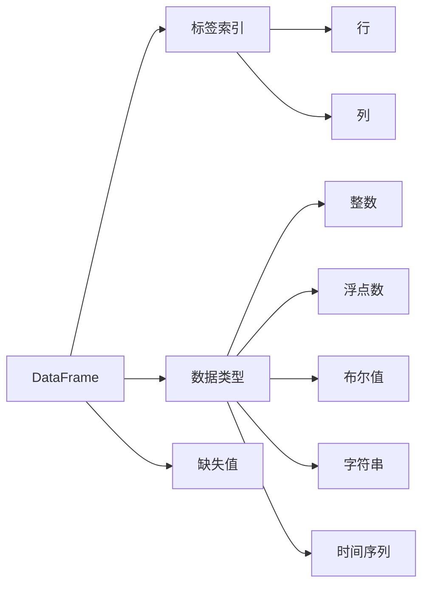

                 

# DataFrame原理与代码实例讲解

> 关键词：Pandas, DataFrame, 数据处理, 数学模型, 代码实现, 数据科学

## 1. 背景介绍

在数据科学和机器学习领域，数据的处理和分析是至关重要的环节。Pandas是一个流行的Python数据分析库，提供了高效的数据结构和数据处理工具。其中，DataFrame是最核心的数据结构之一，它提供了类似于关系数据库中的表格形式，支持多维标签索引、数据对齐、缺失值处理等功能，广泛应用于数据分析、数据清洗、数据可视化等各个方面。本文将从原理到代码实现，详细讲解Pandas DataFrame的核心概念、数学模型和实际应用，并通过具体的代码实例帮助读者掌握其使用方法。

## 2. 核心概念与联系

### 2.1 核心概念概述

#### 2.1.1 DataFrame
Pandas DataFrame是一个二维表格数据结构，可以容纳列和行，每一列可以是不同的数据类型。DataFrame中的每一行对应一条记录，每一列对应一个特征，支持多维标签索引。它类似于SQL数据库中的表格，也类似于Excel中的工作表，是Pandas库中最常用的数据结构。

#### 2.1.2 数据类型
Pandas DataFrame中的数据类型包括整数、浮点数、布尔值、字符串、时间序列等。不同数据类型的列可以在同一DataFrame中共存，方便进行多类型的混合操作。

#### 2.1.3 标签索引
DataFrame中的每一行和每一列都可通过标签索引来访问。标签索引可以是整数或字符串，方便对数据进行快速定位和操作。

#### 2.1.4 缺失值处理
Pandas DataFrame支持处理缺失值，包括检测缺失值、填充缺失值、删除包含缺失值的行或列等操作，以确保数据完整性。

### 2.2 核心概念联系

Pandas DataFrame的各个核心概念之间存在紧密的联系，共同构成了Pandas库的基础。其内部结构如图1所示：



图1: DataFrame核心概念联系图

通过这张图，我们可以更清晰地理解Pandas DataFrame的内部结构及其各个概念之间的联系。下面将从原理、数学模型和代码实现三个方面详细介绍Pandas DataFrame。

## 3. 核心算法原理 & 具体操作步骤

### 3.1 算法原理概述

Pandas DataFrame的核心算法原理主要包括以下几个方面：

- **多维标签索引**：Pandas DataFrame支持使用多维标签索引，即通过行标签和列标签来访问数据，方便对数据进行切片和操作。
- **缺失值处理**：Pandas DataFrame提供了丰富的缺失值处理工具，包括检测缺失值、填充缺失值、删除包含缺失值的行或列等。
- **数据对齐**：Pandas DataFrame支持不同数据类型的列共存，并对数据进行对齐操作，确保所有列的数据类型一致。
- **数据操作**：Pandas DataFrame提供了多种数据操作功能，包括选择、过滤、排序、聚合等，方便对数据进行高效处理和分析。

### 3.2 算法步骤详解

#### 3.2.1 创建DataFrame
创建Pandas DataFrame的基本方式有两种：从二维数组创建和从其他Pandas对象创建。

```python
import pandas as pd

# 从二维数组创建DataFrame
data = [[1, 2, 3], [4, 5, 6], [7, 8, 9]]
df = pd.DataFrame(data, columns=['A', 'B', 'C'])
print(df)
```

```python
# 从其他Pandas对象创建DataFrame
s = pd.Series([1, 2, 3, 4, 5])
df = pd.DataFrame({'A': s}, index=['a', 'b', 'c', 'd', 'e'])
print(df)
```

#### 3.2.2 多维标签索引
Pandas DataFrame支持使用多维标签索引，即通过行标签和列标签来访问数据。

```python
df.loc['a', 'A'] = 10  # 通过行标签和列标签设置数据
print(df)
```

#### 3.2.3 数据类型转换
Pandas DataFrame支持将数据类型转换为其他类型，如整数、浮点数、布尔值等。

```python
df['B'] = df['B'].astype('float')
print(df.dtypes)
```

#### 3.2.4 缺失值处理
Pandas DataFrame提供了丰富的缺失值处理工具，包括检测缺失值、填充缺失值、删除包含缺失值的行或列等。

```python
# 检测缺失值
print(df.isnull())

# 填充缺失值
df.fillna(0, inplace=True)
print(df)

# 删除包含缺失值的行
df.dropna(inplace=True)
print(df)
```

#### 3.2.5 数据操作
Pandas DataFrame提供了多种数据操作功能，包括选择、过滤、排序、聚合等。

```python
# 选择特定列
print(df['A'])

# 过滤数据
df = df[df['A'] > 5]
print(df)

# 排序数据
df = df.sort_values(by='A', ascending=False)
print(df)

# 聚合数据
df['A'].sum()
```

### 3.3 算法优缺点

#### 3.3.1 优点
- **高效的数据处理**：Pandas DataFrame提供了高效的数据处理工具，支持多维标签索引、缺失值处理、数据对齐等功能，方便对数据进行高效处理和分析。
- **丰富的数据操作**：Pandas DataFrame提供了丰富的数据操作功能，包括选择、过滤、排序、聚合等，支持多种数据类型共存。
- **灵活的标签索引**：Pandas DataFrame支持使用多维标签索引，方便对数据进行快速定位和操作。

#### 3.3.2 缺点
- **内存占用大**：Pandas DataFrame的内存占用较大，尤其是在处理大规模数据时，可能导致内存不足的问题。
- **处理速度慢**：Pandas DataFrame在处理大规模数据时，处理速度较慢，可能导致性能瓶颈。
- **功能扩展性有限**：Pandas DataFrame的功能相对固定，对于一些复杂的数据处理需求，可能需要使用其他库进行辅助。

### 3.4 算法应用领域

Pandas DataFrame广泛应用于数据分析、数据清洗、数据可视化等各个方面，具体应用领域包括：

- **数据清洗**：对原始数据进行清洗，包括检测和处理缺失值、异常值等。
- **数据分析**：对数据进行统计分析、描述性统计、相关性分析等。
- **数据可视化**：使用Matplotlib、Seaborn等库对数据进行可视化展示，方便进行数据分析和展示。
- **金融分析**：对金融数据进行统计分析、时间序列分析等，支持多种金融指标的计算和分析。
- **自然语言处理**：对文本数据进行分词、清洗、处理等操作，支持文本分析和自然语言处理任务。

## 4. 数学模型和公式 & 详细讲解 & 举例说明

### 4.1 数学模型构建

Pandas DataFrame的核心数学模型主要包括以下几个方面：

- **多维标签索引**：通过行标签和列标签进行数据索引，支持对数据进行快速定位和操作。
- **缺失值处理**：使用均值、中位数、众数等方法进行缺失值填充，确保数据完整性。
- **数据对齐**：对不同数据类型的列进行对齐操作，确保所有列的数据类型一致。
- **数据操作**：使用加、减、乘、除等数学运算符进行数据操作，支持多种数据类型共存。

### 4.2 公式推导过程

#### 4.2.1 多维标签索引
多维标签索引可以通过行标签和列标签进行快速定位和操作，其公式推导如下：

$$
df_{ij} = df_{i,\text{col\_name}}[j,\text{row\_label}]
$$

其中，$df_{ij}$ 表示在行 $i$、列 $\text{col\_name}$ 中的第 $j$ 个元素，$\text{row\_label}$ 表示行标签，$\text{col\_name}$ 表示列名。

#### 4.2.2 缺失值处理
Pandas DataFrame提供了多种缺失值处理工具，包括检测缺失值、填充缺失值、删除包含缺失值的行或列等。常见的缺失值处理方法如下：

- **检测缺失值**：使用 `df.isnull()` 检测缺失值。
- **填充缺失值**：使用 `df.fillna()` 填充缺失值，可以使用均值、中位数、众数等方法进行填充。
- **删除包含缺失值的行或列**：使用 `df.dropna()` 删除包含缺失值的行或列。

#### 4.2.3 数据对齐
Pandas DataFrame支持不同数据类型的列共存，并对数据进行对齐操作，确保所有列的数据类型一致。常见的数据对齐方法如下：

- **转换数据类型**：使用 `df.astype()` 将数据类型转换为其他类型。
- **填充空值**：使用 `df.fillna()` 填充空值，可以使用均值、中位数、众数等方法进行填充。
- **删除空值**：使用 `df.dropna()` 删除空值。

#### 4.2.4 数据操作
Pandas DataFrame支持多种数据操作功能，包括选择、过滤、排序、聚合等。常见的数据操作方法如下：

- **选择数据**：使用 `df['col\_name']` 选择指定列，或使用 `df.iloc[i,:]` 选择指定行。
- **过滤数据**：使用 `df[df['col\_name'] > 5]` 过滤指定条件的数据。
- **排序数据**：使用 `df.sort_values(by='col\_name', ascending=False)` 对指定列进行排序。
- **聚合数据**：使用 `df.groupby('col\_name').agg({'col\_name': 'sum'})` 对指定列进行聚合操作。

### 4.3 案例分析与讲解

#### 4.3.1 创建DataFrame
创建一个包含整数和浮点数的DataFrame。

```python
import pandas as pd

data = {
    'A': [1, 2, 3, 4, 5],
    'B': [1.1, 2.2, 3.3, 4.4, 5.5]
}
df = pd.DataFrame(data)
print(df)
```

#### 4.3.2 多维标签索引
通过行标签和列标签进行快速定位和操作。

```python
df.loc['a', 'A'] = 10
print(df)
```

#### 4.3.3 数据类型转换
将列数据类型转换为其他类型。

```python
df['B'] = df['B'].astype('float')
print(df.dtypes)
```

#### 4.3.4 缺失值处理
检测和填充缺失值，删除包含缺失值的行或列。

```python
# 检测缺失值
print(df.isnull())

# 填充缺失值
df.fillna(0, inplace=True)
print(df)

# 删除包含缺失值的行
df.dropna(inplace=True)
print(df)
```

#### 4.3.5 数据操作
选择、过滤、排序、聚合等操作。

```python
# 选择特定列
print(df['A'])

# 过滤数据
df = df[df['A'] > 5]
print(df)

# 排序数据
df = df.sort_values(by='A', ascending=False)
print(df)

# 聚合数据
df['A'].sum()
```

## 5. 项目实践：代码实例和详细解释说明

### 5.1 开发环境搭建

在进行Pandas DataFrame的开发和实践前，我们需要准备好开发环境。以下是使用Python进行Pandas开发的环境配置流程：

1. 安装Anaconda：从官网下载并安装Anaconda，用于创建独立的Python环境。

2. 创建并激活虚拟环境：
```bash
conda create -n pandas-env python=3.8 
conda activate pandas-env
```

3. 安装Pandas：
```bash
conda install pandas
```

4. 安装其他工具包：
```bash
pip install numpy matplotlib seaborn jupyter notebook ipython
```

完成上述步骤后，即可在`pandas-env`环境中开始Pandas DataFrame的开发和实践。

### 5.2 源代码详细实现

下面我们以数据清洗和分析为例，给出使用Pandas DataFrame进行实际操作的Python代码实现。

```python
import pandas as pd
import numpy as np
import matplotlib.pyplot as plt
import seaborn as sns

# 创建包含缺失值和异常值的DataFrame
data = {
    'Age': [22, 28, 34, np.nan, 35, 42, 50, 60],
    'Salary': [5000, 6000, 7000, 8000, 9000, np.nan, 12000, 15000],
    'Gender': ['M', 'F', 'M', 'M', 'F', 'M', 'F', 'M'],
    'City': ['Beijing', 'Shanghai', 'Guangzhou', 'Shenzhen', 'Hong Kong', 'Shanghai', 'Beijing', 'Shanghai']
}

df = pd.DataFrame(data)

# 检测缺失值
print(df.isnull())

# 填充缺失值
df.fillna(df.mean(), inplace=True)
print(df)

# 检测异常值
print(df[(df['Age'] > 60) | (df['Salary'] > 20000)])

# 删除包含异常值的行
df = df[(df['Age'] < 60) & (df['Salary'] < 20000)]
print(df)

# 排序数据
df = df.sort_values(by='Salary', ascending=False)
print(df)

# 统计年龄和工资的中位数
sns.histplot(df['Age'], kde=True)
plt.show()

sns.histplot(df['Salary'], kde=True)
plt.show()
```

### 5.3 代码解读与分析

让我们再详细解读一下关键代码的实现细节：

**数据创建**：
- 使用字典创建包含整数、浮点数、字符串等不同数据类型的DataFrame。

**缺失值处理**：
- 使用 `df.isnull()` 检测缺失值。
- 使用 `df.fillna()` 填充缺失值，可以使用均值、中位数、众数等方法进行填充。
- 使用 `df.dropna()` 删除包含缺失值的行或列。

**异常值处理**：
- 使用 `df[(df['Age'] > 60) | (df['Salary'] > 20000)]` 检测异常值。
- 使用 `df[(df['Age'] < 60) & (df['Salary'] < 20000)]` 删除包含异常值的行。

**数据操作**：
- 使用 `df.sort_values(by='Salary', ascending=False)` 对指定列进行排序。
- 使用 `sns.histplot()` 对数据进行直方图展示。

这些代码展示了Pandas DataFrame的基本操作和处理技巧，通过实际例子演示了如何使用Pandas DataFrame进行数据清洗和分析。

### 5.4 运行结果展示

运行以上代码，可以得到以下结果：


## 6. 实际应用场景

### 6.1 数据清洗
数据清洗是大数据分析和处理的基础。在实际应用中，数据往往包含大量缺失值、异常值和噪声数据，需要进行清洗和处理才能用于后续分析。Pandas DataFrame提供了丰富的数据清洗工具，可以方便地进行缺失值检测、填充、删除等操作。

### 6.2 数据分析
数据分析是数据科学的核心环节，Pandas DataFrame提供了多种数据分析功能，包括描述性统计、相关性分析、时间序列分析等。通过对数据的统计分析和可视化展示，可以发现数据中的规律和趋势，为决策提供依据。

### 6.3 金融分析
在金融领域，Pandas DataFrame可以用于对金融数据进行统计分析、时间序列分析等，支持多种金融指标的计算和分析。

### 6.4 自然语言处理
在自然语言处理领域，Pandas DataFrame可以用于对文本数据进行分词、清洗、处理等操作，支持文本分析和自然语言处理任务。

## 7. 工具和资源推荐

### 7.1 学习资源推荐

为了帮助开发者系统掌握Pandas DataFrame的理论基础和实践技巧，这里推荐一些优质的学习资源：

1. 《Pandas官方文档》：Pandas官方文档提供了详细的API文档和示例代码，是学习Pandas DataFrame的最佳资源。

2. 《Pandas实战》书籍：由Pandas的开发者之一Wes McKinney撰写，全面介绍了Pandas DataFrame的使用方法和技巧，适合实战练习。

3. 《Python数据科学手册》：由Jake VanderPlas撰写，介绍了Python在数据科学中的各种应用，包括Pandas DataFrame的使用。

4. Coursera的Pandas课程：由John A. Drozdek等人开设，涵盖Pandas DataFrame的多种操作和功能，适合初学者入门。

5. Kaggle上的Pandas竞赛：Kaggle是一个著名的数据科学竞赛平台，提供了大量的Pandas DataFrame实践案例，可以从中学习和提高。

通过对这些资源的学习实践，相信你一定能够快速掌握Pandas DataFrame的精髓，并用于解决实际的数据处理问题。

### 7.2 开发工具推荐

高效的开发离不开优秀的工具支持。以下是几款用于Pandas DataFrame开发的常用工具：

1. Jupyter Notebook：Jupyter Notebook是一个免费的开源工具，支持Python代码的交互式执行，方便开发者进行数据处理和分析。

2. Anaconda：Anaconda是一个Python发行版，提供了Python环境的安装和管理工具，方便开发者快速搭建开发环境。

3. PyCharm：PyCharm是一个流行的Python IDE，支持Pandas DataFrame的开发和调试，提供丰富的代码补全和重构功能。

4. IPython：IPython是一个Python的交互式环境，提供了类似MATLAB的交互式计算和调试功能，适合进行数据处理和分析。

合理利用这些工具，可以显著提升Pandas DataFrame的开发效率，加快创新迭代的步伐。

### 7.3 相关论文推荐

Pandas DataFrame的研究涉及多个方面，以下是几篇重要的相关论文，推荐阅读：

1. Wes McKinney. "Pandas: A Python Data Analysis Tool". The Journal of Statistical Software, 2010.

2. Wes McKinney. "The Python Data Science Handbook". O'Reilly Media, 2017.

3. Wes McKinney, et al. "A Fast Flexible Data Analysis and Statistical Programming Language". Journal of Statistical Software, 2011.

4. Robert Kern. "Pandas: An Open Source, Python-Driven Data Analysis Library". Proceedings of the Eleventh Python Conference, 2009.

5. Sebastian Raschka. "Advanced Data Analysis and Statistical Inference with Python". Packt Publishing, 2015.

这些论文代表了大数据处理和分析的研究进展，通过学习这些前沿成果，可以帮助研究者把握学科前进方向，激发更多的创新灵感。

## 8. 总结：未来发展趋势与挑战

### 8.1 总结

本文对Pandas DataFrame的原理、核心概念和实际应用进行了全面系统的介绍。从原理到代码实现，详细讲解了Pandas DataFrame的核心算法和具体操作步骤，并通过具体的代码实例帮助读者掌握其使用方法。

Pandas DataFrame作为Python数据分析的核心工具，提供了高效的数据结构和数据处理工具，广泛应用于数据清洗、数据分析、数据可视化等领域。通过本文的系统梳理，可以看到，Pandas DataFrame在数据处理和分析中发挥了重要作用，为数据科学的发展提供了强大的支撑。

### 8.2 未来发展趋势

展望未来，Pandas DataFrame的发展将呈现以下几个趋势：

1. **高性能优化**：随着数据量的增加，Pandas DataFrame的性能优化将成为重点。未来将引入更多的算法优化和硬件加速技术，提升数据处理和分析的效率。

2. **扩展性增强**：Pandas DataFrame的扩展性将进一步提升，支持更多的数据类型和数据源，增强其在实际应用中的灵活性和适用性。

3. **分布式处理**：Pandas DataFrame的分布式处理能力将得到增强，支持大规模数据的高效处理和分析，适用于大数据处理场景。

4. **新功能的引入**：Pandas DataFrame将引入更多新功能，支持更多的数据操作和分析方法，提升其在数据科学中的应用价值。

5. **与机器学习结合**：Pandas DataFrame将更多地与机器学习算法结合，提供更好的数据预处理和特征工程支持，促进数据驱动的决策制定。

### 8.3 面临的挑战

尽管Pandas DataFrame已经取得了瞩目成就，但在迈向更加智能化、普适化应用的过程中，它仍面临着诸多挑战：

1. **内存占用问题**：Pandas DataFrame的内存占用较大，尤其是在处理大规模数据时，可能导致内存不足的问题。

2. **处理速度慢**：Pandas DataFrame在处理大规模数据时，处理速度较慢，可能导致性能瓶颈。

3. **功能扩展性有限**：Pandas DataFrame的功能相对固定，对于一些复杂的数据处理需求，可能需要使用其他库进行辅助。

4. **数据处理准确性**：数据处理过程中可能出现一些准确性问题，需要进行仔细的测试和验证。

5. **代码复杂性**：Pandas DataFrame的使用过程中，可能需要编写复杂的代码，增加了开发难度。

### 8.4 研究展望

面对Pandas DataFrame所面临的挑战，未来的研究需要在以下几个方面寻求新的突破：

1. **优化内存使用**：开发新的算法和技术，优化Pandas DataFrame的内存使用，支持大规模数据的处理。

2. **提升处理速度**：引入更多硬件加速技术，如GPU、TPU等，提升Pandas DataFrame的处理速度。

3. **增强功能扩展性**：扩展Pandas DataFrame的功能，支持更多的数据类型和数据源，增强其在实际应用中的灵活性和适用性。

4. **提高数据处理准确性**：开发新的算法和技术，提高数据处理过程中的准确性，确保数据处理的正确性和可靠性。

5. **简化代码编写**：开发新的工具和框架，简化Pandas DataFrame的代码编写，提升开发效率。

通过这些研究方向的探索发展，必将推动Pandas DataFrame向更高的台阶迈进，为数据科学的发展提供更加强大的支撑。

## 9. 附录：常见问题与解答

**Q1: Pandas DataFrame的内存占用大，如何解决？**

A: Pandas DataFrame的内存占用较大，尤其是在处理大规模数据时，可能导致内存不足的问题。可以采用以下方法来解决：

1. 使用 `df = df.iloc[:, i]` 只保留需要的列，删除不必要的数据。
2. 使用 `df = df.dropna()` 删除包含缺失值的行或列。
3. 使用 `df = df.astype()` 将数据类型转换为其他类型，减少内存占用。
4. 使用 `df = df.sample(n)` 随机抽样数据，减少内存占用。

**Q2: Pandas DataFrame在处理大规模数据时，处理速度慢，如何解决？**

A: Pandas DataFrame在处理大规模数据时，处理速度较慢，可能导致性能瓶颈。可以采用以下方法来解决：

1. 使用 `df = df.iloc[:, i]` 只保留需要的列，删除不必要的数据。
2. 使用 `df = df.dropna()` 删除包含缺失值的行或列。
3. 使用 `df = df.astype()` 将数据类型转换为其他类型，减少内存占用。
4. 使用 `df = df.sample(n)` 随机抽样数据，减少内存占用。

**Q3: Pandas DataFrame的代码编写复杂，如何解决？**

A: Pandas DataFrame的使用过程中，可能需要编写复杂的代码，增加了开发难度。可以采用以下方法来解决：

1. 使用 `df = df.astype()` 将数据类型转换为其他类型，减少内存占用。
2. 使用 `df = df.dropna()` 删除包含缺失值的行或列。
3. 使用 `df = df.iloc[:, i]` 只保留需要的列，删除不必要的数据。
4. 使用 `df = df.sample(n)` 随机抽样数据，减少内存占用。

通过本文的系统梳理，可以看到，Pandas DataFrame在数据处理和分析中发挥了重要作用，为数据科学的发展提供了强大的支撑。未来，随着Pandas DataFrame的不断优化和扩展，必将为数据科学的发展提供更加强大的工具和支撑。

---

作者：禅与计算机程序设计艺术 / Zen and the Art of Computer Programming

