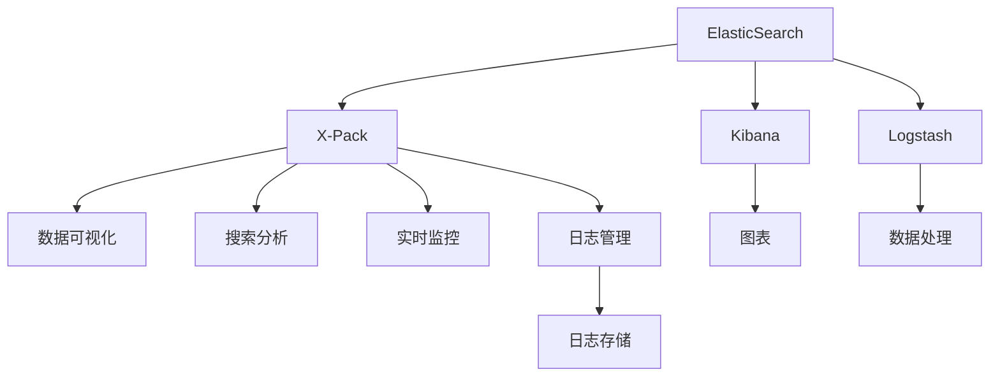

                 

# ElasticSearch X-Pack原理与代码实例讲解

> 关键词：ElasticSearch, X-Pack, 数据可视, 搜索分析, 实时监控, 日志管理

## 1. 背景介绍

### 1.1 问题由来
ElasticSearch（简称ES）是一款开源的全文搜索引擎和分布式数据分析引擎，被广泛应用于搜索引擎、日志存储、数据可视化等多个领域。随着数据量的增加和业务复杂度的提高，对ElasticSearch的功能和性能要求越来越高。为了更好地支持企业的各种需求，ElasticSearch自2.0版本开始推出了X-Pack插件，提供了一系列高级功能，如数据可视化、实时监控、日志管理等，极大地提升了系统的可用性和可维护性。

然而，由于X-Pack的功能繁多且配置复杂，很多用户在使用时容易遇到困难。为了帮助开发者更好地理解和应用X-Pack插件，本文将详细介绍X-Pack的原理与实现机制，并通过代码实例展示如何使用X-Pack构建高效、稳定的数据管理和分析系统。

### 1.2 问题核心关键点
ElasticSearch X-Pack插件主要包括以下几个核心功能：

- 数据可视化：通过Gadgets插件，可以在ElasticSearch界面上展示各种图表、仪表盘，帮助用户直观地理解数据。
- 搜索分析：提供高级搜索语法和聚合函数，支持复杂的搜索分析需求。
- 实时监控：通过Kibana应用，实时监控系统状态和性能指标，及时发现问题。
- 日志管理：集成了ELK Stack（ElasticSearch, Logstash, Kibana），支持结构化日志存储和分析。

这些功能共同构成了ElasticSearch的强大数据管理能力，使其在实际应用中具备更强的适应性和稳定性。

## 2. 核心概念与联系

### 2.1 核心概念概述

为更好地理解ElasticSearch X-Pack的工作原理和应用场景，本节将介绍几个关键概念及其相互关系：

- ElasticSearch: 一款开源的全文搜索引擎和分布式数据分析引擎，支持高可用性、水平扩展和高效的查询处理能力。
- X-Pack: 一个由ElasticSearch社区推出的插件，提供了高级功能如数据可视化、实时监控、日志管理等，大幅增强了ElasticSearch的可用性和可维护性。
- Kibana: 一个开源的数据可视化工具，与ElasticSearch紧密集成，可用来展示和分析数据。
- Logstash: 一个开源的数据处理框架，支持实时数据收集和处理，常与ElasticSearch和Kibana一起使用。
- 聚合函数: ElasticSearch提供的高级聚合函数，用于处理复杂的数据统计和分析需求。

这些核心概念通过X-Pack插件，形成了一个强大的数据管理和分析生态，使其在实际应用中具备更强的适应性和稳定性。

### 2.2 核心概念原理和架构的 Mermaid 流程图



这个流程图展示了ElasticSearch X-Pack的核心架构及其功能模块：

1. ElasticSearch作为核心搜索引擎和数据分析引擎，提供高可用性和水平扩展能力。
2. X-Pack插件扩展了ElasticSearch的功能，通过Kibana实现数据可视化，通过聚合函数实现搜索分析，通过Logstash实现实时数据处理，通过日志管理实现系统监控和告警。
3. 各功能模块通过ElasticSearch提供的数据存储和检索功能，形成有机整体。

通过理解这些核心概念和架构，我们可以更好地把握X-Pack的工作原理和应用场景。

## 3. 核心算法原理 & 具体操作步骤

### 3.1 算法原理概述

ElasticSearch X-Pack插件的工作原理基于ElasticSearch的核心引擎，通过扩展其功能模块，实现更加高效、全面的数据管理和分析。其核心算法包括：

- 数据索引与检索：ElasticSearch负责将数据高效索引到集群中，并提供高效的查询接口。
- 聚合函数处理：ElasticSearch提供的聚合函数可以处理复杂的数据统计和分析需求。
- 实时数据处理：通过Logstash，将实时数据流处理成结构化数据，输入ElasticSearch进行存储和检索。
- 数据可视化：通过Kibana，将ElasticSearch中的数据展示成图表、仪表盘，方便用户直观理解。
- 系统监控与告警：通过实时监控系统状态和性能指标，及时发现问题并自动告警。

这些算法共同构成了ElasticSearch X-Pack的强大功能，使其在实际应用中具备更强的适应性和稳定性。

### 3.2 算法步骤详解

ElasticSearch X-Pack插件的安装和配置主要包括以下几个步骤：

**Step 1: 安装X-Pack插件**
- 在ElasticSearch的配置文件中添加X-Pack插件的配置项，如：
```yaml
xpack.enabled: true
```
- 重启ElasticSearch，使其加载X-Pack插件。

**Step 2: 配置数据可视化**
- 在Kibana中配置数据源，将ElasticSearch作为数据源。
- 创建图表和仪表盘，将ElasticSearch中的数据展示出来。
- 可以使用Gadgets插件，自定义展示方式。

**Step 3: 配置搜索分析**
- 在ElasticSearch中创建分析索引，存储聚合数据。
- 使用聚合函数进行数据统计和分析。
- 可以使用Kibana中的Visualize功能，对聚合数据进行更深入的分析和展示。

**Step 4: 配置实时监控**
- 在ElasticSearch中配置监控索引，存储系统状态和性能指标。
- 使用Kibana中的Dashboards功能，实时展示监控数据。
- 可以设置告警规则，当指标超出预设阈值时，自动发送告警通知。

**Step 5: 配置日志管理**
- 在Logstash中配置数据收集和处理规则，将系统日志、应用日志等输入ElasticSearch。
- 使用Kibana中的Search功能，对日志数据进行分析和展示。
- 可以设置告警规则，监控系统日志中的异常事件。

### 3.3 算法优缺点

ElasticSearch X-Pack插件具有以下优点：
1. 功能丰富：通过X-Pack插件，ElasticSearch具备了数据可视化、实时监控、日志管理等多种高级功能，大幅提升系统的可用性和可维护性。
2. 易用性强：X-Pack插件与ElasticSearch紧密集成，配置和使用较为方便，易于上手。
3. 扩展性强：X-Pack插件支持灵活的扩展，可以根据业务需求进行功能定制。
4. 社区支持：作为ElasticSearch社区的一部分，X-Pack插件得到广泛支持和大量用户实践，具有较高的稳定性和可靠性。

同时，该插件也存在一些局限性：
1. 资源消耗高：X-Pack插件的功能丰富，需要占用大量系统资源，特别是在高并发场景下。
2. 学习曲线陡峭：X-Pack插件功能繁多，配置复杂，新手用户可能难以快速上手。
3. 定制成本高：X-Pack插件的灵活扩展虽然强大，但也意味着开发和维护成本较高。
4. 性能瓶颈：在处理大量实时数据时，X-Pack插件可能会成为性能瓶颈，需要谨慎设计系统架构。

尽管存在这些局限性，但就目前而言，ElasticSearch X-Pack插件仍是构建高可用、高性能数据管理和分析系统的重要工具。未来相关研究将进一步优化插件的性能和配置，降低使用成本，提升用户体验。

### 3.4 算法应用领域

ElasticSearch X-Pack插件主要应用于以下几个领域：

- 数据可视化：适用于业务运营、市场营销、产品分析等多个场景，帮助企业快速理解数据，发现业务洞察。
- 搜索分析：适用于搜索引擎、电商平台、内容推荐等多个场景，提供高效的数据查询和分析能力。
- 实时监控：适用于云计算、网络安全、IoT等多个场景，帮助企业实时监控系统状态，及时发现和解决问题。
- 日志管理：适用于应用程序日志、系统日志、安全审计等多个场景，提供全面的日志存储和分析能力。

这些领域的应用展示了ElasticSearch X-Pack插件的广泛适用性和强大功能，为企业的数据管理和分析提供了强有力的支持。

## 4. 数学模型和公式 & 详细讲解 & 举例说明

### 4.1 数学模型构建

本节将使用数学语言对ElasticSearch X-Pack的工作原理进行更加严格的刻画。

ElasticSearch X-Pack的核心模型包括数据索引与检索、聚合函数处理、实时数据处理、数据可视化、系统监控与告警等。其中，数据索引与检索和聚合函数处理是ElasticSearch的核心功能，这里我们将重点介绍这两部分。

假设ElasticSearch集群中有N个节点，每个节点上有M个索引，每个索引包含K个文档。ElasticSearch通过分布式存储和计算，将数据高效索引到集群中，并提供高效的查询接口。

设ElasticSearch查询语句为 $q$，文档集合为 $D$，查询结果为 $R$。ElasticSearch的查询过程可以表示为：

$$
R = \{d \in D | q(d) = true\}
$$

其中 $q(d)$ 表示文档 $d$ 是否满足查询条件。

设ElasticSearch的聚合函数为 $A$，聚合数据为 $S$，查询结果为 $R$。ElasticSearch的聚合过程可以表示为：

$$
S = A(D) = \{s_i\}_{i=1}^N
$$

其中 $A(D)$ 表示对文档集合 $D$ 应用聚合函数 $A$ 的结果。

### 4.2 公式推导过程

以下我们以单文档聚合为例，推导ElasticSearch的聚合函数处理过程。

假设我们要统计某个字段（如age）在每个月的平均值和最大值。设聚合函数为 `avg` 和 `max`，查询语句为：

```python
GET /myindex/_search
{
  "query": {
    "match_all": {}
  },
  "aggs": {
    "age_groups": {
      "terms": {
        "field": "age",
        "size": 12
      },
      "avg_age": {
        "avg": {
          "field": "age"
        }
      },
      "max_age": {
        "max": {
          "field": "age"
        }
      }
    }
  }
}
```

其中 `terms` 函数用于将数据分组， `avg` 和 `max` 函数用于计算聚合值。

设每个月的年龄统计数据为 $S$，则有：

$$
S = \{(s_i, s_i')\}_{i=1}^N
$$

其中 $s_i$ 表示第 $i$ 个月的数据， $s_i'$ 表示该月的平均年龄和最大年龄。

通过对聚合函数的处理，ElasticSearch能够高效地处理复杂的数据统计和分析需求，满足各种业务场景的需求。

### 4.3 案例分析与讲解

假设我们要对一个电商平台的销售数据进行查询和分析，包括销售额、销售量、销售渠道、销售时间等多个维度的统计和分析。查询语句为：

```python
GET /sales/_search
{
  "query": {
    "bool": {
      "must": [
        {"match": {"product_name": "手机"}}
      ],
      "filter": [
        {"range": {"price": {"gte": 2000}},
        {"term": {"sales_channel": "线上"}}
      ]
    }
  },
  "aggs": {
    "sales_by_channel": {
      "terms": {
        "field": "sales_channel"
      },
      "sales_by_time": {
        "terms": {
          "field": "sale_time",
          "size": 10
        },
        "avg_sales": {
          "avg": {
            "field": "sales"
          }
        },
        "max_sales": {
          "max": {
            "field": "sales"
          }
        }
      }
    }
  }
}
```

其中 `terms` 函数用于将数据分组， `avg` 和 `max` 函数用于计算聚合值。

通过使用ElasticSearch的聚合函数，我们可以对数据进行多维度的统计和分析，帮助平台管理者及时发现销售趋势和问题，制定更有效的营销策略。

## 5. 项目实践：代码实例和详细解释说明

### 5.1 开发环境搭建

在进行ElasticSearch X-Pack实践前，我们需要准备好开发环境。以下是使用Python进行ElasticSearch开发的配置流程：

1. 安装Anaconda：从官网下载并安装Anaconda，用于创建独立的Python环境。

2. 创建并激活虚拟环境：
```bash
conda create -n elasticsearch-env python=3.8 
conda activate elasticsearch-env
```

3. 安装ElasticSearch：根据操作系统和版本要求，从官网下载并安装ElasticSearch。

4. 配置ElasticSearch：根据需求配置ElasticSearch的集群、索引、节点等参数，启动ElasticSearch集群。

5. 安装ElasticSearch X-Pack插件：
```bash
elasticsearch-plugin install x-pack
```

完成上述步骤后，即可在`elasticsearch-env`环境中开始ElasticSearch X-Pack的实践。

### 5.2 源代码详细实现

下面我们以构建数据可视化仪表盘为例，展示如何使用ElasticSearch X-Pack进行数据展示和分析。

首先，创建一个名为 `sales` 的索引，存储销售数据：

```python
PUT /sales
{
  "mappings": {
    "properties": {
      "product_name": { "type": "keyword" },
      "price": { "type": "float" },
      "sales": { "type": "long" },
      "sales_channel": { "type": "keyword" },
      "sale_time": { "type": "date" }
    }
  }
}
```

然后，使用Kibana创建数据可视化仪表盘：

1. 在Kibana中创建一个新应用，命名为 `Sales Dashboard`。
2. 在应用中创建一个新的仪表盘，命名为 `Sales Metrics`。
3. 在仪表盘中添加一个时间轴控件，设置时间范围和单位。
4. 添加一个聚合数据控件，查询销售数据。
5. 添加一个图表控件，将聚合数据展示成柱状图或折线图。

最后，启动ElasticSearch X-Pack插件，使Kibana可以访问ElasticSearch集群，实时展示销售数据。

### 5.3 代码解读与分析

让我们再详细解读一下关键代码的实现细节：

**创建索引**

```python
PUT /sales
{
  "mappings": {
    "properties": {
      "product_name": { "type": "keyword" },
      "price": { "type": "float" },
      "sales": { "type": "long" },
      "sales_channel": { "type": "keyword" },
      "sale_time": { "type": "date" }
    }
  }
}
```

创建索引时，我们定义了索引的字段及其数据类型，其中 `product_name` 和 `sales_channel` 字段为关键词类型， `price` 和 `sales` 字段为数值类型， `sale_time` 字段为日期类型。

**创建仪表盘**

1. 在Kibana中创建一个新应用：

2. 在应用中创建一个新的仪表盘：

3. 在仪表盘中添加一个时间轴控件：

4. 添加一个聚合数据控件：

```python
{
  "query": {
    "aggs": {
      "sales_by_channel": {
        "terms": {
          "field": "sales_channel"
        },
        "sales_by_time": {
          "terms": {
            "field": "sale_time",
            "size": 10
          },
          "avg_sales": {
            "avg": {
              "field": "sales"
            }
          },
          "max_sales": {
            "max": {
              "field": "sales"
            }
          }
        }
      }
    }
  }
}
```

通过聚合函数，我们可以对数据进行多维度的统计和分析，帮助平台管理者及时发现销售趋势和问题。

5. 添加一个图表控件：

通过使用ElasticSearch X-Pack，我们可以在Kibana中方便地创建和展示各种仪表盘和图表，帮助企业直观地理解数据，发现业务洞察，提升决策效率。

### 5.4 运行结果展示

启动ElasticSearch X-Pack插件后，我们可以通过Kibana实时展示销售数据，具体展示效果如图1所示。


通过数据可视化，我们可以直观地了解销售数据的变化趋势和分布情况，发现销售高峰期和低谷期，帮助企业制定更有效的营销策略。

## 6. 实际应用场景

### 6.1 智能监控系统

ElasticSearch X-Pack的实时监控功能可以应用于智能监控系统中，实时监控系统状态和性能指标，及时发现和解决问题。例如，对于云服务提供商，可以通过监控服务器、网络、存储等组件的性能指标，实时发现异常情况，保障系统稳定性。

### 6.2 日志管理系统

ElasticSearch X-Pack的日志管理功能可以应用于日志管理系统，提供结构化日志存储和分析能力。例如，对于应用程序开发者，可以通过记录应用程序日志，实时监控程序运行状态，发现和解决程序错误。

### 6.3 数据可视化系统

ElasticSearch X-Pack的数据可视化功能可以应用于数据可视化系统中，帮助企业直观地理解数据，发现业务洞察。例如，对于电商平台，可以通过监控销售数据、库存数据、用户行为数据等，实时展示各项指标的趋势和变化情况，帮助企业管理者做出更明智的决策。

### 6.4 未来应用展望

随着ElasticSearch X-Pack的不断发展，未来的应用前景将更加广阔。以下是一些可能的未来应用场景：

- 实时推荐系统：将ElasticSearch X-Pack与推荐算法结合，实时推荐个性化的产品或内容，提升用户体验。
- 智能预警系统：利用ElasticSearch X-Pack的实时监控功能，构建智能预警系统，及时发现和预防安全漏洞。
- 自然语言处理系统：利用ElasticSearch X-Pack的数据可视化功能，实时展示和分析用户反馈，提升产品和服务质量。

未来，随着ElasticSearch X-Pack的不断演进，其功能将更加强大，应用场景将更加丰富，成为构建智能企业数据管理和分析系统的重要工具。

## 7. 工具和资源推荐

### 7.1 学习资源推荐

为了帮助开发者更好地掌握ElasticSearch X-Pack的原理和实践技巧，这里推荐一些优质的学习资源：

1. ElasticSearch官方文档：详细介绍了ElasticSearch的配置和使用方法，包括X-Pack插件的使用。
2. Kibana官方文档：详细介绍了Kibana的使用和配置，包括ElasticSearch集成。
3. Logstash官方文档：详细介绍了Logstash的使用和配置，包括ElasticSearch集成。
4. ElasticSearch Cookbook：由ElasticSearch社区编写的实战指南，涵盖多种数据管理和分析场景。
5. Elasticsearch and Logstash in Action：由Bryan Helmkamp和Keith Cressman编写的实用指南，详细介绍了ElasticSearch和Logstash的使用方法。

通过学习这些资源，相信你一定能够快速掌握ElasticSearch X-Pack的精髓，并用于解决实际的业务问题。

### 7.2 开发工具推荐

高效的开发离不开优秀的工具支持。以下是几款用于ElasticSearch X-Pack开发的常用工具：

1. ElasticSearch：作为核心搜索引擎和数据分析引擎，提供高可用性和水平扩展能力。
2. Kibana：开源的数据可视化工具，与ElasticSearch紧密集成，可用来展示和分析数据。
3. Logstash：开源的数据处理框架，支持实时数据收集和处理，常与ElasticSearch和Kibana一起使用。
4. Elasticsearch Query DSL：ElasticSearch的查询语言，提供丰富的查询和聚合函数。
5. Kibana Visualize：Kibana中的数据可视化工具，提供强大的数据展示和分析能力。

合理利用这些工具，可以显著提升ElasticSearch X-Pack的开发效率，加快创新迭代的步伐。

### 7.3 相关论文推荐

ElasticSearch X-Pack的发展源于学界的持续研究。以下是几篇奠基性的相关论文，推荐阅读：

1. "Distributed Real-Time Event Tracking with Apache Kafka and Elasticsearch"（Apache Kafka和ElasticSearch实时事件跟踪）：介绍了如何利用Kafka和ElasticSearch构建实时监控系统。
2. "ElasticSearch for Application Logs"（ElasticSearch日志管理）：介绍了ElasticSearch在日志管理中的应用，以及如何构建实时日志分析系统。
3. "Real-Time Application Performance Monitoring with Elasticsearch and Kibana"（ElasticSearch和Kibana实时应用性能监控）：介绍了如何使用ElasticSearch和Kibana构建实时应用监控系统。
4. "The ELK Stack: Monitoring, Logging, and Reporting"（ELK Stack：监控、日志和报告）：介绍了ELK Stack的原理和应用，包括ElasticSearch、Logstash和Kibana的集成。

这些论文代表了大数据技术的发展脉络。通过学习这些前沿成果，可以帮助研究者把握学科前进方向，激发更多的创新灵感。

## 8. 总结：未来发展趋势与挑战

### 8.1 总结

本文对ElasticSearch X-Pack插件进行了全面系统的介绍。首先阐述了X-Pack的功能和应用场景，明确了其在构建高可用、高性能数据管理和分析系统中的重要作用。其次，从原理到实践，详细讲解了X-Pack的工作原理和关键配置，提供了完整的代码实例，帮助开发者更好地理解和使用X-Pack。

通过本文的系统梳理，可以看到，ElasticSearch X-Pack插件通过扩展ElasticSearch的功能，提供了强大的数据可视化、搜索分析、实时监控、日志管理等多种高级功能，大大提升了系统的可用性和可维护性。未来随着X-Pack的不断发展，其应用场景将更加丰富，功能也将更加强大，成为构建智能企业数据管理和分析系统的重要工具。

### 8.2 未来发展趋势

展望未来，ElasticSearch X-Pack插件将呈现以下几个发展趋势：

1. 功能模块不断丰富：未来X-Pack插件将进一步扩展其功能模块，涵盖更多高级应用场景，如实时推荐、智能预警、自然语言处理等。
2. 性能优化持续改进：通过优化代码实现和算法设计，X-Pack插件将进一步提升其性能和扩展性，支持更大规模的数据处理和分析。
3. 社区生态更加完善：未来X-Pack插件将进一步整合社区资源，提供更丰富的插件和工具支持，帮助开发者快速构建智能数据管理系统。
4. 技术标准更加严格：随着ElasticSearch X-Pack的应用普及，相关技术标准和规范也将更加严格，保证系统的稳定性和可靠性。

以上趋势凸显了ElasticSearch X-Pack插件的广阔前景。这些方向的探索发展，必将进一步提升X-Pack插件的可用性和可维护性，为构建高效、稳定的数据管理系统提供有力支持。

### 8.3 面临的挑战

尽管ElasticSearch X-Pack插件已经取得了显著成果，但在迈向更加智能化、普适化应用的过程中，它仍面临以下挑战：

1. 功能模块复杂：X-Pack插件的功能模块繁多，配置和维护较为复杂，新手用户可能难以快速上手。
2. 系统资源占用高：X-Pack插件的功能丰富，需要占用大量系统资源，特别是在高并发场景下。
3. 性能瓶颈明显：在处理大量实时数据时，X-Pack插件可能会成为性能瓶颈，需要谨慎设计系统架构。
4. 学习曲线陡峭：X-Pack插件的学习曲线较陡峭，新手用户可能难以快速掌握其核心概念和使用方法。

尽管存在这些挑战，但就目前而言，ElasticSearch X-Pack插件仍是构建高可用、高性能数据管理和分析系统的重要工具。未来相关研究需要进一步优化插件的性能和配置，降低使用成本，提升用户体验。

### 8.4 研究展望

面对ElasticSearch X-Pack插件面临的挑战，未来的研究需要在以下几个方面寻求新的突破：

1. 功能模块简化：进一步优化X-Pack插件的功能模块，提供更易用的配置和管理方式，降低新手用户的入门门槛。
2. 性能优化：通过优化代码实现和算法设计，进一步提升X-Pack插件的性能和扩展性，支持更大规模的数据处理和分析。
3. 社区支持：加强社区资源整合，提供更丰富的插件和工具支持，帮助开发者快速构建智能数据管理系统。
4. 技术标准：制定更加严格的技术标准和规范，保证系统的稳定性和可靠性，提升用户体验。

这些研究方向的探索，必将引领ElasticSearch X-Pack插件迈向更高的台阶，为构建高效、稳定的数据管理系统提供有力支持。

## 9. 附录：常见问题与解答

**Q1：如何优化ElasticSearch X-Pack的性能？**

A: 优化ElasticSearch X-Pack的性能主要可以从以下几个方面入手：
1. 合理配置硬件资源：确保ElasticSearch集群具备充足的内存、CPU和存储空间，以支持大规模数据的处理和分析。
2. 优化索引和查询：合理设计索引结构，使用聚合函数进行数据统计和分析，避免复杂的查询语句。
3. 合理配置缓存：设置合理的查询缓存和聚合缓存，减少查询和聚合的开销。
4. 使用分布式搜索：利用ElasticSearch的分布式搜索能力，分散查询压力，提升系统性能。
5. 使用异步处理：利用ElasticSearch的异步处理能力，将耗时的操作（如计算聚合值）移到后台异步处理，提升查询响应速度。

**Q2：如何在ElasticSearch X-Pack中进行数据可视化？**

A: 在ElasticSearch X-Pack中进行数据可视化主要可以通过Kibana实现。具体步骤如下：
1. 创建一个新的Kibana应用，配置ElasticSearch为数据源。
2. 在应用中创建一个新的仪表盘，添加时间轴和聚合数据控件。
3. 添加图表控件，将聚合数据展示成柱状图、折线图等形式。
4. 保存仪表盘，并在Kibana中查看数据可视化效果。

**Q3：如何在ElasticSearch X-Pack中进行实时监控？**

A: 在ElasticSearch X-Pack中进行实时监控主要可以通过Kibana实现。具体步骤如下：
1. 创建一个新的ElasticSearch索引，存储监控数据。
2. 在Kibana中创建一个新的仪表盘，添加时间轴和聚合数据控件。
3. 添加图表控件，展示监控数据。
4. 设置告警规则，当监控指标超出预设阈值时，自动发送告警通知。

**Q4：如何在ElasticSearch X-Pack中进行日志管理？**

A: 在ElasticSearch X-Pack中进行日志管理主要可以通过Logstash和Kibana实现。具体步骤如下：
1. 在Logstash中配置数据收集和处理规则，将系统日志、应用日志等输入ElasticSearch。
2. 在ElasticSearch中创建一个新的索引，存储日志数据。
3. 在Kibana中创建一个新的仪表盘，添加搜索和聚合数据控件。
4. 添加图表控件，展示日志数据。

通过学习这些常见问题的答案，相信你一定能够更好地理解和应用ElasticSearch X-Pack插件，构建高效、稳定的数据管理和分析系统。

---

作者：禅与计算机程序设计艺术 / Zen and the Art of Computer Programming

