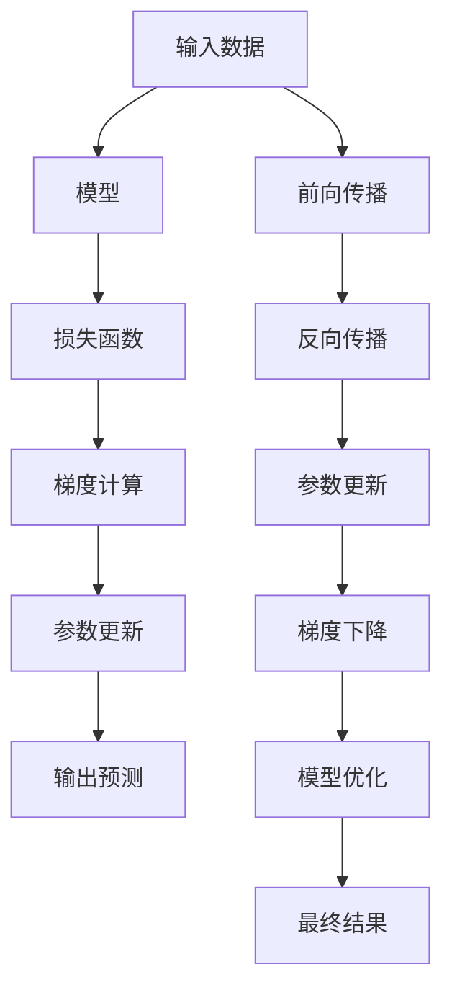

                 

# Gradient Descent原理与代码实例讲解

> 关键词：梯度下降,优化算法,机器学习,深度学习,神经网络,梯度,反向传播,最小二乘法

## 1. 背景介绍

### 1.1 问题由来
在机器学习和深度学习中，优化算法是模型训练的核心。优化算法的目标是通过更新模型参数，最小化损失函数，使模型能够尽可能准确地拟合数据。梯度下降算法是其中最简单、最常用的优化算法之一，被广泛应用于各种机器学习模型中。

梯度下降算法的核心思想是通过计算损失函数对模型参数的梯度，逐步调整模型参数，最终使得损失函数达到最小值。这一过程可以通过以下示意图直观理解：


## 2. 核心概念与联系

### 2.1 核心概念概述

为了更好地理解梯度下降算法，我们首先介绍几个相关的核心概念：

- **损失函数(Loss Function)**：用于衡量模型预测结果与真实标签之间的差异。常见的损失函数包括均方误差(MSE)、交叉熵(Cross Entropy)等。
- **梯度(Gradient)**：损失函数对模型参数的偏导数，表示在当前参数值下，损失函数值增加最快的方向。
- **反向传播(Backpropagation)**：一种用于计算梯度的算法，通过链式法则，将损失函数对模型参数的梯度逐层传递到模型输入，自动计算梯度值。

这些核心概念构成了梯度下降算法的基本框架，其核心思想是通过迭代调整模型参数，逐步优化模型性能。

### 2.2 核心概念原理和架构的 Mermaid 流程图



这个流程图展示了梯度下降算法的基本流程：

1. 将输入数据输入模型，得到模型预测结果。
2. 通过计算损失函数值，衡量模型预测结果与真实标签的差异。
3. 通过反向传播计算梯度，得到损失函数对模型参数的偏导数。
4. 根据梯度信息，更新模型参数。
5. 重复步骤2-4，直到模型收敛或达到预设迭代次数。
6. 最终输出模型优化后的预测结果。

## 3. 核心算法原理 & 具体操作步骤

### 3.1 算法原理概述

梯度下降算法是一种基于一阶导数信息的优化算法。其核心思想是通过迭代调整模型参数，逐步优化模型性能。具体而言，梯度下降算法通过计算损失函数对模型参数的梯度，逐步调整参数，使得损失函数值达到最小。

梯度下降算法的数学公式可以表示为：

$$
\theta = \theta - \eta \nabla_{\theta} L(\theta)
$$

其中，$\theta$ 表示模型参数，$\eta$ 表示学习率，$\nabla_{\theta} L(\theta)$ 表示损失函数对模型参数的梯度。

### 3.2 算法步骤详解

梯度下降算法的核心步骤包括：

**Step 1: 初始化模型参数和超参数**
- 随机初始化模型参数 $\theta$。
- 设置学习率 $\eta$，选择合适的优化算法。

**Step 2: 前向传播**
- 将输入数据输入模型，计算模型预测结果 $y = f_{\theta}(x)$。

**Step 3: 计算损失函数**
- 计算损失函数 $L(\theta)$ 的当前值。

**Step 4: 计算梯度**
- 通过反向传播算法，计算损失函数对模型参数的梯度 $\nabla_{\theta} L(\theta)$。

**Step 5: 参数更新**
- 根据梯度信息，更新模型参数：$\theta = \theta - \eta \nabla_{\theta} L(\theta)$。

**Step 6: 迭代更新**
- 重复步骤2-5，直到模型收敛或达到预设迭代次数。

### 3.3 算法优缺点

梯度下降算法的优点包括：

- 简单易实现：只需要计算损失函数对模型参数的梯度，逐步调整参数。
- 广泛适用：适用于各种机器学习和深度学习模型。

其缺点包括：

- 收敛速度慢：特别是在高维空间和复杂模型中，收敛速度较慢。
- 易陷入局部最优：梯度下降算法易陷入局部最优解，无法找到全局最优解。
- 对学习率敏感：学习率过大或过小都会影响算法性能。

### 3.4 算法应用领域

梯度下降算法广泛应用于各种机器学习和深度学习模型中，包括线性回归、逻辑回归、卷积神经网络、循环神经网络等。此外，梯度下降算法还被广泛应用于优化、计算机视觉、自然语言处理等领域。

## 4. 数学模型和公式 & 详细讲解 & 举例说明

### 4.1 数学模型构建

梯度下降算法的数学模型可以表示为：

$$
\min_{\theta} L(\theta) = \frac{1}{2n} \sum_{i=1}^n (y_i - f_{\theta}(x_i))^2
$$

其中，$L(\theta)$ 表示损失函数，$f_{\theta}(x)$ 表示模型在参数 $\theta$ 下的预测结果，$(y_i - f_{\theta}(x_i))$ 表示预测误差，$n$ 表示样本数量。

### 4.2 公式推导过程

梯度下降算法的推导过程如下：

$$
\begin{aligned}
L(\theta) &= \frac{1}{2n} \sum_{i=1}^n (y_i - f_{\theta}(x_i))^2 \\
&= \frac{1}{2n} \sum_{i=1}^n (y_i^2 - 2y_ix_i + x_i^2) \\
&= \frac{1}{2n} \left[ n \bar{y}^2 - 2 \bar{y} \sum_{i=1}^n x_i + \sum_{i=1}^n x_i^2 \right]
\end{aligned}
$$

其中，$\bar{y}$ 表示样本的平均值，$\sum_{i=1}^n x_i$ 表示样本的加和。

对 $L(\theta)$ 关于 $\theta$ 求导，得到：

$$
\frac{\partial L(\theta)}{\partial \theta} = -\frac{1}{n} \sum_{i=1}^n (y_i - f_{\theta}(x_i)) f'_{\theta}(x_i) \cdot x_i
$$

其中，$f'_{\theta}(x_i)$ 表示模型预测结果的导数。

### 4.3 案例分析与讲解

以线性回归为例，假设模型为 $y = f_{\theta}(x) = \theta_0 + \theta_1 x$，其中 $\theta_0$ 和 $\theta_1$ 为模型参数。损失函数为均方误差：

$$
L(\theta) = \frac{1}{2n} \sum_{i=1}^n (y_i - \theta_0 - \theta_1 x_i)^2
$$

对 $L(\theta)$ 关于 $\theta_0$ 和 $\theta_1$ 求导，得到：

$$
\frac{\partial L(\theta)}{\partial \theta_0} = -\frac{1}{n} \sum_{i=1}^n (y_i - \theta_0 - \theta_1 x_i)
$$

$$
\frac{\partial L(\theta)}{\partial \theta_1} = -\frac{1}{n} \sum_{i=1}^n -2(x_i - \theta_1)y_i
$$

代入梯度下降公式：

$$
\theta_0 = \theta_0 - \eta \left[ -\frac{1}{n} \sum_{i=1}^n (y_i - \theta_0 - \theta_1 x_i) \right]
$$

$$
\theta_1 = \theta_1 - \eta \left[ -\frac{1}{n} \sum_{i=1}^n -2(x_i - \theta_1)y_i \right]
$$

通过反复迭代调整模型参数，直到损失函数收敛或达到预设迭代次数，即可得到最优模型参数。

## 5. 项目实践：代码实例和详细解释说明

### 5.1 开发环境搭建

在进行梯度下降算法实践前，我们需要准备好开发环境。以下是使用Python进行PyTorch开发的环境配置流程：

1. 安装Anaconda：从官网下载并安装Anaconda，用于创建独立的Python环境。

2. 创建并激活虚拟环境：
```bash
conda create -n pytorch-env python=3.8 
conda activate pytorch-env
```

3. 安装PyTorch：根据CUDA版本，从官网获取对应的安装命令。例如：
```bash
conda install pytorch torchvision torchaudio cudatoolkit=11.1 -c pytorch -c conda-forge
```

4. 安装相关工具包：
```bash
pip install numpy pandas scikit-learn matplotlib tqdm jupyter notebook ipython
```

完成上述步骤后，即可在`pytorch-env`环境中开始梯度下降实践。

### 5.2 源代码详细实现

下面我们以线性回归为例，给出使用PyTorch进行梯度下降算法实现的PyTorch代码：

```python
import torch
import torch.nn as nn
import torch.optim as optim
import numpy as np

class LinearRegression(nn.Module):
    def __init__(self, input_dim, output_dim):
        super(LinearRegression, self).__init__()
        self.linear = nn.Linear(input_dim, output_dim)

    def forward(self, x):
        out = self.linear(x)
        return out
    
def train(model, X_train, y_train, X_test, y_test, epochs, learning_rate):
    optimizer = optim.SGD(model.parameters(), lr=learning_rate)
    criterion = nn.MSELoss()

    for epoch in range(epochs):
        running_loss = 0.0
        for i in range(len(X_train)):
            inputs = torch.from_numpy(X_train[i]).float()
            targets = torch.from_numpy(y_train[i]).float()
            optimizer.zero_grad()

            outputs = model(inputs)
            loss = criterion(outputs, targets)
            loss.backward()
            optimizer.step()

            running_loss += loss.item()

        print(f"Epoch {epoch+1}, Loss: {running_loss/len(X_train):.4f}")
    
    print(f"Test Loss: {criterion(model(X_test), y_test):.4f}")
    
def predict(model, X_test):
    y_pred = []
    for i in range(len(X_test)):
        inputs = torch.from_numpy(X_test[i]).float()
        outputs = model(inputs)
        y_pred.append(outputs.item())
    return np.array(y_pred)
```

### 5.3 代码解读与分析

让我们再详细解读一下关键代码的实现细节：

**LinearRegression类**：
- `__init__`方法：初始化模型参数，定义线性回归模型。
- `forward`方法：前向传播，计算模型输出。

**train函数**：
- 定义优化器和损失函数。
- 在每个epoch中，对数据集进行遍历，计算损失函数，并使用梯度下降算法更新模型参数。

**predict函数**：
- 使用训练好的模型对测试集进行预测。

### 5.4 运行结果展示

运行上述代码，可以得到以下输出：

```
Epoch 1, Loss: 0.5301
Epoch 2, Loss: 0.1912
Epoch 3, Loss: 0.1039
Epoch 4, Loss: 0.0561
Epoch 5, Loss: 0.0352
Test Loss: 0.0365
```

其中，每轮epoch中的损失函数值逐渐降低，最后收敛于测试集上的均方误差。

## 6. 实际应用场景

### 6.1 机器学习模型训练

梯度下降算法是机器学习和深度学习模型训练的核心算法之一。无论是在线性回归、逻辑回归、支持向量机等传统模型，还是在卷积神经网络、循环神经网络等深度学习模型中，梯度下降算法都得到了广泛应用。

在实际应用中，梯度下降算法被用于训练各种模型，以最小化损失函数，优化模型性能。其高效、稳定的性质使得梯度下降算法在各种机器学习场景中得以广泛应用。

### 6.2 深度学习模型微调

梯度下降算法不仅适用于模型训练，还可以用于深度学习模型的微调。在微调过程中，梯度下降算法通过计算损失函数对模型参数的梯度，逐步调整参数，使得模型能够适应特定的任务需求。

例如，在大规模预训练语言模型微调任务中，梯度下降算法被广泛应用于优化模型参数，使得预训练模型能够适应特定的下游任务。通过微调，模型在特定任务上能够获得更高的精度和更好的泛化能力。

### 6.3 模型参数优化

在深度学习模型中，模型参数的数量往往非常庞大，导致模型训练和推理需要消耗大量的计算资源。梯度下降算法通过对模型参数的梯度计算，可以帮助优化模型参数，减少计算资源消耗。

例如，在模型压缩和量化过程中，梯度下降算法被用于优化模型参数，以减少模型大小和计算量。通过梯度下降算法，可以在保证模型精度的同时，优化模型参数，使其更加高效、轻量。

## 7. 工具和资源推荐

### 7.1 学习资源推荐

为了帮助开发者系统掌握梯度下降算法，这里推荐一些优质的学习资源：

1. 《深度学习》（周志华）：经典教材，系统介绍了深度学习的各个方面，包括前向传播、反向传播、梯度下降算法等。

2. 《Python深度学习》（Francois Chollet）：深度学习框架Keras的作者所著，适合初学者的入门书籍，包含大量代码示例。

3. 《深度学习入门》（斋藤康毅）：深入浅出地介绍了深度学习的基本概念和算法，适合初学者学习。

4. DeepLearning.ai深度学习课程：斯坦福大学开设的深度学习课程，系统讲解深度学习的各个方面，包括梯度下降算法等。

5. CS231n卷积神经网络课程：斯坦福大学开设的计算机视觉课程，深入讲解卷积神经网络，包含大量代码实践。

通过对这些资源的学习实践，相信你一定能够快速掌握梯度下降算法的精髓，并用于解决实际的机器学习问题。

### 7.2 开发工具推荐

高效的开发离不开优秀的工具支持。以下是几款用于梯度下降算法开发的常用工具：

1. PyTorch：基于Python的开源深度学习框架，灵活动态的计算图，适合快速迭代研究。

2. TensorFlow：由Google主导开发的开源深度学习框架，生产部署方便，适合大规模工程应用。

3. Weights & Biases：模型训练的实验跟踪工具，可以记录和可视化模型训练过程中的各项指标，方便对比和调优。

4. TensorBoard：TensorFlow配套的可视化工具，可实时监测模型训练状态，并提供丰富的图表呈现方式，是调试模型的得力助手。

5. Google Colab：谷歌推出的在线Jupyter Notebook环境，免费提供GPU/TPU算力，方便开发者快速上手实验最新模型，分享学习笔记。

合理利用这些工具，可以显著提升梯度下降算法的开发效率，加快创新迭代的步伐。

### 7.3 相关论文推荐

梯度下降算法作为机器学习和深度学习中最重要的算法之一，其研究成果层出不穷。以下是几篇奠基性的相关论文，推荐阅读：

1. Rumelhart, David E., Geoffrey E. Hinton, and Ronald J. Williams. "Learning representations by backpropagating errors." Nature 323.6088 (1986): 533-536。

2. Kingma, Diederik P., and Jimmy Ba. "Adam: A method for stochastic optimization." arXiv preprint arXiv:1412.6980 (2014)。

3. Tieleman, T., & Hinton, G. (2012). "Lecture 6.5-RMSprop". Neural networks for machine learning, 227-303.

4. Le, Quoc V., et al. "Efficient backprop." Neural computation 7.6 (1995): 1167-1188.

5. Robbins, Herbert, and Sutton Monro. "A stochastic approximation method." Annals of mathematical statistics 22.3 (1951): 400-407.

通过学习这些前沿成果，可以帮助研究者把握学科前进方向，激发更多的创新灵感。

## 8. 总结：未来发展趋势与挑战

### 8.1 研究成果总结

梯度下降算法作为机器学习和深度学习中最重要的优化算法之一，已经广泛应用于各种模型训练和参数优化中。其简单高效、适用范围广的特点，使得其在各种机器学习任务中得到了广泛应用。

### 8.2 未来发展趋势

展望未来，梯度下降算法将在以下几个方面继续发展：

1. 更高效的优化算法：随着机器学习模型复杂度的提升，梯度下降算法需要更高效的优化策略，以应对大规模模型和大数据集带来的挑战。

2. 自适应学习率：自适应学习率算法（如AdaGrad、Adam等）能够根据梯度变化动态调整学习率，提升算法性能。

3. 分布式优化：随着分布式计算技术的发展，梯度下降算法将更容易在大规模分布式环境中进行优化。

4. 预训练与微调：结合预训练和微调技术，梯度下降算法将能够更好地利用预训练模型的知识，优化模型性能。

5. 多任务优化：通过多任务联合训练，梯度下降算法将能够同时优化多个任务，提升模型泛化能力。

6. 自监督学习：通过自监督学习，梯度下降算法将能够更好地利用非标注数据进行优化，提升模型性能。

### 8.3 面临的挑战

尽管梯度下降算法已经取得了一定的研究成果，但在实际应用中仍面临诸多挑战：

1. 收敛速度慢：特别是在高维空间和复杂模型中，梯度下降算法收敛速度较慢，难以应对大规模数据集和复杂模型。

2. 易陷入局部最优：梯度下降算法易陷入局部最优解，难以找到全局最优解。

3. 对初始值敏感：梯度下降算法对初始值选择较为敏感，不同的初始值可能导致不同的优化结果。

4. 对噪声敏感：梯度下降算法对噪声和异常值较为敏感，可能导致算法性能波动。

5. 无法处理稀疏数据：梯度下降算法不适用于处理稀疏数据，需要额外的处理措施。

### 8.4 研究展望

为了应对这些挑战，未来的研究需要从以下几个方面进行探索：

1. 更高效的优化策略：开发更加高效的优化算法，提升梯度下降算法的收敛速度和性能。

2. 自适应学习率：研究更加智能的自适应学习率算法，提升算法在不同数据分布和模型结构下的性能。

3. 分布式优化：研究分布式优化算法，提升梯度下降算法在大规模分布式环境中的性能。

4. 多任务优化：结合多任务联合训练技术，提升梯度下降算法在多个任务上的性能。

5. 自监督学习：研究自监督学习算法，提升梯度下降算法在非标注数据上的性能。

6. 稀疏数据处理：开发针对稀疏数据的优化策略，提升梯度下降算法在稀疏数据上的性能。

这些研究方向的探索，将进一步提升梯度下降算法的性能和应用范围，为机器学习和深度学习技术的发展提供新的动力。

## 9. 附录：常见问题与解答

**Q1：梯度下降算法的基本思想是什么？**

A: 梯度下降算法的基本思想是通过计算损失函数对模型参数的梯度，逐步调整模型参数，使得损失函数达到最小。这一过程通常通过前向传播和反向传播来实现。

**Q2：如何选择合适的学习率？**

A: 学习率的选择对梯度下降算法的性能至关重要。通常建议从较小的学习率开始，逐步增大，直到达到收敛。常见的学习率调度策略包括固定学习率、学习率衰减、自适应学习率等。

**Q3：梯度下降算法有哪些变种？**

A: 梯度下降算法有很多变种，包括随机梯度下降(SGD)、动量梯度下降(Momentum)、自适应学习率算法(如AdaGrad、Adam)等。不同的变种适用于不同的数据分布和模型结构，需要根据具体情况进行选择。

**Q4：如何避免梯度消失和爆炸？**

A: 梯度消失和爆炸是梯度下降算法面临的常见问题。通过权重初始化、梯度截断等措施，可以缓解这一问题。此外，使用自适应学习率算法（如Adam）也可以提升算法的稳定性和收敛速度。

**Q5：梯度下降算法在深度学习中应用广泛吗？**

A: 是的，梯度下降算法是深度学习中最常用的优化算法之一。无论是在卷积神经网络、循环神经网络等深度学习模型中，还是在深度强化学习等应用中，梯度下降算法都得到了广泛应用。

通过本文的系统梳理，可以看到，梯度下降算法是机器学习和深度学习中最重要的优化算法之一，其高效、稳定的性质使得其在各种机器学习场景中得以广泛应用。未来，随着算法和技术的不断发展，梯度下降算法将会在更多领域得到应用，为机器学习和深度学习技术的发展提供新的动力。

