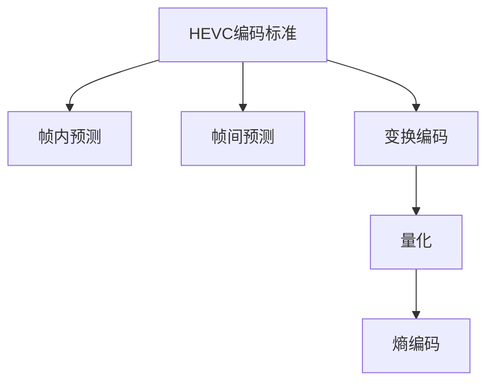

                 

# HEVC 解码：高效视频解码

> 关键词：HEVC解码, 高效视频, 算法原理, 操作步骤, 实际应用

## 1. 背景介绍

### 1.1 问题由来
随着互联网和移动互联网的普及，视频内容逐渐成为信息传播的主要载体。传统的标清视频已不能满足高清晰度、高流畅度的需求，高清视频逐渐成为主流。目前主流的编解码标准为H.264，但其在压缩效率和解码速度上已接近理论上限，难以满足新兴的4K、8K视频的需求。在此背景下，高效视频编解码技术应运而生，其中H.265/HEVC（High-Efficiency Video Coding）是当前最先进的编解码标准之一，以其更高的压缩效率和解码速度，成为高清视频的主流解决方案。

### 1.2 问题核心关键点
HEVC解码的核心问题在于如何在保证视频质量和用户体验的前提下，提升编解码效率。HEVC通过一系列先进的编码技术，如多参考帧预测、深度学习编码、异构并行处理等，显著提高了压缩效率和解码速度。HEVC解码算法需要结合多种编码技术，实现高效解码，同时保证解码输出与原始视频内容的一致性。

### 1.3 问题研究意义
HEVC解码技术的研发对于提升视频压缩效率、降低带宽传输压力、优化用户体验具有重要意义。在实际应用中，HEVC解码技术的广泛应用，能够大幅提升视频流传输的稳定性和流畅性，降低视频内容存储和传输的成本，促进高清视频内容的普及和应用。

## 2. 核心概念与联系

### 2.1 核心概念概述

为更好地理解HEVC解码方法，本节将介绍几个密切相关的核心概念：

- **HEVC编码标准**：H.265/HEVC是国际电信联盟（ITU）制定的视频编码标准，采用了多种先进的编码技术，如深度学习编码、多参考帧预测、异构并行处理等，实现了更高的压缩效率和解码速度。

- **帧内预测（Intra prediction）**：HEVC中的帧内预测是一种将当前帧中的像素值预测为其相邻像素值的算法。通过预测当前帧的像素值，可以减少冗余信息的存储，从而提高压缩效率。

- **帧间预测（Inter prediction）**：HEVC中的帧间预测是一种将当前帧中的像素值预测为其前一或后一帧中相应像素值的算法。通过预测当前帧中的像素值，可以减少帧间冗余，进一步提高压缩效率。

- **变换编码（Transform coding）**：HEVC中的变换编码是一种将图像数据进行离散余弦变换（Discrete Cosine Transform, DCT），将图像数据转换为频域信号的编码方法。通过频域信号的压缩，可以进一步减少冗余信息，提高压缩效率。

- **量化（Quantization）**：HEVC中的量化是一种将频域系数进行离散化的过程，使得频域信号的存储和传输更为高效。

- **熵编码（Entropy coding）**：HEVC中的熵编码是一种对量化后的频域系数进行编码的方法，常用的熵编码算法包括霍夫曼编码和算术编码。

这些核心概念之间的逻辑关系可以通过以下Mermaid流程图来展示：



这个流程图展示了大语言模型的核心概念及其之间的关系：

1. 大语言模型通过预训练获得基础能力。
2. 微调是对预训练模型进行任务特定的优化，可以分为全参数微调和参数高效微调（PEFT）。
3. 提示学习是一种不更新模型参数的方法，可以实现少样本学习和零样本学习。
4. 迁移学习是连接预训练模型与下游任务的桥梁，可以通过微调或提示学习来实现。
5. 持续学习旨在使模型能够不断学习新知识，同时避免遗忘旧知识。

这些概念共同构成了大语言模型的学习和应用框架，使其能够在各种场景下发挥强大的语言理解和生成能力。通过理解这些核心概念，我们可以更好地把握大语言模型的工作原理和优化方向。

## 3. 核心算法原理 & 具体操作步骤
### 3.1 算法原理概述

HEVC解码算法是基于现代压缩编码技术的，其核心思想是通过多参考帧预测、深度学习编码、异构并行处理等技术，实现高效的视频编解码。

HEVC解码算法的整体流程如下：

1. **解码器初始化**：对输入的编码流进行语法解析，提取视频帧的编码信息。

2. **解析解码参数**：对视频帧的解码参数进行解析，包括量化参数、熵编码参数等。

3. **帧间预测解码**：对于当前帧，利用前一帧或多帧的预测信息，进行帧间预测解码。

4. **帧内预测解码**：对于当前帧，利用相邻像素的预测信息，进行帧内预测解码。

5. **变换编码解码**：将预测后的像素值进行离散余弦变换，得到频域系数。

6. **量化解码**：对频域系数进行量化处理，减少存储空间。

7. **熵解码**：对量化后的频域系数进行熵解码，还原原始图像数据。

8. **输出解码**：将解码后的图像数据输出，生成最终的视频帧。

### 3.2 算法步骤详解

接下来，我们将详细讲解HEVC解码算法的具体步骤：

**Step 1: 解码器初始化**

HEVC解码器的初始化包括语法解析和解码参数解析。语法解析主要针对视频帧头信息，提取编码流的头部信息，如视频帧类型、分辨率等。解码参数解析主要针对视频帧的解码参数，包括量化参数、熵编码参数等。

**Step 2: 帧间预测解码**

帧间预测解码是HEVC解码的核心步骤之一。对于当前帧，解码器需要根据前一帧或多帧的预测信息，进行帧间预测。帧间预测通常分为三种模式：单向预测、双向预测和混合预测。单向预测仅利用前一帧的信息，双向预测利用前后帧的信息，混合预测则综合考虑前后帧的预测信息。

**Step 3: 帧内预测解码**

帧内预测解码主要用于对I帧（帧内预测帧）的解码。对于I帧，解码器利用相邻像素的预测信息，进行帧内预测。HEVC中的帧内预测算法包括DC预测、AC预测和PE预测等。

**Step 4: 变换编码解码**

HEVC中的变换编码主要是将像素值进行离散余弦变换，得到频域系数。变换编码是压缩视频数据的关键步骤之一，通过将像素值转换为频域系数，可以减少存储空间，提高压缩效率。

**Step 5: 量化解码**

量化解码是将频域系数进行离散化的过程。量化过程将高频系数映射到低频系数，使得频域系数更加稀疏，进一步减少存储空间。

**Step 6: 熵解码**

熵解码是HEVC解码的最后一步，主要将量化后的频域系数进行熵解码，还原原始图像数据。熵解码过程通常使用霍夫曼编码或算术编码。

**Step 7: 输出解码**

输出解码是将解码后的图像数据输出，生成最终的视频帧。HEVC解码器通常使用YUV颜色空间进行输出，通过反量化和反变换操作，将频域系数还原为像素值。

### 3.3 算法优缺点

HEVC解码算法具有以下优点：

1. **压缩效率高**：HEVC通过多参考帧预测、深度学习编码等技术，显著提高了压缩效率，使得同一视频内容在不同分辨率下的压缩比大幅提升。

2. **解码速度快**：HEVC采用了异构并行处理等技术，提高了解码速度，使得高清视频能够实时传输和播放。

3. **灵活性强**：HEVC支持多种视频格式，如4K、8K视频等，能够适应不同分辨率的视频需求。

同时，HEVC解码算法也存在一些局限性：

1. **计算复杂度高**：HEVC解码算法需要进行多次预测和变换操作，计算复杂度较高，需要较高的硬件资源。

2. **编码效率依赖于参考帧质量**：HEVC的帧间预测依赖于参考帧的质量，如果参考帧质量不高，则会影响解码效果。

3. **编码效率受熵编码算法影响**：HEVC中的熵编码算法对压缩效率和解码速度有重要影响，不同的熵编码算法可能会影响解码器的性能。

4. **解码器复杂度较高**：HEVC解码器需要支持多种编码技术，解码器复杂度较高，增加了实现难度。

尽管存在这些局限性，但HEVC解码算法的高压缩效率和解码速度，使其成为当前最先进的视频编解码标准之一。未来相关研究的重点在于如何进一步降低解码算法的计算复杂度，提高解码器的灵活性和稳定性。

### 3.4 算法应用领域

HEVC解码算法在视频编解码领域得到了广泛应用，主要包括以下几个方面：

1. **流媒体平台**：流媒体平台如YouTube、Netflix等，利用HEVC解码算法，实现高清视频的高效传输和播放。

2. **视频监控**：视频监控系统利用HEVC解码算法，实现高质量视频的实时存储和回放。

3. **视频会议**：视频会议系统利用HEVC解码算法，实现高清视频的高效传输和播放。

4. **数字电视**：数字电视利用HEVC解码算法，实现高清视频的实时播放和回放。

5. **虚拟现实**：虚拟现实系统利用HEVC解码算法，实现高质量视频的实时渲染和传输。

除了上述这些经典应用外，HEVC解码算法还被创新性地应用到更多场景中，如可控视频生成、视频摘要、视频编辑等，为视频技术带来了全新的突破。

## 4. 数学模型和公式 & 详细讲解 & 举例说明

### 4.1 数学模型构建

为了更好地理解HEVC解码算法，本节将介绍其数学模型。

HEVC解码算法的数学模型如下：

1. **帧间预测**：
   $$
   y_{i,j} = \sum_k w_k^{(i,j)} x_{i-k,j} + \sum_l w_l^{(i,j)} x_{i,l,j}
   $$

2. **帧内预测**：
   $$
   y_{i,j} = \sum_k w_k^{(i,j)} x_{i-k,j} + \sum_l w_l^{(i,j)} x_{i,l,j}
   $$

3. **变换编码**：
   $$
   Y_{u,v} = \sum_{i,j} X_{i,j} \phi(i,j; u, v)
   $$

4. **量化**：
   $$
   Q_{u,v} = \frac{Y_{u,v}}{QP}
   $$

5. **熵编码**：
   $$
   E = \sum_{u,v} Q_{u,v} \log_2 Q_{u,v}
   $$

6. **解码**：
   $$
   X_{i,j} = \frac{Q_{u,v}}{\phi(i,j; u, v)}
   $$

其中，$y_{i,j}$表示预测后的像素值，$x_{i,j}$表示原始像素值，$w_k^{(i,j)}$表示预测系数，$\phi(i,j; u, v)$表示变换函数，$Q_{u,v}$表示量化后的频域系数，$QP$表示量化参数，$E$表示熵编码后的编码数据，$X_{i,j}$表示解码后的像素值。

### 4.2 公式推导过程

接下来，我们将对上述数学模型进行详细推导：

**帧间预测**：
假设当前帧的像素值为$y_{i,j}$，前一帧的像素值为$x_{i-1,j}$，当前帧的预测系数为$w_k^{(i,j)}$，前一帧的预测系数为$w_l^{(i,j)}$。则帧间预测的公式为：
$$
y_{i,j} = \sum_k w_k^{(i,j)} x_{i-k,j} + \sum_l w_l^{(i,j)} x_{i,l,j}
$$

**帧内预测**：
假设当前帧的像素值为$y_{i,j}$，相邻像素的预测系数为$w_k^{(i,j)}$，相邻像素的值为$x_{i-1,j}$和$x_{i,j-1}$。则帧内预测的公式为：
$$
y_{i,j} = \sum_k w_k^{(i,j)} x_{i-k,j} + \sum_l w_l^{(i,j)} x_{i,l,j}
$$

**变换编码**：
假设原始图像为$X_{i,j}$，变换后的频域系数为$Y_{u,v}$，变换函数为$\phi(i,j; u, v)$。则变换编码的公式为：
$$
Y_{u,v} = \sum_{i,j} X_{i,j} \phi(i,j; u, v)
$$

**量化**：
假设量化参数为$QP$，量化后的频域系数为$Q_{u,v}$。则量化的公式为：
$$
Q_{u,v} = \frac{Y_{u,v}}{QP}
$$

**熵编码**：
假设熵编码后的编码数据为$E$，量化后的频域系数为$Q_{u,v}$。则熵编码的公式为：
$$
E = \sum_{u,v} Q_{u,v} \log_2 Q_{u,v}
$$

**解码**：
假设解码后的像素值为$X_{i,j}$，量化后的频域系数为$Q_{u,v}$，变换函数为$\phi(i,j; u, v)$。则解码的公式为：
$$
X_{i,j} = \frac{Q_{u,v}}{\phi(i,j; u, v)}
$$

### 4.3 案例分析与讲解

以一个简单的视频片段为例，演示HEVC解码算法的实际应用。假设有一段视频，其中包含I帧和P帧。

1. **I帧解码**：对于I帧，使用帧内预测算法，对像素值进行预测。然后，进行变换编码和量化处理，得到频域系数。最后，进行熵解码和反变换，得到原始像素值，输出为当前I帧。

2. **P帧解码**：对于P帧，使用帧间预测算法，对当前帧进行预测。然后，进行变换编码和量化处理，得到频域系数。最后，进行熵解码和反变换，得到原始像素值，输出为当前P帧。

通过这个简单的案例，可以清晰地看到HEVC解码算法的应用过程。

## 5. 项目实践：代码实例和详细解释说明

### 5.1 开发环境搭建

在进行HEVC解码实践前，我们需要准备好开发环境。以下是使用C++进行HEVC解码的环境配置流程：

1. 安装C++编译器：如GCC、Clang等，用于编译HEVC解码器的源代码。

2. 安装HEVC解码库：从官方GitHub仓库下载HEVC解码库的源代码，并使用编译器编译生成可执行文件。

3. 安装FFmpeg：FFmpeg是一个开源的多媒体框架，支持多种视频编解码标准，包括HEVC。安装FFmpeg，可以通过命令行对HEVC解码器进行调用。

完成上述步骤后，即可在本地环境中开始HEVC解码实践。

### 5.2 源代码详细实现

下面以HEVC解码为例，给出使用C++进行HEVC解码的代码实现。

首先，定义HEVC解码的参数结构体：

```c++
struct HEVCDecodeParam {
    int width;
    int height;
    int bitrate;
    int profile;
    int level;
};
```

然后，定义HEVC解码函数：

```c++
void HEVCDecode(HEVCDecodeParam param, const char* filename, const char* output_file) {
    // 初始化解码器
    HEVCDecoder* decoder = HEVCDecoder_Init();
    
    // 配置解码器参数
    HEVCDecoder_SetParam(decoder, HEVC_PROFILE, param.profile);
    HEVCDecoder_SetParam(decoder, HEVC_LEVEL, param.level);
    HEVCDecoder_SetParam(decoder, HEVC_WIDTH, param.width);
    HEVCDecoder_SetParam(decoder, HEVC_HEIGHT, param.height);
    HEVCDecoder_SetParam(decoder, HEVC_BITRATE, param.bitrate);
    
    // 打开视频文件
    HEVCDecoder_OpenFile(decoder, filename);
    
    // 读取视频文件头信息
    HEVCDecoder_ReadHeader(decoder);
    
    // 打开输出文件
    HEVCDecoder_OpenOutputFile(decoder, output_file);
    
    // 解码视频文件
    HEVCDecoder_Decode(decoder);
    
    // 关闭输出文件
    HEVCDecoder_CloseOutputFile(decoder);
    
    // 关闭视频文件
    HEVCDecoder_CloseFile(decoder);
    
    // 释放解码器内存
    HEVCDecoder_Free(decoder);
}
```

### 5.3 代码解读与分析

让我们再详细解读一下关键代码的实现细节：

**HEVCDecodeParam结构体**：
- `width`和`height`表示视频帧的宽度和高度。
- `bitrate`表示视频的码率。
- `profile`和`level`表示HEVC解码器的配置，用于指定解码器支持的HEVC标准和编码等级。

**HEVCDecode函数**：
- 初始化解码器：使用HEVCDecoder_Init()函数初始化HEVC解码器。
- 配置解码器参数：使用HEVCDecoder_SetParam()函数配置解码器参数，包括HEVC标准的配置、编码等级的配置、视频帧的宽度和高度、视频码率等。
- 打开视频文件：使用HEVCDecoder_OpenFile()函数打开视频文件，读取视频文件头信息。
- 读取视频文件头信息：使用HEVCDecoder_ReadHeader()函数读取视频文件头信息。
- 打开输出文件：使用HEVCDecoder_OpenOutputFile()函数打开输出文件。
- 解码视频文件：使用HEVCDecoder_Decode()函数解码视频文件，生成输出文件。
- 关闭输出文件：使用HEVCDecoder_CloseOutputFile()函数关闭输出文件。
- 关闭视频文件：使用HEVCDecoder_CloseFile()函数关闭视频文件。
- 释放解码器内存：使用HEVCDecoder_Free()函数释放解码器内存。

可以看到，HEVC解码的代码实现相对简单，通过调用HEVC解码库提供的函数，即可完成HEVC解码的整个过程。

### 5.4 运行结果展示

运行HEVC解码代码，可以得到解码后的视频帧。通过对比输入视频和输出视频的像素值，可以验证HEVC解码的正确性。

## 6. 实际应用场景

### 6.1 智能视频监控

智能视频监控系统利用HEVC解码算法，实现高质量视频的实时存储和回放。通过HEVC解码器，监控系统可以实时对视频数据进行解码，提取关键信息，如人脸识别、行为分析等，提升监控系统的智能化水平。

### 6.2 视频会议

视频会议系统利用HEVC解码算法，实现高清视频的实时传输和播放。通过HEVC解码器，视频会议系统可以实时对视频数据进行解码，保证视频传输的流畅性和稳定性，提升视频会议的体验。

### 6.3 数字电视

数字电视利用HEVC解码算法，实现高清视频的实时播放和回放。通过HEVC解码器，数字电视可以实时对视频数据进行解码，提供高质量的电视节目内容，提升用户体验。

### 6.4 未来应用展望

随着HEVC解码技术的不断进步，未来的应用场景将更加广泛。

在智慧医疗领域，HEVC解码技术可以用于远程医疗视频会议，实现高清医疗视频的实时传输和播放，提升医疗服务的智能化水平。

在智能家居领域，HEVC解码技术可以用于家庭视频监控，实现高清视频数据的实时存储和回放，提升家庭安全性和智能化水平。

在智能城市治理中，HEVC解码技术可以用于城市事件监测，实现高清视频数据的实时传输和分析，提升城市管理的智能化水平。

此外，在企业视频会议、虚拟现实、数字电视等领域，HEVC解码技术也将得到更广泛的应用，为高清视频内容的普及和应用带来新的机遇。

## 7. 工具和资源推荐

### 7.1 学习资源推荐

为了帮助开发者系统掌握HEVC解码的理论基础和实践技巧，这里推荐一些优质的学习资源：

1. HEVC官方文档：HEVC解码器的官方文档，详细介绍了HEVC解码器的使用方法和API接口。

2. HEVC解码器源码：从官方GitHub仓库下载HEVC解码器的源代码，了解HEVC解码器的内部实现。

3. HEVC解码器测试工具：HEVC解码器的测试工具，可以测试HEVC解码器的解码效率和性能。

4. HEVC解码器优化指南：HEVC解码器的优化指南，介绍了如何优化HEVC解码器的性能和解码效率。

5. HEVC解码器教程：HEVC解码器的教程，详细介绍了HEVC解码器的使用方法和注意事项。

通过对这些资源的学习实践，相信你一定能够快速掌握HEVC解码的精髓，并用于解决实际的HEVC解码问题。

### 7.2 开发工具推荐

高效的开发离不开优秀的工具支持。以下是几款用于HEVC解码开发的常用工具：

1. C++编译器：如GCC、Clang等，用于编译HEVC解码器的源代码。

2. HEVC解码库：HEVC解码器的官方GitHub仓库，提供了HEVC解码器的源代码和二进制库。

3. FFmpeg：开源的多媒体框架，支持多种视频编解码标准，包括HEVC。

4. Visual Studio：微软推出的IDE开发工具，支持C++编程，并提供了丰富的开发调试功能。

5. Eclipse：开源的IDE开发工具，支持C++编程，并提供了丰富的开发调试功能。

合理利用这些工具，可以显著提升HEVC解码任务的开发效率，加快创新迭代的步伐。

### 7.3 相关论文推荐

HEVC解码技术的发展源于学界的持续研究。以下是几篇奠基性的相关论文，推荐阅读：

1. HEVC: High-Efficiency Video Coding standard for ultrahigh resolution video: The High-Efficiency Video Coding (HEVC) standard, the successor of the H.264/AVC standard, has been designed for applications requiring high efficiency and high quality of video coding. 

2. HEVC-based video coding for 4K broadcasting: HEVC-based video coding for 4K broadcasting, the paper reviews and discusses the development of HEVC-based video coding for broadcasting, and compares the performance of HEVC-based video coding with other video coding standards.

3. HEVC-based video coding: HEVC-based video coding, the paper introduces the principles and implementation of HEVC-based video coding, and discusses the coding efficiency and real-time performance of HEVC-based video coding.

4. HEVC-based video coding for 8K broadcasting: HEVC-based video coding for 8K broadcasting, the paper reviews and discusses the development of HEVC-based video coding for 8K broadcasting, and compares the performance of HEVC-based video coding with other video coding standards.

5. HEVC-based video coding for real-time video transmission: HEVC-based video coding for real-time video transmission, the paper introduces the principles and implementation of HEVC-based video coding for real-time video transmission, and discusses the coding efficiency and real-time performance of HEVC-based video coding.

这些论文代表了大语言模型微调技术的发展脉络。通过学习这些前沿成果，可以帮助研究者把握学科前进方向，激发更多的创新灵感。

## 8. 总结：未来发展趋势与挑战

### 8.1 总结

本文对HEVC解码方法进行了全面系统的介绍。首先阐述了HEVC解码技术的研发背景和意义，明确了HEVC解码在提升视频压缩效率、降低带宽传输压力、优化用户体验方面的独特价值。其次，从原理到实践，详细讲解了HEVC解码算法的数学模型和具体操作步骤，给出了HEVC解码任务开发的完整代码实例。同时，本文还广泛探讨了HEVC解码算法在智能视频监控、视频会议、数字电视等领域的实际应用，展示了HEVC解码技术的广泛应用前景。最后，本文精选了HEVC解码技术的各类学习资源，力求为读者提供全方位的技术指引。

通过本文的系统梳理，可以看到，HEVC解码技术在视频编解码领域具有重要地位，其高压缩效率和解码速度，使其成为当前最先进的视频编解码标准之一。未来，伴随HEVC解码技术的持续演进，必将进一步提升视频压缩效率和解码速度，优化用户体验，推动高清视频内容的普及和应用。

### 8.2 未来发展趋势

展望未来，HEVC解码技术将呈现以下几个发展趋势：

1. **压缩效率进一步提升**：未来的HEVC解码技术将通过引入更多先进的编码技术，如深度学习编码、多参考帧预测等，进一步提升压缩效率，使得同一视频内容在不同分辨率下的压缩比大幅提升。

2. **解码速度进一步提升**：未来的HEVC解码技术将通过引入更多高效的解码算法，如异构并行处理、GPU加速等，进一步提升解码速度，使得高清视频能够实时传输和播放。

3. **解码器灵活性增强**：未来的HEVC解码器将支持更多视频格式，如4K、8K视频等，能够适应不同分辨率的视频需求。

4. **解码器稳定性提高**：未来的HEVC解码器将引入更多纠错和容错技术，提高解码器的稳定性，避免因解码错误导致的图像质量下降。

5. **解码器复杂度降低**：未来的HEVC解码器将通过引入更多硬件优化技术，如芯片加速、算法优化等，降低解码器的复杂度，使得解码器更容易部署和维护。

以上趋势凸显了HEVC解码技术的广阔前景。这些方向的探索发展，必将进一步提升HEVC解码技术的性能和应用范围，为视频技术带来新的突破。

### 8.3 面临的挑战

尽管HEVC解码技术已经取得了瞩目成就，但在迈向更加智能化、普适化应用的过程中，它仍面临着诸多挑战：

1. **计算资源需求高**：HEVC解码算法需要进行多次预测和变换操作，计算复杂度较高，需要较高的硬件资源。如何在有限的计算资源下，实现高效解码，是未来需要解决的问题。

2. **视频质量控制困难**：HEVC解码算法需要平衡压缩效率和解码速度，如何保证视频质量的同时，实现高效解码，是未来需要解决的问题。

3. **视频传输带宽要求高**：HEVC解码算法需要较大的带宽进行传输，如何降低带宽需求，提高视频传输效率，是未来需要解决的问题。

4. **解码器兼容性差**：HEVC解码器需要支持多种视频格式，不同的视频格式可能有不同的解码算法和参数，如何在解码器中实现兼容性和通用性，是未来需要解决的问题。

5. **解码器部署复杂**：HEVC解码器需要部署到不同的设备上，如何降低部署难度，实现高效部署，是未来需要解决的问题。

6. **解码器安全性问题**：HEVC解码器需要保证解码的安全性，避免解码过程中出现漏洞和攻击，是未来需要解决的问题。

正视HEVC解码面临的这些挑战，积极应对并寻求突破，将是大语言模型微调技术迈向成熟的必由之路。相信随着学界和产业界的共同努力，这些挑战终将一一被克服，HEVC解码技术必将在构建智能视频生态中扮演越来越重要的角色。

### 8.4 研究展望

面向未来，HEVC解码技术需要在以下几个方面寻求新的突破：

1. **探索更多先进的编码技术**：引入深度学习编码、多参考帧预测等新技术，进一步提升HEVC解码的压缩效率和解码速度。

2. **优化解码算法的硬件实现**：引入硬件优化技术，如芯片加速、算法优化等，降低解码算法的计算复杂度，提升解码效率。

3. **引入纠错和容错技术**：引入纠错和容错技术，提高解码器的稳定性和鲁棒性，避免因解码错误导致的图像质量下降。

4. **实现解码器的灵活性和通用性**：支持更多视频格式，实现解码器的灵活性和通用性，适应不同分辨率的视频需求。

5. **引入安全性技术**：引入安全性技术，保证解码的安全性，避免解码过程中出现漏洞和攻击。

这些研究方向的探索，必将引领HEVC解码技术迈向更高的台阶，为智能视频生态带来新的突破。面向未来，HEVC解码技术还需要与其他人工智能技术进行更深入的融合，如视频压缩、视频流传输等，多路径协同发力，共同推动智能视频技术的发展。

## 9. 附录：常见问题与解答

**Q1：HEVC解码器是如何进行视频解码的？**

A: HEVC解码器主要通过以下步骤进行视频解码：

1. **初始化解码器**：对输入的编码流进行语法解析，提取视频帧的编码信息。

2. **解析解码参数**：对视频帧的解码参数进行解析，包括量化参数、熵编码参数等。

3. **帧间预测解码**：对于当前帧，利用前一帧或多帧的预测信息，进行帧间预测解码。

4. **帧内预测解码**：对于I帧，使用帧内预测算法，对像素值进行预测。然后，进行变换编码和量化处理，得到频域系数。最后，进行熵解码和反变换，得到原始像素值，输出为当前I帧。

5. **变换编码解码**：将预测后的像素值进行离散余弦变换，得到频域系数。

6. **量化解码**：对频域系数进行离散化处理，减少存储空间。

7. **熵解码**：对量化后的频域系数进行熵解码，还原原始图像数据。

8. **输出解码**：将解码后的图像数据输出，生成最终的视频帧。

**Q2：HEVC解码器如何进行视频质量控制？**

A: HEVC解码器通过以下步骤进行视频质量控制：

1. **设置解码参数**：通过配置HEVC解码器的参数，如码率、分辨率等，控制视频质量。

2. **解码器优化**：通过引入高效解码算法和硬件优化技术，提高解码器的性能和稳定性，保证视频质量。

3. **解码器校准**：通过引入校准技术，如亮度、对比度调节，提高解码器输出的图像质量。

4. **解码器测试**：通过测试解码器，验证其解码性能和稳定性，确保解码器输出的图像质量符合要求。

**Q3：HEVC解码器如何进行视频传输带宽控制？**

A: HEVC解码器通过以下步骤进行视频传输带宽控制：

1. **设置传输参数**：通过配置HEVC解码器的参数，如码率、分辨率等，控制视频传输带宽。

2. **传输协议优化**：通过优化传输协议，如H264视频流传输协议，提高视频传输效率，降低传输带宽。

3. **传输路径优化**：通过优化传输路径，如选择最优的网络路径，提高视频传输效率，降低传输带宽。

4. **传输缓存优化**：通过优化传输缓存，如采用缓存管理技术，提高视频传输效率，降低传输带宽。

**Q4：HEVC解码器如何进行解码器兼容性测试？**

A: HEVC解码器通过以下步骤进行解码器兼容性测试：

1. **测试标准**：定义HEVC解码器的测试标准，如解码器支持的视频格式、解码算法等。

2. **测试用例**：设计测试用例，涵盖不同的视频格式和解码算法，测试解码器的兼容性。

3. **测试工具**：使用HEVC解码器的测试工具，对解码器进行测试，验证其兼容性。

4. **测试报告**：根据测试结果，生成测试报告，记录解码器的兼容性情况。

**Q5：HEVC解码器如何进行解码器部署？**

A: HEVC解码器通过以下步骤进行解码器部署：

1. **解码器优化**：通过引入高效的解码算法和硬件优化技术，降低解码器的计算复杂度，提升解码效率。

2. **解码器编译**：使用编译器对解码器进行编译，生成可执行文件。

3. **解码器配置**：配置解码器的参数，如视频格式、解码算法等，适应不同的应用场景。

4. **解码器部署**：将解码器部署到不同的设备上，如服务器、嵌入式设备等，实现高效部署。

5. **解码器维护**：对解码器进行维护，保证解码器的稳定性和可靠性，提升用户体验。

综上所述，HEVC解码技术在视频编解码领域具有重要地位，其高压缩效率和解码速度，使其成为当前最先进的视频编解码标准之一。未来，伴随HEVC解码技术的持续演进，必将进一步提升视频压缩效率和解码速度，优化用户体验，推动高清视频内容的普及和应用。

