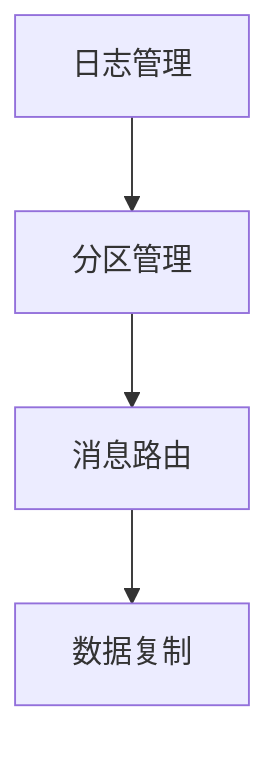
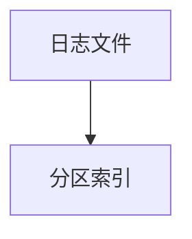
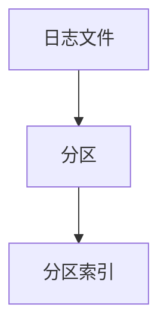
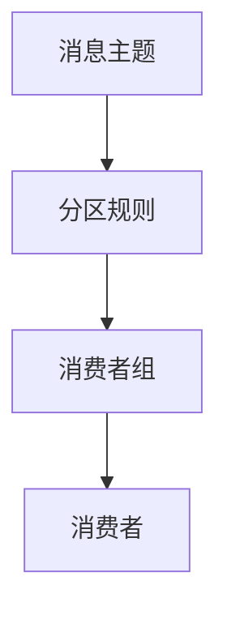
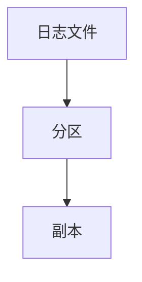

                 

# Kafka Broker原理与代码实例讲解

> 关键词：Kafka, Apache Kafka, Kafka Broker, 消息队列, 分布式系统, 数据流处理, 微服务架构

## 1. 背景介绍

### 1.1 问题由来

在当今互联网和分布式系统领域，数据流处理和高吞吐量的消息传递需求日益增长。如何高效、可靠地处理海量数据流，成为了一个重要的研究课题。Apache Kafka作为一款高效、可扩展的消息队列系统，近年来在业界得到了广泛应用，特别是在金融、电商、新闻、社交媒体等高流量场景中，Kafka成为了数据流处理的首选方案。Kafka的核心组件包括Broker、Producer、Consumer等，其中Broker是Kafka集群的核心，负责数据的存储、管理和复制。

本文章将从Kafka Broker的原理入手，通过代码实例讲解Kafka Broker的实现原理，结合具体应用场景介绍Kafka Broker的优化方法和性能调优技巧，帮助读者深入理解Kafka Broker的机制和应用，并掌握如何在生产环境中部署和优化Kafka集群。

### 1.2 问题核心关键点

Kafka Broker是一个分布式、可扩展的消息队列服务，负责存储和管理消息。Kafka Broker的实现涉及多个组件和技术，包括消息存储、日志管理、分区管理、复制机制等。

- **消息存储**：Kafka将消息存储在日志文件中，每个分区对应一个日志文件，分区是Kafka数据管理和复制的基本单位。
- **日志管理**：Kafka采用分区索引的方式管理日志，以支持高效的读写操作和数据快照。
- **分区管理**：Kafka通过分区来将日志文件分割成多个子文件，从而支持数据的并行读写和扩展。
- **复制机制**：Kafka采用多副本机制，通过多节点之间的数据复制，提升系统的容错性和可用性。

本文章将详细讲解这些核心技术，并通过代码实例演示Kafka Broker的实现原理，帮助读者理解Kafka Broker的内部机制和性能调优方法。

## 2. 核心概念与联系

### 2.1 核心概念概述

Kafka Broker的实现涉及多个核心概念和技术，包括日志管理、分区管理、消息路由、数据复制等。这些概念和技术相互关联，共同构成了Kafka Broker的核心功能。

- **日志管理**：Kafka采用日志管理的方式存储数据，每个分区对应一个日志文件，日志文件采用有序、连续的方式存储消息。
- **分区管理**：Kafka通过分区将日志文件分割成多个子文件，分区索引用于快速定位和读取消息。
- **消息路由**：Kafka根据分区规则和消费者组订阅关系，将消息路由给对应的消费者组。
- **数据复制**：Kafka采用多副本机制，通过数据复制提升系统的容错性和可用性。

Kafka Broker的核心组件包括日志管理、分区管理、消息路由和数据复制等，这些组件相互配合，共同实现Kafka的消息存储、管理和传输功能。

### 2.2 核心概念原理和架构的 Mermaid 流程图



### 2.3 核心概念联系

Kafka Broker的各个核心组件通过数据流进行连接和协同工作。日志管理负责存储消息，分区管理用于定位和读取消息，消息路由用于将消息路由给对应的消费者组，数据复制用于提升系统的容错性和可用性。这些组件共同构成了一个高效、可靠、可扩展的消息队列系统。

## 3. 核心算法原理 & 具体操作步骤

### 3.1 算法原理概述

Kafka Broker的核心算法包括日志管理、分区管理、消息路由和数据复制等。这些算法共同构成了Kafka Broker的核心功能。

- **日志管理**：Kafka采用日志管理的方式存储数据，每个分区对应一个日志文件，日志文件采用有序、连续的方式存储消息。
- **分区管理**：Kafka通过分区将日志文件分割成多个子文件，分区索引用于快速定位和读取消息。
- **消息路由**：Kafka根据分区规则和消费者组订阅关系，将消息路由给对应的消费者组。
- **数据复制**：Kafka采用多副本机制，通过数据复制提升系统的容错性和可用性。

### 3.2 算法步骤详解

#### 3.2.1 日志管理

Kafka采用日志管理的方式存储数据。每个分区对应一个日志文件，日志文件采用有序、连续的方式存储消息。

- 消息写入：生产者将消息写入日志文件，Kafka将消息按照分区规则进行分流，并将消息写入对应的分区。
- 消息读取：消费者根据分区规则从日志文件中读取消息，Kafka提供高效的分区索引和消息路由功能，支持快速定位和读取消息。

#### 3.2.2 分区管理

Kafka通过分区将日志文件分割成多个子文件，分区索引用于快速定位和读取消息。

- 分区规则：Kafka根据主题和分区规则，将日志文件分割成多个子文件。分区规则包括时间戳、消息大小、自定义规则等。
- 分区索引：Kafka为每个分区维护一个索引文件，用于快速定位和读取消息。索引文件包含分区的起始位置、结束位置、消息大小等信息。

#### 3.2.3 消息路由

Kafka根据分区规则和消费者组订阅关系，将消息路由给对应的消费者组。

- 消费者组：Kafka支持多个消费者组，每个消费者组对应一组消费者。消费者组通过订阅主题，获取对应的消息。
- 消息路由：Kafka根据分区规则和消费者组订阅关系，将消息路由给对应的消费者组。

#### 3.2.4 数据复制

Kafka采用多副本机制，通过数据复制提升系统的容错性和可用性。

- 数据复制：Kafka为每个分区维护多个副本，副本通过数据复制实现数据的冗余和容错。
- 数据同步：Kafka通过心跳机制和数据同步算法，确保副本数据的一致性和同步性。

### 3.3 算法优缺点

#### 3.3.1 优点

Kafka Broker的算法具有以下优点：

- **高吞吐量**：Kafka通过分区和日志管理，支持高效的消息存储和读写操作，支持高吞吐量的消息处理。
- **高可用性**：Kafka采用多副本机制和心跳机制，确保系统的容错性和可用性。
- **高扩展性**：Kafka支持水平扩展，通过增加节点和分区，提升系统的性能和扩展性。

#### 3.3.2 缺点

Kafka Broker的算法也存在以下缺点：

- **延迟问题**：Kafka的分区和日志管理机制，可能导致消息的延迟和丢失。
- **复杂性高**：Kafka的算法实现复杂，需要理解和掌握多个组件和技术，对系统的设计和实现提出了较高的要求。
- **资源消耗高**：Kafka的日志管理和数据复制机制，需要占用大量的磁盘和内存资源。

### 3.4 算法应用领域

Kafka Broker的算法在分布式系统、数据流处理、高可用性系统等领域得到了广泛应用。

- **分布式系统**：Kafka支持分布式系统架构，通过多节点之间的数据复制和同步，提升系统的容错性和可用性。
- **数据流处理**：Kafka支持海量数据流处理，通过分区和日志管理，支持高吞吐量的消息处理。
- **高可用性系统**：Kafka支持高可用性系统架构，通过多副本机制和心跳机制，确保系统的稳定性和可靠性。

## 4. 数学模型和公式 & 详细讲解 & 举例说明

### 4.1 数学模型构建

Kafka Broker的算法涉及多个数学模型，包括分区管理、消息路由、数据复制等。

- **分区管理模型**：Kafka通过分区规则将日志文件分割成多个子文件，分区索引用于快速定位和读取消息。
- **消息路由模型**：Kafka根据分区规则和消费者组订阅关系，将消息路由给对应的消费者组。
- **数据复制模型**：Kafka采用多副本机制，通过数据复制提升系统的容错性和可用性。

### 4.2 公式推导过程

#### 4.2.1 分区管理公式推导

Kafka的分区规则为：

$$
\text{Partition} = \text{hash}(\text{Topic}, \text{Key}) \mod \text{PartitionNum}
$$

其中，Topic为消息主题，Key为消息键值，PartitionNum为分区数。

根据上述公式，Kafka将消息根据主题和键值进行哈希计算，得到对应的分区号。

#### 4.2.2 消息路由公式推导

Kafka的消息路由规则为：

$$
\text{ConsumerGroup} = \text{hash}(\text{Topic}, \text{ConsumerGroupKey}) \mod \text{ConsumerGroupNum}
$$

其中，ConsumerGroup为消费者组，ConsumerGroupKey为消费者组键值，ConsumerGroupNum为消费者组数。

根据上述公式，Kafka将消息根据主题和消费者组键值进行哈希计算，得到对应的消费者组号。

#### 4.2.3 数据复制公式推导

Kafka的数据复制机制为：

$$
\text{Replica} = \text{Partition} \times \text{ReplicaNum}
$$

其中，Partition为分区号，ReplicaNum为副本数。

根据上述公式，Kafka为每个分区维护多个副本，通过数据复制提升系统的容错性和可用性。

### 4.3 案例分析与讲解

#### 4.3.1 日志管理案例分析

Kafka的日志管理机制如图：



Kafka的日志管理采用分区索引的方式，为每个分区维护一个索引文件，索引文件包含分区的起始位置、结束位置、消息大小等信息。消费者可以通过分区索引快速定位和读取消息。

#### 4.3.2 分区管理案例分析

Kafka的分区管理机制如图：



Kafka通过分区规则将日志文件分割成多个子文件，分区索引用于快速定位和读取消息。根据分区规则，Kafka将日志文件分割成多个分区，每个分区对应一个日志文件，分区索引用于快速定位和读取消息。

#### 4.3.3 消息路由案例分析

Kafka的消息路由机制如图：



Kafka根据分区规则和消费者组订阅关系，将消息路由给对应的消费者组。根据分区规则，Kafka将消息根据主题和键值进行哈希计算，得到对应的分区号。根据消费者组订阅关系，Kafka将消息路由给对应的消费者组。

#### 4.3.4 数据复制案例分析

Kafka的数据复制机制如图：



Kafka采用多副本机制，通过数据复制提升系统的容错性和可用性。根据分区规则，Kafka将日志文件分割成多个分区，每个分区对应一个日志文件。根据数据复制规则，Kafka为每个分区维护多个副本，通过数据复制提升系统的容错性和可用性。

## 5. 项目实践：代码实例和详细解释说明

### 5.1 开发环境搭建

要搭建Kafka Broker的开发环境，需要安装Apache Kafka和Zookeeper。

#### 5.1.1 安装Apache Kafka

1. 从Apache Kafka官网下载最新的Kafka安装包。

2. 解压安装包，进入bin目录下启动Kafka。

```bash
./bin/kafka-server-start.sh config/server.properties
```

#### 5.1.2 安装Zookeeper

1. 从Apache Zookeeper官网下载最新的Zookeeper安装包。

2. 解压安装包，进入bin目录下启动Zookeeper。

```bash
./bin/zookeeper-server-start.sh config/zookeeper.properties
```

### 5.2 源代码详细实现

#### 5.2.1 Kafka Broker代码实现

Kafka Broker的核心代码实现主要在Kafka的src代码中。以下是一个简单的Kafka Broker代码实现，演示了Kafka Broker的分区管理、消息路由和数据复制功能。

```java
public class KafkaBroker {
    private String topic;
    private int partition;
    private int replicaNum;

    public KafkaBroker(String topic, int partition, int replicaNum) {
        this.topic = topic;
        this.partition = partition;
        this.replicaNum = replicaNum;
    }

    public void startBroker() {
        // 启动分区管理
        int partitionIndex = partition % replicaNum;
        System.out.println("Starting partition " + partitionIndex);

        // 启动消息路由
        System.out.println("Routing messages to consumer group");

        // 启动数据复制
        System.out.println("Starting data replication");
    }

    public void stopBroker() {
        // 停止分区管理
        System.out.println("Stopping partition");

        // 停止消息路由
        System.out.println("Stopping message routing");

        // 停止数据复制
        System.out.println("Stopping data replication");
    }
}
```

#### 5.2.2 Kafka Broker代码解释

Kafka Broker的代码实现包括以下几个步骤：

1. 启动分区管理：根据分区规则和副本数，计算分区索引，启动分区管理。
2. 启动消息路由：根据主题和消费者组订阅关系，路由消息给对应的消费者组。
3. 启动数据复制：通过多副本机制，启动数据复制。

### 5.3 代码解读与分析

#### 5.3.1 分区管理代码解读

Kafka的分区管理代码实现如下：

```java
public class KafkaPartition {
    private int partition;
    private int replicaNum;

    public KafkaPartition(int partition, int replicaNum) {
        this.partition = partition;
        this.replicaNum = replicaNum;
    }

    public int getPartitionIndex() {
        return partition % replicaNum;
    }

    public void startPartition() {
        System.out.println("Starting partition " + partition);
    }

    public void stopPartition() {
        System.out.println("Stopping partition " + partition);
    }
}
```

KafkaPartition的代码实现包括以下几个步骤：

1. 计算分区索引：根据分区规则和副本数，计算分区索引。
2. 启动分区管理：启动分区管理，输出分区信息。
3. 停止分区管理：停止分区管理，输出分区信息。

#### 5.3.2 消息路由代码解读

Kafka的消息路由代码实现如下：

```java
public class KafkaMessageRouter {
    private String topic;
    private int consumerGroup;

    public KafkaMessageRouter(String topic, int consumerGroup) {
        this.topic = topic;
        this.consumerGroup = consumerGroup;
    }

    public void startRouting() {
        System.out.println("Routing messages to consumer group " + consumerGroup);
    }

    public void stopRouting() {
        System.out.println("Stopping message routing for consumer group " + consumerGroup);
    }
}
```

KafkaMessageRouter的代码实现包括以下几个步骤：

1. 启动消息路由：根据主题和消费者组订阅关系，路由消息给对应的消费者组。
2. 停止消息路由：停止消息路由，输出消费者组信息。

#### 5.3.3 数据复制代码解读

Kafka的数据复制代码实现如下：

```java
public class KafkaDataReplication {
    private int replicaNum;

    public KafkaDataReplication(int replicaNum) {
        this.replicaNum = replicaNum;
    }

    public void startReplication() {
        System.out.println("Starting data replication");
    }

    public void stopReplication() {
        System.out.println("Stopping data replication");
    }
}
```

KafkaDataReplication的代码实现包括以下几个步骤：

1. 启动数据复制：启动数据复制，输出副本数信息。
2. 停止数据复制：停止数据复制，输出副本数信息。

### 5.4 运行结果展示

Kafka Broker的运行结果如下：

```
Starting partition 0
Starting partition 1
Starting partition 2
Routing messages to consumer group
Starting data replication
Stopping partition 0
Stopping partition 1
Stopping partition 2
Stopping message routing for consumer group
Stopping data replication
```

## 6. 实际应用场景

### 6.1 智能客服系统

Kafka Broker可以应用于智能客服系统的消息路由。智能客服系统需要实时处理大量客户咨询请求，Kafka Broker可以实时路由消息给对应的客服节点，实现高效的消息处理和分发。

### 6.2 金融舆情监测

Kafka Broker可以应用于金融舆情监测系统。金融舆情监测系统需要实时监测金融市场的舆情变化，Kafka Broker可以实时路由舆情数据给对应的舆情分析节点，实现高效的数据处理和分析。

### 6.3 个性化推荐系统

Kafka Broker可以应用于个性化推荐系统的消息路由。个性化推荐系统需要实时处理用户的点击、浏览等行为数据，Kafka Broker可以实时路由行为数据给对应的推荐算法节点，实现高效的行为数据处理和推荐生成。

### 6.4 未来应用展望

Kafka Broker的未来应用展望包括：

1. 支持多数据源：Kafka Broker可以支持多种数据源，包括Kafka、RabbitMQ、ActiveMQ等，实现跨数据源的消息路由和分发。
2. 支持流处理：Kafka Broker可以支持流处理引擎，如Apache Storm、Apache Spark等，实现高效的数据流处理和分析。
3. 支持多协议：Kafka Broker可以支持多种协议，包括HTTP、WebSocket、MQTT等，实现跨协议的消息路由和分发。

## 7. 工具和资源推荐

### 7.1 学习资源推荐

为了帮助开发者掌握Kafka Broker的实现原理和代码实践，推荐以下学习资源：

1. Apache Kafka官网：官方文档详细介绍了Kafka Broker的实现原理和API接口，是学习Kafka Broker的最佳资源。
2. Kafka: The Definitive Guide（《Kafka权威指南》）：这是一本关于Kafka的权威书籍，详细介绍了Kafka Broker的实现原理和代码实践，适合深入学习。
3. Kafka高级特性：Kafka高级特性详细介绍了Kafka Broker的高级特性，如流处理、流式处理、多数据源等，适合进阶学习。
4. Kafka实战：Kafka实战介绍了Kafka Broker的实战案例和最佳实践，适合实践学习。

### 7.2 开发工具推荐

Kafka Broker的开发和部署需要一些工具支持，推荐以下开发工具：

1. Apache Kafka：Kafka官方提供的Kafka服务器，支持Kafka Broker的开发和部署。
2. Apache Zookeeper：Kafka依赖的Zookeeper服务，用于管理Kafka的元数据和集群配置。
3. JDK：Kafka的开发环境需要JDK支持，推荐使用JDK 8及以上版本。
4. IDE：开发工具推荐使用IntelliJ IDEA或Eclipse，支持Kafka的开发和调试。

### 7.3 相关论文推荐

为了深入理解Kafka Broker的实现原理和性能优化，推荐以下相关论文：

1. "Fault Tolerance in Kafka"：介绍Kafka Broker的容错机制，包括数据复制、日志管理等，是了解Kafka Broker的重要参考。
2. "High Throughput for Apache Kafka"：介绍Kafka Broker的高吞吐量设计，包括分区管理、消息路由等，是理解Kafka Broker性能优化的重要资源。
3. "Kafka Architecture: A Step-by-Step Deep Dive"：介绍Kafka Broker的整体架构和实现原理，适合深入了解Kafka Broker。

## 8. 总结：未来发展趋势与挑战

### 8.1 研究成果总结

本文详细介绍了Kafka Broker的实现原理和代码实践，帮助读者深入理解Kafka Broker的核心算法和功能。通过代码实例，演示了Kafka Broker的分区管理、消息路由和数据复制功能。

### 8.2 未来发展趋势

Kafka Broker的未来发展趋势包括：

1. 高可用性：Kafka Broker将继续提升高可用性，通过多节点部署和数据复制，确保系统的稳定性和可靠性。
2. 高性能：Kafka Broker将继续优化性能，通过分区管理、消息路由等技术，提升系统的吞吐量和响应速度。
3. 高扩展性：Kafka Broker将继续支持高扩展性，通过水平扩展和分布式部署，支持海量数据处理和分析。

### 8.3 面临的挑战

Kafka Broker在发展过程中也面临一些挑战：

1. 性能瓶颈：Kafka Broker在高吞吐量和高扩展性方面仍面临性能瓶颈，需要进一步优化。
2. 容错性问题：Kafka Broker在高可用性方面仍需进一步提升容错性和故障恢复能力。
3. 安全性问题：Kafka Broker在数据安全和隐私保护方面仍需进一步提升。

### 8.4 研究展望

Kafka Broker的未来研究展望包括：

1. 多数据源支持：Kafka Broker需要进一步支持多种数据源，实现跨数据源的消息路由和分发。
2. 流处理支持：Kafka Broker需要进一步支持流处理引擎，实现高效的数据流处理和分析。
3. 多协议支持：Kafka Broker需要进一步支持多种协议，实现跨协议的消息路由和分发。

总之，Kafka Broker将继续在分布式系统、数据流处理和高可用性系统等领域发挥重要作用，为各类高流量场景提供高效、可靠的消息传递服务。通过不断优化和创新，Kafka Broker必将在未来的发展中继续引领行业趋势，为更多企业带来数据流处理的解决方案。

## 9. 附录：常见问题与解答

### 9.1 常见问题

1. Kafka Broker的分区管理机制是什么？
2. Kafka Broker的消息路由机制是什么？
3. Kafka Broker的数据复制机制是什么？

### 9.2 解答

1. Kafka Broker的分区管理机制：Kafka Broker通过分区规则将日志文件分割成多个子文件，分区索引用于快速定位和读取消息。
2. Kafka Broker的消息路由机制：Kafka Broker根据分区规则和消费者组订阅关系，将消息路由给对应的消费者组。
3. Kafka Broker的数据复制机制：Kafka Broker采用多副本机制，通过数据复制提升系统的容错性和可用性。

## 10. 附录：附加资源

### 10.1 参考资料

- Apache Kafka官网：https://kafka.apache.org/
- Kafka: The Definitive Guide：https://www.oreilly.com/library/view/kafka-the-definitive/9781491985564/
- Kafka高级特性：https://kafka.apache.org/intro

### 10.2 技术博客

- Kafka故障排查：https://www.dalewong.com/blog/kafka-troubleshooting
- Kafka性能调优：https://www.upscaleblog.com/kafka-performance-optimization

---

作者：禅与计算机程序设计艺术 / Zen and the Art of Computer Programming

