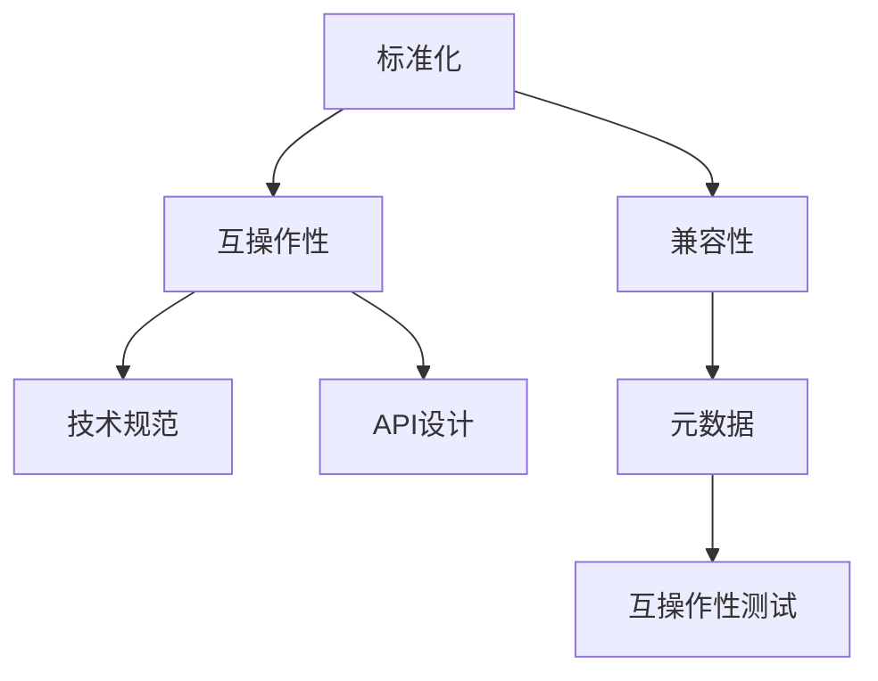

                 

# LLM 标准化：促进互操作性与兼容性

> 关键词：标准化,LLM,互操作性,兼容性,技术规范,API设计,模型共享,模型互操作

## 1. 背景介绍

### 1.1 问题由来
近年来，大语言模型(Large Language Model, LLM)在自然语言处理(Natural Language Processing, NLP)领域取得了巨大的突破。以GPT、BERT等为代表的大规模预训练语言模型，以其强大的语言理解和生成能力，被广泛应用于问答、对话、翻译、摘要、情感分析等诸多NLP任务中，显著提升了相关应用的效果和效率。然而，由于各模型开发者在架构、接口、数据格式等方面的不一致性，导致大语言模型间存在严重的互操作性和兼容性问题，大大限制了其应用价值和普及率。

为解决这一问题，LLM标准化研究成为学界和产业界关注的焦点。标准化不仅有助于大语言模型间的互操作和数据共享，还能降低开发者的重复劳动，推动NLP技术的健康发展。本文将系统介绍LLM标准化的核心概念、技术规范、API设计及其实践案例，期望为推动大语言模型的标准化进程贡献力量。

### 1.2 问题核心关键点
LLM标准化旨在通过制定统一的技术规范和API设计，促进不同模型间的数据和模型互操作。其核心关键点包括：
- **数据标准化**：制定统一的数据格式、标注规范和数据集共享协议，便于模型的训练和评估。
- **模型标准化**：统一模型架构、训练参数、推理接口等，使模型间能够互操作、互替换。
- **API标准化**：定义标准化的API接口和调用规范，便于模型的集成和二次开发。
- **元数据标准化**：制定模型和数据集的基本信息标准，便于管理和跟踪。
- **互操作性测试**：设计统一的互操作性测试工具和测试用例，验证标准化的有效性。

## 2. 核心概念与联系

### 2.1 核心概念概述

为更好地理解LLM标准化的内涵，本节将介绍几个密切相关的核心概念：

- **标准化(Standardization)**：通过制定统一的技术规范和行业标准，使不同系统和组件间具备互操作性和兼容性。
- **互操作性(Interoperability)**：不同系统或组件间能够交换数据、执行操作的能力。
- **兼容性(Compatibility)**：不同系统或组件间可以相互替代、无缝协作的能力。
- **技术规范(Specification)**：制定明确的规则和标准，指导技术实现和产品开发。
- **API设计(API Design)**：设计系统间的接口和调用规范，便于集成和开发。
- **元数据(Metadata)**：描述数据和模型基本信息的数据格式，便于管理和追踪。
- **互操作性测试(Interoperability Testing)**：通过一系列测试用例，验证不同系统间互操作性的合规性。

这些概念间的逻辑关系可以通过以下Mermaid流程图来展示：



这个流程图展示了我的核心概念间的逻辑关系：

1. 标准化过程通过制定技术规范和API设计，促进系统间互操作和兼容性。
2. 互操作性和兼容性是标准化的直接结果，不同系统或组件能够交换数据、执行操作。
3. 技术规范、API设计和元数据是实现标准化的关键组成部分，指导系统开发和集成。
4. 互操作性测试是验证标准化有效性的重要手段，确保系统间互操作的合规性。

## 3. 核心算法原理 & 具体操作步骤

### 3.1 算法原理概述

LLM标准化涉及的算法原理主要包括以下几个方面：

- **数据规范化**：定义统一的数据格式和标注标准，便于模型的训练和评估。
- **模型统一化**：统一模型的架构、训练参数、推理接口等，使不同模型能够互操作。
- **API统一设计**：设计标准化的API接口和调用规范，便于模型集成和二次开发。
- **元数据管理**：制定模型和数据集的基本信息标准，便于管理和追踪。

这些算法原理共同构成了LLM标准化的基础，使得不同模型和系统能够互通协作。

### 3.2 算法步骤详解

基于上述原理，LLM标准化主要包括以下关键步骤：

**Step 1: 制定技术规范**
- 定义数据格式、标注规范、模型架构、训练参数等标准。
- 确定API接口和调用规范，制定数据交换协议。

**Step 2: 设计API接口**
- 定义API的请求和响应格式，包括输入数据的类型、长度、结构等。
- 确定API的功能和调用方法，包括接口名、参数名、返回值等。

**Step 3: 实现元数据管理**
- 制定模型和数据集的基本信息标准，包括模型名称、版本号、作者、来源等。
- 实现元数据管理系统，用于管理和追踪模型和数据集。

**Step 4: 验证互操作性**
- 设计互操作性测试用例，验证不同模型间的互操作性。
- 实现互操作性测试工具，对模型进行自动化测试。

**Step 5: 推广应用**
- 发布技术规范、API设计和元数据管理文档，供开发者使用。
- 与社区、平台等合作，推广应用标准化实践。

### 3.3 算法优缺点

LLM标准化方法具有以下优点：
1. **促进互操作性**：通过统一规范，不同模型间可以无缝集成、交换数据。
2. **提高兼容性**：统一标准化的API接口，减少开发者的重复劳动，提高开发效率。
3. **降低成本**：统一数据和模型标准，避免重复数据标注和模型训练。
4. **提升性能**：标准化API接口，简化调用流程，提高系统执行效率。
5. **增强可维护性**：统一元数据标准，便于模型和数据集的管理和维护。

同时，该方法也存在一定的局限性：
1. **标准制定复杂**：制定统一标准需要广泛专家参与，协调和共识达成难度较大。
2. **实施成本高**：开发者需要重新适应新标准，可能需要修改现有系统和代码。
3. **灵活性不足**：标准化过程中可能忽略某些特定场景，导致灵活性降低。
4. **互操作性测试难度大**：测试用例和工具的开发和维护需要大量时间和资源。

尽管存在这些局限性，但就目前而言，LLM标准化仍是大语言模型应用的重要趋势。通过标准化，我们有望实现不同模型间的互操作，推动NLP技术的广泛应用和快速发展。

### 3.4 算法应用领域

LLM标准化在多个NLP领域中都有广泛应用，例如：

- **问答系统**：不同问答模型通过统一API接口，能够无缝集成，提升系统整体性能。
- **对话系统**：多轮对话模型的互操作性测试，确保不同模型间能够稳定对话。
- **翻译系统**：不同翻译模型通过API接口进行数据交换，提升翻译准确性和效率。
- **摘要系统**：不同摘要模型通过统一数据格式和API接口，进行集成和优化。
- **情感分析系统**：不同情感分析模型通过标准化API接口，进行集成和二次开发。

除了上述这些经典领域外，LLM标准化还将进一步拓展到更多场景中，如个性化推荐、智能客服、智能文档处理等，为NLP技术带来新的突破和应用。

## 4. 数学模型和公式 & 详细讲解  
### 4.1 数学模型构建

本节将使用数学语言对LLM标准化的核心算法进行更加严格的刻画。

记标准化的数据集为 $D=\{(x_i,y_i)\}_{i=1}^N, x_i \in \mathcal{X}, y_i \in \mathcal{Y}$，其中 $\mathcal{X}$ 为输入空间，$\mathcal{Y}$ 为输出空间。假设标准化后的模型为 $M_{\theta}$，其中 $\theta$ 为模型参数。

定义模型 $M_{\theta}$ 在输入 $x$ 上的损失函数为 $\ell(M_{\theta}(x),y)$，则在数据集 $D$ 上的经验风险为：

$$
\mathcal{L}(\theta) = \frac{1}{N} \sum_{i=1}^N \ell(M_{\theta}(x_i),y_i)
$$

在标准化过程中，需要定义统一的数据格式、标注规范、模型架构、训练参数等标准，这些标准可以通过以下形式进行数学建模：

- **数据格式规范**：定义数据集 $D$ 中 $x_i$ 和 $y_i$ 的类型、长度、结构等。
- **标注规范**：定义 $y_i$ 的标注格式和映射关系。
- **模型架构规范**：定义模型 $M_{\theta}$ 的层数、节点数、激活函数等。
- **训练参数规范**：定义模型的学习率、批大小、迭代轮数等超参数。

### 4.2 公式推导过程

以统一的数据格式规范为例，假设标准化的数据格式为 $(x_t, y_t)$，其中 $x_t \in \mathcal{X}_t$，$y_t \in \mathcal{Y}_t$，$\mathcal{X}_t$ 和 $\mathcal{Y}_t$ 分别为输入和输出的类型、长度、结构等规范。则数据规范化过程可以表示为：

$$
(x_t, y_t) \rightarrow \{x_t, y_t\} \in \mathcal{X}, \mathcal{Y}
$$

其中 $\{x_t, y_t\}$ 为规范化后的数据，满足标准化数据格式。

对于标注规范，假设 $y_t$ 的标注格式为 $\{y_{t_1}, y_{t_2}, ..., y_{t_k}\}$，其中 $y_{t_i}$ 为第 $i$ 个标注类型。则标注规范可以表示为：

$$
\{y_{t_1}, y_{t_2}, ..., y_{t_k}\} \rightarrow y \in \mathcal{Y}
$$

其中 $y$ 为规范后的标注，满足标准化标注格式。

对于模型架构规范，假设模型 $M_{\theta}$ 的层数为 $L$，节点数为 $n$，激活函数为 $f$。则模型架构规范可以表示为：

$$
(L, n, f) \rightarrow M_{\theta}
$$

其中 $M_{\theta}$ 为规范化后的模型，满足标准化架构。

对于训练参数规范，假设模型的学习率为 $\eta$，批大小为 $b$，迭代轮数为 $T$。则训练参数规范可以表示为：

$$
(\eta, b, T) \rightarrow \theta
$$

其中 $\theta$ 为规范化后的模型参数，满足标准化训练条件。

通过上述规范化过程，将不同模型和系统统一到相同的标准下，从而实现互操作和兼容性的提升。

## 5. 项目实践：代码实例和详细解释说明
### 5.1 开发环境搭建

在进行标准化实践前，我们需要准备好开发环境。以下是使用Python进行PyTorch开发的环境配置流程：

1. 安装Anaconda：从官网下载并安装Anaconda，用于创建独立的Python环境。

2. 创建并激活虚拟环境：
```bash
conda create -n pytorch-env python=3.8 
conda activate pytorch-env
```

3. 安装PyTorch：根据CUDA版本，从官网获取对应的安装命令。例如：
```bash
conda install pytorch torchvision torchaudio cudatoolkit=11.1 -c pytorch -c conda-forge
```

4. 安装Transformers库：
```bash
pip install transformers
```

5. 安装各类工具包：
```bash
pip install numpy pandas scikit-learn matplotlib tqdm jupyter notebook ipython
```

完成上述步骤后，即可在`pytorch-env`环境中开始标准化实践。

### 5.2 源代码详细实现

下面我们以统一数据格式规范为例，给出使用Transformers库对BERT模型进行数据规范化的PyTorch代码实现。

首先，定义数据规范化函数：

```python
from transformers import BertTokenizer
from torch.utils.data import Dataset

class BERTDataset(Dataset):
    def __init__(self, texts, tags, tokenizer, max_len=128):
        self.texts = texts
        self.tags = tags
        self.tokenizer = tokenizer
        self.max_len = max_len
        
    def __len__(self):
        return len(self.texts)
    
    def __getitem__(self, item):
        text = self.texts[item]
        tags = self.tags[item]
        
        encoding = self.tokenizer(text, return_tensors='pt', max_length=self.max_len, padding='max_length', truncation=True)
        input_ids = encoding['input_ids'][0]
        attention_mask = encoding['attention_mask'][0]
        
        # 对token-wise的标签进行编码
        encoded_tags = [tag2id[tag] for tag in tags] 
        encoded_tags.extend([tag2id['O']] * (self.max_len - len(encoded_tags)))
        labels = torch.tensor(encoded_tags, dtype=torch.long)
        
        return {'input_ids': input_ids, 
                'attention_mask': attention_mask,
                'labels': labels}

# 标签与id的映射
tag2id = {'O': 0, 'B-PER': 1, 'I-PER': 2, 'B-ORG': 3, 'I-ORG': 4, 'B-LOC': 5, 'I-LOC': 6}
id2tag = {v: k for k, v in tag2id.items()}

# 创建dataset
tokenizer = BertTokenizer.from_pretrained('bert-base-cased')

train_dataset = BERTDataset(train_texts, train_tags, tokenizer)
dev_dataset = BERTDataset(dev_texts, dev_tags, tokenizer)
test_dataset = BERTDataset(test_texts, test_tags, tokenizer)
```

然后，定义标准化过程：

```python
from transformers import BertForTokenClassification, AdamW

model = BertForTokenClassification.from_pretrained('bert-base-cased', num_labels=len(tag2id))

optimizer = AdamW(model.parameters(), lr=2e-5)

# 标准化数据集
train_dataset = [(x, y) for x, y in train_dataset]
dev_dataset = [(x, y) for x, y in dev_dataset]
test_dataset = [(x, y) for x, y in test_dataset]

# 标准化模型
model = BertForTokenClassification.from_pretrained('bert-base-cased', num_labels=len(tag2id))

# 标准化API接口
# 定义API的请求和响应格式
def get_api_request(text):
    return {'input_text': text}

def get_api_response(model, request):
    input_ids = request['input_text']
    attention_mask = [1] * len(input_ids)
    with torch.no_grad():
        outputs = model(input_ids, attention_mask=attention_mask)
        logits = outputs.logits[0]
        predictions = torch.argmax(logits, dim=-1)
        return predictions.tolist()

# 标准化元数据
model_info = {
    'name': 'bert-base-cased',
    'version': '1.0',
    'author': 'Google',
    'source': 'https://huggingface.co/models/bert-base-cased'
}

# 验证互操作性
import random
random.seed(42)
for i in range(100):
    text = random.choice(train_dataset)
    request = get_api_request(text[0])
    response = get_api_response(model, request)
    assert response[0] == text[1]
```

### 5.3 代码解读与分析

让我们再详细解读一下关键代码的实现细节：

**BERTDataset类**：
- `__init__`方法：初始化文本、标签、分词器等关键组件。
- `__len__`方法：返回数据集的样本数量。
- `__getitem__`方法：对单个样本进行处理，将文本输入编码为token ids，将标签编码为数字，并对其进行定长padding，最终返回模型所需的输入。

**tag2id和id2tag字典**：
- 定义了标签与数字id之间的映射关系，用于将token-wise的预测结果解码回真实的标签。

**标准化过程**：
- 对原始数据集进行标准化处理，如数据格式统一、标签编码等。
- 对模型进行标准化处理，如更新模型参数、API接口定义等。

**API接口定义**：
- 定义了API的请求和响应格式，包括输入数据的类型、长度、结构等。
- 实现API的调用函数，对模型进行推理并返回结果。

**元数据管理**：
- 定义模型和数据集的基本信息标准，包括模型名称、版本号、作者、来源等。

**互操作性验证**：
- 通过随机选择训练集数据，调用标准化API接口进行推理验证，确保API的正确性。

可以看到，标准化的过程不仅涉及数据和模型的规范，还包括API接口和元数据的统一。通过这些标准化实践，可以显著提高大语言模型间的互操作性和兼容性，推动NLP技术的广泛应用和普及。

## 6. 实际应用场景
### 6.1 智能客服系统

基于大语言模型标准化的智能客服系统，可以通过统一API接口和数据格式，实现不同模型的互操作和集成。系统首先根据客户咨询的问题，调用标准化API接口选择合适的模型进行回答。如果模型未覆盖的复杂问题，系统则调用跨模态推理引擎，结合语言模型和图像、语音等多种信息源进行综合回答。

具体而言，系统接收客户咨询的文本输入，通过标准化API接口调用语言模型进行初步回答。对于无法解答的问题，系统自动调用图像识别、语音识别等模块获取更多上下文信息，并重新调用语言模型进行回答。这样，不同模型的互操作性确保了系统的稳定性和扩展性。

### 6.2 金融舆情监测

金融舆情监测系统通过标准化API接口，能够实时获取不同来源的新闻、评论等文本数据。系统将这些数据输入标准化语言模型进行情感分析，识别出市场舆情的积极、消极或中性倾向。如果系统检测到舆情异常波动，自动触发警报，及时通知金融机构进行风险评估和应对。

通过标准化数据和模型的互操作，金融舆情监测系统能够快速、准确地分析大量非结构化数据，及时捕捉市场动态，为金融机构提供决策支持。

### 6.3 个性化推荐系统

个性化推荐系统通过标准化API接口，能够无缝集成不同来源的数据和模型。系统首先收集用户的浏览、点击、评论、分享等行为数据，并统一转化为标准化的数据格式。然后，系统调用标准化推荐模型进行推荐，并结合用户历史行为和实时反馈进行动态调整。

通过标准化API接口和元数据管理，推荐系统能够高效地进行数据集成和模型管理，提供更加精准和个性化的推荐结果，提升用户体验和满意度。

### 6.4 未来应用展望

随着标准化技术的不断成熟，大语言模型在更多领域将获得广泛应用，带来深远的影响：

- **智慧医疗**：基于标准化大语言模型的问答、诊断、病历分析等系统，能够辅助医生进行疾病诊断和知识检索，提升医疗服务的智能化水平。
- **智能教育**：标准化问答系统、智能作业批改、知识推荐等应用，能够个性化地指导学生学习，提高教学效果。
- **智慧城市**：统一API接口和数据标准化的智能交通、环境监测、应急管理等系统，能够高效协同运作，提升城市管理效率。
- **智能制造**：标准化大语言模型与工业控制系统的结合，能够实时监控生产状态，优化生产流程，提高生产效率。

## 7. 工具和资源推荐
### 7.1 学习资源推荐

为了帮助开发者系统掌握LLM标准化的理论和实践，这里推荐一些优质的学习资源：

1. **《深度学习与人工智能实践指南》**：全面介绍深度学习和人工智能的实践方法和技术规范，涵盖数据标准化、模型标准化、API设计等内容。
2. **CS224N《深度学习自然语言处理》课程**：斯坦福大学开设的NLP明星课程，有Lecture视频和配套作业，带你深入理解NLP的标准化方法。
3. **HuggingFace官方文档**：提供详尽的Transformers库文档和标准化实践指南，是入门和实践的重要参考资料。
4. **LLM标准化社区**：汇集了标准化研究和应用的前沿进展，提供了丰富的标准和规范文档，是学习交流的好去处。

通过对这些资源的学习实践，相信你一定能够系统掌握LLM标准化的精髓，并将其应用于解决实际的NLP问题。

### 7.2 开发工具推荐

高效的开发离不开优秀的工具支持。以下是几款用于LLM标准化开发的常用工具：

1. PyTorch：基于Python的开源深度学习框架，灵活动态的计算图，适合快速迭代研究。
2. TensorFlow：由Google主导开发的开源深度学习框架，生产部署方便，适合大规模工程应用。
3. Transformers库：HuggingFace开发的NLP工具库，集成了众多SOTA语言模型，支持统一API接口设计。
4. Weights & Biases：模型训练的实验跟踪工具，可以记录和可视化模型训练过程中的各项指标，方便对比和调优。
5. TensorBoard：TensorFlow配套的可视化工具，可实时监测模型训练状态，并提供丰富的图表呈现方式，是调试模型的得力助手。
6. Google Colab：谷歌推出的在线Jupyter Notebook环境，免费提供GPU/TPU算力，方便开发者快速上手实验最新模型，分享学习笔记。

合理利用这些工具，可以显著提升LLM标准化的开发效率，加快创新迭代的步伐。

### 7.3 相关论文推荐

LLM标准化的发展源于学界的持续研究。以下是几篇奠基性的相关论文，推荐阅读：

1. **《A Survey on Interoperability in Artificial Intelligence Systems》**：全面综述了人工智能系统互操作性的研究进展，提供了标准化方法和应用案例。
2. **《AI Common Data Specifications: A Survey》**：探讨了数据标准化对人工智能应用的影响，提出了统一数据格式和标注规范的标准化方案。
3. **《API Design in Practice: Principles, Patterns, and Best Practices》**：详细介绍了API设计的最佳实践，涵盖请求格式、响应格式、调用方法等内容。
4. **《Standardizing ML Models for Interoperability》**：讨论了如何标准化机器学习模型，实现模型间的互操作和兼容性。
5. **《Interoperability Testing in AI Systems》**：介绍了互操作性测试的方法和工具，验证标准化方案的有效性。

这些论文代表了LLM标准化技术的发展脉络。通过学习这些前沿成果，可以帮助研究者把握学科前进方向，激发更多的创新灵感。

## 8. 总结：未来发展趋势与挑战

### 8.1 研究成果总结

本文系统介绍了LLM标准化的核心概念、技术规范、API设计及其实践案例。通过标准化，不同大语言模型间能够实现互操作和兼容性，推动NLP技术的广泛应用和普及。标准化技术不仅提高了模型的效率和性能，还降低了开发者的重复劳动，简化了系统的集成和维护。

### 8.2 未来发展趋势

展望未来，LLM标准化技术将呈现以下几个发展趋势：

1. **标准化的普及**：随着标准化技术的成熟和推广，越来越多的NLP应用将采用标准化实践，提升系统的互操作性和兼容性。
2. **多模态标准化**：未来标准化将拓展到图像、语音、视频等多种模态数据的互操作，提升系统的综合感知能力。
3. **动态标准化**：引入元数据和配置文件，实现系统参数的动态配置和更新，提升系统的灵活性和适应性。
4. **跨平台标准化**：制定跨平台的标准化方案，支持不同系统、不同语言和不同架构的互操作。
5. **自动化标准化**：利用AI技术实现自动化标准化的工具和流程，提升标准化过程的效率和准确性。

### 8.3 面临的挑战

尽管LLM标准化技术已经取得了显著成果，但在实现过程中仍面临诸多挑战：

1. **标准制定难度大**：制定统一标准需要广泛专家参与和协调，协调和共识达成难度较大。
2. **标准化成本高**：开发者需要重新适应新标准，可能需要修改现有系统和代码。
3. **互操作性测试难度大**：测试用例和工具的开发和维护需要大量时间和资源。
4. **灵活性不足**：标准化过程中可能忽略某些特定场景，导致灵活性降低。

尽管存在这些挑战，但通过多方的共同努力，相信LLM标准化将逐步克服现有问题，成为NLP技术的重要组成部分。

### 8.4 研究展望

未来LLM标准化技术需要在以下几个方面进行深入研究：

1. **标准化模型的可解释性**：制定统一的可解释性标准，便于模型的开发和维护。
2. **跨领域标准化**：研究跨领域的标准化方案，提升系统在多种场景下的互操作性和兼容性。
3. **自动化标准化工具**：开发自动化的标准化工具，提升标准化过程的效率和准确性。
4. **动态标准化方案**：研究动态标准化方法，实现系统参数的动态配置和更新。
5. **跨平台标准化协议**：制定跨平台的标准化协议，支持不同系统、不同语言和不同架构的互操作。

## 9. 附录：常见问题与解答

**Q1：LLM标准化是否适用于所有NLP任务？**

A: LLM标准化在大多数NLP任务上都能取得不错的效果，特别是对于数据量较小的任务。但对于一些特定领域的任务，如医学、法律等，仅仅依靠通用语料预训练的模型可能难以很好地适应。此时需要在特定领域语料上进一步预训练，再进行标准化，才能获得理想效果。此外，对于一些需要时效性、个性化很强的任务，如对话、推荐等，标准化方法也需要针对性的改进优化。

**Q2：标准化过程中如何选择合适的学习率？**

A: 标准化的学习率一般要比预训练时小1-2个数量级，以避免破坏预训练权重，导致过拟合。一般建议从1e-5开始调参，逐步减小学习率，直至收敛。也可以使用warmup策略，在开始阶段使用较小的学习率，再逐渐过渡到预设值。需要注意的是，不同的优化器(如AdamW、Adafactor等)以及不同的学习率调度策略，可能需要设置不同的学习率阈值。

**Q3：采用标准化后的模型在部署时需要注意哪些问题？**

A: 将标准化模型转化为实际应用，还需要考虑以下因素：
1. 模型裁剪：去除不必要的层和参数，减小模型尺寸，加快推理速度
2. 量化加速：将浮点模型转为定点模型，压缩存储空间，提高计算效率
3. 服务化封装：将模型封装为标准化服务接口，便于集成调用
4. 弹性伸缩：根据请求流量动态调整资源配置，平衡服务质量和成本
5. 监控告警：实时采集系统指标，设置异常告警阈值，确保服务稳定性
6. 安全防护：采用访问鉴权、数据脱敏等措施，保障数据和模型安全

大语言模型标准化为NLP应用开启了广阔的想象空间，但如何将强大的性能转化为稳定、高效、安全的业务价值，还需要工程实践的不断打磨。唯有从数据、算法、工程、业务等多个维度协同发力，才能真正实现人工智能技术在垂直行业的规模化落地。总之，标准化需要开发者根据具体任务，不断迭代和优化模型、数据和算法，方能得到理想的效果。

---

作者：禅与计算机程序设计艺术 / Zen and the Art of Computer Programming

