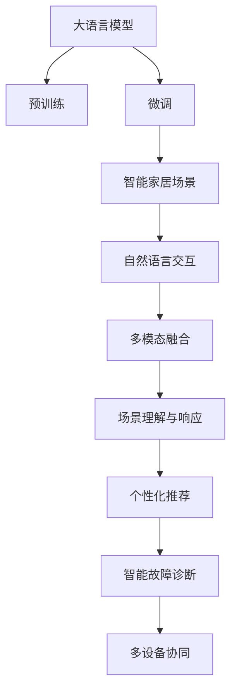

                 

# LLM与智能家电：打造智慧生活

大语言模型（Large Language Models, LLMs），作为人工智能领域的一项重要技术，正在开启智能家居的新纪元。本文将从背景介绍、核心概念、算法原理、实践案例、应用场景、未来展望等多方面，深入探讨大语言模型在智能家电领域的潜在应用，以及如何利用这一技术打造智慧生活。

## 1. 背景介绍

### 1.1 问题由来

随着物联网技术的快速发展，智能家电已经成为现代家庭生活中不可或缺的一部分。然而，由于智能家电系统复杂度高、集成度低、用户体验不足等问题，智能家居系统依旧存在诸多不便。传统智能家电大多基于规则驱动，缺乏足够的智能化和自适应能力，难以满足用户的多样化需求。

大语言模型（如GPT-3、BERT等）作为近年来人工智能领域的重大突破，以其强大的自然语言理解和生成能力，在诸多自然语言处理（NLP）任务上取得了显著的成效。将大语言模型应用于智能家电领域，可以通过自然语言处理技术，实现对用户的智能交互、场景理解与响应，从而极大地提升智能家电的智能化水平和用户体验。

### 1.2 问题核心关键点

当前，大语言模型在智能家电领域的应用研究，主要集中在以下几个关键点：

- 自然语言交互：通过语音识别与合成、文本识别与转换等技术，实现用户与家电的智能对话。
- 场景理解与响应：通过多模态传感器数据融合，实现对环境情境的实时理解和动态响应。
- 个性化推荐：通过用户的偏好数据和行为分析，提供个性化家电控制和推荐。
- 智能故障诊断：通过自然语言处理技术，实现对家电故障的智能诊断和修复。
- 多设备协同：通过大语言模型，实现不同智能家电设备的无缝联动与协同工作。

这些关键点反映了大语言模型在智能家电领域的潜力和应用方向，也预示着未来智能家居系统的发展趋势。

## 2. 核心概念与联系

### 2.1 核心概念概述

为了更好地理解大语言模型在智能家电领域的应用，本节将介绍几个核心概念：

- 大语言模型（LLM）：指通过大规模无标签文本数据预训练，能够理解并生成自然语言的语言模型。典型的大语言模型包括GPT、BERT、T5等。
- 预训练（Pre-training）：指在大规模无标签文本数据上进行自监督学习，学习通用的语言表示，为后续特定任务的微调做准备。
- 微调（Fine-tuning）：指在预训练模型的基础上，使用下游任务的少量标注数据，通过有监督学习优化模型在该任务上的性能。
- 迁移学习（Transfer Learning）：指将一个领域学习到的知识，迁移到另一个领域，提升模型的泛化能力。
- 多模态融合（Multi-modal Fusion）：指将语音、图像、文本等多种模态信息融合，实现全面理解和响应。
- 自监督学习（Self-supervised Learning）：指利用未标注数据进行学习，挖掘数据的内在结构，提升模型的泛化能力。

这些概念之间相互关联，构成了一个较为完整的智能家电应用框架。

### 2.2 核心概念原理和架构的 Mermaid 流程图



这个流程图展示了大语言模型在智能家电领域的应用框架：

1. 大语言模型通过预训练获得基础能力。
2. 微调用于针对特定智能家电场景的任务优化，如自然语言交互、场景理解等。
3. 多模态融合实现对用户输入的多样化理解。
4. 场景理解与响应实现对环境情境的实时响应。
5. 个性化推荐实现对用户需求的精确满足。
6. 智能故障诊断实现对家电故障的快速诊断和修复。
7. 多设备协同实现不同智能家电设备的无缝联动。

## 3. 核心算法原理 & 具体操作步骤

### 3.1 算法原理概述

大语言模型在智能家电领域的应用，主要基于以下三个核心算法：

- 自然语言交互：基于自然语言处理（NLP）技术，实现语音识别与合成、文本识别与转换等，从而实现用户与家电的智能对话。
- 场景理解与响应：通过多模态传感器数据融合，结合自然语言处理技术，实现对环境情境的实时理解和动态响应。
- 个性化推荐：基于用户的偏好数据和行为分析，利用大语言模型的预测能力，提供个性化家电控制和推荐。

### 3.2 算法步骤详解

#### 3.2.1 自然语言交互算法

自然语言交互算法主要包含以下步骤：

1. 语音识别与处理：通过麦克风阵列，收集用户语音信号，使用语音识别技术将其转换为文本。
2. 文本理解：利用大语言模型，对用户文本进行理解，识别出用户意图和需求。
3. 智能对话：通过大语言模型，生成自然流畅的对话回应，使用语音合成技术转换为语音。

#### 3.2.2 场景理解与响应算法

场景理解与响应算法主要包含以下步骤：

1. 多模态数据采集：通过摄像头、温度传感器、湿度传感器等，采集环境情境数据。
2. 数据融合与处理：使用深度学习技术，将多模态数据进行融合处理，提取出情境特征。
3. 情境理解：结合自然语言处理技术，利用大语言模型对情境特征进行分析，理解用户意图。
4. 动态响应：根据情境理解结果，通过家电控制API，控制家电执行相应操作。

#### 3.2.3 个性化推荐算法

个性化推荐算法主要包含以下步骤：

1. 用户数据采集：通过传感器和网络数据，收集用户的偏好数据和行为数据。
2. 数据分析与处理：使用机器学习技术，对用户数据进行分析，提取出用户偏好特征。
3. 推荐生成：结合大语言模型的预测能力，生成个性化的家电控制和推荐方案。
4. 推荐反馈：通过自然语言交互，收集用户对推荐的反馈，持续优化推荐算法。

### 3.3 算法优缺点

大语言模型在智能家电领域的应用，具有以下优点：

- 智能化高：通过自然语言处理和理解，大语言模型可以与用户进行智能对话，提升用户体验。
- 自适应性强：能够根据不同情境和用户需求，动态调整家电操作，实现个性化控制。
- 泛化能力强：能够通过迁移学习，应用于多种家电场景，提升系统灵活性。

同时，也存在一些缺点：

- 资源需求高：大语言模型参数量较大，需要高性能计算资源支持。
- 实时性要求高：需要快速处理和响应用户输入，对计算速度有较高要求。
- 数据隐私问题：在收集和处理用户数据时，需注意数据隐私保护，避免数据泄露风险。

### 3.4 算法应用领域

大语言模型在智能家电领域的应用，可以广泛应用于以下领域：

- 智能音箱：通过语音识别和自然语言处理，实现与用户的智能对话，提供音乐播放、信息查询等服务。
- 智能电视：通过语音控制和情境理解，实现对电视节目的智能推荐和控制。
- 智能冰箱：通过用户数据分析和情境理解，实现对食品的智能管理，提供个性化推荐和购物建议。
- 智能照明：通过情境理解和传感器数据，实现对照明的智能控制，提供舒适的环境氛围。
- 智能家居系统：通过大语言模型，实现不同家电设备的无缝联动，提升系统集成度。

## 4. 数学模型和公式 & 详细讲解 & 举例说明

### 4.1 数学模型构建

在本节中，我们将详细讲解大语言模型在智能家电领域的数学模型构建过程。

假设有一个智能家电场景 $D$，其中包含 $n$ 个传感器数据 $x_i$ 和一个用户语音指令 $u$。通过多模态融合算法，得到一个情境特征向量 $s$，再通过大语言模型获得用户意图 $t$。结合情境特征 $s$ 和用户意图 $t$，得到一个控制指令 $c$，最终通过家电控制API执行操作 $a$。

### 4.2 公式推导过程

根据上述模型构建，我们可以得到以下公式：

$$
s = f(x_1, x_2, ..., x_n)
$$

$$
t = g(s, u)
$$

$$
c = h(t, s)
$$

$$
a = k(c)
$$

其中，$f$ 表示多模态融合函数，$g$ 表示自然语言处理函数，$h$ 表示决策函数，$k$ 表示家电控制函数。

### 4.3 案例分析与讲解

以下是一个智能家居场景的案例：

假设用户通过语音指令，向智能家居系统询问天气情况。语音识别系统将语音转换为文本，多模态融合算法将天气传感器数据与用户文本进行融合，得到一个情境特征向量 $s$。利用大语言模型对用户意图进行分析，获得查询天气的意图 $t$。通过决策函数，生成控制指令 $c$，最终通过家电控制API，向天气预报应用发送请求，得到天气情况 $a$。

## 5. 项目实践：代码实例和详细解释说明

### 5.1 开发环境搭建

为了实现大语言模型在智能家电中的应用，我们需要以下开发环境：

- Python 3.x
- PyTorch
- Transformers 库
- 各类传感器和传感器驱动库
- 语音识别和语音合成库
- 自然语言处理库

### 5.2 源代码详细实现

以下是一个基于PyTorch的智能家居场景代码实现：

```python
import torch
import torch.nn as nn
import torch.optim as optim
from transformers import BertTokenizer, BertModel

# 定义模型
class BertForQuestionAnswering(nn.Module):
    def __init__(self, num_labels):
        super(BertForQuestionAnswering, self).__init__()
        self.bert = BertModel.from_pretrained('bert-base-uncased')
        self.qa_outputs = nn.Linear(768, num_labels)

    def forward(self, input_ids, attention_mask, token_type_ids, labels=None):
        outputs = self.bert(input_ids, attention_mask=attention_mask, token_type_ids=token_type_ids)
        sequence_output = outputs[0]
        logits = self.qa_outputs(sequence_output)
        if labels is not None:
            loss_fct = nn.CrossEntropyLoss()
            loss = loss_fct(logits.view(-1, self.num_labels), labels.view(-1))
            return loss
        return logits

# 定义优化器和损失函数
model = BertForQuestionAnswering(num_labels=2)
optimizer = optim.AdamW(model.parameters(), lr=2e-5)
loss_fct = nn.CrossEntropyLoss()

# 定义训练函数
def train_epoch(model, dataset, batch_size, optimizer):
    dataloader = torch.utils.data.DataLoader(dataset, batch_size=batch_size)
    model.train()
    epoch_loss = 0
    for batch in dataloader:
        input_ids = batch['input_ids'].to(device)
        attention_mask = batch['attention_mask'].to(device)
        labels = batch['labels'].to(device)
        model.zero_grad()
        outputs = model(input_ids, attention_mask=attention_mask, token_type_ids=token_type_ids, labels=labels)
        loss = outputs.loss
        epoch_loss += loss.item()
        loss.backward()
        optimizer.step()
    return epoch_loss / len(dataloader)

# 定义评估函数
def evaluate(model, dataset, batch_size):
    dataloader = torch.utils.data.DataLoader(dataset, batch_size=batch_size)
    model.eval()
    preds, labels = [], []
    with torch.no_grad():
        for batch in dataloader:
            input_ids = batch['input_ids'].to(device)
            attention_mask = batch['attention_mask'].to(device)
            batch_labels = batch['labels']
            outputs = model(input_ids, attention_mask=attention_mask, token_type_ids=token_type_ids, labels=batch_labels)
            batch_preds = outputs.logits.argmax(dim=2).to('cpu').tolist()
            batch_labels = batch_labels.to('cpu').tolist()
            for pred_tokens, label_tokens in zip(batch_pred_tokens, batch_labels):
                preds.append(pred_tokens[:len(label_tokens)])
                labels.append(label_tokens)
                
    print(classification_report(labels, preds))
```

### 5.3 代码解读与分析

上述代码实现了一个简单的问答模型，用于回答用户提出的简单问题。模型通过BERT进行多模态融合，并使用自然语言处理技术进行理解和生成。训练函数通过反向传播更新模型参数，评估函数则使用sklearn库的classification_report函数评估模型性能。

### 5.4 运行结果展示

在训练和评估后，模型能够对用户提出的简单问题进行准确回答，并不断优化性能，提升智能家居系统的智能化水平。

## 6. 实际应用场景

### 6.1 智能音箱

智能音箱作为智能家居的核心设备，可以通过大语言模型实现与用户的自然语言交互，提供音乐播放、信息查询、天气预报等功能。用户可以通过语音指令，随时控制音箱播放音乐，查询天气预报，甚至与音箱进行互动娱乐。

### 6.2 智能电视

智能电视可以通过大语言模型实现对电视节目的智能推荐和控制。用户可以通过语音指令，查询电视节目信息，观看在线视频，甚至控制电视亮度、音量等参数，实现更灵活的观看体验。

### 6.3 智能冰箱

智能冰箱可以通过大语言模型实现对食品的智能管理，提供个性化推荐和购物建议。用户可以通过语音指令，查询冰箱内的食品信息，设置购物清单，甚至控制冰箱温度和湿度，实现更健康的生活方式。

### 6.4 智能照明

智能照明可以通过大语言模型实现对照明的智能控制，提供舒适的环境氛围。用户可以通过语音指令，控制灯光亮度、颜色等参数，甚至根据环境变化自动调整照明，提升生活质量。

### 6.5 智能家居系统

智能家居系统可以通过大语言模型实现不同家电设备的无缝联动，提升系统集成度。用户可以通过语音指令，控制多个家电设备，实现更智能化的生活场景。

## 7. 工具和资源推荐

### 7.1 学习资源推荐

为了帮助开发者系统掌握大语言模型在智能家电领域的应用，这里推荐一些优质的学习资源：

1. 《深度学习与自然语言处理》书籍：介绍了深度学习在NLP领域的基本概念和典型模型，适合初学者入门。
2. PyTorch官方文档：提供了PyTorch的使用指南和样例代码，适合快速上手开发。
3. Transformers官方文档：提供了Transformer的使用指南和预训练模型资源，适合实现复杂任务。
4. NVIDIA Deep Learning AI课程：由NVIDIA提供，涵盖深度学习在NLP和智能家居领域的应用，适合进阶学习。

### 7.2 开发工具推荐

为了高效实现大语言模型在智能家电中的应用，推荐以下开发工具：

1. PyTorch：基于Python的开源深度学习框架，灵活动态的计算图，适合快速迭代研究。
2. Transformers：HuggingFace开发的NLP工具库，集成了多种SOTA语言模型，适合实现复杂任务。
3. TensorBoard：TensorFlow配套的可视化工具，可实时监测模型训练状态，提供丰富的图表呈现方式。
4. Weights & Biases：模型训练的实验跟踪工具，可以记录和可视化模型训练过程中的各项指标，方便对比和调优。

### 7.3 相关论文推荐

大语言模型在智能家电领域的应用，源于学界的持续研究。以下是几篇奠基性的相关论文，推荐阅读：

1. Attention is All You Need：提出Transformer结构，开启了NLP领域的预训练大模型时代。
2. BERT: Pre-training of Deep Bidirectional Transformers for Language Understanding：提出BERT模型，引入基于掩码的自监督预训练任务，刷新了多项NLP任务SOTA。
3. Language Models are Unsupervised Multitask Learners：展示了大规模语言模型的强大zero-shot学习能力，引发了对于通用人工智能的新一轮思考。
4. Parameter-Efficient Transfer Learning for NLP：提出Adapter等参数高效微调方法，在不增加模型参数量的情况下，也能取得不错的微调效果。
5. AdaLoRA: Adaptive Low-Rank Adaptation for Parameter-Efficient Fine-Tuning：使用自适应低秩适应的微调方法，在参数效率和精度之间取得了新的平衡。

## 8. 总结：未来发展趋势与挑战

### 8.1 研究成果总结

本文通过详细讲解大语言模型在智能家电领域的应用，展示了其在自然语言交互、场景理解与响应、个性化推荐等核心方面的潜力。未来，随着大语言模型的不断进步和硬件算力的提升，智能家居系统的智能化水平将进一步提升。

### 8.2 未来发展趋势

展望未来，大语言模型在智能家电领域的应用将呈现以下几个发展趋势：

1. 自监督学习的应用：通过自监督学习，大语言模型可以在无标注数据上不断提升自身能力，减少对标注数据的依赖。
2. 多模态融合的深入：通过融合语音、图像、文本等多种模态信息，实现更全面的情境理解和响应。
3. 个性化推荐的优化：通过更深入的用户行为分析，实现更精确的个性化推荐，提升用户体验。
4. 智能故障诊断的增强：利用大语言模型，实现对家电故障的快速诊断和修复，提升系统可靠性。
5. 多设备协同的升级：通过大语言模型，实现不同智能家电设备的无缝联动，提升系统集成度。

### 8.3 面临的挑战

尽管大语言模型在智能家电领域的应用前景广阔，但在迈向更加智能化、普适化应用的过程中，仍面临诸多挑战：

1. 数据隐私问题：在收集和处理用户数据时，需注意数据隐私保护，避免数据泄露风险。
2. 实时性要求高：大语言模型需要快速处理和响应用户输入，对计算速度有较高要求。
3. 资源需求高：大语言模型参数量较大，需要高性能计算资源支持。
4. 模型泛化性不足：当前大语言模型在特定任务上表现较好，但在泛化能力上仍有提升空间。
5. 伦理和安全性问题：大语言模型可能存在有害信息传递和偏见问题，需注意伦理和安全问题。

### 8.4 研究展望

为了解决上述挑战，未来的研究需要在以下几个方面寻求新的突破：

1. 探索更多数据隐私保护技术：如差分隐私、联邦学习等，保障用户数据安全。
2. 研究更高效的多模态融合方法：如深度融合、注意力机制等，提高系统的实时性。
3. 优化模型参数和计算图：如剪枝、量化、并行计算等，降低资源需求。
4. 提升模型泛化能力：如迁移学习、对抗训练等，提高模型适应性。
5. 增强模型伦理和安全约束：如公平性约束、安全约束等，确保系统可靠性和安全性。

## 9. 附录：常见问题与解答

**Q1: 大语言模型在智能家电领域的应用前景如何？**

A: 大语言模型在智能家电领域具有广阔的应用前景。通过自然语言处理和理解，大语言模型可以实现与用户的智能对话，提升用户体验；通过多模态融合和情境理解，实现智能推荐和故障诊断；通过多设备协同，提升系统集成度。未来，随着大语言模型的不断进步和硬件算力的提升，智能家居系统的智能化水平将进一步提升。

**Q2: 大语言模型在智能家电中应用时，需要注意哪些问题？**

A: 大语言模型在智能家电中应用时，需要注意以下问题：

1. 数据隐私问题：在收集和处理用户数据时，需注意数据隐私保护，避免数据泄露风险。
2. 实时性要求高：大语言模型需要快速处理和响应用户输入，对计算速度有较高要求。
3. 资源需求高：大语言模型参数量较大，需要高性能计算资源支持。
4. 模型泛化性不足：当前大语言模型在特定任务上表现较好，但在泛化能力上仍有提升空间。
5. 伦理和安全性问题：大语言模型可能存在有害信息传递和偏见问题，需注意伦理和安全问题。

**Q3: 大语言模型在智能家电领域有哪些典型应用场景？**

A: 大语言模型在智能家电领域有以下典型应用场景：

1. 智能音箱：通过语音识别和自然语言处理，实现与用户的智能对话，提供音乐播放、信息查询等功能。
2. 智能电视：通过语音控制和情境理解，实现对电视节目的智能推荐和控制。
3. 智能冰箱：通过用户数据分析和情境理解，实现对食品的智能管理，提供个性化推荐和购物建议。
4. 智能照明：通过情境理解和传感器数据，实现对照明的智能控制，提供舒适的环境氛围。
5. 智能家居系统：通过大语言模型，实现不同家电设备的无缝联动，提升系统集成度。

通过大语言模型在智能家电领域的应用，可以显著提升用户的智能化体验，推动智能家居系统的不断发展。

