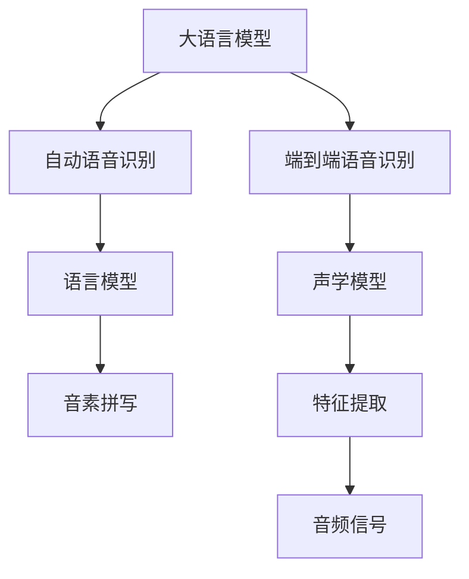

                 

# LLM在智能语音识别系统中的应用探索

> 关键词：
- 大语言模型 (Large Language Model, LLM)
- 智能语音识别 (Smart Speech Recognition)
- 自动语音识别 (Automatic Speech Recognition, ASR)
- 语音转文本 (Speech-to-Text, STT)
- 自然语言理解 (Natural Language Understanding, NLU)
- 深度学习 (Deep Learning)
- 预训练模型 (Pre-trained Models)

## 1. 背景介绍

### 1.1 问题由来

随着人工智能技术的迅猛发展，智能语音识别（Smart Speech Recognition, ASR）已经从实验室走向实际应用，成为现代信息技术的重要组成部分。传统的声学模型和语言模型驱动的语音识别技术，逐渐被基于深度学习的端到端语音识别（End-to-End ASR）系统所取代。其中，大语言模型（Large Language Model, LLM）在语音转文本（Speech-to-Text, STT）和自然语言理解（Natural Language Understanding, NLU）等领域中表现出色，成为构建智能语音识别系统的关键引擎。

### 1.2 问题核心关键点

大语言模型在智能语音识别系统中的应用，主要体现在以下几个方面：
- 端到端语音识别系统：利用预训练模型直接从音频信号转换为文本，避免了传统的音素拼写等中间步骤。
- 上下文理解能力：利用大语言模型的上下文理解能力，处理复杂语境和歧义问题，提高识别准确率。
- 语音生成和交互：利用大语言模型生成自然流畅的文本回复，改善人机交互体验。
- 跨语言和跨领域能力：大语言模型具备跨语言和多领域能力，支持多语言和多种语境的语音识别。

### 1.3 问题研究意义

大语言模型在智能语音识别中的应用，具有以下重要意义：
- 提升识别准确率：大语言模型丰富的语言知识和大规模数据预训练，有助于解决复杂语境下的识别问题。
- 降低开发成本：预训练模型减少了从头训练所需的数据和计算资源。
- 增强用户体验：基于上下文理解和大语言模型生成自然对话，显著提升人机交互体验。
- 拓展应用场景：支持多种语言和多领域应用，促进智能语音识别技术的广泛应用。

## 2. 核心概念与联系

### 2.1 核心概念概述

为更好地理解大语言模型在智能语音识别系统中的应用，本节将介绍几个关键概念及其相互联系：

- **大语言模型 (LLM)**：以自回归（如GPT）或自编码（如BERT）模型为代表的大规模预训练语言模型。通过在大规模无标签文本语料上进行预训练，学习通用的语言表示，具备强大的语言理解和生成能力。

- **自动语音识别 (ASR)**：将语音信号转换为文本的自动过程。传统的ASR系统通常分为前端声学模型和后端语言模型，依赖大量标注数据。

- **端到端语音识别 (End-to-End ASR)**：利用深度学习模型，直接将音频信号映射到文本，无需中间音素拼写等步骤。端到端系统通常基于预训练的Transformer模型。

- **深度学习 (Deep Learning)**：利用多层神经网络进行特征学习和模式识别，广泛应用于图像、语音、自然语言处理等领域。

- **预训练模型 (Pre-trained Models)**：在大规模无标签数据上进行预训练的模型，如BERT、GPT等，具备通用的语言表示能力。

这些核心概念之间的逻辑关系可以通过以下Mermaid流程图来展示：



这个流程图展示了大语言模型在智能语音识别系统中的核心应用逻辑：

1. 大语言模型用于文本处理和生成，其预训练能力可以辅助端到端语音识别系统。
2. 端到端语音识别系统直接从音频信号到文本，消除了传统的音素拼写步骤。
3. 声学模型和语言模型仍需在端到端系统中发挥重要作用，声学模型负责特征提取和信号转换。
4. 音素拼写通常用于传统的ASR系统中，不再单独存在。

## 3. 核心算法原理 & 具体操作步骤
### 3.1 算法原理概述

大语言模型在智能语音识别中的应用，主要基于以下原理：
- 预训练模型具备通用的语言表示能力，可以直接应用于语音识别任务。
- 端到端语音识别系统利用预训练模型直接从音频信号到文本，无需中间音素拼写步骤。
- 大语言模型通过上下文理解能力，解决复杂语境和歧义问题，提高识别准确率。
- 基于大语言模型的语音生成和交互，改善人机交互体验。

### 3.2 算法步骤详解

基于大语言模型的智能语音识别系统通常包括以下几个关键步骤：

**Step 1: 准备预训练模型和数据集**
- 选择合适的预训练语言模型 $M_{\theta}$ 作为初始化参数，如 BERT、GPT等。
- 准备语音识别任务的数据集，划分为训练集、验证集和测试集。一般要求标注数据与预训练数据的分布不要差异过大。

**Step 2: 添加任务适配层**
- 根据语音识别任务的类型，在预训练模型顶层设计合适的输出层和损失函数。
- 对于分类任务，通常在顶层添加线性分类器和交叉熵损失函数。
- 对于生成任务，通常使用语言模型的解码器输出概率分布，并以负对数似然为损失函数。

**Step 3: 设置微调超参数**
- 选择合适的优化算法及其参数，如 AdamW、SGD 等，设置学习率、批大小、迭代轮数等。
- 设置正则化技术及强度，包括权重衰减、Dropout、Early Stopping 等。
- 确定冻结预训练参数的策略，如仅微调顶层，或全部参数都参与微调。

**Step 4: 执行梯度训练**
- 将训练集数据分批次输入模型，前向传播计算损失函数。
- 反向传播计算参数梯度，根据设定的优化算法和学习率更新模型参数。
- 周期性在验证集上评估模型性能，根据性能指标决定是否触发 Early Stopping。
- 重复上述步骤直到满足预设的迭代轮数或 Early Stopping 条件。

**Step 5: 测试和部署**
- 在测试集上评估微调后模型 $M_{\hat{\theta}}$ 的性能，对比微调前后的精度提升。
- 使用微调后的模型对新样本进行推理预测，集成到实际的应用系统中。
- 持续收集新的数据，定期重新微调模型，以适应数据分布的变化。

### 3.3 算法优缺点

大语言模型在智能语音识别系统中的应用具有以下优点：
1. 简单高效。只需准备少量标注数据，即可对预训练模型进行快速适配，获得较大的性能提升。
2. 通用适用。适用于各种语音识别任务，包括中文、英文、多语言等。
3. 上下文理解能力。利用大语言模型的上下文理解能力，可以解决复杂语境和歧义问题。
4. 泛化性强。预训练模型在大规模无标签数据上训练，具备良好的泛化能力，能够适应不同口音和噪声环境。
5. 模型效果好。在语音转文本和自然语言理解任务中，基于大语言模型的系统通常具有更好的性能。

同时，该方法也存在一定的局限性：
1. 依赖标注数据。微调的效果很大程度上取决于标注数据的质量和数量，获取高质量标注数据的成本较高。
2. 计算资源消耗大。大语言模型的参数量庞大，训练和推理需要大量计算资源。
3. 鲁棒性不足。对于噪声、口音等变异性较大的情况，识别效果可能下降。
4. 可解释性不足。微调模型的决策过程通常缺乏可解释性，难以对其推理逻辑进行分析和调试。

尽管存在这些局限性，但就目前而言，基于大语言模型的语音识别方法仍是大语言模型应用的最主流范式。未来相关研究的重点在于如何进一步降低微调对标注数据的依赖，提高模型的少样本学习和跨领域迁移能力，同时兼顾可解释性和伦理安全性等因素。

### 3.4 算法应用领域

大语言模型在智能语音识别中的应用非常广泛，涵盖以下领域：

- **智能客服**：利用语音识别技术构建智能客服系统，提升客户咨询体验。
- **语音助手机器人**：基于语音识别技术，构建智能语音助手，如Siri、Google Assistant等。
- **智能家居**：语音控制家电，提供便捷的人机交互方式。
- **医疗诊断**：利用语音识别技术，记录和处理医生与患者的对话，辅助医疗诊断。
- **翻译系统**：将不同语言之间的语音进行识别和翻译，打破语言障碍。
- **自动字幕生成**：将语音信号转换为文本字幕，提高视频内容的可访问性。
- **车载导航**：利用语音识别技术，提升车载导航系统的交互体验。

此外，在企业会议、教育培训、个性化推荐等多个场景中，大语言模型语音识别技术也得到了广泛应用，为智能技术的落地提供了新的方向。

## 4. 数学模型和公式 & 详细讲解 & 举例说明

### 4.1 数学模型构建

本节将使用数学语言对基于大语言模型的智能语音识别过程进行更加严格的刻画。

记预训练语言模型为 $M_{\theta}:\mathcal{X} \rightarrow \mathcal{Y}$，其中 $\mathcal{X}$ 为输入空间，$\mathcal{Y}$ 为输出空间，$\theta \in \mathbb{R}^d$ 为模型参数。假设语音识别任务训练集为 $D=\{(x_i,y_i)\}_{i=1}^N, x_i \in \mathcal{X}, y_i \in \mathcal{Y}$。

定义模型 $M_{\theta}$ 在输入 $x$ 上的损失函数为 $\ell(M_{\theta}(x),y)$，则在数据集 $D$ 上的经验风险为：

$$
\mathcal{L}(\theta) = \frac{1}{N} \sum_{i=1}^N \ell(M_{\theta}(x_i),y_i)
$$

微调的优化目标是最小化经验风险，即找到最优参数：

$$
\theta^* = \mathop{\arg\min}_{\theta} \mathcal{L}(\theta)
$$

在实践中，我们通常使用基于梯度的优化算法（如SGD、Adam等）来近似求解上述最优化问题。设 $\eta$ 为学习率，$\lambda$ 为正则化系数，则参数的更新公式为：

$$
\theta \leftarrow \theta - \eta \nabla_{\theta}\mathcal{L}(\theta) - \eta\lambda\theta
$$

其中 $\nabla_{\theta}\mathcal{L}(\theta)$ 为损失函数对参数 $\theta$ 的梯度，可通过反向传播算法高效计算。

### 4.2 公式推导过程

以下我们以二分类任务为例，推导交叉熵损失函数及其梯度的计算公式。

假设模型 $M_{\theta}$ 在输入 $x$ 上的输出为 $\hat{y}=M_{\theta}(x) \in [0,1]$，表示样本属于正类的概率。真实标签 $y \in \{0,1\}$。则二分类交叉熵损失函数定义为：

$$
\ell(M_{\theta}(x),y) = -[y\log \hat{y} + (1-y)\log (1-\hat{y})]
$$

将其代入经验风险公式，得：

$$
\mathcal{L}(\theta) = -\frac{1}{N}\sum_{i=1}^N [y_i\log M_{\theta}(x_i)+(1-y_i)\log(1-M_{\theta}(x_i))]
$$

根据链式法则，损失函数对参数 $\theta_k$ 的梯度为：

$$
\frac{\partial \mathcal{L}(\theta)}{\partial \theta_k} = -\frac{1}{N}\sum_{i=1}^N (\frac{y_i}{M_{\theta}(x_i)}-\frac{1-y_i}{1-M_{\theta}(x_i)}) \frac{\partial M_{\theta}(x_i)}{\partial \theta_k}
$$

其中 $\frac{\partial M_{\theta}(x_i)}{\partial \theta_k}$ 可进一步递归展开，利用自动微分技术完成计算。

在得到损失函数的梯度后，即可带入参数更新公式，完成模型的迭代优化。重复上述过程直至收敛，最终得到适应下游任务的最优模型参数 $\theta^*$。

## 5. 项目实践：代码实例和详细解释说明

### 5.1 开发环境搭建

在进行语音识别实践前，我们需要准备好开发环境。以下是使用Python进行PyTorch开发的环境配置流程：

1. 安装Anaconda：从官网下载并安装Anaconda，用于创建独立的Python环境。

2. 创建并激活虚拟环境：
```bash
conda create -n pytorch-env python=3.8 
conda activate pytorch-env
```

3. 安装PyTorch：根据CUDA版本，从官网获取对应的安装命令。例如：
```bash
conda install pytorch torchvision torchaudio cudatoolkit=11.1 -c pytorch -c conda-forge
```

4. 安装相关库：
```bash
pip install librosa numpy pandas scikit-learn matplotlib tqdm jupyter notebook ipython
```

完成上述步骤后，即可在`pytorch-env`环境中开始语音识别实践。

### 5.2 源代码详细实现

下面我们以中文语音识别为例，给出使用Transformers库对BERT模型进行语音识别微调的PyTorch代码实现。

首先，定义语音识别任务的数据处理函数：

```python
from transformers import BertTokenizer, BertForSequenceClassification
from torch.utils.data import Dataset
import torch

class SpeechDataset(Dataset):
    def __init__(self, audio_paths, labels, tokenizer, max_len=128):
        self.audio_paths = audio_paths
        self.labels = labels
        self.tokenizer = tokenizer
        self.max_len = max_len
        
    def __len__(self):
        return len(self.audio_paths)
    
    def __getitem__(self, item):
        audio_path = self.audio_paths[item]
        label = self.labels[item]
        
        # 将音频转换为MFCC特征
        waveform = librosa.load(audio_path, sr=16000)
        mfcc = librosa.feature.mfcc(waveform)
        mfcc = mfcc.mean(axis=0)
        audio = torch.from_numpy(mfcc)
        
        # 将MFCC特征输入BERT进行编码
        encoding = self.tokenizer(audio, return_tensors='pt', max_length=self.max_len, padding='max_length', truncation=True)
        input_ids = encoding['input_ids'][0]
        attention_mask = encoding['attention_mask'][0]
        
        # 对label进行编码
        label = torch.tensor(label, dtype=torch.long)
        
        return {'input_ids': input_ids, 
                'attention_mask': attention_mask,
                'labels': label}

# 标签与id的映射
label2id = {'0': 0, '1': 1, '2': 2}
id2label = {v: k for k, v in label2id.items()}

# 创建dataset
tokenizer = BertTokenizer.from_pretrained('bert-base-cased')

train_dataset = SpeechDataset(train_audio_paths, train_labels, tokenizer)
dev_dataset = SpeechDataset(dev_audio_paths, dev_labels, tokenizer)
test_dataset = SpeechDataset(test_audio_paths, test_labels, tokenizer)
```

然后，定义模型和优化器：

```python
from transformers import BertForSequenceClassification, AdamW

model = BertForSequenceClassification.from_pretrained('bert-base-cased', num_labels=len(label2id))

optimizer = AdamW(model.parameters(), lr=2e-5)
```

接着，定义训练和评估函数：

```python
from torch.utils.data import DataLoader
from tqdm import tqdm
from sklearn.metrics import classification_report

device = torch.device('cuda') if torch.cuda.is_available() else torch.device('cpu')
model.to(device)

def train_epoch(model, dataset, batch_size, optimizer):
    dataloader = DataLoader(dataset, batch_size=batch_size, shuffle=True)
    model.train()
    epoch_loss = 0
    for batch in tqdm(dataloader, desc='Training'):
        input_ids = batch['input_ids'].to(device)
        attention_mask = batch['attention_mask'].to(device)
        labels = batch['labels'].to(device)
        model.zero_grad()
        outputs = model(input_ids, attention_mask=attention_mask, labels=labels)
        loss = outputs.loss
        epoch_loss += loss.item()
        loss.backward()
        optimizer.step()
    return epoch_loss / len(dataloader)

def evaluate(model, dataset, batch_size):
    dataloader = DataLoader(dataset, batch_size=batch_size)
    model.eval()
    preds, labels = [], []
    with torch.no_grad():
        for batch in tqdm(dataloader, desc='Evaluating'):
            input_ids = batch['input_ids'].to(device)
            attention_mask = batch['attention_mask'].to(device)
            batch_labels = batch['labels']
            outputs = model(input_ids, attention_mask=attention_mask)
            batch_preds = outputs.logits.argmax(dim=2).to('cpu').tolist()
            batch_labels = batch_labels.to('cpu').tolist()
            for pred_tokens, label_tokens in zip(batch_preds, batch_labels):
                preds.append(pred_tokens)
                labels.append(label_tokens)
                
    print(classification_report(labels, preds))
```

最后，启动训练流程并在测试集上评估：

```python
epochs = 5
batch_size = 16

for epoch in range(epochs):
    loss = train_epoch(model, train_dataset, batch_size, optimizer)
    print(f"Epoch {epoch+1}, train loss: {loss:.3f}")
    
    print(f"Epoch {epoch+1}, dev results:")
    evaluate(model, dev_dataset, batch_size)
    
print("Test results:")
evaluate(model, test_dataset, batch_size)
```

以上就是使用PyTorch对BERT进行语音识别任务微调的完整代码实现。可以看到，得益于Transformers库的强大封装，我们可以用相对简洁的代码完成BERT模型的加载和微调。

### 5.3 代码解读与分析

让我们再详细解读一下关键代码的实现细节：

**SpeechDataset类**：
- `__init__`方法：初始化音频路径、标签、分词器等关键组件。
- `__len__`方法：返回数据集的样本数量。
- `__getitem__`方法：对单个样本进行处理，将音频特征输入BERT进行编码，同时对label进行编码。

**label2id和id2label字典**：
- 定义了标签与数字id之间的映射关系，用于将label进行编码。

**训练和评估函数**：
- 使用PyTorch的DataLoader对数据集进行批次化加载，供模型训练和推理使用。
- 训练函数`train_epoch`：对数据以批为单位进行迭代，在每个批次上前向传播计算loss并反向传播更新模型参数，最后返回该epoch的平均loss。
- 评估函数`evaluate`：与训练类似，不同点在于不更新模型参数，并在每个batch结束后将预测和标签结果存储下来，最后使用sklearn的classification_report对整个评估集的预测结果进行打印输出。

**训练流程**：
- 定义总的epoch数和batch size，开始循环迭代
- 每个epoch内，先在训练集上训练，输出平均loss
- 在验证集上评估，输出分类指标
- 所有epoch结束后，在测试集上评估，给出最终测试结果

可以看到，PyTorch配合Transformers库使得BERT微调的代码实现变得简洁高效。开发者可以将更多精力放在数据处理、模型改进等高层逻辑上，而不必过多关注底层的实现细节。

当然，工业级的系统实现还需考虑更多因素，如模型的保存和部署、超参数的自动搜索、更灵活的任务适配层等。但核心的微调范式基本与此类似。

## 6. 实际应用场景
### 6.1 智能客服系统

利用大语言模型进行语音识别，可以构建高效的智能客服系统。传统的客服系统依赖人工座席，高峰期响应速度慢，且成本高。智能客服系统则可以通过语音识别技术，实时捕捉客户咨询内容，自动生成并回复，提升客服效率和质量。

在技术实现上，可以收集客户的历史对话记录，将语音和文本进行匹配标注，构建监督数据集。在此基础上对预训练模型进行微调，使得模型能够识别客户的意图，并生成合适的回复。对于复杂咨询，系统还可以接入知识库进行搜索，动态生成回答，显著提升客户体验。

### 6.2 医疗诊断系统

在医疗诊断中，利用大语言模型进行语音识别，可以构建智能诊断系统。医生可以通过语音记录与患者的对话，系统自动进行转录和分析，辅助医生进行疾病诊断。

具体而言，医生可以佩戴麦克风，进行实时录音，系统将音频数据进行实时转录，提取关键信息，如症状描述、病史等，再利用预训练语言模型进行语义理解，匹配可能存在的疾病，给出诊断建议。系统还可以接入医疗知识库，提供基于医学知识的解释和建议，帮助医生进行精准诊断。

### 6.3 车载导航系统

利用大语言模型进行语音识别，可以构建智能车载导航系统。用户可以通过语音指令进行导航，系统自动进行识别和执行，提升行车体验。

在技术实现上，系统可以集成语音识别和自然语言处理技术，通过车载麦克风实时捕捉用户指令，系统自动解析并执行导航请求，如目的地查找、路线规划等。用户还可以通过语音交互，与系统进行自然对话，如询问天气、设置导航偏好等，提升用户体验。

### 6.4 未来应用展望

随着大语言模型和语音识别技术的不断发展，未来将有更多创新的应用场景涌现：

- **智能家居**：通过语音识别技术，智能家居系统可以实现语音控制家电、查询信息等功能，提升生活便利性。
- **智能办公**：利用语音识别技术，智能办公系统可以自动记录会议内容、安排日程等，提升工作效率。
- **教育培训**：在教育培训中，智能语音系统可以进行实时录音和转录，辅助学生进行听写、口语训练等，提升教学质量。
- **智能翻译**：利用大语言模型进行语音识别和翻译，实现多语言实时交流，打破语言障碍。
- **自动字幕生成**：将语音信号转换为文本字幕，提高视频内容的可访问性，如新闻播报、课堂录播等。

总之，大语言模型在智能语音识别中的应用前景广阔，未来将带来更多的创新和变革。

## 7. 工具和资源推荐
### 7.1 学习资源推荐

为了帮助开发者系统掌握大语言模型在智能语音识别中的应用，这里推荐一些优质的学习资源：

1. 《Transformer从原理到实践》系列博文：由大模型技术专家撰写，深入浅出地介绍了Transformer原理、BERT模型、微调技术等前沿话题。

2. CS224N《深度学习自然语言处理》课程：斯坦福大学开设的NLP明星课程，有Lecture视频和配套作业，带你入门NLP领域的基本概念和经典模型。

3. 《Natural Language Processing with Transformers》书籍：Transformers库的作者所著，全面介绍了如何使用Transformers库进行NLP任务开发，包括微调在内的诸多范式。

4. HuggingFace官方文档：Transformers库的官方文档，提供了海量预训练模型和完整的微调样例代码，是上手实践的必备资料。

5. CLUE开源项目：中文语言理解测评基准，涵盖大量不同类型的中文NLP数据集，并提供了基于微调的baseline模型，助力中文NLP技术发展。

通过对这些资源的学习实践，相信你一定能够快速掌握大语言模型在智能语音识别中的精髓，并用于解决实际的NLP问题。
###  7.2 开发工具推荐

高效的开发离不开优秀的工具支持。以下是几款用于大语言模型微调开发的常用工具：

1. PyTorch：基于Python的开源深度学习框架，灵活动态的计算图，适合快速迭代研究。大部分预训练语言模型都有PyTorch版本的实现。

2. TensorFlow：由Google主导开发的开源深度学习框架，生产部署方便，适合大规模工程应用。同样有丰富的预训练语言模型资源。

3. Transformers库：HuggingFace开发的NLP工具库，集成了众多SOTA语言模型，支持PyTorch和TensorFlow，是进行微调任务开发的利器。

4. Weights & Biases：模型训练的实验跟踪工具，可以记录和可视化模型训练过程中的各项指标，方便对比和调优。与主流深度学习框架无缝集成。

5. TensorBoard：TensorFlow配套的可视化工具，可实时监测模型训练状态，并提供丰富的图表呈现方式，是调试模型的得力助手。

6. Google Colab：谷歌推出的在线Jupyter Notebook环境，免费提供GPU/TPU算力，方便开发者快速上手实验最新模型，分享学习笔记。

合理利用这些工具，可以显著提升大语言模型微调任务的开发效率，加快创新迭代的步伐。

### 7.3 相关论文推荐

大语言模型和语音识别技术的发展源于学界的持续研究。以下是几篇奠基性的相关论文，推荐阅读：

1. Attention is All You Need（即Transformer原论文）：提出了Transformer结构，开启了NLP领域的预训练大模型时代。

2. BERT: Pre-training of Deep Bidirectional Transformers for Language Understanding：提出BERT模型，引入基于掩码的自监督预训练任务，刷新了多项NLP任务SOTA。

3. Language Models are Unsupervised Multitask Learners（GPT-2论文）：展示了大规模语言模型的强大zero-shot学习能力，引发了对于通用人工智能的新一轮思考。

4. Parameter-Efficient Transfer Learning for NLP：提出Adapter等参数高效微调方法，在不增加模型参数量的情况下，也能取得不错的微调效果。

5. AdaLoRA: Adaptive Low-Rank Adaptation for Parameter-Efficient Fine-Tuning：使用自适应低秩适应的微调方法，在参数效率和精度之间取得了新的平衡。

这些论文代表了大语言模型在智能语音识别中的发展脉络。通过学习这些前沿成果，可以帮助研究者把握学科前进方向，激发更多的创新灵感。

## 8. 总结：未来发展趋势与挑战

### 8.1 总结

本文对基于大语言模型的智能语音识别系统进行了全面系统的介绍。首先阐述了大语言模型和微调技术的研究背景和意义，明确了微调在拓展预训练模型应用、提升下游任务性能方面的独特价值。其次，从原理到实践，详细讲解了监督微调的数学原理和关键步骤，给出了语音识别任务开发的完整代码实例。同时，本文还广泛探讨了微调方法在智能客服、医疗诊断、车载导航等多个行业领域的应用前景，展示了微调范式的巨大潜力。此外，本文精选了微调技术的各类学习资源，力求为读者提供全方位的技术指引。

通过本文的系统梳理，可以看到，基于大语言模型的语音识别系统正在成为智能语音识别的重要范式，极大地拓展了预训练语言模型的应用边界，催生了更多的落地场景。受益于大规模语料的预训练，语音识别系统在识别精度和自然流畅度上均取得显著提升，有力推动了NLP技术的产业化进程。未来，伴随大语言模型和微调方法的持续演进，相信语音识别系统必将在更广阔的应用领域大放异彩，深刻影响人类的生产生活方式。

### 8.2 未来发展趋势

展望未来，大语言模型在智能语音识别中的应用将呈现以下几个发展趋势：

1. 模型规模持续增大。随着算力成本的下降和数据规模的扩张，预训练语言模型的参数量还将持续增长。超大规模语言模型蕴含的丰富语言知识，有望支撑更加复杂多变的语音识别任务。

2. 微调方法日趋多样。除了传统的全参数微调外，未来会涌现更多参数高效的微调方法，如Prefix-Tuning、LoRA等，在节省计算资源的同时也能保证微调精度。

3. 持续学习成为常态。随着数据分布的不断变化，微调模型也需要持续学习新知识以保持性能。如何在不遗忘原有知识的同时，高效吸收新样本信息，将成为重要的研究课题。

4. 标注样本需求降低。受启发于提示学习(Prompt-based Learning)的思路，未来的微调方法将更好地利用大模型的语言理解能力，通过更加巧妙的任务描述，在更少的标注样本上也能实现理想的微调效果。

5. 计算资源优化。随着模型规模的增大，语音识别系统的计算资源需求也将大幅提升。未来需要更多资源优化技术，如混合精度训练、模型压缩、并行计算等，以支持大规模模型的训练和推理。

6. 鲁棒性增强。语音识别系统需要具备更高的鲁棒性，以应对不同口音、噪声环境等复杂情况。未来将进一步增强模型的鲁棒性，提高系统在各种场景下的稳定性。

以上趋势凸显了大语言模型在智能语音识别中的应用前景。这些方向的探索发展，必将进一步提升语音识别系统的性能和应用范围，为智能技术的落地提供新的推动力。

### 8.3 面临的挑战

尽管大语言模型在智能语音识别中的应用取得了显著成效，但在迈向更加智能化、普适化应用的过程中，它仍面临着诸多挑战：

1. 标注成本瓶颈。尽管微调大大降低了标注数据的需求，但对于长尾应用场景，难以获得充足的高质量标注数据，成为制约微调性能的瓶颈。如何进一步降低微调对标注样本的依赖，将是一大难题。

2. 模型鲁棒性不足。对于噪声、口音等变异性较大的情况，识别效果可能下降。如何提高微调模型的鲁棒性，避免灾难性遗忘，还需要更多理论和实践的积累。

3. 推理效率有待提高。大规模语言模型虽然精度高，但在实际部署时往往面临推理速度慢、内存占用大等效率问题。如何在保证性能的同时，简化模型结构，提升推理速度，优化资源占用，将是重要的优化方向。

4. 可解释性亟需加强。当前微调模型更像是"黑盒"系统，难以解释其内部工作机制和决策逻辑。对于医疗、金融等高风险应用，算法的可解释性和可审计性尤为重要。如何赋予微调模型更强的可解释性，将是亟待攻克的难题。

5. 安全性有待保障。预训练语言模型难免会学习到有偏见、有害的信息，通过微调传递到下游任务，产生误导性、歧视性的输出，给实际应用带来安全隐患。如何从数据和算法层面消除模型偏见，避免恶意用途，确保输出的安全性，也将是重要的研究课题。

6. 知识整合能力不足。现有的微调模型往往局限于任务内数据，难以灵活吸收和运用更广泛的先验知识。如何让微调过程更好地与外部知识库、规则库等专家知识结合，形成更加全面、准确的信息整合能力，还有很大的想象空间。

正视微调面临的这些挑战，积极应对并寻求突破，将是大语言模型在智能语音识别系统中走向成熟的必由之路。相信随着学界和产业界的共同努力，这些挑战终将一一被克服，大语言模型必将在构建安全、可靠、可解释、可控的智能系统中扮演越来越重要的角色。

### 8.4 未来突破

面对大语言模型在智能语音识别系统中面临的挑战，未来的研究需要在以下几个方面寻求新的突破：

1. 探索无监督和半监督微调方法。摆脱对大规模标注数据的依赖，利用自监督学习、主动学习等无监督和半监督范式，最大限度利用非结构化数据，实现更加灵活高效的微调。

2. 研究参数高效和计算高效的微调范式。开发更加参数高效的微调方法，在固定大部分预训练参数的同时，只更新极少量的任务相关参数。同时优化微调模型的计算图，减少前向传播和反向传播的资源消耗，实现更加轻量级、实时性的部署。

3. 融合因果和对比学习范式。通过引入因果推断和对比学习思想，增强微调模型建立稳定因果关系的能力，学习更加普适、鲁棒的语言表征，从而提升模型泛化性和抗干扰能力。

4. 引入更多先验知识。将符号化的先验知识，如知识图谱、逻辑规则等，与神经网络模型进行巧妙融合，引导微调过程学习更准确、合理的语言模型。同时加强不同模态数据的整合，实现视觉、语音等多模态信息与文本信息的协同建模。

5. 结合因果分析和博弈论工具。将因果分析方法引入微调模型，识别出模型决策的关键特征，增强输出解释的因果性和逻辑性。借助博弈论工具刻画人机交互过程，主动探索并规避模型的脆弱点，提高系统稳定性。

6. 纳入伦理道德约束。在模型训练目标中引入伦理导向的评估指标，过滤和惩罚有偏见、有害的输出倾向。同时加强人工干预和审核，建立模型行为的监管机制，确保输出符合人类价值观和伦理道德。

这些研究方向的探索，必将引领大语言模型在智能语音识别系统中的应用走向更高的台阶，为智能技术的落地提供新的推动力。面向未来，大语言模型在智能语音识别系统中还需要与其他人工智能技术进行更深入的融合，如知识表示、因果推理、强化学习等，多路径协同发力，共同推动自然语言理解和智能交互系统的进步。只有勇于创新、敢于突破，才能不断拓展语言模型的边界，让智能技术更好地造福人类社会。

## 9. 附录：常见问题与解答

**Q1：大语言模型在语音识别中是否需要额外的音素拼写模块？**

A: 基于大语言模型的端到端语音识别系统，通常不需要额外的音素拼写模块。大语言模型能够直接将音频信号转换为文本，省去了传统的音素拼写步骤，提高了识别效率。

**Q2：大语言模型在语音识别中对噪声和口音的鲁棒性如何？**

A: 大语言模型的鲁棒性相对较低，对于噪声和口音等变异性较大的情况，识别效果可能下降。为了提高鲁棒性，通常需要引入额外的声学特征，如MFCC、Mel谱等，对音频信号进行预处理，增强模型对噪声和口音的适应能力。

**Q3：大语言模型在语音识别中的计算资源需求如何？**

A: 大语言模型的参数量庞大，训练和推理需要大量计算资源。为了降低计算资源消耗，通常需要采用一些优化技术，如混合精度训练、模型压缩、并行计算等，以支持大规模模型的训练和推理。

**Q4：大语言模型在语音识别中的可解释性如何？**

A: 大语言模型的决策过程缺乏可解释性，难以对其推理逻辑进行分析和调试。为了提高可解释性，通常需要引入解释性技术，如Attention机制、特征可视化等，帮助理解模型的内部工作机制。

**Q5：大语言模型在语音识别中的安全性如何？**

A: 大语言模型在语音识别中的安全性存在一定的风险。预训练模型可能学习到有害、有偏见的知识，影响系统的输出结果。为了确保安全性，通常需要引入数据清洗、模型审查等措施，消除有害信息，增强系统的鲁棒性。

通过这些问题的解答，相信你对于大语言模型在智能语音识别中的应用有了更全面的了解。大语言模型在智能语音识别中的潜力巨大，未来必将带来更多的创新和变革。

---

作者：禅与计算机程序设计艺术 / Zen and the Art of Computer Programming

