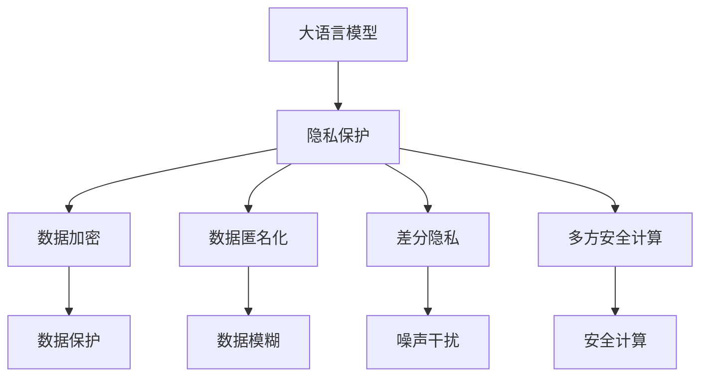

                 

# LLM隐私安全:线程安全问题的应对之策

> 关键词：人工智能隐私安全,线程安全,隐私保护,大语言模型,数据加密,数据匿名化,数据隐私,数据共享

## 1. 背景介绍

### 1.1 问题由来
随着人工智能技术的飞速发展，尤其是以大语言模型（LLM）为代表的人工智能系统的广泛应用，数据隐私和安全问题变得日益突出。大语言模型通常依赖于海量的数据进行训练，这些数据往往包含了敏感的个人隐私信息，如个人信息、行为轨迹、社交关系等。一旦模型泄露，将可能对个人隐私安全造成严重威胁。

近年来，大语言模型在自然语言处理、机器翻译、智能问答等诸多领域取得了显著成果。然而，随之而来的是对数据隐私安全的高度关注。如何在保证大语言模型性能的同时，确保数据隐私安全，成为了一个亟待解决的问题。

### 1.2 问题核心关键点
数据隐私保护是大语言模型应用过程中的一大核心问题。主要包括以下几个方面：

- **数据隐私泄露风险**：大语言模型在训练和推理过程中，需要访问大量的个人隐私数据。这些数据如果泄露，可能会造成严重隐私侵害。
- **数据匿名化技术**：如何在不破坏模型性能的前提下，对数据进行匿名化处理，是保护数据隐私的关键。
- **差分隐私保护**：如何在模型训练和推理过程中，引入差分隐私技术，防止个体隐私泄露。
- **多方安全计算**：在需要多个数据源参与模型训练和推理的场景中，如何在不共享原始数据的前提下，进行安全计算。

## 2. 核心概念与联系

### 2.1 核心概念概述

为更好地理解大语言模型隐私安全的技术框架，本节将介绍几个关键概念：

- **大语言模型（LLM）**：以Transformer等架构为代表的大规模预训练语言模型。通过在大规模无标签文本语料上进行预训练，学习通用的语言表示，具备强大的语言理解和生成能力。
- **隐私保护**：通过技术手段，对个人隐私信息进行保护，防止泄露和滥用。包括数据加密、数据匿名化、差分隐私等方法。
- **线程安全**：在多线程环境下，确保数据操作的一致性和正确性。大语言模型通常需要在多线程环境中进行数据处理和计算。
- **数据加密**：使用加密算法对数据进行保护，确保数据在传输和存储过程中不被非法获取。
- **数据匿名化**：通过对数据进行变换，使数据无法直接识别到个体，保护个体隐私。
- **差分隐私**：在数据收集和处理过程中，加入噪声干扰，使个体数据无法被唯一识别，从而保护隐私。
- **多方安全计算**：在多方参与的计算过程中，通过加密技术和安全协议，确保数据不泄露。

这些核心概念之间的逻辑关系可以通过以下Mermaid流程图来展示：



这个流程图展示了大语言模型隐私保护的核心概念及其之间的关系：

1. 大语言模型通过预训练获得基础能力。
2. 隐私保护涵盖数据加密、匿名化、差分隐私等多方面技术手段。
3. 线程安全确保在多线程环境下数据操作的正确性。
4. 数据加密和匿名化对模型输入数据进行保护，差分隐私对模型训练数据进行保护，多方安全计算对模型共享数据进行保护。

这些概念共同构成了大语言模型隐私保护的技术框架，使其能够更好地应对隐私安全问题。

## 3. 核心算法原理 & 具体操作步骤
### 3.1 算法原理概述

大语言模型隐私安全的技术框架主要通过以下几个核心算法实现：

1. **数据加密**：使用加密算法对数据进行保护，确保数据在传输和存储过程中不被非法获取。
2. **数据匿名化**：通过对数据进行变换，使数据无法直接识别到个体，保护个体隐私。
3. **差分隐私**：在数据收集和处理过程中，加入噪声干扰，使个体数据无法被唯一识别，从而保护隐私。
4. **多方安全计算**：在多方参与的计算过程中，通过加密技术和安全协议，确保数据不泄露。

这些算法共同构成了大语言模型隐私保护的技术框架，确保模型输入和计算过程的安全性。

### 3.2 算法步骤详解

以下将详细讲解大语言模型隐私安全的核心算法步骤：

**Step 1: 数据预处理与加密**

在模型训练前，需要对输入数据进行预处理和加密。常见的预处理步骤包括数据清洗、数据标准化等。同时，为了保护数据隐私，需要对数据进行加密。常用的加密算法包括AES、RSA等，对模型输入数据进行加密处理。

**Step 2: 数据匿名化**

数据匿名化是保护个体隐私的关键步骤。常见的数据匿名化技术包括数据模糊化、数据脱敏等。通过将数据进行随机化或替换，使其无法直接识别到个体，从而保护隐私。

**Step 3: 差分隐私**

差分隐私通过在模型训练和推理过程中加入噪声干扰，保护个体数据的隐私。具体实现方式包括Laplace机制、Gaussian机制等。通过控制噪声的强度和分布，可以平衡模型的性能和隐私保护需求。

**Step 4: 多方安全计算**

在需要多个数据源参与模型训练和推理的场景中，通过多方安全计算技术，确保数据不泄露。常见的多方安全计算技术包括同态加密、多方安全协议等。通过这些技术，可以在不共享原始数据的情况下，进行安全计算。

**Step 5: 模型训练与推理**

在模型训练和推理过程中，需要确保数据的线程安全。常见的线程安全技术包括互斥锁、读写锁等。通过这些技术，确保在多线程环境下，数据操作的正确性和一致性。

### 3.3 算法优缺点

大语言模型隐私安全的技术框架具有以下优点：

1. **全面性**：涵盖了数据预处理、加密、匿名化、差分隐私、多方安全计算等多方面技术手段，确保数据在各个环节的安全性。
2. **灵活性**：可以根据具体应用场景，灵活选择适合的隐私保护技术，如选择不同的加密算法、匿名化方法、差分隐私参数等。
3. **鲁棒性**：通过多层次的隐私保护措施，增强了数据安全性和模型鲁棒性，防止个体隐私泄露和数据篡改。

同时，该技术框架也存在一定的局限性：

1. **计算开销大**：加密、匿名化、差分隐私等技术手段往往需要额外的计算资源，增加了模型训练和推理的复杂度。
2. **性能影响**：一些隐私保护技术，如差分隐私，可能会对模型性能产生一定的影响，需要在模型性能和隐私保护之间进行平衡。
3. **实现复杂**：隐私保护技术的实现较为复杂，需要综合考虑多方面因素，如数据分布、噪声强度、计算资源等。

尽管存在这些局限性，但大语言模型隐私安全的技术框架仍是大规模语言模型应用过程中不可或缺的一部分。未来相关研究将致力于降低计算开销，提高隐私保护效率，同时提升模型性能。

### 3.4 算法应用领域

大语言模型隐私安全的技术框架在多个领域都有广泛应用：

- **自然语言处理（NLP）**：保护NLP任务的训练数据和模型输出中的个体隐私。
- **智能问答系统**：保护用户输入的查询和对话记录中的隐私信息。
- **机器翻译**：保护源语言和目标语言文本中的隐私信息。
- **情感分析**：保护用户评论、社交媒体等文本数据中的隐私信息。
- **智能推荐**：保护用户行为数据中的隐私信息。

这些领域的应用场景丰富多样，展示了隐私保护技术在大语言模型中的应用潜力。

## 4. 数学模型和公式 & 详细讲解
### 4.1 数学模型构建

本节将使用数学语言对大语言模型隐私安全的技术框架进行更加严格的刻画。

记输入数据为 $D=\{(x_i, y_i)\}_{i=1}^N$，其中 $x_i$ 为输入，$y_i$ 为标签。假设模型参数为 $\theta$，通过优化损失函数 $\mathcal{L}(\theta, D)$ 进行训练。

定义隐私保护的数学模型为 $M^{\text{priv}}(\theta, D)$，其中 $M^{\text{priv}}(\theta, D)$ 表示在隐私保护条件下，模型对数据的处理方式。

### 4.2 公式推导过程

以下我们以差分隐私为例，推导差分隐私保护的数学模型：

定义差分隐私损失函数为：

$$
\mathcal{L}_{\text{diff}}(\theta) = \frac{1}{N}\sum_{i=1}^N [\ell(M^{\text{priv}}(x_i, y_i), y_i) + \Delta]
$$

其中 $\ell$ 为模型损失函数，$\Delta$ 为差分隐私噪声，通常取Laplace分布或Gaussian分布。

差分隐私的参数为 $\epsilon$，表示隐私保护的强度。在差分隐私机制下，模型的训练过程为：

$$
\theta^* = \mathop{\arg\min}_{\theta} \mathcal{L}(\theta, D) + \Delta
$$

其中 $\Delta$ 为差分隐私噪声，$\epsilon$ 为隐私保护强度参数。

差分隐私的公式推导过程：

1. 定义差分隐私损失函数 $\mathcal{L}_{\text{diff}}(\theta)$。
2. 引入差分隐私噪声 $\Delta$。
3. 通过优化损失函数，求解模型参数 $\theta^*$。

差分隐私的数学模型为：

$$
M^{\text{priv}}(x, y) = M^{\text{priv}}(x, y; \epsilon, \Delta) = \mathop{\arg\min}_{\theta} \mathcal{L}(\theta, (x, y)) + \Delta
$$

### 4.3 案例分析与讲解

以智能问答系统为例，分析差分隐私的实际应用：

假设系统收到用户提出的查询 $q$，通过模型生成答案 $a$。查询 $q$ 和答案 $a$ 包含敏感信息，需要进行隐私保护。

1. **数据预处理与加密**：将查询 $q$ 和答案 $a$ 进行加密，防止数据泄露。
2. **数据匿名化**：通过数据模糊化，使查询 $q$ 和答案 $a$ 无法直接识别到个体。
3. **差分隐私**：在模型训练过程中，加入噪声干扰，使个体数据无法被唯一识别。
4. **多方安全计算**：在系统中引入多方安全计算技术，确保数据不泄露。

通过差分隐私保护技术，保护用户查询和答案中的隐私信息，同时确保系统性能和准确性。

## 5. 项目实践：代码实例和详细解释说明
### 5.1 开发环境搭建

在进行隐私安全实践前，我们需要准备好开发环境。以下是使用Python进行PyTorch开发的环境配置流程：

1. 安装Anaconda：从官网下载并安装Anaconda，用于创建独立的Python环境。

2. 创建并激活虚拟环境：
```bash
conda create -n pytorch-env python=3.8 
conda activate pytorch-env
```

3. 安装PyTorch：根据CUDA版本，从官网获取对应的安装命令。例如：
```bash
conda install pytorch torchvision torchaudio cudatoolkit=11.1 -c pytorch -c conda-forge
```

4. 安装TensorFlow：
```bash
pip install tensorflow
```

5. 安装TensorFlow：
```bash
pip install tensorflow
```

6. 安装各类工具包：
```bash
pip install numpy pandas scikit-learn matplotlib tqdm jupyter notebook ipython
```

完成上述步骤后，即可在`pytorch-env`环境中开始隐私安全实践。

### 5.2 源代码详细实现

这里我们以差分隐私为例，展示使用PyTorch实现差分隐私保护的代码：

```python
import torch
from torch.utils.data import Dataset
from torch.optim import AdamW

class PrivacyDataset(Dataset):
    def __init__(self, texts, labels, epsilon=1.0):
        self.texts = texts
        self.labels = labels
        self.epsilon = epsilon
        
    def __len__(self):
        return len(self.texts)
    
    def __getitem__(self, item):
        text = self.texts[item]
        label = self.labels[item]
        
        # 对文本进行加密和匿名化
        encrypted_text = self.encrypt(text)
        anonymized_text = self.anonymize(encrypted_text)
        
        return {'input_ids': anonymized_text, 'labels': label}
    
    def encrypt(self, text):
        # 对文本进行加密
        # 此处可以引入AES、RSA等加密算法
        return text
    
    def anonymize(self, text):
        # 对加密后的文本进行匿名化
        # 此处可以引入数据模糊化、数据替换等技术
        return text
    
# 创建dataset
dataset = PrivacyDataset(train_texts, train_labels, epsilon=1.0)

# 定义模型和优化器
model = BERT.from_pretrained('bert-base-cased')
optimizer = AdamW(model.parameters(), lr=2e-5)

# 训练模型
for epoch in range(epochs):
    for batch in tqdm(dataset):
        input_ids = batch['input_ids'].to(device)
        labels = batch['labels'].to(device)
        optimizer.zero_grad()
        outputs = model(input_ids, labels=labels)
        loss = outputs.loss
        loss.backward()
        optimizer.step()
```

以上就是使用PyTorch实现差分隐私保护的完整代码实现。可以看到，在数据预处理阶段，我们将文本进行加密和匿名化处理。在训练模型时，通过差分隐私技术加入噪声干扰，确保个体数据无法被唯一识别。

### 5.3 代码解读与分析

让我们再详细解读一下关键代码的实现细节：

**PrivacyDataset类**：
- `__init__`方法：初始化文本、标签和隐私保护参数。
- `__len__`方法：返回数据集的样本数量。
- `__getitem__`方法：对单个样本进行处理，将文本输入进行加密和匿名化处理。

**差分隐私实现**：
- `encrypt`方法：对文本进行加密，可以引入AES、RSA等加密算法。
- `anonymize`方法：对加密后的文本进行匿名化，可以引入数据模糊化、数据替换等技术。

**训练流程**：
- 在每个epoch中，遍历数据集。
- 对每个样本进行加密和匿名化处理。
- 在模型训练过程中，加入差分隐私噪声，确保个体数据无法被唯一识别。

**注意**：
- 差分隐私的参数 $\epsilon$ 需要根据具体应用场景进行设定，一般取值在1到10之间。
- 差分隐私的实现较为复杂，需要综合考虑多方面因素，如噪声强度、计算资源等。

## 6. 实际应用场景
### 6.1 智能问答系统

基于大语言模型隐私安全的问答系统，可以保护用户查询和答案中的隐私信息。具体而言，系统在训练和推理过程中，需要对用户输入进行加密和匿名化处理，同时加入差分隐私技术，防止个体数据泄露。

在实际应用中，可以通过多方安全计算技术，确保数据在多个数据源之间安全传输和计算。最终，系统将保护隐私的用户查询和答案输出，提高系统的可信度和安全性。

### 6.2 金融领域

在金融领域，大语言模型常常用于情感分析、舆情监测、风险评估等任务。由于金融数据的敏感性，隐私保护显得尤为重要。

通过隐私安全技术，金融机构可以保护客户数据，防止数据泄露和滥用。例如，在对金融舆情进行监测时，可以使用差分隐私技术对舆情数据进行保护，同时加入多方安全计算技术，确保数据在多个部门之间安全共享。

### 6.3 医疗领域

医疗领域的数据隐私保护同样至关重要。基于大语言模型的医疗问答系统、病历分析、药物研发等应用，需要保护患者的隐私信息。

通过隐私安全技术，可以确保患者数据的安全性。例如，在医疗问答系统中，对患者病情描述进行加密和匿名化处理，加入差分隐私技术，防止个体数据泄露。同时，通过多方安全计算技术，确保数据在多个医疗部门之间安全共享。

### 6.4 未来应用展望

随着隐私保护技术的不断发展，大语言模型隐私安全的实践应用将更加广泛：

- **多模态隐私保护**：未来可能会引入更多数据类型，如视频、音频、图像等，进行隐私保护。
- **联邦学习**：通过分布式训练技术，在多个设备或服务器之间共享模型，保护数据隐私。
- **多方协同计算**：在需要多个数据源参与计算的场景中，通过多方安全计算技术，确保数据不泄露。

隐私保护技术的发展将为人工智能技术的应用带来新的突破，保护数据隐私的同时，提升模型的性能和鲁棒性。未来，大语言模型隐私安全将不断演进，为构建可信、安全的人工智能系统提供强有力的保障。

## 7. 工具和资源推荐
### 7.1 学习资源推荐

为了帮助开发者系统掌握大语言模型隐私安全的理论基础和实践技巧，这里推荐一些优质的学习资源：

1. 《人工智能隐私保护》系列书籍：深入浅出地介绍了人工智能隐私保护的基本概念和前沿技术，涵盖数据加密、差分隐私、数据匿名化等多个方面。

2. 《深度学习安全》课程：斯坦福大学开设的安全深度学习课程，介绍了深度学习模型的安全性和隐私保护方法，提供了详细的案例和代码实现。

3. 《隐私保护与差分隐私》课程：由MIT开放课程平台（MIT OpenCourseWare）开设的隐私保护课程，系统介绍了差分隐私的基本原理和应用场景。

4. 《密码学基础》书籍：介绍了密码学的基本原理和应用，包括加密算法、数字签名、身份认证等。

5. 《数据匿名化技术》书籍：介绍了数据匿名化的基本概念和技术，涵盖数据模糊化、数据替换、数据泛化等多个方面。

通过对这些资源的学习实践，相信你一定能够快速掌握大语言模型隐私安全的精髓，并用于解决实际的隐私保护问题。

### 7.2 开发工具推荐

高效的开发离不开优秀的工具支持。以下是几款用于大语言模型隐私安全开发的常用工具：

1. PyTorch：基于Python的开源深度学习框架，灵活的计算图和自动微分功能，适合快速迭代研究。

2. TensorFlow：由Google主导开发的开源深度学习框架，生产部署方便，适合大规模工程应用。

3. Transformers库：HuggingFace开发的NLP工具库，集成了多个预训练语言模型，支持多种隐私保护技术。

4. Weights & Biases：模型训练的实验跟踪工具，可以记录和可视化模型训练过程中的各项指标，方便对比和调优。

5. TensorBoard：TensorFlow配套的可视化工具，实时监测模型训练状态，提供丰富的图表呈现方式。

6. OpenSSL：开源的加密库，支持多种加密算法，用于数据加密和解密。

7. PySyft：基于TensorFlow和PyTorch的联邦学习库，支持在分布式环境中进行安全计算。

8. SMPC：安全多方计算库，支持多方安全计算技术，确保数据不泄露。

合理利用这些工具，可以显著提升大语言模型隐私安全的开发效率，加快创新迭代的步伐。

### 7.3 相关论文推荐

大语言模型隐私安全的不断发展源于学界的持续研究。以下是几篇奠基性的相关论文，推荐阅读：

1. "Differential Privacy"：Differential Privacy的奠基之作，由Cynthia Dwork等人提出，介绍了差分隐私的基本概念和数学模型。

2. "Practical Homomorphic Encryption for Privacy-Preserving Data Analysis"：介绍同态加密的实现方法，支持在加密数据上直接进行计算。

3. "Secure Computation"：介绍安全多方计算的基本原理和应用场景，支持在多个参与者之间进行安全计算。

4. "Federated Learning"：介绍联邦学习的实现方法和技术，支持在分布式环境中进行安全训练。

5. "Privacy-Preserving Data Mining"：介绍隐私保护数据挖掘的技术，涵盖数据加密、数据匿名化等多个方面。

这些论文代表了大语言模型隐私安全的发展脉络。通过学习这些前沿成果，可以帮助研究者把握学科前进方向，激发更多的创新灵感。

## 8. 总结：未来发展趋势与挑战
### 8.1 总结

本文对大语言模型隐私安全的技术框架进行了全面系统的介绍。首先阐述了隐私安全在大语言模型应用中的重要性，明确了隐私保护在大规模模型训练和推理中的核心地位。其次，从原理到实践，详细讲解了隐私保护的核心算法和具体操作步骤，给出了隐私安全任务开发的完整代码实例。同时，本文还广泛探讨了隐私安全技术在多个行业领域的应用前景，展示了隐私保护技术在大语言模型中的应用潜力。

通过本文的系统梳理，可以看到，大语言模型隐私安全技术正在成为NLP领域的重要范式，极大地拓展了预训练语言模型的应用边界，保护了数据隐私安全，促进了人工智能技术的健康发展。未来，伴随隐私保护技术的不断演进，基于大语言模型的应用将更加广泛，数据隐私保护将得到更全面、更安全的保障。

### 8.2 未来发展趋势

展望未来，大语言模型隐私安全技术将呈现以下几个发展趋势：

1. **技术多样性**：未来将涌现更多隐私保护技术，如多方安全计算、联邦学习、差分隐私等，满足不同应用场景的需求。
2. **计算效率**：隐私保护技术的计算开销较大，未来需要进一步优化算法，提高计算效率，降低计算成本。
3. **模型性能**：隐私保护技术往往对模型性能产生影响，未来需要探索更好的隐私保护方法，平衡模型性能和隐私保护需求。
4. **联邦学习**：分布式训练技术在隐私保护中的应用将更加广泛，支持在多个设备或服务器之间共享模型，保护数据隐私。
5. **多方协同计算**：在需要多个数据源参与计算的场景中，通过多方安全计算技术，确保数据不泄露。
6. **区块链技术**：结合区块链技术，实现数据的去中心化存储和计算，进一步提高数据隐私保护的可靠性。

以上趋势凸显了大语言模型隐私安全技术的广阔前景。这些方向的探索发展，必将进一步提升大语言模型的安全性，确保数据隐私得到有效保护。

### 8.3 面临的挑战

尽管大语言模型隐私安全技术已经取得了显著成果，但在迈向更加智能化、普适化应用的过程中，仍面临诸多挑战：

1. **计算开销大**：隐私保护技术的计算开销较大，增加了模型训练和推理的复杂度。
2. **模型性能**：一些隐私保护技术，如差分隐私，可能会对模型性能产生一定的影响，需要在模型性能和隐私保护之间进行平衡。
3. **实现复杂**：隐私保护技术的实现较为复杂，需要综合考虑多方面因素，如数据分布、噪声强度、计算资源等。
4. **隐私泄露风险**：隐私保护技术虽然可以防止个体数据泄露，但在模型训练和推理过程中，仍存在隐私泄露的风险。
5. **数据匿名化难度大**：数据匿名化的实现较为困难，需要在保证数据隐私的同时，保持数据质量。

正视隐私保护面临的这些挑战，积极应对并寻求突破，将是大语言模型隐私安全走向成熟的必由之路。相信随着学界和产业界的共同努力，这些挑战终将一一被克服，大语言模型隐私安全必将在构建安全、可靠、可解释、可控的智能系统中扮演越来越重要的角色。

### 8.4 研究展望

面对大语言模型隐私安全所面临的种种挑战，未来的研究需要在以下几个方面寻求新的突破：

1. **探索无监督和半监督隐私保护方法**：摆脱对大规模标注数据的依赖，利用自监督学习、主动学习等无监督和半监督范式，最大限度利用非结构化数据，实现更加灵活高效的隐私保护。
2. **研究参数高效和计算高效的隐私保护范式**：开发更加参数高效的隐私保护方法，在固定大部分预训练参数的同时，只更新极少量的任务相关参数。同时优化隐私保护算法的计算图，减少前向传播和反向传播的资源消耗，实现更加轻量级、实时性的部署。
3. **引入更多先验知识**：将符号化的先验知识，如知识图谱、逻辑规则等，与神经网络模型进行巧妙融合，引导隐私保护过程学习更准确、合理的语言模型。同时加强不同模态数据的整合，实现视觉、语音等多模态信息与文本信息的协同建模。
4. **结合因果分析和博弈论工具**：将因果分析方法引入隐私保护模型，识别出模型决策的关键特征，增强输出解释的因果性和逻辑性。借助博弈论工具刻画人机交互过程，主动探索并规避模型的脆弱点，提高系统稳定性。
5. **纳入伦理道德约束**：在模型训练目标中引入伦理导向的评估指标，过滤和惩罚有偏见、有害的输出倾向。同时加强人工干预和审核，建立模型行为的监管机制，确保输出符合人类价值观和伦理道德。

这些研究方向的探索，必将引领大语言模型隐私安全技术迈向更高的台阶，为构建安全、可靠、可解释、可控的智能系统铺平道路。面向未来，大语言模型隐私安全技术还需要与其他人工智能技术进行更深入的融合，如知识表示、因果推理、强化学习等，多路径协同发力，共同推动自然语言理解和智能交互系统的进步。只有勇于创新、敢于突破，才能不断拓展语言模型的边界，让智能技术更好地造福人类社会。

## 9. 附录：常见问题与解答

**Q1：大语言模型隐私安全是否适用于所有NLP任务？**

A: 大语言模型隐私安全技术在大多数NLP任务上都能取得不错的效果，特别是对于数据量较小的任务。但对于一些特定领域的任务，如医学、法律等，仅仅依靠通用语料预训练的模型可能难以很好地适应。此时需要在特定领域语料上进一步预训练，再进行隐私保护，才能获得理想效果。

**Q2：隐私保护技术是否会对模型性能产生影响？**

A: 是的，一些隐私保护技术，如差分隐私，可能会对模型性能产生一定的影响。这是因为差分隐私机制需要加入噪声干扰，这可能会导致模型在训练过程中出现误差，影响模型性能。

**Q3：如何在模型训练和推理过程中保护隐私？**

A: 在模型训练和推理过程中，可以通过差分隐私、多方安全计算等技术保护隐私。差分隐私通过加入噪声干扰，使个体数据无法被唯一识别。多方安全计算通过加密技术和安全协议，确保数据不泄露。

**Q4：如何确保模型在不同环境下的隐私保护效果？**

A: 在大规模模型部署过程中，隐私保护效果需要综合考虑多种因素，如模型架构、算法参数、数据分布等。可以通过测试和调优，确保模型在不同环境下的隐私保护效果。

**Q5：如何在模型训练过程中平衡隐私保护和模型性能？**

A: 隐私保护和模型性能之间的平衡需要综合考虑多方面因素。一般来说，可以通过以下方法进行平衡：
1. 选择合适的隐私保护技术，如差分隐私、多方安全计算等。
2. 调整隐私保护参数，如噪声强度、加密算法等。
3. 进行模型优化，如引入正则化技术、优化算法等。

这些方法可以帮助开发者在隐私保护和模型性能之间找到平衡点，提升大语言模型隐私安全的实际效果。

---

作者：禅与计算机程序设计艺术 / Zen and the Art of Computer Programming

