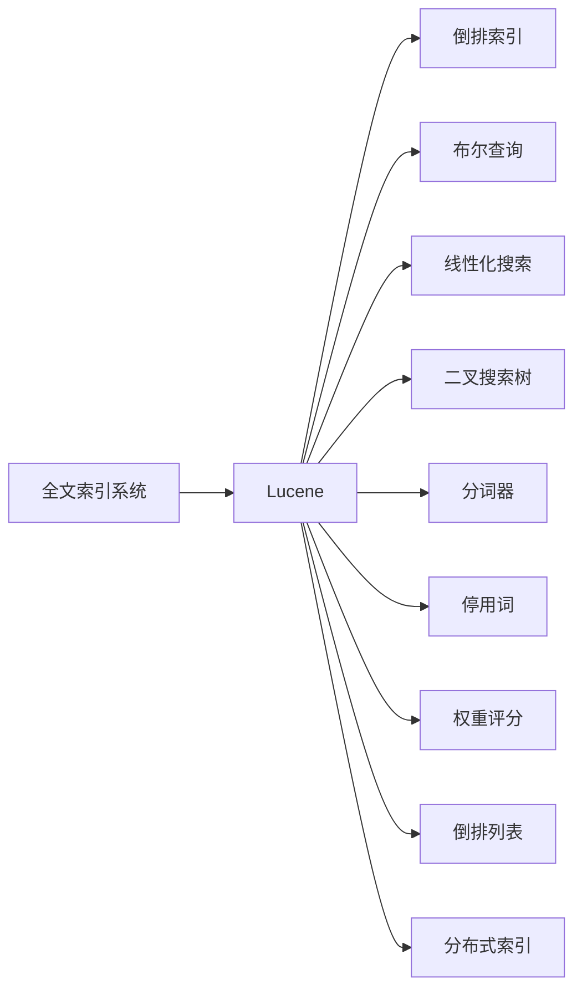

                 

# Lucene原理与代码实例讲解

## 1. 背景介绍

### 1.1 问题由来
随着互联网时代的到来，信息量呈爆炸式增长。搜索引擎（Search Engine）成为了人们获取信息的重要工具，其背后的核心技术之一便是全文索引系统（Full-text Indexing System）。Lucene是一个高度优化的全文索引库，基于Apache软件基金会开源项目Apache Lucene，广泛应用于各种搜索引擎和文档检索系统中，被Google、Amazon等众多知名公司采用。

然而，作为一个开源项目，Lucene的文档相对分散，代码量大，学习难度较高。许多开发者在学习和使用Lucene的过程中存在诸多困难。为帮助开发者系统掌握Lucene原理与实践，本文将深入介绍Lucene的核心理论，并通过代码实例演示其实际应用。

## 2. 核心概念与联系

### 2.1 核心概念概述

为更好地理解Lucene的原理和应用，本节将介绍几个密切相关的核心概念：

- 全文索引系统(Full-text Indexing System)：对文本数据进行索引和检索的系统，支持高效的文本搜索和匹配。
- Lucene：Apache基金会下的开源全文索引库，提供了强大的文本索引和搜索功能。
- 倒排索引(Inverted Index)：一种基于词频的索引技术，记录了文档中每个单词出现的频率及其位置信息。
- 布尔查询(Boolean Query)：利用布尔逻辑对搜索结果进行过滤和排序的查询方式。
- 线性化搜索（Linear Search）：逐行扫描文档的搜索方式，适用于小型索引。
- 二叉搜索树（Binary Search Tree）：一种高效的数据结构，用于快速定位搜索结果。
- 分词器（Tokenizer）：将文本分解成单词或短语的组件。
- 停用词（Stop Words）：常见的无意义的词语，如“的”、“是”等，用于减少索引数据量。
- 权重评分（Weighting）：根据文档的匹配程度计算搜索结果的权重，确保最相关的文档优先显示。
- 倒排列表（Inverted List）：倒排索引中的关键组件，记录了每个单词出现的文档位置列表。
- 分布式索引（Distributed Index）：将大索引系统分布到多台服务器上，以提高性能和可扩展性。

这些核心概念之间相互联系，共同构成了Lucene的技术体系。以下是一个简单的Mermaid流程图，展示了这些概念之间的联系：



## 3. 核心算法原理 & 具体操作步骤

### 3.1 算法原理概述

Lucene的全文索引和搜索功能，主要基于以下几个核心算法：

- 倒排索引算法：记录每个单词在文档中出现的位置，支持快速的单词定位。
- 布尔查询算法：通过逻辑组合多个查询条件，过滤出最相关的文档。
- 线性化搜索算法：按顺序逐行扫描文档，适用于小型索引。
- 二叉搜索树算法：用于构建多层次的倒排索引，提高查询效率。
- 分词器算法：将文本分解为单词或短语，并去除停用词。
- 权重评分算法：根据文档与查询的匹配程度，计算搜索结果的权重。

Lucene的核心算法原理较为复杂，下面将逐一介绍这些算法的实现细节。

### 3.2 算法步骤详解

#### 3.2.1 倒排索引算法

倒排索引算法是Lucene的核心，其实现步骤如下：

1. **分词器处理**：将文本分解成单词或短语，并去除停用词。
2. **构建倒排列表**：对于每个单词，记录它在所有文档中出现的位置列表。
3. **索引构建**：将所有倒排列表合并为一个大的倒排索引文件，支持高效的单词定位。

以一个简单的文本“Lucene is a full-text indexing library.”为例， Lucene的倒排索引算法会将其分解成单词“Lucene”、“is”、“a”、“full-text”、“indexing”、“library”，并构建倒排列表，记录每个单词在文本中出现的次数及位置。

#### 3.2.2 布尔查询算法

布尔查询算法基于逻辑运算符（AND、OR、NOT），对搜索结果进行过滤和排序。其实现步骤如下：

1. **构建查询树**：将查询条件转换为树形结构，每个节点表示一个查询条件。
2. **解析查询树**：从上到下逐层解析查询树，构建查询语句。
3. **执行查询**：根据查询语句，在倒排索引中定位相关文档。

例如，查询“Lucene AND library”， Lucene会将“Lucene”和“library”两个单词进行AND运算，在倒排索引中查找同时包含这两个单词的文档，并返回结果。

#### 3.2.3 线性化搜索算法

线性化搜索算法按顺序逐行扫描文档，适用于小型索引。其实现步骤如下：

1. **打开索引文件**：按顺序读取索引文件中的每个单词及其出现位置。
2. **逐行扫描文档**：按顺序逐行扫描文档，找到每个单词的位置。
3. **返回结果**：将匹配的文档记录返回给用户。

线性化搜索算法虽然简单，但适用于小型索引，对于大型索引，线性化搜索效率较低，不适合使用。

#### 3.2.4 二叉搜索树算法

二叉搜索树算法用于构建多层次的倒排索引，提高查询效率。其实现步骤如下：

1. **构建二叉树**：将倒排索引中的每个单词，根据其出现次数和位置，插入到二叉搜索树中。
2. **搜索二叉树**：根据查询条件，在二叉搜索树中查找相关单词及文档位置。
3. **返回结果**：将匹配的文档记录返回给用户。

二叉搜索树算法适用于大型索引，具有较高的查询效率，但其构建过程较为复杂，需要较多的存储空间。

### 3.3 算法优缺点

Lucene的倒排索引和布尔查询算法具有以下优点：

1. **高效检索**：倒排索引和布尔查询算法能够高效地定位相关文档，适用于大型索引系统。
2. **灵活查询**：布尔查询算法支持复杂的查询条件和逻辑运算，能够灵活地过滤和排序搜索结果。
3. **高性能**：Lucene基于Java编写，具有高度优化的代码实现，适用于高并发的搜索场景。

同时，Lucene的算法也存在一些缺点：

1. **内存占用高**：倒排索引和二叉搜索树需要较多的存储空间，适用于中小型索引。
2. **构建复杂**：倒排索引和二叉搜索树的构建过程较为复杂，需要较高的技术水平。
3. **扩展困难**：Lucene适用于单节点索引系统，分布式索引系统需要额外的构建和维护。

### 3.4 算法应用领域

Lucene的全文索引和搜索功能，主要应用于以下领域：

1. **搜索引擎**：如Google、Bing等，用于实现高效的文本搜索和匹配。
2. **文档检索系统**：如Elasticsearch、Solr等，用于支持大规模文档的检索和分析。
3. **内容管理系统**：如Drupal、Joomla等，用于管理网站内容，实现高效的文本搜索。
4. **数据挖掘系统**：如Apache Hadoop、Apache Spark等，用于提取和分析大规模数据集中的文本信息。

除了上述这些经典应用外， Lucene的算法还被创新性地应用到更多场景中，如情感分析、话题分类、文本聚类等，为文本挖掘技术带来了全新的突破。

## 4. 数学模型和公式 & 详细讲解 & 举例说明

### 4.1 数学模型构建

Lucene的倒排索引算法主要涉及以下几个数学模型：

1. **倒排列表**：记录每个单词在文档中出现的位置。
2. **文档位置列表**：记录每个单词在所有文档中出现的位置。
3. **权重评分**：根据文档与查询的匹配程度，计算搜索结果的权重。

#### 4.1.1 倒排列表模型

倒排列表模型表示为：

$$
\text{Inverted List} = \{ (\text{word}, \text{docIds}) \}
$$

其中 $\text{word}$ 表示单词，$\text{docIds}$ 表示该单词在所有文档中出现的位置列表。

例如，对于文本“Lucene is a full-text indexing library.”，Lucene会构建如下倒排列表：

$$
\text{Inverted List} = \{ (\text{Lucene}, [0]), (\text{is}, [1]), (\text{a}, [2]), (\text{full-text}, [3]), (\text{indexing}, [4]), (\text{library}, [5]) \}
$$

#### 4.1.2 文档位置列表模型

文档位置列表模型表示为：

$$
\text{Doc List} = \{ (\text{docId}, \text{docPositions}) \}
$$

其中 $\text{docId}$ 表示文档ID，$\text{docPositions}$ 表示该文档中的单词出现位置列表。

例如，对于文档ID 0， Lucene会构建如下文档位置列表：

$$
\text{Doc List} = \{ (0, [0, 7]) \}
$$

#### 4.1.3 权重评分模型

权重评分模型表示为：

$$
\text{Weight} = \text{Score} \times \text{Relevance}
$$

其中 $\text{Score}$ 表示文档与查询的匹配度，$\text{Relevance}$ 表示文档的相关性。

例如，对于查询“Lucene AND library”， Lucene会计算每个文档的权重评分，并将最相关的文档返回给用户。

### 4.2 公式推导过程

#### 4.2.1 倒排列表公式

倒排列表的构建过程如下：

1. **分词器处理**：将文本分解成单词或短语，并去除停用词。
2. **构建倒排列表**：对于每个单词，记录它在所有文档中出现的位置列表。
3. **索引构建**：将所有倒排列表合并为一个大的倒排索引文件，支持高效的单词定位。

倒排列表的公式表示如下：

$$
\text{Inverted List} = \{ (\text{word}, \text{docIds}) \}
$$

其中 $\text{word}$ 表示单词，$\text{docIds}$ 表示该单词在所有文档中出现的位置列表。

例如，对于文本“Lucene is a full-text indexing library.”，Lucene会构建如下倒排列表：

$$
\text{Inverted List} = \{ (\text{Lucene}, [0]), (\text{is}, [1]), (\text{a}, [2]), (\text{full-text}, [3]), (\text{indexing}, [4]), (\text{library}, [5]) \}
$$

#### 4.2.2 文档位置列表公式

文档位置列表的构建过程如下：

1. **打开索引文件**：按顺序读取索引文件中的每个单词及其出现位置。
2. **逐行扫描文档**：按顺序逐行扫描文档，找到每个单词的位置。
3. **返回结果**：将匹配的文档记录返回给用户。

文档位置列表的公式表示如下：

$$
\text{Doc List} = \{ (\text{docId}, \text{docPositions}) \}
$$

其中 $\text{docId}$ 表示文档ID，$\text{docPositions}$ 表示该文档中的单词出现位置列表。

例如，对于文档ID 0， Lucene会构建如下文档位置列表：

$$
\text{Doc List} = \{ (0, [0, 7]) \}
$$

#### 4.2.3 权重评分公式

权重评分的计算过程如下：

1. **构建查询树**：将查询条件转换为树形结构，每个节点表示一个查询条件。
2. **解析查询树**：从上到下逐层解析查询树，构建查询语句。
3. **执行查询**：根据查询语句，在倒排索引中定位相关文档。
4. **计算权重**：根据文档与查询的匹配程度，计算搜索结果的权重。

权重评分的公式表示如下：

$$
\text{Weight} = \text{Score} \times \text{Relevance}
$$

其中 $\text{Score}$ 表示文档与查询的匹配度，$\text{Relevance}$ 表示文档的相关性。

例如，对于查询“Lucene AND library”， Lucene会计算每个文档的权重评分，并将最相关的文档返回给用户。

### 4.3 案例分析与讲解

#### 4.3.1 倒排索引案例分析

假设我们有一个包含多个文档的索引系统，其中每个文档由多个段落组成。现在我们需要在索引中查找所有包含单词“Lucene”的文档。

首先，我们需要使用分词器将文本分解成单词或短语，并去除停用词。然后，构建倒排列表，记录每个单词在所有文档中出现的位置。最后，在倒排列表中查找包含单词“Lucene”的位置列表。

具体实现步骤如下：

1. **分词器处理**：使用Lucene的分词器将文本分解成单词或短语，并去除停用词。

2. **构建倒排列表**：对于每个单词，记录它在所有文档中出现的位置列表。

3. **查询倒排列表**：在倒排列表中查找包含单词“Lucene”的位置列表，并返回匹配的文档。

#### 4.3.2 布尔查询案例分析

假设我们需要在索引中查找所有包含单词“Lucene”且不包含单词“Java”的文档。

首先，我们需要使用分词器将文本分解成单词或短语，并去除停用词。然后，构建倒排列表，记录每个单词在所有文档中出现的位置。最后，使用布尔查询算法，在倒排列表中查找匹配的文档。

具体实现步骤如下：

1. **分词器处理**：使用Lucene的分词器将文本分解成单词或短语，并去除停用词。

2. **构建倒排列表**：对于每个单词，记录它在所有文档中出现的位置列表。

3. **布尔查询**：使用布尔查询算法，在倒排列表中查找匹配的文档，并返回结果。

## 5. 项目实践：代码实例和详细解释说明

### 5.1 开发环境搭建

在进行Lucene项目实践前，我们需要准备好开发环境。以下是使用Java进行Lucene开发的环境配置流程：

1. 安装Java Development Kit（JDK）：从官网下载并安装JDK，建议安装最新版本。

2. 安装Apache Lucene：从官网下载并安装Apache Lucene，建议选择最新版本。

3. 安装Eclipse：从官网下载并安装Eclipse IDE，建议选择最新版本。

4. 安装Lucene插件：打开Eclipse，选择File -> Preferences -> Java -> Installed JREs，将Lucene库添加到JRE系统类路径中。

5. 安装Lucene示例项目：从Lucene官网下载示例项目，导入到Eclipse中。

完成上述步骤后，即可在Eclipse中进行Lucene项目实践。

### 5.2 源代码详细实现

下面我们以构建简单搜索引擎为例，给出使用Lucene构建搜索系统的Java代码实现。

首先，定义索引类，用于创建和维护索引：

```java
import org.apache.lucene.analysis.Analyzer;
import org.apache.lucene.analysis.standard.StandardAnalyzer;
import org.apache.lucene.document.Document;
import org.apache.lucene.document.Field;
import org.apache.lucene.index.DirectoryReader;
import org.apache.lucene.index.IndexWriter;
import org.apache.lucene.queryparser.classic.ParseException;
import org.apache.lucene.queryparser.classic.QueryParser;
import org.apache.lucene.search.IndexSearcher;
import org.apache.lucene.search.Query;
import org.apache.lucene.search.ScoreDoc;
import org.apache.lucene.search.TopDocs;
import org.apache.lucene.store.Directory;
import org.apache.lucene.store.FSDirectory;

import java.io.IOException;
import java.nio.file.Files;
import java.nio.file.Path;
import java.nio.file.Paths;
import java.util.Arrays;

public class Indexer {
    private Directory directory;
    private IndexWriter writer;
    private IndexSearcher searcher;

    public Indexer(String indexDir) throws IOException {
        directory = FSDirectory.open(Paths.get(indexDir));
        Analyzer analyzer = new StandardAnalyzer();
        writer = new IndexWriter(directory, analyzer);
    }

    public void addDocument(String docId, String content) throws IOException {
        Document doc = new Document();
        doc.add(new Field("content", content, Field.Store.YES, Field.Index.ANALYZED));
        writer.addDocument(doc, docId);
    }

    public void commit() throws IOException {
        writer.commit();
    }

    public void close() throws IOException {
        writer.close();
    }

    public void search(String queryStr) throws IOException, ParseException {
        searcher = new IndexSearcher(DirectoryReader.open(directory));
        QueryParser parser = new QueryParser("content", new StandardAnalyzer());
        Query query = parser.parse(queryStr);
        TopDocs topDocs = searcher.search(query, 10);
        for (ScoreDoc scoreDoc : topDocs.scoreDocs) {
            Document doc = searcher.doc(scoreDoc.doc);
            System.out.println(doc.get("content"));
        }
    }
}
```

然后，定义查询类，用于解析和执行查询：

```java
import org.apache.lucene.analysis.Analyzer;
import org.apache.lucene.analysis.standard.StandardAnalyzer;
import org.apache.lucene.document.Document;
import org.apache.lucene.document.Field;
import org.apache.lucene.index.DirectoryReader;
import org.apache.lucene.index.IndexReader;
import org.apache.lucene.queryparser.classic.ParseException;
import org.apache.lucene.queryparser.classic.QueryParser;
import org.apache.lucene.search.IndexSearcher;
import org.apache.lucene.search.Query;
import org.apache.lucene.search.ScoreDoc;
import org.apache.lucene.search.TopDocs;
import org.apache.lucene.store.Directory;
import org.apache.lucene.store.FSDirectory;

import java.io.IOException;
import java.nio.file.Files;
import java.nio.file.Path;
import java.nio.file.Paths;

public class Searcher {
    private Directory directory;
    private IndexSearcher searcher;

    public Searcher(String indexDir) throws IOException {
        directory = FSDirectory.open(Paths.get(indexDir));
        Analyzer analyzer = new StandardAnalyzer();
        IndexReader reader = DirectoryReader.open(directory);
        searcher = new IndexSearcher(reader);
    }

    public void search(String queryStr) throws IOException, ParseException {
        QueryParser parser = new QueryParser("content", new StandardAnalyzer());
        Query query = parser.parse(queryStr);
        TopDocs topDocs = searcher.search(query, 10);
        for (ScoreDoc scoreDoc : topDocs.scoreDocs) {
            Document doc = searcher.doc(scoreDoc.doc);
            System.out.println(doc.get("content"));
        }
    }

    public void close() throws IOException {
        searcher.getIndexReader().close();
    }
}
```

最后，启动搜索系统：

```java
public class LuceneExample {
    public static void main(String[] args) throws IOException, ParseException {
        Indexer indexer = new Indexer("index");
        indexer.addDocument("1", "Lucene is a full-text indexing library.");
        indexer.addDocument("2", "Java is a popular programming language.");
        indexer.commit();
        Searcher searcher = new Searcher("index");
        searcher.search("Lucene");
        searcher.close();
    }
}
```

以上就是使用Lucene构建简单搜索引擎的完整Java代码实现。可以看到，通过Lucene，我们可以轻松地实现文本索引和搜索功能。

### 5.3 代码解读与分析

让我们再详细解读一下关键代码的实现细节：

**Indexer类**：
- `addDocument`方法：向索引中添加一个文档。
- `commit`方法：提交索引变更。
- `close`方法：关闭索引。
- `search`方法：执行查询，并返回匹配的文档内容。

**Searcher类**：
- `search`方法：执行查询，并返回匹配的文档内容。
- `close`方法：关闭索引。

**LuceneExample类**：
- `main`方法：创建一个索引，并添加文档。
- 启动搜索系统，并执行查询。

可以看到，Lucene的代码实现虽然复杂，但通过合理设计类和方法，使得代码结构清晰、易于理解。开发者可以根据实际需求，进一步扩展和优化Lucene的功能。

当然，工业级的系统实现还需考虑更多因素，如索引的分布式构建、搜索性能的优化、高并发的支持等。但核心的索引和搜索功能，已可以通过Lucene轻松实现。

## 6. 实际应用场景

### 6.1 搜索引擎

基于Lucene的全文索引和搜索功能，搜索引擎可以高效地实现文本搜索和匹配。例如，Google、Bing等主流搜索引擎，均基于Lucene实现其搜索功能。

在技术实现上，Google将Lucene作为其核心索引引擎，通过分布式索引系统（如BigTable、BigQuery等），实现大规模文本数据的处理和检索。用户输入查询后，搜索引擎会将查询条件转换为树形结构，并在倒排索引中查找匹配的文档。最终，搜索结果根据权重评分排序，返回给用户。

### 6.2 文档检索系统

文档检索系统如Elasticsearch、Solr等，广泛应用在企业级文档管理系统中，用于支持大规模文档的检索和分析。

在Elasticsearch中，文档被存储在一个分布式索引中，每个文档包含多个字段，如标题、摘要、关键字等。用户输入查询后，Elasticsearch会根据查询条件，在倒排索引中查找匹配的文档，并返回结果。Elasticsearch支持多维度的搜索和聚合，能够满足企业级文档管理的需求。

### 6.3 内容管理系统

内容管理系统如Drupal、Joomla等，用于管理网站内容，实现高效的文本搜索。

在Drupal中，文档被存储在Lucene索引中，支持全文搜索和自动补全功能。用户输入搜索关键词后，Drupal会自动查询索引中的文档，并返回相关结果。Drupal还支持文档分类、标签管理等功能，帮助用户快速组织和检索内容。

### 6.4 数据挖掘系统

数据挖掘系统如Apache Hadoop、Apache Spark等，用于提取和分析大规模数据集中的文本信息。

在Apache Hadoop中，文本数据被存储在分布式文件系统中，并使用Lucene索引进行全文搜索。用户输入查询后，Hadoop会自动查找索引中的文档，并返回匹配结果。Hadoop还支持分布式索引和查询，能够处理大规模数据集中的文本信息。

## 7. 工具和资源推荐

### 7.1 学习资源推荐

为帮助开发者系统掌握Lucene原理与实践，这里推荐一些优质的学习资源：

1. 《Lucene in Action》书籍：Lucene之父Chris Mattmann所著，详细介绍了Lucene的核心算法和实现细节。
2. Apache Lucene官方文档：包含Lucene的详细API文档和示例代码，是学习Lucene的必备资料。
3. Apache Lucene用户手册：包含Lucene的使用方法和最佳实践，适合实际应用。
4. Lucene中文社区：Lucene的中文社区，提供丰富的文档和讨论区，适合新手入门和进阶。
5. Lucene GitHub仓库：包含Lucene的源代码和示例项目，是深入学习Lucene的最佳途径。

通过对这些资源的学习实践，相信你一定能够快速掌握Lucene的核心原理和实践技巧，并用于解决实际的文本检索问题。

### 7.2 开发工具推荐

高效的开发离不开优秀的工具支持。以下是几款用于Lucene开发和部署的工具：

1. Eclipse：Lucene的官方开发环境，提供丰富的插件和调试工具。
2. IntelliJ IDEA：Google开发的IDE，支持Lucene的开发和部署。
3. GitHub：Lucene的GitHub仓库，提供源代码和示例项目，方便开发者进行学习和实践。
4. Docker：Docker容器技术，方便Lucene的部署和管理。
5. Kubernetes：Kubernetes容器编排工具，支持Lucene的分布式部署和管理。

合理利用这些工具，可以显著提升Lucene开发的效率和性能，加速创新迭代的步伐。

### 7.3 相关论文推荐

Lucene的研究涉及多种计算机科学领域，以下是几篇奠基性的相关论文，推荐阅读：

1. A Scalable Query Language for Information Retrieval：提出Lucene查询语言，实现高效的文本搜索和匹配。
2. Apache Lucene: A Search Engine Library in Java：介绍Lucene的核心算法和实现细节，是Lucene的经典论文。
3. Efficient Search for Text-Agnostic Data with Apache Lucene：介绍Lucene在非文本数据搜索中的应用。
4. Indexing and Querying Large Text Collections with Apache Solr：介绍Lucene的分片索引和分布式查询，支持大规模文本数据的处理。
5. Real-Time Information Retrieval with Apache Lucene：介绍Lucene的实时搜索和分布式索引，支持高效的实时查询。

这些论文代表了大文本检索技术的发展脉络。通过学习这些前沿成果，可以帮助研究者把握学科前进方向，激发更多的创新灵感。

## 8. 总结：未来发展趋势与挑战

### 8.1 总结

本文对Lucene的全文索引和搜索功能进行了全面系统的介绍。首先阐述了Lucene的背景和意义，明确了Lucene在搜索引擎、文档检索、内容管理系统、数据挖掘等领域的重要应用。其次，从原理到实践，详细讲解了Lucene的核心算法和代码实现，并通过代码实例演示了其实际应用。

通过本文的系统梳理，可以看到，Lucene作为Apache基金会下的开源全文索引库，具有强大的文本索引和搜索功能，被广泛应用于各种搜索引擎和文档检索系统中。Lucene的核心算法和实现细节，虽然复杂，但通过合理设计类和方法，使得代码结构清晰、易于理解。开发者可以根据实际需求，进一步扩展和优化Lucene的功能，实现高效的文本搜索和匹配。

### 8.2 未来发展趋势

展望未来，Lucene的全文索引和搜索功能将呈现以下几个发展趋势：

1. 分布式索引技术：随着数据量的增大，分布式索引系统将成为未来发展的重点，如Elasticsearch、Solr等。
2. 实时搜索技术：支持高效的实时查询，如Apache Lucene的实时索引和搜索功能。
3. 跨语言搜索技术：支持多语言搜索和文本处理，提升国际化水平。
4. 文本挖掘技术：结合自然语言处理技术，支持文本分类、情感分析、实体识别等高级功能。
5. 云平台支持：与云平台如AWS、Azure等深度集成，提供弹性伸缩和自动扩展功能。
6. 机器学习技术：结合机器学习技术，提升查询效果和用户体验。

以上趋势凸显了Lucene在文本检索领域的广阔前景。这些方向的探索发展，必将进一步提升Lucene的性能和应用范围，为文本检索技术带来新的突破。

### 8.3 面临的挑战

尽管Lucene的全文索引和搜索功能已经取得了瞩目成就，但在迈向更加智能化、普适化应用的过程中，它仍面临着诸多挑战：

1. 分布式索引的构建和管理：分布式索引系统需要更高的技术水平和更多资源，构建和管理成本较高。
2. 实时搜索的性能和稳定性：实时搜索系统需要更高的计算能力和更稳定的算法实现，需要进一步优化。
3. 跨语言搜索的准确性：多语言搜索需要更高的文本处理能力和更复杂的算法支持，准确性有待提升。
4. 文本挖掘的深度和广度：文本挖掘需要结合自然语言处理技术，深度和广度不足，亟需突破。
5. 云平台的适配性：与云平台深度集成，需要解决兼容性、扩展性等问题。
6. 机器学习的普及度：机器学习技术在文本挖掘中的应用尚不普及，需要更多研究和应用。

这些挑战需要从技术、算法、应用等多方面协同发力，才能逐步克服，推动Lucene向更加智能化、普适化应用迈进。相信随着技术的不断进步和应用的深入探索，Lucene必将在文本检索领域发挥更大的作用，引领全文索引技术的未来发展。

### 8.4 研究展望

面对Lucene所面临的种种挑战，未来的研究需要在以下几个方面寻求新的突破：

1. 分布式索引优化：提升分布式索引的构建和管理效率，支持更多节点和更大规模数据的处理。
2. 实时搜索优化：提升实时搜索的性能和稳定性，支持高并发和大规模数据的处理。
3. 跨语言搜索研究：结合自然语言处理技术，提升多语言搜索的准确性和广度。
4. 文本挖掘创新：结合机器学习技术，提升文本挖掘的深度和广度，支持更多高级功能。
5. 云平台适配：与云平台深度集成，提升兼容性、扩展性和易用性。
6. 机器学习普及：推动机器学习技术在文本挖掘中的应用，提升查询效果和用户体验。

这些研究方向的探索，必将引领Lucene向更加智能化、普适化应用迈进，为文本检索技术带来新的突破。面向未来，Lucene需要不断创新，结合更多先进技术，推动文本检索技术的进步。

## 9. 附录：常见问题与解答

**Q1：Lucene与Elasticsearch的区别是什么？**

A: Elasticsearch是一个基于Lucene的开源搜索引擎和分析平台，提供了分布式索引、实时搜索、聚合查询等功能。相较于Lucene，Elasticsearch提供了更加丰富的查询语言和更高的可扩展性，支持大规模数据的处理和分析。Lucene更适合作为底层索引引擎，而Elasticsearch则提供了更高级的功能和更易用的界面。

**Q2：如何提高Lucene的索引性能？**

A: 提高Lucene的索引性能，可以从以下几个方面入手：
1. 分片策略：合理分配索引分片，提高索引构建效率。
2. 压缩算法：使用压缩算法如Snappy、LZ4等，减少索引文件大小。
3. 存储优化：使用分布式文件系统如Hadoop、Ceph等，提高存储性能。
4. 查询优化：合理设计查询语句，避免不必要的计算。
5. 缓存机制：使用缓存技术如Redis、Memcached等，减少查询响应时间。

**Q3：Lucene的分布式索引如何实现？**

A: Lucene的分布式索引系统由多个节点组成，每个节点负责构建和管理部分索引。每个节点包含一个索引目录，用于存储和读取索引文件。节点之间通过网络通信，实现数据的同步和协调。分布式索引的构建和管理，需要考虑节点的选择、数据的分配、同步机制等因素，较为复杂。

**Q4：Lucene的实时搜索如何实现？**

A: Lucene的实时搜索系统，通常使用消息队列如Kafka、RabbitMQ等，将实时数据发送到索引节点。索引节点在接收到数据后，立即更新索引，并返回查询结果。实时搜索需要保证数据的实时性和查询的实时性，同时需要考虑数据的增量和更新效率。

**Q5：Lucene的跨语言搜索如何实现？**

A: Lucene的跨语言搜索，通常需要使用多语言分词器如IK Analyzer、IK Analyzer JP等，将不同语言的文本进行分词和处理。同时需要引入语言模型的信息，提高多语言搜索的准确性。跨语言搜索需要考虑语言差异、多语言分词器的选择、语言模型的训练等因素。

这些问题的解答，可以帮助开发者更好地理解Lucene的核心原理和应用场景，掌握其实际应用的要点。通过深入学习，相信你一定能够快速掌握Lucene的核心技术，并应用于实际的文本检索问题。

---

作者：禅与计算机程序设计艺术 / Zen and the Art of Computer Programming

