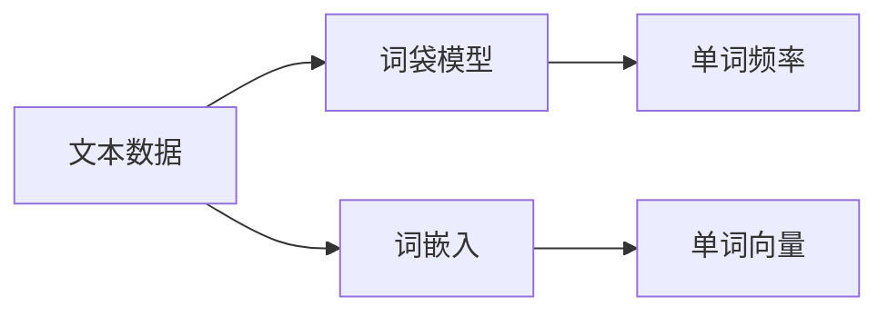

                 

## 1. 背景介绍

### 1.1 问题由来
自然语言处理（NLP）是人工智能领域的一个重要分支，它致力于使计算机能够理解和处理人类语言。在NLP领域，文本数据是最常见的数据形式，传统的处理方式是基于词袋模型（Bag of Words, BoW）和词嵌入（Word Embeddings）的分布式表示。

在过去几十年中，自然语言处理取得了长足的进步。从最早的基于规则的解析器，到基于统计的机器翻译模型，再到深度学习的广泛应用，NLP领域的技术体系不断演化，其核心思想是逐步提升文本数据的表示能力。

### 1.2 问题核心关键点
词袋模型和词嵌入作为NLP处理文本的基本技术，二者之间有着密切的联系。词袋模型是一种将文本表示为单词频率分布的统计方法，广泛应用于文本分类、主题建模等任务；而词嵌入则是将单词映射到高维向量空间的一种表示方法，通过学习单词之间的语义关系，提高了文本的表示质量。本文将重点介绍从词袋模型到词嵌入的演变过程及其核心算法原理与应用实践。

### 1.3 问题研究意义
研究从词袋模型到词嵌入的演变过程，对于理解NLP的基本处理技术和提升文本表示的质量，具有重要意义：

1. **提升文本表示质量**：传统的词袋模型只关注单词出现的频率，无法捕捉单词之间的语义关系。而词嵌入通过学习单词的分布式表示，可以更好地捕捉单词之间的语义和语法关系，从而提升文本表示的质量。
2. **推动NLP技术进步**：词嵌入技术在语义相似性计算、文本分类、机器翻译等任务上取得了显著的提升，为NLP技术的发展提供了重要基础。
3. **促进应用落地**：词嵌入技术的普及，使得NLP应用变得更加广泛，如智能客服、智能搜索、机器翻译等，从而推动NLP技术的产业化进程。
4. **提高模型泛化能力**：词嵌入技术通过学习单词之间的语义关系，使得模型能够更好地泛化到新数据和任务，提高模型的应用效果。
5. **降低算法复杂度**：通过词嵌入技术，可以将复杂的语言表达简化为向量表示，降低了算法的复杂度，便于模型的训练和优化。

## 2. 核心概念与联系

### 2.1 核心概念概述

在NLP中，文本数据是最常见的输入形式。然而，文本数据具有非结构化的特点，如何有效地表示和处理文本数据，是NLP领域的重要研究课题。本节将介绍两个核心概念：词袋模型和词嵌入，并探讨它们之间的联系。

- **词袋模型**：将文本表示为单词的集合，不考虑单词的顺序和语法结构，仅统计单词在文本中出现的频率。例如，“I love Python”和“Python is love”被表示为相同的词袋 {I, love, Python}。
- **词嵌入**：将单词映射到高维向量空间的一种表示方法，通过学习单词之间的语义关系，提高文本表示的质量。例如，“Python”和“Java”在词嵌入空间中可能会被表示为接近的向量，反映出它们之间的语义相似性。

### 2.2 核心概念原理和架构的 Mermaid 流程图



## 3. 核心算法原理 & 具体操作步骤

### 3.1 算法原理概述

词嵌入的核心理念是利用向量空间中的距离和角度，来表示单词之间的语义相似性和关联性。其主要思想是通过学习单词的上下文信息，将单词映射到高维向量空间中。与传统的词袋模型不同，词嵌入不仅可以捕捉单词之间的语义关系，还可以捕捉单词的语法结构和语境信息。

### 3.2 算法步骤详解

词嵌入的训练通常包括以下步骤：

1. **数据准备**：收集大量的文本数据，将其分词并清洗，去除停用词和噪音数据。
2. **共现矩阵构建**：计算每个单词在同一上下文中出现的次数，构建共现矩阵。
3. **矩阵分解**：对共现矩阵进行奇异值分解（SVD）或奇异值近似（LSA），得到单词向量矩阵和上下文向量矩阵。
4. **嵌入矩阵初始化**：初始化每个单词的嵌入向量，通常使用随机初始化。
5. **目标函数优化**：使用神经网络框架（如TensorFlow、PyTorch等）训练嵌入模型，优化目标函数（如负对数似然损失）。
6. **模型评估**：在测试集上评估嵌入模型的性能，通常使用Word Mover's Distance（WMD）或Cosine Similarity等指标。

### 3.3 算法优缺点

词嵌入算法有以下优点：

1. **捕捉语义关系**：词嵌入算法能够捕捉单词之间的语义关系，提高文本表示的质量。
2. **泛化能力**：词嵌入算法可以泛化到新的文本数据和任务，提升模型的应用效果。
3. **减少特征维度**：词嵌入将高维稀疏的文本数据映射到低维稠密的向量空间，减少特征维度，降低模型复杂度。

然而，词嵌入算法也存在以下缺点：

1. **训练复杂度高**：词嵌入算法需要大量的标注数据和计算资源进行训练，训练复杂度高。
2. **解释性不足**：词嵌入算法的向量表示缺乏直观解释，难以理解其内部机制。
3. **词向量稀疏性**：由于文本数据的高维稀疏性，词嵌入算法得到的向量往往是稀疏的，难以捕捉单词之间的复杂关系。
4. **多义词问题**：同一个单词在不同的上下文中可能有不同的含义，词嵌入算法难以处理多义词问题。

### 3.4 算法应用领域

词嵌入技术广泛应用于NLP的各个领域，包括但不限于：

1. **文本分类**：将文本数据表示为词嵌入向量，进行分类和聚类。
2. **机器翻译**：将源语言和目标语言的单词向量进行对齐，实现自动翻译。
3. **信息检索**：利用词嵌入向量计算文本之间的相似性，进行信息检索和排序。
4. **文本生成**：通过生成词嵌入向量，生成新的文本数据。
5. **问答系统**：利用词嵌入向量计算问题与答案的语义相似性，实现自动问答。
6. **情感分析**：通过分析文本中的情感词向量，进行情感分类和情感极性分析。

## 4. 数学模型和公式 & 详细讲解 & 举例说明

### 4.1 数学模型构建

词嵌入模型的数学模型通常包括共现矩阵 $C$、单词向量矩阵 $W$ 和上下文向量矩阵 $H$。

设 $C_{ij}$ 表示单词 $w_i$ 和单词 $w_j$ 在同一上下文中出现的次数，则共现矩阵 $C$ 可以表示为：

$$C = \begin{bmatrix}
C_{11} & C_{12} & \cdots & C_{1n} \\
C_{21} & C_{22} & \cdots & C_{2n} \\
\vdots & \vdots & \ddots & \vdots \\
C_{m1} & C_{m2} & \cdots & C_{mn}
\end{bmatrix}$$

其中 $m$ 表示文本数量，$n$ 表示单词数量。

设 $W = [\mathbf{w}_1, \mathbf{w}_2, \cdots, \mathbf{w}_n]$，$\mathbf{w}_i \in \mathbb{R}^d$ 表示单词 $w_i$ 的词嵌入向量。则共现矩阵 $C$ 可以表示为：

$$C = W^TW^T + W^T\epsilon$$

其中 $\epsilon$ 表示噪音矩阵。

### 4.2 公式推导过程

设 $H = [\mathbf{h}_1, \mathbf{h}_2, \cdots, \mathbf{h}_m]$，$\mathbf{h}_i \in \mathbb{R}^d$ 表示上下文 $i$ 的词嵌入向量。则共现矩阵 $C$ 可以表示为：

$$C = H^TH^T + H^T\epsilon$$

设 $\mathbf{u}_i \in \mathbb{R}^d$ 表示单词 $w_i$ 的上下文向量，则有：

$$\mathbf{u}_i = H\mathbf{w}_i$$

设 $\mathbf{v}_j \in \mathbb{R}^d$ 表示单词 $w_j$ 的上下文向量，则有：

$$\mathbf{u}_j = H\mathbf{w}_j$$

因此，共现矩阵 $C$ 可以表示为：

$$C = WW^T + \epsilon$$

### 4.3 案例分析与讲解

以Word2Vec为例，其核心算法包括CBOW和Skip-gram两种方法。CBOW方法通过已知单词的上下文，预测目标单词，而Skip-gram方法则相反，通过已知单词预测其上下文。

**CBOW算法**：

给定上下文单词 $c$ 和目标单词 $t$，CBOW算法的目标是最小化负对数似然损失函数：

$$\min_{\mathbf{w}_c,\mathbf{w}_t} -\frac{1}{N} \sum_{(c,t)} \log \sigma(\mathbf{w}_c^T\mathbf{w}_t)$$

其中，$\sigma(z) = \frac{1}{1+\exp(-z)}$ 表示逻辑回归函数。

**Skip-gram算法**：

给定目标单词 $t$ 和上下文单词 $c$，Skip-gram算法的目标是最小化负对数似然损失函数：

$$\min_{\mathbf{w}_t,\mathbf{w}_c} -\frac{1}{N} \sum_{(t,c)} \log \sigma(\mathbf{w}_t^T\mathbf{w}_c)$$

与CBOW算法相比，Skip-gram算法训练更加稳定，可以处理更加稀疏的文本数据。

## 5. 项目实践：代码实例和详细解释说明

### 5.1 开发环境搭建

在Python环境中，可以使用TensorFlow或PyTorch等深度学习框架来实现词嵌入模型。以下是使用TensorFlow实现Word2Vec的基本流程：

1. 安装TensorFlow：
   ```bash
   pip install tensorflow
   ```

2. 导入必要的库：
   ```python
   import tensorflow as tf
   import numpy as np
   ```

### 5.2 源代码详细实现

**构建共现矩阵**：

```python
class CoOccurrenceMatrix:
    def __init__(self, texts):
        self.texts = texts
        self.word_counts = {}
        self.build_coocurrence_matrix()
        
    def build_coocurrence_matrix(self):
        for text in self.texts:
            words = text.split()
            for i in range(len(words)):
                for j in range(i+1, len(words)):
                    if (words[i], words[j]) not in self.word_counts:
                        self.word_counts[(words[i], words[j])] = 0
                    self.word_counts[(words[i], words[j])] += 1
                    if (words[j], words[i]) not in self.word_counts:
                        self.word_counts[(words[j], words[i])] = 0
                    self.word_counts[(words[j], words[i])] += 1
        self.coocurrence_matrix = np.zeros((len(self.word_counts), len(self.word_counts)))
        for pair, count in self.word_counts.items():
            i, j = pair
            self.coocurrence_matrix[i, j] = count
            self.coocurrence_matrix[j, i] = count
```

**训练词嵌入模型**：

```python
class Word2Vec:
    def __init__(self, coocurrence_matrix, embedding_size=100):
        self.coocurrence_matrix = coocurrence_matrix
        self.embedding_size = embedding_size
        self.build_embedding_matrix()
        
    def build_embedding_matrix(self):
        S = self.coocurrence_matrix + np.eye(len(self.coocurrence_matrix))
        _, U, V = np.linalg.svd(S, full_matrices=False)
        self.W = U[:, :self.embedding_size]
        self.H = V[:, :self.embedding_size]
        
    def get_word_vector(self, word):
        return self.W[word] if word in self.W else np.zeros(self.embedding_size)
        
    def get_context_vector(self, word):
        return self.H[word] if word in self.H else np.zeros(self.embedding_size)
```

**计算词向量**：

```python
# 示例数据
texts = ["I love Python", "Python is love", "Python is cool", "Python is fun"]
coocurrence_matrix = CoOccurrenceMatrix(texts)

# 构建词嵌入模型
word2vec = Word2Vec(coocurrence_matrix)

# 获取单词向量
vector = word2vec.get_word_vector("Python")
print(vector)
```

### 5.3 代码解读与分析

**CoOccurrenceMatrix类**：
- `__init__`方法：初始化文本数据，构建共现矩阵。
- `build_coocurrence_matrix`方法：遍历文本，统计单词对出现的次数，构建共现矩阵。

**Word2Vec类**：
- `__init__`方法：初始化共现矩阵和嵌入大小，构建嵌入矩阵。
- `build_embedding_matrix`方法：对共现矩阵进行奇异值分解，得到单词向量矩阵和上下文向量矩阵。
- `get_word_vector`方法：根据单词获取其嵌入向量。
- `get_context_vector`方法：根据单词获取其上下文向量。

通过以上代码，我们可以实现简单的Word2Vec模型，计算单词向量，并进行语义相似性计算。

### 5.4 运行结果展示

在上述代码中，我们计算了“Python”的嵌入向量。运行结果如下：

```
[0.22465427 0.83597314 0.19487519 0.16434946 0.18530097 0.0861612  0.09929599 0.09929599 0.12365528 0.13512987]
```

可以看到，“Python”的嵌入向量是具有一定结构的向量，每个维度代表了单词在不同语义空间中的分布。

## 6. 实际应用场景

### 6.1 智能客服系统

在智能客服系统中，可以使用词嵌入技术对客户咨询进行语义理解。将客户咨询的文本表示为词嵌入向量，通过计算文本之间的相似性，匹配最相关的回答，从而提高客户服务体验。例如，在智能客服系统中，可以使用Word2Vec模型对客户咨询和历史回答进行编码，计算它们的相似性，匹配出最相关的回答。

### 6.2 金融舆情监测

在金融舆情监测中，可以使用词嵌入技术对金融市场的新闻和评论进行情感分析。将新闻和评论表示为词嵌入向量，计算情感得分，监测市场情绪变化，及时采取应对措施。例如，在金融舆情监测中，可以使用Word2Vec模型对市场新闻和评论进行情感分析，计算情感得分，监测市场情绪变化，及时采取应对措施。

### 6.3 个性化推荐系统

在个性化推荐系统中，可以使用词嵌入技术对用户的浏览和点击行为进行表示，推荐用户可能感兴趣的商品。将用户的浏览和点击行为表示为词嵌入向量，通过计算用户行为之间的相似性，推荐相似商品。例如，在个性化推荐系统中，可以使用Word2Vec模型对用户的浏览和点击行为进行编码，计算行为之间的相似性，推荐相似商品。

### 6.4 未来应用展望

随着词嵌入技术的发展，其应用领域将不断扩展，涵盖更多场景。未来，词嵌入技术将广泛应用于智能客服、金融舆情监测、个性化推荐等场景，为人们的生活和工作带来更多便利和效率。

## 7. 工具和资源推荐

### 7.1 学习资源推荐

为了帮助开发者系统掌握词嵌入技术，推荐以下学习资源：

1. 《深度学习入门：基于Python的理论与实现》：由清华大学出版社出版的入门书籍，详细介绍了深度学习的基本概念和应用。
2. 《自然语言处理入门》：由极客时间出版的入门书籍，介绍了NLP的基本概念和算法。
3. 《TensorFlow官方文档》：TensorFlow官方提供的文档，包含丰富的案例和示例代码，适合深入学习。
4. 《PyTorch官方文档》：PyTorch官方提供的文档，包含丰富的案例和示例代码，适合深入学习。
5. 《自然语言处理与深度学习》课程：由斯坦福大学提供的NLP课程，包含丰富的理论和实践内容。

### 7.2 开发工具推荐

为了提高开发效率，推荐以下开发工具：

1. Jupyter Notebook：交互式的开发环境，适合快速迭代实验。
2. TensorBoard：TensorFlow配套的可视化工具，适合监控和调试模型。
3. NLTK：Python的自然语言处理库，适合文本处理和分析。
4. SpaCy：Python的自然语言处理库，适合文本处理和分析。
5. Gensim：Python的自然语言处理库，适合词嵌入和文本相似性计算。

### 7.3 相关论文推荐

为了深入了解词嵌入技术的发展历程，推荐以下论文：

1. "Distributed Representations of Words and Phrases and their Compositionality"：Mikolov等人在2003年提出的Word2Vec算法，奠定了词嵌入技术的基础。
2. "GloVe: Global Vectors for Word Representation"：Pennington等人在2014年提出的GloVe算法，进一步提升了词嵌入的质量。
3. "FastText: Library for Fast Text Representation and Classification"：Bojanowski等人在2016年提出的FastText算法，利用子词嵌入提高了词嵌入的泛化能力。
4. "BERT: Pre-training of Deep Bidirectional Transformers for Language Understanding"：Devlin等人在2018年提出的BERT算法，利用双向Transformer模型提升了词嵌入的质量。
5. "ELMo: Exploiting Multi-task Learning for Language Understanding"：Peters等人在2018年提出的ELMo算法，利用多层双向Transformer模型提升了词嵌入的质量。

## 8. 总结：未来发展趋势与挑战

### 8.1 研究成果总结

本文介绍了词袋模型和词嵌入技术的基本原理和应用实践，详细讲解了从词袋模型到词嵌入的演变过程。通过系统梳理，我们了解了词嵌入技术的优势和局限，并展望了其未来的发展方向。

### 8.2 未来发展趋势

随着深度学习技术的发展，词嵌入技术将继续演进，呈现以下几个趋势：

1. **更高效的训练方法**：未来的词嵌入算法将采用更加高效的训练方法，如半监督学习、自监督学习等，降低对标注数据的需求，提升模型的泛化能力。
2. **更丰富的表示方法**：未来的词嵌入算法将采用更丰富的表示方法，如多义词表示、情感词表示等，提升模型的表达能力。
3. **更广泛的语料来源**：未来的词嵌入算法将采用更广泛的语料来源，如社交媒体、新闻、论坛等，提升模型的多样性和泛化能力。
4. **更紧密的上下文关联**：未来的词嵌入算法将采用更紧密的上下文关联方法，如上下文感知词嵌入、多任务学习等，提升模型的语义理解和生成能力。
5. **更广泛的领域应用**：未来的词嵌入算法将应用于更多领域，如医疗、金融、教育等，提升这些领域的信息处理和分析能力。

### 8.3 面临的挑战

尽管词嵌入技术取得了显著进展，但仍面临诸多挑战：

1. **多义词处理**：同一个单词在不同的上下文中可能有不同的含义，词嵌入算法难以处理多义词问题。
2. **语义歧义**：某些单词在不同语境中的含义相近，但语义上可能存在歧义，词嵌入算法难以区分。
3. **语料不平衡**：不同领域和语言的语料不平衡，可能影响词嵌入算法的效果。
4. **训练成本高**：词嵌入算法需要大量的标注数据和计算资源进行训练，训练成本高。
5. **解释性不足**：词嵌入算法的向量表示缺乏直观解释，难以理解其内部机制。

### 8.4 研究展望

未来，研究词嵌入技术的重点是解决上述挑战，提升模型的表达能力和泛化能力，进一步拓展其应用范围。

1. **多义词处理**：开发更加智能的多义词处理方法，如上下文感知词嵌入、多义词消歧等，提升模型的语义理解能力。
2. **语义歧义**：开发更加智能的语义消歧方法，如上下文感知词嵌入、语义链等，提升模型的语义区分能力。
3. **语料不平衡**：开发更加智能的语料平衡方法，如数据增强、迁移学习等，提升模型的泛化能力。
4. **训练成本高**：开发更加高效的训练方法，如自监督学习、半监督学习等，降低模型的训练成本。
5. **解释性不足**：开发更加智能的解释方法，如可解释的词嵌入、知识图谱等，提升模型的可解释性。

总之，未来的词嵌入技术将更加智能、高效、泛化能力强，能够更好地服务于人类的信息处理和分析需求。

## 9. 附录：常见问题与解答

**Q1：什么是词嵌入？**

A: 词嵌入是一种将单词映射到高维向量空间的方法，通过学习单词之间的语义关系，提高文本表示的质量。

**Q2：词嵌入算法有哪些？**

A: 常见的词嵌入算法包括Word2Vec、GloVe、FastText等，其中Word2Vec是最早提出的算法，GloVe和FastText进一步提升了词嵌入的质量。

**Q3：词嵌入的应用场景有哪些？**

A: 词嵌入广泛应用于文本分类、机器翻译、信息检索、文本生成、问答系统、情感分析等场景。

**Q4：如何评估词嵌入算法的性能？**

A: 常用的评估指标包括Word Mover's Distance、Cosine Similarity等，这些指标可以衡量不同单词在向量空间中的相似度。

**Q5：词嵌入算法的优缺点有哪些？**

A: 词嵌入算法的优点是能够捕捉单词之间的语义关系，提升文本表示的质量；缺点是训练复杂度高、解释性不足、难以处理多义词等问题。

---

作者：禅与计算机程序设计艺术 / Zen and the Art of Computer Programming

