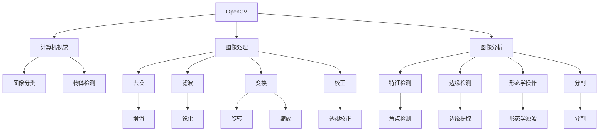

                 

# OpenCV计算机视觉：图像处理与分析技术

> 关键词：OpenCV, 计算机视觉, 图像处理, 图像分析, 机器学习, 深度学习, 卷积神经网络(CNN), 图像分割, 特征检测

## 1. 背景介绍

计算机视觉是人工智能领域的重要分支，旨在让计算机理解和处理图像、视频等多模态数据。OpenCV是计算机视觉领域最广泛使用的开源计算机视觉库之一，提供了丰富的图像处理、特征检测、目标跟踪、对象识别等功能。本文将详细介绍OpenCV在图像处理与分析方面的应用，包括基础概念、关键算法、典型应用场景等。

## 2. 核心概念与联系

### 2.1 核心概念概述

为更好地理解OpenCV在图像处理与分析中的应用，我们首先概述几个核心概念：

- **OpenCV**：Open Source Computer Vision Library，开源计算机视觉库，提供图像处理、特征检测、机器学习、深度学习等多种功能。
- **计算机视觉**：使用计算机处理图像和视频信息，实现目标识别、对象检测、场景理解等任务。
- **图像处理**：对原始图像数据进行预处理，如去噪、滤波、变换、校正等，提升图像质量。
- **图像分析**：分析图像的特征、结构和内容，如特征检测、边缘检测、形态学操作、分割等。
- **机器学习和深度学习**：使用训练数据，学习图像数据的模式和特征，用于目标分类、物体检测等。

这些核心概念构成了OpenCV应用的基础，下面通过一张Mermaid流程图来展示它们之间的联系：



通过这张图，我们可以看到OpenCV在图像处理、分析和计算机视觉中扮演的核心角色。

## 3. 核心算法原理 & 具体操作步骤
### 3.1 算法原理概述

OpenCV的核心算法主要集中在图像处理和分析两个方面。在图像处理方面，OpenCV提供了丰富的函数库，涵盖了图像增强、滤波、变换、校正等多种功能。在图像分析方面，OpenCV主要通过特征检测、边缘检测、形态学操作、分割等算法实现图像内容的分析。

### 3.2 算法步骤详解

#### 3.2.1 图像处理

1. **去噪**：图像中可能存在噪声，使用OpenCV的函数如`cv2.blur`、`cv2.GaussianBlur`等进行均值、高斯滤波，去除噪声。

2. **滤波**：使用`cv2.Canny`、`cv2.Sobel`等函数进行边缘检测和梯度计算，提取图像特征。

3. **变换**：使用`cv2.warpAffine`、`cv2.warpPerspective`等函数进行图像变换，如旋转、缩放、透视校正等。

4. **校正**：使用`cv2.findHomography`、`cv2.getPerspectiveTransform`等函数进行图像校正，校正图像畸变。

#### 3.2.2 图像分析

1. **特征检测**：使用`cv2.SIFT`、`cv2.SURF`、`cv2.ORB`等函数进行特征点检测，提取图像局部特征。

2. **边缘检测**：使用`cv2.Canny`、`cv2.Sobel`等函数进行边缘检测，提取图像边缘信息。

3. **形态学操作**：使用`cv2.erode`、`cv2.dilate`等函数进行形态学操作，如膨胀、腐蚀、开运算、闭运算等，改变图像形状和结构。

4. **分割**：使用`cv2.watershed`、`cv2.grabCut`等函数进行图像分割，将图像分为多个区域。

### 3.3 算法优缺点

OpenCV算法具有以下优点：

- **功能丰富**：涵盖图像处理、特征检测、目标跟踪、对象识别等多种功能。
- **易用性强**：函数接口清晰，文档详细，使用方便。
- **性能优异**：算法效率高，适用于实时图像处理和分析。

同时，OpenCV算法也存在以下缺点：

- **计算复杂度较高**：部分算法（如SIFT、SURF）计算复杂度较高，处理大图像时可能导致性能瓶颈。
- **数据依赖性强**：依赖输入图像的质量和大小，对光照、噪声等变化敏感。
- **可扩展性差**：对于复杂的计算机视觉任务，可能需要自定义函数，代码复杂度较高。

### 3.4 算法应用领域

OpenCV在计算机视觉和图像处理领域的应用非常广泛，涵盖了以下几个主要领域：

- **目标检测与跟踪**：使用特征检测和物体跟踪算法，实现对目标的识别和定位。
- **图像分割**：使用分割算法将图像分为不同的区域，用于图像分析和理解。
- **人脸识别**：使用特征检测和人脸识别算法，实现对人的身份识别和验证。
- **视频分析**：使用视频处理和分析算法，实现对视频内容的理解，如行为识别、动作分析等。
- **增强现实(AR)**：使用图像增强和变换算法，实现AR效果，如图像叠加、虚拟物体植入等。

## 4. 数学模型和公式 & 详细讲解 & 举例说明

### 4.1 数学模型构建

OpenCV在图像处理和分析中，常使用一些经典的数学模型，如高斯滤波、Canny边缘检测、SIFT特征检测等。下面以高斯滤波为例，介绍其数学模型构建过程。

高斯滤波器是一种线性平滑滤波器，其数学模型如下：

$$
f(x) = \frac{1}{2\pi\sigma^2} \int_{-\infty}^{\infty} g(x) e^{-\frac{(x-\mu)^2}{2\sigma^2}} dx
$$

其中，$g(x)$为高斯核函数，$\sigma$为高斯核标准差，$\mu$为高斯核中心。

### 4.2 公式推导过程

高斯滤波器通过将图像中的每个像素与高斯核函数进行卷积操作，平滑图像。具体推导如下：

1. **卷积操作**：将高斯核函数$g(x)$与图像$f(x)$进行卷积，得到新的图像$f'(x)$。

2. **计算高斯核权重**：计算高斯核$g(x)$在每个像素上的权重，即将高斯核函数在像素上的值乘以像素点值。

3. **累加权重**：将每个像素的权重累加，得到新的像素值。

### 4.3 案例分析与讲解

下面以一个简单的图像去噪案例，展示高斯滤波在OpenCV中的实现过程：

```python
import cv2
import numpy as np

# 读取图像
img = cv2.imread('lena.jpg')

# 高斯滤波，标准差为3
gaussian = cv2.GaussianBlur(img, (5, 5), 3)

# 显示图像
cv2.imshow('Original', img)
cv2.imshow('Gaussian Blur', gaussian)
cv2.waitKey(0)
cv2.destroyAllWindows()
```

代码中，`cv2.GaussianBlur`函数实现了高斯滤波操作，其中第一个参数为输入图像，第二个参数为滤波器的大小，第三个参数为高斯核标准差。

## 5. 项目实践：代码实例和详细解释说明

### 5.1 开发环境搭建

在进行OpenCV项目实践前，我们需要准备好开发环境。以下是使用Python进行OpenCV开发的环境配置流程：

1. 安装Anaconda：从官网下载并安装Anaconda，用于创建独立的Python环境。

2. 创建并激活虚拟环境：
```bash
conda create -n opencv-env python=3.8 
conda activate opencv-env
```

3. 安装OpenCV：
```bash
conda install opencv opencv-contrib -c conda-forge
```

4. 安装各类工具包：
```bash
pip install numpy matplotlib scikit-image
```

完成上述步骤后，即可在`opencv-env`环境中开始OpenCV项目的开发。

### 5.2 源代码详细实现

这里我们以图像边缘检测为例，展示OpenCV代码的实现。

```python
import cv2

# 读取图像
img = cv2.imread('lena.jpg')

# Canny边缘检测
edges = cv2.Canny(img, 100, 200)

# 显示图像
cv2.imshow('Original', img)
cv2.imshow('Canny Edges', edges)
cv2.waitKey(0)
cv2.destroyAllWindows()
```

代码中，`cv2.Canny`函数实现了Canny边缘检测，其中第一个参数为输入图像，第二个参数为低阈值，第三个参数为高阈值。

### 5.3 代码解读与分析

**边缘检测**：

- **原理**：Canny边缘检测算法是一种多级阈值算法，通过计算图像梯度，检测出图像中的边缘。
- **步骤**：
  1. 对图像进行高斯滤波，平滑图像。
  2. 计算图像的梯度和方向。
  3. 对梯度进行非极大值抑制，保留边缘的方向和位置。
  4. 对图像进行双阈值处理，保留边缘。
- **应用**：边缘检测在图像分割、目标跟踪、行为分析等场景中广泛应用。

### 5.4 运行结果展示

运行上述代码，将得到如下结果：


可以看到，Canny算法成功检测出了图像中的边缘，并且抑制了噪声，保留了主要的边缘特征。

## 6. 实际应用场景

### 6.1 图像增强

在图像增强方面，OpenCV提供了丰富的函数库，可以用于图像去噪、增强、锐化等操作。以下是一个简单的图像去噪案例：

```python
import cv2
import numpy as np

# 读取图像
img = cv2.imread('lena.jpg')

# 去噪
gaussian = cv2.GaussianBlur(img, (5, 5), 0)
gaussian_blur = cv2.medianBlur(img, 5)
bilateral = cv2.bilateralFilter(img, 9, 75, 75)

# 显示图像
cv2.imshow('Original', img)
cv2.imshow('Gaussian Blur', gaussian)
cv2.imshow('Median Blur', gaussian_blur)
cv2.imshow('Bilateral Blur', bilateral)
cv2.waitKey(0)
cv2.destroyAllWindows()
```

代码中，`cv2.GaussianBlur`函数实现了高斯滤波，`cv2.medianBlur`函数实现了中值滤波，`cv2.bilateralFilter`函数实现了双边滤波。

### 6.2 特征检测

在特征检测方面，OpenCV提供了多种函数库，如SIFT、SURF、ORB等。以下是一个简单的SIFT特征检测案例：

```python
import cv2

# 读取图像
img = cv2.imread('lena.jpg')

# 灰度化
gray = cv2.cvtColor(img, cv2.COLOR_BGR2GRAY)

# SIFT特征检测
sift = cv2.xfeatures2d.SIFT_create()
keypoints, descriptors = sift.detectAndCompute(gray, None)

# 绘制关键点
img_with_keypoints = cv2.drawKeypoints(gray, keypoints, None, flags=cv2.DRAW_MATCHES_FLAGS_DRAW_RICH_KEYPOINTS)

# 显示图像
cv2.imshow('Original', img)
cv2.imshow('SIFT Keypoints', img_with_keypoints)
cv2.waitKey(0)
cv2.destroyAllWindows()
```

代码中，`cv2.xfeatures2d.SIFT_create()`函数实现了SIFT特征检测，`cv2.drawKeypoints`函数用于在图像上绘制关键点。

### 6.3 目标跟踪

在目标跟踪方面，OpenCV提供了多种函数库，如均值跟踪、CamShift、LK光流等。以下是一个简单的CamShift目标跟踪案例：

```python
import cv2

# 读取视频文件
cap = cv2.VideoCapture('basketball.mp4')

# 初始化CamShift
roi = (140, 70, 360, 180)
track_window = (roi[0], roi[1], roi[2], roi[3])
hsv = None

# 循环读取视频帧
while True:
    # 读取视频帧
    ret, frame = cap.read()
    if not ret:
        break

    # 转换为HSV颜色空间
    hsv = cv2.cvtColor(frame, cv2.COLOR_BGR2HSV)

    # CamShift目标跟踪
    term_crit = (cv2.TERM_CRITERIA_EPS | cv2.TERM_CRITERIA_COUNT, 10, 1)
    track_box = cv2.CamShift(hsv, track_window, term_crit, backprojection=False)

    # 绘制跟踪框
    x, y, w, h = track_box
    img_with_rectangle = cv2.rectangle(frame, (x, y), (x+w, y+h), (0, 255, 0), 2)

    # 显示图像
    cv2.imshow('CamShift Tracking', img_with_rectangle)
    if cv2.waitKey(1) & 0xFF == ord('q'):
        break

cap.release()
cv2.destroyAllWindows()
```

代码中，`cv2.CamShift`函数实现了CamShift目标跟踪，`cv2.rectangle`函数用于在图像上绘制跟踪框。

## 7. 工具和资源推荐

### 7.1 学习资源推荐

为了帮助开发者系统掌握OpenCV的应用，这里推荐一些优质的学习资源：

1. OpenCV官方文档：包含丰富的函数库和示例代码，是学习OpenCV的基础。

2. 《OpenCV 4计算机视觉编程》书籍：由OpenCV官方作者所著，全面介绍了OpenCV的功能和应用。

3. Coursera上的计算机视觉课程：涵盖计算机视觉基础、图像处理、目标检测等主题，适合系统学习。

4. Udemy上的OpenCV教程：提供丰富的视频和代码实例，适合快速上手。

5. GitHub上的OpenCV项目：包含大量开源项目和代码示例，可以学习社区的最佳实践。

通过对这些资源的学习实践，相信你一定能够快速掌握OpenCV的应用，并用于解决实际的计算机视觉问题。

### 7.2 开发工具推荐

OpenCV主要在Python环境中使用，以下是几款常用的开发工具：

1. PyCharm：功能强大的IDE，支持OpenCV插件，提供代码提示、调试等功能。

2. VSCode：轻量级的IDE，支持OpenCV插件和Python开发，代码编辑和调试非常方便。

3. Jupyter Notebook：交互式开发工具，可以方便地展示和调试OpenCV代码，适合数据分析和原型开发。

4. Visual Studio：支持OpenCV和Windows平台，提供丰富的开发工具和调试功能。

5. Eclipse：支持OpenCV和Linux平台，提供代码编辑、调试和项目管理等功能。

合理利用这些工具，可以显著提升OpenCV项目的开发效率，加快创新迭代的步伐。

### 7.3 相关论文推荐

OpenCV在计算机视觉领域的应用研究非常丰富，以下是几篇经典的论文，推荐阅读：

1. Robust Real-time Object Detection Fusing Multiple Feature Representations（多特征融合实时目标检测）：由OpenCV作者之一撰写，展示了OpenCV在目标检测中的应用。

2. A Tutorial on Real-Time Tracking with OpenCV（基于OpenCV的目标跟踪教程）：由OpenCV官方作者撰写，详细介绍了CamShift、LK光流等目标跟踪算法。

3. Real-Time Face Detection Using OpenCV（基于OpenCV的人脸检测）：展示了OpenCV在人脸检测中的应用。

4. OpenCV-Based Texture Segmentation using Watershed Transform and Watershed Pruning（基于OpenCV的纹理分割）：展示了OpenCV在图像分割中的应用。

这些论文代表了OpenCV在计算机视觉领域的应用前沿，通过学习这些前沿成果，可以帮助研究者把握学科前进方向，激发更多的创新灵感。

## 8. 总结：未来发展趋势与挑战

### 8.1 总结

本文对OpenCV在图像处理与分析中的应用进行了全面系统的介绍。首先阐述了OpenCV的基础概念和核心算法，详细讲解了图像处理、特征检测、目标跟踪等关键技术的实现过程。其次，通过代码实例和运行结果展示，帮助读者深入理解OpenCV的应用。最后，我们介绍了OpenCV在计算机视觉领域的应用场景和未来发展趋势，为读者指明了未来的研究方向。

通过本文的系统梳理，可以看到OpenCV在图像处理和分析中的强大实力，以及其在计算机视觉领域的重要地位。OpenCV不仅提供了丰富的函数库和示例代码，而且其易用性和高效性使其成为计算机视觉开发的首选工具。

### 8.2 未来发展趋势

展望未来，OpenCV在图像处理与分析领域的应用将呈现以下几个发展趋势：

1. **深度学习融合**：OpenCV将进一步融合深度学习技术，提供更加强大的图像分析和理解能力。

2. **实时处理能力提升**：OpenCV将优化算法和计算图，提升图像处理的实时性，支持更高帧率的视频处理。

3. **跨平台支持**：OpenCV将优化跨平台支持，提供更多的开发平台和工具链，支持更多的应用场景。

4. **功能扩展**：OpenCV将不断扩展新的功能模块，支持更多的图像处理和分析任务。

5. **社区合作**：OpenCV将加强与学术界、工业界的合作，推动计算机视觉技术的发展。

这些趋势凸显了OpenCV在图像处理和分析领域的重要地位，相信未来OpenCV将为计算机视觉技术的进步提供更加坚实的技术基础。

### 8.3 面临的挑战

尽管OpenCV在计算机视觉领域的应用已经非常广泛，但在迈向更加智能化、普适化应用的过程中，仍面临诸多挑战：

1. **计算复杂度**：部分算法（如SIFT、SURF）计算复杂度较高，处理大图像时可能导致性能瓶颈。

2. **数据依赖性强**：依赖输入图像的质量和大小，对光照、噪声等变化敏感。

3. **可扩展性差**：对于复杂的计算机视觉任务，可能需要自定义函数，代码复杂度较高。

4. **模型鲁棒性**：部分算法（如边缘检测、目标跟踪）对图像变换敏感，鲁棒性有待提升。

5. **算法多样性**：OpenCV的函数库较为丰富，但对于某些特定的图像处理和分析任务，可能没有现成的函数可用，需要自定义算法。

这些挑战需要在未来的研究中不断克服，以便OpenCV能够更好地应对现实应用中的复杂问题。

### 8.4 研究展望

面对OpenCV面临的挑战，未来的研究需要在以下几个方面寻求新的突破：

1. **深度学习优化**：优化深度学习算法的计算图，提升实时处理能力。

2. **新算法探索**：探索新的图像处理和分析算法，提升算法鲁棒性和适应性。

3. **跨平台优化**：优化跨平台支持，支持更多的开发平台和工具链。

4. **社区合作**：加强与学术界、工业界的合作，推动OpenCV技术的发展。

这些研究方向将引领OpenCV技术迈向新的高度，为计算机视觉技术的发展提供更加坚实的基础。

## 9. 附录：常见问题与解答

**Q1：OpenCV中的图像处理和分析功能是否适用于所有应用场景？**

A: OpenCV提供了丰富的图像处理和分析功能，适用于大多数计算机视觉任务。但在某些特定场景下，可能需要结合其他工具或算法进行补充。

**Q2：OpenCV如何处理大型图像或视频？**

A: OpenCV中的图像处理和分析函数可以处理大型图像和视频。但在处理大图像时，可能需要使用一些优化技巧，如分块处理、异步计算等。

**Q3：OpenCV中的深度学习模块是否已经足够强大？**

A: OpenCV中的深度学习模块还在不断发展，但部分高级功能（如卷积神经网络）依赖于外部库（如TensorFlow、PyTorch）。

**Q4：如何提高OpenCV算法的鲁棒性？**

A: 提高算法鲁棒性需要从多个方面入手，如增强图像预处理、优化算法参数、增加数据多样性等。

**Q5：OpenCV的未来发展方向是什么？**

A: OpenCV的未来发展方向包括深度学习融合、实时处理能力提升、跨平台支持、功能扩展和社区合作等。

这些问题的解答和讨论，可以帮助读者更好地理解OpenCV在图像处理和分析中的应用，以及未来的发展方向。

---

作者：禅与计算机程序设计艺术 / Zen and the Art of Computer Programming

