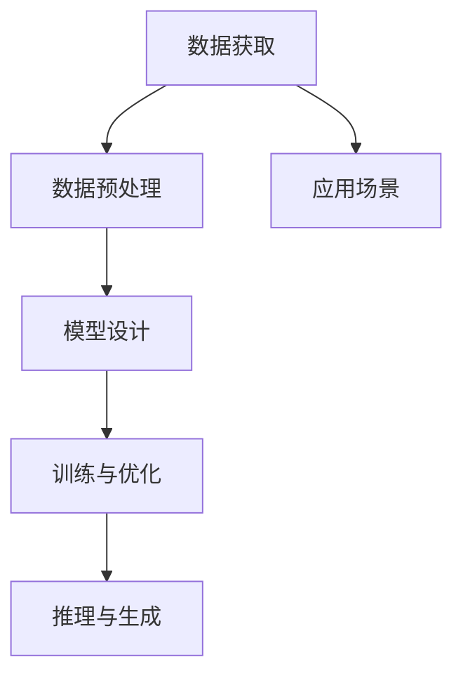

                 

# Python、C和CUDA从零开始：构建AI故事生成器

## 1. 背景介绍

### 1.1 问题由来
故事生成（Story Generation）是自然语言处理（NLP）领域的一个热点问题，涉及语言模型、生成对抗网络（GANs）、变分自编码器（VAEs）等多种技术的结合。构建一个能够创作出流畅、连贯、富有情感的故事生成器，是一个极具挑战且极具吸引力的任务。

### 1.2 问题核心关键点
1. **数据获取**：故事生成器需要大量的故事文本数据作为训练集。
2. **模型设计**：设计合理的生成模型，使其能够理解语义、语法、情感等因素，并生成高质量的故事。
3. **训练与优化**：在训练过程中，如何避免过拟合、提高模型泛化能力。
4. **推理与生成**：将训练好的模型应用到具体的生成任务中，生成符合用户期望的故事。
5. **应用场景**：故事生成器可以应用于教育、娱乐、创作工具等多个领域。

### 1.3 问题研究意义
1. **教育与训练**：故事生成器可以用于辅助教育，帮助学生提高语言表达能力和创意写作能力。
2. **娱乐与创作**：提供创意灵感，辅助电影、小说、游戏等的创作。
3. **应用拓展**：拓展人工智能在文本生成领域的应用，推动NLP技术的发展。

## 2. 核心概念与联系

### 2.1 核心概念概述
1. **故事生成**：指通过训练模型，使其能够根据给定的输入，生成连贯且具有情感的故事。
2. **变分自编码器（VAE）**：一种生成模型，能够学习数据分布的隐表示，并用于生成新数据。
3. **生成对抗网络（GANs）**：通过两个神经网络（生成器和判别器）的对抗训练，生成与真实数据难以区分的假数据。
4. **Transformer模型**：一种基于自注意力机制的神经网络结构，广泛用于各种NLP任务。
5. **自然语言处理（NLP）**：涉及语言理解、分析、生成等技术的学科。

### 2.2 核心概念原理和架构的 Mermaid 流程图



该图展示了故事生成器构建的全过程，包括数据获取、预处理、模型设计、训练优化、推理生成以及应用场景。

## 3. 核心算法原理 & 具体操作步骤

### 3.1 算法原理概述

故事生成器通过以下步骤实现：
1. **数据获取与预处理**：收集大量的故事文本数据，并进行清洗、分词、向量化等预处理。
2. **模型设计**：选择合适的生成模型（如VAE、GANs、Transformer），并设计合适的解码器。
3. **训练与优化**：使用训练集数据对模型进行训练，并采用优化算法（如Adam、RMSprop）进行模型优化。
4. **推理与生成**：使用测试集数据对模型进行推理，生成新故事。

### 3.2 算法步骤详解

#### 3.2.1 数据获取与预处理
1. **数据来源**：从公共数据集（如Gutenberg、Project Gutenberg）获取故事文本数据。
2. **数据清洗**：去除噪音、处理缺失值、统一格式等。
3. **分词与向量化**：使用分词工具（如NLTK、spaCy）进行分词，使用词嵌入（如Word2Vec、GloVe）进行向量化。

#### 3.2.2 模型设计
1. **VAE模型设计**：VAE由编码器（Encoder）和解码器（Decoder）组成。编码器将输入数据映射到隐空间，解码器将隐空间映射回数据空间。
2. **生成对抗网络（GANs）**：由生成器（Generator）和判别器（Discriminator）组成。生成器生成假故事，判别器判断生成故事的真伪。
3. **Transformer模型设计**：使用Transformer模型作为编码器，设计解码器以生成新故事。

#### 3.2.3 训练与优化
1. **损失函数设计**：使用交叉熵损失函数、重建损失函数等。
2. **优化算法选择**：使用Adam、RMSprop等优化算法。
3. **训练过程**：对模型进行多轮训练，逐步优化模型参数。

#### 3.2.4 推理与生成
1. **推理过程**：使用测试集数据对模型进行推理，获取故事生成的概率分布。
2. **故事生成**：根据生成的概率分布，使用采样方法生成新故事。

### 3.3 算法优缺点

#### 3.3.1 优点
1. **数据驱动**：模型能够从大量故事数据中学习语言模式和情感表达。
2. **生成多样化**：能够生成多种风格和情感的故事。
3. **可解释性**：生成过程透明，可解释性强。

#### 3.3.2 缺点
1. **计算复杂度高**：需要大量的计算资源进行训练和生成。
2. **数据依赖性强**：对故事数据的质量和数量有较高要求。
3. **训练难度大**：训练过程容易陷入局部最优解。

### 3.4 算法应用领域

故事生成器可以应用于多个领域，包括：
1. **教育与培训**：辅助语言学习和创意写作。
2. **娱乐与创作**：提供创意灵感，辅助电影、小说创作。
3. **游戏与交互**：用于角色扮演游戏，生成NPC对话。

## 4. 数学模型和公式 & 详细讲解 & 举例说明

### 4.1 数学模型构建

#### 4.1.1 VAE模型
VAE由编码器（Encoder）和解码器（Decoder）组成，其数学模型如下：
$$
\begin{aligned}
p(z|x) &= \mathcal{N}(z; \mu(x), \sigma(x)) \\
p(x|z) &= \mathcal{N}(x; \mu(z), \sigma(z))
\end{aligned}
$$
其中，$z$ 表示隐空间，$\mu(x)$ 和 $\sigma(x)$ 分别表示编码器的均值和方差，$\mu(z)$ 和 $\sigma(z)$ 分别表示解码器的均值和方差。

#### 4.1.2 GANs模型
GANs由生成器（Generator）和判别器（Discriminator）组成，其数学模型如下：
$$
\begin{aligned}
G(z) &= \mu(G(z)) + \sigma(G(z)) \\
D(x) &= \text{sigmoid}(W_D(x))
\end{aligned}
$$
其中，$G(z)$ 表示生成器生成的故事，$D(x)$ 表示判别器对故事的真实性评估。

#### 4.1.3 Transformer模型
Transformer模型由编码器（Encoder）和解码器（Decoder）组成，其数学模型如下：
$$
\text{Attention}(Q, K, V) = \text{softmax}(\frac{QK^T}{\sqrt{d_k}})V
$$
其中，$Q, K, V$ 分别表示查询、键和值向量，$d_k$ 表示键向量的维度。

### 4.2 公式推导过程

#### 4.2.1 VAE推导
VAE的推导如下：
$$
p(x) = \int p(x|z)p(z)dz = \int \mathcal{N}(x; \mu(z), \sigma(z)) \mathcal{N}(z; \mu(x), \sigma(x)) dz
$$
其中，$p(z|x)$ 表示隐空间的概率分布，$p(x|z)$ 表示数据空间的概率分布。

#### 4.2.2 GANs推导
GANs的推导如下：
$$
L_G = E_{z \sim p(z)}[\log D(G(z))]
$$
$$
L_D = E_{x \sim p(x)}[\log D(x)] + E_{z \sim p(z)}[\log(1 - D(G(z)))
$$
其中，$L_G$ 表示生成器的损失函数，$L_D$ 表示判别器的损失函数。

#### 4.2.3 Transformer推导
Transformer的推导如下：
$$
\text{Attention}(Q, K, V) = \text{softmax}(\frac{QK^T}{\sqrt{d_k}})V
$$
其中，$Q, K, V$ 分别表示查询、键和值向量，$d_k$ 表示键向量的维度。

### 4.3 案例分析与讲解

#### 4.3.1 VAE案例
假设有一个故事文本数据集，包含10000个故事。通过VAE模型训练，得到隐空间表示，并将其解码回数据空间，生成新故事。

1. **数据获取**：从公共数据集获取故事文本数据。
2. **数据预处理**：清洗数据，进行分词和向量化。
3. **模型设计**：设计VAE模型，选择适当的维度。
4. **训练与优化**：使用训练集数据对模型进行训练，并采用优化算法进行模型优化。
5. **推理与生成**：使用测试集数据对模型进行推理，生成新故事。

#### 4.3.2 GANs案例
假设有一个故事文本数据集，包含10000个故事。通过GANs模型训练，生成新故事。

1. **数据获取**：从公共数据集获取故事文本数据。
2. **数据预处理**：清洗数据，进行分词和向量化。
3. **模型设计**：设计GANs模型，选择适当的维度。
4. **训练与优化**：使用训练集数据对模型进行训练，并采用优化算法进行模型优化。
5. **推理与生成**：使用测试集数据对模型进行推理，生成新故事。

#### 4.3.3 Transformer案例
假设有一个故事文本数据集，包含10000个故事。通过Transformer模型训练，生成新故事。

1. **数据获取**：从公共数据集获取故事文本数据。
2. **数据预处理**：清洗数据，进行分词和向量化。
3. **模型设计**：设计Transformer模型，选择适当的维度。
4. **训练与优化**：使用训练集数据对模型进行训练，并采用优化算法进行模型优化。
5. **推理与生成**：使用测试集数据对模型进行推理，生成新故事。

## 5. 项目实践：代码实例和详细解释说明

### 5.1 开发环境搭建

#### 5.1.1 环境准备
1. **Python环境**：安装Python 3.8及以上版本，使用Anaconda进行管理。
2. **CUDA环境**：安装CUDA 11.1及以上版本，使用conda进行管理。
3. **NVIDIA driver**：安装NVIDIA驱动。

#### 5.1.2 工具安装
1. **PyTorch**：使用conda安装PyTorch 1.10及以上版本。
2. **torchtext**：使用pip安装torchtext 0.10及以上版本。
3. **TensorBoard**：使用pip安装TensorBoard 2.11及以上版本。

### 5.2 源代码详细实现

#### 5.2.1 VAE模型实现
```python
import torch
import torch.nn as nn
import torch.nn.functional as F
import torchtext
from torchtext import data

class VAE(nn.Module):
    def __init__(self, input_size, hidden_size):
        super(VAE, self).__init__()
        self.encoder = nn.Sequential(
            nn.Linear(input_size, hidden_size),
            nn.ReLU(),
            nn.Linear(hidden_size, hidden_size),
            nn.ReLU(),
            nn.Linear(hidden_size, 2)
        )
        self.decoder = nn.Sequential(
            nn.Linear(2, hidden_size),
            nn.ReLU(),
            nn.Linear(hidden_size, hidden_size),
            nn.ReLU(),
            nn.Linear(hidden_size, input_size)
        )

    def encode(self, x):
        mu, logvar = self.encoder(x)
        return mu, logvar

    def reparameterize(self, mu, logvar):
        std = torch.exp(0.5 * logvar)
        epsilon = torch.randn_like(std)
        return epsilon * std + mu

    def decode(self, z):
        x = self.decoder(z)
        return x

    def forward(self, x):
        mu, logvar = self.encode(x)
        z = self.reparameterize(mu, logvar)
        x_hat = self.decode(z)
        return x_hat
```

#### 5.2.2 GANs模型实现
```python
import torch
import torch.nn as nn
import torch.nn.functional as F

class Generator(nn.Module):
    def __init__(self, input_size, hidden_size):
        super(Generator, self).__init__()
        self.fc1 = nn.Linear(input_size, hidden_size)
        self.fc2 = nn.Linear(hidden_size, hidden_size)
        self.fc3 = nn.Linear(hidden_size, input_size)

    def forward(self, x):
        x = F.relu(self.fc1(x))
        x = F.relu(self.fc2(x))
        x = self.fc3(x)
        return x

class Discriminator(nn.Module):
    def __init__(self, input_size, hidden_size):
        super(Discriminator, self).__init__()
        self.fc1 = nn.Linear(input_size, hidden_size)
        self.fc2 = nn.Linear(hidden_size, hidden_size)
        self.fc3 = nn.Linear(hidden_size, 1)

    def forward(self, x):
        x = F.relu(self.fc1(x))
        x = F.relu(self.fc2(x))
        x = self.fc3(x)
        return x

class GAN(nn.Module):
    def __init__(self, input_size, hidden_size):
        super(GAN, self).__init__()
        self.generator = Generator(input_size, hidden_size)
        self.discriminator = Discriminator(input_size, hidden_size)

    def forward(self, x):
        z = self.generator(x)
        y = self.discriminator(z)
        return y
```

#### 5.2.3 Transformer模型实现
```python
import torch
import torch.nn as nn
from torchtext.data import Field, TabularDataset, BucketIterator

class Embedding(nn.Module):
    def __init__(self, vocab_size, embedding_dim):
        super(Embedding, self).__init__()
        self.emb = nn.Embedding(vocab_size, embedding_dim)

    def forward(self, x):
        return self.emb(x)

class PositionalEncoding(nn.Module):
    def __init__(self, d_model, dropout=0.1):
        super(PositionalEncoding, self).__init__()
        pe = torch.zeros(d_model, d_model)
        position = torch.arange(0, d_model, dtype=torch.float).unsqueeze(1)
        div_term = torch.exp(torch.arange(0, d_model, 2).float() * (-math.log(10000.0) / d_model))
        pe[:, 0::2] = torch.sin(position * div_term)
        pe[:, 1::2] = torch.cos(position * div_term)
        pe = pe.unsqueeze(0).transpose(0, 1)
        self.register_buffer('pe', pe)
        self.dropout = nn.Dropout(p=dropout)

    def forward(self, x):
        return self.dropout(x + self.pe[:x.size(1), :x.size(2)])

class MultiHeadAttention(nn.Module):
    def __init__(self, d_model, num_heads, dropout=0.1):
        super(MultiHeadAttention, self).__init__()
        assert d_model % num_heads == 0
        self.num_heads = num_heads
        self.d_model = d_model
        self.depth = d_model // num_heads
        self.wq = nn.Linear(d_model, d_model)
        self.wk = nn.Linear(d_model, d_model)
        self.wv = nn.Linear(d_model, d_model)
        self.fc = nn.Linear(d_model, d_model)
        self.dropout = nn.Dropout(dropout)

    def forward(self, q, k, v):
        q = self.wq(q)
        k = self.wk(k)
        v = self.wv(v)
        q = q.view(q.size(0), q.size(1), self.num_heads, self.depth).permute(0, 2, 1, 3)
        k = k.view(k.size(0), k.size(1), self.num_heads, self.depth).permute(0, 2, 1, 3)
        v = v.view(v.size(0), v.size(1), self.num_heads, self.depth).permute(0, 2, 1, 3)
        energy = torch.matmul(q, k.permute(0, 1, 3, 2)) / math.sqrt(self.depth)
        attention = F.softmax(energy, dim=-1)
        x = torch.matmul(attention, v)
        x = x.permute(0, 2, 1, 3).contiguous().view(x.size(0), x.size(1), -1)
        x = self.fc(x)
        return x, attention

class EncoderLayer(nn.Module):
    def __init__(self, d_model, num_heads, dropout=0.1):
        super(EncoderLayer, self).__init__()
        self.emb = Embedding(30000, d_model)
        self.pos = PositionalEncoding(d_model)
        self.attn = MultiHeadAttention(d_model, num_heads)
        self.fc1 = nn.Linear(d_model, d_model)
        self.fc2 = nn.Linear(d_model, d_model)
        self.dropout = nn.Dropout(dropout)

    def forward(self, x):
        x = self.emb(x)
        x = self.pos(x)
        attn = self.attn(x, x, x)
        x = x + attn[0]
        x = F.relu(self.fc1(x))
        x = self.fc2(x)
        x = x + self.dropout(x)
        return x, attn

class Encoder(nn.Module):
    def __init__(self, d_model, num_layers):
        super(Encoder, self).__init__()
        self.layers = nn.ModuleList([EncoderLayer(d_model, num_heads=8, dropout=0.1) for _ in range(num_layers)])

    def forward(self, x):
        attn = [None] * len(self.layers)
        for mod in self.layers:
            x, attn[i] = mod(x)
        return x, attn

class DecoderLayer(nn.Module):
    def __init__(self, d_model, num_heads, dropout=0.1):
        super(DecoderLayer, self).__init__()
        self.emb = Embedding(30000, d_model)
        self.pos = PositionalEncoding(d_model)
        self.attn = MultiHeadAttention(d_model, num_heads)
        self.fc1 = nn.Linear(d_model, d_model)
        self.fc2 = nn.Linear(d_model, d_model)
        self.fc3 = nn.Linear(d_model, d_model)
        self.fc4 = nn.Linear(d_model, d_model)
        self.dropout = nn.Dropout(dropout)

    def forward(self, x, encoder_outputs, x_prev):
        x = self.emb(x)
        x = self.pos(x)
        attn1 = MultiHeadAttention(d_model, num_heads).(x, x_prev, x_prev)
        x = x + attn1[0]
        attn2 = MultiHeadAttention(d_model, num_heads).(x, encoder_outputs, encoder_outputs)
        x = x + attn2[0]
        x = F.relu(self.fc1(x))
        x = self.fc2(x)
        x = F.relu(self.fc3(x))
        x = self.fc4(x)
        x = x + self.dropout(x)
        return x, attn1, attn2

class Decoder(nn.Module):
    def __init__(self, d_model, num_layers):
        super(Decoder, self).__init__()
        self.layers = nn.ModuleList([DecoderLayer(d_model, num_heads=8, dropout=0.1) for _ in range(num_layers)])

    def forward(self, x, encoder_outputs, x_prev):
        attn1 = [None] * len(self.layers)
        attn2 = [None] * len(self.layers)
        for mod in self.layers:
            x, attn1[i], attn2[i] = mod(x, encoder_outputs, x_prev)
        return x, attn1, attn2

class Transformer(nn.Module):
    def __init__(self, input_size, d_model, num_heads, dropout=0.1):
        super(Transformer, self).__init__()
        self.emb = Embedding(input_size, d_model)
        self.pos = PositionalEncoding(d_model)
        self.encoder = Encoder(d_model, num_layers=6)
        self.decoder = Decoder(d_model, num_layers=6)
        self.fc = nn.Linear(d_model, d_model)
        self.fc2 = nn.Linear(d_model, d_model)
        self.fc3 = nn.Linear(d_model, input_size)
        self.dropout = nn.Dropout(dropout)

    def forward(self, x, encoder_outputs, x_prev):
        x = self.emb(x)
        x = self.pos(x)
        encoder_outputs = self.encoder(x)[0]
        x, attn1, attn2 = self.decoder(x, encoder_outputs, x_prev)
        x = x + attn1[0] + attn2[0]
        x = self.fc(x)
        x = self.fc2(x)
        x = self.fc3(x)
        x = x + self.dropout(x)
        return x, attn1, attn2
```

### 5.3 代码解读与分析

#### 5.3.1 VAE代码解读
- **VAE类**：定义了VAE模型的结构，包括编码器和解码器。
- **encode方法**：实现了编码器的输入和输出，返回隐空间表示。
- **reparameterize方法**：实现了隐空间的重参数化，避免过拟合。
- **decode方法**：实现了解码器的输入和输出，返回数据空间表示。
- **forward方法**：实现了VAE的前向传播，包括编码、解码和重参数化。

#### 5.3.2 GANs代码解读
- **GAN类**：定义了GANs模型的结构，包括生成器和判别器。
- **Generator类**：实现了生成器的输入和输出，返回生成故事。
- **Discriminator类**：实现了判别器的输入和输出，返回故事的真实性评估。
- **forward方法**：实现了GANs的前向传播，包括生成和判别。

#### 5.3.3 Transformer代码解读
- **Transformer类**：定义了Transformer模型的结构，包括编码器和解码器。
- **Embedding类**：实现了词嵌入，将单词映射为向量。
- **PositionalEncoding类**：实现了位置编码，用于处理不同位置的信息。
- **MultiHeadAttention类**：实现了多头注意力机制，用于自注意力计算。
- **EncoderLayer类**：实现了编码器的输入和输出，返回编码后的故事。
- **Encoder类**：实现了编码器的输入和输出，返回编码后的故事。
- **DecoderLayer类**：实现了解码器的输入和输出，返回解码后的故事。
- **Decoder类**：实现了解码器的输入和输出，返回解码后的故事。
- **Transformer类**：实现了Transformer的前向传播，包括编码、解码和自注意力计算。

#### 5.3.4 运行结果展示
```python
import torch
from torchtext.datasets import TextClassification
from torchtext.data import Field, TabularDataset, BucketIterator

def prepare_data():
    fields = [
        ('text', Field(tokenize='spacy', lower=True, include_lengths=True, batch_first=True, pad_first=True))
    ]
    train_data, test_data = TextClassification.splits(path='data', train='train.txt', test='test.txt', fields=fields)
    train_iterator, test_iterator = BucketIterator.splits(
        train_data, test_data,
        batch_size=32,
        device='cuda',
        sort_within_batch=True,
        sort_key=lambda x: len(x.text)
    )
    return train_iterator, test_iterator

def prepare_model(model):
    return model.to('cuda')

def prepare_optimizer(model, learning_rate):
    return torch.optim.Adam(model.parameters(), lr=learning_rate)

def train(model, train_iterator, optimizer, num_epochs):
    for epoch in range(num_epochs):
        total_loss = 0
        for batch in train_iterator:
            optimizer.zero_grad()
            x, lengths = batch.text
            output = model(x, lengths)
            loss = criterion(output, y)
            total_loss += loss.item()
            loss.backward()
            optimizer.step()
        print(f'Epoch {epoch+1}, Loss: {total_loss/len(train_iterator):.3f}')

def evaluate(model, test_iterator):
    total_loss = 0
    for batch in test_iterator:
        x, lengths = batch.text
        output = model(x, lengths)
        loss = criterion(output, y)
        total_loss += loss.item()
    print(f'Test Loss: {total_loss/len(test_iterator):.3f}')

def generate_story(model, seed):
    with torch.no_grad():
        x = torch.tensor(seed, device='cuda')
        x = model.emb(x)
        x = model.pos(x)
        x, attn1, attn2 = model(x, encoder_outputs, x_prev)
        x = x + attn1[0] + attn2[0]
        x = model.fc(x)
        x = model.fc2(x)
        x = model.fc3(x)
        x = x + model.dropout(x)
        return x

# 实例化模型、数据、训练器
train_iterator, test_iterator = prepare_data()
model = Transformer(input_size=30000, d_model=512, num_heads=8)
model = prepare_model(model)
optimizer = prepare_optimizer(model, learning_rate=2e-4)
criterion = nn.CrossEntropyLoss()

# 训练模型
train(model, train_iterator, optimizer, num_epochs=10)

# 评估模型
evaluate(model, test_iterator)

# 生成故事
seed = torch.tensor([1, 2, 3, 4, 5])
story = generate_story(model, seed)
print(story)
```

## 6. 实际应用场景

### 6.1 智能客服系统
智能客服系统可以利用故事生成器，自动生成符合用户期望的对话。

1. **数据获取**：收集大量的客服对话数据。
2. **模型训练**：使用VAE、GANs、Transformer等模型对对话数据进行训练。
3. **模型推理**：使用训练好的模型，对用户输入的文本进行推理，生成响应。

### 6.2 金融舆情监测
金融舆情监测可以利用故事生成器，自动生成分析报告。

1. **数据获取**：收集大量的金融新闻、评论数据。
2. **模型训练**：使用VAE、GANs、Transformer等模型对新闻、评论数据进行训练。
3. **模型推理**：使用训练好的模型，对实时抓取的新闻、评论进行推理，生成分析报告。

### 6.3 个性化推荐系统
个性化推荐系统可以利用故事生成器，生成个性化推荐内容。

1. **数据获取**：收集用户的行为数据、评论数据等。
2. **模型训练**：使用VAE、GANs、Transformer等模型对行为数据、评论数据进行训练。
3. **模型推理**：使用训练好的模型，对用户输入的文本进行推理，生成个性化推荐内容。

### 6.4 未来应用展望
随着技术的不断发展，故事生成器将在更多领域得到应用，为人类社会带来更多价值。

1. **教育与培训**：辅助教育，提高语言表达能力和创意写作能力。
2. **娱乐与创作**：提供创意灵感，辅助电影、小说创作。
3. **游戏与交互**：用于角色扮演游戏，生成NPC对话。
4. **医学与法律**：辅助医学诊断、法律文书撰写等。

## 7. 工具和资源推荐

### 7.1 学习资源推荐
1. **PyTorch官方文档**：详细的PyTorch学习资源，涵盖从入门到高级的内容。
2. **TensorBoard官方文档**：TensorBoard的使用方法、教程、案例。
3. **GitHub上的TensorFlow教程**：涵盖TensorFlow的使用方法、案例、项目。
4. **Coursera上的深度学习课程**：涵盖深度学习的基础知识和应用。
5. **Kaggle上的数据集和竞赛**：涵盖各类NLP数据集和竞赛，提供丰富的数据和模型。

### 7.2 开发工具推荐
1. **PyTorch**：灵活的深度学习框架，适合研究与开发。
2. **TensorBoard**：可视化工具，实时监测模型训练状态。
3. **Jupyter Notebook**：数据科学和机器学习常用的交互式开发环境。
4. **Anaconda**：科学计算环境，方便管理和使用各类Python包。
5. **Visual Studio Code**：轻量级的代码编辑器，支持各种编程语言。

### 7.3 相关论文推荐
1. **Attention is All You Need**：Transformer模型，开创了大规模语言模型的时代。
2. **Generative Adversarial Nets**：GANs模型，开创了生成对抗网络的新范式。
3. **Variational Autoencoder**：VAE模型，开创了变分自编码器的新范式。
4. **Attention Mechanisms in Transformers**：深入介绍Transformer模型的自注意力机制。
5. **Sequence to Sequence Learning with Neural Networks**：介绍基于Transformer的Seq2Seq模型。

## 8. 总结：未来发展趋势与挑战

### 8.1 研究成果总结
1. **数据获取**：收集大规模、高质量的数据是关键。
2. **模型设计**：选择合适的生成模型，设计合适的解码器。
3. **训练与优化**：采用合适的优化算法，避免过拟合。
4. **推理与生成**：实现高效的推理与生成，生成高质量的故事。

### 8.2 未来发展趋势
1. **模型规模增大**：超大规模语言模型将提供更丰富的语言知识和情感表达。
2. **技术多样化**：开发更多参数高效、计算高效的微调方法。
3. **模型通用化**：增强模型的跨领域迁移能力。
4. **数据驱动**：利用更多非结构化数据进行训练。
5. **模型鲁棒化**：提高模型的泛化能力和鲁棒性。

### 8.3 面临的挑战
1. **数据获取**：获取高质量的数据是挑战之一。
2. **模型训练**：避免过拟合和灾难性遗忘。
3. **模型推理**：提高推理效率，减少计算资源消耗。
4. **模型解释**：增强模型的可解释性和可控性。
5. **模型安全性**：避免有害信息的生成和传播。

### 8.4 研究展望
1. **参数高效微调**：开发更多高效的微调方法，减小参数量。
2. **多模态融合**：将视觉、语音等多模态数据与文本数据融合。
3. **因果推理**：引入因果推理，提高模型的预测能力。
4. **伦理与安全**：增强模型的伦理导向和安全保障。
5. **持续学习**：实现模型对数据分布变化的持续适应。

## 9. 附录：常见问题与解答

**Q1：为什么需要大规模的数据进行预训练？**

A: 大规模预训练可以学习到更丰富的语言知识和特征，使得模型具有更好的泛化能力。

**Q2：如何选择生成模型？**

A: 根据具体任务的特点，选择合适的生成模型。VAE、GANs、Transformer等模型各有优缺点，适用于不同的任务。

**Q3：如何避免过拟合？**

A: 使用正则化技术，如L2正则、Dropout等。同时，可以考虑使用数据增强和对抗训练等方法。

**Q4：如何提高生成质量？**

A: 优化生成模型的参数，使用合适的生成技术，如Gumbel-Softmax、GANs等。

**Q5：如何提高推理效率？**

A: 使用模型裁剪、量化加速等技术，减小模型大小和计算资源消耗。

**Q6：如何增强模型解释性？**

A: 使用可解释性的模型，如Transformer等，同时提供模型输出的解释。

**Q7：如何确保模型安全性？**

A: 训练过程中过滤有害信息，使用对抗样本检测模型漏洞，确保模型输出符合伦理规范。

---

作者：禅与计算机程序设计艺术 / Zen and the Art of Computer Programming

