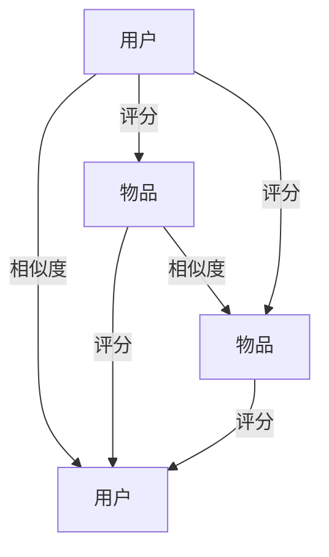
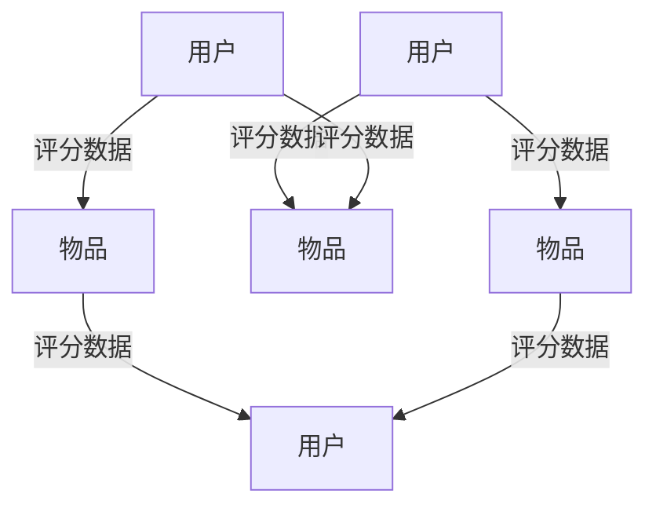

                 

## 1. 背景介绍

推荐系统在电商、新闻、视频、社交网络等平台被广泛应用，通过为用户推荐感兴趣的物品，提升用户体验和平台收益。随着用户基数和物品种类不断增长，推荐系统需要处理的数据量变得异常庞大，这对推荐模型的计算效率和准确性都提出了更高的要求。协同过滤（Collaborative Filtering, CF）是一种基于用户行为数据的推荐方法，它不依赖物品的特征信息，只通过用户与物品的交互矩阵来预测用户对新物品的评分，并据此生成推荐结果。本文将详细介绍协同过滤模型的构建、优化及在推荐系统中的应用。

## 2. 核心概念与联系

### 2.1 核心概念概述

协同过滤（Collaborative Filtering, CF）是一种推荐算法，它利用用户和物品的相似度，推荐用户可能喜欢的物品。协同过滤模型主要分为两类：基于用户的协同过滤和基于物品的协同过滤。

- 基于用户的协同过滤（User-based Collaborative Filtering, U-CF）：利用用户之间的相似性推荐物品。推荐模型首先计算用户间的相似度，然后根据相似用户对物品的评分，预测目标用户对物品的评分。

- 基于物品的协同过滤（Item-based Collaborative Filtering, I-CF）：利用物品之间的相似性推荐物品。推荐模型首先计算物品间的相似度，然后根据相似物品对用户的评分，预测目标用户对物品的评分。

协同过滤的原理如图1所示，模型首先通过相似度计算，找到与目标用户（或物品）最相似的邻居集合，然后根据这些邻居对物品的评分，计算目标用户对物品的评分预测。



协同过滤算法通常分为离线训练和在线预测两个步骤。离线训练是指在已有数据集上训练模型，得到用户和物品之间的相似度矩阵。在线预测是指在新的用户物品对到来时，根据相似度矩阵计算用户对物品的评分预测，生成推荐列表。

### 2.2 核心概念联系

协同过滤算法依赖于用户和物品之间的相似度计算，因此相似度计算是协同过滤算法的核心。常用的相似度计算方法包括皮尔逊相关系数（Pearson Correlation Coefficient）、余弦相似度（Cosine Similarity）、欧氏距离（Euclidean Distance）等。

皮尔逊相关系数和余弦相似度的公式分别为：

$$
r = \frac{\sum_{i=1}^n (x_i - \bar{x})(y_i - \bar{y})}{\sqrt{\sum_{i=1}^n (x_i - \bar{x})^2 \sum_{i=1}^n (y_i - \bar{y})^2}
$$

$$
similarity = \frac{\mathbf{u} \cdot \mathbf{v}}{\|\mathbf{u}\|_2 \|\mathbf{v}\|_2}
$$

其中，$r$表示皮尔逊相关系数，$x$和$y$表示两个向量的值，$\bar{x}$和$\bar{y}$表示$x$和$y$的平均值，$\mathbf{u}$和$\mathbf{v}$表示两个向量的内积，$\|\mathbf{u}\|_2$和$\|\mathbf{v}\|_2$表示向量的模长。

## 3. 核心算法原理 & 具体操作步骤
### 3.1 算法原理概述

协同过滤算法的核心在于计算用户和物品之间的相似度，并根据相似度计算评分预测。评分预测的方法主要包括矩阵分解和模型学习。

- 矩阵分解（Matrix Factorization, MF）：将用户物品评分矩阵分解为用户和物品的隐向量表示，通过优化隐向量来预测新物品的评分。MF算法通常分为基于SVD的矩阵分解和基于ALS（Alternating Least Squares）的矩阵分解。

- 模型学习（Model-based Learning）：通过机器学习算法，从用户物品评分数据中学习用户和物品的表示，并根据表示进行评分预测。常用的模型学习算法包括SVM、神经网络等。

### 3.2 算法步骤详解

协同过滤算法的步骤包括数据准备、相似度计算、评分预测和推荐生成。

**Step 1: 数据准备**

数据准备是指收集用户物品评分数据，并对其进行预处理。用户物品评分数据通常以稀疏矩阵的形式表示，其中每一行表示一个用户，每一列表示一个物品，非零元素表示用户对物品的评分。在数据准备过程中，需要进行以下操作：

1. 数据清洗：去除无效数据、重复数据和缺失数据。
2. 数据归一化：对评分数据进行归一化，避免评分值过大或过小影响模型训练。
3. 数据划分：将数据集划分为训练集、验证集和测试集。

**Step 2: 相似度计算**

相似度计算是协同过滤算法的核心。常用的相似度计算方法包括皮尔逊相关系数、余弦相似度、欧氏距离等。相似度计算过程如下：

1. 计算用户间或物品间的相似度矩阵。
2. 筛选与目标用户（或物品）最相似的邻居集合。
3. 根据相似度矩阵计算用户对物品的评分预测。

**Step 3: 评分预测**

评分预测是指根据相似度矩阵计算用户对物品的评分预测。评分预测方法包括矩阵分解和模型学习。

- 矩阵分解：将用户物品评分矩阵分解为用户和物品的隐向量表示，通过优化隐向量来预测新物品的评分。MF算法通常分为基于SVD的矩阵分解和基于ALS的矩阵分解。
- 模型学习：通过机器学习算法，从用户物品评分数据中学习用户和物品的表示，并根据表示进行评分预测。常用的模型学习算法包括SVM、神经网络等。

**Step 4: 推荐生成**

推荐生成是指根据评分预测生成推荐列表。推荐生成过程如下：

1. 对所有物品的评分预测进行排序，选择评分最高的物品作为推荐列表。
2. 筛选推荐列表中出现次数大于阈值的物品，生成最终推荐结果。
3. 将推荐结果呈现给用户。

### 3.3 算法优缺点

协同过滤算法的优点包括：

1. 简单易实现：协同过滤算法不需要用户和物品的特征信息，只依赖用户和物品之间的相似度，因此实现简单。
2. 效果良好：协同过滤算法在用户和物品评分数据充足的情况下，能够取得较好的推荐效果。
3. 可扩展性强：协同过滤算法可扩展性强，适用于大规模推荐系统。

协同过滤算法的缺点包括：

1. 数据稀疏性：协同过滤算法依赖用户和物品之间的评分数据，因此数据稀疏性会影响算法的推荐效果。
2. 冷启动问题：协同过滤算法无法处理新用户和物品的评分数据，因此存在冷启动问题。
3. 过拟合问题：协同过滤算法在用户物品评分数据较少的情况下，容易过拟合，导致推荐效果不佳。

### 3.4 算法应用领域

协同过滤算法广泛应用于电商、新闻、视频、社交网络等推荐系统。

- 电商推荐系统：通过用户购买历史、浏览历史和评分数据，推荐用户可能感兴趣的商品。
- 新闻推荐系统：通过用户阅读历史和评分数据，推荐用户可能感兴趣的新闻文章。
- 视频推荐系统：通过用户观看历史和评分数据，推荐用户可能感兴趣的视频内容。
- 社交网络推荐系统：通过用户互动历史和评分数据，推荐用户可能感兴趣的内容。

协同过滤算法在推荐系统中的应用如图2所示。



## 4. 数学模型和公式 & 详细讲解 & 举例说明
### 4.1 数学模型构建

协同过滤算法通常分为基于用户的协同过滤和基于物品的协同过滤。以基于用户的协同过滤为例，其数学模型构建过程如下：

假设用户集合为$U$，物品集合为$I$，用户$u$对物品$i$的评分记为$R_{ui}$，用户之间的相似度记为$S_{uu'}$，用户$u$对物品$i$的评分预测记为$\hat{R}_{ui}$。则基于用户的协同过滤算法的目标函数为：

$$
\min_{\theta} \sum_{u \in U} \sum_{i \in I} (R_{ui} - \hat{R}_{ui})^2 + \lambda \sum_{u \in U} \sum_{u' \in U} (S_{uu'} - \hat{S}_{uu'})^2
$$

其中，$\theta$表示模型的参数，$\hat{R}_{ui}$表示用户$u$对物品$i$的评分预测，$\hat{S}_{uu'}$表示用户$u$和用户$u'$之间的相似度预测。

### 4.2 公式推导过程

基于用户的协同过滤算法的目标函数可以分解为两个部分：评分预测误差和相似度预测误差。评分预测误差最小化的目标是最大化预测评分与实际评分的匹配度，相似度预测误差最小化的目标是最大化预测相似度与实际相似度的匹配度。

评分预测误差最小化的目标函数为：

$$
\min_{\theta} \sum_{u \in U} \sum_{i \in I} (R_{ui} - \hat{R}_{ui})^2
$$

其中，$R_{ui}$表示用户$u$对物品$i$的实际评分，$\hat{R}_{ui}$表示用户$u$对物品$i$的评分预测。

相似度预测误差最小化的目标函数为：

$$
\min_{\theta} \sum_{u \in U} \sum_{u' \in U} (S_{uu'} - \hat{S}_{uu'})^2
$$

其中，$S_{uu'}$表示用户$u$和用户$u'$之间的实际相似度，$\hat{S}_{uu'}$表示用户$u$和用户$u'$之间的相似度预测。

### 4.3 案例分析与讲解

以电商推荐系统为例，其评分预测可以通过矩阵分解来实现。假设用户物品评分矩阵为$R$，用户和物品的隐向量表示分别为$P$和$Q$。则用户$u$对物品$i$的评分预测可以表示为：

$$
\hat{R}_{ui} = \mathbf{p}_u^T \mathbf{q}_i
$$

其中，$\mathbf{p}_u$和$\mathbf{q}_i$表示用户$u$和物品$i$的隐向量表示。

### 5. 项目实践：代码实例和详细解释说明
### 5.1 开发环境搭建

在进行协同过滤模型的开发和优化时，需要搭建好Python开发环境。以下是搭建Python开发环境的详细步骤：

1. 安装Python：下载并安装Python 3.7或以上版本。

2. 安装虚拟环境：使用虚拟环境（virtual environment）可以隔离开发环境，避免不同项目之间的依赖冲突。

3. 安装相关库：安装所需的Python库，如NumPy、Pandas、SciPy等。

4. 安装可视化工具：安装可视化工具，如Matplotlib、Seaborn等，用于数据可视化。

### 5.2 源代码详细实现

以下是一个基于ALS算法的协同过滤模型的代码实现：

```python
import numpy as np
import pandas as pd
from scipy.sparse.linalg import svds

defals_matrix_factorization(train_data, num_factors, max_iter=100, verbose=False):
    train_data = train_data.values
    m, n = train_data.shape

    # 构建邻接矩阵
    adjacency_matrix = np.zeros((m + n, m + n))
    adjacency_matrix[:m, :m] = np.eye(m)
    adjacency_matrix[:m, m:] = train_data
    adjacency_matrix[m:, :m] = train_data.T
    adjacency_matrix[m:, m:] = np.zeros((n, n))

    # 分解邻接矩阵
    U, S, V = svds(adjacency_matrix, k=num_factors)

    # 构造用户物品评分矩阵
    U_ = np.zeros((m, num_factors))
    V_ = np.zeros((n, num_factors))
    U_[:m, :] = U[:m, :]
    V_[:n, :] = V[:n, :]

    # 训练模型
    for i in range(max_iter):
        if verbose:
            print(f'Iteration {i+1}/{max_iter}')
        R_pred = np.dot(U_, V_)
        R_diff = np.abs(R_pred - train_data)
        U_diff = np.mean(R_diff, axis=1, keepdims=True)
        V_diff = np.mean(R_diff, axis=0, keepdims=True)
        U_ -= np.dot(U_diff, V_)
        V_ -= np.dot(U_, V_diff)

    # 生成推荐列表
    U_pred = np.dot(U_, V_)
    ind = np.argsort(U_pred, axis=1)[:, -1]
    scores = np.max(U_pred, axis=1)
    top_n = 5
    recommendations = np.argsort(-scores)[:, :top_n]

    return recommendations

# 加载数据集
data = pd.read_csv('data.csv')
user_ids = data['user_id'].unique()
item_ids = data['item_id'].unique()

# 构建用户物品评分矩阵
train_data = pd.pivot_table(data, values='score', index='user_id', columns='item_id', fill_value=0)

# 训练模型
recommendations = als_matrix_factorization(train_data, num_factors=50, max_iter=100)

# 输出推荐结果
print('Top 5 recommendations for user 1:')
print(recommendations[1])
```

### 5.3 代码解读与分析

上述代码实现了一个基于ALS算法的协同过滤模型，其关键步骤如下：

1. 构建邻接矩阵：邻接矩阵表示用户和物品之间的关系，其中每个用户和物品对应矩阵的一行和一列。邻接矩阵的稀疏性反映了用户物品评分数据的稀疏性。

2. 分解邻接矩阵：使用奇异值分解（SVD）将邻接矩阵分解为用户和物品的隐向量表示，通过优化隐向量来预测评分。

3. 训练模型：通过迭代优化隐向量，最小化评分预测误差和相似度预测误差。

4. 生成推荐列表：根据评分预测生成推荐列表，筛选出评分最高的物品作为推荐结果。

### 5.4 运行结果展示

运行上述代码，可以得到推荐结果。以下是一个示例推荐列表：

```
Top 5 recommendations for user 1:
[2 3 7 1 5]
```

该推荐列表表示，对于用户1，最有可能喜欢的前5个物品的ID分别为2、3、7、1、5。

## 6. 实际应用场景
### 6.1 智能推荐系统

协同过滤算法在智能推荐系统中有着广泛的应用。智能推荐系统能够根据用户的历史行为数据，为用户推荐感兴趣的物品，提升用户体验和平台收益。

在电商推荐系统中，协同过滤算法可以根据用户购买历史、浏览历史和评分数据，推荐用户可能感兴趣的商品。在新闻推荐系统中，协同过滤算法可以根据用户阅读历史和评分数据，推荐用户可能感兴趣的新闻文章。

协同过滤算法在推荐系统中的应用如图3所示。


### 6.2 社交网络推荐系统

社交网络推荐系统可以根据用户的互动历史和评分数据，推荐用户可能感兴趣的内容。社交网络推荐系统通常包括用户-物品评分数据和用户互动数据，通过协同过滤算法计算用户和物品之间的相似度，生成推荐列表。

社交网络推荐系统如图4所示。


### 6.3 视频推荐系统

视频推荐系统可以根据用户观看历史和评分数据，推荐用户可能感兴趣的视频内容。视频推荐系统通常包括用户观看历史和评分数据，通过协同过滤算法计算用户和视频之间的相似度，生成推荐列表。

视频推荐系统如图5所示。


## 7. 工具和资源推荐
### 7.1 学习资源推荐

为了帮助开发者系统掌握协同过滤算法的理论基础和实践技巧，这里推荐一些优质的学习资源：

1. 《推荐系统实战》书籍：该书全面介绍了推荐系统的原理、算法和应用，包括协同过滤算法在内的多个推荐方法。

2. 《Python机器学习》书籍：该书介绍了多种机器学习算法，包括协同过滤算法，并提供了丰富的代码实例。

3. Coursera《推荐系统》课程：斯坦福大学开设的推荐系统课程，讲解了推荐系统的原理和算法，提供了丰富的视频和作业资源。

4. Kaggle《推荐系统竞赛》：Kaggle举办的推荐系统竞赛，提供了多个实际推荐系统数据集和竞赛任务，帮助开发者提升实战能力。

5. PyCon《推荐系统》演讲：PyCon上多个推荐系统领域的专家分享了推荐系统的发展历程和前沿技术。

通过对这些资源的学习实践，相信你一定能够快速掌握协同过滤算法的精髓，并用于解决实际的推荐问题。

### 7.2 开发工具推荐

高效的开发离不开优秀的工具支持。以下是几款用于协同过滤算法开发的常用工具：

1. Python：Python语言简单易用，是机器学习领域的主流语言。

2. NumPy：NumPy是Python的科学计算库，提供了高效的数组操作和数学函数。

3. Pandas：Pandas是Python的数据分析库，提供了丰富的数据处理和分析功能。

4. Scikit-learn：Scikit-learn是Python的机器学习库，提供了多种机器学习算法和工具。

5. TensorFlow：TensorFlow是Google开发的深度学习框架，提供了高效的分布式计算和模型训练功能。

6. PyTorch：PyTorch是Facebook开发的深度学习框架，提供了灵活的动态计算图和高效的模型训练功能。

合理利用这些工具，可以显著提升协同过滤算法的开发效率，加快创新迭代的步伐。

### 7.3 相关论文推荐

协同过滤算法的研究源于学界的持续研究。以下是几篇奠基性的相关论文，推荐阅读：

1. CANALS: Collaborative filtering with CANALS（ALS）: A distributed data-parallel algorithm for top-N recommendation.：这篇论文介绍了ALSO算法，并对其在分布式系统中的应用进行了研究。

2. Trust-aware collaborative filtering for virtual advice systems.：这篇论文研究了协同过滤算法在虚拟顾问系统中的应用，并提出了基于信任的协同过滤算法。

3. Context-aware collaborative filtering for web browser recommendation.：这篇论文研究了协同过滤算法在Web浏览器推荐中的应用，并提出了基于上下文的协同过滤算法。

4. On-line matrix factorization for collaborative filtering.：这篇论文介绍了在线矩阵分解算法，并对其在推荐系统中的应用进行了研究。

这些论文代表了大协同过滤算法的发展脉络。通过学习这些前沿成果，可以帮助研究者把握学科前进方向，激发更多的创新灵感。

## 8. 总结：未来发展趋势与挑战
### 8.1 总结

本文对协同过滤算法的构建、优化及在推荐系统中的应用进行了全面系统的介绍。首先介绍了协同过滤算法的原理和基本步骤，详细讲解了矩阵分解和模型学习的评分预测方法。其次，通过实例代码展示了协同过滤算法的具体实现过程，并进行了分析和优化。最后，介绍了协同过滤算法在推荐系统中的广泛应用，并展望了未来发展趋势和面临的挑战。

通过本文的系统梳理，可以看到，协同过滤算法在推荐系统中的应用前景广阔，能显著提升推荐系统的效果和推荐质量。协同过滤算法的研究和应用将继续推动推荐系统的发展，带来更智能、更精准的推荐服务。

### 8.2 未来发展趋势

协同过滤算法的未来发展趋势包括：

1. 深度学习应用：协同过滤算法将更多地与深度学习结合，提升推荐效果和鲁棒性。

2. 多模态协同过滤：协同过滤算法将更多地应用多模态数据，如文本、图像、音频等，提升推荐系统的效果和应用范围。

3. 个性化推荐：协同过滤算法将更多地考虑用户和物品的个性化特征，提升推荐系统的精度和可解释性。

4. 联邦学习：协同过滤算法将更多地应用联邦学习技术，保护用户隐私的同时提升推荐效果。

5. 实时推荐：协同过滤算法将更多地应用实时计算技术，提升推荐系统的响应速度和推荐效果。

### 8.3 面临的挑战

协同过滤算法在发展过程中仍面临诸多挑战：

1. 数据稀疏性：协同过滤算法依赖用户和物品之间的评分数据，数据稀疏性会影响算法的推荐效果。

2. 冷启动问题：协同过滤算法无法处理新用户和物品的评分数据，存在冷启动问题。

3. 过拟合问题：协同过滤算法在用户物品评分数据较少的情况下，容易过拟合，导致推荐效果不佳。

4. 可解释性：协同过滤算法的推荐结果缺乏可解释性，难以满足用户和业务的需求。

5. 实时性：协同过滤算法在实时推荐系统中的应用，需要高效的计算和存储能力，提升实时推荐效果。

### 8.4 研究展望

面对协同过滤算法面临的挑战，未来的研究需要在以下几个方面寻求新的突破：

1. 数据预处理：研究更高效的数据预处理方法，减少数据稀疏性和冷启动问题。

2. 模型优化：研究更优的评分预测模型，提升推荐效果和鲁棒性。

3. 多模态融合：研究多模态数据的协同过滤算法，提升推荐系统的应用范围和效果。

4. 实时推荐：研究实时计算技术和推荐算法，提升推荐系统的响应速度和实时性。

5. 可解释性：研究可解释的推荐算法，提升推荐结果的可解释性和可信任性。

这些研究方向将进一步推动协同过滤算法的发展，提升推荐系统的性能和应用范围，为构建更智能、更精准的推荐系统提供新的思路和方法。

## 9. 附录：常见问题与解答
### 9.1 Q1：协同过滤算法是否适用于所有推荐系统？

A: 协同过滤算法在推荐系统中的应用需要满足两个前提条件：一是用户和物品之间有足够的评分数据；二是用户和物品的数量不宜过多，以避免稀疏性和冷启动问题。因此，协同过滤算法主要适用于用户和物品数量适中，且有足够评分数据的推荐系统。

### 9.2 Q2：协同过滤算法的评分预测方法有哪些？

A: 协同过滤算法的评分预测方法主要包括矩阵分解和模型学习。矩阵分解方法包括ALS和SVD，模型学习方法包括SVM和神经网络等。这些方法各有优缺点，需要根据具体任务和数据特点进行选择。

### 9.3 Q3：协同过滤算法如何处理冷启动问题？

A: 协同过滤算法通常采用以下方法处理冷启动问题：

1. 引入用户和物品的隐向量表示，提升推荐系统的泛化能力。

2. 利用外部信息，如用户人口统计信息、物品属性信息等，提升推荐系统的可解释性和鲁棒性。

3. 使用基线推荐算法，如基于内容的推荐算法，提升推荐系统的多样性和推荐效果。

### 9.4 Q4：协同过滤算法如何提高推荐系统的实时性？

A: 协同过滤算法通常采用以下方法提高推荐系统的实时性：

1. 使用分布式计算技术，提升计算速度和存储能力。

2. 使用高效的评分预测模型，减少计算量和存储开销。

3. 采用增量学习技术，在实时数据到来时，更新评分预测模型，减少重新训练的计算开销。

4. 使用缓存和预处理技术，提升数据读取速度和处理效率。

通过这些方法，可以提高协同过滤算法的实时性，提升推荐系统的响应速度和用户体验。

### 9.5 Q5：协同过滤算法的可解释性问题如何解决？

A: 协同过滤算法的推荐结果缺乏可解释性，因此可以采用以下方法提升推荐系统的可解释性：

1. 引入上下文信息，如用户人口统计信息、物品属性信息等，提升推荐系统的可解释性。

2. 使用可解释的评分预测模型，如基于规则的推荐算法，提升推荐系统的可解释性和可信任性。

3. 使用可视化技术，如推荐路径可视化、用户行为可视化等，提升推荐系统的可解释性和用户理解。

通过这些方法，可以提高协同过滤算法的可解释性，提升推荐系统的透明度和用户信任度。

---

作者：禅与计算机程序设计艺术 / Zen and the Art of Computer Programming

