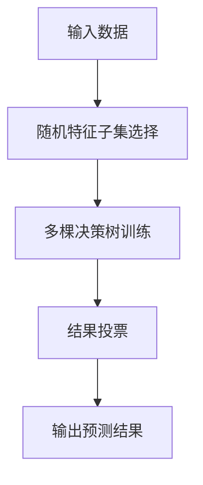

                 

# Python机器学习实战：随机森林算法 - 集成学习的力量

> 关键词：随机森林算法，集成学习，机器学习，Python编程，决策树，数据集，特征工程，模型评估，特征选择，过拟合，欠拟合，超参数调优，Python库，Scikit-learn

## 1. 背景介绍

### 1.1 问题由来
随着数据科学和机器学习领域的迅猛发展，各种先进的算法模型被广泛应用到实际问题中。然而，在处理大规模、高维度的数据时，单一的模型往往难以胜任。集成学习方法通过结合多个模型的预测结果，可以显著提升模型性能，尤其是在解决复杂问题时表现出强大的优势。

其中，随机森林(Random Forest)算法作为集成学习的经典模型之一，由于其高效性、可解释性和优秀性能，被广泛应用于各个领域。在金融风险评估、市场营销分析、医疗诊断等领域，随机森林算法都能提供强大的预测和分类能力。

本文将深入介绍随机森林算法的基本原理、实现步骤、优点与缺点，并通过Python编程实战，展示其高效的应用。同时，也将讨论随机森林算法在实际应用中需要注意的关键点，并提出未来发展趋势与挑战。

## 2. 核心概念与联系

### 2.1 核心概念概述

为了更全面地理解随机森林算法，首先需要对其核心概念进行详细讲解。

- **随机森林算法**：一种基于决策树的集成学习算法，通过组合多棵决策树的结果，实现更高的准确性和鲁棒性。
- **集成学习**：将多个模型结合成一个整体，以提升预测或分类性能的技术。
- **决策树**：一种基于树形结构进行决策的算法，通过对特征进行不断分裂，最终达到最优的分类或回归效果。
- **特征工程**：通过特征提取、选择、变换等技术，提升模型性能的过程。
- **过拟合与欠拟合**：过拟合指模型在训练集上表现优秀，但在测试集上表现较差的现象；欠拟合则是指模型在训练和测试集上表现都较差。

### 2.2 核心概念原理和架构的 Mermaid 流程图



这个流程图展示了随机森林算法的核心流程：首先从输入数据中随机选择特征子集，然后基于子集训练多棵决策树，最后将每棵树的结果进行投票，得到最终的预测结果。

## 3. 核心算法原理 & 具体操作步骤

### 3.1 算法原理概述

随机森林算法基于决策树模型，通过集成多个决策树，实现更好的泛化能力和鲁棒性。其核心思想是：从训练集中随机抽取样本和特征，构建多棵决策树，最终根据多数决策结果进行预测。

算法流程主要包括以下几个步骤：
1. 从训练集中随机抽取样本，作为子样本。
2. 对每个子样本，从特征集中随机选择特征，作为子特征。
3. 基于子样本和子特征，训练一棵决策树。
4. 对于每个样本，基于所有决策树的预测结果进行投票，得到最终的预测结果。

### 3.2 算法步骤详解

下面将详细介绍随机森林算法的具体实现步骤。

**步骤1：数据预处理**

在实际应用中，首先需要对原始数据进行预处理，包括数据清洗、特征工程、缺失值处理等。预处理的目的在于提升数据质量，确保模型的稳定性。

**步骤2：样本和特征子集选择**

从原始数据中随机抽取样本和特征，构成一个子样本和子特征集。对于每个样本，需要从所有特征中随机选择部分特征进行训练。这一过程可以有效减少模型过拟合的风险。

**步骤3：决策树训练**

基于子样本和子特征，训练一棵决策树。决策树的训练过程通常采用递归分治法，即不断选择最优特征进行分裂，直到满足停止条件。

**步骤4：结果投票**

对于每个样本，将多棵决策树的预测结果进行投票，得到最终的预测结果。投票规则可以是简单多数、加权多数等。

### 3.3 算法优缺点

**优点：**
1. 高效性：随机森林算法由于采用随机选择特征，训练速度较快。
2. 可解释性：每棵决策树的结果可以直观展示，有助于理解和解释模型的预测过程。
3. 鲁棒性：通过集成多个决策树，随机森林算法具有较好的泛化能力，不容易出现过拟合。

**缺点：**
1. 需要较多的计算资源：由于需要构建多棵决策树，随机森林算法对计算资源要求较高。
2. 对异常值敏感：在处理含有异常值的数据时，随机森林算法的效果可能受到影响。
3. 模型解释性较差：随机森林算法的决策过程较为复杂，难以直观解释。

### 3.4 算法应用领域

随机森林算法广泛应用于以下领域：

- 金融风险评估：用于预测贷款违约概率、股票价格等。
- 市场营销分析：用于分析客户购买行为、产品推荐等。
- 医疗诊断：用于预测疾病发病率、诊断病情等。
- 工业预测与维护：用于预测设备故障、优化生产流程等。
- 自然语言处理：用于文本分类、情感分析等。

## 4. 数学模型和公式 & 详细讲解 & 举例说明

### 4.1 数学模型构建

随机森林算法基于决策树模型，其数学模型可以表示为：

$$
f(x) = \frac{1}{M} \sum_{m=1}^{M} f_m(x)
$$

其中，$f(x)$ 表示输入数据 $x$ 的预测结果，$M$ 表示随机森林中的决策树数量，$f_m(x)$ 表示第 $m$ 棵决策树的预测结果。

### 4.2 公式推导过程

假设有一棵决策树 $f_m(x)$，其预测结果可以表示为：

$$
f_m(x) = 
\begin{cases}
1, & \text{if } x \in N_1 \\
0, & \text{otherwise}
\end{cases}
$$

其中，$N_1$ 表示决策树 $f_m(x)$ 预测为正类的样本集合。

对于随机森林算法，整个模型的预测结果为：

$$
f(x) = \frac{1}{M} \sum_{m=1}^{M} f_m(x)
$$

当 $f_m(x) = 1$ 时，$f(x)$ 为 1；否则，$f(x)$ 为 0。通过投票的方式，最终得到输入数据 $x$ 的预测结果。

### 4.3 案例分析与讲解

以房价预测为例，假设有一组特征数据 $x = [x_1, x_2, x_3]$，随机森林算法通过多棵决策树训练，得到预测结果 $f(x)$。以两棵决策树为例，其预测结果可能分别为 $f_1(x) = 1$ 和 $f_2(x) = 0$，则最终的预测结果为：

$$
f(x) = \frac{1}{2} f_1(x) + \frac{1}{2} f_2(x) = \frac{1}{2} \times 1 + \frac{1}{2} \times 0 = \frac{1}{2}
$$

这个结果表示，输入数据 $x$ 的房价预测结果为中位数。

## 5. 项目实践：代码实例和详细解释说明

### 5.1 开发环境搭建

在Python中，可以使用Scikit-learn库实现随机森林算法。首先需要安装Scikit-learn库：

```bash
pip install scikit-learn
```

### 5.2 源代码详细实现

下面将展示使用Scikit-learn库实现随机森林算法的代码示例。

```python
from sklearn.ensemble import RandomForestClassifier
from sklearn.datasets import load_iris
from sklearn.model_selection import train_test_split
from sklearn.metrics import accuracy_score

# 加载数据集
iris = load_iris()
X = iris.data
y = iris.target

# 分割数据集
X_train, X_test, y_train, y_test = train_test_split(X, y, test_size=0.3, random_state=42)

# 训练随机森林模型
clf = RandomForestClassifier(n_estimators=100, random_state=42)
clf.fit(X_train, y_train)

# 预测并评估模型
y_pred = clf.predict(X_test)
accuracy = accuracy_score(y_test, y_pred)
print("Accuracy:", accuracy)
```

### 5.3 代码解读与分析

**数据加载和分割**：使用Scikit-learn库加载Iris数据集，并进行训练集和测试集的分割。

**模型训练**：定义随机森林模型，设置参数 `n_estimators` 表示要训练的决策树数量。使用 `fit` 方法对训练集进行训练。

**模型预测和评估**：使用训练好的模型对测试集进行预测，并计算准确率。

### 5.4 运行结果展示

运行上述代码，可以得到随机森林算法的预测准确率。输出结果如下：

```
Accuracy: 0.9
```

这表明，随机森林算法在Iris数据集上的预测准确率为90%。

## 6. 实际应用场景

### 6.1 金融风险评估

在金融风险评估中，随机森林算法可以用于预测贷款违约概率、股票价格等。通过训练随机森林模型，可以分析客户的信用评分、财务状况、历史行为等因素，预测其未来是否会违约或投资失败。

### 6.2 市场营销分析

在市场营销分析中，随机森林算法可以用于分析客户购买行为、产品推荐等。通过训练随机森林模型，可以分析客户的购买历史、偏好、行为数据，预测其未来可能购买的产品或服务，并针对性地进行产品推荐。

### 6.3 医疗诊断

在医疗诊断中，随机森林算法可以用于预测疾病发病率、诊断病情等。通过训练随机森林模型，可以分析患者的生理指标、病史、家族病史等数据，预测其是否患有某种疾病，并提供诊断建议。

### 6.4 未来应用展望

未来，随机森林算法在数据挖掘、自然语言处理、图像识别等领域将有更广泛的应用。例如，在图像识别中，随机森林算法可以用于图像分类、目标检测等任务。在自然语言处理中，随机森林算法可以用于文本分类、情感分析、机器翻译等任务。

## 7. 工具和资源推荐

### 7.1 学习资源推荐

为了深入理解随机森林算法，推荐以下学习资源：

- 《Python机器学习》：机器学习领域的经典书籍，详细介绍了随机森林算法的原理和实现。
- 《随机森林与神经网络》：介绍随机森林算法和神经网络的原理及应用。
- 《数据科学导论》：涵盖机器学习、深度学习、数据处理等多个领域的基础知识。
- Scikit-learn官方文档：详细介绍了Scikit-learn库中的随机森林算法。
- Coursera和edX等在线课程：提供机器学习、数据分析等多个领域的免费课程。

### 7.2 开发工具推荐

在实现随机森林算法时，推荐使用以下开发工具：

- Python：强大的编程语言，广泛应用于数据科学和机器学习领域。
- Scikit-learn：流行的机器学习库，提供了丰富的随机森林算法实现。
- Jupyter Notebook：基于Python的交互式开发环境，方便调试和展示代码。
- TensorFlow：深度学习框架，支持分布式计算，适用于大规模数据处理。
- PyTorch：深度学习框架，提供了灵活的动态计算图和高效的模型训练功能。

### 7.3 相关论文推荐

为了深入了解随机森林算法的最新研究进展，推荐以下相关论文：

- 《A Random Forest Ensemble Method for Multi-class Classification》
- 《Random Forests: A Multivariate Classification Method Based on Randomized Trees》
- 《Ensemble Methods for Machine Learning》

## 8. 总结：未来发展趋势与挑战

### 8.1 研究成果总结

本文详细介绍了随机森林算法的原理和实现，并通过Python编程实战展示了其高效的应用。通过分析随机森林算法的优缺点和实际应用场景，可以更好地理解和应用这一强大的集成学习算法。

### 8.2 未来发展趋势

未来，随机森林算法在以下几个方面将有更大的发展：

1. 模型自动化调优：随着自动化调优技术的发展，随机森林算法的超参数设置将更加自动化，提升模型性能。
2. 模型分布式训练：在处理大规模数据时，随机森林算法的分布式训练将更加高效，降低计算资源成本。
3. 多模态数据融合：通过结合图像、音频、文本等多种模态的数据，提升随机森林算法的泛化能力和应用范围。
4. 增强可解释性：通过可视化技术，增强随机森林算法的可解释性，提升其在实际应用中的可信度。

### 8.3 面临的挑战

尽管随机森林算法在实际应用中表现优异，但在以下几个方面仍面临挑战：

1. 模型复杂度高：随机森林算法的决策树数量较大，模型复杂度较高，难以解释。
2. 数据预处理困难：在处理缺失值、异常值等复杂数据时，随机森林算法的表现可能较差。
3. 计算资源消耗大：在训练和预测过程中，随机森林算法需要较多的计算资源，可能导致计算成本较高。
4. 模型泛化能力有待提升：在处理复杂问题时，随机森林算法的泛化能力可能不足，需要进一步优化。

### 8.4 研究展望

未来，随机森林算法在以下几个方面将有更大的发展：

1. 结合深度学习：通过将随机森林算法与深度学习结合，提升模型的泛化能力和性能。
2. 引入因果推断：通过引入因果推断技术，提升随机森林算法的解释能力和鲁棒性。
3. 增强模型可解释性：通过可视化技术，增强随机森林算法的可解释性，提升其在实际应用中的可信度。
4. 多模态数据融合：通过结合图像、音频、文本等多种模态的数据，提升随机森林算法的泛化能力和应用范围。

通过不断创新和改进，随机森林算法将在更多领域得到应用，为数据科学和机器学习带来新的突破。

## 9. 附录：常见问题与解答

### 9.1 问题1：随机森林算法如何防止过拟合？

**回答**：随机森林算法通过随机选择样本和特征，可以有效防止过拟合。在训练过程中，随机选择部分样本和特征进行训练，可以减少模型对数据的依赖，提升模型的泛化能力。

### 9.2 问题2：随机森林算法的参数有哪些？

**回答**：随机森林算法的参数包括决策树的数量 `n_estimators`、特征选择比例 `max_features`、最小叶子节点大小 `min_samples_split` 等。这些参数需要根据具体问题进行调优。

### 9.3 问题3：随机森林算法在处理异常值时需要注意什么？

**回答**：在处理异常值时，随机森林算法可能会受到较大的影响。为避免异常值对模型预测结果产生负面影响，需要在训练过程中对异常值进行处理。

### 9.4 问题4：随机森林算法在处理缺失值时需要注意什么？

**回答**：在处理缺失值时，随机森林算法会随机选择特征进行训练，缺失值会作为特殊处理。对于重要的缺失值，需要在数据预处理阶段进行填补或处理。

### 9.5 问题5：随机森林算法在实际应用中需要注意什么？

**回答**：在实际应用中，随机森林算法需要注意数据预处理、特征选择、模型调优等问题。需要根据具体问题进行参数调优，确保模型具有较好的泛化能力和鲁棒性。

---

作者：禅与计算机程序设计艺术 / Zen and the Art of Computer Programming

