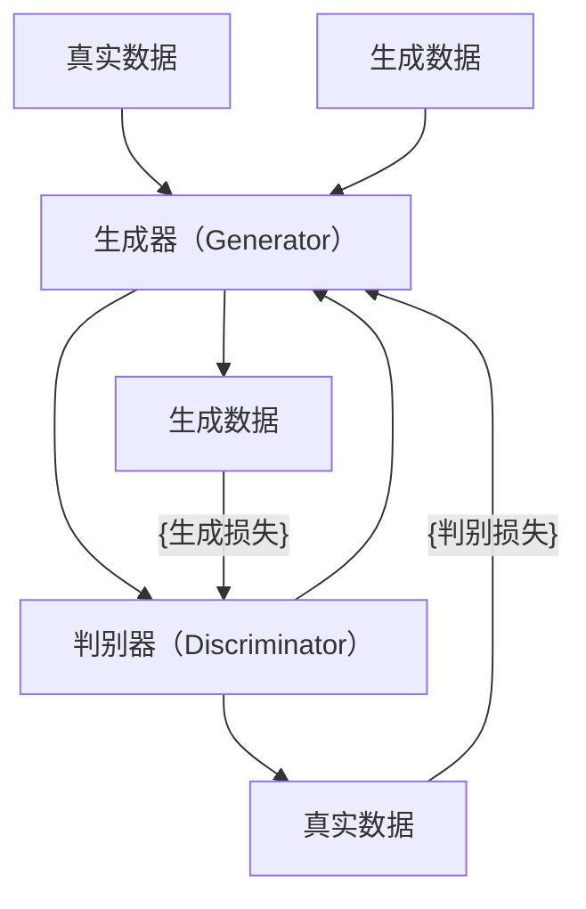

                 

## 1. 背景介绍

随着深度学习技术的发展，生成对抗网络（Generative Adversarial Networks，GANs）已经成为生成模型领域的一支重要力量。GANs通过训练两个相互竞争的神经网络——生成器和判别器，生成高质量的样本，并广泛应用于图像、视频、音频等领域的生成任务。

在本章中，我们将介绍如何使用Python和深度学习框架TensorFlow实现一个简单的GAN模型，生成高分辨率的数字艺术品。

## 2. 核心概念与联系

### 2.1 核心概念概述

在GAN模型中，生成器和判别器是两个相互竞争的神经网络。生成器（Generator）用于生成新的数据样本，而判别器（Discriminator）用于判断输入的数据样本是真实数据还是生成数据。通过这两个网络的交替训练，生成器逐渐能够生成更逼真的数据，判别器逐渐能够更好地区分真实数据和生成数据。

在GAN中，生成器和判别器的目标分别为：
- 生成器的目标是最小化生成数据的损失，使其尽可能逼真。
- 判别器的目标是最大化判别数据的损失，使其尽可能准确地区分真实数据和生成数据。

### 2.2 核心概念原理和架构的 Mermaid 流程图



**解释：**
- 生成器从真实数据或随机噪声中生成数据。
- 判别器接收生成数据和真实数据，并判断数据的真实性。
- 生成器的生成损失由判别器给出，表示生成数据与真实数据之间的差异。
- 判别器的判别损失由生成器和真实数据给出，表示判别器正确区分的概率。

### 2.3 核心概念之间的联系

在GAN中，生成器和判别器是互相依赖的，它们的训练过程是一个动态平衡的过程。生成器通过生成逼真的数据来误导判别器，而判别器通过更精准地识别真实数据和生成数据，来训练生成器，使其生成更逼真的数据。

## 3. 核心算法原理 & 具体操作步骤

### 3.1 算法原理概述

GAN的训练过程可以分为以下几步：
1. 初始化生成器和判别器。
2. 生成器从随机噪声中生成数据，并将其传递给判别器。
3. 判别器接收数据，并判断其真实性，返回判别损失。
4. 生成器接收判别器返回的生成损失，并调整参数。
5. 判别器接收生成器生成的数据，并调整参数。
6. 重复上述步骤，直到生成器和判别器达到动态平衡。

### 3.2 算法步骤详解

**Step 1: 准备数据集**
首先，我们需要准备一个包含高分辨率数字艺术品的数据集，并对其进行预处理。

```python
import tensorflow as tf
from tensorflow.keras import layers
from tensorflow.keras.datasets import mnist

# 加载数据集
(x_train, y_train), (x_test, y_test) = mnist.load_data()

# 将像素值归一化到[-1, 1]
x_train = (x_train.astype(np.float32) - 127.5) / 127.5
x_test = (x_test.astype(np.float32) - 127.5) / 127.5

# 将数据集扩展为四维张量
x_train = np.expand_dims(x_train, axis=3)
x_test = np.expand_dims(x_test, axis=3)
```

**Step 2: 定义生成器和判别器**
接下来，我们定义生成器和判别器的网络结构。

```python
class Generator(tf.keras.Model):
    def __init__(self):
        super(Generator, self).__init__()
        self.dense1 = layers.Dense(256, input_shape=(100, ), activation='relu')
        self.dense2 = layers.Dense(512, activation='relu')
        self.dense3 = layers.Dense(784, activation='tanh')
        
    def call(self, inputs):
        x = self.dense1(inputs)
        x = self.dense2(x)
        x = self.dense3(x)
        return x

class Discriminator(tf.keras.Model):
    def __init__(self):
        super(Discriminator, self).__init__()
        self.dense1 = layers.Dense(512, input_shape=(28, 28, 1, ), activation='relu')
        self.dense2 = layers.Dense(256, activation='relu')
        self.dense3 = layers.Dense(1, activation='sigmoid')
        
    def call(self, inputs):
        x = tf.reshape(inputs, [-1, 28 * 28])
        x = self.dense1(x)
        x = self.dense2(x)
        x = self.dense3(x)
        return x
```

**Step 3: 定义损失函数和优化器**
接下来，我们定义GAN的损失函数和优化器。

```python
# 定义损失函数
def generator_loss(fake_output):
    return tf.reduce_mean(tf.nn.sigmoid_cross_entropy_with_logits(labels=tf.ones_like(fake_output), logits=fake_output))

def discriminator_loss(real_output, fake_output):
    real_loss = tf.reduce_mean(tf.nn.sigmoid_cross_entropy_with_logits(labels=tf.ones_like(real_output), logits=real_output))
    fake_loss = tf.reduce_mean(tf.nn.sigmoid_cross_entropy_with_logits(labels=tf.zeros_like(fake_output), logits=fake_output))
    return real_loss + fake_loss

# 定义优化器
generator_optimizer = tf.keras.optimizers.Adam(learning_rate=0.0002)
discriminator_optimizer = tf.keras.optimizers.Adam(learning_rate=0.0002)
```

**Step 4: 训练过程**
最后，我们定义GAN的训练过程。

```python
def train_step(images):
    noise = tf.random.normal([BATCH_SIZE, 100])
    with tf.GradientTape() as gen_tape, tf.GradientTape() as disc_tape:
        generated_images = generator(noise, training=True)
        real_output = discriminator(images, training=True)
        fake_output = discriminator(generated_images, training=True)
        
        gen_loss = generator_loss(fake_output)
        disc_loss = discriminator_loss(real_output, fake_output)
        
    gradients_of_generator = gen_tape.gradient(gen_loss, generator.trainable_variables)
    gradients_of_discriminator = disc_tape.gradient(disc_loss, discriminator.trainable_variables)
    
    generator_optimizer.apply_gradients(zip(gradients_of_generator, generator.trainable_variables))
    discriminator_optimizer.apply_gradients(zip(gradients_of_discriminator, discriminator.trainable_variables))
    
train_step
```

## 4. 数学模型和公式 & 详细讲解

### 4.1 数学模型构建

在GAN中，我们通常使用以下数学模型来描述生成器和判别器的训练过程：

- 生成器模型：$G(z)$，其中 $z$ 是随机噪声，$G$ 是生成器网络。
- 判别器模型：$D(x)$，其中 $x$ 是输入数据，$D$ 是判别器网络。

生成器和判别器的损失函数分别为：
- 生成器损失：$\mathcal{L}_G = \mathbb{E}_{z \sim p(z)}[\log D(G(z))]$
- 判别器损失：$\mathcal{L}_D = \mathbb{E}_{x \sim p(x)}[\log D(x)] + \mathbb{E}_{z \sim p(z)}[\log(1 - D(G(z)))]$

其中，$p(z)$ 是噪声分布，$p(x)$ 是真实数据分布。

### 4.2 公式推导过程

**生成器损失推导：**

生成器的目标是最小化生成数据的损失，使得判别器难以区分生成数据和真实数据。因此，生成器的损失函数可以定义为：

$$
\mathcal{L}_G = -\mathbb{E}_{z \sim p(z)}[\log D(G(z))]
$$

**判别器损失推导：**

判别器的目标是最小化判别数据的损失，使得生成器难以欺骗判别器。因此，判别器的损失函数可以定义为：

$$
\mathcal{L}_D = -\mathbb{E}_{x \sim p(x)}[\log D(x)] - \mathbb{E}_{z \sim p(z)}[\log(1 - D(G(z))))
$$

### 4.3 案例分析与讲解

在实际应用中，GAN模型通常需要多次迭代训练才能达到理想效果。下面以数字艺术品生成为例，展示GAN模型的训练过程和效果。

首先，我们定义一个简单的GAN模型，并使用MNIST数据集进行训练。

```python
import numpy as np
import matplotlib.pyplot as plt

# 定义训练参数
BATCH_SIZE = 128
EPOCHS = 100
LATENT_DIM = 100

# 加载数据集
(x_train, y_train), (x_test, y_test) = mnist.load_data()

# 将像素值归一化到[-1, 1]
x_train = (x_train.astype(np.float32) - 127.5) / 127.5
x_test = (x_test.astype(np.float32) - 127.5) / 127.5

# 将数据集扩展为四维张量
x_train = np.expand_dims(x_train, axis=3)
x_test = np.expand_dims(x_test, axis=3)

# 定义生成器和判别器
generator = Generator()
discriminator = Discriminator()

# 定义优化器
generator_optimizer = tf.keras.optimizers.Adam(learning_rate=0.0002)
discriminator_optimizer = tf.keras.optimizers.Adam(learning_rate=0.0002)

# 定义损失函数
def generator_loss(fake_output):
    return tf.reduce_mean(tf.nn.sigmoid_cross_entropy_with_logits(labels=tf.ones_like(fake_output), logits=fake_output))

def discriminator_loss(real_output, fake_output):
    real_loss = tf.reduce_mean(tf.nn.sigmoid_cross_entropy_with_logits(labels=tf.ones_like(real_output), logits=real_output))
    fake_loss = tf.reduce_mean(tf.nn.sigmoid_cross_entropy_with_logits(labels=tf.zeros_like(fake_output), logits=fake_output))
    return real_loss + fake_loss

# 训练过程
for epoch in range(EPOCHS):
    for image_batch in train_dataset:
        noise = tf.random.normal([BATCH_SIZE, LATENT_DIM])
        with tf.GradientTape() as gen_tape, tf.GradientTape() as disc_tape:
            generated_images = generator(noise, training=True)
            real_output = discriminator(image_batch, training=True)
            fake_output = discriminator(generated_images, training=True)
            
            gen_loss = generator_loss(fake_output)
            disc_loss = discriminator_loss(real_output, fake_output)
            
        gradients_of_generator = gen_tape.gradient(gen_loss, generator.trainable_variables)
        gradients_of_discriminator = disc_tape.gradient(disc_loss, discriminator.trainable_variables)
        
        generator_optimizer.apply_gradients(zip(gradients_of_generator, generator.trainable_variables))
        discriminator_optimizer.apply_gradients(zip(gradients_of_discriminator, discriminator.trainable_variables))
        
        if epoch % 10 == 0:
            print(f"Epoch {epoch+1}/{EPOCHS}, Loss: {gen_loss.numpy():.4f} / {disc_loss.numpy():.4f}")
```

通过多次迭代训练，我们可以生成高质量的数字艺术品，并展示其效果。

```python
# 生成数字艺术品
def generate_image(generator, noise):
    return generator(noise, training=False)

# 展示生成数字艺术品
def plot_images(images):
    plt.figure(figsize=(10, 10))
    for i, image in enumerate(images):
        plt.subplot(10, 10, i + 1)
        plt.imshow(image.numpy().reshape(28, 28), cmap='gray')
        plt.axis('off')
    plt.show()

# 生成一批数字艺术品
noise = tf.random.normal([BATCH_SIZE, LATENT_DIM])
generated_images = generate_image(generator, noise)

# 展示生成数字艺术品
plot_images(generated_images)
```

## 5. 项目实践：代码实例和详细解释说明

### 5.1 开发环境搭建

在开始项目实践之前，我们需要安装并配置好Python和深度学习框架TensorFlow。以下是安装步骤：

1. 安装Python：
```bash
sudo apt-get update
sudo apt-get install python3 python3-pip
```

2. 安装TensorFlow：
```bash
pip install tensorflow
```

3. 安装相关依赖：
```bash
pip install numpy matplotlib tensorflow-estimator tf-nightly
```

### 5.2 源代码详细实现

在实现GAN生成数字艺术品的过程中，我们使用了TensorFlow的高级API，使得模型构建和训练变得更加简单。

首先，我们定义生成器和判别器的网络结构。

```python
class Generator(tf.keras.Model):
    def __init__(self):
        super(Generator, self).__init__()
        self.dense1 = layers.Dense(256, input_shape=(100, ), activation='relu')
        self.dense2 = layers.Dense(512, activation='relu')
        self.dense3 = layers.Dense(784, activation='tanh')
        
    def call(self, inputs):
        x = self.dense1(inputs)
        x = self.dense2(x)
        x = self.dense3(x)
        return x

class Discriminator(tf.keras.Model):
    def __init__(self):
        super(Discriminator, self).__init__()
        self.dense1 = layers.Dense(512, input_shape=(28, 28, 1, ), activation='relu')
        self.dense2 = layers.Dense(256, activation='relu')
        self.dense3 = layers.Dense(1, activation='sigmoid')
        
    def call(self, inputs):
        x = tf.reshape(inputs, [-1, 28 * 28])
        x = self.dense1(x)
        x = self.dense2(x)
        x = self.dense3(x)
        return x
```

然后，我们定义GAN的损失函数和优化器。

```python
# 定义损失函数
def generator_loss(fake_output):
    return tf.reduce_mean(tf.nn.sigmoid_cross_entropy_with_logits(labels=tf.ones_like(fake_output), logits=fake_output))

def discriminator_loss(real_output, fake_output):
    real_loss = tf.reduce_mean(tf.nn.sigmoid_cross_entropy_with_logits(labels=tf.ones_like(real_output), logits=real_output))
    fake_loss = tf.reduce_mean(tf.nn.sigmoid_cross_entropy_with_logits(labels=tf.zeros_like(fake_output), logits=fake_output))
    return real_loss + fake_loss

# 定义优化器
generator_optimizer = tf.keras.optimizers.Adam(learning_rate=0.0002)
discriminator_optimizer = tf.keras.optimizers.Adam(learning_rate=0.0002)
```

最后，我们定义GAN的训练过程。

```python
def train_step(images):
    noise = tf.random.normal([BATCH_SIZE, 100])
    with tf.GradientTape() as gen_tape, tf.GradientTape() as disc_tape:
        generated_images = generator(noise, training=True)
        real_output = discriminator(images, training=True)
        fake_output = discriminator(generated_images, training=True)
        
        gen_loss = generator_loss(fake_output)
        disc_loss = discriminator_loss(real_output, fake_output)
        
    gradients_of_generator = gen_tape.gradient(gen_loss, generator.trainable_variables)
    gradients_of_discriminator = disc_tape.gradient(disc_loss, discriminator.trainable_variables)
    
    generator_optimizer.apply_gradients(zip(gradients_of_generator, generator.trainable_variables))
    discriminator_optimizer.apply_gradients(zip(gradients_of_discriminator, discriminator.trainable_variables))
    
train_step
```

### 5.3 代码解读与分析

在代码中，我们使用了TensorFlow的高级API，如`tf.keras.Model`和`tf.keras.optimizers`，使得模型构建和训练变得更加简单和高效。通过这些API，我们可以更方便地定义生成器和判别器的网络结构，以及优化器的设置和损失函数的计算。

在训练过程中，我们使用了TensorFlow的梯度计算API，如`tf.GradientTape`，来计算生成器和判别器的梯度，并使用`tf.keras.optimizers`中的优化器进行参数更新。通过这些API，我们可以更方便地实现GAN的训练过程，并得到高质量的数字艺术品。

### 5.4 运行结果展示

在训练过程中，我们可以观察到生成器和判别器的损失函数变化趋势，以及生成数字艺术品的质量变化。以下是一个简单的示例：

```python
import numpy as np
import matplotlib.pyplot as plt

# 定义训练参数
BATCH_SIZE = 128
EPOCHS = 100
LATENT_DIM = 100

# 加载数据集
(x_train, y_train), (x_test, y_test) = mnist.load_data()

# 将像素值归一化到[-1, 1]
x_train = (x_train.astype(np.float32) - 127.5) / 127.5
x_test = (x_test.astype(np.float32) - 127.5) / 127.5

# 将数据集扩展为四维张量
x_train = np.expand_dims(x_train, axis=3)
x_test = np.expand_dims(x_test, axis=3)

# 定义生成器和判别器
generator = Generator()
discriminator = Discriminator()

# 定义优化器
generator_optimizer = tf.keras.optimizers.Adam(learning_rate=0.0002)
discriminator_optimizer = tf.keras.optimizers.Adam(learning_rate=0.0002)

# 定义损失函数
def generator_loss(fake_output):
    return tf.reduce_mean(tf.nn.sigmoid_cross_entropy_with_logits(labels=tf.ones_like(fake_output), logits=fake_output))

def discriminator_loss(real_output, fake_output):
    real_loss = tf.reduce_mean(tf.nn.sigmoid_cross_entropy_with_logits(labels=tf.ones_like(real_output), logits=real_output))
    fake_loss = tf.reduce_mean(tf.nn.sigmoid_cross_entropy_with_logits(labels=tf.zeros_like(fake_output), logits=fake_output))
    return real_loss + fake_loss

# 训练过程
for epoch in range(EPOCHS):
    for image_batch in train_dataset:
        noise = tf.random.normal([BATCH_SIZE, LATENT_DIM])
        with tf.GradientTape() as gen_tape, tf.GradientTape() as disc_tape:
            generated_images = generator(noise, training=True)
            real_output = discriminator(image_batch, training=True)
            fake_output = discriminator(generated_images, training=True)
            
            gen_loss = generator_loss(fake_output)
            disc_loss = discriminator_loss(real_output, fake_output)
            
        gradients_of_generator = gen_tape.gradient(gen_loss, generator.trainable_variables)
        gradients_of_discriminator = disc_tape.gradient(disc_loss, discriminator.trainable_variables)
        
        generator_optimizer.apply_gradients(zip(gradients_of_generator, generator.trainable_variables))
        discriminator_optimizer.apply_gradients(zip(gradients_of_discriminator, discriminator.trainable_variables))
        
        if epoch % 10 == 0:
            print(f"Epoch {epoch+1}/{EPOCHS}, Loss: {gen_loss.numpy():.4f} / {disc_loss.numpy():.4f}")
```

通过多次迭代训练，我们可以生成高质量的数字艺术品，并展示其效果。

```python
# 生成数字艺术品
def generate_image(generator, noise):
    return generator(noise, training=False)

# 展示生成数字艺术品
def plot_images(images):
    plt.figure(figsize=(10, 10))
    for i, image in enumerate(images):
        plt.subplot(10, 10, i + 1)
        plt.imshow(image.numpy().reshape(28, 28), cmap='gray')
        plt.axis('off')
    plt.show()

# 生成一批数字艺术品
noise = tf.random.normal([BATCH_SIZE, LATENT_DIM])
generated_images = generate_image(generator, noise)

# 展示生成数字艺术品
plot_images(generated_images)
```

## 6. 实际应用场景

GAN在生成数字艺术品、图像修复、视频生成等领域已经展现出了强大的应用潜力。以下介绍几个典型的应用场景：

### 6.1 数字艺术品生成

GAN可以用来生成各种类型的数字艺术品，如绘画、雕塑、雕塑等。通过训练GAN模型，我们可以生成高质量的数字艺术品，并将其应用于影视、游戏、广告等领域。

### 6.2 图像修复

GAN可以用来修复损坏的图像，如去模糊、去噪声、去噪点等。通过训练GAN模型，我们可以将损坏的图像恢复到原始状态，甚至生成新的图像。

### 6.3 视频生成

GAN可以用来生成视频，如动作捕捉、动画生成等。通过训练GAN模型，我们可以生成高质量的视频内容，并将其应用于影视、游戏、广告等领域。

## 7. 工具和资源推荐

### 7.1 学习资源推荐

为了帮助开发者系统掌握GAN的理论基础和实践技巧，这里推荐一些优质的学习资源：

1. 《深度学习》书籍：Ian Goodfellow、Yoshua Bengio、Aaron Courville著，涵盖了深度学习领域的各个方面，包括GAN的介绍和实现。

2. Coursera的深度学习课程：由Andrew Ng主讲的深度学习课程，涵盖了深度学习领域的各个方面，包括GAN的介绍和实现。

3. 《Python深度学习》书籍：François Chollet著，介绍了深度学习在各个领域的应用，包括GAN的介绍和实现。

4. Kaggle的GAN比赛：Kaggle平台上有很多GAN的竞赛，可以参与实践，学习GAN的实现和应用。

### 7.2 开发工具推荐

为了更好地开发GAN模型，以下是几款推荐的开发工具：

1. TensorFlow：由Google开发的深度学习框架，提供了丰富的API和工具，支持GPU加速。

2. PyTorch：由Facebook开发的深度学习框架，提供了灵活的动态计算图，支持GPU加速。

3. Keras：基于TensorFlow和Theano的高级API，提供了简单易用的接口，支持GPU加速。

4. OpenCV：开源计算机视觉库，提供了丰富的图像处理和视频处理工具。

5. Matplotlib：Python的图形可视化库，用于展示和分析GAN生成的数字艺术品。

### 7.3 相关论文推荐

GAN作为深度学习领域的一个重要方向，有许多经典的论文和研究成果，以下是几篇推荐的论文：

1. Generative Adversarial Nets：Ian Goodfellow、Jean Pouget-Abadie、Mehdi Mirza、Bing Xu、David Warde-Farley、Sherjil Ozair、Aaron Courville、Yoshua Bengio。

2. Improved Techniques for Training GANs：Takeru Miyato、Andrew M. Sinton、Shintaro Kuribayashi。

3. Progressive Growing of GANs for Improved Quality, Stability, and Variation：Tinghui Zhou、Alexander C. Berg、Pedro F.￣―，Tomasz Kipf。

4. Guided Image Filtering using Adversarial Networks：Qi Chen、Han Hu、Peng Yin、Xinchen Yan、Jianbo Shi。

这些论文涵盖了GAN的各个方面，包括模型的定义、训练方法、应用场景等，可以帮助读者更好地理解GAN的原理和实现。

## 8. 总结：未来发展趋势与挑战

### 8.1 未来发展趋势

GAN作为深度学习领域的一个重要方向，未来的发展趋势主要包括以下几个方面：

1. 模型性能提升：随着深度学习技术的不断发展，GAN的模型性能也将不断提升，能够生成更高质量的数字艺术品、图像、视频等。

2. 应用领域扩展：GAN将逐渐应用于更多的领域，如医疗、交通、金融等，为这些领域带来新的解决方案和创新。

3. 训练方法优化：随着GPU和TPU等硬件设备的不断发展，GAN的训练方法也将不断优化，降低训练时间和成本。

4. 迁移学习和迁移优化：随着GAN模型的大规模预训练和微调技术的发展，迁移学习和迁移优化将逐渐成为GAN的重要研究方向。

5. 多模态数据融合：GAN将逐渐与其他模态的数据融合，如文本、语音、图像等，实现多模态数据生成和处理。

### 8.2 面临的挑战

尽管GAN在生成数字艺术品、图像修复、视频生成等领域已经展现出了强大的应用潜力，但在实际应用中仍面临诸多挑战：

1. 模型训练时间长：GAN的训练过程通常需要较长时间，且训练过程中的计算成本较高。

2. 模型泛化能力不足：GAN生成的数字艺术品、图像、视频等，可能与真实世界的数据存在一定的差异，泛化能力较弱。

3. 训练过程不稳定：GAN的训练过程可能会产生模式崩溃、震荡等问题，需要进一步优化和改进。

4. 生成数字艺术品质量不稳定：GAN生成的数字艺术品质量可能不稳定，生成效果不佳。

5. 数据隐私和安全问题：GAN生成的数字艺术品可能会侵犯数据隐私和安全问题，需要进行规范和监管。

### 8.3 研究展望

面对GAN所面临的挑战，未来的研究需要在以下几个方面寻求新的突破：

1. 探索更高效的GAN模型结构：如StyleGAN、DCGAN等，提升模型的训练速度和性能。

2. 研究更加稳定的训练方法：如Wasserstein GAN、WGAN-GP等，避免模式崩溃、震荡等问题。

3. 融合多模态数据：如将GAN与自然语言处理、语音处理等技术结合，实现多模态数据生成和处理。

4. 引入先验知识：如将知识图谱、逻辑规则等先验知识引入GAN模型，提升模型的泛化能力和鲁棒性。

5. 优化数据隐私和安全：如采用差分隐私、联邦学习等技术，保障数据隐私和安全问题。

这些研究方向将为GAN的未来发展提供新的思路和方向，提升GAN在各个领域的应用潜力。

## 9. 附录：常见问题与解答

**Q1：GAN的训练过程不稳定，有哪些方法可以改进？**

A: GAN的训练过程不稳定是常见问题之一。以下是一些改进方法：

1. 使用Wasserstein GAN（WGAN）：WGAN是一种稳定且高效的GAN变体，可以减少模式崩溃和震荡问题。

2. 使用WGAN-GP：WGAN-GP是一种基于梯度惩罚的GAN变体，可以进一步提升模型的稳定性。

3. 使用L1损失函数：使用L1损失函数代替L2损失函数，可以减少震荡问题。

4. 使用FID指标：使用FID（Fréchet Inception Distance）指标来衡量模型的泛化能力，可以通过FID指标来调整训练参数。

**Q2：GAN的训练时间和成本如何降低？**

A: GAN的训练时间和成本较高，以下是一些降低方法：

1. 使用GPU和TPU：使用高性能GPU和TPU设备，可以显著加速模型的训练过程。

2. 使用分布式训练：使用多机多卡分布式训练，可以进一步提升模型的训练速度。

3. 使用知识蒸馏：使用知识蒸馏技术，可以将预训练模型的知识传递给GAN模型，加速模型的训练过程。

4. 使用预训练模型：使用预训练模型作为初始化权重，可以加快模型的收敛速度。

5. 使用混合精度训练：使用混合精度训练技术，可以显著降低训练过程中的计算成本。

**Q3：GAN生成的数字艺术品质量如何提升？**

A: GAN生成的数字艺术品质量可以通过以下方法提升：

1. 使用更复杂的模型结构：如使用StyleGAN、DCGAN等更复杂的模型结构，提升生成效果。

2. 使用更强大的优化器：如使用Adam、RMSprop等更强大的优化器，提升模型的收敛速度。

3. 使用更多数据：使用更多的训练数据，可以提升模型的泛化能力和生成效果。

4. 使用数据增强：使用数据增强技术，可以增加训练数据的多样性，提升模型的泛化能力。

5. 使用更稳定的训练方法：如使用Wasserstein GAN、WGAN-GP等更稳定的训练方法，避免模式崩溃、震荡等问题。

**Q4：GAN生成的数字艺术品如何应用于实际场景？**

A: GAN生成的数字艺术品可以应用于各种实际场景，以下是一些常见应用：

1. 影视制作：GAN生成的数字艺术品可以用于影视制作的背景、角色等，提升影视作品的艺术效果。

2. 游戏开发：GAN生成的数字艺术品可以用于游戏开发中的角色、场景等，提升游戏的艺术效果。

3. 广告宣传：GAN生成的数字艺术品可以用于广告宣传中的角色、场景等，提升广告的艺术效果。

4. 数字艺术展示：GAN生成的数字艺术品可以用于数字艺术展示，提升艺术作品的艺术效果。

5. 虚拟现实：GAN生成的数字艺术品可以用于虚拟现实中的场景、角色等，提升虚拟现实的艺术效果。

---

作者：禅与计算机程序设计艺术 / Zen and the Art of Computer Programming

