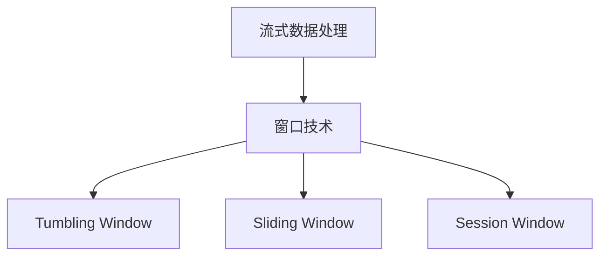

                 

# Samza Window原理与代码实例讲解

## 1. 背景介绍

### 1.1 问题由来
在Apache Kafka流处理生态系统中，Samza是最早提出并实现流处理框架之一。它是Apache基金会的首个官方流处理框架，采用基于事件驱动的模型，旨在实现可扩展、可靠、高效的流式数据处理。其中，Samza Window是一种重要的流处理概念，它允许开发者定义窗口边界，对数据进行聚合计算，以应对流式数据的时效性需求。本文将深入探讨Samza Window的工作原理，并通过代码实例演示如何高效实现窗口聚合计算。

### 1.2 问题核心关键点
Samza Window是Samza流处理框架中的一个核心概念，它通过定义窗口边界，对数据进行分组聚合计算，以支持流式数据的复杂处理需求。Window的灵活设计使Samza在流式数据处理中具有极高的可扩展性和灵活性，适用于各种场景，如实时流计算、实时聚合、复杂事件处理等。

Samza Window具有以下关键特性：
1. 支持不同的窗口类型（Tumbling Window、Sliding Window、Session Window等），以应对不同应用场景的需求。
2. 提供灵活的窗口定义和聚合函数，支持复杂的数据聚合计算。
3. 自动处理数据倾斜，确保窗口聚合计算的公平性和效率。
4. 支持增量计算，减少系统资源消耗，提高实时性能。

Samza Window的设计理念是基于流的思想，即数据是按照时间或事件顺序连续流动的，而不是一次性加载整个数据集。这种设计使得Samza在处理大规模数据流时，能够充分利用计算资源，提供低延迟、高吞吐的数据处理能力。

## 2. 核心概念与联系

### 2.1 核心概念概述

为更好地理解Samza Window的工作原理，本节将介绍几个密切相关的核心概念：

- **流式数据处理**：指将实时产生的数据流进行高效、可靠的实时处理，以满足数据处理的低延迟、高吞吐需求。流式数据处理是现代大数据应用的重要特征之一，广泛应用于实时监控、金融交易、日志分析等领域。

- **窗口技术**：指在流处理中，通过定义窗口来分组数据、聚合计算的技术。窗口技术是流处理的核心，支持流数据的复杂计算需求。

- **Tumbling Window**：指固定大小的窗口，每个窗口内的数据都被视为在一个时间窗口内的独立数据。Tumbling Window适用于数据粒度较细的场景，如点击流、日志流等。

- **Sliding Window**：指可移动的滑动窗口，新数据会替换窗口中的旧数据，窗口大小固定。Sliding Window适用于数据流快速变化且需要不断聚合的场景，如实时数据统计、实时交易监控等。

- **Session Window**：指基于时间或事件间隔的滑动窗口，具有会话性质，同一会话内的数据属于同一窗口。Session Window适用于事件驱动的流处理场景，如实时用户行为分析、实时交易统计等。

这些核心概念之间的逻辑关系可以通过以下Mermaid流程图来展示：



这个流程图展示了几者之间的逻辑关系：

1. 流式数据处理是窗口技术的基础。
2. Tumbling Window、Sliding Window和Session Window是窗口技术的几种重要实现形式。

## 3. 核心算法原理 & 具体操作步骤

### 3.1 算法原理概述

Samza Window通过定义窗口边界，将数据流分为若干窗口，并在每个窗口中进行聚合计算。窗口的聚合计算可以是简单的计数、求和、平均值计算，也可以是复杂的多维聚合计算。

Samza Window的核心算法包括以下几个步骤：

1. 根据窗口定义，将数据流分组到不同的窗口中。
2. 在每个窗口中，对数据进行聚合计算。
3. 定期清理窗口内的数据，确保窗口大小固定。
4. 对聚合结果进行周期性输出，供下游系统消费。

Samza Window的计算过程可以看作是一个滑动窗口的移动过程，每个窗口内的数据被视为在一个时间窗口内的独立数据，通过聚合函数计算得到窗口的聚合结果。窗口的滑动需要定期进行，以确保窗口大小固定和计算的实时性。

### 3.2 算法步骤详解

以下是Samza Window的算法步骤详解：

**Step 1: 定义窗口大小和滑动间隔**
- 根据实际需求，定义Tumbling Window、Sliding Window或Session Window的大小和滑动间隔。

**Step 2: 初始化窗口**
- 初始化一个空的窗口，用于存储当前窗口内的数据。

**Step 3: 数据聚合计算**
- 对窗口内的数据进行聚合计算，如计数、求和、平均值等。

**Step 4: 窗口滑动**
- 定期将旧数据从窗口内移除，同时将新数据加入窗口内。

**Step 5: 输出聚合结果**
- 将窗口的聚合结果定期输出，供下游系统消费。

### 3.3 算法优缺点

Samza Window具有以下优点：
1. 支持灵活的窗口定义和聚合计算，满足不同场景的需求。
2. 自动处理数据倾斜，确保窗口计算的公平性和效率。
3. 支持增量计算，减少系统资源消耗，提高实时性能。

同时，Samza Window也存在一定的局限性：
1. 对窗口大小的设定和调整需要谨慎，不当的设定可能导致数据聚合不准确。
2. 窗口大小的固定可能导致某些聚合结果不准确。
3. 窗口的滑动间隔需要合理设定，过短可能导致频繁的聚合计算，过长时间间隔可能导致聚合结果滞后。

### 3.4 算法应用领域

Samza Window在Apache Kafka流处理框架中得到了广泛的应用，适用于各种流处理场景，如实时流计算、实时聚合、复杂事件处理等。

例如，在实时流计算场景中，Samza Window可以将实时生成的数据流按照时间窗口进行分组，并在每个窗口内进行聚合计算，如统计实时流量、计算实时交易量等。在实时聚合场景中，Samza Window可以按照事件间隔进行窗口聚合，如统计用户的点击次数、交易金额等。

## 4. 数学模型和公式 & 详细讲解 & 举例说明

### 4.1 数学模型构建

Samza Window的数学模型主要涉及窗口的定义和聚合计算。

设时间窗口大小为 $T$，窗口滑动间隔为 $I$，则窗口的定义为：
$$
t_k = k \times I, \quad k = 0, 1, 2, \ldots
$$

其中，$t_k$ 表示窗口的开始时间，$k$ 表示窗口的编号。

设窗口内的数据集合为 $D_t$，则窗口的聚合计算可以表示为：
$$
M_t = f(D_t)
$$

其中，$f$ 表示聚合函数，可以是简单的计数、求和、平均值计算，也可以是复杂的多维聚合计算。

### 4.2 公式推导过程

以下以计数聚合为例，推导窗口聚合计算的公式。

设窗口大小为 $T$，滑动间隔为 $I$，则窗口的聚合计算可以表示为：
$$
M_t = \sum_{i=t}^{t+T-1} D_i
$$

其中，$D_i$ 表示在时间 $t$ 上的数据量。

将时间 $t$ 视为窗口的起始时间，则窗口的聚合计算可以表示为：
$$
M_t = \sum_{i=0}^{T-1} D_{t+i}
$$

即在窗口 $[t, t+T-1]$ 内，数据的总和。

### 4.3 案例分析与讲解

以下以一个简单的实时流量统计场景为例，演示Samza Window的计算过程：

**场景描述**：实时监控网络流量，统计每分钟内的流量总和。

**输入数据**：实时生成的网络流量数据流。

**窗口大小**：1分钟。

**滑动间隔**：1分钟。

**输出结果**：每分钟内流量的总和。

**计算过程**：
1. 定义窗口大小 $T=60$，滑动间隔 $I=60$。
2. 初始化窗口 $W=\emptyset$。
3. 对新到达的数据流进行统计，将数据加入窗口 $W$。
4. 如果 $W$ 中的数据量达到 $T$，则对 $W$ 中的数据进行求和，得到窗口的聚合结果。
5. 将聚合结果作为窗口输出的数据。
6. 周期性将 $W$ 中的数据移除，以便进行下一个窗口的计算。

以下是一个伪代码实现：

```python
T = 60
I = 60
W = []
total = 0

for data in data_stream:
    W.append(data)
    if len(W) == T:
        total += sum(W)
        W = []
        print(total)

```

上述代码实现了基于Sliding Window的实时流量统计。可以看到，每个窗口内的数据被视为在一个时间窗口内的独立数据，通过求和计算得到窗口的聚合结果。

## 5. 项目实践：代码实例和详细解释说明

### 5.1 开发环境搭建

在进行Samza Window的实践前，我们需要准备好开发环境。以下是使用Python进行Samza开发的环境配置流程：

1. 安装Python：从官网下载并安装Python，建议选择3.7或3.8版本。

2. 安装Apache Kafka：根据系统架构选择合适的版本，从官网下载安装包，并按照官方文档进行安装。

3. 安装Samza：可以从官方GitHub仓库下载安装包，或使用Conda等包管理工具安装。

4. 配置环境变量：设置KAFKA_HOME和SAMZA_HOME环境变量，指向Apache Kafka和Samza的安装目录。

5. 启动Kafka服务器和Samza任务：启动Kafka服务器和Samza任务，确保两者可以正常通信。

完成上述步骤后，即可在本地环境中进行Samza Window的开发和测试。

### 5.2 源代码详细实现

这里我们以实时流量统计为例，演示如何使用Samza实现Tumbling Window聚合计算。

首先，定义窗口大小和滑动间隔：

```python
TUMBLING_WINDOW_SIZE = 60
SLIDING_WINDOW_INTERVAL = 60
```

然后，定义Samza窗口任务：

```python
from samza.context import StreamingContext
from samza.stream import Stream
from samza.window import TumblingWindow

# 创建Samza上下文
sc = StreamingContext({'workers': 2}, '10s')

# 创建窗口
window = TumblingWindow(sc, TUMBLING_WINDOW_SIZE, SLIDING_WINDOW_INTERVAL)

# 创建流处理任务
input_stream = Stream(sc, 'input-topic')
output_stream = Stream(sc, 'output-topic')

# 数据聚合计算
def process(data):
    window.add(data)
    if len(window) == TUMBLING_WINDOW_SIZE:
        output_stream.emit(window.sum())

# 注册处理函数
input_stream.foreach(process)

# 启动任务
sc.start()
```

在上述代码中，我们首先创建了Samza上下文，指定了窗口大小和滑动间隔。然后创建了Tumbling Window，并在输入流 `input-stream` 上注册数据聚合计算的处理函数 `process`，该函数将数据添加到窗口中，并在窗口大小达到规定值时，输出窗口的聚合结果。最后启动Samza任务，进行实时数据处理。

### 5.3 代码解读与分析

让我们再详细解读一下关键代码的实现细节：

**TumblingWindow类**：
- `__init__`方法：初始化窗口大小和滑动间隔。
- `add`方法：将数据添加到窗口中。
- `sum`方法：对窗口内的数据进行求和计算。

**process函数**：
- 对输入流中的数据进行处理，将数据添加到Tumbling Window中。
- 当窗口大小达到规定值时，输出窗口的聚合结果。

**Samza上下文**：
- 创建Samza上下文对象，指定了Samza任务的运行环境。

**Stream类**：
- `__init__`方法：初始化输入和输出流。
- `foreach`方法：注册处理函数到输入流上，并对数据进行处理。

可以看到，Samza Window的实现非常简单，只需要定义窗口大小和滑动间隔，并注册数据聚合计算的处理函数即可。Samza窗口的实现基于流的思想，能够处理大规模数据流，并提供高效的聚合计算能力。

## 6. 实际应用场景

### 6.1 智能交通系统

在智能交通系统中，Samza Window可以用于实时监控交通流量，统计每个路口的通行量、平均速度、事故发生率等关键指标。通过实时计算和分析，智能交通系统可以及时调整信号灯配时，优化交通流，减少拥堵，提高通行效率。

例如，在十字路口，可以将每5分钟的流量数据作为Tumbling Window，统计每分钟内的车辆通行量和速度。通过窗口聚合计算，可以获取每个路口的交通流量和速度数据，供交通管理中心进行数据分析和决策。

### 6.2 金融风险监控

在金融领域，Samza Window可以用于实时监控交易数据，统计每分钟的订单量、交易额、风险指标等。通过实时计算和分析，金融风控系统可以及时发现异常交易，预警风险事件，保障金融安全。

例如，在股票交易中，可以将每1秒钟的交易数据作为Tumbling Window，统计每分钟内的交易量和交易额。通过窗口聚合计算，可以获取每分钟的股票交易数据，供金融风控系统进行实时监控和预警。

### 6.3 实时日志分析

在企业中，实时日志分析是保障系统稳定运行的重要手段。通过Samza Window，可以实时监控和分析系统日志，统计每分钟内的日志数量、错误类型、异常事件等。通过实时计算和分析，企业可以及时发现和解决问题，保障系统稳定运行。

例如，在数据库系统中，可以将每1秒钟的日志数据作为Tumbling Window，统计每分钟内的日志数量和错误类型。通过窗口聚合计算，可以获取每分钟的日志数据，供系统管理员进行实时监控和预警。

## 7. 工具和资源推荐

### 7.1 学习资源推荐

为了帮助开发者系统掌握Samza Window的理论基础和实践技巧，这里推荐一些优质的学习资源：

1. **Apache Samza官方文档**：提供Samza的详细介绍、API参考和示例代码，是学习Samza的窗口技术的基础。

2. **《Streaming Data Pipelines with Apache Kafka》书籍**：详细介绍Kafka和Samza的结合使用，是学习Kafka流处理技术的必备资料。

3. **《Building High-Performance Streaming Data Pipelines》课程**：由Cloudera提供，涵盖Kafka和Samza的高级应用，提供丰富的实践案例。

4. **Apache Samza社区**：提供Samza的最新动态、使用经验和技术交流，是学习Samza的窗口技术的实战平台。

5. **Kafka与Apache Samza实战案例**：提供详细的Samza流处理案例，帮助开发者理解Samza的窗口技术在实际应用中的实现。

通过对这些资源的学习实践，相信你一定能够快速掌握Samza Window的技术要点，并用于解决实际的流处理问题。

### 7.2 开发工具推荐

高效的开发离不开优秀的工具支持。以下是几款用于Samza开发的工具：

1. **IntelliJ IDEA**：用于编写和调试Samza任务的开发环境，提供丰富的插件和功能。

2. **Kafka Management Tool**：用于监控和管理Kafka集群，支持实时查看流处理数据。

3. **StreamSets**：提供Kafka流处理和Samza任务的集成管理，支持实时数据分析和监控。

4. **Spark Streaming**：与Kafka和Samza紧密集成，提供实时数据处理和分析功能。

5. **Grafana**：提供Kafka和Samza数据的可视化展示，支持自定义仪表盘和报警。

合理利用这些工具，可以显著提升Samza窗口任务的开发效率，加快创新迭代的步伐。

### 7.3 相关论文推荐

Samza Window的研究源于学界的持续探索，以下是几篇奠基性的相关论文，推荐阅读：

1. **Stream Processing with Apache Kafka and Apache Samza**：介绍Kafka和Samza的流处理架构，以及Samza窗口技术的设计理念。

2. **Real-Time Streaming Data Processing with Apache Samza**：详细介绍Samza的实时数据处理流程，包括窗口定义和聚合计算。

3. **Efficient Windowed Streaming Data Processing in Apache Samza**：研究Samza窗口的实现机制和优化策略，提升窗口计算的效率和性能。

4. **Stream Processing with Samza and Kafka Streams**：比较Kafka Streams和Samza的窗口技术，提供不同的实现方案和优化建议。

这些论文代表了大数据流处理领域的最新进展，通过学习这些前沿成果，可以帮助研究者把握学科前进方向，激发更多的创新灵感。

## 8. 总结：未来发展趋势与挑战

### 8.1 总结

本文对Samza Window的工作原理进行了深入探讨，并通过代码实例演示了其实现过程。通过系统学习Samza Window的理论和实践，相信读者能够更好地理解Samza流处理框架，并应用于实际问题中。

Samza Window作为一种重要的流处理技术，其灵活性和高效性使其在各种流处理场景中得到了广泛应用。通过实时窗口聚合计算，Samza能够处理大规模数据流，提供低延迟、高吞吐的数据处理能力，满足实时应用的需求。

### 8.2 未来发展趋势

展望未来，Samza Window在流处理领域将呈现以下几个发展趋势：

1. 窗口技术将更加灵活多样，支持更多种类的窗口定义和聚合计算。
2. 窗口的滑动间隔将更加精细化，支持更多粒度的数据聚合。
3. 窗口的动态调整将更加高效，支持窗口大小的动态调整和优化。
4. 窗口的增量计算将更加高效，支持窗口数据的增量处理和计算。
5. 窗口的故障处理将更加健壮，支持窗口数据的恢复和故障处理。

这些趋势将进一步提升Samza窗口的实时处理能力，满足更多复杂应用场景的需求。

### 8.3 面临的挑战

尽管Samza Window在流处理中具有诸多优势，但在实际应用中仍面临一些挑战：

1. 窗口大小的设定和调整需要谨慎，不当的设定可能导致数据聚合不准确。
2. 窗口的滑动间隔需要合理设定，过短可能导致频繁的聚合计算，过长时间间隔可能导致聚合结果滞后。
3. 窗口的增量计算需要优化，避免数据丢失和重复计算。
4. 窗口的故障处理需要健壮，避免数据丢失和计算错误。

### 8.4 研究展望

未来，Samza Window的研究将在以下几个方向进行深入探索：

1. 研究更灵活的窗口技术，支持更多粒度和类型的窗口定义。
2. 研究更高效的增量计算方法，提升窗口聚合计算的实时性。
3. 研究更健壮的故障处理机制，提升窗口的稳定性和可靠性。
4. 研究更广泛的窗口应用场景，拓展窗口技术的应用边界。

总之，Samza Window作为一种重要的流处理技术，其灵活性和高效性使其在各种流处理场景中得到了广泛应用。未来，伴随着数据处理技术的不断进步，Samza窗口将不断发展，进一步提升流处理的实时性、准确性和可靠性。

## 9. 附录：常见问题与解答

**Q1：Samza Window是否可以用于处理大规模数据流？**

A: Samza Window可以处理大规模数据流，其灵活的窗口定义和高效的聚合计算使其适用于各种流处理场景。Samza通过分布式计算，可以高效处理大规模数据流，提供低延迟、高吞吐的数据处理能力。

**Q2：Samza Window支持哪些窗口类型？**

A: Samza Window支持多种窗口类型，包括Tumbling Window、Sliding Window和Session Window等。不同的窗口类型适用于不同的应用场景，开发者应根据具体需求选择合适的窗口类型。

**Q3：Samza Window如何处理窗口数据倾斜？**

A: Samza Window通过数据重平衡和窗口分割等技术，自动处理窗口数据倾斜。Samza通过自动重平衡和窗口分割，确保窗口大小固定，避免某些窗口的计算量过大，保证窗口计算的公平性和效率。

**Q4：Samza Window如何在窗口之间进行数据迁移？**

A: Samza Window支持数据的迁移和合并操作，可以在窗口之间进行数据迁移和合并。Samza通过灵活的窗口定义和聚合计算，可以实现数据的迁移和合并，支持窗口数据的增量和减量计算。

**Q5：Samza Window如何在窗口内部进行聚合计算？**

A: Samza Window在窗口内部进行聚合计算，支持多种聚合函数，如计数、求和、平均值等。Samza通过灵活的窗口定义和聚合计算，实现数据的实时聚合和统计，满足实时应用的需求。

---

作者：禅与计算机程序设计艺术 / Zen and the Art of Computer Programming

