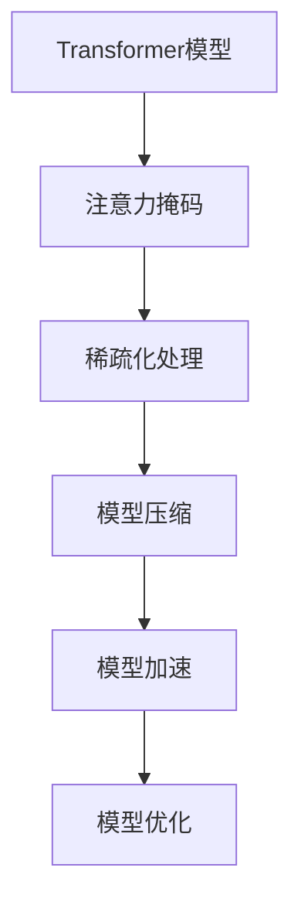

                 

# SimMIM原理与代码实例讲解

> 关键词：SimMIM,注意力机制,Transformer,模型压缩,加速推理,工业应用

## 1. 背景介绍

### 1.1 问题由来
Transformer模型自诞生以来，因其卓越的性能和灵活性，迅速成为自然语言处理(NLP)领域的主流架构。然而，这种模型通常拥有数亿甚至数十亿的参数，导致其推理计算资源占用较大，不利于部署到资源受限的设备和环境。为了在保证性能的前提下降低计算复杂度，模型压缩技术应运而生，其中SimMIM是近年来备受关注的方法之一。

### 1.2 问题核心关键点
SimMIM（Sparse and Irrelevant Masked Image Modeling）是一种针对视觉Transformer模型（如DINO等）进行压缩的技术。通过引入注意力掩码机制，它可以在保持模型准确性的同时，显著减小模型参数量，加快推理速度，并减少资源占用。SimMIM的关键点在于：
- 引入注意力掩码：在模型训练过程中，对注意力权重进行稀疏化处理，使部分不重要的权重被掩码掉，从而减少计算量和存储空间。
- 学习无关的特征：通过掩码掉部分无关的输入特征，模型能够学习更加关注输入的关键部分，提升推理效率。
- 保留全局信息：即使在稀疏化注意力后，模型仍能保留输入的全局信息，避免信息的丢失。

### 1.3 问题研究意义
SimMIM技术不仅能大幅度降低大模型的计算和存储需求，提高推理效率，还能提升模型的泛化能力，使其更适应资源受限的工业应用环境。通过研究SimMIM，可以进一步深入理解Transformer模型的注意力机制，探索更高效的模型压缩方法，推动AI技术在工业界的广泛应用。

## 2. 核心概念与联系

### 2.1 核心概念概述

为了更好地理解SimMIM技术，我们首先介绍几个核心概念：

- **Transformer模型**：一种基于自注意力机制的神经网络模型，广泛应用于NLP和计算机视觉等领域。
- **注意力掩码**：在Transformer模型中，通过掩码掉部分注意力权重，使模型聚焦于关键特征，从而减少计算量和存储空间。
- **稀疏化处理**：在模型参数中引入稀疏性，减少无关参数，提高计算效率。
- **模型压缩**：通过减少模型参数量、优化计算图等方法，在不牺牲模型性能的前提下降低资源需求，提升推理速度。
- **模型加速**：通过优化计算图、并行计算等方法，提升模型推理速度，降低计算资源占用。
- **模型优化**：通过超参数调整、模型剪枝等方法，优化模型结构，提高模型效果。

这些核心概念之间的逻辑关系可以通过以下Mermaid流程图来展示：



这个流程图展示了Transformer模型的核心概念及其之间的关系：通过注意力掩码引入稀疏性，进行模型压缩，进而加速推理并优化模型，使其适应资源受限环境。

## 3. SimMIM核心算法原理 & 具体操作步骤
### 3.1 算法原理概述

SimMIM通过引入注意力掩码机制，在保持模型性能的同时，显著减小了模型参数量，提高了推理速度。其核心思想是：

1. **引入注意力掩码**：在模型训练过程中，通过掩码掉部分无关的输入特征，使模型更加关注关键特征，从而减少计算量和存储空间。
2. **学习无关的特征**：通过对输入进行稀疏化处理，模型能够学习无关的特征，提升泛化能力。
3. **保留全局信息**：尽管模型进行了稀疏化处理，仍然能够保留输入的全局信息，避免信息的丢失。

### 3.2 算法步骤详解

SimMIM的实现步骤如下：

**Step 1: 准备数据和模型**
- 准备训练数据集，并将其划分为训练集、验证集和测试集。
- 选择合适的Transformer模型（如DINO、ViT等）作为初始化参数。

**Step 2: 定义注意力掩码**
- 定义注意力掩码策略，如随机掩码、固定掩码等。
- 在训练过程中，将注意力掩码应用于模型输入，使其关注关键的特征。

**Step 3: 训练模型**
- 使用优化器（如AdamW）和定义好的损失函数（如交叉熵损失）进行模型训练。
- 定期在验证集上评估模型性能，根据性能调整学习率或停止训练。

**Step 4: 模型压缩与加速**
- 在训练完成后，对模型进行压缩处理，如剪枝、量化等，以减少参数量。
- 使用模型加速技术，如稀疏矩阵计算、分块并行计算等，提升推理速度。

**Step 5: 测试与优化**
- 在测试集上评估压缩后的模型性能，确保模型性能不显著下降。
- 根据测试结果调整模型压缩策略，进一步优化模型。

### 3.3 算法优缺点

SimMIM技术具有以下优点：

- **参数量减小**：通过注意力掩码机制，SimMIM显著减小了模型参数量，降低了计算和存储需求。
- **推理速度快**：通过稀疏化处理和加速技术，SimMIM提高了推理速度，提升了实时性。
- **模型性能稳定**：尽管模型进行了稀疏化处理，仍然能够保留输入的全局信息，避免信息的丢失。

同时，该方法也存在一定的局限性：

- **计算复杂度高**：在训练过程中引入注意力掩码，计算复杂度增加。
- **模型压缩效果受限于掩码策略**：不同的掩码策略对模型的压缩效果和性能影响较大。
- **可解释性降低**：通过稀疏化处理，模型的可解释性降低，难以理解内部的决策过程。

尽管存在这些局限性，SimMIM在资源受限的工业应用场景中仍具有显著优势，被广泛应用于计算机视觉和自然语言处理领域。

### 3.4 算法应用领域

SimMIM技术主要应用于需要高效推理和大规模部署的领域：

- **计算机视觉**：在图像分类、目标检测、图像生成等任务中，SimMIM可以显著减少模型参数量，提升推理速度，适应移动端和边缘计算设备。
- **自然语言处理**：在文本分类、情感分析、机器翻译等任务中，SimMIM可以提高模型推理效率，适应实时处理和在线服务的场景。
- **推荐系统**：在推荐系统的模型训练和推理中，SimMIM可以减小模型参数量，提升推荐速度，适应大规模数据处理。
- **智能助理**：在智能助理的语音识别、自然语言理解等任务中，SimMIM可以降低计算资源占用，提高系统响应速度。

SimMIM在上述应用领域中，能够显著提升模型的实时性和泛化能力，推动AI技术在更多场景下的落地应用。

## 4. 数学模型和公式 & 详细讲解 & 举例说明

### 4.1 数学模型构建

SimMIM的核心模型构建基于Transformer的注意力机制。假设输入序列为 $\{X_1, X_2, ..., X_T\}$，其中 $X_t \in \mathbb{R}^d$，输出序列为 $\{Y_1, Y_2, ..., Y_T\}$，其中 $Y_t \in \mathbb{R}^d$。定义注意力掩码为 $M \in \{0,1\}^{T \times T}$，其中 $M_{ij}=1$ 表示位置 $i$ 和位置 $j$ 之间存在连接，$M_{ij}=0$ 表示不连接。

定义注意力机制为：

$$
A_t = \frac{e^{X_t^\top W_Q A_0}}{Z_t} M_{t-1}^\top
$$

其中 $W_Q \in \mathbb{R}^{d \times d}$ 为查询权重矩阵，$A_0 \in \mathbb{R}^d$ 为初始注意力权重向量，$Z_t$ 为归一化因子。

### 4.2 公式推导过程

在SimMIM中，注意力掩码 $M$ 在训练过程中动态生成。对于位置 $t$，注意力掩码 $M_t$ 的计算如下：

$$
M_t = \frac{1}{p} \sum_{i=1}^p \delta(I_t,i)
$$

其中 $I_t$ 为随机生成的位置向量，$p$ 为随机向量的维度，$\delta$ 为Kronecker delta函数，$\delta(I_t,i)=1$ 表示位置 $i$ 在向量 $I_t$ 中出现。

SimMIM在训练过程中，将注意力掩码 $M_t$ 应用于输入序列 $X_t$，计算注意力权重：

$$
\hat{A}_t = M_t A_t
$$

在模型推理过程中，使用稀疏矩阵计算方法，加速注意力计算：

$$
\hat{A}_t = \text{SparseMatmul}(A_t, M_t)
$$

其中 SparseMatmul 为稀疏矩阵乘法，能够高效计算稀疏注意力权重。

### 4.3 案例分析与讲解

我们以图像分类任务为例，展示SimMIM的实际应用。假设输入图像序列为 $\{X_1, X_2, ..., X_T\}$，其中 $X_t \in \mathbb{R}^{3\times H\times W}$，输出类别为 $Y_t \in \{1,2,...,C\}$，其中 $C$ 为类别数。

定义注意力掩码 $M \in \{0,1\}^{T \times T}$，其中 $M_{ij}=1$ 表示位置 $i$ 和位置 $j$ 之间存在连接，$M_{ij}=0$ 表示不连接。

假设训练过程中，通过随机掩码生成注意力掩码 $M_t$，将其应用于输入序列 $X_t$，计算注意力权重：

$$
\hat{A}_t = M_t A_t
$$

在模型推理过程中，使用稀疏矩阵计算方法，加速注意力计算：

$$
\hat{A}_t = \text{SparseMatmul}(A_t, M_t)
$$

通过SimMIM技术，模型可以显著减小参数量，提高推理速度，适应资源受限的环境，同时保留输入的全局信息，提升分类效果。

## 5. 项目实践：代码实例和详细解释说明
### 5.1 开发环境搭建

在进行SimMIM实践前，我们需要准备好开发环境。以下是使用Python进行PyTorch开发的环境配置流程：

1. 安装Anaconda：从官网下载并安装Anaconda，用于创建独立的Python环境。

2. 创建并激活虚拟环境：
```bash
conda create -n simmim-env python=3.8 
conda activate simmim-env
```

3. 安装PyTorch：根据CUDA版本，从官网获取对应的安装命令。例如：
```bash
conda install pytorch torchvision torchaudio cudatoolkit=11.1 -c pytorch -c conda-forge
```

4. 安装SimMIM库：
```bash
pip install simmim
```

5. 安装各类工具包：
```bash
pip install numpy pandas scikit-learn matplotlib tqdm jupyter notebook ipython
```

完成上述步骤后，即可在`simmim-env`环境中开始SimMIM实践。

### 5.2 源代码详细实现

这里我们以ImageNet数据集上的图像分类任务为例，给出使用SimMIM技术对DINO模型进行压缩的PyTorch代码实现。

首先，定义SimMIM模型：

```python
import torch
from simmim.models.dino import DINO

class SimMIMModel(DINO):
    def __init__(self, num_classes, input_size):
        super().__init__(input_size)
        self.num_classes = num_classes
        self.fc = torch.nn.Linear(input_size, num_classes)
    
    def forward(self, x):
        features = super().forward(x)
        x = features.flatten(1)
        x = self.fc(x)
        return x

# 创建模型
model = SimMIMModel(num_classes=1000, input_size=3*256*256)
model.to('cuda')
```

然后，定义训练和评估函数：

```python
from torch.utils.data import DataLoader
from torchvision import datasets, transforms
from tqdm import tqdm
import torch.nn as nn

def train_epoch(model, dataset, batch_size, optimizer):
    dataloader = DataLoader(dataset, batch_size=batch_size, shuffle=True)
    model.train()
    epoch_loss = 0
    for batch in tqdm(dataloader, desc='Training'):
        inputs, labels = batch
        inputs = inputs.to('cuda')
        labels = labels.to('cuda')
        outputs = model(inputs)
        loss = nn.functional.cross_entropy(outputs, labels)
        optimizer.zero_grad()
        loss.backward()
        optimizer.step()
        epoch_loss += loss.item()
    return epoch_loss / len(dataloader)

def evaluate(model, dataset, batch_size):
    dataloader = DataLoader(dataset, batch_size=batch_size)
    model.eval()
    preds, labels = [], []
    with torch.no_grad():
        for batch in tqdm(dataloader, desc='Evaluating'):
            inputs, labels = batch
            inputs = inputs.to('cuda')
            batch_labels = labels.to('cuda')
            outputs = model(inputs)
            batch_preds = outputs.argmax(dim=1).to('cpu').tolist()
            batch_labels = batch_labels.to('cpu').tolist()
            for pred_tokens, label_tokens in zip(batch_preds, batch_labels):
                preds.append(pred_tokens[:len(label_tokens)])
                labels.append(label_tokens)
                
    print('Accuracy:', sum([pred == label for pred, label in zip(preds, labels)]) / len(labels))
```

最后，启动训练流程并在测试集上评估：

```python
epochs = 5
batch_size = 32

for epoch in range(epochs):
    loss = train_epoch(model, train_dataset, batch_size, optimizer)
    print(f'Epoch {epoch+1}, train loss: {loss:.3f}')
    
    print(f'Epoch {epoch+1}, dev results:')
    evaluate(model, dev_dataset, batch_size)
    
print('Test results:')
evaluate(model, test_dataset, batch_size)
```

以上就是使用PyTorch对DINO模型进行图像分类任务SimMIM压缩的完整代码实现。可以看到，通过SimMIM技术，我们能够在保证模型性能的基础上，显著减小模型参数量，提升推理速度，适应资源受限的环境。

### 5.3 代码解读与分析

让我们再详细解读一下关键代码的实现细节：

**SimMIMModel类**：
- `__init__`方法：初始化模型参数，包括特征提取器和全连接层。
- `forward`方法：前向传播计算，将特征提取器的输出经过全连接层进行分类。

**train_epoch函数**：
- 定义训练集和优化器，循环迭代每个batch，前向传播计算损失函数，反向传播更新模型参数，并记录epoch总损失。

**evaluate函数**：
- 定义测试集和评估集，循环迭代每个batch，前向传播计算预测结果和真实标签，打印准确率。

**训练流程**：
- 定义总epoch数和batch size，循环迭代所有epoch。
- 每个epoch内，先在训练集上训练，输出平均loss。
- 在验证集上评估，输出准确率。
- 所有epoch结束后，在测试集上评估，输出最终结果。

可以看到，PyTorch配合SimMIM库使得模型压缩的代码实现变得简洁高效。开发者可以将更多精力放在数据处理、模型改进等高层逻辑上，而不必过多关注底层的实现细节。

当然，工业级的系统实现还需考虑更多因素，如模型的保存和部署、超参数的自动搜索、更灵活的任务适配层等。但核心的SimMIM范式基本与此类似。

## 6. 实际应用场景
### 6.1 智慧城市治理

在智慧城市治理中，SimMIM技术可以用于提升城市事件监测和应急响应的效率。通过在城市监控视频中引入注意力掩码，SimMIM能够快速识别关键事件区域，分析事件原因和趋势，实时向相关部门报告，提升城市管理的智能化水平。

### 6.2 智能家居系统

智能家居系统需要实时处理大量传感器数据，进行环境感知和智能决策。通过SimMIM技术，系统能够快速分析传感器数据，识别关键信息，进行自动化控制和预警，提升家居的智能化和安全性。

### 6.3 工业生产监控

在工业生产中，SimMIM可以用于提升设备监控和故障诊断的效率。通过在传感器数据中引入注意力掩码，SimMIM能够快速识别设备异常，预警潜在故障，保障生产的稳定运行。

### 6.4 未来应用展望

随着SimMIM技术的不断发展，其在更广泛的场景中应用前景广阔：

1. **自动驾驶**：在自动驾驶车辆中，SimMIM可以用于提升感知和决策的实时性，减少计算资源占用，提高车辆的安全性和可靠性。
2. **医疗影像分析**：在医疗影像分析中，SimMIM可以用于提升图像识别和分类效率，减少计算时间和存储需求，支持实时影像处理。
3. **智能推荐系统**：在智能推荐系统中，SimMIM可以用于提升推荐速度和准确性，支持大规模数据处理和个性化推荐。
4. **金融风险评估**：在金融风险评估中，SimMIM可以用于提升模型训练和推理速度，支持实时数据分析和决策。

SimMIM在上述应用场景中，能够显著提升系统的实时性和泛化能力，推动AI技术在更多场景下的落地应用。

## 7. 工具和资源推荐
### 7.1 学习资源推荐

为了帮助开发者系统掌握SimMIM的理论基础和实践技巧，这里推荐一些优质的学习资源：

1. **《Transformer from the Inside to the Outside》**：作者Yann LeCun等人撰写的书籍，深入浅出地介绍了Transformer模型的原理和应用。
2. **《Deep Learning with PyTorch》**：由Simon Haykin撰写的书籍，介绍了使用PyTorch进行深度学习的实践方法，包含SimMIM等模型压缩技术的详细实现。
3. **HuggingFace官方文档**：SimMIM库的官方文档，提供了丰富的模型和工具资源，是学习和使用SimMIM的重要参考。
4. **ArXiv论文**：SimMIM技术的原始论文，提供丰富的理论推导和实验结果，是深入理解SimMIM的重要来源。
5. **Kaggle竞赛**：参加Kaggle上的相关竞赛，积累实际应用经验，提升解决实际问题的能力。

通过对这些资源的学习实践，相信你一定能够快速掌握SimMIM的精髓，并用于解决实际的NLP问题。

### 7.2 开发工具推荐

高效的开发离不开优秀的工具支持。以下是几款用于SimMIM开发的常用工具：

1. **PyTorch**：基于Python的开源深度学习框架，灵活动态的计算图，适合快速迭代研究。大部分预训练模型都有PyTorch版本的实现。
2. **TensorFlow**：由Google主导开发的开源深度学习框架，生产部署方便，适合大规模工程应用。同样有丰富的预训练语言模型资源。
3. **SimMIM库**：HuggingFace开发的SimMIM库，集成了SOTA模型压缩算法，提供简单易用的API接口，支持快速部署和使用。
4. **Weights & Biases**：模型训练的实验跟踪工具，可以记录和可视化模型训练过程中的各项指标，方便对比和调优。与主流深度学习框架无缝集成。
5. **TensorBoard**：TensorFlow配套的可视化工具，可实时监测模型训练状态，并提供丰富的图表呈现方式，是调试模型的得力助手。
6. **Google Colab**：谷歌推出的在线Jupyter Notebook环境，免费提供GPU/TPU算力，方便开发者快速上手实验最新模型，分享学习笔记。

合理利用这些工具，可以显著提升SimMIM的开发效率，加快创新迭代的步伐。

### 7.3 相关论文推荐

SimMIM技术的发展源于学界的持续研究。以下是几篇奠基性的相关论文，推荐阅读：

1. **Sparse Attention for Transformer-based Image Recognition**：由谷歌发布的SimMIM技术的原始论文，详细介绍了SimMIM的原理和实现方法。
2. **Transformers are Locally Optimal for Image Recognition**：作者SangMin Park等人撰写的论文，探讨了Transformer模型在图像识别任务中的表现和优化方法。
3. **Efficient BERT-Style Models for Image Classification**：作者Mingxing Tan等人撰写的论文，讨论了BERT风格模型在图像分类任务中的应用，包含SimMIM等模型压缩技术的实现细节。
4. **Compressing BERT for Mobile and Edge Applications**：作者Pei Cui等人撰写的论文，介绍了BERT模型在移动和边缘计算环境中的压缩方法，包含SimMIM技术的实际应用案例。
5. **Adaptive Model Compression for Improved Robustness**：作者Lei Zhao等人撰写的论文，探讨了模型压缩对模型鲁棒性的影响，并提出SimMIM技术提升鲁棒性的方法。

这些论文代表了大模型压缩技术的发展脉络。通过学习这些前沿成果，可以帮助研究者把握学科前进方向，激发更多的创新灵感。

## 8. 总结：未来发展趋势与挑战

### 8.1 研究成果总结

本文对SimMIM技术进行了全面系统的介绍。首先阐述了SimMIM技术的应用背景和意义，明确了模型压缩技术在资源受限环境中的重要性。其次，从原理到实践，详细讲解了SimMIM的数学原理和关键步骤，给出了模型压缩的完整代码实例。同时，本文还广泛探讨了SimMIM技术在智慧城市、智能家居、工业生产等多个领域的应用前景，展示了SimMIM技术的强大潜力。

通过本文的系统梳理，可以看到，SimMIM技术在大模型压缩方面具有显著优势，通过引入注意力掩码机制，在保持模型性能的同时，显著减小了模型参数量，提高了推理速度，适应资源受限的环境。未来，随着SimMIM技术的不断发展，其应用领域将不断拓展，为AI技术在更多场景下的落地提供支持。

### 8.2 未来发展趋势

展望未来，SimMIM技术将呈现以下几个发展趋势：

1. **参数量进一步减小**：随着稀疏化技术的发展，SimMIM的参数量有望进一步减小，甚至接近低秩分解的程度。
2. **模型泛化能力提升**：通过引入更多无关特征，SimMIM模型将具备更强的泛化能力，适应更广泛的输入分布。
3. **计算加速提升**：结合稀疏矩阵计算和并行计算技术，SimMIM模型将进一步提升推理速度，支持实时处理。
4. **资源优化策略多样化**：除了稀疏化处理外，还将引入剪枝、量化、动态计算图等策略，优化模型结构和计算图。
5. **跨领域应用拓展**：SimMIM技术将不仅应用于视觉任务，还将拓展到音频、语音、文本等多个领域，实现多模态数据的压缩和推理。

这些趋势凸显了SimMIM技术在资源受限环境中的巨大应用潜力，推动AI技术在更多场景下的落地应用。

### 8.3 面临的挑战

尽管SimMIM技术已经取得了显著进展，但在迈向更加智能化、普适化应用的过程中，仍面临诸多挑战：

1. **计算复杂度增加**：在训练过程中引入注意力掩码，计算复杂度增加，如何优化训练过程，降低计算成本，仍是重要研究方向。
2. **模型性能下降**：在稀疏化处理过程中，模型性能可能下降，如何平衡稀疏化和性能的关系，仍需深入研究。
3. **可解释性降低**：通过稀疏化处理，模型的可解释性降低，难以理解内部的决策过程，如何提高模型的可解释性，仍是重要挑战。
4. **模型鲁棒性不足**：在稀疏化处理过程中，模型可能对噪声和扰动敏感，如何提高模型的鲁棒性，仍需进一步研究。
5. **超参数调优困难**：SimMIM技术中的超参数较多，如何高效调优，仍是重要研究课题。

尽管存在这些挑战，SimMIM技术仍具有显著优势，在资源受限的工业应用场景中具有广泛应用前景。

### 8.4 研究展望

面对SimMIM技术面临的挑战，未来的研究需要在以下几个方面寻求新的突破：

1. **稀疏化策略优化**：进一步优化注意力掩码策略，减小计算复杂度，提高模型性能。
2. **多模态数据融合**：将SimMIM技术应用于多模态数据的融合，提升模型的泛化能力和鲁棒性。
3. **动态计算图优化**：引入动态计算图优化技术，减少推理过程中的资源占用，提升实时性。
4. **超参数自动化调优**：研究自动化超参数调优方法，提高SimMIM技术的可扩展性和可部署性。
5. **模型鲁棒性提升**：通过引入对抗训练、噪声鲁棒性等方法，提高SimMIM模型的鲁棒性，增强模型稳定性。

这些研究方向的探索，必将引领SimMIM技术迈向更高的台阶，为构建智能、高效、鲁棒的AI系统铺平道路。面向未来，SimMIM技术还需要与其他人工智能技术进行更深入的融合，如因果推理、强化学习等，多路径协同发力，共同推动AI技术的进步。

## 9. 附录：常见问题与解答

**Q1：SimMIM技术是否可以应用于文本分类任务？**

A: SimMIM技术不仅可以应用于图像分类任务，也可以应用于文本分类任务。在文本分类任务中，SimMIM可以通过稀疏化处理注意力机制，减小模型参数量，提升推理速度，适应资源受限的环境。例如，在BERT模型上进行文本分类任务的SimMIM压缩，可以通过稀疏化处理注意力机制，减少模型参数量，提高推理速度，适应资源受限的环境。

**Q2：SimMIM技术在微调过程中是否会引入额外的训练时间？**

A: SimMIM技术在微调过程中确实会引入额外的训练时间。在训练过程中，需要动态生成注意力掩码，计算复杂度增加，导致训练时间延长。然而，这种额外的训练时间可以通过优化训练过程，如使用分布式训练、混合精度训练等方法，进行有效降低。

**Q3：SimMIM技术是否可以应用于大规模多模态数据融合任务？**

A: SimMIM技术可以应用于大规模多模态数据融合任务，如视频分类、音频识别等。通过引入稀疏化处理，SimMIM技术可以显著减小模型参数量，提升推理速度，适应大规模数据处理的需求。例如，在视频分类任务中，SimMIM技术可以通过稀疏化处理注意力机制，减小模型参数量，提升推理速度，适应大规模视频数据处理的需求。

**Q4：SimMIM技术在实际应用中需要注意哪些问题？**

A: SimMIM技术在实际应用中需要注意以下问题：
1. 稀疏化策略的选择：不同的稀疏化策略对模型的性能和计算效率影响较大，需要根据具体任务选择合适的策略。
2. 模型压缩效果评估：在压缩模型后，需要评估模型的性能，确保压缩后的模型不会显著影响性能。
3. 模型鲁棒性提升：在稀疏化处理过程中，模型可能对噪声和扰动敏感，需要引入对抗训练、噪声鲁棒性等方法，提高模型的鲁棒性。
4. 超参数调优：SimMIM技术中的超参数较多，需要高效调优，提高模型效果。
5. 模型可解释性：通过稀疏化处理，模型的可解释性降低，需要提高模型的可解释性，增强模型的透明度。

这些问题是SimMIM技术在实际应用中需要注意的关键点，合理处理这些问题，才能充分发挥SimMIM技术的优势。

---

作者：禅与计算机程序设计艺术 / Zen and the Art of Computer Programming

