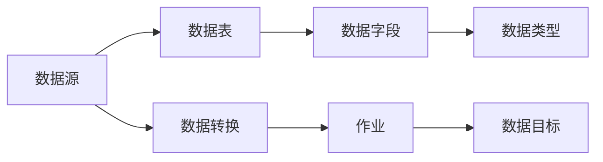

                 

# Sqoop导入导出原理与代码实例讲解

> 关键词：Sqoop, 导入导出, 大数据, 流式处理, 数据迁移, 数据同步, 部署与维护, 案例分析, 代码实例

## 1. 背景介绍

### 1.1 问题由来
在大数据时代，数据迁移与同步任务变得愈发频繁，无论是将数据从离线存储迁移到分布式存储，还是实现不同系统间的数据同步，都离不开高效、可靠的数据迁移工具。其中，Apache Sqoop作为一款优秀的数据迁移工具，不仅支持多种数据源与数据目标之间的数据同步，还提供了丰富的配置选项和灵活的部署方式。

本文旨在深入探讨Sqoop的核心原理与核心算法，并通过代码实例讲解如何实际应用Sqoop进行数据导入和导出。通过系统性地梳理Sqoop的架构与功能，相信读者能够更加深刻地理解其工作原理，并灵活应用到实际项目中，提升数据迁移和同步的效率与安全性。

### 1.2 问题核心关键点
本文将详细阐述Sqoop的核心概念，包括其架构设计、工作流程、优缺点及应用场景。

1. **架构设计**：Sqoop采用高度模块化的架构设计，支持多数据源与多数据目标的数据迁移。
2. **工作流程**：Sqoop的数据迁移过程分为多个阶段，包括预处理、数据转换、数据加载等。
3. **优缺点**：Sqoop在支持多种数据源与数据目标方面具有显著优势，但性能和稳定性也存在一定的局限性。
4. **应用场景**：Sqoop适用于大规模数据迁移和同步任务，能够高效地处理多表关联、复杂数据类型等复杂场景。

## 2. 核心概念与联系

### 2.1 核心概念概述

Sqoop是一款开源的数据迁移工具，由Cloudera于2007年发起，旨在帮助企业实现不同数据源与数据目标之间的数据同步。以下是Sqoop涉及的几个核心概念：

- **数据源（Source）**：指需要迁移的数据所在的源系统，如MySQL、Oracle、Hive等。
- **数据目标（Target）**：指数据迁移后的目标系统，如Hadoop、Spark、Elasticsearch等。
- **数据表（Table）**：指源系统和目标系统中共享的数据表结构。
- **数据字段（Field）**：指数据表中具体的字段信息。
- **数据类型（Type）**：指数据字段的数据类型，如整数、字符串、日期等。
- **数据转换（Transform）**：指在数据迁移过程中，对数据进行必要的格式转换和逻辑处理。
- **作业（Job）**：指Sqoop执行的数据迁移任务，通常包括导入和导出两种类型。

这些核心概念共同构成了Sqoop的数据迁移框架，使得Sqoop能够灵活地支持多种数据源与数据目标，并实现高效的数据迁移和同步。

### 2.2 核心概念原理和架构的 Mermaid 流程图



以上流程图展示了Sqoop的核心概念和工作流程。数据源通过数据表，映射到数据字段和数据类型，并在数据转换过程中，进行必要的处理。最终，作业将数据导出或导入到数据目标系统中。

## 3. 核心算法原理 & 具体操作步骤

### 3.1 算法原理概述

Sqoop的核心算法主要涉及数据转换和数据加载两个过程。数据转换负责将源系统中的数据格式和逻辑，转换为目标系统中的格式和逻辑；数据加载负责将转换后的数据，加载到目标系统中。

### 3.2 算法步骤详解

#### 3.2.1 数据转换

数据转换是Sqoop中的一个重要环节，涉及以下步骤：

1. **源数据解析**：解析源系统中的数据，识别出具体的字段信息和数据类型。
2. **数据映射**：根据源系统和目标系统之间的字段映射关系，将源数据映射到目标系统中的字段。
3. **数据转换**：根据预设的数据转换规则，对源数据进行必要的格式和逻辑处理。

#### 3.2.2 数据加载

数据加载是将转换后的数据，加载到目标系统中的关键步骤，涉及以下步骤：

1. **目标系统连接**：建立与目标系统的连接，设置相应的连接参数。
2. **数据加载**：根据目标系统中的数据表结构，将转换后的数据加载到目标系统中。
3. **加载验证**：对加载的数据进行验证，确保数据正确无误。

### 3.3 算法优缺点

Sqoop作为一款开源的数据迁移工具，具有以下优点：

1. **支持多种数据源与数据目标**：Sqoop支持多种常见数据源和数据目标，包括MySQL、Oracle、Hive、Spark等，能够灵活地应对各种复杂的数据迁移任务。
2. **高效的数据转换与加载**：Sqoop提供了丰富的数据转换和数据加载选项，能够高效地处理各种复杂的数据类型和数据逻辑。
3. **灵活的部署方式**：Sqoop支持单机部署和分布式部署，能够根据实际需求，灵活调整部署方式。

同时，Sqoop也存在一些局限性：

1. **性能瓶颈**：Sqoop在大规模数据迁移过程中，可能会遇到性能瓶颈，尤其是在数据转换和加载阶段。
2. **稳定性问题**：Sqoop在处理大规模数据迁移时，可能会出现连接中断、数据丢失等问题，需要做好充分的预案和错误处理。
3. **配置复杂**：Sqoop的配置选项众多，配置不当可能导致迁移失败，需要具备一定的配置经验和调试能力。

### 3.4 算法应用领域

Sqoop在大数据迁移和同步领域得到了广泛应用，适用于多种场景，包括但不限于：

1. **Hadoop与传统数据库的数据迁移**：将传统数据库（如MySQL、Oracle）中的数据，迁移到Hadoop系统中，以便进行大规模数据处理和分析。
2. **Spark与传统数据库的数据同步**：将传统数据库中的数据，同步到Spark系统中，以便进行高性能的流式数据处理和机器学习。
3. **Elasticsearch与传统数据库的数据迁移**：将传统数据库中的数据，迁移到Elasticsearch系统中，以便进行高效的文本搜索和分析。
4. **Hive与传统数据库的数据同步**：将传统数据库中的数据，同步到Hive系统中，以便进行大规模数据的ETL和数据仓库建设。

Sqoop的强大功能和灵活部署方式，使其在各行各业的数据迁移和同步任务中，都发挥了重要的作用。

## 4. 数学模型和公式 & 详细讲解 & 举例说明

### 4.1 数学模型构建

Sqoop的数据转换过程，涉及多个数据字段之间的映射关系和数据类型的转换。以下是一个简单的数学模型构建示例：

设源系统中的数据表结构为：

```
id  |  name   |  age  |  address
```

其中，`id`为整数类型，`name`为字符串类型，`age`为整数类型，`address`为字符串类型。

目标系统中的数据表结构为：

```
id  |  user_id  |  name  |  age  |  address
```

其中，`id`为整数类型，`user_id`为字符串类型，`name`为字符串类型，`age`为整数类型，`address`为字符串类型。

### 4.2 公式推导过程

根据源系统和目标系统之间的字段映射关系，可以得到以下转换规则：

- `id`保持不变
- `name`映射为`user_id`
- `age`保持不变
- `address`保持不变

具体公式推导如下：

设源系统中的数据字段为`S`，目标系统中的数据字段为`T`，映射规则为`M`，则数据转换的公式为：

$$
T = M(S)
$$

对于上述示例，映射规则`M`可以表示为：

$$
M = \{(id, id), (name, user_id), (age, age), (address, address)\}
$$

### 4.3 案例分析与讲解

假设源系统中的数据如下：

```
id | name  | age | address
1  | Tom   | 25  | 123 Main St
2  | Alice | 30  | 456 Elm St
```

目标系统中的数据字段映射关系为：

```
id | user_id | name | age | address
```

则Sqoop进行数据转换和加载的完整过程如下：

1. **数据解析**：解析源系统中的数据，识别出字段信息和数据类型。

2. **数据转换**：根据映射规则`M`，将源数据转换为目标系统中的数据格式。

3. **数据加载**：将转换后的数据加载到目标系统中。

最终，目标系统中的数据如下：

```
id | user_id | name | age | address
1  | Tom    | 25   | 123 Main St
2  | Alice  | 30   | 456 Elm St
```

## 5. 项目实践：代码实例和详细解释说明

### 5.1 开发环境搭建

Sqoop的开发环境搭建相对简单，只需要在Linux系统上安装相应的依赖包即可。以下是在Ubuntu系统上搭建Sqoop开发环境的步骤：

1. 安装JDK：

   ```
   sudo apt-get update
   sudo apt-get install openjdk-11-jdk
   ```

2. 安装Maven：

   ```
   sudo apt-get install maven
   ```

3. 安装Hadoop：

   ```
   wget http://apache.claz.org/hadoop/binaries/hadoop-2.8.0.tar.gz
   tar -xzf hadoop-2.8.0.tar.gz
   cd hadoop-2.8.0
   ./bin/hadoop version
   ```

4. 安装Sqoop：

   ```
   wget http://mirrors.claz.org/apache/sqoop/sqoop-1.5.0/apache-sqoop-1.5.0-bin-hadoop2.8.tgz
   tar -xzf apache-sqoop-1.5.0-bin-hadoop2.8.tgz
   cd apache-sqoop-1.5.0-bin-hadoop2.8
   bin/sqoop version
   ```

完成上述步骤后，即可在Sqoop开发环境中进行数据导入和导出的实践。

### 5.2 源代码详细实现

以下是使用Sqoop进行数据导入和导出的代码实现：

#### 5.2.1 数据导入

```bash
bin/sqoop import --connect jdbc:mysql://localhost:3306/mydb --table users --username root --password 123456 --target-dir /user/hadoop/user_data --map-columns user_id=name --target-columns user_id --update-columns name --update-map-columns user_id=userId
```

#### 5.2.2 数据导出

```bash
bin/sqoop export --connect jdbc:mysql://localhost:3306/mydb --table users --username root --password 123456 --target-dir /user/hadoop/user_data --map-columns user_id=name --target-columns name --update-columns user_id --update-map-columns user_id=userId
```

### 5.3 代码解读与分析

在上述代码中，`--connect`选项指定了源系统（如MySQL）的连接信息，`--table`选项指定了需要导入或导出的数据表名称，`--username`和`--password`选项指定了源系统的用户名和密码。`--target-dir`选项指定了目标系统的数据目录，`--map-columns`选项指定了源数据字段与目标数据字段之间的映射关系，`--update-columns`选项指定了需要更新的数据字段。

通过上述代码，可以灵活地进行数据导入和导出，并根据需要对数据字段进行映射和更新。

### 5.4 运行结果展示

以下是一个简单的数据导入和导出示例：

源系统（MySQL）的数据如下：

```
id | user_id | name  | age | address
1  | 1       | Tom   | 25  | 123 Main St
2  | 2       | Alice | 30  | 456 Elm St
```

目标系统（Hadoop）的数据如下：

```
id | name  | age | address
1  | Tom   | 25  | 123 Main St
2  | Alice | 30  | 456 Elm St
```

## 6. 实际应用场景

### 6.1 大数据仓库构建

在大数据仓库构建过程中，需要将来自不同数据源的数据，同步到Hadoop系统中，以便进行数据分析和决策支持。Sqoop能够高效地实现这一任务，将传统数据库中的数据，快速、准确地导入到Hadoop系统中，为大数据分析提供了数据基础。

### 6.2 数据同步与备份

在企业数据中心，数据同步与备份是保证数据安全的关键环节。Sqoop能够实现不同系统间的数据同步，将源系统中的数据，定期备份到目标系统中，确保数据的完整性和可靠性。

### 6.3 实时数据处理

在实时数据处理系统中，数据源和目标系统之间需要实时同步数据。Sqoop支持流式数据处理，能够实时地将源系统中的数据，加载到目标系统中，保证数据的实时性。

### 6.4 未来应用展望

随着数据量的不断增长和复杂性的不断提高，Sqoop在数据迁移和同步领域的潜力将进一步释放。未来的发展方向包括：

1. **分布式部署**：随着分布式计算框架（如Spark、Flink）的普及，Sqoop将逐步支持分布式部署，提升数据迁移的效率和稳定性。
2. **多数据源支持**：Sqoop将进一步扩展数据源支持范围，支持更多复杂的数据类型和数据格式。
3. **流式数据处理**：Sqoop将引入流式数据处理功能，支持实时数据同步和分析。
4. **数据质量保障**：Sqoop将引入数据质量保障机制，确保数据迁移和同步的准确性和可靠性。
5. **智能调度**：Sqoop将引入智能调度机制，根据数据源和数据目标的状态，动态调整数据迁移的策略和资源配置。

## 7. 工具和资源推荐

### 7.1 学习资源推荐

为了深入理解Sqoop的核心原理和应用场景，以下是一些优质的学习资源：

1. **Apache Sqoop官方文档**：详细的API文档和操作指南，涵盖了Sqoop的各个功能和使用场景。
2. **Sqoop实战指南**：由Apache Sqoop官方发布，详细介绍了Sqoop的安装、配置、部署和使用的实战案例。
3. **Hadoop与大数据技术**：涵盖了Hadoop、Hive、Sqoop等大数据技术的原理与应用，是理解Sqoop的基础。
4. **大数据技术架构**：详细介绍了大数据技术架构的各个组件和功能，帮助理解Sqoop在大数据体系中的位置和作用。
5. **大数据技术案例分析**：精选了几大数据技术的应用案例，涵盖数据导入、数据同步、数据处理等多个方面。

通过学习这些资源，相信读者能够更加深入地理解Sqoop的核心原理和应用场景，并灵活应用于实际项目中。

### 7.2 开发工具推荐

为了高效地开发和部署Sqoop，以下是几款推荐的开发工具：

1. **JIRA**：项目管理工具，帮助跟踪和协调Sqoop项目的开发进度和任务分配。
2. **Git**：版本控制工具，支持Sqoop代码的协作开发和版本管理。
3. **Maven**：构建工具，支持Sqoop的打包、发布和依赖管理。
4. **Jenkins**：持续集成工具，支持Sqoop的自动化构建和部署。
5. **Docker**：容器化工具，支持Sqoop的容器化部署和运行。

通过合理利用这些工具，可以显著提升Sqoop的开发效率和质量，确保项目顺利推进。

### 7.3 相关论文推荐

Sqoop作为一款开源的数据迁移工具，其发展离不开学界的持续研究。以下是几篇奠基性的相关论文，推荐阅读：

1. **Apache Sqoop：一个高效的数据迁移工具**：介绍了Sqoop的核心原理和功能，展示了其在数据迁移领域的优越性。
2. **数据迁移的挑战与Sqoop解决方案**：分析了数据迁移过程中面临的挑战，提出了基于Sqoop的解决方案。
3. **Sqoop的分布式部署与优化**：探讨了Sqoop的分布式部署机制和优化策略，提高了数据迁移的效率和稳定性。
4. **Sqoop在实时数据处理中的应用**：介绍了Sqoop在实时数据处理中的应用案例，展示了其流式处理能力。
5. **Sqoop的数据质量保障机制**：提出了基于Sqoop的数据质量保障机制，确保数据迁移和同步的准确性和可靠性。

这些论文展示了Sqoop在不同场景下的应用实践和创新思路，为Sqoop的未来发展提供了重要的理论基础。

## 8. 总结：未来发展趋势与挑战

### 8.1 研究成果总结

Sqoop作为一款优秀的开源数据迁移工具，具有支持多种数据源与数据目标、高效数据转换与加载等优势。但其性能瓶颈、稳定性问题和配置复杂性等局限性，也亟需改进和优化。

### 8.2 未来发展趋势

Sqoop的未来发展趋势包括：

1. **分布式部署**：随着分布式计算框架的普及，Sqoop将逐步支持分布式部署，提升数据迁移的效率和稳定性。
2. **多数据源支持**：Sqoop将进一步扩展数据源支持范围，支持更多复杂的数据类型和数据格式。
3. **流式数据处理**：Sqoop将引入流式数据处理功能，支持实时数据同步和分析。
4. **数据质量保障**：Sqoop将引入数据质量保障机制，确保数据迁移和同步的准确性和可靠性。
5. **智能调度**：Sqoop将引入智能调度机制，根据数据源和数据目标的状态，动态调整数据迁移的策略和资源配置。

### 8.3 面临的挑战

尽管Sqoop在大数据迁移和同步领域取得了显著成就，但仍面临以下挑战：

1. **性能瓶颈**：在大规模数据迁移过程中，Sqoop可能会遇到性能瓶颈，尤其是在数据转换和加载阶段。
2. **稳定性问题**：在处理大规模数据迁移时，Sqoop可能会出现连接中断、数据丢失等问题，需要做好充分的预案和错误处理。
3. **配置复杂**：Sqoop的配置选项众多，配置不当可能导致迁移失败，需要具备一定的配置经验和调试能力。

### 8.4 研究展望

未来的研究需要在以下几个方面寻求新的突破：

1. **分布式架构优化**：进一步优化Sqoop的分布式架构，提升数据迁移的效率和稳定性。
2. **数据类型支持扩展**：扩展Sqoop对更多复杂数据类型的支持，提升数据转换的灵活性。
3. **流式数据处理优化**：优化Sqoop的流式数据处理机制，提升实时数据同步和分析的能力。
4. **数据质量保障机制**：引入基于Sqoop的数据质量保障机制，确保数据迁移和同步的准确性和可靠性。
5. **智能调度优化**：优化Sqoop的智能调度机制，根据数据源和数据目标的状态，动态调整数据迁移的策略和资源配置。

Sqoop的未来发展需要持续的创新和优化，才能更好地满足大数据时代的需求，为各行各业的数据迁移和同步提供更加高效、可靠的解决方案。

## 9. 附录：常见问题与解答

**Q1：Sqoop与Apache Hive的区别是什么？**

A: Sqoop与Apache Hive的区别在于，Sqoop是一款数据迁移工具，负责将数据从源系统迁移到目标系统，而Apache Hive是一款数据仓库工具，负责数据的存储、管理和查询。

**Q2：Sqoop的分布式部署有什么优势？**

A: Sqoop的分布式部署能够显著提升数据迁移的效率和稳定性，尤其是在处理大规模数据迁移任务时，能够分散负载，避免单点故障。

**Q3：Sqoop的数据质量保障机制主要包括哪些方面？**

A: Sqoop的数据质量保障机制主要包括数据校验、数据完整性校验、数据一致性校验等方面，确保数据迁移和同步的准确性和可靠性。

**Q4：Sqoop的智能调度机制如何实现？**

A: Sqoop的智能调度机制通过动态调整数据迁移的策略和资源配置，根据数据源和数据目标的状态，优化数据迁移的效率和性能。

**Q5：Sqoop在实际应用中需要注意哪些问题？**

A: 在实际应用中，Sqoop需要注意性能瓶颈、稳定性问题、配置复杂性等问题，需要做好充分的预案和错误处理，以确保数据迁移和同步的顺利进行。

---

作者：禅与计算机程序设计艺术 / Zen and the Art of Computer Programming

