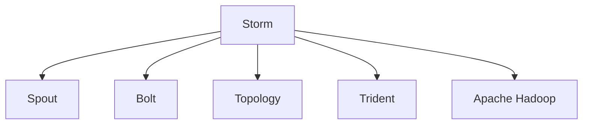
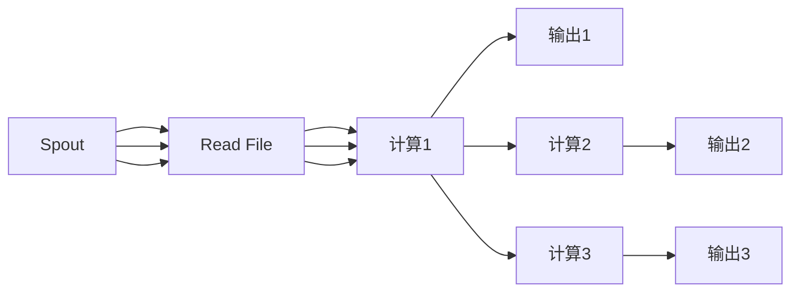

                 

# Storm实时流处理框架原理与代码实例讲解

> 关键词：Storm, 实时流处理, Apache Storm, 流计算, 分布式, Trident, Apache Hadoop, 无界数据流, 高可用性, 高性能

## 1. 背景介绍

### 1.1 问题由来
在现代互联网和大数据时代，实时数据处理的需求越来越强烈。金融交易、社交媒体、物联网等众多行业领域都在产生海量实时数据，迫切需要一种高效、可靠、可扩展的流处理框架来实时处理这些数据。传统的批处理框架，如Hadoop MapReduce，已经不能满足实时处理的需求。基于这些背景，Storm应运而生，成为了流处理领域的明星工具。

### 1.2 问题核心关键点
Storm是一个开源的分布式流处理系统，具有高性能、高可靠性和易扩展性，可以处理无界数据流。Storm的核心设计理念是“容错并行计算”，支持并行处理任务的失败重试，保证了系统的稳定性和可靠性。

Storm有两个核心组件：Spout和Bolt。Spout负责从外部源读取数据，Bolt则负责数据处理。Spout和Bolt之间通过拓扑(Topology)进行连接，拓扑描述了数据流从Spout到Bolt的处理流程。

Storm框架的容错机制是保证系统可靠性的关键。Spout和Bolt通过本地机制和Zookeeper进行故障检测和恢复。一旦Spout或Bolt失败，系统会根据配置自动重试，确保数据不丢失。

### 1.3 问题研究意义
Storm的出现极大地简化了实时流处理的开发和运维流程，提升了实时数据处理的效率和可靠性。对于那些需要实时数据分析和处理的企业，Storm提供了一种有效的解决方案，使他们能够更好地应对数据爆炸带来的挑战。

## 2. 核心概念与联系

### 2.1 核心概念概述

为了更好地理解Storm实时流处理框架，本节将介绍几个密切相关的核心概念：

- Storm：分布式流处理系统，支持高并发的实时数据流处理。
- Spout：从外部源读取数据的组件，是Storm的输入源。
- Bolt：处理数据的组件，是Storm的计算单元。
- Topology：描述Spout和Bolt之间的数据流图，是Storm的逻辑结构。
- Trident：Storm的一个高级API，提供了丰富的数据处理和聚合功能。
- Apache Hadoop：Storm的生态系统中一个重要的组件，为Storm提供了分布式存储和计算能力。

这些核心概念之间的逻辑关系可以通过以下Mermaid流程图来展示：



这个流程图展示了一些关键组件之间的联系：

1. Storm作为流处理框架，通过Spout和Bolt实现数据流处理。
2. Topology描述了Spout和Bolt之间的数据流关系。
3. Trident是Storm的高级API，提供更丰富的数据处理功能。
4. Apache Hadoop提供了分布式存储和计算支持，增强了Storm的扩展能力。

这些概念共同构成了Storm的流处理生态，使得Storm成为实时数据处理的重要工具。

## 3. 核心算法原理 & 具体操作步骤

### 3.1 算法原理概述

Storm的核心算法原理可以概括为“容错并行计算”，其核心思想是通过Spout和Bolt之间的并行计算实现数据的实时处理。Spout负责从外部源读取数据，并将数据分发到多个Bolt中进行并行处理。Bolt可以是一段代码或一个模块，负责对数据进行某种形式的计算。

Storm的容错机制是其可靠性保障的核心。Spout和Bolt都可以进行失败重试，并且可以根据配置自动恢复。一旦Spout或Bolt失败，系统会根据配置自动重试，确保数据不丢失。

### 3.2 算法步骤详解

Storm的运行流程可以大致分为以下几步：

**Step 1: 数据读取与分发**

Spout负责从外部数据源读取数据，并将数据分发到多个Bolt中进行并行处理。Spout可以是一个Spout集群，也可以是一个简单的Spout实现。

**Step 2: 数据处理与计算**

每个Bolt接收到Spout发送的数据后，会进行相应的计算和处理。Bolt可以是一个简单的计算模块，也可以是一个复杂的算法实现。

**Step 3: 数据保存与传输**

处理完数据后，Bolt可以选择将数据保存或转发到其他Bolt或外部系统。数据保存和传输的实现方式可以根据需求进行选择。

**Step 4: 故障检测与恢复**

Spout和Bolt都具有故障检测和恢复机制。一旦Spout或Bolt失败，系统会根据配置自动重试，确保数据不丢失。

**Step 5: 拓扑管理与优化**

Storm的拓扑管理模块负责监控拓扑状态，调整Bolt的并行度，确保系统的最优性能。

### 3.3 算法优缺点

Storm的优点包括：

- 高性能：通过Spout和Bolt的并行计算，实现高吞吐量的实时数据处理。
- 高可靠性：具有自动故障检测和恢复机制，保证系统的高可用性。
- 可扩展性：支持水平扩展，可以根据数据量动态增加Spout和Bolt的数量。
- 易于使用：API简单直观，适合开发实时数据处理应用。

同时，Storm也存在一些缺点：

- 学习曲线较陡：由于分布式计算的特性，需要对分布式系统有一定的理解。
- 配置复杂：需要配置拓扑、故障检测等参数，需要一定的系统设计能力。
- 性能受限：受限于单机资源，无法处理非常大的数据集。

尽管存在这些缺点，Storm在实时数据处理领域仍然是一个非常重要的工具，适用于各种需要实时数据处理的应用场景。

### 3.4 算法应用领域

Storm的实时流处理功能使其在多个领域得到了广泛的应用，包括但不限于：

- 金融交易：实时处理股票交易数据，生成交易报告。
- 社交媒体：实时处理用户生成的消息，进行情感分析。
- 物联网：实时处理传感器数据，进行数据分析和预测。
- 广告投放：实时处理用户行为数据，优化广告投放策略。
- 交通监控：实时处理交通数据，优化交通管理。

Storm的高性能和高可靠性使其成为实时数据处理的首选工具，广泛应用于各个领域。

## 4. 数学模型和公式 & 详细讲解 & 举例说明

### 4.1 数学模型构建

Storm的数学模型可以简化为以下模型：

$$
S(t) = \sum_{i=1}^{n} B_i(t)
$$

其中，$S(t)$ 表示Spout在时间$t$上读取的数据量，$B_i(t)$ 表示第$i$个Bolt在时间$t$上处理的数据量。这个模型描述了Spout和Bolt之间的数据流关系。

### 4.2 公式推导过程

 Storm的Spout和Bolt之间数据流的数学关系可以通过以下推导过程得到：

1. 设Spout在时间$t$上读取的数据量为$S(t)$，每个Bolt在时间$t$上处理的数据量为$B_i(t)$。

2. 假设Spout和Bolt之间有$m$个拓扑连接，则Spout在时间$t$上读取的数据可以表示为：

   $$
   S(t) = \sum_{i=1}^{m} \alpha_i B_i(t)
   $$

   其中，$\alpha_i$表示第$i$个拓扑连接的处理效率。

3. 假设每个Bolt的处理效率相同，则可以得到：

   $$
   S(t) = m B(t)
   $$

   其中，$B(t)$表示每个Bolt在时间$t$上处理的数据量。

4. 进一步推导可以得到：

   $$
   B(t) = \frac{S(t)}{m}
   $$

   这个公式表示每个Bolt在时间$t$上处理的数据量等于Spout在时间$t$上读取的数据量除以拓扑连接的数目$m$。

### 4.3 案例分析与讲解

考虑一个简单的Storm拓扑，Spout读取一个文件，将文件中的数据分发给3个Bolt进行处理，每个Bolt对数据进行简单的计算，并输出结果。如下图所示：



在时间$t$时，Spout读取文件的数据量为$S(t)$，每个Bolt处理的数据量为$B_i(t)$。假设Spout和Bolt之间有3个拓扑连接，则可以得到：

$$
S(t) = 3 B(t)
$$

其中，$B(t)$表示每个Bolt在时间$t$上处理的数据量。

## 5. 项目实践：代码实例和详细解释说明

### 5.1 开发环境搭建

要进行Storm项目实践，需要先搭建好开发环境。以下是使用Java进行Storm开发的配置步骤：

1. 安装Java：从官网下载安装Java JDK，并配置环境变量。

2. 安装Maven：从官网下载安装Maven，并配置环境变量。

3. 安装Storm：从官网下载安装Storm，并配置环境变量。

4. 安装Apache Hadoop：从官网下载安装Hadoop，并配置环境变量。

5. 创建Storm项目：在IDE中创建一个新的Maven项目，引入Storm和Hadoop依赖。

### 5.2 源代码详细实现

下面以一个简单的Storm拓扑为例，给出Spout和Bolt的Java代码实现：

```java
// Spout实现
public class SimpleSpout implements Spout {
    @Override
    public List<Object> nextTuple() {
        // 从文件读取数据
        String data = "Hello, World!";
        return Collections.singletonList(data);
    }

    @Override
    public void ack(Object msgId) {
        // 数据处理成功
    }

    @Override
    public void fail(Object msgId) {
        // 数据处理失败
    }
}

// Bolt实现
public class SimpleBolt implements Bolt {
    @Override
    public void execute(Object tuple) {
        // 处理数据
        String data = (String) tuple;
        System.out.println("Data: " + data);
    }

    @Override
    public List<Object> declareOutputFields() {
        return Collections.singletonList("output");
    }

    @Override
    public void declareParentField(String field, OutputFieldDeclaration declaration) {
        // 声明父级字段
    }
}
```

这个示例中，Spout实现了从文件中读取数据，并返回一个包含数据的列表。Bolt实现了对数据的简单处理，并输出结果。

### 5.3 代码解读与分析

让我们再详细解读一下关键代码的实现细节：

**Spout接口**：
- `nextTuple`方法：返回Spout需要发射的数据。
- `ack`方法：数据处理成功后，Spout收到ack信号。
- `fail`方法：数据处理失败后，Spout收到fail信号。

**Bolt接口**：
- `execute`方法：接收Spout发射的数据，并进行处理。
- `declareOutputFields`方法：声明Bolt的输出字段。
- `declareParentField`方法：声明父级字段，用于多级拓扑连接。

**代码实现**：
- 在Spout实现中，通过文件读取数据，并返回一个包含数据的列表。
- 在Bolt实现中，接收Spout发射的数据，并进行简单的处理，输出结果。

**运行结果展示**：
- 运行Spout和Bolt后，可以通过控制台的输出结果查看数据处理结果。

## 6. 实际应用场景

### 6.1 金融交易

在金融交易领域，Storm可以实时处理股票交易数据，生成交易报告和分析报告。Spout可以从股票交易系统中读取实时交易数据，Bolt可以计算交易金额、交易量等指标，并生成报表。

### 6.2 社交媒体

社交媒体领域中，Storm可以实时处理用户生成的消息，进行情感分析、舆情监控等任务。Spout可以从社交媒体平台上读取实时消息数据，Bolt可以分析消息情感，生成情感报告。

### 6.3 物联网

物联网领域中，Storm可以实时处理传感器数据，进行数据分析和预测。Spout可以读取传感器数据，Bolt可以进行数据清洗、特征提取等处理，并生成预测结果。

### 6.4 广告投放

广告投放领域中，Storm可以实时处理用户行为数据，优化广告投放策略。Spout可以读取用户行为数据，Bolt可以进行用户画像分析、广告效果评估等处理，并生成优化策略。

### 6.5 交通监控

交通监控领域中，Storm可以实时处理交通数据，优化交通管理。Spout可以读取交通数据，Bolt可以进行数据清洗、数据分析等处理，并生成优化策略。

## 7. 工具和资源推荐

### 7.1 学习资源推荐

为了帮助开发者系统掌握Storm流处理技术的理论基础和实践技巧，这里推荐一些优质的学习资源：

1. Storm官方文档：Storm的官方文档，提供了详细的API参考和案例示例，是入门学习的必备资料。

2. Storm教程系列：一系列针对Storm的在线教程，涵盖了从入门到进阶的各种内容。

3. Apache Hadoop官网：Hadoop作为Storm的生态系统，提供了丰富的学习资料和社区支持。

4. Storm社区论坛：Storm社区论坛是一个活跃的社区，提供了丰富的交流平台和资源共享。

5. Udemy课程：Udemy上有许多Storm的课程，涵盖了从入门到进阶的各种内容。

通过对这些资源的学习实践，相信你一定能够快速掌握Storm的精髓，并用于解决实际的流处理问题。

### 7.2 开发工具推荐

Storm的开发工具有很多，以下是几款常用的开发工具：

1. IntelliJ IDEA：Java开发的主流IDE，提供了丰富的Storm插件和调试工具。

2. Eclipse：Java开发的另一个主流IDE，提供了丰富的Storm插件和开发环境。

3. GitHub：GitHub是一个代码托管平台，可以方便地共享和协作Storm项目。

4. Jenkins：Jenkins是一个持续集成工具，可以自动构建和部署Storm项目。

5. Docker：Docker是一个容器化技术，可以方便地部署和管理Storm应用。

合理利用这些工具，可以显著提升Storm开发的效率，加速项目迭代和上线速度。

### 7.3 相关论文推荐

Storm的出现引发了流处理领域的诸多研究，以下是几篇奠基性的相关论文，推荐阅读：

1. Storm: A Distributed Real-Time Computation System：Storm的作者撰写，介绍了Storm的设计理念和实现细节。

2. Apache Storm: A Distributed Real-Time Compute Engine：Apache基金会发布，介绍了Storm的核心功能和设计原理。

3. Storm: High-Performance Distributed Real-Time Computation：Storm的核心技术论文，介绍了Storm的高性能和可扩展性。

4. Storm: Fast Data Processing at Scale：Storm的高性能分析，介绍了Storm的优化策略和实践经验。

这些论文代表了大数据流处理领域的最新进展，通过学习这些前沿成果，可以帮助研究者把握学科前进方向，激发更多的创新灵感。

## 8. 总结：未来发展趋势与挑战

### 8.1 总结

本文对Storm实时流处理框架进行了全面系统的介绍。首先阐述了Storm的背景和意义，明确了Spout和Bolt的核心概念。其次，从原理到实践，详细讲解了Storm的数学模型和代码实现。同时，本文还广泛探讨了Storm在金融交易、社交媒体、物联网等多个行业领域的应用前景，展示了Storm的高性能和高可靠性。此外，本文精选了Storm的各类学习资源，力求为读者提供全方位的技术指引。

通过本文的系统梳理，可以看到，Storm的实时流处理功能正在成为大数据处理的重要手段，极大地简化了数据处理的开发和运维流程，提升了实时数据处理的效率和可靠性。未来，伴随Storm的不断演进，相信其将会在更多的行业领域得到应用，为人类社会的数字化转型带来深远影响。

### 8.2 未来发展趋势

展望未来，Storm的发展趋势将呈现以下几个方向：

1. 性能优化：进一步提升系统的吞吐量和响应速度，优化资源利用率。

2. 可扩展性：支持更大规模的数据处理，支持分布式计算，优化大数据处理能力。

3. 用户友好性：提供更加友好的API和开发工具，降低学习曲线，提高开发效率。

4. 多生态融合：与其他大数据框架和工具（如Apache Spark、Apache Hadoop等）进行深度整合，提升整体处理能力。

5. 安全性和可靠性：增强系统的安全性保障，提升系统的可靠性和稳定性。

6. 云计算支持：支持云平台和云服务，实现更灵活的部署和管理。

这些趋势凸显了Storm作为流处理框架的广阔前景。这些方向的探索发展，必将进一步提升Storm的性能和应用范围，为大数据处理领域带来新的突破。

### 8.3 面临的挑战

尽管Storm在实时流处理领域已经取得了显著成就，但在迈向更加智能化、普适化应用的过程中，它仍面临诸多挑战：

1. 学习曲线陡峭：由于分布式计算的特性，需要一定的学习曲线和系统设计能力。

2. 性能瓶颈：受限于单机资源，难以处理非常大的数据集。

3. 配置复杂：需要配置拓扑、故障检测等参数，需要一定的系统设计能力。

4. 可靠性保证：需要保证系统的稳定性和可靠性，需要复杂的故障检测和恢复机制。

5. 资源利用：需要优化资源利用率，避免资源浪费。

6. 系统扩展：需要支持更大规模的数据处理，需要扩展性良好的设计。

这些挑战需要研究人员和工程师不断探索和优化，才能真正实现Storm的性能和应用范围。

### 8.4 研究展望

面对Storm所面临的种种挑战，未来的研究需要在以下几个方面寻求新的突破：

1. 分布式计算优化：研究如何优化分布式计算框架，提升系统的吞吐量和响应速度。

2. 可扩展性优化：研究如何支持更大规模的数据处理，提升系统的可扩展性。

3. 用户体验提升：研究如何提供更加友好的API和开发工具，降低学习曲线，提高开发效率。

4. 多生态融合：研究如何与其他大数据框架和工具进行深度整合，提升整体处理能力。

5. 安全性和可靠性增强：研究如何增强系统的安全性保障，提升系统的可靠性和稳定性。

6. 云计算支持：研究如何支持云平台和云服务，实现更灵活的部署和管理。

这些研究方向的探索，必将引领Storm的流处理技术迈向更高的台阶，为大数据处理领域带来新的突破。面向未来，Storm需要与其他大数据框架和工具进行更深入的融合，共同推动实时数据处理的进步。

## 9. 附录：常见问题与解答

**Q1: Storm的Spout和Bolt有什么区别？**

A: Storm的Spout和Bolt是Storm框架中的两个重要组件，分别负责数据读取和数据处理。Spout负责从外部数据源读取数据，并将数据分发给Bolt进行并行处理。Bolt则负责对数据进行计算和处理。Spout和Bolt通过拓扑(Topology)进行连接，描述数据流关系。

**Q2: Storm的拓扑(Topology)是如何实现的？**

A: Storm的拓扑(Topology)是描述Spout和Bolt之间的数据流图的逻辑结构。拓扑由Spout和Bolt组成，通过边连接。Spout从外部数据源读取数据，并将数据分发给Bolt进行并行处理。Bolt对数据进行计算和处理，并将结果发送到其他Bolt或外部系统。拓扑中的Spout和Bolt可以是并行的，可以进行故障检测和恢复。

**Q3: Storm的故障检测和恢复机制是如何实现的？**

A: Storm的故障检测和恢复机制是保证系统可靠性的核心。Spout和Bolt都具有故障检测和恢复机制。一旦Spout或Bolt失败，系统会根据配置自动重试，确保数据不丢失。Spout和Bolt通过本地机制和Zookeeper进行故障检测和恢复。一旦Spout或Bolt失败，系统会根据配置自动重试，确保数据不丢失。

**Q4: Storm的性能瓶颈是如何优化的？**

A: Storm的性能瓶颈主要来自于单机资源和分布式通信。为了优化性能，Storm提供了一些优化措施：

1. 通过多机分布式计算，提高系统的吞吐量。

2. 使用消息队列进行数据传输，减少分布式通信的开销。

3. 通过优化拓扑设计，避免瓶颈。

4. 通过配置参数优化，提高系统的性能。

5. 通过资源调度优化，提高资源利用率。

**Q5: Storm的Trident是如何实现的？**

A: Trident是Storm的一个高级API，提供了丰富的数据处理和聚合功能。Trident通过封装Bolt，提供统一的数据处理接口，简化了开发流程。Trident支持聚合、过滤、统计等操作，支持大规模数据处理。Trident还支持分布式计算，提高了系统的可扩展性。

作者：禅与计算机程序设计艺术 / Zen and the Art of Computer Programming

