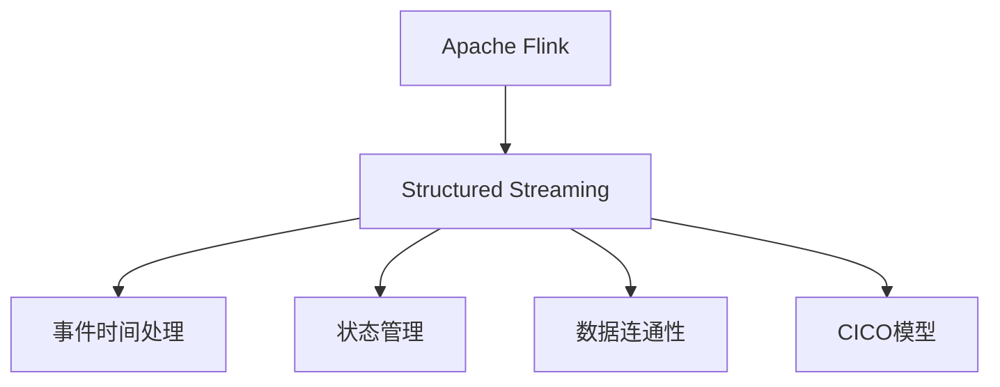

                 

## 1. 背景介绍

### 1.1 问题由来

随着大数据的不断涌现，数据处理的需求日益增长，传统的数据批处理框架无法应对实时性和低延迟的需求。针对这一挑战，Apache Flink社区推出了Stram Processing API，旨在提供更快速、更灵活的数据处理方案。Structured Streaming则是在Apache Spark Streaming的基础上进行改进，引入了结构化流式数据处理的支持，进一步增强了数据处理的灵活性和可扩展性。

### 1.2 问题核心关键点

Structured Streaming的关键点在于其能够处理结构化的流式数据，同时提供高级API，使得数据处理的复杂性和抽象度大大降低。它基于事件时间进行数据处理，支持窗口操作、数据连通性、状态管理等功能，能够处理高吞吐量、高复杂度的流式数据处理任务。

### 1.3 问题研究意义

Structured Streaming的开发和应用对大数据处理领域具有重要意义：

1. **提升实时性**：能够处理实时产生的数据，对时序数据进行及时分析，提高数据处理的实时性和响应速度。
2. **降低开发成本**：提供了丰富的API，降低了数据处理任务的开发难度和成本。
3. **增强可扩展性**：支持水平扩展，适应大规模流式数据处理的需要。
4. **提升数据处理能力**：通过高级API和功能，能够处理更复杂的数据处理任务，如状态管理、数据连通性等。
5. **推动大数据技术发展**：作为Apache Flink的重要组成部分，Structured Streaming的进步对大数据处理技术的发展具有重要推动作用。

## 2. 核心概念与联系

### 2.1 核心概念概述

为更好地理解Structured Streaming的核心原理和架构，本节将介绍几个密切相关的核心概念：

- **Apache Flink**：Apache Flink是一个开源流处理框架，支持流式数据的批处理和流处理，提供高性能、高容错的数据处理能力。
- **Structured Streaming**：Structured Streaming是Apache Flink的一个子项目，提供对结构化流式数据处理的支持，支持高级API和丰富的功能。
- **事件时间处理**：Structured Streaming基于事件时间进行数据处理，能够处理迟到的数据，并支持窗口操作。
- **状态管理**：Structured Streaming支持状态管理，能够维护数据处理过程中的状态信息，如窗口状态、聚合状态等。
- **数据连通性**：Structured Streaming支持数据连通性，能够处理多个流之间的关联，如聚合、连接等操作。
- **CICO模型**：一种基于流的计算模型，支持增量计算和连续计算，能够提高数据处理的效率和灵活性。

这些核心概念之间的逻辑关系可以通过以下Mermaid流程图来展示：



这个流程图展示了几项关键概念之间的相互关系：

1. Structured Streaming基于Apache Flink进行流处理。
2. Structured Streaming支持事件时间处理，能够处理迟到的数据，并支持窗口操作。
3. Structured Streaming支持状态管理，能够维护数据处理过程中的状态信息。
4. Structured Streaming支持数据连通性，能够处理多个流之间的关联。
5. Structured Streaming采用CICO模型，支持增量计算和连续计算，提高数据处理效率和灵活性。

## 3. 核心算法原理 & 具体操作步骤

### 3.1 算法原理概述

Structured Streaming的核心算法原理基于事件时间处理和CICO模型，支持增量计算和连续计算，能够处理高吞吐量、高复杂度的流式数据处理任务。其基本算法流程如下：

1. 将流式数据划分为固定大小的窗口，对每个窗口进行聚合操作。
2. 在事件时间上进行数据处理，处理迟到的数据。
3. 支持状态管理，维护数据处理过程中的状态信息。
4. 支持数据连通性，处理多个流之间的关联。

### 3.2 算法步骤详解

以下详细讲解Structured Streaming的核心算法步骤：

**Step 1: 数据流式输入**
- 使用Structured Streaming API定义数据流的输入源，如Kafka、Flume、HTTP等。
- 通过DataStream API进行数据流处理，定义数据处理逻辑。

**Step 2: 数据处理**
- 对流式数据进行窗口操作，如滑动窗口、全局窗口等。
- 对窗口内的数据进行聚合操作，如求和、计数、分组聚合等。
- 基于事件时间进行数据处理，处理迟到的数据。

**Step 3: 状态管理**
- 使用Structured Streaming的State API定义状态管理逻辑，如窗口状态、聚合状态等。
- 在窗口更新时，更新状态信息。

**Step 4: 数据连通性**
- 使用Structured Streaming的DataFrames API定义数据流之间的关联，如聚合、连接等操作。
- 根据关联逻辑，对多个数据流进行联合处理。

**Step 5: 结果输出**
- 定义数据处理的结果输出方式，如控制台打印、文件写入、HTTP输出等。
- 将处理结果输出到目标位置，完成数据处理任务。

### 3.3 算法优缺点

Structured Streaming算法具有以下优点：

1. **支持事件时间处理**：能够处理迟到的数据，并支持窗口操作，灵活性高。
2. **支持高级API**：提供了丰富的API，降低了数据处理的开发难度和成本。
3. **支持状态管理**：能够维护数据处理过程中的状态信息，增强了数据处理的可靠性。
4. **支持数据连通性**：能够处理多个流之间的关联，提高数据处理的复杂性。
5. **支持CICO模型**：支持增量计算和连续计算，提高数据处理的效率和灵活性。

同时，Structured Streaming也存在一些缺点：

1. **处理复杂度较高**：对于复杂的流式数据处理任务，需要编写大量的代码，增加了开发难度。
2. **性能开销较大**：由于需要维护状态信息，可能对性能造成一定的影响。
3. **API复杂**：API接口较多，需要花费一定时间学习和掌握。
4. **学习曲线陡峭**：对于新手而言，Structured Streaming的API和概念可能需要一定时间熟悉。

### 3.4 算法应用领域

Structured Streaming算法在多个领域具有广泛的应用前景，包括但不限于：

- **金融数据分析**：处理金融市场的交易数据，进行实时分析，及时发现异常交易。
- **网络监控**：处理网络流量数据，进行实时监控，及时发现网络异常。
- **社交媒体分析**：处理社交媒体上的用户数据，进行实时分析，了解用户行为和情感。
- **物联网数据处理**：处理物联网设备产生的数据，进行实时分析，优化设备性能。
- **日志数据分析**：处理日志数据，进行实时分析，及时发现系统异常。

## 4. 数学模型和公式 & 详细讲解 & 举例说明

### 4.1 数学模型构建

Structured Streaming的数学模型主要涉及事件时间处理和窗口操作，以下以滑动窗口为例，构建数学模型：

假设数据流为 $\{d_t\}_{t=1}^{+\infty}$，滑动窗口大小为 $k$，窗口的起始时间为 $t_0$，则窗口内数据集合为 $\{d_{t_0}, d_{t_0+1}, \cdots, d_{t_0+k-1}\}$。

事件时间窗口大小为 $w$，事件时间窗口的起始时间为 $t_0$，则事件时间窗口内数据集合为 $\{d_{t_0}, d_{t_0+w}, d_{t_0+2w}, \cdots, d_{t_0+pw}\}$，其中 $p$ 为窗口数。

事件时间窗口内数据的总事件时间为 $w \times p$，窗口内数据的总事件时间为 $k \times (t_k - t_0)$。

### 4.2 公式推导过程

以下推导滑动窗口的数学模型公式：

**窗口内数据总事件时间**：
$$
T_k = k \times (t_k - t_0)
$$

**事件时间窗口内数据总事件时间**：
$$
T_p = w \times p
$$

**事件时间窗口内数据总事件时间的比例**：
$$
\frac{T_p}{T_k} = \frac{w \times p}{k \times (t_k - t_0)}
$$

**窗口内数据的比例系数**：
$$
\lambda = \frac{k}{w \times p}
$$

### 4.3 案例分析与讲解

以一个简单的例子来说明Structured Streaming的实际应用：

假设有一个实时交易数据流，数据流中每个数据为一个订单，包含订单编号、交易金额、交易时间等字段。现在需要计算每分钟的交易金额总和，并输出到控制台。

**代码实现**：

```python
from pyspark.sql import SparkSession
from pyspark.sql.functions import window, sum

spark = SparkSession.builder.appName("Structured Streaming Example").getOrCreate()

query = (
    spark.readStream
    .format("kafka")
    .option("kafka.bootstrap.servers", "localhost:9092")
    .load()
)

query.writeStream \
    .outputMode("complete") \
    .start()

query.select \
    (window("timestamp", "minute", "minute"), sum("amount") as total_amount) \
    .writeStream \
    .outputMode("complete") \
    .start()

query.stop()
```

**代码解释**：

1. 首先创建一个SparkSession，并定义数据流输入为Kafka。
2. 使用窗口操作，将数据按照分钟进行分组，并计算每分钟的订单总金额。
3. 将计算结果输出到控制台。

通过这个简单的例子，可以看出Structured Streaming的灵活性和易用性。只需要定义数据流输入和处理逻辑，即可快速处理实时数据。

## 5. 项目实践：代码实例和详细解释说明

### 5.1 开发环境搭建

在进行Structured Streaming实践前，我们需要准备好开发环境。以下是使用Python进行PySpark开发的环境配置流程：

1. 安装Anaconda：从官网下载并安装Anaconda，用于创建独立的Python环境。

2. 创建并激活虚拟环境：
```bash
conda create -n pyspark-env python=3.8 
conda activate pyspark-env
```

3. 安装PySpark：根据CUDA版本，从官网获取对应的安装命令。例如：
```bash
conda install pyspark=3.2.0
```

4. 安装各类工具包：
```bash
pip install numpy pandas scikit-learn matplotlib tqdm jupyter notebook ipython
```

完成上述步骤后，即可在`pyspark-env`环境中开始Structured Streaming实践。

### 5.2 源代码详细实现

以下是一个Structured Streaming的完整代码实现示例，用于处理实时金融交易数据，并计算每分钟的交易金额总和：

```python
from pyspark.sql import SparkSession
from pyspark.sql.functions import window, sum

spark = SparkSession.builder.appName("Structured Streaming Example").getOrCreate()

query = (
    spark.readStream
    .format("kafka")
    .option("kafka.bootstrap.servers", "localhost:9092")
    .load()
)

query.writeStream \
    .outputMode("complete") \
    .start()

query.select \
    (window("timestamp", "minute", "minute"), sum("amount") as total_amount) \
    .writeStream \
    .outputMode("complete") \
    .start()

query.stop()
```

**代码解释**：

1. 首先创建一个SparkSession，并定义数据流输入为Kafka。
2. 使用窗口操作，将数据按照分钟进行分组，并计算每分钟的订单总金额。
3. 将计算结果输出到控制台。

### 5.3 代码解读与分析

让我们再详细解读一下关键代码的实现细节：

**DataStream API**：
- 使用`spark.readStream`定义数据流输入，可以从Kafka、HDFS、HTTP等多种数据源中读取数据。
- 使用`.format("kafka").option("kafka.bootstrap.servers", "localhost:9092").load()`将数据流输入Kafka。

**窗口操作**：
- 使用`.window("timestamp", "minute", "minute")`定义滑动窗口，窗口大小为1分钟。
- `sum("amount")`对窗口内数据进行求和。

**窗口结果输出**：
- 使用`query.select(window("timestamp", "minute", "minute"), sum("amount") as total_amount)`将窗口结果作为输出。
- 使用`query.writeStream.outputMode("complete").start()`将输出结果输出到控制台。

**代码优化**：
- 使用`query.stop()`停止查询操作。

可以看到，PySpark的Structured Streaming API使得数据流处理的实现变得简洁高效。开发者可以将更多精力放在数据处理逻辑上，而不必过多关注底层的实现细节。

## 6. 实际应用场景

### 6.1 智能客服系统

Structured Streaming可以在智能客服系统中发挥重要作用，处理来自不同渠道的实时客户请求，进行实时分析和响应。具体而言，可以收集实时客服数据，如聊天记录、用户行为等，通过Structured Streaming进行处理和分析，及时发现异常情况，并自动进行智能回复或转接。

### 6.2 金融舆情监测

Structured Streaming可以实时处理社交媒体、新闻网站等来源的金融舆情数据，进行情感分析和市场情绪监测。具体而言，可以收集实时新闻、微博、论坛等数据，通过Structured Streaming进行处理和分析，及时发现市场情绪变化，预警潜在风险。

### 6.3 个性化推荐系统

Structured Streaming可以实时处理用户行为数据，如浏览记录、点击行为等，进行个性化推荐。具体而言，可以收集实时用户行为数据，通过Structured Streaming进行处理和分析，及时发现用户兴趣变化，并生成个性化的推荐结果。

### 6.4 未来应用展望

随着Structured Streaming技术的发展，其在更多领域将得到广泛应用，为行业带来变革性影响。

在智慧医疗领域，Structured Streaming可以实时处理医疗数据，进行实时分析，辅助医生诊疗，优化医疗资源。

在智能教育领域，Structured Streaming可以实时处理学生学习数据，进行个性化推荐，提高教学效果。

在智慧城市治理中，Structured Streaming可以实时处理城市事件数据，进行实时分析，提升城市治理水平。

此外，在企业生产、社会治理、文娱传媒等众多领域，Structured Streaming也将不断涌现，为行业带来新的技术突破。

## 7. 工具和资源推荐

### 7.1 学习资源推荐

为了帮助开发者系统掌握Structured Streaming的理论基础和实践技巧，这里推荐一些优质的学习资源：

1. Apache Spark官方文档：Apache Spark社区提供了详细的Structured Streaming文档，包括API接口、使用示例等。
2. Apache Spark Streaming书籍：由Apache Spark社区成员撰写，全面介绍了Structured Streaming的实现原理和使用技巧。
3. Structured Streaming实战：由Structured Streaming核心开发团队成员撰写，提供了丰富的代码示例和最佳实践。
4. Data Science from Scratch：这本书虽然不是专门讲解Structured Streaming，但其对大数据处理和Spark生态系统有详细讲解，可以作为Structured Streaming学习的入门参考。

通过对这些资源的学习实践，相信你一定能够快速掌握Structured Streaming的核心思想和实践技巧。

### 7.2 开发工具推荐

高效的开发离不开优秀的工具支持。以下是几款用于Structured Streaming开发的常用工具：

1. PySpark：基于Python的Spark API，提供了丰富的API和操作符，方便进行数据处理和流式计算。
2. Structured Streaming API：Structured Streaming提供的高级API，支持事件时间处理、窗口操作、状态管理等功能。
3. Apache Kafka：Apache Kafka是Spark流式数据处理的重要数据源，提供了高效可靠的消息传递服务。
4. Apache Spark Streaming：Structured Streaming是基于Apache Spark Streaming的升级版本，提供了更强大的功能和更好的性能。

合理利用这些工具，可以显著提升Structured Streaming的开发效率，加快创新迭代的步伐。

### 7.3 相关论文推荐

Structured Streaming技术的发展源于学界的持续研究。以下是几篇奠基性的相关论文，推荐阅读：

1. Structured Streaming: Unified Event-time and Incremental Dataflow Programming in Spark（Structured Streaming原论文）：提出了Structured Streaming的实现原理和设计思想，阐述了事件时间处理和增量计算的实现方法。
2. Real-time Data Processing with Structured Streaming：介绍了Structured Streaming的API接口和功能，提供了丰富的使用示例。
3. Consistency Models for Stream Processing: Consistency as Code（Structured Streaming一致性模型）：探讨了Structured Streaming中一致性模型的实现方法，解决了流式数据处理中的时间一致性问题。

这些论文代表ned Structured Streaming技术的发展脉络。通过学习这些前沿成果，可以帮助研究者把握学科前进方向，激发更多的创新灵感。

## 8. 总结：未来发展趋势与挑战

### 8.1 总结

本文对Structured Streaming的原理与实践进行了全面系统的介绍。首先阐述了Structured Streaming的研究背景和意义，明确了其在实时数据处理中的重要作用。其次，从原理到实践，详细讲解了Structured Streaming的数学模型和关键步骤，给出了实时数据处理的完整代码实例。同时，本文还广泛探讨了Structured Streaming在多个行业领域的应用前景，展示了其强大的灵活性和可扩展性。

通过本文的系统梳理，可以看到，Structured Streaming技术已经成为流式数据处理的重要工具，极大提升了数据处理的实时性和灵活性。未来，伴随技术的发展和应用的深化，Structured Streaming必将在更多的行业领域发挥重要作用，推动大数据技术的进步和应用。

### 8.2 未来发展趋势

展望未来，Structured Streaming技术将呈现以下几个发展趋势：

1. **性能优化**：随着硬件性能的提升，Structured Streaming的性能将进一步优化，支持更高吞吐量和更低延迟。
2. **API丰富化**：随着社区的不断壮大，Structured Streaming的API将更加丰富和灵活，支持更多复杂的数据处理任务。
3. **生态系统完善**：Structured Streaming将与其他大数据生态系统进一步融合，支持更多数据源和数据处理框架。
4. **应用场景拓展**：Structured Streaming将在更多行业领域得到应用，如智慧医疗、智能教育、城市治理等。
5. **社区活跃度提升**：随着社区的不断壮大，Structured Streaming将吸引更多开发者和研究人员参与，形成更加活跃的社区生态。

这些趋势展示了Structured Streaming技术的发展潜力和应用前景。只有不断优化性能、丰富API、完善生态系统，才能使Structured Streaming技术更好地服务于各个行业领域。

### 8.3 面临的挑战

尽管Structured Streaming技术已经取得了重要进展，但在应用过程中仍面临一些挑战：

1. **API复杂性**：Structured Streaming提供了丰富的API，但也需要开发者花费一定时间学习和掌握。
2. **性能瓶颈**：Structured Streaming需要在流式数据处理中进行增量计算和连续计算，可能面临性能瓶颈。
3. **状态管理**：Structured Streaming需要进行状态管理，维护数据处理过程中的状态信息，可能对性能造成一定的影响。
4. **API易用性**：Structured Streaming的API虽然丰富，但也需要开发者在实际应用中进行灵活组合。
5. **学习曲线陡峭**：对于新手而言，Structured Streaming的学习曲线可能较陡峭，需要一定时间熟悉。

这些挑战需要社区和开发者共同努力，不断优化Structured Streaming技术，才能使其实现更大的价值。

### 8.4 研究展望

面对Structured Streaming技术所面临的挑战，未来的研究需要在以下几个方面寻求新的突破：

1. **API简化**：简化API使用，降低学习成本，提高开发者使用Structured Streaming的便捷性。
2. **性能优化**：优化Structured Streaming的性能，支持更高的吞吐量和更低的延迟，满足实际应用的需求。
3. **状态管理优化**：优化状态管理机制，提高性能，支持更大规模的状态维护。
4. **生态系统整合**：整合更多大数据生态系统，支持更多数据源和数据处理框架。
5. **社区建设**：加强社区建设，吸引更多开发者和研究人员参与，形成更加活跃的社区生态。

这些研究方向的探索，必将引领Structured Streaming技术迈向更高的台阶，为大数据处理带来新的突破。

## 9. 附录：常见问题与解答

**Q1：Structured Streaming与Apache Spark Streaming有何区别？**

A: Structured Streaming是基于Apache Spark Streaming的升级版本，支持高级API和结构化流式数据处理。与Spark Streaming相比，Structured Streaming提供了事件时间处理、窗口操作、状态管理等功能，具有更高的灵活性和可扩展性。

**Q2：Structured Streaming在数据处理过程中如何进行状态管理？**

A: Structured Streaming支持状态管理，可以使用State API进行状态定义和管理。状态管理可以是窗口状态、聚合状态等，在窗口更新时，状态信息也会被更新。状态管理可以用于存储中间计算结果，支持复杂的流式数据处理任务。

**Q3：Structured Streaming如何支持事件时间处理？**

A: Structured Streaming基于事件时间进行数据处理，能够处理迟到的数据。通过定义事件时间窗口和窗口操作，Structured Streaming可以支持基于事件时间的操作，提高数据处理的准确性和可靠性。

**Q4：Structured Streaming在实际应用中如何优化性能？**

A: Structured Streaming的性能优化可以从以下几个方面进行：
1. 优化窗口大小，减小窗口数目，提高数据处理效率。
2. 优化状态管理，减少状态存储和维护的开销。
3. 使用增量计算和连续计算，提高数据处理的实时性。
4. 使用多个数据源和数据处理框架，提高数据处理的速度和灵活性。

这些优化措施可以帮助Structured Streaming更好地适应实际应用，满足高吞吐量、高复杂度的数据处理需求。

**Q5：Structured Streaming在实际应用中如何处理数据一致性问题？**

A: Structured Streaming支持一致性模型，可以使用consistent reads和at-least-once semantics等一致性模型，确保数据处理的一致性。通过一致性模型，Structured Streaming可以保证数据处理的一致性和可靠性，防止数据丢失和重复。

---

作者：禅与计算机程序设计艺术 / Zen and the Art of Computer Programming

