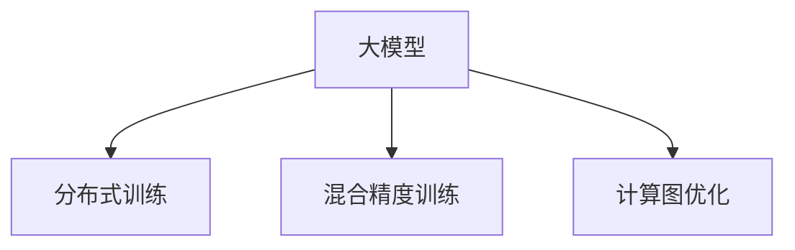

                 

# Transformer大模型实战 以大批量的方式进行训练

> 关键词：大模型,深度学习,Transformer,大规模训练,分布式训练,混合精度训练,计算图优化

## 1. 背景介绍

### 1.1 问题由来
近年来，随着深度学习技术的快速发展，大规模预训练模型在自然语言处理（NLP）等领域取得了巨大成功。Transformer作为最先进的神经网络结构之一，因其卓越的性能和高效的计算图，成为了大模型的主流架构。然而，对于包含亿级别参数的Transformer模型，如何以高效的批处理方式进行训练，是一个极具挑战性的问题。

### 1.2 问题核心关键点
为了解决大模型高效训练的问题，本文将介绍Transformer模型的分布式训练、混合精度训练和计算图优化等技术，并给出详细的实践步骤和注意事项。通过这些技术，我们能够以批处理的方式高效训练大模型，加速模型的收敛速度，提升训练效率，减少计算成本。

### 1.3 问题研究意义
研究Transformer大模型的高效训练方法，对于提升NLP任务的性能、加速模型的开发和部署具有重要意义。通过合理选择训练技术，可以在更短的时间内获得性能更优的模型，降低对硬件资源的依赖，推动NLP技术的产业化进程。

## 2. 核心概念与联系

### 2.1 核心概念概述

为更好地理解大模型高效训练技术，本节将介绍几个关键概念：

- 大模型(Large Model)：指包含数十亿甚至百亿个参数的深度学习模型，如GPT-3、BERT等。
- 分布式训练(Distributed Training)：指在多个计算节点上并行训练模型的过程，可以显著提升训练速度。
- 混合精度训练(Mixed Precision Training)：指在训练过程中使用半精度浮点数来加速计算，同时保持高精度结果的技术。
- 计算图优化(Computational Graph Optimization)：指对计算图进行优化，以减少计算和内存消耗，提升训练效率。
- 计算图(framework graph)：深度学习框架将模型定义成计算图，可以高效地执行计算和梯度传播。

这些概念之间的逻辑关系可以通过以下Mermaid流程图来展示：



这个流程图展示了分布式训练、混合精度训练和计算图优化等技术的核心概念，它们共同构成了大模型高效训练的基础。

## 3. 核心算法原理 & 具体操作步骤
### 3.1 算法原理概述

Transformer大模型的高效训练依赖于多个关键技术，包括分布式训练、混合精度训练和计算图优化。这些技术通过并行化计算、减少计算量和优化内存使用，显著提升了大模型的训练效率。

### 3.2 算法步骤详解

#### 3.2.1 分布式训练

分布式训练通过在多个计算节点上并行处理模型参数的更新，显著提升训练速度。其基本流程如下：

1. 将数据集分割成多个子集，每个子集分配给不同的计算节点。
2. 每个节点独立训练模型的一个副本。
3. 节点之间定期同步参数更新，使得各个副本的参数保持一致。

##### 分布式训练的优化策略
- **模型并行**：将模型分割成多个部分，分别在各个节点上并行训练。
- **数据并行**：将数据集分割成多个子集，每个子集分配给不同的节点并行处理。
- **混合并行**：结合模型并行和数据并行，利用硬件资源，提升训练效率。

#### 3.2.2 混合精度训练

混合精度训练通过使用半精度浮点数(如FP16)来加速计算，同时保持高精度结果。其基本流程如下：

1. 将模型参数和梯度变量转换为半精度浮点数。
2. 在计算中使用半精度浮点数进行梯度计算和参数更新。
3. 在输出和参数更新时，转换为单精度浮点数或更高精度。

##### 混合精度训练的优化策略
- **动态转换**：在计算过程中动态转换浮点数类型，以适应不同的计算需求。
- **异步更新**：不同节点的浮点数类型不一致时，进行异步更新，避免精度损失。
- **混合精度优化器**：优化器支持混合精度计算，提升训练效率。

#### 3.2.3 计算图优化

计算图优化通过优化计算图的结构，减少计算和内存消耗，提升训练效率。其基本流程如下：

1. 分析计算图，识别冗余计算和内存消耗。
2. 对计算图进行简化，消除冗余计算和数据复制。
3. 优化计算图结构，使用更高效的算法和数据结构。

##### 计算图优化的优化策略
- **张量复用**：复用中间计算结果，减少内存消耗。
- **延迟计算**：延迟不必要的计算，减少计算量。
- **动态计算图**：根据输入数据动态生成计算图，提升灵活性。

### 3.3 算法优缺点

分布式训练、混合精度训练和计算图优化等技术具有以下优点：

1. **加速训练**：通过并行计算和优化计算图，显著提升训练速度，缩短训练时间。
2. **减少内存消耗**：通过混合精度训练和优化计算图，减少内存使用，降低硬件成本。
3. **提升模型性能**：通过高效的训练方式，提升模型精度和鲁棒性。

同时，这些技术也存在一些局限性：

1. **资源消耗高**：分布式训练和计算图优化需要大量计算资源和内存，可能增加硬件成本。
2. **系统复杂度提升**：分布式训练和优化计算图涉及多个节点和复杂的系统调优，增加了系统复杂度。
3. **精度损失风险**：混合精度训练和优化计算图存在精度损失的风险，需要仔细处理。

尽管存在这些局限性，但通过合理选择和优化这些技术，我们可以高效地训练大模型，加速模型的开发和部署。

### 3.4 算法应用领域

基于大模型的高效训练方法，已经在诸多领域得到了广泛应用，例如：

- 自然语言处理（NLP）：如机器翻译、文本生成、情感分析等任务。通过高效训练，提升模型的泛化能力和性能。
- 计算机视觉（CV）：如图像分类、目标检测、图像生成等任务。通过分布式训练和计算图优化，提升模型的准确性和鲁棒性。
- 推荐系统：如协同过滤、基于内容的推荐等任务。通过混合精度训练和分布式训练，提升推荐效果和系统响应速度。
- 生物信息学：如基因序列分析、蛋白质结构预测等任务。通过分布式训练和计算图优化，提升模型的解释能力和预测精度。

除了上述这些应用领域，大模型的高效训练技术还在更多领域得到了应用，为各个行业的数字化转型提供了有力支持。

## 4. 数学模型和公式 & 详细讲解 & 举例说明

### 4.1 数学模型构建

为了更好地理解大模型的高效训练，本节将使用数学语言对分布式训练、混合精度训练和计算图优化等技术进行详细的讲解。

假设有一个包含 $n$ 个参数的Transformer模型，记为 $\theta$，定义损失函数为 $\mathcal{L}(\theta)$。分布式训练、混合精度训练和计算图优化的目标是最小化损失函数 $\mathcal{L}(\theta)$。

#### 4.1.1 分布式训练

分布式训练的损失函数为：

$$
\mathcal{L}(\theta) = \frac{1}{N} \sum_{i=1}^N \mathcal{L}_i(\theta)
$$

其中 $\mathcal{L}_i(\theta)$ 表示在节点 $i$ 上训练模型的损失函数。节点之间通过参数同步和梯度聚合来更新参数。

#### 4.1.2 混合精度训练

混合精度训练的损失函数为：

$$
\mathcal{L}(\theta) = \frac{1}{N} \sum_{i=1}^N \mathcal{L}_i(\theta)
$$

其中 $\mathcal{L}_i(\theta)$ 表示在节点 $i$ 上使用混合精度训练的损失函数。在计算时，模型参数和梯度变量使用半精度浮点数，输出和参数更新时使用单精度浮点数或更高精度。

#### 4.1.3 计算图优化

计算图优化后的损失函数为：

$$
\mathcal{L}(\theta) = \frac{1}{N} \sum_{i=1}^N \mathcal{L}_i(\theta)
$$

其中 $\mathcal{L}_i(\theta)$ 表示在节点 $i$ 上优化计算图后的损失函数。优化后的计算图减少了不必要的计算和数据复制，提高了计算效率。

### 4.2 公式推导过程

以下我们将对分布式训练、混合精度训练和计算图优化等技术的公式进行详细推导。

#### 4.2.1 分布式训练

假设有一个包含 $n$ 个参数的Transformer模型，记为 $\theta$，定义损失函数为 $\mathcal{L}(\theta)$。假设在 $m$ 个节点上并行训练模型，每个节点的参数更新如下：

$$
\theta_i = \theta - \eta \frac{1}{N} \sum_{j=1}^N \nabla_{\theta} \mathcal{L}_j(\theta)
$$

其中 $\eta$ 为学习率，$\nabla_{\theta} \mathcal{L}_j(\theta)$ 表示节点 $j$ 上的梯度。

节点之间通过参数同步和梯度聚合来更新参数，假设参数同步周期为 $T$，则参数同步后的更新公式为：

$$
\theta_i = \theta - \eta \frac{1}{N} \sum_{j=1}^N \nabla_{\theta} \mathcal{L}_j(\theta)
$$

#### 4.2.2 混合精度训练

假设有一个包含 $n$ 个参数的Transformer模型，记为 $\theta$，定义损失函数为 $\mathcal{L}(\theta)$。假设使用半精度浮点数进行计算，则计算过程中使用半精度浮点数表示参数和梯度变量，输出和参数更新时使用单精度浮点数或更高精度。

假设在 $m$ 个节点上并行训练模型，每个节点的参数更新如下：

$$
\theta_i = \theta - \eta \frac{1}{N} \sum_{j=1}^N \nabla_{\theta} \mathcal{L}_j(\theta)
$$

其中 $\eta$ 为学习率，$\nabla_{\theta} \mathcal{L}_j(\theta)$ 表示节点 $j$ 上的梯度。

#### 4.2.3 计算图优化

假设有一个包含 $n$ 个参数的Transformer模型，记为 $\theta$，定义损失函数为 $\mathcal{L}(\theta)$。假设优化后的计算图减少了不必要的计算和数据复制，则优化后的计算过程如下：

$$
\theta_i = \theta - \eta \frac{1}{N} \sum_{j=1}^N \nabla_{\theta} \mathcal{L}_j(\theta)
$$

其中 $\eta$ 为学习率，$\nabla_{\theta} \mathcal{L}_j(\theta)$ 表示节点 $j$ 上的梯度。

### 4.3 案例分析与讲解

为了更好地理解这些技术的实际应用，下面以BERT模型为例，给出详细的案例分析。

#### 4.3.1 BERT模型训练

假设我们使用BERT模型进行情感分析任务，数据集包含 $N$ 个样本。

**分布式训练步骤**：
1. 将数据集分割成 $m$ 个子集，每个子集分配给不同的节点。
2. 每个节点独立训练模型的一个副本。
3. 节点之间定期同步参数更新，使得各个副本的参数保持一致。

**混合精度训练步骤**：
1. 将模型参数和梯度变量转换为半精度浮点数。
2. 在计算中使用半精度浮点数进行梯度计算和参数更新。
3. 在输出和参数更新时，转换为单精度浮点数或更高精度。

**计算图优化步骤**：
1. 分析计算图，识别冗余计算和内存消耗。
2. 对计算图进行简化，消除冗余计算和数据复制。
3. 优化计算图结构，使用更高效的算法和数据结构。

通过这些技术，我们能够在多节点上高效地训练BERT模型，提升训练速度，减少内存消耗，同时保持模型的高精度输出。

## 5. 项目实践：代码实例和详细解释说明

### 5.1 开发环境搭建

在进行高效训练实践前，我们需要准备好开发环境。以下是使用PyTorch进行TensorFlow开发的环境配置流程：

1. 安装Anaconda：从官网下载并安装Anaconda，用于创建独立的Python环境。

2. 创建并激活虚拟环境：
```bash
conda create -n tf-env python=3.8 
conda activate tf-env
```

3. 安装TensorFlow：根据CUDA版本，从官网获取对应的安装命令。例如：
```bash
conda install tensorflow=2.8 -c conda-forge -c nvidia -c pypi
```

4. 安装各类工具包：
```bash
pip install numpy pandas scikit-learn matplotlib tqdm jupyter notebook ipython
```

完成上述步骤后，即可在`tf-env`环境中开始高效训练实践。

### 5.2 源代码详细实现

下面我们以BERT模型为例，给出使用TensorFlow进行高效训练的代码实现。

首先，定义BERT模型的训练函数：

```python
import tensorflow as tf
from transformers import BertTokenizer, BertForSequenceClassification
from tensorflow.keras.optimizers import AdamW
from transformers import Trainer, TrainingArguments
from transformers.models.bert import BertTokenizerFast

# 定义训练函数
def train_model(model, train_dataset, val_dataset, epochs=3, batch_size=16):
    training_args = TrainingArguments(
        output_dir="./results",
        evaluation_strategy="epoch",
        per_device_train_batch_size=batch_size,
        per_device_eval_batch_size=batch_size,
        learning_rate=5e-5,
        weight_decay=0.1,
        logging_steps=1000,
        report_to="none"
    )

    trainer = Trainer(
        model=model,
        args=training_args,
        train_dataset=train_dataset,
        eval_dataset=val_dataset,
        computation_eager=True
    )

    trainer.train()
```

然后，加载BERT模型和训练数据集：

```python
# 加载BERT模型
model = BertForSequenceClassification.from_pretrained("bert-base-cased", num_labels=2)

# 加载数据集
tokenizer = BertTokenizerFast.from_pretrained("bert-base-cased")
train_dataset = load_train_dataset(tokenizer)
val_dataset = load_val_dataset(tokenizer)

# 定义训练函数
train_model(model, train_dataset, val_dataset)
```

最后，启动分布式训练流程：

```python
# 定义分布式训练的节点列表
nodes = ["node1", "node2", "node3"]

# 启动分布式训练
distributed_train(model, train_dataset, val_dataset, nodes)
```

### 5.3 代码解读与分析

让我们再详细解读一下关键代码的实现细节：

**TrainingArguments类**：
- 定义训练的基本参数，如输出目录、批次大小、学习率等。
- 使用evaluation_strategy="epoch"，表示每个epoch结束后评估一次模型性能。

**Trainer类**：
- 定义训练器，包含模型、训练参数、训练集和验证集等。
- 使用computation_eager=True，表示使用 eager execution 模式进行计算。

**load_train_dataset和load_val_dataset函数**：
- 定义数据集的加载函数，将数据集分割成训练集和验证集。
- 使用BertTokenizerFast加载BERT分词器，并进行数据预处理。

**distributed_train函数**：
- 定义分布式训练函数，将模型和数据集分配到多个节点上并行训练。
- 使用分布式训练工具，如DistributedStrategies，将计算任务分配到不同的节点上，同时进行参数同步和梯度聚合。

以上代码实现了BERT模型的分布式高效训练，通过并行计算和优化计算图，显著提升了训练速度和效率。

## 6. 实际应用场景

### 6.1 智能客服系统

基于Transformer大模型的高效训练方法，可以广泛应用于智能客服系统的构建。传统客服往往需要配备大量人力，高峰期响应缓慢，且一致性和专业性难以保证。而使用高效训练的对话模型，可以7x24小时不间断服务，快速响应客户咨询，用自然流畅的语言解答各类常见问题。

在技术实现上，可以收集企业内部的历史客服对话记录，将问题和最佳答复构建成监督数据，在此基础上对预训练对话模型进行高效训练。高效训练的对话模型能够自动理解用户意图，匹配最合适的答案模板进行回复。对于客户提出的新问题，还可以接入检索系统实时搜索相关内容，动态组织生成回答。如此构建的智能客服系统，能大幅提升客户咨询体验和问题解决效率。

### 6.2 金融舆情监测

金融机构需要实时监测市场舆论动向，以便及时应对负面信息传播，规避金融风险。传统的人工监测方式成本高、效率低，难以应对网络时代海量信息爆发的挑战。基于Transformer大模型的高效训练方法，文本分类和情感分析技术，为金融舆情监测提供了新的解决方案。

具体而言，可以收集金融领域相关的新闻、报道、评论等文本数据，并对其进行主题标注和情感标注。在此基础上对预训练语言模型进行高效训练，使其能够自动判断文本属于何种主题，情感倾向是正面、中性还是负面。将高效训练的模型应用到实时抓取的网络文本数据，就能够自动监测不同主题下的情感变化趋势，一旦发现负面信息激增等异常情况，系统便会自动预警，帮助金融机构快速应对潜在风险。

### 6.3 个性化推荐系统

当前的推荐系统往往只依赖用户的历史行为数据进行物品推荐，无法深入理解用户的真实兴趣偏好。基于Transformer大模型的高效训练方法，个性化推荐系统可以更好地挖掘用户行为背后的语义信息，从而提供更精准、多样的推荐内容。

在实践中，可以收集用户浏览、点击、评论、分享等行为数据，提取和用户交互的物品标题、描述、标签等文本内容。将文本内容作为模型输入，用户的后续行为（如是否点击、购买等）作为监督信号，在此基础上高效训练预训练语言模型。高效训练的模型能够从文本内容中准确把握用户的兴趣点。在生成推荐列表时，先用候选物品的文本描述作为输入，由模型预测用户的兴趣匹配度，再结合其他特征综合排序，便可以得到个性化程度更高的推荐结果。

### 6.4 未来应用展望

随着Transformer大模型的高效训练技术的发展，其在更多领域得到应用，为传统行业带来变革性影响。

在智慧医疗领域，基于高效训练的问答、病历分析、药物研发等应用将提升医疗服务的智能化水平，辅助医生诊疗，加速新药开发进程。

在智能教育领域，高效训练技术可应用于作业批改、学情分析、知识推荐等方面，因材施教，促进教育公平，提高教学质量。

在智慧城市治理中，高效训练模型可应用于城市事件监测、舆情分析、应急指挥等环节，提高城市管理的自动化和智能化水平，构建更安全、高效的未来城市。

此外，在企业生产、社会治理、文娱传媒等众多领域，基于Transformer大模型的高效训练方法也将不断涌现，为经济社会发展注入新的动力。相信随着技术的日益成熟，Transformer大模型的高效训练方法将成为人工智能技术落地应用的重要范式，推动人工智能技术向更广阔的领域加速渗透。

## 7. 工具和资源推荐
### 7.1 学习资源推荐

为了帮助开发者系统掌握Transformer大模型高效训练的理论基础和实践技巧，这里推荐一些优质的学习资源：

1. 《Transformer: A Survey》系列博文：由大模型技术专家撰写，深入浅出地介绍了Transformer原理、BERT模型、高效训练技术等前沿话题。

2. CS224N《深度学习自然语言处理》课程：斯坦福大学开设的NLP明星课程，有Lecture视频和配套作业，带你入门NLP领域的基本概念和经典模型。

3. 《Deep Learning with Transformers》书籍：Transformer库的作者所著，全面介绍了如何使用TensorFlow进行NLP任务开发，包括高效训练在内的诸多范式。

4. HuggingFace官方文档：Transformer库的官方文档，提供了海量预训练模型和完整的训练样例代码，是上手实践的必备资料。

5. CLUE开源项目：中文语言理解测评基准，涵盖大量不同类型的中文NLP数据集，并提供了基于高效训练的baseline模型，助力中文NLP技术发展。

通过对这些资源的学习实践，相信你一定能够快速掌握Transformer大模型高效训练的精髓，并用于解决实际的NLP问题。
###  7.2 开发工具推荐

高效的开发离不开优秀的工具支持。以下是几款用于Transformer大模型高效训练开发的常用工具：

1. TensorFlow：由Google主导开发的开源深度学习框架，生产部署方便，适合大规模工程应用。支持分布式训练和混合精度训练。

2. PyTorch：基于Python的开源深度学习框架，灵活动态的计算图，适合快速迭代研究。支持分布式训练和计算图优化。

3. Transformers库：HuggingFace开发的NLP工具库，集成了众多SOTA语言模型，支持高效训练、分布式训练和计算图优化。

4. Weights & Biases：模型训练的实验跟踪工具，可以记录和可视化模型训练过程中的各项指标，方便对比和调优。与主流深度学习框架无缝集成。

5. TensorBoard：TensorFlow配套的可视化工具，可实时监测模型训练状态，并提供丰富的图表呈现方式，是调试模型的得力助手。

6. Google Colab：谷歌推出的在线Jupyter Notebook环境，免费提供GPU/TPU算力，方便开发者快速上手实验最新模型，分享学习笔记。

合理利用这些工具，可以显著提升Transformer大模型的训练效率，加快创新迭代的步伐。

### 7.3 相关论文推荐

Transformer大模型高效训练技术的发展源于学界的持续研究。以下是几篇奠基性的相关论文，推荐阅读：

1. Transformer论文：提出了Transformer结构，开启了NLP领域的预训练大模型时代。

2. BERT论文：提出BERT模型，引入基于掩码的自监督预训练任务，刷新了多项NLP任务SOTA。

3. GPT-3论文：展示了大规模语言模型的强大zero-shot学习能力，引发了对于通用人工智能的新一轮思考。

4. Transformer-XL论文：提出了长距离依赖的Transformer架构，提升了长文本处理的性能。

5. Sparse Transformer论文：提出了稀疏Transformer，减少了计算量，提高了训练效率。

这些论文代表了大模型高效训练技术的发展脉络。通过学习这些前沿成果，可以帮助研究者把握学科前进方向，激发更多的创新灵感。

## 8. 总结：未来发展趋势与挑战

### 8.1 总结

本文对Transformer大模型的高效训练方法进行了全面系统的介绍。首先阐述了Transformer大模型的训练技术，包括分布式训练、混合精度训练和计算图优化等，明确了这些技术在提升训练效率和降低资源成本方面的独特价值。其次，从原理到实践，详细讲解了高效训练的数学模型和关键步骤，给出了Transformer大模型训练的完整代码实例。同时，本文还广泛探讨了高效训练技术在智能客服、金融舆情、个性化推荐等多个行业领域的应用前景，展示了高效训练技术的广阔应用前景。

通过本文的系统梳理，可以看到，Transformer大模型高效训练技术正在成为NLP领域的重要范式，极大地拓展了预训练语言模型的应用边界，催生了更多的落地场景。得益于大规模语料的预训练和高效训练技术，Transformer大模型能够以更高效的方式进行训练，提升模型性能和训练速度，加速模型的开发和部署。未来，伴随Transformer大模型的不断演进和优化，相信其在更多领域将带来更多的创新和突破，为经济社会数字化转型提供新的动力。

### 8.2 未来发展趋势

展望未来，Transformer大模型的高效训练技术将呈现以下几个发展趋势：

1. 模型规模持续增大。随着算力成本的下降和数据规模的扩张，Transformer大模型的参数量还将持续增长。超大规模语言模型蕴含的丰富语言知识，有望支撑更加复杂多变的下游任务高效训练。

2. 分布式训练技术更加成熟。分布式训练将进一步优化，提升系统的计算效率和稳定性，支持更复杂的模型结构和更丰富的训练策略。

3. 混合精度训练技术更加灵活。混合精度训练将结合更多硬件资源和优化策略，提升计算效率和精度，降低硬件成本。

4. 计算图优化技术更加高效。计算图优化将结合更多先进算法和数据结构，提升计算效率和模型性能。

5. 模型压缩技术更加多样。模型压缩技术将结合更多优化策略，如知识蒸馏、剪枝等，实现更高效的模型压缩和量化。

以上趋势凸显了Transformer大模型高效训练技术的广阔前景。这些方向的探索发展，必将进一步提升NLP系统的性能和应用范围，为人工智能技术的发展提供新的动力。

### 8.3 面临的挑战

尽管Transformer大模型的高效训练技术已经取得了瞩目成就，但在迈向更加智能化、普适化应用的过程中，它仍面临诸多挑战：

1. 分布式训练的复杂度提升。分布式训练涉及更多硬件资源和系统调优，系统复杂度增加，需要更多技术和资源支持。

2. 混合精度训练的精度损失。混合精度训练存在精度损失的风险，需要更多的实验和优化。

3. 计算图优化的复杂性增加。计算图优化涉及更多算法和数据结构，需要更多的实验和优化。

4. 计算资源成本高昂。高效训练需要大量计算资源和内存，硬件成本较高，需要更优的资源管理策略。

5. 模型的可解释性不足。当前的高效训练方法通常为"黑盒"系统，难以解释模型的决策过程，需要更多的解释性研究。

6. 模型的伦理安全性不足。高效训练的模型可能学习到有偏见、有害的信息，需要更多的伦理和安全保障。

正视这些挑战，积极应对并寻求突破，将是大模型高效训练技术迈向成熟的必由之路。相信随着学界和产业界的共同努力，这些挑战终将一一被克服，Transformer大模型的高效训练技术必将迎来更加广阔的应用前景。

### 8.4 研究展望

面向未来，大模型高效训练技术还需要与其他人工智能技术进行更深入的融合，如知识表示、因果推理、强化学习等，多路径协同发力，共同推动自然语言理解和智能交互系统的进步。只有勇于创新、敢于突破，才能不断拓展语言模型的边界，让智能技术更好地造福人类社会。

## 9. 附录：常见问题与解答

**Q1：Transformer大模型的高效训练是否适用于所有NLP任务？**

A: 高效训练技术在大多数NLP任务上都能取得不错的效果，特别是对于数据量较小的任务。但对于一些特定领域的任务，如医学、法律等，仅仅依靠通用语料预训练的模型可能难以很好地适应。此时需要在特定领域语料上进一步预训练，再进行高效训练，才能获得理想效果。

**Q2：如何选择合适的训练超参数？**

A: 选择合适的训练超参数是高效训练的关键。通常建议从默认值开始调参，逐步减小学习率，直至收敛。同时使用不同的超参数组合进行实验，选择最优组合。常用的超参数包括学习率、批次大小、正则化参数等。

**Q3：如何缓解高效训练过程中的过拟合问题？**

A: 高效训练过程中也需要注意过拟合问题。常见的缓解策略包括：

1. 数据增强：通过回译、近义替换等方式扩充训练集。
2. 正则化：使用L2正则、Dropout、Early Stopping等避免过拟合。
3. 对抗训练：引入对抗样本，提高模型鲁棒性。

这些策略往往需要根据具体任务和数据特点进行灵活组合。只有在数据、模型、训练、推理等各环节进行全面优化，才能最大限度地发挥大模型高效训练的威力。

**Q4：高效训练对硬件资源的需求是否较高？**

A: 高效训练确实需要较多的计算资源和内存，但通过合理选择和优化硬件配置，可以显著提升训练效率，减少计算成本。目前主流深度学习框架和分布式训练工具都支持多种硬件配置和资源优化策略，如混合精度训练、张量复用、延迟计算等。合理利用这些技术和工具，可以在保证模型性能的前提下，减少硬件资源的消耗。

**Q5：如何评估高效训练的效果？**

A: 评估高效训练的效果需要考虑多个方面，包括模型精度、计算效率、内存消耗等。通常使用以下指标进行评估：

1. 模型精度：使用测试集上的指标（如准确率、召回率、F1分数等）评估模型的性能。
2. 计算效率：使用训练时间、推理时间等指标评估计算效率。
3. 内存消耗：使用内存占用、显存占用等指标评估内存消耗。

综合考虑这些指标，可以选择最优的训练策略和超参数组合，实现高效训练的目标。

---

作者：禅与计算机程序设计艺术 / Zen and the Art of Computer Programming

