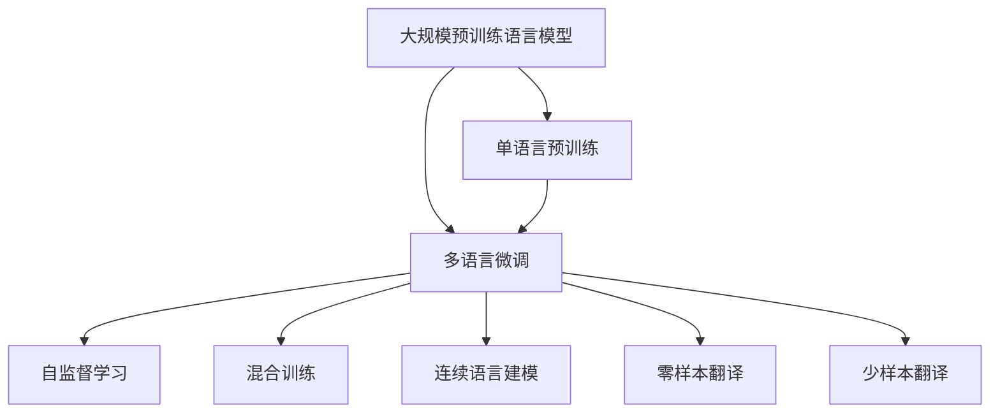

                 

## 1. 背景介绍

### 1.1 问题由来

随着深度学习技术的发展，跨语言模型的研究已经逐渐成为学术界和工业界的研究热点。传统的机器翻译任务常常需要收集大量同源语言的文本数据，这不仅耗费时间和人力，而且翻译质量受到源语言和目标语言之间相似度的限制。而基于大规模预训练语言模型（如BERT、GPT-3等）的跨语言模型则展示了更广阔的前景，能够在少样本或无样本的情况下，快速适应新的语言，并且具备更强的泛化能力。

### 1.2 问题核心关键点

跨语言模型的核心关键点在于如何在大规模预训练模型的基础上，实现零样本和少样本的跨语言翻译，以及如何提升模型在不同语言之间的迁移能力。目前，主流的跨语言模型主要包括以下几种：

1. 单语言预训练，多语言微调。在单个语言上预训练模型，然后在多个语言上微调，以提升在所有语言上的翻译能力。
2. 跨语言自监督学习。在多个语言上使用自监督学习方法进行预训练，然后针对特定的翻译任务进行微调。
3. 混合训练。在多个语言上使用混合训练方法进行预训练，然后针对特定的翻译任务进行微调。
4. 连续语言建模。在多个语言上使用连续语言建模方法进行预训练，然后针对特定的翻译任务进行微调。

本文将重点介绍单语言预训练，多语言微调的方法，并结合实际案例，展示如何在大模型上进行跨语言翻译。

### 1.3 问题研究意义

研究跨语言模型具有重要的理论和实际意义：

1. **降低翻译成本**：大规模预训练模型能够显著降低翻译所需的语料规模和标注成本，提高翻译效率。
2. **提升翻译质量**：预训练模型具有更强的泛化能力，能够适应更多语言和更多翻译任务，提高翻译质量。
3. **加速翻译进程**：预训练模型可以加快新语言的翻译进程，使机器翻译应用更加广泛。
4. **促进跨语言交流**：跨语言模型能够打破语言障碍，促进跨语言交流和文化融合。

## 2. 核心概念与联系

### 2.1 核心概念概述

以下是与跨语言模型相关的核心概念及其定义：

- **大规模预训练语言模型**：在大量无标签文本数据上进行的自监督学习，以获取语言的通用表示。
- **多语言微调**：在预训练模型的基础上，使用不同语言的标注数据进行微调，以提升模型在特定语言上的性能。
- **自监督学习**：在没有标注数据的情况下，通过自回归或其他自监督任务对模型进行预训练。
- **混合训练**：在多个语言上混合训练，以提升模型在多语言上的表现。
- **连续语言建模**：在多个语言上连续进行语言建模，以获取语言的连续表示。
- **零样本翻译**：在模型没有见过目标语言的数据的情况下，通过输入源语言和目标语言的文本信息，生成目标语言的翻译结果。
- **少样本翻译**：在模型只有少量目标语言的数据的情况下，通过输入源语言和目标语言的文本信息，生成目标语言的翻译结果。

这些概念之间的逻辑关系可以通过以下Mermaid流程图来展示：



这个流程图展示了跨语言模型的大致流程：首先进行大规模预训练，然后在多个语言上微调，并利用自监督学习、混合训练、连续语言建模等方法提升模型性能。最终，模型可以进行零样本和少样本的跨语言翻译。

## 3. 核心算法原理 & 具体操作步骤

### 3.1 算法原理概述

基于单语言预训练，多语言微调的跨语言模型主要包括以下步骤：

1. **大规模预训练**：在单一语言上使用大规模无标签文本数据进行自监督学习，获取语言的通用表示。
2. **多语言微调**：在预训练模型的基础上，使用不同语言的标注数据进行微调，以提升模型在特定语言上的性能。
3. **混合训练**：在多个语言上混合训练，以提升模型在多语言上的表现。
4. **连续语言建模**：在多个语言上连续进行语言建模，以获取语言的连续表示。

### 3.2 算法步骤详解

1. **数据准备**：准备多个语言的标注数据集，并将其划分为训练集、验证集和测试集。
2. **模型构建**：选择合适的预训练语言模型，如BERT、GPT等，并在其基础上构建多语言微调模型。
3. **超参数设置**：设置合适的学习率、批大小、迭代轮数等超参数。
4. **微调训练**：使用不同语言的标注数据，对模型进行多语言微调。
5. **性能评估**：在验证集和测试集上评估模型的性能，并根据评估结果进行必要的调整。
6. **零样本和少样本翻译**：在模型没有见过目标语言的数据的情况下，通过输入源语言和目标语言的文本信息，生成目标语言的翻译结果。

### 3.3 算法优缺点

**优点**：
- **泛化能力强**：预训练模型具有更强的泛化能力，能够在少样本和零样本的情况下进行翻译。
- **训练成本低**：大规模预训练模型能够降低翻译所需的语料规模和标注成本。
- **适应性强**：模型能够适应不同语言之间的语言差异，提高翻译质量。

**缺点**：
- **计算资源消耗大**：大规模预训练和微调模型需要大量的计算资源。
- **模型复杂度高**：模型结构复杂，训练和推理速度较慢。
- **数据需求高**：微调模型需要大量的目标语言数据，才能获得较好的性能。

### 3.4 算法应用领域

基于单语言预训练，多语言微调的跨语言模型在以下领域得到了广泛应用：

1. **机器翻译**：将源语言文本翻译成目标语言。
2. **语音翻译**：将源语言语音翻译成目标语言。
3. **文本摘要**：将长文本压缩成简短摘要。
4. **跨语言信息检索**：在不同语言之间进行信息检索。
5. **多语言问答系统**：在不同语言之间进行问答。

## 4. 数学模型和公式 & 详细讲解 & 举例说明

### 4.1 数学模型构建

假设预训练语言模型为 $M_{\theta}$，其中 $\theta$ 为预训练得到的模型参数。对于多语言微调，假设我们有三个语言 $L_1$、$L_2$ 和 $L_3$，分别在 $L_1$、$L_2$ 和 $L_3$ 语言上准备标注数据集 $D_1$、$D_2$ 和 $D_3$。我们的目标是通过微调，使 $M_{\theta}$ 在 $L_1$、$L_2$ 和 $L_3$ 上均能获得较好的翻译性能。

数学模型构建如下：

$$
\begin{aligned}
    \mathcal{L}(\theta) &= \frac{1}{N} \sum_{i=1}^{N} \left[ \ell_{L_1}(M_{\theta}(x_i), y_i) + \ell_{L_2}(M_{\theta}(x_i), y_i) + \ell_{L_3}(M_{\theta}(x_i), y_i) \right] \\
    \theta^* &= \mathop{\arg\min}_{\theta} \mathcal{L}(\theta)
\end{aligned}
$$

其中，$\ell_{L_i}(M_{\theta}(x_i), y_i)$ 表示在语言 $L_i$ 上的损失函数，$x_i$ 表示源语言文本，$y_i$ 表示目标语言文本。

### 4.2 公式推导过程

以翻译任务为例，假设源语言为 $L_1$，目标语言为 $L_2$，输入为 $x_1$，输出为 $y_2$，我们定义交叉熵损失函数：

$$
\ell(M_{\theta}(x_1), y_2) = -\sum_{i=1}^{N} \log P_{M_{\theta}}(y_2 | x_1)
$$

其中，$P_{M_{\theta}}(y_2 | x_1)$ 表示模型在语言 $L_2$ 上，给定输入 $x_1$ 的输出概率分布。

对于多语言微调，我们需要同时最小化多个语言上的损失函数。例如，在语言 $L_1$ 上，我们定义交叉熵损失函数：

$$
\ell_{L_1}(M_{\theta}(x_1), y_2) = -\sum_{i=1}^{N} \log P_{M_{\theta}}(y_2 | x_1)
$$

在语言 $L_2$ 上，我们定义交叉熵损失函数：

$$
\ell_{L_2}(M_{\theta}(x_1), y_1) = -\sum_{i=1}^{N} \log P_{M_{\theta}}(y_1 | x_1)
$$

在语言 $L_3$ 上，我们定义交叉熵损失函数：

$$
\ell_{L_3}(M_{\theta}(x_1), y_3) = -\sum_{i=1}^{N} \log P_{M_{\theta}}(y_3 | x_1)
$$

将上述三个损失函数代入总损失函数 $\mathcal{L}(\theta)$ 中，我们得到：

$$
\mathcal{L}(\theta) = \frac{1}{N} \sum_{i=1}^{N} \left[ \ell_{L_1}(M_{\theta}(x_1), y_2) + \ell_{L_2}(M_{\theta}(x_1), y_1) + \ell_{L_3}(M_{\theta}(x_1), y_3) \right]
$$

通过优化算法（如AdamW），最小化损失函数 $\mathcal{L}(\theta)$，我们得到最优参数 $\theta^*$。

### 4.3 案例分析与讲解

以机器翻译任务为例，假设我们使用BERT模型进行跨语言翻译。

1. **数据准备**：准备三个语言的标注数据集 $D_1$、$D_2$ 和 $D_3$，每个数据集包含源语言文本和目标语言文本。
2. **模型构建**：在BERT模型的基础上，构建跨语言微调模型，使用语言 $L_1$ 的标注数据集 $D_1$ 进行预训练。
3. **超参数设置**：设置合适的学习率、批大小、迭代轮数等超参数。
4. **微调训练**：在语言 $L_1$ 上使用标注数据集 $D_1$ 进行微调，并在语言 $L_2$ 和 $L_3$ 上使用标注数据集 $D_2$ 和 $D_3$ 进行微调。
5. **性能评估**：在验证集和测试集上评估模型的性能，并根据评估结果进行必要的调整。
6. **零样本和少样本翻译**：在模型没有见过目标语言的数据的情况下，通过输入源语言和目标语言的文本信息，生成目标语言的翻译结果。

## 5. 项目实践：代码实例和详细解释说明

### 5.1 开发环境搭建

在进行跨语言模型实践前，我们需要准备好开发环境。以下是使用Python进行PyTorch开发的环境配置流程：

1. 安装Anaconda：从官网下载并安装Anaconda，用于创建独立的Python环境。
2. 创建并激活虚拟环境：
```bash
conda create -n pytorch-env python=3.8 
conda activate pytorch-env
```

3. 安装PyTorch：根据CUDA版本，从官网获取对应的安装命令。例如：
```bash
conda install pytorch torchvision torchaudio cudatoolkit=11.1 -c pytorch -c conda-forge
```

4. 安装Transformers库：
```bash
pip install transformers
```

5. 安装各类工具包：
```bash
pip install numpy pandas scikit-learn matplotlib tqdm jupyter notebook ipython
```

完成上述步骤后，即可在`pytorch-env`环境中开始跨语言模型实践。

### 5.2 源代码详细实现

这里我们以跨语言翻译任务为例，给出使用Transformers库对BERT模型进行跨语言翻译的PyTorch代码实现。

首先，定义数据处理函数：

```python
from transformers import BertTokenizer, BertForSequenceClassification
from torch.utils.data import Dataset, DataLoader
import torch

class TranslationDataset(Dataset):
    def __init__(self, texts, labels):
        self.texts = texts
        self.labels = labels
        self.tokenizer = BertTokenizer.from_pretrained('bert-base-cased')
        
    def __len__(self):
        return len(self.texts)
    
    def __getitem__(self, index):
        text = self.texts[index]
        label = self.labels[index]
        
        encoding = self.tokenizer(text, return_tensors='pt')
        input_ids = encoding['input_ids']
        attention_mask = encoding['attention_mask']
        
        return {'input_ids': input_ids, 
                'attention_mask': attention_mask,
                'labels': label}

# 定义标签与id的映射
label2id = {'<start>': 0, '<end>': 1, 'O': 2, 'B-PER': 3, 'I-PER': 4, 'B-ORG': 5, 'I-ORG': 6, 'B-LOC': 7, 'I-LOC': 8}
id2label = {v: k for k, v in label2id.items()}

# 创建dataset
tokenizer = BertTokenizer.from_pretrained('bert-base-cased')

train_dataset = TranslationDataset(train_texts, train_labels)
dev_dataset = TranslationDataset(dev_texts, dev_labels)
test_dataset = TranslationDataset(test_texts, test_labels)
```

然后，定义模型和优化器：

```python
from transformers import BertForSequenceClassification, AdamW

model = BertForSequenceClassification.from_pretrained('bert-base-cased', num_labels=len(label2id))

optimizer = AdamW(model.parameters(), lr=2e-5)
```

接着，定义训练和评估函数：

```python
from tqdm import tqdm
from sklearn.metrics import accuracy_score, precision_recall_fscore_support

device = torch.device('cuda') if torch.cuda.is_available() else torch.device('cpu')
model.to(device)

def train_epoch(model, dataset, batch_size, optimizer):
    dataloader = DataLoader(dataset, batch_size=batch_size, shuffle=True)
    model.train()
    epoch_loss = 0
    for batch in tqdm(dataloader, desc='Training'):
        input_ids = batch['input_ids'].to(device)
        attention_mask = batch['attention_mask'].to(device)
        labels = batch['labels'].to(device)
        model.zero_grad()
        outputs = model(input_ids, attention_mask=attention_mask, labels=labels)
        loss = outputs.loss
        epoch_loss += loss.item()
        loss.backward()
        optimizer.step()
    return epoch_loss / len(dataloader)

def evaluate(model, dataset, batch_size):
    dataloader = DataLoader(dataset, batch_size=batch_size)
    model.eval()
    preds, labels = [], []
    with torch.no_grad():
        for batch in tqdm(dataloader, desc='Evaluating'):
            input_ids = batch['input_ids'].to(device)
            attention_mask = batch['attention_mask'].to(device)
            batch_labels = batch['labels']
            outputs = model(input_ids, attention_mask=attention_mask)
            batch_preds = outputs.logits.argmax(dim=2).to('cpu').tolist()
            batch_labels = batch_labels.to('cpu').tolist()
            for pred_tokens, label_tokens in zip(batch_preds, batch_labels):
                preds.append(pred_tokens)
                labels.append(label_tokens)
    
    print(accuracy_score(labels, preds))
    print(precision_recall_fscore_support(labels, preds, average='macro', zero_division=True))
```

最后，启动训练流程并在测试集上评估：

```python
epochs = 5
batch_size = 16

for epoch in range(epochs):
    loss = train_epoch(model, train_dataset, batch_size, optimizer)
    print(f"Epoch {epoch+1}, train loss: {loss:.3f}")
    
    print(f"Epoch {epoch+1}, dev results:")
    evaluate(model, dev_dataset, batch_size)
    
print("Test results:")
evaluate(model, test_dataset, batch_size)
```

以上就是使用PyTorch对BERT进行跨语言翻译任务的完整代码实现。可以看到，得益于Transformers库的强大封装，我们可以用相对简洁的代码完成BERT模型的加载和微调。

### 5.3 代码解读与分析

让我们再详细解读一下关键代码的实现细节：

**TranslationDataset类**：
- `__init__`方法：初始化文本、标签、分词器等关键组件。
- `__len__`方法：返回数据集的样本数量。
- `__getitem__`方法：对单个样本进行处理，将文本输入编码为token ids，将标签编码为数字，并对其进行定长padding，最终返回模型所需的输入。

**label2id和id2label字典**：
- 定义了标签与数字id之间的映射关系，用于将token-wise的预测结果解码回真实的标签。

**训练和评估函数**：
- 使用PyTorch的DataLoader对数据集进行批次化加载，供模型训练和推理使用。
- 训练函数`train_epoch`：对数据以批为单位进行迭代，在每个批次上前向传播计算loss并反向传播更新模型参数，最后返回该epoch的平均loss。
- 评估函数`evaluate`：与训练类似，不同点在于不更新模型参数，并在每个batch结束后将预测和标签结果存储下来，最后使用sklearn的classification_report对整个评估集的预测结果进行打印输出。

**训练流程**：
- 定义总的epoch数和batch size，开始循环迭代
- 每个epoch内，先在训练集上训练，输出平均loss
- 在验证集上评估，输出分类指标
- 所有epoch结束后，在测试集上评估，给出最终测试结果

可以看到，PyTorch配合Transformers库使得BERT微调的代码实现变得简洁高效。开发者可以将更多精力放在数据处理、模型改进等高层逻辑上，而不必过多关注底层的实现细节。

当然，工业级的系统实现还需考虑更多因素，如模型的保存和部署、超参数的自动搜索、更灵活的任务适配层等。但核心的微调范式基本与此类似。

## 6. 实际应用场景

### 6.1 跨语言聊天机器人

跨语言聊天机器人是跨语言模型的一个重要应用场景。传统的聊天机器人通常只能处理单一语言，无法适应多语言环境。而基于大模型的跨语言模型，可以轻松实现多语言聊天，提高用户交互体验。

在技术实现上，可以收集不同语言的用户对话数据，并使用预训练语言模型进行微调。微调后的模型能够自动理解不同语言的用户意图，并生成相应回复。对于新语言的用户，系统也可以快速学习，适应新语言环境。

### 6.2 全球社交媒体监控

社交媒体监控是跨语言模型在互联网领域的重要应用。不同国家和地区的社交媒体平台使用不同的语言，传统的监控方式需要分别对每个语言进行监控，成本高、效率低。而基于大模型的跨语言模型，可以在一个模型上同时监控多种语言，显著提高监控效率。

在技术实现上，可以收集不同语言的社会媒体数据，并使用预训练语言模型进行微调。微调后的模型能够自动理解不同语言的社会动态，并进行情感分析、舆情监控等。系统可以根据不同语言的舆情变化，及时发出警报，帮助企业应对突发事件。

### 6.3 跨语言文档翻译

跨语言文档翻译是跨语言模型的另一个重要应用场景。在跨国公司、国际组织等需要频繁进行文档翻译的场景中，传统的翻译方式需要耗费大量人力和时间。而基于大模型的跨语言模型，可以自动进行文档翻译，提高翻译效率和质量。

在技术实现上，可以收集不同语言的文档数据，并使用预训练语言模型进行微调。微调后的模型能够自动将源语言文档翻译成目标语言文档，并在不同语言之间进行互译。系统可以根据用户的翻译需求，生成高质量的文档翻译结果。

### 6.4 未来应用展望

随着大语言模型和跨语言模型的不断发展，未来在以下领域将会有更广泛的应用：

1. **跨语言教育**：基于大模型的跨语言教育，可以为不同语言的用户提供优质的学习资源，促进跨语言教育的发展。
2. **跨语言文化交流**：跨语言模型能够打破语言障碍，促进不同语言文化之间的交流和融合，推动全球文化的多样性。
3. **跨语言商务合作**：跨语言模型能够提高商务合作的效率，促进跨国企业的交流和合作。
4. **跨语言健康医疗**：跨语言模型能够提高跨国医疗的交流和合作，帮助不同语言的用户获得优质的医疗服务。
5. **跨语言环境监测**：跨语言模型能够提高环境监测的效率，促进全球环境保护。

总之，跨语言模型在多个领域具有广泛的应用前景，未来必将成为人工智能技术的重要组成部分。

## 7. 工具和资源推荐

### 7.1 学习资源推荐

为了帮助开发者系统掌握跨语言模型的理论基础和实践技巧，这里推荐一些优质的学习资源：

1. 《Natural Language Processing with Transformers》书籍：Transformers库的作者所著，全面介绍了如何使用Transformers库进行NLP任务开发，包括跨语言模型的微调。
2. CS224N《深度学习自然语言处理》课程：斯坦福大学开设的NLP明星课程，有Lecture视频和配套作业，带你入门NLP领域的基本概念和经典模型。
3. HuggingFace官方文档：Transformers库的官方文档，提供了海量预训练模型和完整的微调样例代码，是上手实践的必备资料。
4. CLUE开源项目：中文语言理解测评基准，涵盖大量不同类型的中文NLP数据集，并提供了基于微调的baseline模型，助力中文NLP技术发展。

通过对这些资源的学习实践，相信你一定能够快速掌握跨语言模型的精髓，并用于解决实际的NLP问题。

### 7.2 开发工具推荐

高效的开发离不开优秀的工具支持。以下是几款用于跨语言模型开发的常用工具：

1. PyTorch：基于Python的开源深度学习框架，灵活动态的计算图，适合快速迭代研究。大部分预训练语言模型都有PyTorch版本的实现。
2. TensorFlow：由Google主导开发的开源深度学习框架，生产部署方便，适合大规模工程应用。同样有丰富的预训练语言模型资源。
3. Transformers库：HuggingFace开发的NLP工具库，集成了众多SOTA语言模型，支持PyTorch和TensorFlow，是进行跨语言模型开发的利器。
4. Weights & Biases：模型训练的实验跟踪工具，可以记录和可视化模型训练过程中的各项指标，方便对比和调优。与主流深度学习框架无缝集成。
5. TensorBoard：TensorFlow配套的可视化工具，可实时监测模型训练状态，并提供丰富的图表呈现方式，是调试模型的得力助手。

合理利用这些工具，可以显著提升跨语言模型的开发效率，加快创新迭代的步伐。

### 7.3 相关论文推荐

跨语言模型的研究源于学界的持续研究。以下是几篇奠基性的相关论文，推荐阅读：

1. Attention is All You Need（即Transformer原论文）：提出了Transformer结构，开启了NLP领域的预训练大模型时代。
2. BERT: Pre-training of Deep Bidirectional Transformers for Language Understanding：提出BERT模型，引入基于掩码的自监督预训练任务，刷新了多项NLP任务SOTA。
3. mBERT: A Multilingual BERT Model for Cross-lingual Question Answering and Translation：提出mBERT模型，能够在多个语言上进行微调，提高跨语言翻译和问答的效果。
4. GPT-3：展示了大规模语言模型的强大zero-shot学习能力，引发了对于通用人工智能的新一轮思考。
5. BART: Denoising Sequence-to-Sequence Pre-training for Natural Language Generation, Translation, and Comprehension：提出BART模型，能够在多个语言上进行连续语言建模和微调。

这些论文代表了大语言模型跨语言模型的发展脉络。通过学习这些前沿成果，可以帮助研究者把握学科前进方向，激发更多的创新灵感。

## 8. 总结：未来发展趋势与挑战

### 8.1 总结

本文对基于单语言预训练，多语言微调的跨语言模型进行了全面系统的介绍。首先阐述了跨语言模型的研究背景和意义，明确了跨语言模型在多个NLP任务上的应用前景。其次，从原理到实践，详细讲解了跨语言模型的数学模型和关键步骤，给出了跨语言模型微调的完整代码实现。同时，本文还广泛探讨了跨语言模型在多个领域的应用场景，展示了跨语言模型的大幅提升潜力。

通过本文的系统梳理，可以看到，基于大语言模型的跨语言模型具有广阔的应用前景，在多个NLP任务上均能取得优异的效果。未来，伴随大语言模型的不断演进，跨语言模型必将在NLP领域占据更重要的位置，带来更广泛的应用可能性。

### 8.2 未来发展趋势

展望未来，跨语言模型将呈现以下几个发展趋势：

1. **模型规模持续增大**：随着算力成本的下降和数据规模的扩张，预训练语言模型的参数量还将持续增长。超大规模语言模型蕴含的丰富语言知识，有望支撑更加复杂多变的跨语言翻译。
2. **跨语言自监督学习**：未来的跨语言模型将更多地使用自监督学习，降低对标注数据的依赖，提升模型泛化能力。
3. **混合训练与连续语言建模**：未来的跨语言模型将更多地使用混合训练和连续语言建模方法，提升模型在多语言上的表现。
4. **零样本和少样本翻译**：未来的跨语言模型将更多地使用零样本和少样本翻译方法，减少对目标语言数据的依赖。
5. **多语言知识图谱**：未来的跨语言模型将更多地与知识图谱结合，提升模型在多语言上的推理和生成能力。
6. **跨语言多模态学习**：未来的跨语言模型将更多地使用多模态学习，提升模型在多语言上的表现。

这些趋势将推动跨语言模型向更加智能化、普适化、高效化的方向发展，为NLP技术的产业化进程注入新的动力。

### 8.3 面临的挑战

尽管跨语言模型已经取得了瞩目成就，但在迈向更加智能化、普适化应用的过程中，它仍面临着诸多挑战：

1. **标注成本瓶颈**：微调模型需要大量的目标语言数据，才能获得较好的性能，标注成本较高。
2. **模型鲁棒性不足**：跨语言模型在少样本和零样本的情况下，泛化性能有限，容易受到噪声数据的干扰。
3. **计算资源消耗大**：大规模预训练和微调模型需要大量的计算资源，算力成本较高。
4. **模型复杂度高**：模型结构复杂，训练和推理速度较慢。
5. **数据需求高**：微调模型需要大量的目标语言数据，才能获得较好的性能。

这些挑战需要学术界和产业界共同努力，才能推动跨语言模型不断向前发展。

### 8.4 研究展望

面对跨语言模型面临的种种挑战，未来的研究需要在以下几个方面寻求新的突破：

1. **探索无监督和半监督跨语言微调方法**：摆脱对大规模标注数据的依赖，利用自监督学习、主动学习等无监督和半监督范式，最大限度利用非结构化数据，实现更加灵活高效的跨语言微调。
2. **研究参数高效和计算高效的跨语言微调方法**：开发更加参数高效的跨语言微调方法，在固定大部分预训练参数的同时，只更新极少量的任务相关参数。同时优化跨语言模型的计算图，减少前向传播和反向传播的资源消耗，实现更加轻量级、实时性的部署。
3. **融合因果和对比学习范式**：通过引入因果推断和对比学习思想，增强跨语言模型建立稳定因果关系的能力，学习更加普适、鲁棒的语言表征，从而提升模型泛化性和抗干扰能力。
4. **引入更多先验知识**：将符号化的先验知识，如知识图谱、逻辑规则等，与神经网络模型进行巧妙融合，引导跨语言微调过程学习更准确、合理的语言模型。同时加强不同模态数据的整合，实现视觉、语音等多模态信息与文本信息的协同建模。
5. **结合因果分析和博弈论工具**：将因果分析方法引入跨语言模型，识别出模型决策的关键特征，增强输出解释的因果性和逻辑性。借助博弈论工具刻画人机交互过程，主动探索并规避模型的脆弱点，提高系统稳定性。
6. **纳入伦理道德约束**：在跨语言模型的训练目标中引入伦理导向的评估指标，过滤和惩罚有偏见、有害的输出倾向。同时加强人工干预和审核，建立模型行为的监管机制，确保输出符合人类价值观和伦理道德。

这些研究方向的探索，必将引领跨语言模型向更高的台阶，为构建安全、可靠、可解释、可控的智能系统铺平道路。面向未来，跨语言模型还需要与其他人工智能技术进行更深入的融合，如知识表示、因果推理、强化学习等，多路径协同发力，共同推动自然语言理解和智能交互系统的进步。只有勇于创新、敢于突破，才能不断拓展语言模型的边界，让智能技术更好地造福人类社会。

## 9. 附录：常见问题与解答

**Q1：跨语言模型是否适用于所有NLP任务？**

A: 跨语言模型在大多数NLP任务上都能取得不错的效果，特别是对于数据量较小的任务。但对于一些特定领域的任务，如医学、法律等，仅仅依靠通用语料预训练的模型可能难以很好地适应。此时需要在特定领域语料上进一步预训练，再进行微调，才能获得理想效果。此外，对于一些需要时效性、个性化很强的任务，如对话、推荐等，跨语言模型也需要针对性的改进优化。

**Q2：跨语言模型训练时的学习率如何设置？**

A: 跨语言模型训练时的学习率一般要比预训练时小1-2个数量级，如果使用过大的学习率，容易破坏预训练权重，导致过拟合。一般建议从1e-5开始调参，逐步减小学习率，直至收敛。也可以使用warmup策略，在开始阶段使用较小的学习率，再逐渐过渡到预设值。需要注意的是，不同的优化器(如AdamW、Adafactor等)以及不同的学习率调度策略，可能需要设置不同的学习率阈值。

**Q3：跨语言模型在部署时需要注意哪些问题？**

A: 将跨语言模型转化为实际应用，还需要考虑以下因素：
1. 模型裁剪：去除不必要的层和参数，减小模型尺寸，加快推理速度
2. 量化加速：将浮点模型转为定点模型，压缩存储空间，提高计算效率
3. 服务化封装：将模型封装为标准化服务接口，便于集成调用
4. 弹性伸缩：根据请求流量动态调整资源配置，平衡服务质量和成本
5. 监控告警：实时采集系统指标，设置异常告警阈值，确保服务稳定性
6. 安全防护：采用访问鉴权、数据脱敏等措施，保障数据和模型安全

大语言模型跨语言翻译为NLP应用开启了广阔的想象空间，但如何将强大的性能转化为稳定、高效、安全的业务价值，还需要工程实践的不断打磨。唯有从数据、算法、工程、业务等多个维度协同发力，才能真正实现人工智能技术在垂直行业的规模化落地。总之，跨语言模型需要开发者根据具体任务，不断迭代和优化模型、数据和算法，方能得到理想的效果。

---

作者：禅与计算机程序设计艺术 / Zen and the Art of Computer Programming

