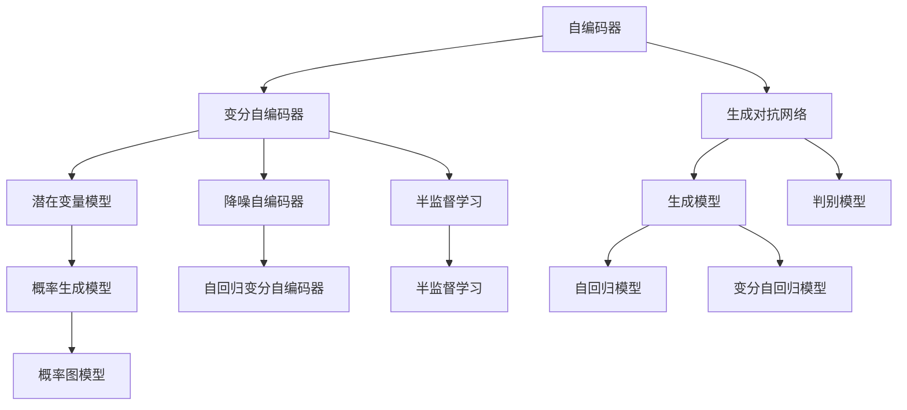
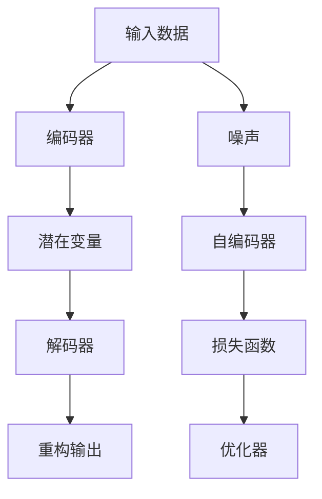

                 

## 1. 背景介绍

### 1.1 问题由来

在深度学习技术飞速发展的今天，无监督学习(unsupervised learning)作为一种高效且强大的学习方式，已经成为数据科学和人工智能领域的重要分支。无监督学习与有监督学习(supervised learning)、强化学习(reinforcement learning)并称为机器学习的三个重要范式，通过在大规模无标签数据上进行自我发现，学习数据的内在结构与规律，为有监督学习、模型压缩、特征工程等提供基础。

无监督学习的应用领域极其广泛，覆盖了自然语言处理、计算机视觉、推荐系统、数据挖掘等多个方向。近年来，随着深度学习技术的成熟和算力的提升，基于神经网络的自编码器(autoencoder)、变分自编码器(variational autoencoder)、生成对抗网络(generative adversarial networks, GANs)等方法，已经成为无监督学习领域的重要算法工具，大大推动了无监督学习的理论发展和应用实践。

### 1.2 问题核心关键点

无监督学习的核心思想是：通过未标记的数据样本，自动学习数据的内在结构与规律，并从中抽取有用的信息。无监督学习的优势在于：

1. **数据依赖性低**：不需要标注样本，数据获取成本低，模型训练速度更快。
2. **泛化能力高**：模型能够学习到更加广泛的模式，应对未知数据的能力更强。
3. **先验知识少**：对先验知识的要求低，可适应更多领域和任务。

然而，无监督学习也面临一些挑战：

1. **模型复杂性高**：需要更多的训练时间和计算资源。
2. **结果解释性差**：模型学习到的结构难以解释，难以调试和优化。
3. **优化困难**：优化目标不明确，训练过程容易陷入局部最优解。
4. **可解释性不足**：模型输出难以解释，缺乏理论支持。

尽管面临这些挑战，无监督学习仍然在学术界和工业界得到了广泛的研究和应用。本文将详细介绍无监督学习的基本原理、关键算法、应用实例，并展望其未来发展趋势。

## 2. 核心概念与联系

### 2.1 核心概念概述

无监督学习涉及多个核心概念，包括自编码器、变分自编码器、生成对抗网络、聚类算法等。这些概念之间的关系可以通过以下Mermaid流程图进行展示：



这个流程图展示了无监督学习的核心概念及其之间的联系：

1. 自编码器是基本的无监督学习算法，通过重构输入数据，学习数据的压缩表示。
2. 变分自编码器通过引入变分分布，使得重构误差可以更精确地逼近数据分布。
3. 生成对抗网络通过对抗训练，学习更加真实的生成模型。
4 潜变量模型用于建模数据的隐含结构和概率分布。
5 聚类算法通过学习数据的分布，实现无监督的群体划分。
6 概率生成模型通过建模数据分布，生成新的样本。
7 概率图模型用于建模变量之间的关系，优化推理过程。
8 半监督学习通过少量标签数据进行优化，提升模型泛化能力。

这些核心概念共同构成了无监督学习的基础，使得模型能够从无标签数据中学习到有用的信息，为有监督学习、模型压缩等任务提供支持。

### 2.2 核心概念原理和架构的 Mermaid 流程图

以下是一个简化的自编码器模型的架构和训练流程的Mermaid流程图：



这个流程图展示了自编码器模型的基本架构和训练流程：

1. 输入数据通过编码器映射到潜在变量空间，解码器再将潜在变量映射回输入空间。
2. 重构输出与输入数据之间的差异，称为重构误差，用于优化模型。
3 损失函数通常是重构误差加上正则项，用于约束模型参数。
4 优化器用于最小化损失函数，调整模型参数。

自编码器的训练流程通过优化重构误差来完成，即最小化输入数据与重构输出之间的差异。这一过程可以看作是一个自监督学习的过程，无需标注数据，仅通过数据本身进行训练。

## 3. 核心算法原理 & 具体操作步骤

### 3.1 算法原理概述

无监督学习的核心算法包括自编码器、变分自编码器、生成对抗网络等。这些算法的核心思想是：通过未标记数据，学习数据的潜在分布和结构，从而实现数据的降维、生成、分类等任务。

#### 自编码器

自编码器是一种最简单的无监督学习算法，其目标是重建输入数据的表示，即通过一个编码器(encoder)将输入映射到潜在变量空间，再通过一个解码器(decoder)将潜在变量映射回输入空间。自编码器由编码器和解码器组成，其训练目标是使得重构误差最小化。

#### 变分自编码器

变分自编码器是对自编码器的改进，通过引入变分分布，使得重构误差可以更精确地逼近数据分布。其核心思想是：将数据分布视为一个复杂的概率分布，通过学习一个变分分布来近似这个复杂的概率分布。

#### 生成对抗网络

生成对抗网络由一个生成器(generator)和一个判别器(discriminator)组成。生成器的目标是生成逼真的数据样本，而判别器的目标是区分生成数据和真实数据。通过对抗训练，生成器可以生成更加逼真的数据样本，判别器可以更好地区分真实数据和生成数据。

### 3.2 算法步骤详解

以下以变分自编码器为例，详细介绍其操作步骤。

#### 步骤 1: 准备数据集

首先需要准备一个包含大规模未标注数据的数据集。这些数据集可以来源于各种领域，如自然语言处理中的文本数据，计算机视觉中的图像数据等。

#### 步骤 2: 定义模型架构

定义变分自编码器的编码器和解码器结构。编码器将输入数据映射到潜在变量空间，解码器将潜在变量映射回输入空间。潜在变量可以是连续的向量，也可以是离散的隐含变量。

#### 步骤 3: 定义损失函数

变分自编码器的损失函数通常由两部分组成：重构误差和变分下界。重构误差是输入数据和重构输出之间的差异，变分下界则是通过最大化生成数据与真实数据之间的KL散度，逼近真实数据分布。

#### 步骤 4: 优化模型

使用优化算法(如Adam)最小化损失函数，训练模型。训练过程中，需要调整编码器和解码器的参数，使得重构误差和变分下界都尽可能小。

#### 步骤 5: 评估模型

评估训练好的模型，使用测试集对模型的重构误差和变分下界进行评估，检查模型的泛化能力。

### 3.3 算法优缺点

#### 优点

1. **无需标注数据**：无监督学习不需要标注数据，数据获取成本低，训练速度更快。
2. **泛化能力高**：模型能够学习到更加广泛的模式，应对未知数据的能力更强。
3. **先验知识少**：对先验知识的要求低，可适应更多领域和任务。

#### 缺点

1. **模型复杂性高**：需要更多的训练时间和计算资源。
2. **结果解释性差**：模型学习到的结构难以解释，难以调试和优化。
3. **优化困难**：优化目标不明确，训练过程容易陷入局部最优解。
4. **可解释性不足**：模型输出难以解释，缺乏理论支持。

### 3.4 算法应用领域

无监督学习在多个领域都有广泛的应用，包括但不限于以下几方面：

#### 自然语言处理

无监督学习在自然语言处理领域有着广泛的应用，如文本聚类、主题建模、文本摘要等。通过无监督学习，可以自动发现文本中的主题和结构，从而实现文本的聚类和摘要。

#### 计算机视觉

在计算机视觉领域，无监督学习可以用于图像的降维、特征提取、图像生成等任务。例如，通过自编码器可以将图像压缩为低维表示，从而减少计算成本和存储需求。

#### 推荐系统

在推荐系统中，无监督学习可以用于协同过滤、用户画像生成、商品分类等任务。通过无监督学习，可以自动发现用户和商品之间的关系，从而实现更加精准的推荐。

#### 数据挖掘

无监督学习可以用于数据挖掘中的聚类、关联规则发现、异常检测等任务。通过无监督学习，可以自动发现数据中的内在结构和模式，从而实现数据的分析和挖掘。

## 4. 数学模型和公式 & 详细讲解

### 4.1 数学模型构建

假设我们有一个包含 $n$ 个样本的数据集 $D=\{(x_i,y_i)\}_{i=1}^n$，其中 $x_i$ 表示样本，$y_i$ 表示标签。我们的目标是通过无监督学习，自动学习数据的分布 $p(x)$。

在变分自编码器中，我们定义一个变分分布 $q(z|x)$，用于逼近数据的分布 $p(x)$。变分分布 $q(z|x)$ 通常由一个高斯分布或伯努利分布构成。

### 4.2 公式推导过程

变分自编码器的损失函数通常由两部分组成：重构误差和变分下界。重构误差是输入数据和重构输出之间的差异，变分下界则是通过最大化生成数据与真实数据之间的KL散度，逼近真实数据分布。

假设 $z$ 是潜在变量，$h(x)$ 是编码器，$g(z)$ 是解码器，$x$ 是输入数据。则重构误差可以表示为：

$$
L_{rec} = \mathbb{E}_{q(z|x)}[(z-h(x))^2]
$$

其中，$h(x)$ 表示编码器将输入数据 $x$ 映射到潜在变量 $z$ 的表示。

变分下界可以表示为：

$$
L_{var} = \mathbb{E}_{q(z|x)}[\log q(z|x)] - \mathbb{E}_{q(z|x)}[\log p(x|z)] + \mathbb{E}_{q(z|x)}[\log p(z)] - \mathbb{E}_{q(z|x)}[\log q(z|x)]
$$

其中，$k$ 是KL散度，$k(z|x)$ 表示变分分布 $q(z|x)$ 和真实数据分布 $p(x|z)$ 之间的KL散度。

变分自编码器的总损失函数可以表示为：

$$
L = L_{rec} + L_{var}
$$

### 4.3 案例分析与讲解

下面以一个简单的手写数字识别任务为例，说明无监督学习的应用。

假设我们有一个包含 $10$ 个数字的手写图像数据集 $D$，我们的目标是自动学习图像的分布。我们使用变分自编码器来学习图像的分布。

定义一个简单的高斯分布作为变分分布：

$$
q(z|x) = \mathcal{N}(z; \mu(x), \sigma(x))
$$

其中，$\mu(x)$ 和 $\sigma(x)$ 表示变分分布的均值和方差。

使用一个简单的卷积神经网络作为编码器和解码器：

$$
h(x) = conv(x; \theta_h)
$$

$$
g(z) = conv(z; \theta_g)
$$

其中，$\theta_h$ 和 $\theta_g$ 表示编码器和解码器的权重。

重构误差可以表示为：

$$
L_{rec} = \mathbb{E}_{q(z|x)}[(z-h(x))^2]
$$

变分下界可以表示为：

$$
L_{var} = \mathbb{E}_{q(z|x)}[\log q(z|x)] - \mathbb{E}_{q(z|x)}[\log p(x|z)] + \mathbb{E}_{q(z|x)}[\log p(z)] - \mathbb{E}_{q(z|x)}[\log q(z|x)]
$$

训练过程中，我们需要最小化总损失函数 $L = L_{rec} + L_{var}$。

## 5. 项目实践：代码实例和详细解释说明

### 5.1 开发环境搭建

在进行无监督学习项目开发前，我们需要准备好开发环境。以下是使用Python进行TensorFlow开发的环境配置流程：

1. 安装Anaconda：从官网下载并安装Anaconda，用于创建独立的Python环境。

2. 创建并激活虚拟环境：
```bash
conda create -n tf-env python=3.8 
conda activate tf-env
```

3. 安装TensorFlow：从官网获取对应的安装命令。例如：
```bash
pip install tensorflow
```

4. 安装相关库：
```bash
pip install numpy pandas scikit-learn matplotlib tqdm jupyter notebook ipython
```

完成上述步骤后，即可在`tf-env`环境中开始无监督学习项目开发。

### 5.2 源代码详细实现

这里我们以手写数字识别为例，给出使用TensorFlow实现变分自编码器的代码实现。

首先，定义变分自编码器的编码器和解码器：

```python
import tensorflow as tf
import tensorflow_probability as tfp

# 定义编码器
class Encoder(tf.keras.Model):
    def __init__(self):
        super(Encoder, self).__init__()
        self.conv1 = tf.keras.layers.Conv2D(32, 3, activation='relu')
        self.conv2 = tf.keras.layers.Conv2D(64, 3, activation='relu')
        self.flatten = tf.keras.layers.Flatten()
        self.dense1 = tf.keras.layers.Dense(128, activation='relu')
        self.mean = tf.keras.layers.Dense(10)
        self.logvar = tf.keras.layers.Dense(10)

    def call(self, inputs):
        x = self.conv1(inputs)
        x = tf.nn.max_pool(x, 2, 2)
        x = self.conv2(x)
        x = tf.nn.max_pool(x, 2, 2)
        x = self.flatten(x)
        x = self.dense1(x)
        mean = self.mean(x)
        logvar = self.logvar(x)
        return mean, logvar

# 定义解码器
class Decoder(tf.keras.Model):
    def __init__(self):
        super(Decoder, self).__init__()
        self.dense1 = tf.keras.layers.Dense(128, activation='relu')
        self.dense2 = tf.keras.layers.Dense(28 * 28, activation='sigmoid')
        self.reshape = tf.keras.layers.Reshape((28, 28, 1))

    def call(self, inputs):
        x = self.dense1(inputs)
        x = self.dense2(x)
        x = self.reshape(x)
        return x
```

然后，定义变分自编码器模型和损失函数：

```python
# 定义变分自编码器模型
class VAE(tf.keras.Model):
    def __init__(self, encoder, decoder):
        super(VAE, self).__init__()
        self.encoder = encoder
        self.decoder = decoder

    def call(self, inputs):
        mean, logvar = self.encoder(inputs)
        z = tf.random.normal(shape=(tf.shape(inputs)[0], 10))
        z = tfp.distributions.Normal(mean, tf.exp(logvar)).sample()
        outputs = self.decoder(z)
        return outputs

# 定义损失函数
def loss_function(reconstructions, latent, mean, logvar):
    reconstruction_loss = tf.reduce_mean(tf.square(reconstructions - inputs))
    kl_loss = -0.5 * tf.reduce_mean(1 + logvar - tf.square(mean) - tf.exp(logvar))
    total_loss = reconstruction_loss + kl_loss
    return total_loss
```

最后，训练模型：

```python
# 定义训练函数
def train(vae, train_dataset, epochs):
    total_loss = tf.keras.metrics.Mean()
    for epoch in range(epochs):
        for batch in train_dataset:
            with tf.GradientTape() as tape:
                reconstructions = vae(tf.reshape(batch[0], (32, 28, 28, 1)))
                loss = loss_function(reconstructions, latent, mean, logvar)
            gradients = tape.gradient(loss, vae.trainable_variables)
            optimizer.apply_gradients(zip(gradients, vae.trainable_variables))
            train_loss(total_loss.update_state(loss))
    print('Total train loss:', total_loss.result())

# 训练模型
vae = VAE(encoder, decoder)
optimizer = tf.keras.optimizers.Adam()
inputs = tf.keras.layers.Input(shape=(28, 28, 1))
reconstructions = vae(inputs)
mean = vae.encoder(tf.reshape(inputs, (32, 28, 28, 1)))[0]
logvar = vae.encoder(tf.reshape(inputs, (32, 28, 28, 1)))[1]
model = tf.keras.Model(inputs, reconstructions)
model.compile(optimizer=optimizer, loss=loss_function)
model.summary()
train(model, train_dataset, epochs=100)
```

以上就是使用TensorFlow实现变分自编码器的完整代码实现。可以看到，通过TensorFlow的Keras API，代码实现非常简单直观，便于理解和调试。

### 5.3 代码解读与分析

让我们再详细解读一下关键代码的实现细节：

**VAE类**：
- `__init__`方法：初始化编码器和解码器，将其封装为VAE模型。
- `call`方法：定义VAE的前向传播过程，包括编码、解码、采样、重构等步骤。

**loss_function函数**：
- 计算重构误差和KL散度损失，并返回总损失。

**train函数**：
- 定义训练过程，循环迭代训练集上的每个批次，使用梯度下降优化模型参数。

在TensorFlow中，无监督学习的实现主要依靠TensorFlow的Keras API，它提供了高级的API，使得无监督学习的实现变得简单、直观。开发者可以利用Keras提供的各种层、优化器等组件，快速搭建和训练无监督学习模型。

## 6. 实际应用场景

### 6.1 自然语言处理

无监督学习在自然语言处理领域有着广泛的应用，如文本聚类、主题建模、文本摘要等。以下以文本聚类为例，说明无监督学习的应用。

假设我们有一个包含大量新闻文本的数据集，我们的目标是自动发现其中的主题和结构。我们可以使用LDA(latent Dirichlet allocation)算法来实现文本聚类。

LDA算法基于贝叶斯推断，通过建模文本中的主题分布和词分布，自动发现文本中的主题结构。LDA算法的核心思想是：将文本看作一个多项式分布，其中每个文本对应一个主题分布，每个主题对应一个词分布。通过最大化先验概率和似然概率，LDA算法可以自动学习文本中的主题结构。

### 6.2 计算机视觉

在计算机视觉领域，无监督学习可以用于图像的降维、特征提取、图像生成等任务。以下以图像降维为例，说明无监督学习的应用。

假设我们有一个包含大量手写数字图像的数据集，我们的目标是自动学习图像的低维表示。我们可以使用自编码器来实现图像降维。

自编码器将高维图像压缩为低维表示，再通过解码器将低维表示还原为高维图像。通过训练自编码器，可以自动学习图像的低维表示，从而实现图像的降维。

### 6.3 推荐系统

在推荐系统中，无监督学习可以用于协同过滤、用户画像生成、商品分类等任务。以下以协同过滤为例，说明无监督学习的应用。

假设我们有一个包含大量用户和商品的数据集，我们的目标是自动发现用户和商品之间的关系，从而实现个性化推荐。我们可以使用无监督学习算法来实现协同过滤。

协同过滤算法通过分析用户和商品之间的相似性，自动发现用户和商品之间的关系。协同过滤算法的核心思想是：通过计算用户之间的相似性，找到与目标用户相似的用户，从而推荐相似用户的喜好。

### 6.4 未来应用展望

随着无监督学习技术的不断发展，未来的应用领域将更加广泛，涉及更多的学科和行业。以下是一些可能的未来应用方向：

#### 自动驾驶

自动驾驶技术需要实时处理大量的传感器数据，包括摄像头、激光雷达等数据。无监督学习可以用于自动驾驶中的目标检测、场景理解、路径规划等任务。通过无监督学习，可以自动学习传感器数据的分布，从而实现对环境的理解。

#### 医疗诊断

医疗诊断需要处理大量的医学影像数据，包括X光片、CT扫描等数据。无监督学习可以用于自动检测医学影像中的病变区域，从而辅助医生进行诊断。通过无监督学习，可以自动学习医学影像的特征，从而实现对病变的检测和分类。

#### 金融风险管理

金融风险管理需要处理大量的金融数据，包括股票价格、交易数据等。无监督学习可以用于自动检测金融数据的异常行为，从而实现对金融市场的风险管理。通过无监督学习，可以自动学习金融数据的分布，从而实现对异常行为的检测和分析。

## 7. 工具和资源推荐

### 7.1 学习资源推荐

为了帮助开发者系统掌握无监督学习的理论基础和实践技巧，这里推荐一些优质的学习资源：

1. 《机器学习》（周志华著）：介绍了机器学习的核心概念和算法，是学习无监督学习的经典入门书籍。
2. 《深度学习》（Ian Goodfellow等著）：介绍了深度学习的核心概念和算法，包括无监督学习的相关内容。
3. 《无监督学习：自监督和半监督方法》（Eron El-Shaarawy著）：详细介绍了无监督学习的基本概念和算法，适合深入学习。
4. 《Python机器学习》（Sebastian Raschka著）：介绍了Python在机器学习中的应用，包括无监督学习的相关内容。
5. Coursera和Udacity的机器学习课程：提供丰富的在线课程资源，适合初学者和进阶学习。

通过对这些资源的学习实践，相信你一定能够快速掌握无监督学习的精髓，并用于解决实际的NLP问题。

### 7.2 开发工具推荐

无监督学习的研究和实践需要依赖大量的数据和计算资源。以下是几款用于无监督学习开发的常用工具：

1. TensorFlow：Google开源的深度学习框架，支持无监督学习的各种算法和组件，是进行无监督学习开发的利器。
2. PyTorch：Facebook开源的深度学习框架，支持动态计算图，灵活性高，适合无监督学习的研究和实践。
3. Keras：高层次的深度学习API，提供简单易用的API，适合无监督学习的快速原型开发。
4. Scikit-learn：Python的机器学习库，包含各种无监督学习算法，如聚类、降维、生成模型等。
5. H2O.ai：支持多种机器学习算法的开源平台，包含无监督学习的各种算法和组件。

合理利用这些工具，可以显著提升无监督学习的开发效率，加快创新迭代的步伐。

### 7.3 相关论文推荐

无监督学习在学术界和工业界得到了广泛的研究和应用，以下是几篇奠基性的相关论文，推荐阅读：

1. Hinton, G. E., Osindero, S., & Teh, Y. W. (2006). Reducing the Dimensionality of Data with Neural Networks. Science, 313(5786), 504-507.
2. Blei, D. M., Ng, A. Y., & Jordan, M. I. (2003). Latent Dirichlet Allocation. Journal of Machine Learning Research, 3, 993-1022.
3. Kingma, D. P., & Ba, J. (2013). Auto-Encoding Variational Bayes. International Conference on Learning Representations.
4. Radford, A., Wu, J., Child, R., Luan, D., Amodei, D., & Sutskever, I. (2015). Unsupervised representation learning with deep convolutional generative adversarial networks. International Conference on Learning Representations.
5. Doersch, C., Purvis, S., & Efros, A. A. (2015). Unsupervised Feature Learning for Image Representation and Classification. International Conference on Learning Representations.

这些论文代表了大无监督学习的发展脉络。通过学习这些前沿成果，可以帮助研究者把握学科前进方向，激发更多的创新灵感。

## 8. 总结：未来发展趋势与挑战

### 8.1 研究成果总结

无监督学习作为一种高效且强大的学习方式，已经成为数据科学和人工智能领域的重要分支。无监督学习在自然语言处理、计算机视觉、推荐系统等多个领域都有广泛的应用。无监督学习的优点在于无需标注数据，数据获取成本低，训练速度更快。然而，无监督学习也面临一些挑战，如模型复杂性高、结果解释性差、优化困难等。尽管如此，无监督学习仍是大数据时代的重要工具，必将在未来得到更广泛的应用和发展。

### 8.2 未来发展趋势

展望未来，无监督学习将呈现以下几个发展趋势：

1. **模型复杂性降低**：随着深度学习技术的不断发展，无监督学习的模型复杂性将逐渐降低，训练时间和计算资源的需求也会减少。
2. **结果解释性增强**：未来的无监督学习模型将更加注重结果的可解释性，模型内部机制将更加透明，方便调试和优化。
3. **优化算法改进**：未来的无监督学习算法将更加注重优化算法的改进，提高模型的收敛速度和稳定性。
4. **多模态学习**：未来的无监督学习将更加注重多模态数据的融合，提高模型的综合能力。
5. **自适应学习**：未来的无监督学习将更加注重自适应学习，根据数据的变化，自动调整模型参数和结构，保持模型的性能。

### 8.3 面临的挑战

尽管无监督学习已经取得了不少进展，但仍面临一些挑战：

1. **数据质量要求高**：无监督学习对数据质量的要求较高，数据需要具有一定的分布规律和结构，否则难以从中学习到有用的信息。
2. **结果可解释性差**：无监督学习模型通常难以解释其内部机制和决策逻辑，缺乏理论支持，难以调试和优化。
3. **计算资源需求高**：无监督学习模型通常需要大量的计算资源进行训练和优化，对硬件资源的要求较高。
4. **应用场景受限**：无监督学习通常适用于特定领域和任务，难以应用到更广泛的应用场景中。
5. **数据隐私问题**：无监督学习模型通常需要处理大量的个人数据，数据隐私保护是一个重要的挑战。

### 8.4 研究展望

未来的无监督学习研究需要在以下几个方向上进行突破：

1. **多模态学习**：未来的无监督学习将更加注重多模态数据的融合，提高模型的综合能力。
2. **自适应学习**：未来的无监督学习将更加注重自适应学习，根据数据的变化，自动调整模型参数和结构，保持模型的性能。
3. **结果可解释性**：未来的无监督学习将更加注重结果的可解释性，模型内部机制将更加透明，方便调试和优化。
4. **计算资源优化**：未来的无监督学习将更加注重计算资源的优化，提高模型的训练效率和部署速度。
5. **数据隐私保护**：未来的无监督学习将更加注重数据隐私保护，保护用户数据的隐私和安全。

这些方向的研究将推动无监督学习的不断发展，带来更多的应用场景和创新突破。

## 9. 附录：常见问题与解答

**Q1：无监督学习和有监督学习有什么区别？**

A: 无监督学习和有监督学习的主要区别在于是否有标注数据。有监督学习需要标注数据进行训练，而无监督学习不需要标注数据，直接从数据本身进行学习。

**Q2：无监督学习有哪些经典算法？**

A: 无监督学习的经典算法包括自编码器、变分自编码器、生成对抗网络、聚类算法等。这些算法在不同的任务和场景中都有着广泛的应用。

**Q3：无监督学习的优势是什么？**

A: 无监督学习的优势在于无需标注数据，数据获取成本低，训练速度更快。无监督学习还可以学习到更加广泛的模式，应对未知数据的能力更强。

**Q4：无监督学习的结果如何评估？**

A: 无监督学习的结果通常使用一些指标进行评估，如重构误差、KL散度、似然概率等。这些指标可以用于衡量模型的性能和泛化能力。

**Q5：无监督学习在自然语言处理中的应用有哪些？**

A: 无监督学习在自然语言处理领域有着广泛的应用，如文本聚类、主题建模、文本摘要等。通过无监督学习，可以自动发现文本中的主题和结构，从而实现文本的聚类和摘要。

---

作者：禅与计算机程序设计艺术 / Zen and the Art of Computer Programming

