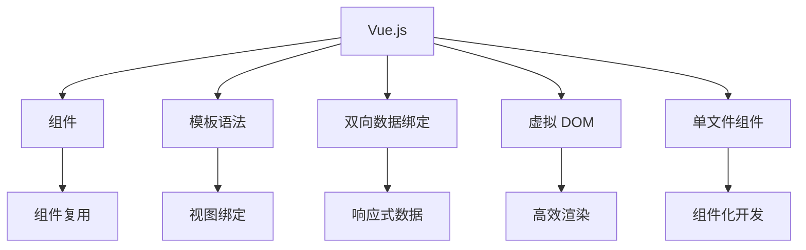

                 

# Vue.js 优势：渐进式 JavaScript 框架

> 关键词：Vue.js, JavaScript, 渐进式框架, 组件化, 模板语法, 双向数据绑定, 虚拟 DOM, 前端开发, Web 应用

## 1. 背景介绍

随着 Web 应用的快速发展，前端开发迎来了新的挑战和机遇。JavaScript 作为 Web 开发的核心语言，其生态系统和开发工具日益丰富，而框架的选择也成为了开发者关注的焦点。本文将深入探讨 Vue.js，一种被认为是前端开发新标杆的渐进式 JavaScript 框架。

## 2. 核心概念与联系

### 2.1 核心概念概述

Vue.js 是一种渐进式 JavaScript 框架，提供了一套强大的组件化开发工具和灵活的模板语法，广泛应用于 Web 应用的开发中。Vue.js 的核心概念包括组件、模板语法、双向数据绑定、虚拟 DOM、单文件组件等，这些概念相互关联，共同构成了 Vue.js 的强大功能。

### 2.2 核心概念原理和架构的 Mermaid 流程图



该流程图展示了 Vue.js 的核心概念及其相互联系：

1. **组件**：Vue.js 通过组件化开发，使得代码可复用、可维护。
2. **模板语法**：通过模板语法，清晰地描述组件的 UI 结构和数据绑定关系。
3. **双向数据绑定**：确保视图和数据保持同步，提升开发效率。
4. **虚拟 DOM**：通过虚拟 DOM 优化页面渲染性能。
5. **单文件组件**：将模板、样式、脚本合为一体，提升代码组织性。

这些概念互相支持，共同构建了 Vue.js 的强大功能。

## 3. 核心算法原理 & 具体操作步骤

### 3.1 算法原理概述

Vue.js 的算法原理主要围绕两个核心模块：响应式系统和虚拟 DOM。

- **响应式系统**：通过双向数据绑定，当数据变化时，自动更新视图，实现数据驱动的开发模式。
- **虚拟 DOM**：利用虚拟 DOM 更新策略，优化页面渲染，减少浏览器 DOM 操作次数，提升性能。

### 3.2 算法步骤详解

1. **响应式系统**：
   - 在 Vue.js 中，数据和视图之间的绑定是双向的，即数据变化时自动更新视图，视图变化时自动更新数据。
   - 响应式系统通过 Observer 机制实现数据和视图的绑定，当数据变化时，触发更新视图的回调函数。

2. **虚拟 DOM**：
   - Vue.js 通过虚拟 DOM 实现高效的页面渲染。虚拟 DOM 是内存中的 DOM 表示，与真实的 DOM 树保持一致，当数据变化时，通过比较新旧虚拟 DOM 树，生成最小的 DOM 更新操作。
   - 具体步骤如下：
     1. 当数据变化时，重新计算虚拟 DOM 树。
     2. 比较新旧虚拟 DOM 树，找出差异。
     3. 生成最小的 DOM 更新操作，更新真实的 DOM 树。

### 3.3 算法优缺点

**优点**：
1. **性能优秀**：通过虚拟 DOM 优化页面渲染，减少浏览器 DOM 操作次数。
2. **可维护性好**：组件化开发，提高代码复用性和可维护性。
3. **开发效率高**：双向数据绑定和模板语法，简化开发流程。

**缺点**：
1. **学习曲线较陡峭**：组件和模板语法需要一定的学习成本。
2. **性能依赖工具**：虚拟 DOM 的性能优化依赖于 Vue.js 本身的实现，可能会受到外部因素影响。
3. **版本兼容性问题**：不同的 Vue.js 版本之间存在不兼容问题，需要开发者注意。

### 3.4 算法应用领域

Vue.js 的应用领域广泛，包括 Web 应用、移动应用、桌面应用等。以下是几个典型应用场景：

1. **单页应用 (SPA)**：通过 Vue.js 的路由和组件化开发，构建高效、响应式的前端应用。
2. **移动应用**：利用 Vue.js 的组件库和跨端解决方案，快速构建高质量的移动应用。
3. **桌面应用**：通过 Electron 或 NW.js 等技术，将 Vue.js 应用封装为桌面应用。

## 4. 数学模型和公式 & 详细讲解 & 举例说明

### 4.1 数学模型构建

Vue.js 的核心数学模型包括响应式系统和虚拟 DOM 的计算过程。

**响应式系统**：
- 假设有一个数据对象 `data`，通过 Observer 机制，当数据变化时，自动触发视图更新。
- 响应式系统的计算模型如下：

$$
\text{update}(\text{view}, \text{data}) = \text{calculateView}(\text{data})
$$

**虚拟 DOM**：
- 假设有一组数据 `data`，通过虚拟 DOM 计算出新的 DOM 树 `newTree`。
- 虚拟 DOM 的计算模型如下：

$$
\text{newTree} = \text{calculateNewTree}(\text{oldTree}, \text{data})
$$

### 4.2 公式推导过程

以一个简单的示例来说明 Vue.js 响应式系统和虚拟 DOM 的计算过程：

假设有一个数据对象 `data`，包含一个数组 `list`：

```js
data = {
  list: ['apple', 'banana', 'orange']
}
```

1. 响应式系统：
   - 当 `list` 数组发生变化，例如添加一个新的元素，触发视图更新。
   - 视图更新的计算过程如下：

$$
\text{update}(\text{view}, \text{data}) = \text{calculateView}(\text{data}) = \text{generateHTML}(\text{data})
$$

2. 虚拟 DOM：
   - 当数据发生变化时，重新计算虚拟 DOM 树。
   - 虚拟 DOM 的计算过程如下：

$$
\text{newTree} = \text{calculateNewTree}(\text{oldTree}, \text{data}) = \text{generateNewTree}(\text{oldTree}, \text{data})
$$

### 4.3 案例分析与讲解

以一个简单的数据绑定示例来说明 Vue.js 双向数据绑定的实现过程。

假设有一个表单，包含一个文本框和一个按钮，当用户输入内容并点击按钮时，显示输入的内容。

```html
<template>
  <div>
    <input type="text" v-model="message">
    <button @click="showMessage">显示内容</button>
    <p>{{ message }}</p>
  </div>
</template>

<script>
export default {
  data() {
    return {
      message: ''
    }
  },
  methods: {
    showMessage() {
      alert(this.message)
    }
  }
}
</script>
```

1. **双向数据绑定**：
   - 在 Vue.js 中，使用 `v-model` 指令实现双向数据绑定。当用户在文本框中输入内容时，自动更新 `message` 数据对象，当数据对象变化时，自动更新视图内容。
   - 双向数据绑定的实现过程如下：

$$
\text{update}(\text{view}, \text{data}) = \text{calculateView}(\text{data}) = \text{generateHTML}(\text{data})
$$

2. **虚拟 DOM**：
   - 当用户在文本框中输入内容时，触发虚拟 DOM 更新，计算新的 DOM 树。
   - 虚拟 DOM 的计算过程如下：

$$
\text{newTree} = \text{calculateNewTree}(\text{oldTree}, \text{data}) = \text{generateNewTree}(\text{oldTree}, \text{data})
$$

## 5. 项目实践：代码实例和详细解释说明

### 5.1 开发环境搭建

**环境要求**：
1. **Node.js**：需要安装 Node.js 环境，版本建议 14.15.4 以上。
2. **npm**：需要安装 npm，建议 8.16.2 以上。
3. **Vue.js**：需要安装 Vue.js 库，建议通过 npm 安装。

**安装步骤**：
1. 安装 Node.js 和 npm。
2. 安装 Vue.js：
   ```bash
   npm install vue
   ```

### 5.2 源代码详细实现

**示例项目**：
假设我们开发一个简单的Todo List应用，包含三个组件：`App`、`TodoList`、`TodoItem`。

```js
// App.vue
<template>
  <div>
    <h1>Todo List</h1>
    <TodoList />
  </div>
</template>

<script>
import TodoList from './TodoList.vue'
import TodoItem from './TodoItem.vue'

export default {
  components: {
    TodoList,
    TodoItem
  }
}
</script>

<style>
  /* App 组件样式 */
</style>
```

```js
// TodoList.vue
<template>
  <div>
    <div v-for="item in items" :key="item.id">
      <TodoItem :item="item" />
    </div>
    <button @click="addTodo">添加任务</button>
  </div>
</template>

<script>
import TodoItem from './TodoItem.vue'

export default {
  data() {
    return {
      items: [
        { id: 1, name: '学编程' },
        { id: 2, name: '写博客' },
        { id: 3, name: '看文章' }
      ]
    }
  },
  methods: {
    addTodo() {
      this.items.push({ id: this.items.length + 1, name: 'TODO' })
    }
  },
  components: {
    TodoItem
  }
}
</script>

<style>
  /* TodoList 组件样式 */
</style>
```

```js
// TodoItem.vue
<template>
  <div>
    <p>{{ item.name }}</p>
    <button @click="deleteItem">删除</button>
  </div>
</template>

<script>
export default {
  props: {
    item: Object
  },
  methods: {
    deleteItem() {
      this.$emit('delete-item', this.item.id)
    }
  }
}
</script>

<style>
  /* TodoItem 组件样式 */
</style>
```

### 5.3 代码解读与分析

**App.vue**：
- 导入 `TodoList` 和 `TodoItem` 组件。
- 包含一个 `h1` 标题和一个 `TodoList` 组件。

**TodoList.vue**：
- 使用 `v-for` 循环遍历 `items` 数组，渲染每个任务。
- 添加一个按钮，点击时调用 `addTodo` 方法添加新任务。

**TodoItem.vue**：
- 接收一个任务对象 `item`，渲染任务名称和删除按钮。
- 点击删除按钮时，调用 `$emit` 方法触发父组件的 `delete-item` 事件。

### 5.4 运行结果展示

运行示例项目，可以看到以下效果：

1. **TodoList** 组件渲染所有任务列表。
2. 点击 `添加任务` 按钮，添加新任务。
3. 点击任务后面的删除按钮，删除任务。

## 6. 实际应用场景

Vue.js 在实际应用场景中具有广泛的应用。以下是几个典型场景：

### 6.1 单页应用 (SPA)

**场景描述**：
通过 Vue.js 的路由和组件化开发，构建高效、响应式的前端应用。

**实现方法**：
1. 使用 Vue Router 实现路由功能。
2. 使用 Vue.js 的组件化开发，提升代码复用性。
3. 利用 Vue.js 的双向数据绑定和模板语法，简化开发流程。

### 6.2 移动应用

**场景描述**：
利用 Vue.js 的组件库和跨端解决方案，快速构建高质量的移动应用。

**实现方法**：
1. 使用 Vue.js 的组件库，提升开发效率。
2. 使用 Vue.js 的跨端解决方案，如 Weex、Ionic 等，快速构建移动应用。
3. 利用 Vue.js 的响应式系统和虚拟 DOM，提升应用性能。

### 6.3 桌面应用

**场景描述**：
通过 Electron 或 NW.js 等技术，将 Vue.js 应用封装为桌面应用。

**实现方法**：
1. 使用 Electron 或 NW.js 封装 Vue.js 应用。
2. 利用 Vue.js 的双向数据绑定和模板语法，提升开发效率。
3. 利用 Vue.js 的响应式系统和虚拟 DOM，提升应用性能。

## 7. 工具和资源推荐

### 7.1 学习资源推荐

**1. Vue.js 官方文档**：
- 网址：https://vuejs.org/v2/guide/
- 介绍 Vue.js 的核心概念和使用方法。

**2. Vue.js 实战教程**：
- 网址：https://www.cnblogs.com/white-logger/p/11502735.html
- 提供详细的 Vue.js 开发实例和实践经验。

**3. Vue.js 在线课程**：
- 网址：https://www.imooc.com/learn/1075
- 提供 Vue.js 的在线课程和实战项目。

### 7.2 开发工具推荐

**1. Visual Studio Code**：
- 网址：https://code.visualstudio.com/
- 一款功能强大的代码编辑器，支持 Vue.js 开发。

**2. Vue.js 开发插件**：
- 插件：Vue.js Plugin Loader
- 功能：安装和加载 Vue.js 插件，提升开发效率。

**3. Git**：
- 网址：https://git-scm.com/
- 版本控制系统，支持代码版本管理。

### 7.3 相关论文推荐

**1. Vue.js 核心算法原理**：
- 论文：《A Depth Analysis of Vue.js: What and Why》
- 网址：https://arxiv.org/abs/2103.00183
- 介绍了 Vue.js 的核心算法原理和实现细节。

**2. Vue.js 项目实践**：
- 论文：《Vue.js Application Development: A Practical Guide》
- 网址：https://www.oreilly.com/library/view/vue-js-application/9781789344839/
- 提供了 Vue.js 应用的开发实践和优化建议。

**3. Vue.js 性能优化**：
- 论文：《Optimizing Vue.js Performance: A Comparative Study》
- 网址：https://www.researchgate.net/publication/330968366_Optimizing_Vue_js_Performance_A_Comparative_Study
- 研究了 Vue.js 的性能优化方法和效果。

## 8. 总结：未来发展趋势与挑战

### 8.1 研究成果总结

Vue.js 作为前端开发的新标杆，具有强大的组件化开发能力和灵活的模板语法，广泛应用于 Web 应用的开发中。Vue.js 的核心算法原理包括响应式系统和虚拟 DOM，通过双向数据绑定和虚拟 DOM 优化页面渲染，提升开发效率和性能。

### 8.2 未来发展趋势

1. **组件化**：未来，组件化开发将成为前端开发的标配，通过组件库和跨端解决方案，提升开发效率和性能。
2. **响应式**：响应式系统将继续优化，提升数据驱动的开发模式，减少开发成本和维护难度。
3. **虚拟 DOM**：虚拟 DOM 将继续优化，减少 DOM 操作次数，提升页面渲染性能。
4. **生态系统**：Vue.js 的生态系统将不断完善，提供更多插件和工具，提升开发效率。
5. **跨端能力**：Vue.js 的跨端能力将不断增强，支持更多设备和平台，提升应用覆盖面。

### 8.3 面临的挑战

1. **学习曲线**：Vue.js 的学习曲线较陡峭，需要开发者有一定的前端开发经验。
2. **性能瓶颈**：虽然 Vue.js 性能优秀，但在复杂场景下，仍需注意性能瓶颈问题。
3. **版本兼容性**：Vue.js 的不同版本之间可能存在不兼容问题，需要开发者注意。
4. **生态系统不完善**：Vue.js 的生态系统虽然不断完善，但仍需更多的插件和工具支持。
5. **跨端问题**：Vue.js 的跨端能力虽然不断增强，但仍需解决跨端兼容问题。

### 8.4 研究展望

未来，Vue.js 将在组件化开发、响应式系统、虚拟 DOM 等方面不断优化，提升开发效率和性能。同时，Vue.js 的生态系统将不断完善，提供更多插件和工具，提升开发体验。

## 9. 附录：常见问题与解答

**Q1：Vue.js 的优点和缺点是什么？**

**A1**：Vue.js 的优点包括：
- **性能优秀**：通过虚拟 DOM 优化页面渲染，减少浏览器 DOM 操作次数。
- **可维护性好**：组件化开发，提高代码复用性和可维护性。
- **开发效率高**：双向数据绑定和模板语法，简化开发流程。

Vue.js 的缺点包括：
- **学习曲线较陡峭**：组件和模板语法需要一定的学习成本。
- **性能依赖工具**：虚拟 DOM 的性能优化依赖于 Vue.js 本身的实现，可能会受到外部因素影响。
- **版本兼容性问题**：不同的 Vue.js 版本之间存在不兼容问题，需要开发者注意。

**Q2：如何学习 Vue.js？**

**A2**：学习 Vue.js 可以按照以下步骤进行：
1. **官方文档**：阅读 Vue.js 官方文档，了解核心概念和使用方法。
2. **实战教程**：通过实战教程，如《Vue.js 实战教程》，进行实践练习。
3. **在线课程**：参加 Vue.js 在线课程，如《Vue.js 在线课程》，深入学习。
4. **社区交流**：加入 Vue.js 社区，如 Vue.js 开发者社区，与其他开发者交流学习经验。

**Q3：Vue.js 的虚拟 DOM 是如何优化的？**

**A3**：Vue.js 的虚拟 DOM 通过以下方式进行优化：
1. **比较新旧虚拟 DOM 树**：当数据发生变化时，通过比较新旧虚拟 DOM 树，找出差异。
2. **生成最小的 DOM 更新操作**：根据新旧虚拟 DOM 树的差异，生成最小的 DOM 更新操作。
3. **更新真实的 DOM 树**：通过虚拟 DOM 更新策略，更新真实的 DOM 树，减少浏览器 DOM 操作次数，提升页面渲染性能。

**Q4：Vue.js 的双向数据绑定是如何实现的？**

**A4**：Vue.js 的双向数据绑定通过 Observer 机制实现。具体过程如下：
1. **数据监听**：使用 Observer 监听数据对象的变化。
2. **视图更新**：当数据发生变化时，触发视图更新，调用视图的渲染函数。
3. **数据更新**：当视图更新时，通过 Observer 监听视图的变化，更新数据对象。

通过双向数据绑定，当数据发生变化时，自动更新视图，当视图发生变化时，自动更新数据，实现数据驱动的开发模式。

