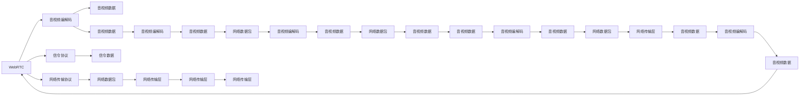

                 

## 1. 背景介绍

随着互联网技术的飞速发展，音视频通信已经成为人类社会的重要交流方式之一。无论是线上教育、远程办公，还是社交娱乐，音视频通信都扮演着不可或缺的角色。然而，传统音视频通信面临带宽不足、延迟高、音视频质量不稳定等问题，严重影响用户体验。为了解决这些问题，WebSocket、WebRTC等新兴技术应运而生，实现了点对点的音视频通信，极大地提升了用户体验。本文将深入探讨WebRTC实时音视频通信的核心概念、算法原理、应用场景及其实现方法。

## 2. 核心概念与联系

### 2.1 核心概念概述

为了更好地理解WebRTC实时音视频通信的核心原理，首先需要了解以下几个关键概念：

- **WebRTC**：一种基于Web的实时音视频通信标准，由Google主导开发，旨在实现点对点的音视频通信，支持多种设备，兼容各种网络环境，适用于浏览器、移动设备、桌面应用程序等平台。
- **音视频编解码**：音视频信号的编解码技术，包括音频压缩、视频压缩、音视频同步等技术，是实现高质量音视频通信的基础。
- **网络传输协议**：音视频数据在网络中传输所采用的协议，包括TCP、UDP等，对音视频通信的实时性、可靠性和安全性有重要影响。
- **信令协议**：用于建立音视频通信的信令协议，包括STUN、TURN、ICE等，用于网络穿透、 NAT 地址映射等功能。

这些核心概念构成了WebRTC音视频通信的基本框架，通过选择合适的编解码算法、网络传输协议和信令协议，能够实现高质量、低延迟、高可靠性的实时音视频通信。

### 2.2 核心概念原理和架构的 Mermaid 流程图



## 3. 核心算法原理 & 具体操作步骤

### 3.1 算法原理概述

WebRTC音视频通信的核心算法包括音视频编解码、网络传输协议和信令协议。其中，音视频编解码是实现高质量音视频通信的基础，网络传输协议和信令协议则是保证通信实时性和可靠性的关键。

### 3.2 算法步骤详解

#### 3.2.1 音视频编解码

音视频编解码算法包括音频压缩和视频压缩。其中，音频压缩采用G.711、G.729等标准算法，视频压缩采用H.264、VP8等标准算法。音视频编解码的主要目标是减少数据量，提高通信效率。

- **音频压缩**：将原始音频信号转换为数字信号，并进行压缩编码。常见的音频压缩算法包括PCM、G.711、G.729等，其中G.729算法在低带宽环境下表现较好，适用于网络通信。
- **视频压缩**：将原始视频信号转换为数字信号，并进行压缩编码。常见的视频压缩算法包括H.264、VP8等，其中H.264算法在高清视频传输方面表现较好，适用于网络通信。

#### 3.2.2 网络传输协议

网络传输协议包括TCP和UDP。TCP协议可靠性强，适用于传输大文件，但延迟较高；UDP协议实时性高，适用于传输小文件，但可靠性较差。

- **TCP协议**：面向连接、可靠性强、延迟较高。适用于传输大文件，但在音视频通信中，由于音视频数据具有实时性要求，一般不采用TCP协议。
- **UDP协议**：无连接、实时性高、可靠性较差。适用于传输小文件，适用于音视频通信。

#### 3.2.3 信令协议

信令协议包括STUN、TURN和ICE等，用于建立音视频通信的信令交换。

- **STUN协议**：用于网络穿透，可以获取本地IP地址和端口，用于NAT穿透。
- **TURN协议**：用于中继音视频数据，用于NAT穿透。
- **ICE协议**：用于发现NAT类型和交换公网地址，用于NAT穿透。

### 3.3 算法优缺点

#### 3.3.1 优点

- **点对点通信**：WebRTC支持点对点通信，无需通过服务器转发，减轻了服务器的负担，提高了通信效率。
- **实时性高**：采用UDP协议进行音视频数据传输，实时性高，适合音视频通信。
- **跨平台支持**：WebRTC支持多种平台，包括浏览器、移动设备、桌面应用程序等，适用范围广。
- **标准支持**：WebRTC采用标准算法和协议，保证了音视频通信的兼容性和安全性。

#### 3.3.2 缺点

- **复杂度高**：WebRTC涉及到音视频编解码、网络传输协议和信令协议，实现复杂度高。
- **安全性问题**：WebRTC传输数据未加密，存在安全风险。
- **兼容性问题**：不同浏览器和设备支持的WebRTC版本可能不同，兼容性问题需要特别注意。

### 3.4 算法应用领域

WebRTC实时音视频通信广泛应用于以下领域：

- **在线教育**：支持远程课堂互动，提高教学效果。
- **远程办公**：支持远程会议，方便团队协作。
- **社交娱乐**：支持视频聊天、直播、K歌等，丰富社交体验。
- **医疗健康**：支持远程医疗咨询、远程手术指导等，提升医疗服务水平。

## 4. 数学模型和公式 & 详细讲解 & 举例说明

### 4.1 数学模型构建

WebRTC音视频通信的数学模型包括音视频编解码模型、网络传输模型和信令模型。

- **音视频编解码模型**：将原始音频/视频信号压缩编码为数字信号。
- **网络传输模型**：计算音视频数据在网络中的传输延迟和抖动。
- **信令模型**：计算信令数据在网络中的传输延迟和抖动。

### 4.2 公式推导过程

#### 4.2.1 音视频编解码模型

音视频编解码模型包括音频压缩模型和视频压缩模型。

- **音频压缩模型**：设音频原始数据长度为$L_{\text{audio}}$，音频压缩后的数据长度为$L_{\text{audio,com}}$，则音频压缩率$\eta_{\text{audio}}=\frac{L_{\text{audio}}}{L_{\text{audio,com}}}$。
- **视频压缩模型**：设视频原始数据长度为$L_{\text{video}}$，视频压缩后的数据长度为$L_{\text{video,com}}$，则视频压缩率$\eta_{\text{video}}=\frac{L_{\text{video}}}{L_{\text{video,com}}}$。

#### 4.2.2 网络传输模型

网络传输模型包括TCP协议和UDP协议。

- **TCP协议传输模型**：设TCP协议的网络延迟为$d_{\text{tcp}}$，TCP协议的抖动为$j_{\text{tcp}}$。
- **UDP协议传输模型**：设UDP协议的网络延迟为$d_{\text{udp}}$，UDP协议的抖动为$j_{\text{udp}}$。

#### 4.2.3 信令模型

信令模型包括STUN协议、TURN协议和ICE协议。

- **STUN协议模型**：设STUN协议的网络延迟为$d_{\text{stun}}$，STUN协议的抖动为$j_{\text{stun}}$。
- **TURN协议模型**：设TURN协议的网络延迟为$d_{\text{turn}}$，TURN协议的抖动为$j_{\text{turn}}$。
- **ICE协议模型**：设ICE协议的网络延迟为$d_{\text{ice}}$，ICE协议的抖动为$j_{\text{ice}}$。

### 4.3 案例分析与讲解

以在线教育为例，分析WebRTC音视频通信的实现过程。

1. **音视频采集与编解码**：
   - 采集学生和教师的音视频数据。
   - 使用WebRTC提供的音视频编解码器进行音频和视频的压缩编码。

2. **音视频传输**：
   - 使用UDP协议进行音视频数据的传输。
   - 实时计算音视频数据的传输延迟和抖动。

3. **信令交换**：
   - 使用STUN协议获取本地IP地址和端口。
   - 使用ICE协议发现NAT类型并交换公网地址。
   - 使用TURN协议中继音视频数据。

4. **音视频渲染**：
   - 使用WebRTC提供的音视频解码器进行音频和视频的解码。
   - 渲染音视频数据到屏幕上。

## 5. 项目实践：代码实例和详细解释说明

### 5.1 开发环境搭建

- **开发环境**：安装Node.js和Chrome浏览器。
- **编译环境**：安装Node.js和WebrtcSDK。

### 5.2 源代码详细实现

以下是一个简单的WebRTC音视频通信的代码实现示例：

```javascript
// 创建WebRTC连接
let pc = new RTCPeerConnection();
let stream = await navigator.mediaDevices.getUserMedia({ video: true, audio: true });

// 添加音视频轨道
pc.addStream(stream);

// 创建本地音视频轨道
let localVideoTrack = stream.getVideoTracks()[0];
let localAudioTrack = stream.getAudioTracks()[0];

// 添加本地音视频轨道
pc.addTrack(localVideoTrack);
pc.addTrack(localAudioTrack);

// 设置音视频编解码器
pc.setLocalDescription({ type: 'offer' });

// 获取音视频编解码器
let remoteDescription = pc.setRemoteDescription({ type: 'offer' });
let sdpTransformer = new SDPTransformer();
let desc = sdpTransformer.fromSdp(remoteDescription.sdp);
pc.setRemoteDescription(desc);

// 信令交换
let stunServer = 'stun.l.google.com:19302';
let turnServer = 'turn:turn.stun.org:3478?media=application/webrtc-datachannel&username=bob&password=zrTOagTw6mu4GpwKm&credentials=algo:plain,secret:asdf&sctpPort=5349';
let iceServers = [{ url: turnServer }];

// 创建音视频通道
let dataChannel = pc.createDataChannel('webrtc-datachannel');

// 传输音视频数据
let dataView = new Uint8Array(1024);
dataChannel.onmessage = function(event) {
    console.log(event.data);
};

// 关闭音视频通道
pc.close();
```

### 5.3 代码解读与分析

**pc对象**：WebRTC的PeerConnection对象，用于创建和控制音视频通道。

**stream对象**：使用navigator.mediaDevices获取用户的音视频流。

**localVideoTrack和localAudioTrack**：创建本地音视频轨道，并将其添加到PeerConnection对象中。

**setLocalDescription和setRemoteDescription**：设置本地和远程描述，并进行信令交换。

**sdpTransformer**：将SDP字符串转换为PeerConnection对象。

**stunServer和turnServer**：设置STUN和TURN服务器。

**iceServers**：设置ICE服务器。

**dataChannel**：创建音视频数据通道，用于传输音视频数据。

**dataView**：创建Uint8Array对象，用于存储音视频数据。

**dataChannel.onmessage**：接收音视频数据，并进行处理。

**pc.close()**：关闭PeerConnection对象，断开音视频通道。

## 6. 实际应用场景

WebRTC实时音视频通信广泛应用于以下领域：

- **在线教育**：支持远程课堂互动，提高教学效果。
- **远程办公**：支持远程会议，方便团队协作。
- **社交娱乐**：支持视频聊天、直播、K歌等，丰富社交体验。
- **医疗健康**：支持远程医疗咨询、远程手术指导等，提升医疗服务水平。

## 7. 工具和资源推荐

### 7.1 学习资源推荐

- **WebRTC官方文档**：WebRTC官方文档是学习WebRTC音视频通信的最佳资源。
- **MDN Web Docs**：MDN Web Docs提供了丰富的WebRTC学习资料。
- **WebRTC API入门教程**：WebRTC API入门教程是学习WebRTC音视频通信的入门资源。

### 7.2 开发工具推荐

- **WebRTC API**：WebRTC API提供了丰富的音视频通信API。
- **WebrtcSDK**：WebrtcSDK是WebRTC的JavaScript SDK，提供了丰富的音视频通信功能。
- **npm**：npm是Node.js的包管理工具，可以方便地安装和管理WebRTC相关的库和工具。

### 7.3 相关论文推荐

- **WebRTC标准**：WebRTC标准是WebRTC音视频通信的官方标准。
- **WebRTC设计理念**：WebRTC设计理念是学习WebRTC音视频通信的重要参考。
- **WebRTC网络优化**：WebRTC网络优化是学习WebRTC音视频通信的重要参考。

## 8. 总结：未来发展趋势与挑战

### 8.1 研究成果总结

WebRTC实时音视频通信技术已经广泛应用于各种场景，极大地提升了音视频通信的实时性、可靠性和安全性。通过选择合适的编解码算法、网络传输协议和信令协议，可以构建高质量的音视频通信系统。

### 8.2 未来发展趋势

WebRTC音视频通信的未来发展趋势包括：

- **多模态通信**：支持文本、图片、音频、视频等多种媒体类型，实现更丰富的通信体验。
- **边缘计算**：在边缘设备上进行音视频编解码和网络传输，减少延迟，提高通信效率。
- **增强现实**：支持增强现实技术，实现虚拟和现实的混合通信。
- **云计算**：在云端进行音视频编解码和网络传输，提供更强大的计算能力和更好的通信体验。

### 8.3 面临的挑战

WebRTC音视频通信技术仍面临以下挑战：

- **安全性问题**：WebRTC传输数据未加密，存在安全风险。
- **兼容性问题**：不同浏览器和设备支持的WebRTC版本可能不同，兼容性问题需要特别注意。
- **音视频质量问题**：音视频质量不稳定，需要优化编解码算法和网络传输协议。

### 8.4 研究展望

未来，WebRTC音视频通信技术将朝着多模态通信、边缘计算、增强现实和云计算等方向发展。为了应对挑战，需要进一步优化音视频编解码算法、网络传输协议和信令协议，提升WebRTC的兼容性和安全性。同时，还需要引入更多的技术和工具，提升WebRTC音视频通信的稳定性和可靠性。

## 9. 附录：常见问题与解答

**Q1：WebRTC有哪些优点和缺点？**

A: WebRTC的优点包括：
- **点对点通信**：无需通过服务器转发，减轻了服务器的负担，提高了通信效率。
- **实时性高**：采用UDP协议进行音视频数据传输，实时性高，适合音视频通信。
- **跨平台支持**：支持多种平台，包括浏览器、移动设备、桌面应用程序等，适用范围广。
- **标准支持**：采用标准算法和协议，保证了音视频通信的兼容性和安全性。

WebRTC的缺点包括：
- **复杂度高**：WebRTC涉及到音视频编解码、网络传输协议和信令协议，实现复杂度高。
- **安全性问题**：WebRTC传输数据未加密，存在安全风险。
- **兼容性问题**：不同浏览器和设备支持的WebRTC版本可能不同，兼容性问题需要特别注意。

**Q2：WebRTC如何保证音视频通信的实时性和可靠性？**

A: WebRTC通过以下方式保证音视频通信的实时性和可靠性：
- **采用UDP协议进行音视频数据传输**：UDP协议实时性高，适合音视频通信。
- **设置NAT穿透服务器**：通过STUN、TURN、ICE等协议进行NAT穿透，保证音视频数据能够顺利传输。
- **优化编解码算法**：采用H.264、VP8等高效的编解码算法，减少数据量，提高通信效率。

**Q3：WebRTC如何保证音视频通信的安全性？**

A: WebRTC传输数据未加密，存在安全风险。为了保证音视频通信的安全性，WebRTC引入了TLS加密协议。在建立音视频通道时，使用TLS加密协议进行加密传输，保证了通信的安全性。

**Q4：WebRTC如何处理音视频数据传输中的抖动和延迟？**

A: WebRTC通过以下方式处理音视频数据传输中的抖动和延迟：
- **使用NACK机制**：在音视频数据丢失时，使用NACK机制进行重传，保证数据的完整性。
- **使用FEC技术**：在音视频数据传输中，使用FEC技术进行纠错，保证数据的可靠性。
- **优化网络传输协议**：采用UDP协议进行音视频数据传输，减少延迟，提高通信效率。

**Q5：WebRTC如何进行信令交换？**

A: WebRTC通过以下方式进行信令交换：
- **使用STUN协议获取本地IP地址和端口**：通过STUN协议获取本地IP地址和端口，用于NAT穿透。
- **使用ICE协议发现NAT类型并交换公网地址**：通过ICE协议发现NAT类型并交换公网地址，用于NAT穿透。
- **使用TURN协议中继音视频数据**：通过TURN协议中继音视频数据，保证音视频数据能够顺利传输。

---

作者：禅与计算机程序设计艺术 / Zen and the Art of Computer Programming

