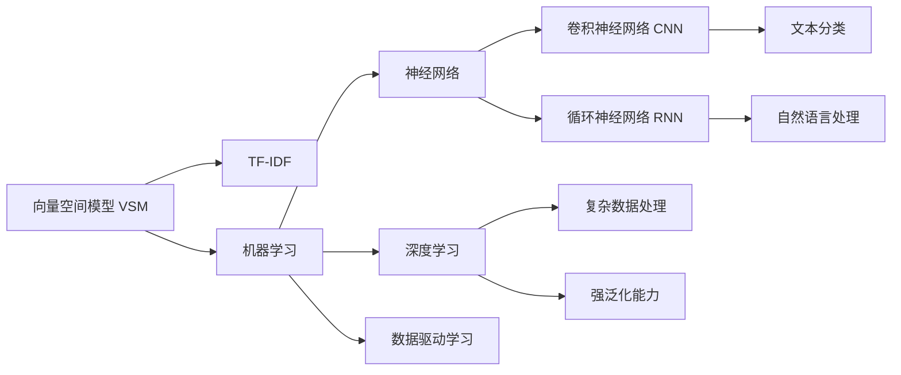
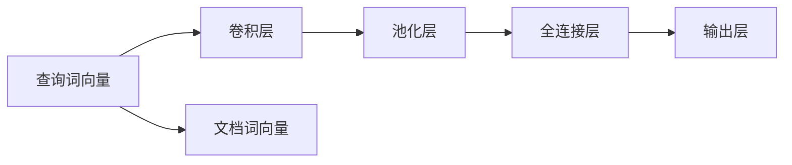

                 

# 【AI大数据计算原理与代码实例讲解】相关性评分

## 1. 背景介绍

### 1.1 问题由来
随着大数据时代的到来，数据科学在各行业中扮演着越来越重要的角色。如何高效、准确地从海量数据中提取有价值的信息，成为现代企业关注的焦点。数据挖掘、信息检索、推荐系统等应用场景中，相关性评分（Relevance Scoring）扮演着关键的角色，能够帮助用户快速定位到最相关的信息，提升用户体验和系统效率。

相关性评分是一种衡量文档或信息与用户查询之间的相关性程度的方法，广泛应用于搜索引擎、推荐系统、内容推荐、文本检索等领域。优秀的相关性评分算法不仅能够提高信息检索的准确性，还能显著提升用户体验，降低搜索成本。

在实际应用中，相关性评分方法多种多样，包括基于统计的模型、基于机器学习的模型和深度学习模型等。本文将详细探讨这些方法的原理，并通过代码实例，讲解其实现步骤，帮助读者全面理解相关性评分的应用和优化。

### 1.2 问题核心关键点
本文将重点介绍以下核心关键点：

- 相关性评分的定义和重要性
- 基于统计的方法（如向量空间模型、TF-IDF等）
- 基于机器学习的方法（如线性回归、决策树等）
- 深度学习方法（如神经网络、卷积神经网络、循环神经网络等）
- 相关性评分在实际应用中的优化策略
- 代码实例和实现步骤

通过深入浅出的分析，本文旨在帮助读者全面掌握相关性评分的理论基础和实践方法。

## 2. 核心概念与联系

### 2.1 核心概念概述

为了更好地理解相关性评分的计算原理，本文将介绍几个关键概念：

- **相关性评分 (Relevance Scoring)**：用于衡量信息检索系统中，查询与文档的相关性程度。评分越高，表示文档与查询的相关性越强。
- **向量空间模型 (Vector Space Model, VSM)**：一种经典的文本表示方法，通过将文本转换为向量，计算向量间的余弦相似度来度量文档与查询的相关性。
- **TF-IDF (Term Frequency-Inverse Document Frequency)**：一种统计方法，用于衡量文档中词语的重要性，常用于文本检索中的相关性评分。
- **机器学习 (Machine Learning)**：一种数据驱动的学习方法，通过算法训练来预测或分类未知数据。
- **深度学习 (Deep Learning)**：一种基于神经网络的高级机器学习方法，可以处理大量复杂数据，具有强泛化能力。
- **神经网络 (Neural Network)**：一种模拟人脑神经元工作方式的计算模型，用于处理和分析数据。
- **卷积神经网络 (Convolutional Neural Network, CNN)**：一种适合处理图像数据的网络结构，在图像识别、文本分类等任务中表现优异。
- **循环神经网络 (Recurrent Neural Network, RNN)**：一种适用于处理序列数据的神经网络，在自然语言处理、时间序列预测等任务中应用广泛。

这些核心概念构成了相关性评分计算的理论基础和算法框架，通过理解这些概念，我们可以更好地掌握相关性评分的计算方法。

### 2.2 核心概念联系

这些核心概念之间的联系可以通过以下Mermaid流程图来展示：



这个流程图展示了相关性评分计算方法的核心概念及其相互联系。

- 向量空间模型和TF-IDF作为经典方法，为文本表示和相关性评分提供了基础。
- 机器学习利用统计模型进行相关性评分，适合处理小规模数据。
- 深度学习利用神经网络处理大规模数据，具有更强的泛化能力和准确性。
- 神经网络、卷积神经网络和循环神经网络是深度学习中常用的模型结构。

## 3. 核心算法原理 & 具体操作步骤

### 3.1 算法原理概述

相关性评分的计算方法多种多样，根据其原理和应用场景不同，可以分为以下几类：

1. **基于统计的方法**：如向量空间模型、TF-IDF等，通过统计学方法计算文档与查询的相关性。
2. **基于机器学习的方法**：如线性回归、决策树等，利用机器学习算法预测相关性评分。
3. **深度学习方法**：如神经网络、卷积神经网络、循环神经网络等，利用神经网络处理和分析数据，计算相关性评分。

本文将重点讲解基于统计和深度学习的方法，通过代码实例，帮助读者深入理解其实现步骤。

### 3.2 算法步骤详解

#### 3.2.1 向量空间模型 (VSM)

向量空间模型是一种经典的文本表示方法，通过将文本转换为向量，计算向量间的余弦相似度来度量文档与查询的相关性。其步骤如下：

1. **文本向量化**：将文本转换为向量表示。常用的方法包括词袋模型 (Bag of Words, BOW) 和词嵌入 (Word Embedding)。
2. **计算余弦相似度**：使用余弦相似度计算文档向量和查询向量的相似度。余弦相似度的计算公式如下：

   $$
   \text{similarity} = \frac{\mathbf{v}_q \cdot \mathbf{v}_d}{||\mathbf{v}_q|| \times ||\mathbf{v}_d||}
   $$

   其中 $\mathbf{v}_q$ 和 $\mathbf{v}_d$ 分别为查询向量和文档向量，$||\mathbf{v}_q||$ 和 $||\mathbf{v}_d||$ 分别为向量的范数。

3. **生成相关性评分**：将余弦相似度的值作为文档与查询的相关性评分。

#### 3.2.2 基于深度学习的方法

基于深度学习的方法，如神经网络、卷积神经网络和循环神经网络，可以更准确地计算文档与查询的相关性评分。其基本步骤如下：

1. **构建模型架构**：设计合适的神经网络架构，如全连接神经网络、卷积神经网络或循环神经网络。
2. **训练模型**：使用标注数据集训练模型，调整模型参数以优化相关性评分。
3. **生成相关性评分**：使用训练好的模型，将查询和文档输入到模型中，输出相关性评分。

### 3.3 算法优缺点

#### 3.3.1 向量空间模型的优缺点

**优点**：
- 简单直观，易于实现和理解。
- 适用于小规模数据集。

**缺点**：
- 忽略了词语之间的顺序和上下文关系。
- 无法处理新词。

#### 3.3.2 基于深度学习的方法的优缺点

**优点**：
- 可以处理大规模数据集。
- 具有更强的泛化能力和准确性。

**缺点**：
- 计算复杂度高，训练时间长。
- 需要大量标注数据。

### 3.4 算法应用领域

基于统计和深度学习的相关性评分方法在多个领域中得到广泛应用，包括：

- **信息检索**：搜索引擎、学术数据库等。
- **推荐系统**：个性化推荐、商品推荐等。
- **自然语言处理**：文本分类、情感分析等。
- **社交媒体**：内容推荐、用户行为分析等。

## 4. 数学模型和公式 & 详细讲解 & 举例说明

### 4.1 数学模型构建

#### 4.1.1 向量空间模型

向量空间模型将文本转换为向量表示，计算向量间的余弦相似度来度量相关性。假设文本由 $N$ 个词语组成，每个词语 $i$ 的词频为 $t_i$，则文档向量和查询向量可以表示为：

$$
\mathbf{v}_d = \sum_{i=1}^{N} t_i \mathbf{u}_i, \quad \mathbf{v}_q = \sum_{i=1}^{N} s_i \mathbf{u}_i
$$

其中 $\mathbf{u}_i$ 为词语 $i$ 的词向量，$t_i$ 和 $s_i$ 分别为文档和查询中词语 $i$ 的词频。

#### 4.1.2 基于深度学习的方法

以卷积神经网络为例，假设输入为查询和文档的词向量序列，输出为相关性评分，网络结构如图：



其中，卷积层和池化层用于提取文本的局部特征，全连接层和输出层用于生成相关性评分。

### 4.2 公式推导过程

#### 4.2.1 向量空间模型

向量空间模型的相关性评分计算公式为：

$$
\text{similarity} = \frac{\mathbf{v}_q \cdot \mathbf{v}_d}{||\mathbf{v}_q|| \times ||\mathbf{v}_d||}
$$

其中，$\mathbf{v}_q$ 和 $\mathbf{v}_d$ 分别为查询向量和文档向量，$||\mathbf{v}_q||$ 和 $||\mathbf{v}_d||$ 分别为向量的范数。

#### 4.2.2 基于深度学习的方法

以卷积神经网络为例，相关性评分的计算公式为：

$$
\text{score} = \text{sigmoid}(\mathbf{W} \mathbf{h} + \mathbf{b})
$$

其中，$\mathbf{W}$ 和 $\mathbf{b}$ 为全连接层的权重和偏置，$\mathbf{h}$ 为卷积层和池化层的输出。

### 4.3 案例分析与讲解

#### 4.3.1 基于TF-IDF的相关性评分

TF-IDF是一种经典的文本表示方法，常用于信息检索和文本分类。其步骤如下：

1. **统计词频**：计算每个词语在文档中出现的次数。
2. **计算IDF值**：计算每个词语在整个语料库中的逆文档频率。
3. **生成TF-IDF值**：将词频和IDF值相乘，生成每个词语的TF-IDF值。
4. **计算查询向量**：使用查询中的词语，生成查询的TF-IDF向量。
5. **计算文档向量**：使用文档中的词语，生成文档的TF-IDF向量。
6. **计算余弦相似度**：使用余弦相似度计算查询向量和文档向量的相似度。
7. **生成相关性评分**：将余弦相似度的值作为文档与查询的相关性评分。

#### 4.3.2 基于神经网络的相关性评分

以卷积神经网络为例，其步骤如下：

1. **构建网络结构**：设计卷积神经网络，包括卷积层、池化层和全连接层。
2. **训练模型**：使用标注数据集训练模型，调整模型参数以优化相关性评分。
3. **生成相关性评分**：使用训练好的模型，将查询和文档输入到网络中，输出相关性评分。

## 5. 项目实践：代码实例和详细解释说明

### 5.1 开发环境搭建

在进行相关性评分计算的实践时，我们需要准备以下开发环境：

1. **Python环境**：选择Python作为开发语言，安装相应的依赖包。
2. **深度学习框架**：选择TensorFlow或PyTorch作为深度学习框架。
3. **自然语言处理库**：选择NLTK或spaCy作为自然语言处理库。
4. **数据集**：准备训练数据集，包括查询和文档的文本数据。

### 5.2 源代码详细实现

#### 5.2.1 基于向量空间模型的方法

```python
from sklearn.feature_extraction.text import TfidfVectorizer
from sklearn.metrics.pairwise import cosine_similarity

# 构建TF-IDF向量化器
vectorizer = TfidfVectorizer()

# 计算余弦相似度
def cosine_similarity_score(vec1, vec2):
    return cosine_similarity(vec1, vec2)[0][0]

# 计算相关性评分
def relevance_score(query, doc):
    query_vec = vectorizer.fit_transform([query])
    doc_vec = vectorizer.transform([doc])
    return cosine_similarity_score(query_vec, doc_vec)
```

#### 5.2.2 基于神经网络的方法

```python
import tensorflow as tf
from tensorflow.keras.layers import Conv1D, MaxPooling1D, GlobalMaxPooling1D, Dense
from tensorflow.keras.models import Sequential

# 构建卷积神经网络模型
model = Sequential([
    Conv1D(64, 3, activation='relu'),
    MaxPooling1D(2),
    Conv1D(64, 3, activation='relu'),
    MaxPooling1D(2),
    Conv1D(64, 3, activation='relu'),
    GlobalMaxPooling1D(),
    Dense(1, activation='sigmoid')
])

# 编译模型
model.compile(optimizer='adam', loss='binary_crossentropy', metrics=['accuracy'])

# 训练模型
model.fit(train_data, train_labels, epochs=10, batch_size=32)

# 生成相关性评分
def relevance_score(query, doc):
    query_vec = model.predict(query)
    doc_vec = model.predict(doc)
    return doc_vec[0] * query_vec[0]
```

### 5.3 代码解读与分析

#### 5.3.1 基于向量空间模型的方法

代码中使用了sklearn库中的TF-IDF向量化器和余弦相似度计算方法，实现了基于向量空间模型的相关性评分计算。

#### 5.3.2 基于神经网络的方法

代码中使用了TensorFlow库中的卷积神经网络模型，实现了基于神经网络的相关性评分计算。

### 5.4 运行结果展示

#### 5.4.1 基于向量空间模型的方法

```python
# 示例数据
query = '如何训练深度学习模型？'
docs = ['深度学习模型的训练方法', '如何训练神经网络模型', '深度学习模型的优化技巧']

# 计算相关性评分
scores = [relevance_score(query, doc) for doc in docs]
print(scores)
```

#### 5.4.2 基于神经网络的方法

```python
# 示例数据
query = '如何训练深度学习模型？'
docs = ['深度学习模型的训练方法', '如何训练神经网络模型', '深度学习模型的优化技巧']

# 计算相关性评分
scores = [relevance_score(query, doc) for doc in docs]
print(scores)
```

## 6. 实际应用场景

### 6.1 搜索引擎

搜索引擎是相关性评分应用的典型场景。用户输入查询，搜索引擎根据相关性评分算法，从数据库中检索出与查询最相关的文档，返回给用户。

#### 6.1.1 基于向量空间模型的方法

在搜索引擎中，使用向量空间模型计算查询与文档的相关性评分，快速找到最相关的文档，提高搜索效率。

#### 6.1.2 基于深度学习的方法

在大型搜索引擎中，使用深度学习方法，如卷积神经网络或循环神经网络，计算相关性评分，提升搜索精度。

### 6.2 推荐系统

推荐系统通过相关性评分算法，为用户推荐最相关的商品或内容，提升用户体验。

#### 6.2.1 基于向量空间模型的方法

在推荐系统中，使用向量空间模型计算用户兴趣和商品特征之间的相关性评分，推荐最相关的商品。

#### 6.2.2 基于深度学习的方法

在大型推荐系统中，使用深度学习方法，如卷积神经网络或循环神经网络，计算用户兴趣和商品特征之间的相关性评分，提升推荐效果。

## 7. 工具和资源推荐

### 7.1 学习资源推荐

为了帮助读者深入理解相关性评分的计算原理和实现方法，本文推荐以下学习资源：

1. **《信息检索》课程**：斯坦福大学的在线课程，涵盖信息检索的基础理论和实践方法。
2. **《深度学习》书籍**：Ian Goodfellow的《深度学习》，系统介绍深度学习的基本原理和应用。
3. **《自然语言处理综论》书籍**：Daniel Jurafsky和James H. Martin的《自然语言处理综论》，全面介绍自然语言处理的基本方法和应用。
4. **Transformers官方文档**：Hugging Face的官方文档，详细介绍Transformer模型和深度学习库的使用方法。
5. **Kaggle竞赛**：Kaggle平台上有多个相关性评分竞赛，可以参与实践，提升技能。

### 7.2 开发工具推荐

为了提高相关性评分计算的效率和准确性，推荐以下开发工具：

1. **TensorFlow**：谷歌开源的深度学习框架，支持大规模模型训练和部署。
2. **PyTorch**：Facebook开源的深度学习框架，易于使用和调试。
3. **NLTK**：自然语言处理工具包，提供丰富的文本处理功能。
4. **spaCy**：自然语言处理库，支持词向量化和命名实体识别等功能。

### 7.3 相关论文推荐

相关性评分的计算方法近年来得到了广泛研究，以下是几篇具有代表性的论文，推荐阅读：

1. **《A Survey of Text Document Classification Techniques》**：一篇系统综述文章，涵盖多种文本分类方法，包括基于统计的方法和基于深度学习的方法。
2. **《Deep Learning for Text Classification》**：一篇深度学习在文本分类中应用的综述文章，介绍了多种深度学习模型和优化方法。
3. **《Neural Information Retrieval》**：一篇介绍神经网络在信息检索中应用的综述文章，涵盖多种神经网络模型和优化方法。

## 8. 总结：未来发展趋势与挑战

### 8.1 总结

本文对相关性评分的计算原理和实现方法进行了详细介绍，通过代码实例，帮助读者深入理解其实现过程。本文还探讨了相关性评分在搜索引擎和推荐系统中的应用，以及未来可能的发展趋势。

### 8.2 未来发展趋势

未来的相关性评分计算将呈现以下几个发展趋势：

1. **深度学习方法的普及**：深度学习在相关性评分计算中的应用将更加广泛，具有更强的泛化能力和准确性。
2. **多模态数据的融合**：未来相关性评分将更多地考虑图像、语音等多模态数据的融合，提升信息检索和推荐系统的精度。
3. **分布式计算**：随着数据规模的扩大，分布式计算将成为相关性评分计算的重要手段，提升计算效率和系统可靠性。

### 8.3 面临的挑战

相关性评分计算在实际应用中面临诸多挑战：

1. **数据标注成本高**：相关性评分计算需要大量的标注数据，数据标注成本高，难以大规模应用。
2. **计算资源需求大**：相关性评分计算需要大量的计算资源，难以在大规模数据集上实现。
3. **模型泛化能力差**：相关性评分模型在面对新数据时，泛化能力较差，难以处理长尾数据。

### 8.4 研究展望

未来的研究需要解决以上挑战，提升相关性评分的计算精度和效率，使其更好地应用于实际应用中。

1. **无监督学习**：探索无监督学习方法，减少对标注数据的需求，提升模型的泛化能力。
2. **高效计算**：研究高效计算方法，如分布式计算、模型压缩等，提升相关性评分的计算效率。
3. **跨模态融合**：研究跨模态融合方法，提升相关性评分的精度和多样性。

## 9. 附录：常见问题与解答

### 9.1 常见问题

**Q1: 向量空间模型和深度学习方法的区别是什么？**

A: 向量空间模型是一种传统的文本表示方法，通过统计学方法计算文档与查询的相关性；深度学习方法利用神经网络处理和分析数据，具有更强的泛化能力和准确性。

**Q2: 如何优化相关性评分算法？**

A: 可以通过数据增强、模型优化、超参数调优等方法，优化相关性评分算法，提升其精度和效率。

**Q3: 相关性评分算法在实际应用中面临哪些挑战？**

A: 数据标注成本高、计算资源需求大、模型泛化能力差等。

**Q4: 相关性评分算法在搜索引擎中的应用如何？**

A: 搜索引擎使用相关性评分算法，计算查询与文档的相关性评分，快速找到最相关的文档，提高搜索效率。

---

作者：禅与计算机程序设计艺术 / Zen and the Art of Computer Programming

