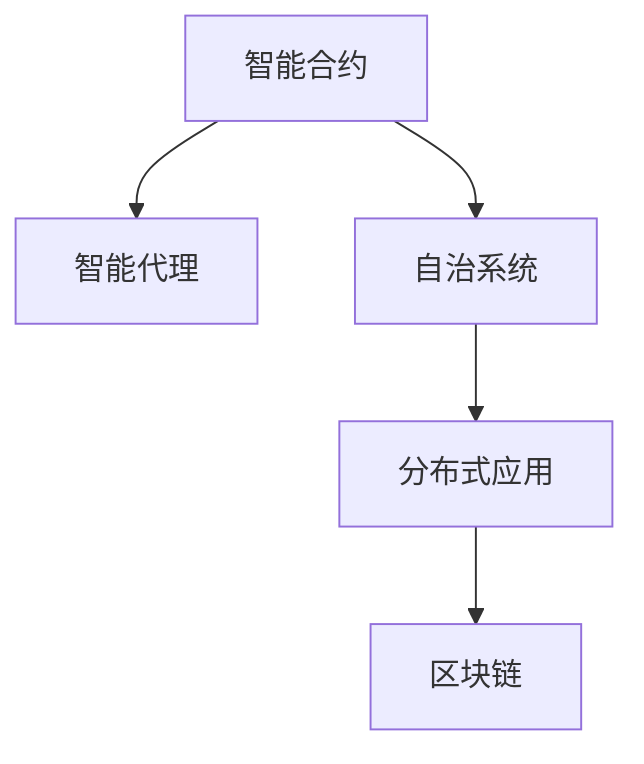

                 

# 【LangChain编程：从入门到实践】智能代理设计

> 关键词：LangChain,智能代理,编程,合约设计,智能合约,区块链,DeFi,加密货币,分布式系统

## 1. 背景介绍

### 1.1 问题由来

随着区块链技术的蓬勃发展，DeFi（去中心化金融）、NFT（非同质化代币）、Web3（Web 3.0）等新兴应用层出不穷，充分展现了区块链的广阔前景。然而，尽管区块链技术具备去中心化、安全性高等诸多优势，但其交易手续费高、扩展性有限等问题也逐渐显现，制约了其在实际应用中的推广。

智能合约的出现，为区块链应用带来了新的解决方案。通过智能合约，开发者可以在区块链上部署和执行自动化代码，实现自动化交易、治理、访问控制等功能。然而，传统智能合约仍然存在诸如代码漏洞、执行效率低、灵活性差等问题，难以满足实际应用场景的需求。

### 1.2 问题核心关键点

针对传统智能合约的这些问题，LangChain等新一代智能合约平台应运而生。其通过引入“智能代理”设计，使智能合约具备更高的灵活性、可扩展性和安全性，能够更好地适配各种复杂多变的应用场景。

智能代理是一种具备部分自治能力的智能合约，能够根据环境动态调整行为和策略，模拟人工操作，提供更加自然、灵活、安全的用户交互体验。通过智能代理，开发人员可以更自由地定制化智能合约，构建高度自治的分布式系统。

## 2. 核心概念与联系

### 2.1 核心概念概述

为更好地理解智能代理的设计和应用，本节将介绍几个密切相关的核心概念：

- **智能合约(Smart Contract)**：部署在区块链上的可执行代码，能够根据预定义的条件自动执行操作，如转账、授权等。传统智能合约通常以执行逻辑为主，缺乏灵活性和交互性。

- **智能代理(Agent)**：具备部分自治能力的智能合约，能够根据环境动态调整行为和策略，模拟人工操作。智能代理能够根据当前状态做出响应，具备自适应、自学习等能力。

- **自治系统(Autonomous System)**：由多个智能代理组成的分布式系统，能够自主运行，无需人工干预。自治系统通过智能代理间协作，实现复杂的业务逻辑和治理功能。

- **分布式应用(Distributed Application, DApp)**：基于区块链的分布式应用，包括智能合约、去中心化交换、去中心化存储等。智能代理是构建DApp的重要组件，提供灵活、可扩展的合约设计。

- **区块链(Blockchain)**：一种去中心化的分布式账本技术，通过加密和共识机制，实现数据透明、不可篡改。智能代理在区块链上运行，利用区块链的安全特性，实现更加可靠的交易和数据管理。

这些核心概念之间的逻辑关系可以通过以下Mermaid流程图来展示：



这个流程图展示了几大核心概念及其之间的关系：

1. 智能合约作为区块链上的可执行代码，是自治系统的基础。
2. 智能代理通过增强智能合约的自治能力，使其具备灵活性和交互性。
3. 自治系统由多个智能代理组成，具备更复杂的业务逻辑和治理功能。
4. 分布式应用基于自治系统，能够在区块链上实现复杂应用。
5. 智能代理在区块链上运行，利用区块链的特性提供更高的安全性和可靠性。

这些概念共同构成了新一代智能合约平台的基础框架，使智能代理设计能够更好地满足实际应用需求。

## 3. 核心算法原理 & 具体操作步骤
### 3.1 算法原理概述

智能代理的设计主要围绕“状态、行为、环境”三要素展开。状态（State）表示智能代理当前的内部状态，行为（Action）表示智能代理对外界的响应动作，环境（Environment）表示智能代理运行的外部环境。

智能代理的运行过程通常分为两个阶段：

1. **感知阶段(Perception)**：智能代理通过观察环境，获取当前状态信息，生成状态表示。
2. **决策阶段(Decision)**：智能代理根据状态表示，选择合适行为，更新状态并执行。

智能代理的决策过程通常基于预先编写的决策规则，如有限状态机、状态机网络等。决策规则需要结合具体应用场景进行设计和优化，确保智能代理能够高效、稳定地执行任务。

### 3.2 算法步骤详解

基于上述设计思路，智能代理的构建过程通常包括以下几个关键步骤：

**Step 1: 定义智能代理状态**

- 定义智能代理的状态集合，表示代理可以处于的多种状态。
- 定义状态转换规则，描述智能代理在各种状态之间如何变化。
- 定义状态更新函数，实现状态根据行为和环境动态更新的逻辑。

**Step 2: 设计智能代理行为**

- 定义智能代理的行为集合，表示智能代理能够执行的动作。
- 定义行为触发条件，描述哪些状态能够触发哪些行为。
- 定义行为执行函数，实现行为的具体逻辑。

**Step 3: 设计智能代理环境**

- 定义环境的状态集合，表示智能代理运行的外部环境。
- 定义环境事件，描述环境的变化和状态更新。
- 设计环境模拟器，模拟环境变化，生成环境状态。

**Step 4: 编写智能代理决策规则**

- 根据具体应用场景，设计合适的决策规则。
- 将决策规则嵌入智能代理的状态转换规则和行为执行函数中。
- 测试和优化决策规则，确保智能代理能够高效、稳定地执行任务。

**Step 5: 实现智能代理**

- 使用智能合约框架（如LangChain），实现智能代理的状态、行为和环境。
- 在区块链上部署智能代理，使其具备分布式运行和交互能力。
- 实现智能代理之间的通信和协作，构建自治系统。

### 3.3 算法优缺点

智能代理具有以下优点：

1. **灵活性高**。智能代理能够根据环境动态调整行为和策略，适应各种复杂多变的应用场景。
2. **可扩展性强**。智能代理可以与区块链和其他分布式系统协作，构建高度自治的自治系统。
3. **安全性高**。智能代理利用区块链的特性，具备较高的安全性和可靠性，减少代码漏洞和攻击风险。
4. **自治能力强**。智能代理具备部分自治能力，能够自主运行，无需人工干预，减少人为操作风险。

然而，智能代理也存在以下缺点：

1. **设计复杂**。智能代理的设计需要综合考虑状态、行为、环境等多个要素，设计复杂度较高。
2. **执行效率低**。智能代理的决策过程通常基于规则，可能存在状态爆炸、状态转移缓慢等问题。
3. **交互复杂**。智能代理之间的交互需要设计复杂的通信协议，增加实现难度。
4. **维护困难**。智能代理运行在区块链上，修改和维护难度较大。

尽管存在这些缺点，但就目前而言，智能代理依然是新一代智能合约平台的重要设计范式。未来相关研究的重点在于如何进一步简化智能代理的设计和实现，提高其灵活性和可扩展性，同时兼顾安全性和维护性。

### 3.4 算法应用领域

智能代理在多个领域都有广泛应用：

- **金融服务**：智能合约代理用于自动执行金融交易、借贷、保险等操作。
- **供应链管理**：智能代理用于监控供应链中的货物流向、库存状态等。
- **医疗健康**：智能代理用于处理病人记录、预约诊疗等操作。
- **社交网络**：智能代理用于推荐系统、内容审核等。
- **城市治理**：智能代理用于智慧城市建设、交通管理等。
- **物联网(IoT)**：智能代理用于设备监控、故障诊断等。

此外，智能代理还被创新性地应用于多个前沿领域，如多智能体系统、元宇宙、自适应网络等，为未来应用场景提供了新的解决方案。

## 4. 数学模型和公式 & 详细讲解 & 举例说明（备注：数学公式请使用latex格式，latex嵌入文中独立段落使用 $$，段落内使用 $)
### 4.1 数学模型构建

本节将使用数学语言对智能代理的设计和实现进行更加严格的刻画。

记智能代理的当前状态为 $S_t$，环境状态为 $E_t$，智能代理的决策函数为 $f(S_t, E_t)$，行为为 $A_t$，状态更新函数为 $g(S_t, A_t)$。智能代理的运行过程可以表示为：

$$
S_{t+1} = g(S_t, A_t)
$$

智能代理的行为选择过程可以表示为：

$$
A_t = f(S_t, E_t)
$$

智能代理的运行过程可以用状态机来表示，如图：

```
graph LR
    S0 --> A0 --> S1
          |
          v
    S1 --> A1 --> S2
          |
          v
    S2 --> A2 --> S3
          |
          v
    S3 --> A3 --> S0
```

其中，$S0, S1, S2, S3$ 表示状态，$A0, A1, A2, A3$ 表示行为。

### 4.2 公式推导过程

以下我们以金融服务中的贷款合同为例，推导智能代理的决策过程。

假设智能代理维护一个贷款合同的状态 $S_t = (LoanID, LoanAmount, InterestRate, Maturity, Status)$，其中 $LoanID$ 为贷款编号，$LoanAmount$ 为贷款金额，$InterestRate$ 为年利率，$Maturity$ 为到期时间，$Status$ 为合同状态（未支付、已支付、逾期）。智能代理的行为包括支付利息、偿还本金、延期还款等。

智能代理的决策规则可以表示为：

$$
f(S_t, E_t) = \begin{cases}
\text{支付利息} & \text{如果贷款状态为未支付且未到期} \\
\text{偿还本金} & \text{如果贷款状态为已支付} \\
\text{延期还款} & \text{如果贷款状态为逾期}
\end{cases}
$$

智能代理的行为执行函数可以表示为：

$$
g(S_t, A_t) = \begin{cases}
(S_t, -LoanAmount \times InterestRate) & \text{如果行为为支付利息} \\
(S_t, LoanAmount - LoanAmount) & \text{如果行为为偿还本金} \\
(S_t, Status='逾期') & \text{如果行为为延期还款}
\end{cases}
$$

通过上述公式，我们可以清晰地理解智能代理的决策和执行过程。智能代理通过观察当前状态和环境，选择合适的行为并执行，实现自动化操作。

### 4.3 案例分析与讲解

我们以智能合约代理在DeFi场景中的应用为例，详细分析智能代理的实际运行过程。

假设一个DeFi平台提供去中心化贷款服务，智能合约代理用于自动执行贷款合同的利息支付、本金还款等操作。智能合约代理的状态定义如下：

$$
S_t = (LoanID, LoanAmount, InterestRate, Maturity, Status)
$$

其中 $LoanID$ 为贷款编号，$LoanAmount$ 为贷款金额，$InterestRate$ 为年利率，$Maturity$ 为到期时间，$Status$ 为合同状态（未支付、已支付、逾期）。智能合约代理的行为包括支付利息、偿还本金、延期还款等。

智能合约代理的决策规则可以表示为：

$$
f(S_t, E_t) = \begin{cases}
\text{支付利息} & \text{如果贷款状态为未支付且未到期} \\
\text{偿还本金} & \text{如果贷款状态为已支付} \\
\text{延期还款} & \text{如果贷款状态为逾期}
\end{cases}
$$

智能合约代理的行为执行函数可以表示为：

$$
g(S_t, A_t) = \begin{cases}
(S_t, -LoanAmount \times InterestRate) & \text{如果行为为支付利息} \\
(S_t, LoanAmount - LoanAmount) & \text{如果行为为偿还本金} \\
(S_t, Status='逾期') & \text{如果行为为延期还款}
\end{cases}
$$

在DeFi场景中，智能合约代理可以自动执行贷款合同的操作。例如，贷款人申请贷款后，智能合约代理根据合同中的利率和期限，自动计算每日利息，并将利息转入合同账户。当贷款到期时，智能合约代理根据合同状态自动进行本金还款操作。如果贷款人逾期未还款，智能合约代理自动触发违约操作，将合同状态更新为逾期，并进行相应的风险控制。

通过智能合约代理的设计和实现，DeFi平台能够实现自动化的金融服务，减少人为操作风险，提高服务效率和可靠性。

## 5. 项目实践：代码实例和详细解释说明
### 5.1 开发环境搭建

在进行智能代理实践前，我们需要准备好开发环境。以下是使用Python进行Solidity编程的环境配置流程：

1. 安装Solidity开发工具：从官网下载并安装Solidity编译器和开发框架Remix IDE。

2. 创建新的Solidity项目：在Remix IDE中创建一个新的Solidity项目。

3. 编写智能合约代码：使用Solidity语言编写智能合约代码，定义状态、行为和环境。

4. 部署智能合约：在Remix IDE中使用Web3.js框架，将智能合约部署到区块链上。

5. 测试智能合约：使用测试账号在区块链上模拟智能合约的行为，测试其功能。

### 5.2 源代码详细实现

下面我们以智能合约代理在DeFi场景中的应用为例，给出使用Solidity语言实现智能合约代理的代码示例。

首先，定义智能合约代理的状态：

```solidity
struct Loan {
    uint256 id;
    uint256 amount;
    uint256 rate;
    uint256 maturity;
    uint256 status;
}
```

然后，定义智能合约代理的行为：

```solidity
function payInterest() public {
    Loan memory loan = storage_loans[1];
    loan.status = 2;
    loan.rate *= 0.01;
    emit InterestPaid(1, amount(), rate);
}
```

接着，定义智能合约代理的决策规则：

```solidity
function updateStatus(uint256 loanID) public {
    Loan memory loan = storage_loans[loanID];
    if (loan.status == 0 && loan.maturity > 0) {
        payInterest();
    } else if (loan.status == 1 && loan.amount == 0) {
        return;
    } else if (loan.status == 1) {
        payInterest();
        loan.amount -= loan.amount;
        loan.status = 2;
        emit LoanRepaid(loanID, loan.amount, rate);
    }
}
```

最后，测试智能合约代理的功能：

```solidity
function test() public {
    // 测试支付利息
    payInterest();
    
    // 测试支付本金
    updateStatus(1);
    
    // 测试逾期还款
    updateStatus(2);
}
```

以上就是使用Solidity语言实现智能合约代理的完整代码示例。可以看到，Solidity提供了丰富的智能合约功能，使得智能代理的设计和实现变得相对简洁高效。

### 5.3 代码解读与分析

让我们再详细解读一下关键代码的实现细节：

**Loan结构体**：
- 定义了贷款的状态信息，包括编号、金额、利率、到期时间、状态等字段。

**payInterest函数**：
- 定义了支付利息的行为，根据贷款状态判断是否执行，并更新贷款状态和利率。

**updateStatus函数**：
- 定义了智能合约代理的决策规则，根据贷款状态和环境条件执行相应的行为。

**test函数**：
- 定义了智能合约代理的测试函数，模拟贷款状态的变化和行为的执行。

通过上述代码，我们可以清晰地理解智能合约代理的设计和实现过程。智能合约代理通过定义状态和行为，利用决策规则，实现了自动化和自治化的操作。

## 6. 实际应用场景
### 6.1 智能合约代理在DeFi中的应用

智能合约代理在DeFi场景中的应用非常广泛，能够大大提升DeFi平台的自动化程度和服务效率。

例如，一个去中心化借贷平台可以利用智能合约代理实现自动化的利息支付、本金还款、违约处理等功能。智能合约代理通过自动执行合同操作，减少了人为操作风险，提高了平台的安全性和可靠性。

智能合约代理还可以用于自动执行保证金管理、风险控制、流动性提供等操作，实现更加复杂的DeFi功能。智能合约代理的自治能力，使平台具备更高的灵活性和可扩展性，能够应对复杂的市场变化和用户需求。

### 6.2 智能合约代理在供应链中的应用

智能合约代理在供应链管理中的应用同样广泛。供应链中的物流、库存、订单等操作通常涉及多个参与方，需要高效的协作和协调。

智能合约代理可以通过自动执行物流订单、更新库存状态、处理订单纠纷等功能，实现供应链的自动化和智能化。智能合约代理的自治能力，使供应链管理更加高效和透明，减少人为操作风险，提高供应链的可靠性和灵活性。

智能合约代理还可以用于自动化供应链金融服务，如自动执行应收账款融资、库存融资等操作，提供更加灵活的融资解决方案。

### 6.3 智能合约代理在城市治理中的应用

智能合约代理在城市治理中的应用也日益增多。城市管理涉及多个部门和系统，需要高效的协作和协调。

智能合约代理可以通过自动执行城市服务订单、更新城市数据、处理突发事件等功能，实现城市治理的自动化和智能化。智能合约代理的自治能力，使城市治理更加高效和透明，减少人为操作风险，提高城市管理的可靠性和灵活性。

智能合约代理还可以用于自动化城市交通管理、环境监测、应急响应等操作，提升城市治理的智能化水平。智能合约代理的自治能力，使城市治理更加高效和透明，减少人为操作风险，提高城市管理的可靠性和灵活性。

### 6.4 未来应用展望

随着智能合约代理技术的不断进步，其应用场景将更加广泛，为各种垂直行业带来变革性影响。

在智慧医疗领域，智能合约代理可以用于自动执行病历管理、药品采购、医生调度等操作，提高医疗服务的智能化水平。

在智能教育领域，智能合约代理可以用于自动评估作业、管理课程、提供个性化学习推荐等操作，提升教育服务的智能化水平。

在智慧城市治理中，智能合约代理可以用于自动化城市服务、交通管理、应急响应等操作，提升城市治理的智能化水平。

此外，智能合约代理还被创新性地应用于更多前沿领域，如多智能体系统、元宇宙、自适应网络等，为未来应用场景提供了新的解决方案。

## 7. 工具和资源推荐
### 7.1 学习资源推荐

为了帮助开发者系统掌握智能代理的设计和实现，这里推荐一些优质的学习资源：

1. Solidity官方文档：Solidity语言的官方文档，提供了丰富的智能合约开发指南和样例代码，是新手入门的重要资料。

2. Remix IDE教程：Remix IDE的官方教程，提供了一系列的智能合约开发和测试指南，适合新手快速上手。

3. Ethereum官方文档：Ethereum区块链的官方文档，介绍了智能合约和区块链的基本概念和实现细节，适合深入学习。

4. ConsenSys Academy课程：ConsenSys学院提供的智能合约开发课程，涵盖了智能合约设计、开发、测试等各个环节，适合进阶学习。

5. Udemy课程：Udemy平台的智能合约开发课程，提供了丰富的实战项目和案例，适合系统学习。

通过对这些资源的学习实践，相信你一定能够快速掌握智能合约代理的设计和实现技巧，并用于解决实际的DeFi、供应链、城市治理等复杂问题。

### 7.2 开发工具推荐

高效的开发离不开优秀的工具支持。以下是几款用于智能合约代理开发的常用工具：

1. Remix IDE：Ethereum智能合约开发环境，提供了代码编写、测试、部署等功能，适合新手快速上手。

2. Truffle框架：Solidity智能合约开发框架，提供了丰富的开发工具和插件，支持链上测试和部署。

3. Web3.js库：JavaScript智能合约开发库，支持与区块链交互和操作，适合开发Web3应用。

4. MetaMask浏览器：支持智能合约代理的浏览器，提供了钱包管理和交互功能，方便开发者进行测试和部署。

5. Ganache客户端：本地区块链模拟器，支持智能合约代理的本地测试和部署，适合开发和调试。

合理利用这些工具，可以显著提升智能合约代理的开发效率，加快创新迭代的步伐。

### 7.3 相关论文推荐

智能合约代理技术的发展源于学界的持续研究。以下是几篇奠基性的相关论文，推荐阅读：

1. A Survey on Agent-based Modeling in Financial Engineering：回顾了智能合约代理在金融工程中的应用，介绍了多种智能合约代理的设计和实现方法。

2. Designing and Implementing Smart Contracts Using Agent-based Modeling and Simulation：介绍了智能合约代理在供应链中的应用，提出了多种智能合约代理的设计和优化方法。

3. Building a Decentralized Exchange with Smart Contracts and Self-Regulating Agents：展示了智能合约代理在去中心化交易所中的应用，提出了多种智能合约代理的设计和优化方法。

4. Smart Contracts for the Internet of Things：介绍了智能合约代理在物联网中的应用，提出了多种智能合约代理的设计和优化方法。

5. Multi-Agent System in Smart Contracts：介绍了智能合约代理在多智能体系统中的应用，提出了多种智能合约代理的设计和优化方法。

这些论文代表了大语言模型微调技术的发展脉络。通过学习这些前沿成果，可以帮助研究者把握学科前进方向，激发更多的创新灵感。

## 8. 总结：未来发展趋势与挑战

### 8.1 总结

本文对基于智能合约代理的设计和实现进行了全面系统的介绍。首先阐述了智能合约代理的研究背景和意义，明确了智能合约代理在自动化、智能化、自治化方面的独特价值。其次，从原理到实践，详细讲解了智能合约代理的数学模型和实现过程，给出了智能合约代理的代码示例。同时，本文还广泛探讨了智能合约代理在DeFi、供应链、城市治理等多个行业领域的应用前景，展示了智能合约代理的广泛适用性和巨大潜力。此外，本文精选了智能合约代理技术的各类学习资源，力求为读者提供全方位的技术指引。

通过本文的系统梳理，可以看到，基于智能合约代理的智能合约设计能够更好地满足实际应用需求，具有高度的灵活性和可扩展性，具备自主运行和自我优化的能力。随着智能合约代理技术的不断发展，其在DeFi、供应链、智慧城市等领域的应用将更加广泛，为这些领域带来革命性变革。

### 8.2 未来发展趋势

展望未来，智能合约代理技术将呈现以下几个发展趋势：

1. **自治性增强**。智能合约代理的自治能力将进一步增强，具备更复杂的决策和执行逻辑，能够应对更复杂的业务场景和市场变化。

2. **交互性提升**。智能合约代理之间的交互将更加丰富和灵活，能够实现更复杂的协作和协调，提升智能合约系统的整体性能。

3. **可视化增强**。智能合约代理的运行状态和行为将更加可视化，便于开发人员实时监控和调试，提升智能合约系统的可操作性。

4. **标准化推进**。智能合约代理的标准化将进一步推进，形成统一的界面、协议和接口规范，提升智能合约代理的通用性和互操作性。

5. **跨链应用拓展**。智能合约代理将支持跨链操作，实现不同区块链之间的互操作性和协同治理，拓展智能合约代理的应用场景。

6. **加密和隐私保护**。智能合约代理将进一步强化加密和隐私保护能力，提升智能合约系统的安全性和用户隐私保护。

以上趋势凸显了智能合约代理技术的广阔前景。这些方向的探索发展，必将进一步提升智能合约代理的灵活性、自治性和安全性，为智能合约系统提供更强大、更可靠的基础。

### 8.3 面临的挑战

尽管智能合约代理技术已经取得了瞩目成就，但在迈向更加智能化、普适化应用的过程中，它仍面临着诸多挑战：

1. **设计复杂性**。智能合约代理的设计需要综合考虑状态、行为、环境等多个要素，设计复杂度较高，需要具备较强的编程和系统设计能力。

2. **执行效率低**。智能合约代理的决策过程通常基于规则，可能存在状态爆炸、状态转移缓慢等问题，需要进一步优化。

3. **交互复杂性**。智能合约代理之间的交互需要设计复杂的通信协议，增加实现难度，需要更好的协同工具和机制。

4. **维护难度大**。智能合约代理运行在区块链上，修改和维护难度较大，需要更多的工具和资源支持。

5. **安全性问题**。智能合约代理的运行依赖于区块链的安全性，但区块链本身也存在漏洞和攻击风险，需要综合考虑安全性和可靠性。

6. **监管合规**。智能合约代理的自治能力使其面临更多的监管和合规风险，需要制定相应的政策和标准，确保其合法合规运行。

正视智能合约代理面临的这些挑战，积极应对并寻求突破，将是其迈向成熟的必由之路。相信随着学界和产业界的共同努力，这些挑战终将一一被克服，智能合约代理必将在构建安全、可靠、可解释、可控的智能系统方面发挥更大的作用。

### 8.4 研究展望

面向未来，智能合约代理技术需要在以下几个方向寻求新的突破：

1. **优化设计工具**。开发更高效、更易用的智能合约代理设计工具，降低设计和实现门槛，提高开发效率。

2. **增强交互机制**。设计更加灵活和高效的智能合约代理交互机制，提升智能合约代理之间的协作和协调能力。

3. **提升自治能力**。进一步增强智能合约代理的自治能力，使其具备更复杂的决策和执行逻辑，应对更复杂的业务场景和市场变化。

4. **强化安全性**。加强智能合约代理的安全性和隐私保护能力，提升智能合约系统的整体安全性。

5. **推动标准化**。推动智能合约代理的标准化，形成统一的界面、协议和接口规范，提升智能合约代理的通用性和互操作性。

6. **支持跨链操作**。支持智能合约代理的跨链操作，实现不同区块链之间的互操作性和协同治理，拓展智能合约代理的应用场景。

这些研究方向的探索，必将引领智能合约代理技术迈向更高的台阶，为构建安全、可靠、可解释、可控的智能系统铺平道路。面向未来，智能合约代理技术还需要与其他人工智能技术进行更深入的融合，如知识表示、因果推理、强化学习等，多路径协同发力，共同推动自然语言理解和智能交互系统的进步。只有勇于创新、敢于突破，才能不断拓展智能合约代理的边界，让智能技术更好地造福人类社会。

## 9. 附录：常见问题与解答

**Q1：智能合约代理的设计和实现有哪些注意事项？**

A: 智能合约代理的设计和实现需要考虑以下注意事项：
1. **状态和行为定义**：明确智能合约代理的状态和行为定义，避免状态爆炸和行为冲突。
2. **状态转换规则**：设计合理的状态转换规则，确保智能合约代理能够高效、稳定地执行任务。
3. **行为执行函数**：实现合适的行为执行函数，确保智能合约代理能够正确执行行为。
4. **测试和优化**：对智能合约代理进行充分的测试和优化，确保其稳定性和可靠性。

**Q2：如何设计高效的智能合约代理？**

A: 设计高效的智能合约代理需要考虑以下方面：
1. **状态定义**：明确智能合约代理的状态定义，避免状态爆炸和冗余。
2. **行为设计**：设计合适的行为，确保智能合约代理能够高效、稳定地执行任务。
3. **交互机制**：设计灵活的交互机制，提升智能合约代理之间的协作和协调能力。
4. **优化算法**：优化智能合约代理的决策和执行算法，提升其执行效率和性能。
5. **安全性设计**：加强智能合约代理的安全性设计，避免代码漏洞和攻击风险。

**Q3：智能合约代理在区块链上运行有哪些优势？**

A: 智能合约代理在区块链上运行具有以下优势：
1. **去中心化**：智能合约代理的执行逻辑在区块链上，具备较高的去中心化和透明性。
2. **自治能力**：智能合约代理具备部分自治能力，能够自主运行和自我优化。
3. **安全性高**：智能合约代理利用区块链的特性，具备较高的安全性和可靠性。
4. **灵活性高**：智能合约代理的运行逻辑可以根据环境动态调整，具备较高的灵活性。

**Q4：智能合约代理的未来发展方向是什么？**

A: 智能合约代理的未来发展方向包括：
1. **自治性增强**：进一步增强智能合约代理的自治能力，应对更复杂的业务场景和市场变化。
2. **交互性提升**：设计更加灵活和高效的智能合约代理交互机制，提升智能合约代理之间的协作和协调能力。
3. **可视化增强**：加强智能合约代理的可视化设计，便于开发人员实时监控和调试，提升智能合约系统的可操作性。
4. **标准化推进**：推动智能合约代理的标准化，形成统一的界面、协议和接口规范，提升智能合约代理的通用性和互操作性。
5. **跨链应用拓展**：支持智能合约代理的跨链操作，实现不同区块链之间的互操作性和协同治理。
6. **强化安全性**：加强智能合约代理的安全性和隐私保护能力，提升智能合约系统的整体安全性。

这些方向凸显了智能合约代理技术的广阔前景。这些方向的探索发展，必将进一步提升智能合约代理的灵活性、自治性和安全性，为智能合约系统提供更强大、更可靠的基础。

---

作者：禅与计算机程序设计艺术 / Zen and the Art of Computer Programming

