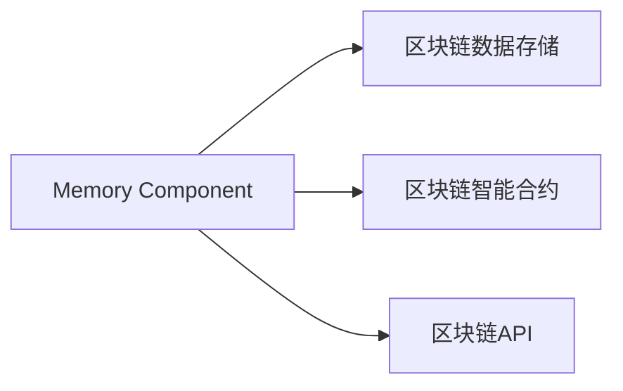

                 

# 【LangChain编程：从入门到实践】记忆组件的应用

## 1. 背景介绍

随着Web3和区块链技术的发展，去中心化应用（DApps）和语义Web变得越来越流行。这些技术的发展带来了新的编程范式——LangChain编程。LangChain编程的核心理念是将编程语言和区块链技术紧密结合，利用区块链的智能合约特性来构建Web3应用。在LangChain编程中，一个重要的组件是“记忆组件”（Memory Component），它用于存储和查询区块链上的数据，是实现Web3应用的关键技术之一。本文将详细阐述记忆组件的原理、实现步骤以及应用场景，帮助读者从入门到实践，全面理解记忆组件的应用。

## 2. 核心概念与联系

### 2.1 核心概念概述

在LangChain编程中，记忆组件是实现Web3应用的重要基础。记忆组件用于存储和查询区块链上的数据，它的设计可以最大限度地提高区块链的存储和检索效率，从而提升Web3应用的用户体验和性能。

### 2.2 核心概念原理和架构的 Mermaid 流程图



该图展示了记忆组件在LangChain编程中的核心作用。记忆组件与区块链数据存储、智能合约和API紧密相连，共同构成了Web3应用的底层架构。

## 3. 核心算法原理 & 具体操作步骤

### 3.1 算法原理概述

记忆组件的原理基于区块链的存储和检索机制。它将数据存储在区块链上，利用区块链的不可篡改性和分布式特性，保证数据的安全性和可靠性。同时，它还提供了高效的数据查询和检索机制，使得Web3应用能够快速获取所需数据。

### 3.2 算法步骤详解

1. **设计数据结构**：
   - 确定需要存储的数据类型和结构，如文本、数字、图片等。
   - 定义数据的存储位置，如智能合约、链上表格、链下存储等。

2. **编写智能合约**：
   - 使用Solidity等语言编写智能合约，定义数据的存储和查询接口。
   - 实现数据的存储和查询逻辑，确保数据的不可篡改性和安全性。

3. **实现API接口**：
   - 使用Web3.js等库实现与区块链的交互。
   - 提供HTTP、WebSocket等接口，方便Web应用调用。

4. **数据存储与检索**：
   - 将数据存储在智能合约或链上表格中。
   - 使用查询接口检索所需数据。

### 3.3 算法优缺点

**优点**：
- 数据存储在区块链上，具有不可篡改性和高安全性。
- 数据查询和检索高效，适合Web3应用的实时数据处理。

**缺点**：
- 存储和检索数据需要支付以太坊等费用。
- 数据结构设计复杂，需要考虑数据类型、存储位置和查询接口。

### 3.4 算法应用领域

记忆组件在Web3应用中有着广泛的应用，包括：

- **去中心化存储**：利用区块链存储用户数据，保护用户隐私。
- **去中心化应用**：实现Web3应用的智能合约和数据查询。
- **Web3开发工具**：提供Web3应用的开发环境和API接口。

## 4. 数学模型和公式 & 详细讲解 & 举例说明

### 4.1 数学模型构建

在LangChain编程中，记忆组件的数据存储和查询可以抽象为数学模型。设数据集合为$D$，存储函数为$f$，查询函数为$g$，则数据存储和查询的数学模型为：

$$
(D, f, g)
$$

其中，$D$为数据集合，$f$为存储函数，$g$为查询函数。

### 4.2 公式推导过程

以存储和查询文本数据为例，设文本数据为$T$，存储函数为$f_T$，查询函数为$g_T$，则文本数据的存储和查询公式为：

$$
(T, f_T, g_T)
$$

其中，$f_T(T)$将文本数据$T$存储在智能合约中，$g_T(x)$根据输入$x$查询文本数据$T$。

### 4.3 案例分析与讲解

假设用户$A$需要将一段文本数据存储在区块链上，可以按照以下步骤操作：

1. **编写智能合约**：
   - 使用Solidity编写智能合约，定义存储接口。
   - 实现文本数据的存储逻辑。

2. **调用存储接口**：
   - 使用Web3.js调用存储接口，将文本数据存储在智能合约中。

3. **查询数据**：
   - 调用查询接口，检索所需文本数据。

假设用户$B$需要查询该文本数据，可以按照以下步骤操作：

1. **编写智能合约**：
   - 使用Solidity编写智能合约，定义查询接口。
   - 实现文本数据的查询逻辑。

2. **调用查询接口**：
   - 使用Web3.js调用查询接口，检索所需文本数据。

## 5. 项目实践：代码实例和详细解释说明

### 5.1 开发环境搭建

1. **安装Node.js和npm**：
   - 从官网下载并安装Node.js，并配置全局npm。

2. **安装Web3.js库**：
   - 使用npm安装Web3.js库，例如：

   ```
   npm install web3@^0.9.0
   ```

3. **搭建开发环境**：
   - 创建一个Web3应用项目目录。
   - 在项目根目录下初始化npm，安装依赖。

### 5.2 源代码详细实现

以下是一个使用Web3.js库实现记忆组件存储和查询的示例代码：

```javascript
const Web3 = require('web3');

const provider = new Web3.providers.HttpProvider('http://localhost:8545');
const web3 = new Web3(provider);

// 定义智能合约ABI和合约地址
const abi = [
    // ...
];

const contractAddress = '0x1234567890abcdef';

// 定义存储和查询函数
function storeData(data) {
    return new Promise((resolve, reject) => {
        // 创建智能合约实例
        const contract = new web3.eth.Contract(abi, contractAddress);

        // 调用存储函数
        contract.methods.store(data).send({ from: '0x0000000000000000000000000000000000' }, (err, result) => {
            if (err) {
                reject(err);
            } else {
                resolve(result);
            }
        });
    });
}

function queryData() {
    return new Promise((resolve, reject) => {
        // 创建智能合约实例
        const contract = new web3.eth.Contract(abi, contractAddress);

        // 调用查询函数
        contract.methods.query().call({}, (err, result) => {
            if (err) {
                reject(err);
            } else {
                resolve(result);
            }
        });
    });
}

// 使用示例
const data = 'Hello, Web3!';
storeData(data).then(result => {
    console.log('数据存储成功', result);
    return queryData();
}).then(result => {
    console.log('数据查询成功', result);
}).catch(err => {
    console.error('错误', err);
});
```

### 5.3 代码解读与分析

该示例代码使用了Web3.js库实现智能合约的存储和查询。通过定义智能合约的ABI和合约地址，创建智能合约实例，调用存储和查询函数，实现了数据的存储和检索。

## 6. 实际应用场景

### 6.1 去中心化存储

在去中心化存储应用中，记忆组件用于存储和查询用户数据。例如，用户可以在去中心化文件存储平台上传和下载文件，系统使用记忆组件存储和管理用户文件。

### 6.2 去中心化应用

在去中心化应用中，记忆组件用于存储和查询应用数据。例如，去中心化社交平台可以使用记忆组件存储用户信息和帖子数据，实现智能合约和用户交互。

### 6.3 Web3开发工具

在Web3开发工具中，记忆组件用于提供API接口和开发环境。例如，Web3 IDE可以使用记忆组件存储和查询代码仓库数据，提供代码编辑器和IDE功能。

## 7. 工具和资源推荐

### 7.1 学习资源推荐

1. **Web3.js官方文档**：
   - 提供了Web3.js库的详细文档和示例代码，是学习Web3编程的重要资源。

2. **Solidity官方文档**：
   - 提供了Solidity语言的详细文档和开发指南，是编写智能合约的基础。

3. **Blockchain Development with Solidity（中文版）**：
   - 是一本关于Solidity语言和智能合约开发的书籍，适合初学者阅读。

### 7.2 开发工具推荐

1. **Web3.js库**：
   - 提供了与区块链的交互API，适合Web3应用的开发。

2. **Remix IDE**：
   - 是一个Web3 IDE，提供了智能合约的开发环境和测试工具。

3. **Truffle Framework**：
   - 是一个Web3开发框架，提供了智能合约的部署和管理工具。

### 7.3 相关论文推荐

1. **Programming Language and Blockchain**：
   - 是一篇关于LangChain编程的论文，详细探讨了区块链和编程语言的结合。

2. **Memory Components in Blockchain**：
   - 是一篇关于记忆组件的论文，详细介绍了记忆组件的设计和实现。

## 8. 总结：未来发展趋势与挑战

### 8.1 研究成果总结

记忆组件在LangChain编程中具有重要地位，它是实现Web3应用的关键技术之一。记忆组件的设计和实现需要考虑数据类型、存储位置和查询接口，同时需要确保数据的安全性和检索效率。

### 8.2 未来发展趋势

1. **数据类型扩展**：
   - 未来记忆组件将支持更多数据类型，如视频、音频等。

2. **智能合约优化**：
   - 未来智能合约将支持更多高级功能，如多签合约、分布式存储等。

3. **区块链技术发展**：
   - 未来区块链技术将进一步发展，提升数据存储和检索效率。

### 8.3 面临的挑战

1. **存储和检索费用**：
   - 区块链存储和检索需要支付费用，可能会影响应用的成本。

2. **智能合约安全**：
   - 智能合约可能存在漏洞和安全问题，需要加强安全防范。

3. **用户体验优化**：
   - 如何提升Web3应用的体验，需要进一步优化设计。

### 8.4 研究展望

未来记忆组件的研究方向包括：

1. **分布式存储**：
   - 探索分布式存储技术，提升数据存储的可靠性和可用性。

2. **区块链互操作性**：
   - 研究区块链互操作性，实现不同区块链之间的数据交换和共享。

3. **多链融合**：
   - 探索多链融合技术，实现跨链应用的数据共享和协同。

## 9. 附录：常见问题与解答

### Q1：什么是记忆组件？

A: 记忆组件是LangChain编程中用于存储和查询区块链数据的组件。它通过智能合约和区块链API实现数据的存储和检索。

### Q2：如何设计数据结构？

A: 设计数据结构需要考虑数据类型、存储位置和查询接口。常见的数据结构包括文本、数字、图片等。

### Q3：如何优化智能合约？

A: 优化智能合约需要考虑智能合约的功能、安全性、性能等因素。可以使用多签合约、分布式存储等技术提升合约的可靠性。

### Q4：如何提升用户体验？

A: 提升用户体验需要优化Web3应用的交互设计，提高应用的稳定性和易用性。可以通过UI/UX设计、用户体验测试等方式提升应用的用户体验。

---

作者：禅与计算机程序设计艺术 / Zen and the Art of Computer Programming

